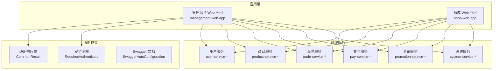
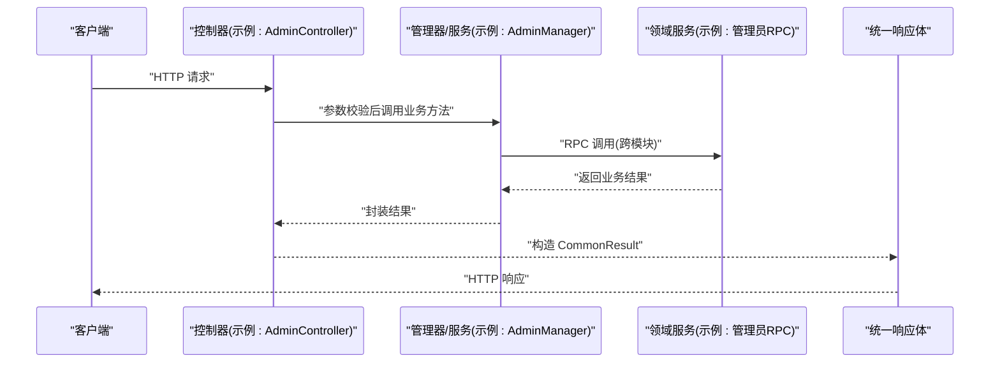
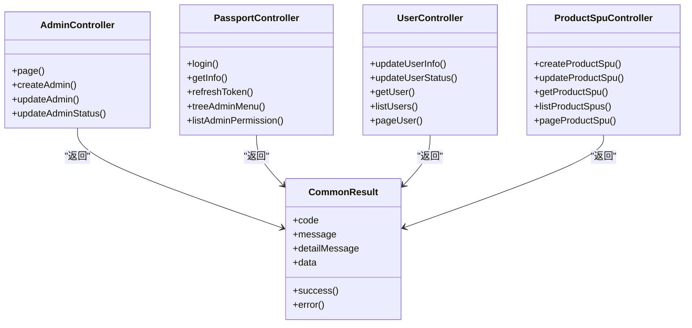

# API接口文档

<cite>
**本文引用的文件**
- [ManagementWebApplication.java](file://management-web-app/src/main/java/cn/iocoder/mall/managementweb/ManagementWebApplication.java)
- [ShopWebApplication.java](file://shop-web-app/src/main/java/cn/iocoder/mall/shopweb/ShopWebApplication.java)
- [CommonResult.java](file://common/common-framework/src/main/java/cn/iocoder/common/framework/vo/CommonResult.java)
- [RequiresAuthenticate.java](file://common/mall-security-annotations/src/main/java/cn/iocoder/security/annotations/RequiresAuthenticate.java)
- [AdminController.java](file://management-web-app/src/main/java/cn/iocoder/mall/managementweb/controller/admin/AdminController.java)
- [PassportController.java](file://management-web-app/src/main/java/cn/iocoder/mall/managementweb/controller/passport/PassportController.java)
- [UserController.java](file://management-web-app/src/main/java/cn/iocoder/mall/managementweb/controller/user/UserController.java)
- [ProductSpuController.java](file://management-web-app/src/main/java/cn/iocoder/mall/managementweb/controller/product/ProductSpuController.java)
- [PayTransactionController.java](file://management-web-app/src/main/java/cn/iocoder/mall/managementweb/controller/pay/PayTransactionController.java)
- [PermissionController.java](file://management-web-app/src/main/java/cn/iocoder/mall/managementweb/controller/permission/PermissionController.java)
- [RoleController.java](file://management-web-app/src/main/java/cn/iocoder/mall/managementweb/controller/permission/RoleController.java)
- [ResourceController.java](file://management-web-app/src/main/java/cn/iocoder/mall/managementweb/controller/permission/ResourceController.java)
- [ProductAttrController.java](file://management-web-app/src/main/java/cn/iocoder/mall/managementweb/controller/product/ProductAttrController.java)
- [ProductBrandController.java](file://management-web-app/src/main/java/cn/iocoder/mall/managementweb/controller/product/ProductBrandController.java)
- [ProductCategoryController.java](file://management-web-app/src/main/java/cn/iocoder/mall/managementweb/controller/product/ProductCategoryController.java)
- [PromotionActivityController.java](file://management-web-app/src/main/java/cn/iocoder/mall/managementweb/controller/promotion/activity/PromotionActivityController.java)
- [CouponTemplateController.java](file://management-web-app/src/main/java/cn/iocoder/mall/managementweb/controller/promotion/coupon/CouponTemplateController.java)
- [ProductRecommendController.java](file://management-web-app/src/main/java/cn/iocoder/mall/managementweb/controller/promotion/recommend/ProductRecommendController.java)
- [SystemAccessLogController.java](file://management-web-app/src/main/java/cn/iocoder/mall/managementweb/controller/systemlog/SystemAccessLogController.java)
- [SystemExceptionLogController.java](file://management-web-app/src/main/java/cn/iocoder/mall/managementweb/controller/systemlog/SystemExceptionLogController.java)
- [DataDictController.java](file://management-web-app/src/main/java/cn/iocoder/mall/managementweb/controller/datadict/DataDictController.java)
- [ErrorCodeController.java](file://management-web-app/src/main/java/cn/iocoder/mall/managementweb/controller/errorcode/ErrorCodeController.java)
- [DepartmentController.java](file://management-web-app/src/main/java/cn/iocoder/mall/managementweb/controller/admin/DepartmentController.java)
- [PayTransactionService.java](file://management-web-app/src/main/java/cn/iocoder/mall/managementweb/service/pay/transaction/PayTransactionService.java)
- [PayRefundService.java](file://moved/pay/pay-application/src/main/java/cn/iocoder/mall/pay/api/PayRefundService.java)
- [OrderService.java](file://moved/order/order-service-api02/src/main/java/cn/iocoder/mall/order/api/OrderService.java)
- [OrderCommentService.java](file://moved/order/order-service-api02/src/main/java/cn/iocoder/mall/order/api/OrderCommentService.java)
- [OrderLogisticsService.java](file://moved/order/order-service-api02/src/main/java/cn/iocoder/mall/order/api/OrderLogisticsService.java)
- [OrderReturnService.java](file://moved/order/order-service-api02/src/main/java/cn/iocoder/mall/order/api/OrderReturnService.java)
- [ProductSpuService.java](file://moved/product/product-service-api/src/main/java/cn/iocoder/mall/product/api/ProductSpuService.java)
- [ProductAttrService.java](file://moved/product/product-service-api/src/main/java/cn/iocoder/mall/product/api/ProductAttrService.java)
- [UserProductSpuCollectionsService.java](file://moved/product/product-service-api/src/main/java/cn/iocoder/mall/product/api/UserProductSpuCollectionsService.java)
- [SmsService.java](file://moved/system/system-service-api/src/main/java/cn/iocoder/mall/system/api/SmsService.java)
- [DataDictService.java](file://moved/system/system-service-api/src/main/java/cn/iocoder/mall/system/api/DataDictService.java)
- [PayTransactionServiceImpl.java](file://moved/pay/pay-application/src/main/java/cn/iocoder/mall/pay/biz/service/PayTransactionServiceImpl.java)
- [PayRefundServiceImpl.java](file://moved/pay/pay-application/src/main/java/cn/iocoder/mall/pay/biz/service/PayRefundServiceImpl.java)
- [PayErrorCodeConstants.java](file://pay-service-project/pay-service-api/src/main/java/cn/icode/mall/payservice/enums/PayErrorCodeConstants.java)
- [OrderErrorCodeConstants.java](file://trade-service-project/trade-service-api/src/main/java/cn/icode/mall/tradeservice/enums/OrderErrorCodeConstants.java)
- [ProductErrorCodeConstants.java](file://product-service-project/product-service-api/src/main/java/cn/icode/mall/productservice/enums/ProductErrorCodeConstants.java)
- [SystemErrorCodeConstants.java](file://system-service-project/system-service-api/src/main/java/cn/icode/mall/systemservice/enums/SystemErrorCodeConstants.java)
- [UserErrorCodeConstants.java](file://user-service-project/user-service-api/src/main/java/cn/icode/mall/userservice/enums/UserErrorCodeConstants.java)
- [PromotionErrorCodeConstants.java](file://promotion-service-project/promotion-service-api/src/main/java/cn/icode/mall/promotion/api/enums/PromotionErrorCodeConstants.java)
- [http-client.env.json](file://http-client.env.json)
</cite>

## 目录
1. [简介](#简介)
2. [项目结构](#项目结构)
3. [核心组件](#核心组件)
4. [架构总览](#架构总览)
5. [详细组件分析](#详细组件分析)
6. [依赖关系分析](#依赖关系分析)
7. [性能与稳定性](#性能与稳定性)
8. [故障排查指南](#故障排查指南)
9. [结论](#结论)
10. [附录](#附录)

## 简介
本文件为 Onemall 项目的对外 API 接口文档，覆盖管理后台与商城 Web 的 RESTful 接口，包括用户服务、商品服务、交易服务、支付服务、营销服务、系统服务等模块。文档提供接口规范、认证授权机制、错误码说明、请求/响应示例、限流与版本控制建议、测试方法与常见问题排查，并给出 OpenAPI 规范与 SDK 使用指引。

## 项目结构
- 后端采用多模块微服务架构，管理后台 Web 应用提供管理端 REST API；商城 Web 应用提供用户端 REST API；各领域服务以独立模块提供 RPC 接口。
- 通用框架提供统一响应体、异常体系与安全注解；Swagger 自动化文档配置在公共模块中启用。

图表来源
- [ManagementWebApplication.java:1-14](file://management-web-app/src/main/java/cn/iocoder/mall/managementweb/ManagementWebApplication.java#L1-L14)
- [ShopWebApplication.java:1-14](file://shop-web-app/src/main/java/cn/iocoder/mall/shopweb/ShopWebApplication.java#L1-L14)
- [CommonResult.java:1-155](file://common/common-framework/src/main/java/cn/iocoder/common/framework/vo/CommonResult.java#L1-L155)
- [RequiresAuthenticate.java:1-19](file://common/mall-security-annotations/src/main/java/cn/iocoder/security/annotations/RequiresAuthenticate.java#L1-L19)

章节来源
- [ManagementWebApplication.java:1-14](file://management-web-app/src/main/java/cn/iocoder/mall/managementweb/ManagementWebApplication.java#L1-L14)
- [ShopWebApplication.java:1-14](file://shop-web-app/src/main/java/cn/iocoder/mall/shopweb/ShopWebApplication.java#L1-L14)

## 核心组件
- 统一响应体：所有接口返回统一结构，包含 code、message、detailMessage、data 字段，便于前端与客户端统一处理。
- 安全注解：通过注解声明接口是否需要登录、是否需要特定权限，简化鉴权逻辑。
- DTO/VO：请求参数与响应对象清晰分离，提升接口可维护性与可测试性。

章节来源
- [CommonResult.java:1-155](file://common/common-framework/src/main/java/cn/iocoder/common/framework/vo/CommonResult.java#L1-L155)
- [RequiresAuthenticate.java:1-19](file://common/mall-security-annotations/src/main/java/cn/iocoder/security/annotations/RequiresAuthenticate.java#L1-L19)

## 架构总览
管理后台与商城 Web 通过各自的控制器暴露 REST API，控制器调用对应 Manager/RPC 服务完成业务处理，最终统一返回 CommonResult 结构。领域服务之间通过 RPC 接口交互，避免直接耦合。

图表来源
- [AdminController.java:34-49](file://management-web-app/src/main/java/cn/iocoder/mall/managementweb/controller/admin/AdminController.java#L34-L49)
- [CommonResult.java:66-72](file://common/common-framework/src/main/java/cn/iocoder/common/framework/vo/CommonResult.java#L66-L72)

## 详细组件分析

### 认证与授权
- 登录与令牌刷新：管理后台 Passport 接口提供登录、获取管理员信息、刷新令牌等能力。
- 权限控制：通过注解声明接口所需权限字符串，结合权限中心进行校验。
- 认证要求：部分接口需登录，部分接口无需登录，注解明确标注。

接口定义
- POST /passport/login
  - 业务含义：管理员账号密码登录，获取访问令牌与刷新令牌
  - 请求参数：用户名、密码等
  - 响应字段：访问令牌、刷新令牌等
  - 权限要求：无需登录
  - 示例：见“附录/请求示例”
- GET /passport/info
  - 业务含义：获取当前管理员基本信息
  - 请求参数：无
  - 响应字段：管理员信息
  - 权限要求：需登录
- POST /passport/refresh-token
  - 业务含义：使用刷新令牌换取新的访问令牌
  - 请求参数：refreshToken
  - 响应字段：新访问令牌
  - 权限要求：无需登录
- GET /passport/tree-admin-menu
  - 业务含义：获取当前管理员的菜单树
  - 请求参数：无
  - 响应字段：菜单树节点
  - 权限要求：需登录
- GET /passport/list-admin-permission
  - 业务含义：获取当前管理员的权限集合
  - 请求参数：无
  - 响应字段：权限字符串集合
  - 权限要求：需登录

章节来源
- [PassportController.java:31-65](file://management-web-app/src/main/java/cn/iocoder/mall/managementweb/controller/passport/PassportController.java#L31-L65)

### 管理员管理
- 管理员分页查询、创建、更新、状态变更等
- 权限标识：system:admin:*，用于细粒度授权

接口定义
- GET /admin/page
  - 业务含义：管理员分页查询
  - 请求参数：分页参数、筛选条件
  - 响应字段：分页结果
  - 权限要求：system:admin:page
- POST /admin/create
  - 业务含义：创建管理员
  - 请求参数：管理员创建信息、操作人IP
  - 响应字段：新增管理员ID
  - 权限要求：system:admin:create
- POST /admin/update
  - 业务含义：更新管理员信息
  - 请求参数：管理员更新信息
  - 响应字段：true/false
  - 权限要求：system:admin:update
- POST /admin/update-status
  - 业务含义：更新管理员状态
  - 请求参数：管理员ID、状态
  - 响应字段：true/false
  - 权限要求：system:admin:update-status

章节来源
- [AdminController.java:37-65](file://management-web-app/src/main/java/cn/iocoder/mall/managementweb/controller/admin/AdminController.java#L37-L65)

### 用户管理
- 用户信息更新、状态更新、单个/批量查询、分页查询

接口定义
- POST /user/update-info
  - 业务含义：更新用户信息
  - 请求参数：用户信息更新内容
  - 响应字段：true/false
- POST /user/update-status
  - 业务含义：更新用户状态
  - 请求参数：用户ID、状态
  - 响应字段：true/false
- GET /user/get
  - 业务含义：根据ID获取用户
  - 请求参数：userId
  - 响应字段：用户详情
- GET /user/list
  - 业务含义：批量获取用户
  - 请求参数：userIds
  - 响应字段：用户列表
- GET /user/page
  - 业务含义：用户分页查询
  - 请求参数：分页与筛选
  - 响应字段：分页结果

章节来源
- [UserController.java:34-66](file://management-web-app/src/main/java/cn/iocoder/mall/managementweb/controller/user/UserController.java#L34-L66)

### 商品管理
- SPU 创建、更新、查询、分页
- 属性、品牌、分类等维度的管理接口

接口定义
- POST /product-spu/create
  - 业务含义：创建商品SPU
  - 请求参数：SPU创建信息
  - 响应字段：新增SPU ID
- POST /product-spu/update
  - 业务含义：更新商品SPU
  - 请求参数：SPU更新信息
  - 响应字段：true/false
- GET /product-spu/get
  - 业务含义：根据ID获取SPU
  - 请求参数：productSpuId
  - 响应字段：SPU详情
- GET /product-spu/list
  - 业务含义：批量获取SPU
  - 请求参数：productSpuIds
  - 响应字段：SPU列表
- GET /product-spu/page
  - 业务含义：SPU分页查询
  - 请求参数：分页与筛选
  - 响应字段：分页结果

章节来源
- [ProductSpuController.java:34-69](file://management-web-app/src/main/java/cn/iocoder/mall/managementweb/controller/product/ProductSpuController.java#L34-L69)

属性、品牌、分类等接口
- 属性：GET/POST /product-attr/*
- 品牌：GET/POST /product-brand/*
- 分类：GET/POST /product-category/*

章节来源
- [ProductAttrController.java](file://management-web-app/src/main/java/cn/iocoder/mall/managementweb/controller/product/ProductAttrController.java)
- [ProductBrandController.java](file://management-web-app/src/main/java/cn/iocoder/mall/managementweb/controller/product/ProductBrandController.java)
- [ProductCategoryController.java](file://management-web-app/src/main/java/cn/iocoder/mall/managementweb/controller/product/ProductCategoryController.java)

### 支付与交易
- 支付交易：查询、退款等
- 交易订单：订单查询、物流、售后等

支付相关
- GET /pay-transaction/page
  - 业务含义：支付交易分页查询
  - 请求参数：分页与筛选
  - 响应字段：分页结果
- POST /pay-transaction/refund
  - 业务含义：发起退款
  - 请求参数：退款申请
  - 响应字段：退款结果

交易相关
- GET /order/page
  - 业务含义：订单分页查询
  - 请求参数：分页与筛选
  - 响应字段：分页结果
- GET /order/logistics/*
  - 业务含义：物流信息查询
  - 请求参数：订单号等
  - 响应字段：物流详情
- GET /order/return/*
  - 业务含义：退货/换货申请查询
  - 请求参数：订单号等
  - 响应字段：退货详情

章节来源
- [PayTransactionController.java](file://management-web-app/src/main/java/cn/iocoder/mall/managementweb/controller/pay/PayTransactionController.java)
- [PayTransactionService.java](file://management-web-app/src/main/java/cn/iocoder/mall/managementweb/service/pay/transaction/PayTransactionService.java)
- [OrderService.java](file://moved/order/order-service-api02/src/main/java/cn/iocoder/mall/order/api/OrderService.java)
- [OrderLogisticsService.java](file://moved/order/order-service-api02/src/main/java/cn/iocoder/mall/order/api/OrderLogisticsService.java)
- [OrderReturnService.java](file://moved/order/order-service-api02/src/main/java/cn/iocoder/mall/order/api/OrderReturnService.java)

### 营销管理
- 活动、优惠券、推荐位等

接口定义
- 活动：GET/POST /promotion-activity/*
- 优惠券模板：GET/POST /coupon-template/*
- 推荐位：GET/POST /product-recommend/*

章节来源
- [PromotionActivityController.java](file://management-web-app/src/main/java/cn/iocoder/mall/managementweb/controller/promotion/activity/PromotionActivityController.java)
- [CouponTemplateController.java](file://management-web-app/src/main/java/cn/iocoder/mall/managementweb/controller/promotion/coupon/CouponTemplateController.java)
- [ProductRecommendController.java](file://management-web-app/src/main/java/cn/iocoder/mall/managementweb/controller/promotion/recommend/ProductRecommendController.java)

### 系统日志与字典
- 访问日志、异常日志、数据字典、错误码管理

接口定义
- 访问日志：GET /system-access-log/*
- 异常日志：GET /system-exception-log/*
- 数据字典：GET/POST /data-dict/*
- 错误码：GET/POST /error-code/*

章节来源
- [SystemAccessLogController.java](file://management-web-app/src/main/java/cn/iocoder/mall/managementweb/controller/systemlog/SystemAccessLogController.java)
- [SystemExceptionLogController.java](file://management-web-app/src/main/java/cn/iocoder/mall/managementweb/controller/systemlog/SystemExceptionLogController.java)
- [DataDictController.java](file://management-web-app/src/main/java/cn/iocoder/mall/managementweb/controller/datadict/DataDictController.java)
- [ErrorCodeController.java](file://management-web-app/src/main/java/cn/iocoder/mall/managementweb/controller/errorcode/ErrorCodeController.java)

### 权限与资源
- 权限、角色、资源的增删改查

接口定义
- 权限：GET/POST /permission/*
- 角色：GET/POST /role/*
- 资源：GET/POST /resource/*

章节来源
- [PermissionController.java](file://management-web-app/src/main/java/cn/iocoder/mall/managementweb/controller/permission/PermissionController.java)
- [RoleController.java](file://management-web-app/src/main/java/cn/iocoder/mall/managementweb/controller/permission/RoleController.java)
- [ResourceController.java](file://management-web-app/src/main/java/cn/iocoder/mall/managementweb/controller/permission/ResourceController.java)

### 管理部门
- GET/POST /department/*

章节来源
- [DepartmentController.java](file://management-web-app/src/main/java/cn/iocoder/mall/managementweb/controller/admin/DepartmentController.java)

## 依赖关系分析
- 控制器依赖管理器或 RPC 服务，管理器再依赖领域服务接口，形成清晰的分层。
- 统一响应体贯穿所有接口，确保返回一致性。
- 安全注解在控制器方法上声明，减少重复鉴权代码。

图表来源
- [AdminController.java:34-65](file://management-web-app/src/main/java/cn/iocoder/mall/managementweb/controller/admin/AdminController.java#L34-L65)
- [PassportController.java:31-65](file://management-web-app/src/main/java/cn/iocoder/mall/managementweb/controller/passport/PassportController.java#L31-L65)
- [UserController.java:34-66](file://management-web-app/src/main/java/cn/iocoder/mall/managementweb/controller/user/UserController.java#L34-L66)
- [ProductSpuController.java:34-69](file://management-web-app/src/main/java/cn/iocoder/mall/managementweb/controller/product/ProductSpuController.java#L34-L69)
- [CommonResult.java:17-105](file://common/common-framework/src/main/java/cn/iocoder/common/framework/vo/CommonResult.java#L17-L105)

## 性能与稳定性
- 统一响应体与异常体系：通过统一的错误码与消息，便于前端快速定位问题并做降级处理。
- 分页查询：建议对大列表接口使用分页参数，避免一次性返回过多数据。
- 幂等设计：对更新类接口建议引入幂等键，防止重复提交导致的状态不一致。
- 缓存策略：对高频只读数据（如商品详情、字典项）建议引入缓存，降低数据库压力。
- 限流与熔断：建议在网关层或服务层增加限流与熔断策略，保障系统稳定性。

## 故障排查指南
- 常见错误码
  - 成功：code=200，message为空或简述成功
  - 参数错误：业务侧校验失败，返回具体错误码与message
  - 业务异常：业务规则触发，返回业务错误码与message
  - 全局异常：系统级错误，返回全局错误码与detailMessage
- 排查步骤
  - 检查请求参数类型与必填项
  - 确认权限与登录状态
  - 查看响应中的错误码与detailMessage
  - 结合系统日志与异常日志定位问题
- 常见问题
  - 401/403：未登录或权限不足，检查登录态与权限字符串
  - 400：参数校验失败，核对DTO字段与范围
  - 5xx：服务异常，查看服务端日志与链路追踪

章节来源
- [CommonResult.java:132-147](file://common/common-framework/src/main/java/cn/iocoder/common/framework/vo/CommonResult.java#L132-L147)

## 结论
本接口文档基于 Onemall 项目现有控制器与服务接口整理而成，覆盖管理后台与商城 Web 的主要业务场景。建议在生产环境中配合网关层进行统一鉴权、限流与监控，并持续完善 OpenAPI 规范与 SDK 示例，提升对接效率与稳定性。

## 附录

### 统一响应体结构
- 字段
  - code：整数，错误码
  - message：字符串，用户可见提示
  - detailMessage：字符串，内部调试信息
  - data：任意类型，业务数据
- 成功示例：code=200，message为空，data为业务对象
- 失败示例：非200错误码，message为错误描述

章节来源
- [CommonResult.java:17-105](file://common/common-framework/src/main/java/cn/iocoder/common/framework/vo/CommonResult.java#L17-L105)

### 认证与授权机制
- 登录流程
  - POST /passport/login：提交账号密码获取令牌
  - GET /passport/info：获取当前管理员信息
  - POST /passport/refresh-token：使用refreshToken刷新访问令牌
- 权限控制
  - 接口通过注解声明所需权限字符串
  - 管理端菜单与权限由权限中心下发

章节来源
- [PassportController.java:31-65](file://management-web-app/src/main/java/cn/iocoder/mall/managementweb/controller/passport/PassportController.java#L31-L65)
- [RequiresAuthenticate.java:1-19](file://common/mall-security-annotations/src/main/java/cn/iocoder/security/annotations/RequiresAuthenticate.java#L1-L19)

### OpenAPI 规范与 SDK 使用
- OpenAPI 规范
  - 可基于 Swagger 自动化文档生成 OpenAPI YAML/JSON
  - 建议在公共模块启用 Swagger 配置
- SDK 使用
  - 建议按模块生成 SDK，封装统一的 HTTP 客户端与错误处理
  - SDK 内置令牌刷新与重试策略

### 接口测试方法与工具
- Postman/VSCode REST Client
  - 使用环境变量管理基础URL、令牌等
  - 参考环境文件：[http-client.env.json](file://http-client.env.json)
- 场景化测试
  - 登录获取令牌后，携带令牌调用受保护接口
  - 批量接口测试：构造大量ID列表，验证分页与过滤
- 日志与追踪
  - 关注系统访问日志与异常日志，定位问题根因

章节来源
- [http-client.env.json](file://http-client.env.json)

### 错误码常量参考
- 支付服务：PayErrorCodeConstants
- 交易服务：OrderErrorCodeConstants
- 商品服务：ProductErrorCodeConstants
- 系统服务：SystemErrorCodeConstants
- 用户服务：UserErrorCodeConstants
- 营销服务：PromotionErrorCodeConstants

章节来源
- [PayErrorCodeConstants.java](file://pay-service-project/pay-service-api/src/main/java/cn/icode/mall/payservice/enums/PayErrorCodeConstants.java)
- [OrderErrorCodeConstants.java](file://trade-service-project/trade-service-api/src/main/java/cn/icode/mall/tradeservice/enums/OrderErrorCodeConstants.java)
- [ProductErrorCodeConstants.java](file://product-service-project/product-service-api/src/main/java/cn/icode/mall/productservice/enums/ProductErrorCodeConstants.java)
- [SystemErrorCodeConstants.java](file://system-service-project/system-service-api/src/main/java/cn/icode/mall/systemservice/enums/SystemErrorCodeConstants.java)
- [UserErrorCodeConstants.java](file://user-service-project/user-service-api/src/main/java/cn/icode/mall/userservice/enums/UserErrorCodeConstants.java)
- [PromotionErrorCodeConstants.java](file://promotion-service-project/promotion-service-api/src/main/java/cn/icode/mall/promotion/api/enums/PromotionErrorCodeConstants.java)