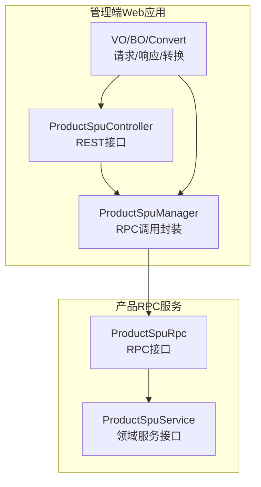
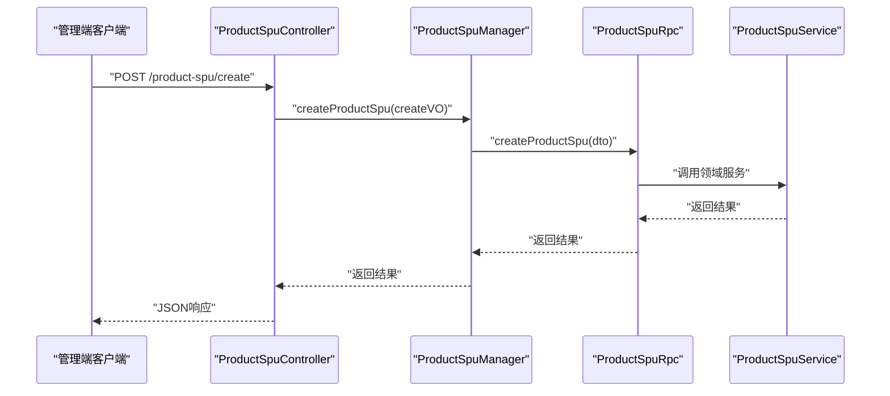
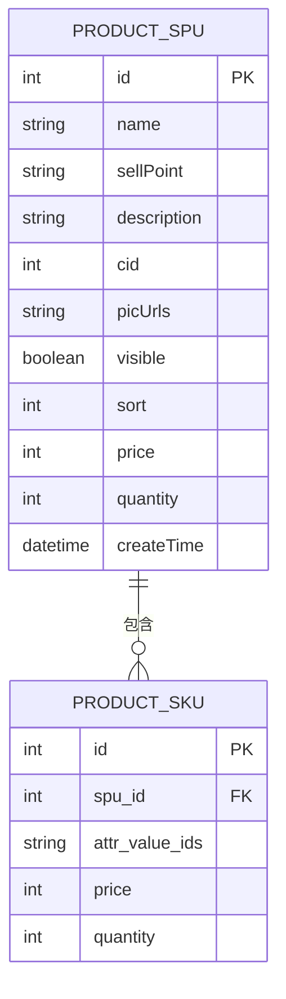
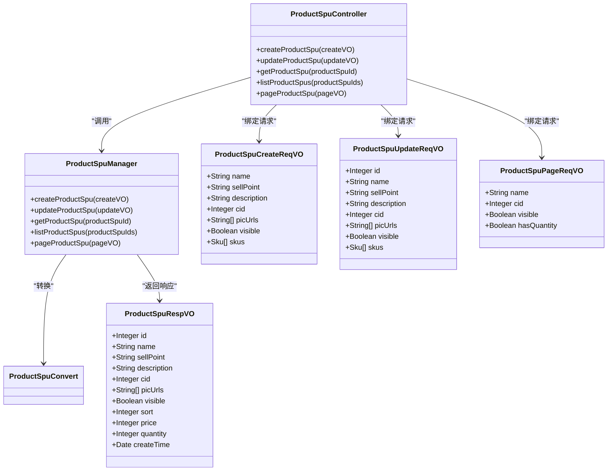
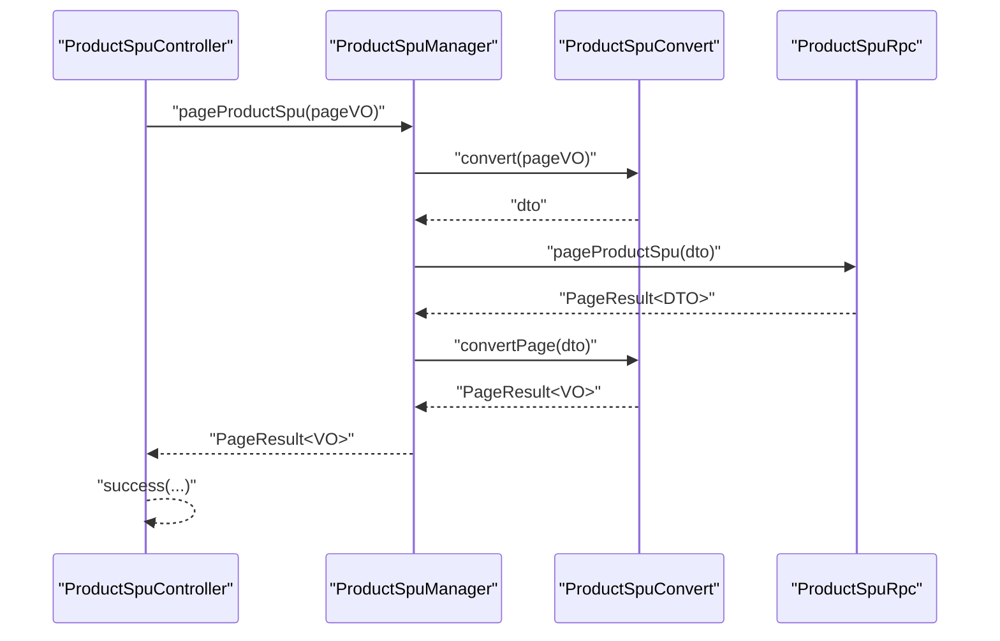
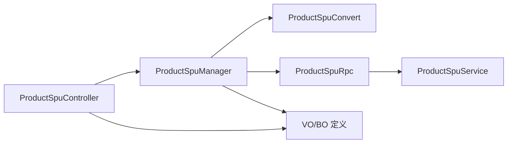

# 商品SPU接口

<cite>
**本文引用的文件**
- [ProductSpuController.java](file://management-web-app/src/main/java/cn/iocoder/mall/managementweb/controller/product/ProductSpuController.java)
- [ProductSpuManager.java](file://management-web-app/src/main/java/cn/iocoder/mall/managementweb/manager/product/ProductSpuManager.java)
- [ProductSpuCreateReqVO.java](file://management-web-app/src/main/java/cn/iocoder/mall/managementweb/controller/product/vo/spu/ProductSpuCreateReqVO.java)
- [ProductSpuUpdateReqVO.java](file://management-web-app/src/main/java/cn/iocoder/mall/managementweb/controller/product/vo/spu/ProductSpuUpdateReqVO.java)
- [ProductSpuPageReqVO.java](file://management-web-app/src/main/java/cn/iocoder/mall/managementweb/controller/product/vo/spu/ProductSpuPageReqVO.java)
- [ProductSpuRespVO.java](file://management-web-app/src/main/java/cn/iocoder/mall/managementweb/controller/product/vo/spu/ProductSpuRespVO.java)
- [ProductSpuConvert.java](file://management-web-app/src/main/java/cn/iocoder/mall/managementweb/convert/product/ProductSpuConvert.java)
- [ProductSpuRpc.java](file://product-service-project/product-service-api/src/main/java/cn/iocoder/mall/productservice/rpc/spu/ProductSpuRpc.java)
- [ProductSpuService.java](file://moved/product/product-service-api/src/main/java/cn/iocoder/mall/product/api/ProductSpuService.java)
- [ProductSpuBO.java](file://moved/product/product-biz/src/main/java/cn/iocoder/mall/product/biz/bo/product/ProductSpuBO.java)
- [ProductSkuDetailBO.java](file://moved/product/product-biz/src/main/java/cn/iocoder/mall/product/biz/bo/product/ProductSkuDetailBO.java)
</cite>

## 目录
1. [简介](#简介)
2. [项目结构](#项目结构)
3. [核心组件](#核心组件)
4. [架构总览](#架构总览)
5. [详细组件分析](#详细组件分析)
6. [依赖分析](#依赖分析)
7. [性能考虑](#性能考虑)
8. [故障排查指南](#故障排查指南)
9. [结论](#结论)
10. [附录](#附录)

## 简介
本文件为“商品SPU接口”模块的全面API文档，覆盖SPU（商品标准单元）在管理后台侧的完整能力：创建、更新、查询单个与批量、分页查询，以及与SKU的关系说明。文档同时给出SPU与SKU的数据模型、图片与规格信息、价格与库存字段的定义，并提供接口规范、调用流程、最佳实践与常见问题排查建议。

## 项目结构
围绕SPU的管理接口，主要涉及三层：
- 控制层：管理端Web应用暴露REST接口
- 管理器层：封装RPC调用与参数转换
- 服务层：产品域服务（含SPU与SKU相关BO）

图表来源
- [ProductSpuController.java:1-75](file://management-web-app/src/main/java/cn/iocoder/mall/managementweb/controller/product/ProductSpuController.java#L1-L75)
- [ProductSpuManager.java:1-85](file://management-web-app/src/main/java/cn/iocoder/mall/managementweb/manager/product/ProductSpuManager.java#L1-L85)
- [ProductSpuRpc.java](file://product-service-project/product-service-api/src/main/java/cn/iocoder/mall/productservice/rpc/spu/ProductSpuRpc.java)
- [ProductSpuService.java:1-27](file://moved/product/product-service-api/src/main/java/cn/iocoder/mall/product/api/ProductSpuService.java#L1-L27)

章节来源
- [ProductSpuController.java:1-75](file://management-web-app/src/main/java/cn/iocoder/mall/managementweb/controller/product/ProductSpuController.java#L1-L75)
- [ProductSpuManager.java:1-85](file://management-web-app/src/main/java/cn/iocoder/mall/managementweb/manager/product/ProductSpuManager.java#L1-L85)

## 核心组件
- 控制器：提供SPU的创建、更新、查询、列表、分页等REST接口
- 管理器：负责参数校验后的对象转换与RPC调用
- VO/BO/Convert：定义请求/响应结构与转换逻辑
- RPC接口：面向产品域的RPC服务入口

章节来源
- [ProductSpuController.java:25-75](file://management-web-app/src/main/java/cn/iocoder/mall/managementweb/controller/product/ProductSpuController.java#L25-L75)
- [ProductSpuManager.java:20-85](file://management-web-app/src/main/java/cn/iocoder/mall/managementweb/manager/product/ProductSpuManager.java#L20-L85)
- [ProductSpuCreateReqVO.java:1-74](file://management-web-app/src/main/java/cn/iocoder/mall/managementweb/controller/product/vo/spu/ProductSpuCreateReqVO.java#L1-L74)
- [ProductSpuUpdateReqVO.java:1-78](file://management-web-app/src/main/java/cn/iocoder/mall/managementweb/controller/product/vo/spu/ProductSpuUpdateReqVO.java#L1-L78)
- [ProductSpuPageReqVO.java:1-24](file://management-web-app/src/main/java/cn/iocoder/mall/managementweb/controller/product/vo/spu/ProductSpuPageReqVO.java#L1-L24)
- [ProductSpuRespVO.java:1-35](file://management-web-app/src/main/java/cn/iocoder/mall/managementweb/controller/product/vo/spu/ProductSpuRespVO.java#L1-L35)
- [ProductSpuConvert.java](file://management-web-app/src/main/java/cn/iocoder/mall/managementweb/convert/product/ProductSpuConvert.java)

## 架构总览
SPU管理接口采用“控制层-管理器层-RPC服务层”的分层设计，控制层接收HTTP请求并进行参数校验，管理器层完成对象转换与错误处理，最终通过RPC调用产品域服务。

图表来源
- [ProductSpuController.java:34-38](file://management-web-app/src/main/java/cn/iocoder/mall/managementweb/controller/product/ProductSpuController.java#L34-L38)
- [ProductSpuManager.java:32-36](file://management-web-app/src/main/java/cn/iocoder/mall/managementweb/manager/product/ProductSpuManager.java#L32-L36)
- [ProductSpuRpc.java](file://product-service-project/product-service-api/src/main/java/cn/iocoder/mall/productservice/rpc/spu/ProductSpuRpc.java)
- [ProductSpuService.java:12-27](file://moved/product/product-service-api/src/main/java/cn/iocoder/mall/product/api/ProductSpuService.java#L12-L27)

## 详细组件分析

### 接口清单与规范

- 创建SPU
  - 方法：POST
  - 路径：/product-spu/create
  - 请求体：ProductSpuCreateReqVO
  - 返回：CommonResult<Integer>（SPU编号）
  - 关键约束：名称/卖点/描述/分类/主图/可见性/SKU列表必填；SKU内规格值数组、价格、库存均需校验
  - 说明：创建成功后返回SPU编号

- 更新SPU
  - 方法：POST
  - 路径：/product-spu/update
  - 请求体：ProductSpuUpdateReqVO
  - 返回：CommonResult<Boolean>（true表示成功）
  - 关键约束：id必填；其余字段与创建一致

- 查询单个SPU
  - 方法：GET
  - 路径：/product-spu/get
  - 参数：productSpuId（整型，必填）
  - 返回：CommonResult<ProductSpuRespVO>

- 查询多个SPU
  - 方法：GET
  - 路径：/product-spu/list
  - 参数：productSpuIds（整型列表，必填）
  - 返回：CommonResult<List<ProductSpuRespVO>>

- 分页查询SPU
  - 方法：GET
  - 路径：/product-spu/page
  - 参数：ProductSpuPageReqVO（支持按名称模糊、分类、可见性、是否有库存筛选）
  - 返回：CommonResult<PageResult<ProductSpuRespVO>>
  - 状态说明：全部、在售中、已售罄、仓库中由可见性和库存组合表达

章节来源
- [ProductSpuController.java:34-69](file://management-web-app/src/main/java/cn/iocoder/mall/managementweb/controller/product/ProductSpuController.java#L34-L69)
- [ProductSpuCreateReqVO.java:45-71](file://management-web-app/src/main/java/cn/iocoder/mall/managementweb/controller/product/vo/spu/ProductSpuCreateReqVO.java#L45-L71)
- [ProductSpuUpdateReqVO.java:45-75](file://management-web-app/src/main/java/cn/iocoder/mall/managementweb/controller/product/vo/spu/ProductSpuUpdateReqVO.java#L45-L75)
- [ProductSpuPageReqVO.java:14-21](file://management-web-app/src/main/java/cn/iocoder/mall/managementweb/controller/product/vo/spu/ProductSpuPageReqVO.java#L14-L21)
- [ProductSpuRespVO.java:11-32](file://management-web-app/src/main/java/cn/iocoder/mall/managementweb/controller/product/vo/spu/ProductSpuRespVO.java#L11-L32)

### 数据模型与关系

- SPU基本信息
  - 字段：id、name、sellPoint、description、cid、picUrls、visible、sort、price、quantity、createTime
  - 说明：price与quantity为聚合值（来自SKU的最小价格与库存合计），visible用于控制上下架

- SKU信息（嵌套于SPU）
  - 字段：attrValueIds（规格值数组）、price（单位：分）、quantity（库存数量）
  - 说明：SKU通过规格值数组唯一确定一个可购买的变体

- SPU与SKU的关系
  - 一张SPU可包含多个SKU，SKU通过attrValueIds组合形成不同的规格变体
  - SPU层展示聚合后的最低价格与总库存

图表来源
- [ProductSpuRespVO.java:11-32](file://management-web-app/src/main/java/cn/iocoder/mall/managementweb/controller/product/vo/spu/ProductSpuRespVO.java#L11-L32)
- [ProductSpuCreateReqVO.java:23-43](file://management-web-app/src/main/java/cn/iocoder/mall/managementweb/controller/product/vo/spu/ProductSpuCreateReqVO.java#L23-L43)
- [ProductSpuBO.java:19-72](file://moved/product/product-biz/src/main/java/cn/iocoder/mall/product/biz/bo/product/ProductSpuBO.java#L19-L72)

章节来源
- [ProductSpuRespVO.java:9-34](file://management-web-app/src/main/java/cn/iocoder/mall/managementweb/controller/product/vo/spu/ProductSpuRespVO.java#L9-L34)
- [ProductSpuCreateReqVO.java:16-71](file://management-web-app/src/main/java/cn/iocoder/mall/managementweb/controller/product/vo/spu/ProductSpuCreateReqVO.java#L16-L71)
- [ProductSpuBO.java:14-74](file://moved/product/product-biz/src/main/java/cn/iocoder/mall/product/biz/bo/product/ProductSpuBO.java#L14-L74)

### 类图（代码级）

图表来源
- [ProductSpuController.java:29-75](file://management-web-app/src/main/java/cn/iocoder/mall/managementweb/controller/product/ProductSpuController.java#L29-L75)
- [ProductSpuManager.java:21-85](file://management-web-app/src/main/java/cn/iocoder/mall/managementweb/manager/product/ProductSpuManager.java#L21-L85)
- [ProductSpuCreateReqVO.java:16-71](file://management-web-app/src/main/java/cn/iocoder/mall/managementweb/controller/product/vo/spu/ProductSpuCreateReqVO.java#L16-L71)
- [ProductSpuUpdateReqVO.java:16-75](file://management-web-app/src/main/java/cn/iocoder/mall/managementweb/controller/product/vo/spu/ProductSpuUpdateReqVO.java#L16-L75)
- [ProductSpuPageReqVO.java:12-23](file://management-web-app/src/main/java/cn/iocoder/mall/managementweb/controller/product/vo/spu/ProductSpuPageReqVO.java#L12-L23)
- [ProductSpuRespVO.java:9-34](file://management-web-app/src/main/java/cn/iocoder/mall/managementweb/controller/product/vo/spu/ProductSpuRespVO.java#L9-L34)
- [ProductSpuConvert.java](file://management-web-app/src/main/java/cn/iocoder/mall/managementweb/convert/product/ProductSpuConvert.java)

### 处理流程与时序

- 创建SPU流程
  - 输入：ProductSpuCreateReqVO（含SPU基础信息与SKU列表）
  - 转换：ProductSpuConvert将VO转为RPC DTO
  - 调用：ProductSpuRpc.createProductSpu(...)
  - 返回：CommonResult<Integer>（SPU编号）

- 分页查询流程
  - 输入：ProductSpuPageReqVO（分页+筛选）
  - 转换：ProductSpuConvert.convert(pageVO)
  - 调用：ProductSpuRpc.pageProductSpu(...)
  - 返回：PageResult<ProductSpuRespVO>

图表来源
- [ProductSpuController.java:61-69](file://management-web-app/src/main/java/cn/iocoder/mall/managementweb/controller/product/ProductSpuController.java#L61-L69)
- [ProductSpuManager.java:78-82](file://management-web-app/src/main/java/cn/iocoder/mall/managementweb/manager/product/ProductSpuManager.java#L78-L82)
- [ProductSpuConvert.java](file://management-web-app/src/main/java/cn/iocoder/mall/managementweb/convert/product/ProductSpuConvert.java)

### 筛选与状态说明（分页）
- 支持筛选字段：名称（模糊）、分类、可见性、是否有库存
- 状态组合：
  - 全部：无筛选
  - 在售中：visible=true 且 hasQuantity=true
  - 已售罄：visible=true 且 hasQuantity=false
  - 仓库中：visible=false

章节来源
- [ProductSpuController.java:61-69](file://management-web-app/src/main/java/cn/iocoder/mall/managementweb/controller/product/ProductSpuController.java#L61-L69)
- [ProductSpuPageReqVO.java:14-21](file://management-web-app/src/main/java/cn/iocoder/mall/managementweb/controller/product/vo/spu/ProductSpuPageReqVO.java#L14-L21)

### 错误处理与返回约定
- 统一返回包装：CommonResult<T>
- 管理器层对RPC返回执行checkError()，异常将被抛出并由全局异常处理机制统一拦截
- 成功时返回data或布尔true

章节来源
- [ProductSpuManager.java:32-46](file://management-web-app/src/main/java/cn/iocoder/mall/managementweb/manager/product/ProductSpuManager.java#L32-L46)
- [ProductSpuController.java:36-44](file://management-web-app/src/main/java/cn/iocoder/mall/managementweb/controller/product/ProductSpuController.java#L36-L44)

## 依赖分析
- 控制层依赖管理器层
- 管理器层依赖RPC接口与转换器
- RPC接口对接产品域服务接口
- VO/BO/Convert贯穿各层，承担数据契约与转换职责

图表来源
- [ProductSpuController.java:29-75](file://management-web-app/src/main/java/cn/iocoder/mall/managementweb/controller/product/ProductSpuController.java#L29-L75)
- [ProductSpuManager.java:21-85](file://management-web-app/src/main/java/cn/iocoder/mall/managementweb/manager/product/ProductSpuManager.java#L21-L85)
- [ProductSpuRpc.java](file://product-service-project/product-service-api/src/main/java/cn/iocoder/mall/productservice/rpc/spu/ProductSpuRpc.java)
- [ProductSpuService.java:12-27](file://moved/product/product-service-api/src/main/java/cn/iocoder/mall/product/api/ProductSpuService.java#L12-L27)

章节来源
- [ProductSpuController.java:29-75](file://management-web-app/src/main/java/cn/iocoder/mall/managementweb/controller/product/ProductSpuController.java#L29-L75)
- [ProductSpuManager.java:21-85](file://management-web-app/src/main/java/cn/iocoder/mall/managementweb/manager/product/ProductSpuManager.java#L21-L85)

## 性能考虑
- 分页查询建议：合理设置分页大小与筛选条件，避免全量扫描
- 批量查询：使用list接口一次性获取多SPU，减少多次往返
- 聚合字段：SPU层price/quantity为SKU聚合值，避免重复计算
- 图片列表：picUrls为多图地址集合，注意前端渲染与CDN缓存策略

## 故障排查指南
- 参数校验失败：检查请求体字段是否满足非空与范围约束（如价格与库存最小值）
- RPC调用异常：确认RPC版本配置与服务注册中心可用性
- 返回数据为空：核对筛选条件与数据是否存在
- 上下架状态不生效：确认visible字段与hasQuantity组合逻辑

章节来源
- [ProductSpuCreateReqVO.java:28-41](file://management-web-app/src/main/java/cn/iocoder/mall/managementweb/controller/product/vo/spu/ProductSpuCreateReqVO.java#L28-L41)
- [ProductSpuUpdateReqVO.java:28-41](file://management-web-app/src/main/java/cn/iocoder/mall/managementweb/controller/product/vo/spu/ProductSpuUpdateReqVO.java#L28-L41)
- [ProductSpuManager.java:32-46](file://management-web-app/src/main/java/cn/iocoder/mall/managementweb/manager/product/ProductSpuManager.java#L32-L46)

## 结论
本文档系统梳理了SPU管理接口的REST规范、数据模型、调用流程与最佳实践。通过清晰的分层设计与严格的参数校验，确保SPU创建、更新、查询与分页能力稳定可靠。实际接入时请严格遵循接口规范与数据模型，结合业务场景选择合适的筛选与分页策略。

## 附录

### SPU与SKU关系速览
- SPU：抽象的商品维度，承载基础信息与聚合价格/库存
- SKU：具体可购买的规格变体，通过attrValueIds组合体现差异
- 关系：一对多，SPU包含多个SKU

章节来源
- [ProductSpuBO.java:19-72](file://moved/product/product-biz/src/main/java/cn/iocoder/mall/product/biz/bo/product/ProductSpuBO.java#L19-L72)
- [ProductSkuDetailBO.java:19-39](file://moved/product/product-biz/src/main/java/cn/iocoder/mall/product/biz/bo/product/ProductSkuDetailBO.java#L19-L39)