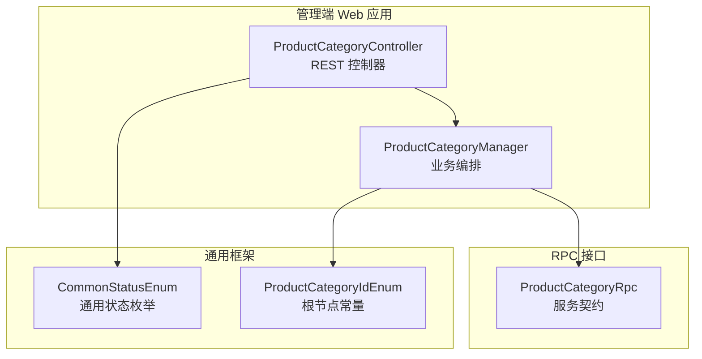
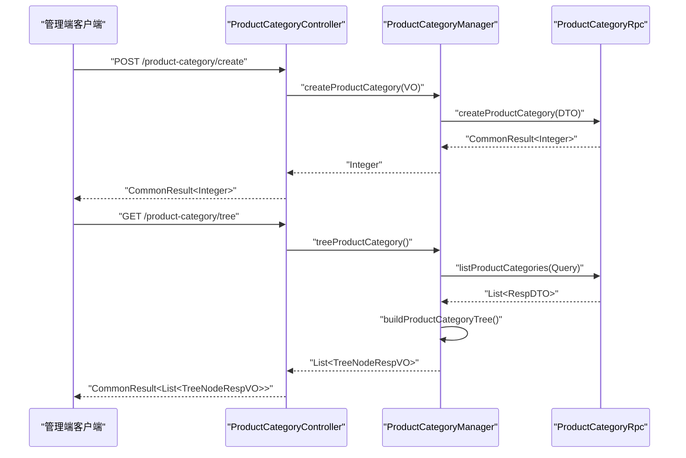
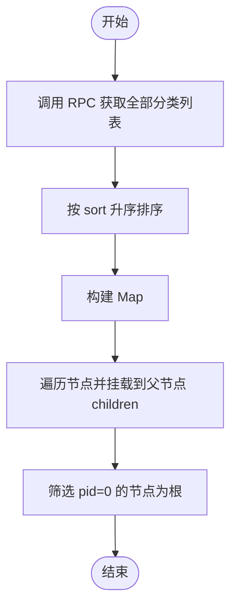
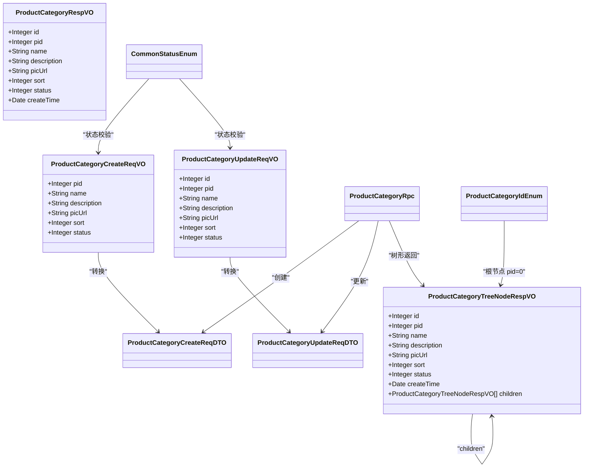
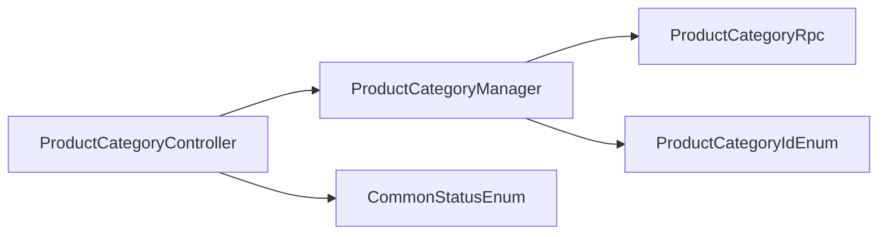

# 商品分类接口

<cite>
**本文引用的文件**
- [ProductCategoryController.java](file://management-web-app/src/main/java/cn/iocoder/mall/managementweb/controller/product/ProductCategoryController.java)
- [ProductCategoryManager.java](file://management-web-app/src/main/java/cn/iocoder/mall/managementweb/manager/product/ProductCategoryManager.java)
- [ProductCategoryRpc.java](file://product-service-project/product-service-api/src/main/java/cn/iocoder/mall/productservice/rpc/category/ProductCategoryRpc.java)
- [ProductCategoryCreateReqDTO.java](file://product-service-project/product-service-api/src/main/java/cn/iocoder/mall/productservice/rpc/category/dto/ProductCategoryCreateReqDTO.java)
- [ProductCategoryUpdateReqDTO.java](file://product-service-project/product-service-api/src/main/java/cn/iocoder/mall/productservice/rpc/category/dto/ProductCategoryUpdateReqDTO.java)
- [ProductCategoryCreateReqVO.java](file://management-web-app/src/main/java/cn/iocoder/mall/managementweb/controller/product/vo/category/ProductCategoryCreateReqVO.java)
- [ProductCategoryUpdateReqVO.java](file://management-web-app/src/main/java/cn/iocoder/mall/managementweb/controller/product/vo/category/ProductCategoryUpdateReqVO.java)
- [ProductCategoryTreeNodeRespVO.java](file://management-web-app/src/main/java/cn/iocoder/mall/managementweb/controller/product/vo/category/ProductCategoryTreeNodeRespVO.java)
- [ProductCategoryRespVO.java](file://management-web-app/src/main/java/cn/iocoder/mall/managementweb/controller/product/vo/category/ProductCategoryRespVO.java)
- [ProductCategoryIdEnum.java](file://product-service-project/product-service-api/src/main/java/cn/iocoder/mall/productservice/enums/category/ProductCategoryIdEnum.java)
- [CommonStatusEnum.java](file://common/common-framework/src/main/java/cn/iocoder/common/framework/enums/CommonStatusEnum.java)
</cite>

## 目录
1. [简介](#简介)
2. [项目结构](#项目结构)
3. [核心组件](#核心组件)
4. [架构总览](#架构总览)
5. [详细组件分析](#详细组件分析)
6. [依赖关系分析](#依赖关系分析)
7. [性能考虑](#性能考虑)
8. [故障排查指南](#故障排查指南)
9. [结论](#结论)
10. [附录](#附录)

## 简介
本文件面向“商品分类”接口模块，提供完整的API文档与技术说明。重点覆盖以下方面：
- 树形结构管理：创建、更新、删除、查询、层级关系维护
- 数据模型设计：分类字段、父子关系、状态管理
- 业务规则：层级限制（根节点）、名称唯一性（系统内）、排序控制
- 分类树构建算法：递归查询与树形组装流程
- 实际使用示例与性能优化建议

## 项目结构
商品分类接口采用“管理端 Web 应用 + RPC 接口 + 服务端实现”的分层架构：
- 管理端 Web 控制器负责权限校验与请求转发
- 管理端 Manager 负责调用 RPC 接口并进行树形组装
- RPC 接口定义服务契约
- 服务端实现具体的数据访问与业务逻辑

图表来源
- [ProductCategoryController.java:1-65](file://management-web-app/src/main/java/cn/iocoder/mall/managementweb/controller/product/ProductCategoryController.java#L1-L65)
- [ProductCategoryManager.java:1-107](file://management-web-app/src/main/java/cn/iocoder/mall/managementweb/manager/product/ProductCategoryManager.java#L1-L107)
- [ProductCategoryRpc.java:1-63](file://product-service-project/product-service-api/src/main/java/cn/iocoder/mall/productservice/rpc/category/ProductCategoryRpc.java#L1-L63)
- [CommonStatusEnum.java](file://common/common-framework/src/main/java/cn/iocoder/common/framework/enums/CommonStatusEnum.java)
- [ProductCategoryIdEnum.java:1-24](file://product-service-project/product-service-api/src/main/java/cn/iocoder/mall/productservice/enums/category/ProductCategoryIdEnum.java#L1-L24)

章节来源
- [ProductCategoryController.java:1-65](file://management-web-app/src/main/java/cn/iocoder/mall/managementweb/controller/product/ProductCategoryController.java#L1-L65)
- [ProductCategoryManager.java:1-107](file://management-web-app/src/main/java/cn/iocoder/mall/managementweb/manager/product/ProductCategoryManager.java#L1-L107)
- [ProductCategoryRpc.java:1-63](file://product-service-project/product-service-api/src/main/java/cn/iocoder/mall/productservice/rpc/category/ProductCategoryRpc.java#L1-L63)
- [ProductCategoryIdEnum.java:1-24](file://product-service-project/product-service-api/src/main/java/cn/iocoder/mall/productservice/enums/category/ProductCategoryIdEnum.java#L1-L24)
- [CommonStatusEnum.java](file://common/common-framework/src/main/java/cn/iocoder/common/framework/enums/CommonStatusEnum.java)

## 核心组件
- REST 控制器：提供 HTTP 接口，负责鉴权与参数校验
- Manager：封装 RPC 调用与树形构建逻辑
- RPC 接口：定义分类 CRUD、查询与树形获取能力
- VO/DTO：请求与响应的数据载体
- 枚举：状态与根节点标识

章节来源
- [ProductCategoryController.java:24-62](file://management-web-app/src/main/java/cn/iocoder/mall/managementweb/controller/product/ProductCategoryController.java#L24-L62)
- [ProductCategoryManager.java:22-104](file://management-web-app/src/main/java/cn/iocoder/mall/managementweb/manager/product/ProductCategoryManager.java#L22-L104)
- [ProductCategoryRpc.java:15-62](file://product-service-project/product-service-api/src/main/java/cn/iocoder/mall/productservice/rpc/category/ProductCategoryRpc.java#L15-L62)
- [ProductCategoryCreateReqVO.java:14-34](file://management-web-app/src/main/java/cn/iocoder/mall/managementweb/controller/product/vo/category/ProductCategoryCreateReqVO.java#L14-L34)
- [ProductCategoryUpdateReqVO.java:14-37](file://management-web-app/src/main/java/cn/iocoder/mall/managementweb/controller/product/vo/category/ProductCategoryUpdateReqVO.java#L14-L37)
- [ProductCategoryTreeNodeRespVO.java:12-36](file://management-web-app/src/main/java/cn/iocoder/mall/managementweb/controller/product/vo/category/ProductCategoryTreeNodeRespVO.java#L12-L36)
- [ProductCategoryRespVO.java:11-30](file://management-web-app/src/main/java/cn/iocoder/mall/managementweb/controller/product/vo/category/ProductCategoryRespVO.java#L11-L30)
- [ProductCategoryCreateReqDTO.java:17-49](file://product-service-project/product-service-api/src/main/java/cn/iocoder/mall/productservice/rpc/category/dto/ProductCategoryCreateReqDTO.java#L17-L49)
- [ProductCategoryUpdateReqDTO.java:17-54](file://product-service-project/product-service-api/src/main/java/cn/iocoder/mall/productservice/rpc/category/dto/ProductCategoryUpdateReqDTO.java#L17-L54)
- [ProductCategoryIdEnum.java:6-23](file://product-service-project/product-service-api/src/main/java/cn/iocoder/mall/productservice/enums/category/ProductCategoryIdEnum.java#L6-L23)
- [CommonStatusEnum.java](file://common/common-framework/src/main/java/cn/iocoder/common/framework/enums/CommonStatusEnum.java)

## 架构总览
下图展示从管理端控制器到 RPC 接口再到树形构建的整体流程。

图表来源
- [ProductCategoryController.java:33-62](file://management-web-app/src/main/java/cn/iocoder/mall/managementweb/controller/product/ProductCategoryController.java#L33-L62)
- [ProductCategoryManager.java:35-104](file://management-web-app/src/main/java/cn/iocoder/mall/managementweb/manager/product/ProductCategoryManager.java#L35-L104)
- [ProductCategoryRpc.java:15-62](file://product-service-project/product-service-api/src/main/java/cn/iocoder/mall/productservice/rpc/category/ProductCategoryRpc.java#L15-L62)

## 详细组件分析

### 数据模型与字段说明
- 基础字段
  - id：分类编号（主键）
  - pid：父分类编号（根节点 pid=0）
  - name：分类名称
  - description：分类描述
  - picUrl：分类图片（通常根分类配置）
  - sort：排序值（用于同级排序）
  - status：状态（启用/禁用）
  - createTime：创建时间
  - children：子节点集合（树形结构）

- 关键约束与规则
  - 根节点 pid 固定为 0（通过枚举常量定义）
  - 同级按 sort 升序排列
  - 状态值来自通用状态枚举

章节来源
- [ProductCategoryTreeNodeRespVO.java:12-36](file://management-web-app/src/main/java/cn/iocoder/mall/managementweb/controller/product/vo/category/ProductCategoryTreeNodeRespVO.java#L12-L36)
- [ProductCategoryRespVO.java:11-30](file://management-web-app/src/main/java/cn/iocoder/mall/managementweb/controller/product/vo/category/ProductCategoryRespVO.java#L11-L30)
- [ProductCategoryIdEnum.java:6-23](file://product-service-project/product-service-api/src/main/java/cn/iocoder/mall/productservice/enums/category/ProductCategoryIdEnum.java#L6-L23)
- [CommonStatusEnum.java](file://common/common-framework/src/main/java/cn/iocoder/common/framework/enums/CommonStatusEnum.java)

### 接口规范

#### 创建商品分类
- 请求方法与路径
  - POST /product-category/create
- 权限要求
  - product:category:create
- 请求体 VO
  - 字段：pid、name、description、picUrl、sort、status
- 返回值
  - CommonResult<Integer>：返回新建分类的 id

章节来源
- [ProductCategoryController.java:33-38](file://management-web-app/src/main/java/cn/iocoder/mall/managementweb/controller/product/ProductCategoryController.java#L33-L38)
- [ProductCategoryCreateReqVO.java:14-34](file://management-web-app/src/main/java/cn/iocoder/mall/managementweb/controller/product/vo/category/ProductCategoryCreateReqVO.java#L14-L34)
- [ProductCategoryCreateReqDTO.java:17-49](file://product-service-project/product-service-api/src/main/java/cn/iocoder/mall/productservice/rpc/category/dto/ProductCategoryCreateReqDTO.java#L17-L49)

#### 更新商品分类
- 请求方法与路径
  - POST /product-category/update
- 权限要求
  - product:category:update
- 请求体 VO
  - 字段：id、pid、name、description、picUrl、sort、status
- 返回值
  - CommonResult<Boolean>：成功即 true

章节来源
- [ProductCategoryController.java:40-46](file://management-web-app/src/main/java/cn/iocoder/mall/managementweb/controller/product/ProductCategoryController.java#L40-L46)
- [ProductCategoryUpdateReqVO.java:14-37](file://management-web-app/src/main/java/cn/iocoder/mall/managementweb/controller/product/vo/category/ProductCategoryUpdateReqVO.java#L14-L37)
- [ProductCategoryUpdateReqDTO.java:17-54](file://product-service-project/product-service-api/src/main/java/cn/iocoder/mall/productservice/rpc/category/dto/ProductCategoryUpdateReqDTO.java#L17-L54)

#### 删除商品分类
- 请求方法与路径
  - POST /product-category/delete
- 参数
  - productCategoryId：分类编号（路径参数）
- 权限要求
  - product:category:delete
- 返回值
  - CommonResult<Boolean>：成功即 true

章节来源
- [ProductCategoryController.java:48-55](file://management-web-app/src/main/java/cn/iocoder/mall/managementweb/controller/product/ProductCategoryController.java#L48-L55)

#### 获取分类树
- 请求方法与路径
  - GET /product-category/tree
- 权限要求
  - product:category:tree
- 返回值
  - CommonResult<List<TreeNodeRespVO>>
  - 结构：以 pid=0 的节点为根，逐级展开 children

章节来源
- [ProductCategoryController.java:57-62](file://management-web-app/src/main/java/cn/iocoder/mall/managementweb/controller/product/ProductCategoryController.java#L57-L62)
- [ProductCategoryTreeNodeRespVO.java:12-36](file://management-web-app/src/main/java/cn/iocoder/mall/managementweb/controller/product/vo/category/ProductCategoryTreeNodeRespVO.java#L12-L36)

### 分类树构建算法
- 步骤
  1) 调用 RPC 获取全部分类列表
  2) 按 sort 升序排序
  3) 构造节点映射 Map<id, TreeNodeRespVO>
  4) 遍历节点，将非根节点挂载到父节点 children 下
  5) 过滤出所有 pid=0 的节点作为根节点返回
- 时间复杂度
  - O(n log n) 用于排序；O(n) 用于构建与挂载；整体 O(n log n)

图表来源
- [ProductCategoryManager.java:66-104](file://management-web-app/src/main/java/cn/iocoder/mall/managementweb/manager/product/ProductCategoryManager.java#L66-L104)
- [ProductCategoryIdEnum.java:6-23](file://product-service-project/product-service-api/src/main/java/cn/iocoder/mall/productservice/enums/category/ProductCategoryIdEnum.java#L6-L23)

章节来源
- [ProductCategoryManager.java:66-104](file://management-web-app/src/main/java/cn/iocoder/mall/managementweb/manager/product/ProductCategoryManager.java#L66-L104)

### 类图（数据模型）

图表来源
- [ProductCategoryCreateReqVO.java:14-34](file://management-web-app/src/main/java/cn/iocoder/mall/managementweb/controller/product/vo/category/ProductCategoryCreateReqVO.java#L14-L34)
- [ProductCategoryUpdateReqVO.java:14-37](file://management-web-app/src/main/java/cn/iocoder/mall/managementweb/controller/product/vo/category/ProductCategoryUpdateReqVO.java#L14-L37)
- [ProductCategoryTreeNodeRespVO.java:12-36](file://management-web-app/src/main/java/cn/iocoder/mall/managementweb/controller/product/vo/category/ProductCategoryTreeNodeRespVO.java#L12-L36)
- [ProductCategoryRespVO.java:11-30](file://management-web-app/src/main/java/cn/iocoder/mall/managementweb/controller/product/vo/category/ProductCategoryRespVO.java#L11-L30)
- [ProductCategoryCreateReqDTO.java:17-49](file://product-service-project/product-service-api/src/main/java/cn/iocoder/mall/productservice/rpc/category/dto/ProductCategoryCreateReqDTO.java#L17-L49)
- [ProductCategoryUpdateReqDTO.java:17-54](file://product-service-project/product-service-api/src/main/java/cn/iocoder/mall/productservice/rpc/category/dto/ProductCategoryUpdateReqDTO.java#L17-L54)
- [ProductCategoryRpc.java:15-62](file://product-service-project/product-service-api/src/main/java/cn/iocoder/mall/productservice/rpc/category/ProductCategoryRpc.java#L15-L62)
- [ProductCategoryIdEnum.java:6-23](file://product-service-project/product-service-api/src/main/java/cn/iocoder/mall/productservice/enums/category/ProductCategoryIdEnum.java#L6-L23)
- [CommonStatusEnum.java](file://common/common-framework/src/main/java/cn/iocoder/common/framework/enums/CommonStatusEnum.java)

## 依赖关系分析
- 控制器依赖 Manager 提供的业务编排
- Manager 通过 Dubbo 引用调用 ProductCategoryRpc
- 树形构建依赖 ProductCategoryIdEnum 判断根节点
- 请求 VO 通过 Convert 层转换为 DTO 后传递给 RPC

图表来源
- [ProductCategoryController.java:30-31](file://management-web-app/src/main/java/cn/iocoder/mall/managementweb/controller/product/ProductCategoryController.java#L30-L31)
- [ProductCategoryManager.java:26-27](file://management-web-app/src/main/java/cn/iocoder/mall/managementweb/manager/product/ProductCategoryManager.java#L26-L27)
- [ProductCategoryIdEnum.java:6-23](file://product-service-project/product-service-api/src/main/java/cn/iocoder/mall/productservice/enums/category/ProductCategoryIdEnum.java#L6-L23)
- [CommonStatusEnum.java](file://common/common-framework/src/main/java/cn/iocoder/common/framework/enums/CommonStatusEnum.java)

章节来源
- [ProductCategoryController.java:30-31](file://management-web-app/src/main/java/cn/iocoder/mall/managementweb/controller/product/ProductCategoryController.java#L30-L31)
- [ProductCategoryManager.java:26-27](file://management-web-app/src/main/java/cn/iocoder/mall/managementweb/manager/product/ProductCategoryManager.java#L26-L27)
- [ProductCategoryIdEnum.java:6-23](file://product-service-project/product-service-api/src/main/java/cn/iocoder/mall/productservice/enums/category/ProductCategoryIdEnum.java#L6-L23)
- [CommonStatusEnum.java](file://common/common-framework/src/main/java/cn/iocoder/common/framework/enums/CommonStatusEnum.java)

## 性能考虑
- 树构建复杂度
  - 当前实现对全量分类先排序再一次遍历挂载，整体 O(n log n)，适合中小规模数据
- 优化建议
  - 若分类数量较大，可考虑在服务端按 pid 分组查询，减少内存 Map 构建成本
  - 对于频繁查询场景，可在服务端缓存“全量分类+索引”，树构建时直接查表
  - 排序字段 sort 建议建立数据库索引，提升排序与查询效率
  - 树接口建议增加分页或懒加载策略，避免一次性返回过深的树

## 故障排查指南
- 常见错误与定位
  - 父节点不存在：当 child.pid 对应的父节点缺失时，日志会输出错误信息，需检查 pid 是否正确
  - 状态非法：请求 DTO 中 status 不在通用状态枚举范围内会导致校验失败
  - 权限不足：未携带 product:category:* 权限将被拦截
- 定位路径
  - 树构建日志：参见树构建方法中的错误日志打印位置
  - DTO 校验：参见请求 DTO 的注解约束
  - 权限注解：参见控制器上的权限注解

章节来源
- [ProductCategoryManager.java:91-94](file://management-web-app/src/main/java/cn/iocoder/mall/managementweb/manager/product/ProductCategoryManager.java#L91-L94)
- [ProductCategoryCreateReqDTO.java:46](file://product-service-project/product-service-api/src/main/java/cn/iocoder/mall/productservice/rpc/category/dto/ProductCategoryCreateReqDTO.java#L46)
- [ProductCategoryUpdateReqDTO.java:51](file://product-service-project/product-service-api/src/main/java/cn/iocoder/mall/productservice/rpc/category/dto/ProductCategoryUpdateReqDTO.java#L51)
- [ProductCategoryController.java:34-36](file://management-web-app/src/main/java/cn/iocoder/mall/managementweb/controller/product/ProductCategoryController.java#L34-L36)

## 结论
本模块提供了完整的商品分类树形管理能力，具备清晰的职责划分与稳定的扩展性。通过统一的 RPC 接口与 VO/DTO 映射，实现了从前端到服务端的一致性。建议在大规模场景下引入服务端缓存与索引优化，并结合懒加载策略进一步提升性能与用户体验。

## 附录

### API 列表与示例

- 创建分类
  - 方法：POST /product-category/create
  - 示例请求体字段：pid、name、description、picUrl、sort、status
  - 返回：新建分类 id

- 更新分类
  - 方法：POST /product-category/update
  - 示例请求体字段：id、pid、name、description、picUrl、sort、status
  - 返回：true/false

- 删除分类
  - 方法：POST /product-category/delete?productCategoryId=xxx
  - 返回：true/false

- 获取分类树
  - 方法：GET /product-category/tree
  - 返回：树形结构，根节点 pid=0

章节来源
- [ProductCategoryController.java:33-62](file://management-web-app/src/main/java/cn/iocoder/mall/managementweb/controller/product/ProductCategoryController.java#L33-L62)
- [ProductCategoryCreateReqVO.java:14-34](file://management-web-app/src/main/java/cn/iocoder/mall/managementweb/controller/product/vo/category/ProductCategoryCreateReqVO.java#L14-L34)
- [ProductCategoryUpdateReqVO.java:14-37](file://management-web-app/src/main/java/cn/iocoder/mall/managementweb/controller/product/vo/category/ProductCategoryUpdateReqVO.java#L14-L37)
- [ProductCategoryTreeNodeRespVO.java:12-36](file://management-web-app/src/main/java/cn/iocoder/mall/managementweb/controller/product/vo/category/ProductCategoryTreeNodeRespVO.java#L12-L36)