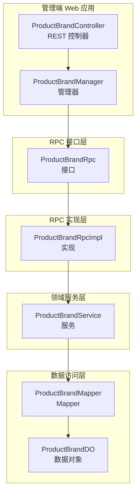
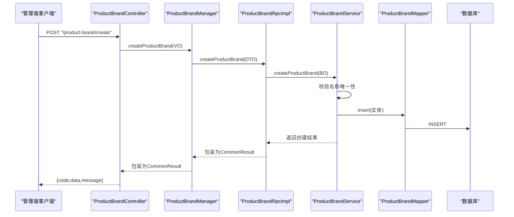
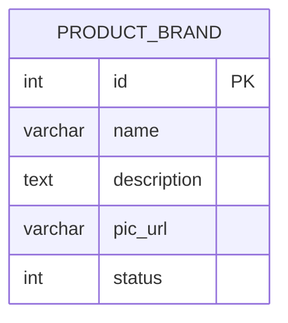
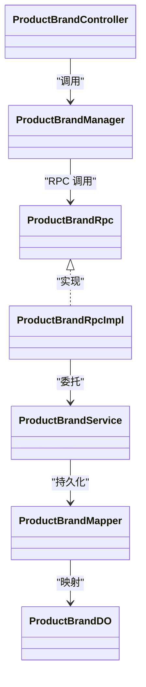

# 商品品牌接口

<cite>
**本文引用的文件**
- [ProductBrandController.java](file://management-web-app/src/main/java/cn/iocoder/mall/managementweb/controller/product/ProductBrandController.java)
- [ProductBrandManager.java](file://management-web-app/src/main/java/cn/iocoder/mall/managementweb/manager/product/ProductBrandManager.java)
- [ProductBrandCreateReqVO.java](file://management-web-app/src/main/java/cn/iocoder/mall/managementweb/controller/product/vo/brand/ProductBrandCreateReqVO.java)
- [ProductBrandUpdateReqVO.java](file://management-web-app/src/main/java/cn/iocoder/mall/managementweb/controller/product/vo/brand/ProductBrandUpdateReqVO.java)
- [ProductBrandPageReqVO.java](file://management-web-app/src/main/java/cn/iocoder/mall/managementweb/controller/product/vo/brand/ProductBrandPageReqVO.java)
- [ProductBrandRespVO.java](file://management-web-app/src/main/java/cn/iocoder/mall/managementweb/controller/product/vo/brand/ProductBrandRespVO.java)
- [ProductBrandRpc.java](file://product-service-project/product-service-api/src/main/java/cn/iocoder/mall/productservice/rpc/brand/ProductBrandRpc.java)
- [ProductBrandCreateReqDTO.java](file://product-service-project/product-service-api/src/main/java/cn/iocoder/mall/productservice/rpc/brand/dto/ProductBrandCreateReqDTO.java)
- [ProductBrandUpdateReqDTO.java](file://product-service-project/product-service-api/src/main/java/cn/iocoder/mall/productservice/rpc/brand/dto/ProductBrandUpdateReqDTO.java)
- [ProductBrandPageReqDTO.java](file://product-service-project/product-service-api/src/main/java/cn/iocoder/mall/productservice/rpc/brand/dto/ProductBrandPageReqDTO.java)
- [ProductBrandRpcImpl.java](file://product-service-project/product-service-app/src/main/java/cn/iocoder/mall/productservice/rpc/brand/ProductBrandRpcImpl.java)
- [ProductBrandService.java](file://product-service-project/product-service-app/src/main/java/cn/iocoder/mall/productservice/service/brand/ProductBrandService.java)
- [ProductBrandDO.java](file://product-service-project/product-service-app/src/main/java/cn/iocoder/mall/productservice/dal/mysql/dataobject/brand/ProductBrandDO.java)
- [ProductBrandConvert.java](file://product-service-project/product-service-app/src/main/java/cn/iocoder/mall/productservice/convert/brand/ProductBrandConvert.java)
</cite>

## 目录
1. [简介](#简介)
2. [项目结构](#项目结构)
3. [核心组件](#核心组件)
4. [架构总览](#架构总览)
5. [详细组件分析](#详细组件分析)
6. [依赖分析](#依赖分析)
7. [性能考虑](#性能考虑)
8. [故障排查指南](#故障排查指南)
9. [结论](#结论)
10. [附录](#附录)

## 简介
本文件为“商品品牌接口”模块的全面API文档，覆盖品牌管理的全生命周期能力：创建、更新、删除、单个查询、批量查询、分页查询。文档同时给出品牌数据模型字段定义、业务规则、与商品SPU的关联关系说明、接口规范（请求参数、响应格式、权限控制）、最佳实践建议（品牌分类、品牌Logo处理、审核流程）以及常见问题与排错指引。

## 项目结构
该模块采用前后端分离与RPC分层设计：
- 管理端 Web 层：提供REST接口，负责鉴权与权限校验，转发到RPC服务。
- RPC 接口层：定义品牌领域服务的对外接口契约。
- RPC 实现层：在应用侧实现RPC接口，编排领域服务。
- 领域服务层：执行业务逻辑，包含数据校验、唯一性检查、分页查询等。
- 数据访问层：MyBatis-Plus Mapper与DO，承载持久化。
- VO/DTO/BO 转换层：MapStruct统一转换，保证各层数据结构清晰。

图表来源
- [ProductBrandController.java:1-83](file://management-web-app/src/main/java/cn/iocoder/mall/managementweb/controller/product/ProductBrandController.java#L1-L83)
- [ProductBrandManager.java:1-95](file://management-web-app/src/main/java/cn/iocoder/mall/managementweb/manager/product/ProductBrandManager.java#L1-L95)
- [ProductBrandRpc.java:1-64](file://product-service-project/product-service-api/src/main/java/cn/iocoder/mall/productservice/rpc/brand/ProductBrandRpc.java#L1-L64)
- [ProductBrandRpcImpl.java:1-59](file://product-service-project/product-service-app/src/main/java/cn/iocoder/mall/productservice/rpc/brand/ProductBrandRpcImpl.java#L1-L59)
- [ProductBrandService.java:1-120](file://product-service-project/product-service-app/src/main/java/cn/iocoder/mall/productservice/service/brand/ProductBrandService.java#L1-L120)
- [ProductBrandDO.java:1-42](file://product-service-project/product-service-app/src/main/java/cn/iocoder/mall/productservice/dal/mysql/dataobject/brand/ProductBrandDO.java#L1-L42)

章节来源
- [ProductBrandController.java:1-83](file://management-web-app/src/main/java/cn/iocoder/mall/managementweb/controller/product/ProductBrandController.java#L1-L83)
- [ProductBrandManager.java:1-95](file://management-web-app/src/main/java/cn/iocoder/mall/managementweb/manager/product/ProductBrandManager.java#L1-L95)
- [ProductBrandRpc.java:1-64](file://product-service-project/product-service-api/src/main/java/cn/iocoder/mall/productservice/rpc/brand/ProductBrandRpc.java#L1-L64)
- [ProductBrandRpcImpl.java:1-59](file://product-service-project/product-service-app/src/main/java/cn/iocoder/mall/productservice/rpc/brand/ProductBrandRpcImpl.java#L1-L59)
- [ProductBrandService.java:1-120](file://product-service-project/product-service-app/src/main/java/cn/iocoder/mall/productservice/service/brand/ProductBrandService.java#L1-L120)
- [ProductBrandDO.java:1-42](file://product-service-project/product-service-app/src/main/java/cn/iocoder/mall/productservice/dal/mysql/dataobject/brand/ProductBrandDO.java#L1-L42)

## 核心组件
- REST 控制器：提供品牌管理的HTTP接口，标注权限注解，返回统一结果包装。
- 管理器：封装RPC调用，负责错误检查与结果转换。
- RPC 接口/实现：定义并实现品牌领域服务的远程接口。
- 领域服务：执行业务规则（如名称唯一性校验、存在性校验、分页查询），并调用Mapper。
- 数据对象与Mapper：承载表结构与查询能力。
- 转换器：统一VO/DTO/BO之间的映射。

章节来源
- [ProductBrandController.java:26-83](file://management-web-app/src/main/java/cn/iocoder/mall/managementweb/controller/product/ProductBrandController.java#L26-L83)
- [ProductBrandManager.java:20-95](file://management-web-app/src/main/java/cn/iocoder/mall/managementweb/manager/product/ProductBrandManager.java#L20-L95)
- [ProductBrandRpc.java:12-64](file://product-service-project/product-service-api/src/main/java/cn/iocoder/mall/productservice/rpc/brand/ProductBrandRpc.java#L12-L64)
- [ProductBrandRpcImpl.java:17-59](file://product-service-project/product-service-app/src/main/java/cn/iocoder/mall/productservice/rpc/brand/ProductBrandRpcImpl.java#L17-L59)
- [ProductBrandService.java:23-120](file://product-service-project/product-service-app/src/main/java/cn/iocoder/mall/productservice/service/brand/ProductBrandService.java#L23-L120)
- [ProductBrandDO.java:10-42](file://product-service-project/product-service-app/src/main/java/cn/iocoder/mall/productservice/dal/mysql/dataobject/brand/ProductBrandDO.java#L10-L42)
- [ProductBrandConvert.java:20-49](file://product-service-project/product-service-app/src/main/java/cn/iocoder/mall/productservice/convert/brand/ProductBrandConvert.java#L20-L49)

## 架构总览
以下序列图展示从管理端发起“创建品牌”请求到最终落库的完整链路。

图表来源
- [ProductBrandController.java:35-40](file://management-web-app/src/main/java/cn/iocoder/mall/managementweb/controller/product/ProductBrandController.java#L35-L40)
- [ProductBrandManager.java:32-36](file://management-web-app/src/main/java/cn/iocoder/mall/managementweb/manager/product/ProductBrandManager.java#L32-L36)
- [ProductBrandRpcImpl.java:26-29](file://product-service-project/product-service-app/src/main/java/cn/iocoder/mall/productservice/rpc/brand/ProductBrandRpcImpl.java#L26-L29)
- [ProductBrandService.java:39-49](file://product-service-project/product-service-app/src/main/java/cn/iocoder/mall/productservice/service/brand/ProductBrandService.java#L39-L49)
- [ProductBrandDO.java:17-42](file://product-service-project/product-service-app/src/main/java/cn/iocoder/mall/productservice/dal/mysql/dataobject/brand/ProductBrandDO.java#L17-L42)

## 详细组件分析

### 数据模型与字段定义
- 表名：product_brand
- 字段说明（来自DO）：
  - id：品牌编号（主键）
  - name：品牌名称
  - description：品牌描述
  - picUrl：品牌图片URL
  - status：状态（枚举值参考通用状态枚举）
  - 其他通用字段（如创建/更新时间、删除标记）由父类提供

图表来源
- [ProductBrandDO.java:17-42](file://product-service-project/product-service-app/src/main/java/cn/iocoder/mall/productservice/dal/mysql/dataobject/brand/ProductBrandDO.java#L17-L42)

章节来源
- [ProductBrandDO.java:10-42](file://product-service-project/product-service-app/src/main/java/cn/iocoder/mall/productservice/dal/mysql/dataobject/brand/ProductBrandDO.java#L10-L42)

### 接口规范

#### 权限与路径
- 基础路径：/product-brand
- 权限标识：
  - 创建：product:brand:create
  - 更新：product:brand:update
  - 删除：product:brand:delete
  - 查询/分页：product:brand:page

章节来源
- [ProductBrandController.java:36-80](file://management-web-app/src/main/java/cn/iocoder/mall/managementweb/controller/product/ProductBrandController.java#L36-L80)

#### 1) 创建品牌
- 方法与路径：POST /product-brand/create
- 权限：product:brand:create
- 请求体：VO → DTO → BO（通过管理器与RPC）
- 请求参数（VO）：
  - name：字符串，必填
  - description：字符串，选填
  - picUrl：字符串，选填
  - status：整数，必填（状态枚举值）
- 成功响应：Integer（品牌编号）

章节来源
- [ProductBrandController.java:35-40](file://management-web-app/src/main/java/cn/iocoder/mall/managementweb/controller/product/ProductBrandController.java#L35-L40)
- [ProductBrandCreateReqVO.java:11-18](file://management-web-app/src/main/java/cn/iocoder/mall/managementweb/controller/product/vo/brand/ProductBrandCreateReqVO.java#L11-L18)
- [ProductBrandCreateReqDTO.java:20-34](file://product-service-project/product-service-api/src/main/java/cn/iocoder/mall/productservice/rpc/brand/dto/ProductBrandCreateReqDTO.java#L20-L34)
- [ProductBrandService.java:39-49](file://product-service-project/product-service-app/src/main/java/cn/iocoder/mall/productservice/service/brand/ProductBrandService.java#L39-L49)

#### 2) 更新品牌
- 方法与路径：POST /product-brand/update
- 权限：product:brand:update
- 请求体：VO → DTO → BO
- 请求参数（VO）：
  - id：整数，必填
  - name：字符串，必填
  - description：字符串，选填
  - picUrl：字符串，选填
  - status：整数，必填
- 成功响应：Boolean（true）

章节来源
- [ProductBrandController.java:42-48](file://management-web-app/src/main/java/cn/iocoder/mall/managementweb/controller/product/ProductBrandController.java#L42-L48)
- [ProductBrandUpdateReqVO.java:11-20](file://management-web-app/src/main/java/cn/iocoder/mall/managementweb/controller/product/vo/brand/ProductBrandUpdateReqVO.java#L11-L20)
- [ProductBrandUpdateReqDTO.java:20-39](file://product-service-project/product-service-api/src/main/java/cn/iocoder/mall/productservice/rpc/brand/dto/ProductBrandUpdateReqDTO.java#L20-L39)
- [ProductBrandService.java:56-69](file://product-service-project/product-service-app/src/main/java/cn/iocoder/mall/productservice/service/brand/ProductBrandService.java#L56-L69)

#### 3) 删除品牌
- 方法与路径：POST /product-brand/delete
- 参数：productBrandId（路径参数）
- 权限：product:brand:delete
- 成功响应：Boolean（true）

章节来源
- [ProductBrandController.java:50-57](file://management-web-app/src/main/java/cn/iocoder/mall/managementweb/controller/product/ProductBrandController.java#L50-L57)
- [ProductBrandRpcImpl.java:37-41](file://product-service-project/product-service-app/src/main/java/cn/iocoder/mall/productservice/rpc/brand/ProductBrandRpcImpl.java#L37-L41)
- [ProductBrandService.java:76-84](file://product-service-project/product-service-app/src/main/java/cn/iocoder/mall/productservice/service/brand/ProductBrandService.java#L76-L84)

#### 4) 获取单个品牌
- 方法与路径：GET /product-brand/get
- 参数：productBrandId（路径参数）
- 权限：product:brand:page
- 成功响应：VO（包含id、name、description、picUrl、status、createTime）

章节来源
- [ProductBrandController.java:59-65](file://management-web-app/src/main/java/cn/iocoder/mall/managementweb/controller/product/ProductBrandController.java#L59-L65)
- [ProductBrandRespVO.java:11-22](file://management-web-app/src/main/java/cn/iocoder/mall/managementweb/controller/product/vo/brand/ProductBrandRespVO.java#L11-L22)
- [ProductBrandRpcImpl.java:43-46](file://product-service-project/product-service-app/src/main/java/cn/iocoder/mall/productservice/rpc/brand/ProductBrandRpcImpl.java#L43-L46)
- [ProductBrandService.java:92-95](file://product-service-project/product-service-app/src/main/java/cn/iocoder/mall/productservice/service/brand/ProductBrandService.java#L92-L95)

#### 5) 批量获取品牌
- 方法与路径：GET /product-brand/list
- 参数：productBrandIds（路径参数，数组）
- 权限：product:brand:page
- 成功响应：VO 列表

章节来源
- [ProductBrandController.java:67-73](file://management-web-app/src/main/java/cn/iocoder/mall/managementweb/controller/product/ProductBrandController.java#L67-L73)
- [ProductBrandRpcImpl.java:48-51](file://product-service-project/product-service-app/src/main/java/cn/iocoder/mall/productservice/rpc/brand/ProductBrandRpcImpl.java#L48-L51)
- [ProductBrandService.java:103-106](file://product-service-project/product-service-app/src/main/java/cn/iocoder/mall/productservice/service/brand/ProductBrandService.java#L103-L106)

#### 6) 分页查询品牌
- 方法与路径：GET /product-brand/page
- 参数：VO → DTO → BO（分页参数）
  - name：字符串，模糊匹配
  - status：整数，可选
  - 以及分页参数（页码、大小等，继承自分页基类）
- 权限：product:brand:page
- 成功响应：分页结果（包含列表与总数）

章节来源
- [ProductBrandController.java:75-80](file://management-web-app/src/main/java/cn/iocoder/mall/managementweb/controller/product/ProductBrandController.java#L75-L80)
- [ProductBrandPageReqVO.java:14-17](file://management-web-app/src/main/java/cn/iocoder/mall/managementweb/controller/product/vo/brand/ProductBrandPageReqVO.java#L14-L17)
- [ProductBrandPageReqDTO.java:19-23](file://product-service-project/product-service-api/src/main/java/cn/iocoder/mall/productservice/rpc/brand/dto/ProductBrandPageReqDTO.java#L19-L23)
- [ProductBrandRpcImpl.java:53-56](file://product-service-project/product-service-app/src/main/java/cn/iocoder/mall/productservice/rpc/brand/ProductBrandRpcImpl.java#L53-L56)
- [ProductBrandService.java:114-117](file://product-service-project/product-service-app/src/main/java/cn/iocoder/mall/productservice/service/brand/ProductBrandService.java#L114-L117)

### 业务规则与约束
- 名称唯一性：创建时若同名已存在则拒绝；更新时若其他品牌使用相同名称则拒绝。
- 存在性校验：删除与更新前均需校验目标品牌是否存在。
- 状态字段：使用通用状态枚举值（具体取值以通用枚举为准）。
- 分页：支持按名称模糊匹配与状态过滤。

章节来源
- [ProductBrandService.java:40-49](file://product-service-project/product-service-app/src/main/java/cn/iocoder/mall/productservice/service/brand/ProductBrandService.java#L40-L49)
- [ProductBrandService.java:57-69](file://product-service-project/product-service-app/src/main/java/cn/iocoder/mall/productservice/service/brand/ProductBrandService.java#L57-L69)
- [ProductBrandService.java:76-84](file://product-service-project/product-service-app/src/main/java/cn/iocoder/mall/productservice/service/brand/ProductBrandService.java#L76-L84)

### 品牌与商品SPU的关联关系
- 说明：品牌作为商品SPU的元数据属性之一，通常在SPU创建或更新时选择所属品牌。
- 关联方式：SPU实体中应包含brandId字段，用于指向品牌表的主键。
- 影响：删除品牌前需确保其未被任何SPU引用（当前服务层保留了待完善注释，建议在实际实现中增加校验与迁移策略）。

章节来源
- [ProductBrandService.java:81-84](file://product-service-project/product-service-app/src/main/java/cn/iocoder/mall/productservice/service/brand/ProductBrandService.java#L81-L84)

### 最佳实践
- 品牌分类：建议在SPU维度引入“分类-品牌”矩阵，避免跨分类的品牌滥用。
- Logo处理：统一上传与裁剪策略，建议存储缩略图与原图URL，便于前端适配。
- 审核流程：对新增/修改的品牌进行人工审核，审核通过后置为启用状态。
- 数据治理：定期清理无SPU引用的品牌，保持数据整洁。

## 依赖分析
- 控制器依赖管理器，管理器依赖RPC接口，RPC实现依赖服务，服务依赖Mapper与DO。
- 转换器贯穿各层，确保数据结构一致与职责清晰。
- 权限注解集中在控制器，统一进行鉴权与授权。

图表来源
- [ProductBrandController.java:30-33](file://management-web-app/src/main/java/cn/iocoder/mall/managementweb/controller/product/ProductBrandController.java#L30-L33)
- [ProductBrandManager.java:23-24](file://management-web-app/src/main/java/cn/iocoder/mall/managementweb/manager/product/ProductBrandManager.java#L23-L24)
- [ProductBrandRpc.java:15](file://product-service-project/product-service-api/src/main/java/cn/iocoder/mall/productservice/rpc/brand/ProductBrandRpc.java#L15)
- [ProductBrandRpcImpl.java:20](file://product-service-project/product-service-app/src/main/java/cn/iocoder/mall/productservice/rpc/brand/ProductBrandRpcImpl.java#L20)
- [ProductBrandService.java:31](file://product-service-project/product-service-app/src/main/java/cn/iocoder/mall/productservice/service/brand/ProductBrandService.java#L31)
- [ProductBrandMapper.java](file://product-service-project/product-service-app/src/main/java/cn/iocoder/mall/productservice/dal/mysql/mapper/brand/ProductBrandMapper.java)
- [ProductBrandDO.java:17-42](file://product-service-project/product-service-app/src/main/java/cn/iocoder/mall/productservice/dal/mysql/dataobject/brand/ProductBrandDO.java#L17-L42)

章节来源
- [ProductBrandController.java:26-83](file://management-web-app/src/main/java/cn/iocoder/mall/managementweb/controller/product/ProductBrandController.java#L26-L83)
- [ProductBrandManager.java:20-95](file://management-web-app/src/main/java/cn/iocoder/mall/managementweb/manager/product/ProductBrandManager.java#L20-L95)
- [ProductBrandRpc.java:12-64](file://product-service-project/product-service-api/src/main/java/cn/iocoder/mall/productservice/rpc/brand/ProductBrandRpc.java#L12-L64)
- [ProductBrandRpcImpl.java:17-59](file://product-service-project/product-service-app/src/main/java/cn/iocoder/mall/productservice/rpc/brand/ProductBrandRpcImpl.java#L17-L59)
- [ProductBrandService.java:23-120](file://product-service-project/product-service-app/src/main/java/cn/iocoder/mall/productservice/service/brand/ProductBrandService.java#L23-L120)
- [ProductBrandDO.java:10-42](file://product-service-project/product-service-app/src/main/java/cn/iocoder/mall/productservice/dal/mysql/dataobject/brand/ProductBrandDO.java#L10-L42)

## 性能考虑
- 分页查询：合理设置每页大小，避免一次性拉取过多数据。
- 批量查询：list接口支持批量ID查询，减少多次网络往返。
- 缓存策略：对热点品牌信息可引入缓存，降低数据库压力。
- 并发控制：创建/更新时的名称唯一性检查建议结合数据库唯一索引与分布式锁，避免竞态条件。

## 故障排查指南
- 403/权限不足：确认当前管理员账号具备对应权限标识（如product:brand:*）。
- 400/参数校验失败：检查请求体字段是否符合VO/DTO约束（如必填项、非空校验）。
- 500/业务异常：名称重复导致创建/更新失败；请更换名称或联系管理员。
- 404/资源不存在：尝试删除/更新的品牌ID不存在，请确认ID正确。
- 分页无结果：检查查询条件（名称模糊匹配、状态过滤）是否过于严格。

章节来源
- [ProductBrandService.java:40-49](file://product-service-project/product-service-app/src/main/java/cn/iocoder/mall/productservice/service/brand/ProductBrandService.java#L40-L49)
- [ProductBrandService.java:57-69](file://product-service-project/product-service-app/src/main/java/cn/iocoder/mall/productservice/service/brand/ProductBrandService.java#L57-L69)
- [ProductBrandService.java:76-84](file://product-service-project/product-service-app/src/main/java/cn/iocoder/mall/productservice/service/brand/ProductBrandService.java#L76-L84)

## 结论
本模块提供了完整的品牌管理能力，采用清晰的分层与RPC设计，具备良好的扩展性与可维护性。建议在后续版本中完善品牌删除前的关联校验与迁移策略，并补充品牌Logo的标准化处理流程与审核机制，以进一步提升系统的健壮性与用户体验。

## 附录

### 统一响应结构
- 成功：{ code: 0, data: T, message: "success" }
- 失败：{ code: 错误码, data: null, message: "错误描述" }

章节来源
- [ProductBrandManager.java:32-36](file://management-web-app/src/main/java/cn/iocoder/mall/managementweb/manager/product/ProductBrandManager.java#L32-L36)
- [ProductBrandManager.java:43-46](file://management-web-app/src/main/java/cn/iocoder/mall/managementweb/manager/product/ProductBrandManager.java#L43-L46)
- [ProductBrandManager.java:53-56](file://management-web-app/src/main/java/cn/iocoder/mall/managementweb/manager/product/ProductBrandManager.java#L53-L56)
- [ProductBrandManager.java:64-68](file://management-web-app/src/main/java/cn/iocoder/mall/managementweb/manager/product/ProductBrandManager.java#L64-L68)
- [ProductBrandManager.java:76-80](file://management-web-app/src/main/java/cn/iocoder/mall/managementweb/manager/product/ProductBrandManager.java#L76-L80)
- [ProductBrandManager.java:88-92](file://management-web-app/src/main/java/cn/iocoder/mall/managementweb/manager/product/ProductBrandManager.java#L88-L92)