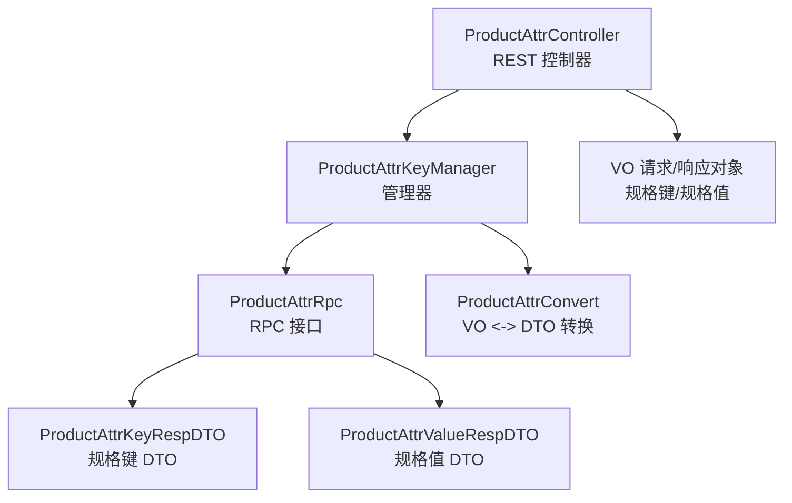
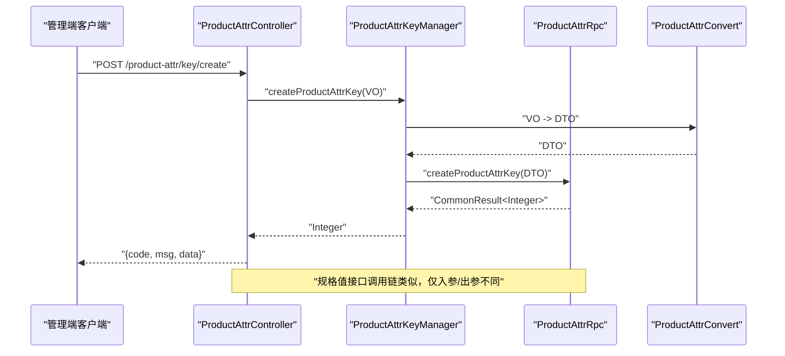
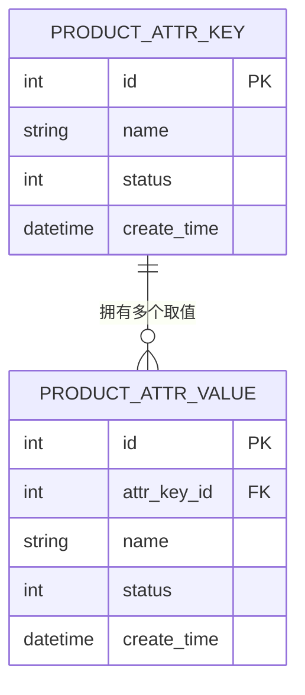
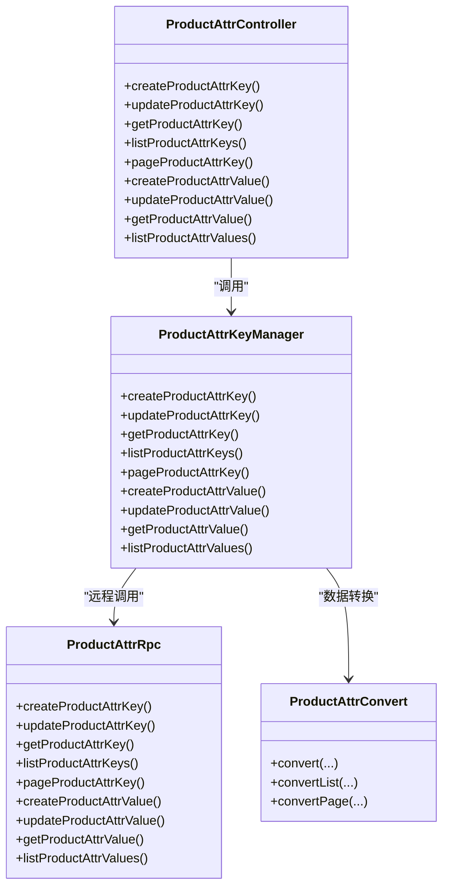

# 商品属性接口

<cite>
**本文引用的文件**
- [ProductAttrController.java](file://management-web-app/src/main/java/cn/iocoder/mall/managementweb/controller/product/ProductAttrController.java)
- [ProductAttrKeyCreateReqVO.java](file://management-web-app/src/main/java/cn/iocoder/mall/managementweb/controller/product/vo/attr/ProductAttrKeyCreateReqVO.java)
- [ProductAttrKeyUpdateReqVO.java](file://management-web-app/src/main/java/cn/iocoder/mall/managementweb/controller/product/vo/attr/ProductAttrKeyUpdateReqVO.java)
- [ProductAttrKeyPageReqVO.java](file://management-web-app/src/main/java/cn/iocoder/mall/managementweb/controller/product/vo/attr/ProductAttrKeyPageReqVO.java)
- [ProductAttrKeyRespVO.java](file://management-web-app/src/main/java/cn/iocoder/mall/managementweb/controller/product/vo/attr/ProductAttrKeyRespVO.java)
- [ProductAttrValueCreateReqVO.java](file://management-web-app/src/main/java/cn/iocoder/mall/managementweb/controller/product/vo/attr/ProductAttrValueCreateReqVO.java)
- [ProductAttrValueUpdateReqVO.java](file://management-web-app/src/main/java/cn/iocoder/mall/managementweb/controller/product/vo/attr/ProductAttrValueUpdateReqVO.java)
- [ProductAttrValueListQueryReqVO.java](file://management-web-app/src/main/java/cn/iocoder/mall/managementweb/controller/product/vo/attr/ProductAttrValueListQueryReqVO.java)
- [ProductAttrValueRespVO.java](file://management-web-app/src/main/java/cn/iocoder/mall/managementweb/controller/product/vo/attr/ProductAttrValueRespVO.java)
- [ProductAttrKeyManager.java](file://management-web-app/src/main/java/cn/iocoder/mall/managementweb/manager/product/ProductAttrKeyManager.java)
- [ProductAttrConvert.java](file://management-web-app/src/main/java/cn/iocoder/mall/managementweb/convert/product/ProductAttrConvert.java)
- [ProductAttrRpc.java](file://product-service-project/product-service-api/src/main/java/cn/iocoder/mall/productservice/rpc/attr/ProductAttrRpc.java)
- [ProductAttrKeyRespDTO.java](file://product-service-project/product-service-api/src/main/java/cn/iocoder/mall/productservice/rpc/attr/dto/ProductAttrKeyRespDTO.java)
- [ProductAttrValueRespDTO.java](file://product-service-project/product-service-api/src/main/java/cn/iocoder/mall/productservice/rpc/attr/dto/ProductAttrValueRespDTO.java)
</cite>

## 目录
1. [简介](#简介)
2. [项目结构](#项目结构)
3. [核心组件](#核心组件)
4. [架构总览](#架构总览)
5. [详细组件分析](#详细组件分析)
6. [依赖分析](#依赖分析)
7. [性能考虑](#性能考虑)
8. [故障排查指南](#故障排查指南)
9. [结论](#结论)
10. [附录](#附录)

## 简介
本文件为“商品属性接口”模块的详细API文档，聚焦于商品规格键（属性名）与规格值（属性值）的全量管理能力，包括创建、更新、查询、分页等。文档同时阐述属性键值对的业务含义及其在商品SPU中的应用场景，并提供接口规范、权限控制、响应格式、调用示例与错误处理建议。

## 项目结构
该模块采用“管理端 Web 应用 -> 管理器（Manager） -> RPC 接口”的分层设计：
- 控制器层：对外暴露REST接口，定义HTTP方法、路径、参数与权限注解。
- VO 层：封装请求与响应的数据传输对象，包含字段校验规则。
- 管理器层：负责调用产品服务RPC接口，完成业务编排与异常检查。
- RPC 接口层：定义跨服务调用的接口契约，屏蔽具体实现细节。

图表来源
- [ProductAttrController.java:1-101](file://management-web-app/src/main/java/cn/iocoder/mall/managementweb/controller/product/ProductAttrController.java#L1-L101)
- [ProductAttrKeyManager.java:1-135](file://management-web-app/src/main/java/cn/iocoder/mall/managementweb/manager/product/ProductAttrKeyManager.java#L1-L135)
- [ProductAttrRpc.java:1-85](file://product-service-project/product-service-api/src/main/java/cn/iocoder/mall/productservice/rpc/attr/ProductAttrRpc.java#L1-L85)
- [ProductAttrKeyRespDTO.java:1-34](file://product-service-project/product-service-api/src/main/java/cn/iocoder/mall/productservice/rpc/attr/dto/ProductAttrKeyRespDTO.java#L1-L34)
- [ProductAttrValueRespDTO.java:1-38](file://product-service-project/product-service-api/src/main/java/cn/iocoder/mall/productservice/rpc/attr/dto/ProductAttrValueRespDTO.java#L1-L38)

章节来源
- [ProductAttrController.java:1-101](file://management-web-app/src/main/java/cn/iocoder/mall/managementweb/controller/product/ProductAttrController.java#L1-L101)
- [ProductAttrKeyManager.java:1-135](file://management-web-app/src/main/java/cn/iocoder/mall/managementweb/manager/product/ProductAttrKeyManager.java#L1-L135)
- [ProductAttrRpc.java:1-85](file://product-service-project/product-service-api/src/main/java/cn/iocoder/mall/productservice/rpc/attr/ProductAttrRpc.java#L1-L85)

## 核心组件
- REST 控制器：提供规格键与规格值的增删改查与分页接口，统一使用前缀“/product-attr/”。
- VO 对象：定义请求参数与响应字段，包含必填项、枚举校验与示例值。
- 管理器：封装RPC调用，统一异常处理与返回值转换。
- RPC 接口：定义规格键/值的创建、更新、查询与分页能力。
- DTO 对象：RPC 层的数据传输载体，包含基础字段与创建时间。

章节来源
- [ProductAttrController.java:23-101](file://management-web-app/src/main/java/cn/iocoder/mall/managementweb/controller/product/ProductAttrController.java#L23-L101)
- [ProductAttrKeyCreateReqVO.java:1-25](file://management-web-app/src/main/java/cn/iocoder/mall/managementweb/controller/product/vo/attr/ProductAttrKeyCreateReqVO.java#L1-L25)
- [ProductAttrKeyUpdateReqVO.java:1-28](file://management-web-app/src/main/java/cn/iocoder/mall/managementweb/controller/product/vo/attr/ProductAttrKeyUpdateReqVO.java#L1-L28)
- [ProductAttrValueCreateReqVO.java:1-29](file://management-web-app/src/main/java/cn/iocoder/mall/managementweb/controller/product/vo/attr/ProductAttrValueCreateReqVO.java#L1-L29)
- [ProductAttrValueUpdateReqVO.java:1-29](file://management-web-app/src/main/java/cn/iocoder/mall/managementweb/controller/product/vo/attr/ProductAttrValueUpdateReqVO.java#L1-L29)
- [ProductAttrKeyPageReqVO.java:1-23](file://management-web-app/src/main/java/cn/iocoder/mall/managementweb/controller/product/vo/attr/ProductAttrKeyPageReqVO.java#L1-L23)
- [ProductAttrKeyRespVO.java:1-21](file://management-web-app/src/main/java/cn/iocoder/mall/managementweb/controller/product/vo/attr/ProductAttrKeyRespVO.java#L1-L21)
- [ProductAttrValueRespVO.java:1-23](file://management-web-app/src/main/java/cn/iocoder/mall/managementweb/controller/product/vo/attr/ProductAttrValueRespVO.java#L1-L23)
- [ProductAttrKeyManager.java:18-135](file://management-web-app/src/main/java/cn/iocoder/mall/managementweb/manager/product/ProductAttrKeyManager.java#L18-L135)
- [ProductAttrRpc.java:12-85](file://product-service-project/product-service-api/src/main/java/cn/iocoder/mall/productservice/rpc/attr/ProductAttrRpc.java#L12-L85)
- [ProductAttrKeyRespDTO.java:14-34](file://product-service-project/product-service-api/src/main/java/cn/iocoder/mall/productservice/rpc/attr/dto/ProductAttrKeyRespDTO.java#L14-L34)
- [ProductAttrValueRespDTO.java:14-38](file://product-service-project/product-service-api/src/main/java/cn/iocoder/mall/productservice/rpc/attr/dto/ProductAttrValueRespDTO.java#L14-L38)

## 架构总览
下图展示从管理端控制器到RPC接口的调用链路与职责分工：

图表来源
- [ProductAttrController.java:32-37](file://management-web-app/src/main/java/cn/iocoder/mall/managementweb/controller/product/ProductAttrController.java#L32-L37)
- [ProductAttrKeyManager.java:30-35](file://management-web-app/src/main/java/cn/iocoder/mall/managementweb/manager/product/ProductAttrKeyManager.java#L30-L35)
- [ProductAttrRpc.java:20](file://product-service-project/product-service-api/src/main/java/cn/iocoder/mall/productservice/rpc/attr/ProductAttrRpc.java#L20)
- [ProductAttrConvert.java:16-18](file://management-web-app/src/main/java/cn/iocoder/mall/managementweb/convert/product/ProductAttrConvert.java#L16-L18)

## 详细组件分析

### 规格键（属性名）管理接口
规格键用于定义商品可选属性的维度名称，如“颜色”、“尺寸”。支持创建、更新、单条查询、批量查询、分页查询。

- 接口一：创建规格键
  - 方法与路径：POST /product-attr/key/create
  - 权限标识：product:attr-key:create
  - 请求体字段：
    - name：字符串，必填，示例值“尺寸”
    - status：整数，必填，取值范围见通用状态枚举
  - 响应：data 为新创建的规格键编号（整数）
  - 错误处理：校验失败返回参数错误；RPC 失败时抛出统一异常

- 接口二：更新规格键
  - 方法与路径：POST /product-attr/key/update
  - 权限标识：product:attr-key:update
  - 请求体字段：
    - id：整数，必填，规格键编号
    - name：字符串，必填，示例值“尺寸”
    - status：整数，必填，取值范围见通用状态枚举
  - 响应：data 为布尔值 true

- 接口三：获取单个规格键
  - 方法与路径：GET /product-attr/key/get
  - 查询参数：productAttrKeyId（整数，必填）
  - 权限标识：product:attr-key:page
  - 响应：data 为规格键详情对象，包含 id、name、status、createTime

- 接口四：批量获取规格键
  - 方法与路径：GET /product-attr/key/list
  - 查询参数：productAttrKeyIds（整数列表，必填）
  - 权限标识：product:attr-key:page
  - 响应：data 为规格键详情列表

- 接口五：分页查询规格键
  - 方法与路径：GET /product-attr/key/page
  - 查询参数：name（模糊匹配）、status（可选）、分页参数（由 PageParam 提供）
  - 权限标识：product:attr-key:page
  - 响应：data 为分页结果，包含列表与分页信息

章节来源
- [ProductAttrController.java:32-68](file://management-web-app/src/main/java/cn/iocoder/mall/managementweb/controller/product/ProductAttrController.java#L32-L68)
- [ProductAttrKeyCreateReqVO.java:16-22](file://management-web-app/src/main/java/cn/iocoder/mall/managementweb/controller/product/vo/attr/ProductAttrKeyCreateReqVO.java#L16-L22)
- [ProductAttrKeyUpdateReqVO.java:16-25](file://management-web-app/src/main/java/cn/iocoder/mall/managementweb/controller/product/vo/attr/ProductAttrKeyUpdateReqVO.java#L16-L25)
- [ProductAttrKeyPageReqVO.java:16-20](file://management-web-app/src/main/java/cn/iocoder/mall/managementweb/controller/product/vo/attr/ProductAttrKeyPageReqVO.java#L16-L20)
- [ProductAttrKeyRespVO.java:11-18](file://management-web-app/src/main/java/cn/iocoder/mall/managementweb/controller/product/vo/attr/ProductAttrKeyRespVO.java#L11-L18)
- [ProductAttrKeyManager.java:30-83](file://management-web-app/src/main/java/cn/iocoder/mall/managementweb/manager/product/ProductAttrKeyManager.java#L30-L83)
- [ProductAttrRpc.java:14-51](file://product-service-project/product-service-api/src/main/java/cn/iocoder/mall/productservice/rpc/attr/ProductAttrRpc.java#L14-L51)

### 规格值（属性值）管理接口
规格值是规格键的具体取值，如“红色”、“XXL”。支持创建、更新、单条查询、列表查询。

- 接口六：创建规格值
  - 方法与路径：POST /product-attr/value/create
  - 权限标识：product:attr-value:create
  - 请求体字段：
    - attrKeyId：整数，必填，所属规格键编号
    - name：字符串，必填，示例值“XXL”
    - status：整数，必填，取值范围见通用状态枚举
  - 响应：data 为新创建的规格值编号（整数）

- 接口七：更新规格值
  - 方法与路径：POST /product-attr/value/update
  - 权限标识：product:attr-value:update
  - 请求体字段：
    - id：整数，必填，规格值编号
    - name：字符串，必填，示例值“XXL”
    - status：整数，必填，取值范围见通用状态枚举
  - 响应：data 为布尔值 true

- 接口八：获取单个规格值
  - 方法与路径：GET /product-attr/value/get
  - 查询参数：productAttrValueId（整数，必填）
  - 权限标识：product:attr-value:list
  - 响应：data 为规格值详情对象，包含 id、attrKeyId、name、status、createTime

- 接口九：列表查询规格值
  - 方法与路径：GET /product-attr/value/list
  - 查询参数：productAttrValueIds（可选，整数列表）、productAttrKeyId（可选，整数）
  - 权限标识：product:attr-value:list
  - 响应：data 为规格值详情列表

章节来源
- [ProductAttrController.java:70-100](file://management-web-app/src/main/java/cn/iocoder/mall/managementweb/controller/product/ProductAttrController.java#L70-L100)
- [ProductAttrValueCreateReqVO.java:16-25](file://management-web-app/src/main/java/cn/iocoder/mall/managementweb/controller/product/vo/attr/ProductAttrValueCreateReqVO.java#L16-L25)
- [ProductAttrValueUpdateReqVO.java:16-25](file://management-web-app/src/main/java/cn/iocoder/mall/managementweb/controller/product/vo/attr/ProductAttrValueUpdateReqVO.java#L16-L25)
- [ProductAttrValueListQueryReqVO.java:15-19](file://management-web-app/src/main/java/cn/iocoder/mall/managementweb/controller/product/vo/attr/ProductAttrValueListQueryReqVO.java#L15-L19)
- [ProductAttrValueRespVO.java:11-20](file://management-web-app/src/main/java/cn/iocoder/mall/managementweb/controller/product/vo/attr/ProductAttrValueRespVO.java#L11-L20)
- [ProductAttrKeyManager.java:91-132](file://management-web-app/src/main/java/cn/iocoder/mall/managementweb/manager/product/ProductAttrKeyManager.java#L91-L132)
- [ProductAttrRpc.java:54-82](file://product-service-project/product-service-api/src/main/java/cn/iocoder/mall/productservice/rpc/attr/ProductAttrRpc.java#L54-L82)

### 数据模型与业务含义
- 规格键（ProductAttrKey）
  - 字段：id、name、status、createTime
  - 业务含义：定义商品属性的维度名称，例如“颜色”、“尺寸”、“内存容量”
  - 关联关系：一个规格键可对应多个规格值

- 规格值（ProductAttrValue）
  - 字段：id、attrKeyId、name、status、createTime
  - 业务含义：规格键的具体取值，例如“红色”、“XXL”、“8GB”
  - 关联关系：通过 attrKeyId 指向其所属的规格键

- 在 SPU 中的应用场景
  - SPU（标准商品单元）通过规格键与规格值组合形成 SKU（库存单位），用于区分不同配置的商品变体
  - 管理端维护规格键与规格值，前端与交易系统据此生成 SKU 并进行库存与价格管理

图表来源
- [ProductAttrKeyRespDTO.java:19-31](file://product-service-project/product-service-api/src/main/java/cn/iocoder/mall/productservice/rpc/attr/dto/ProductAttrKeyRespDTO.java#L19-L31)
- [ProductAttrValueRespDTO.java:19-35](file://product-service-project/product-service-api/src/main/java/cn/iocoder/mall/productservice/rpc/attr/dto/ProductAttrValueRespDTO.java#L19-L35)

## 依赖分析
- 控制器依赖管理器：控制器仅负责参数接收与权限校验，业务逻辑委托给管理器。
- 管理器依赖 RPC 接口：管理器通过 Dubbo 远程调用产品服务的规格接口。
- 转换器依赖：VO 与 DTO 的双向转换由 MapStruct 生成的转换器承担，保证类型安全与一致性。
- 异常处理：管理器统一检查 RPC 返回的通用结果，出现错误时抛出统一异常，便于上层处理。

图表来源
- [ProductAttrController.java:27-100](file://management-web-app/src/main/java/cn/iocoder/mall/managementweb/controller/product/ProductAttrController.java#L27-L100)
- [ProductAttrKeyManager.java:19-134](file://management-web-app/src/main/java/cn/iocoder/mall/managementweb/manager/product/ProductAttrKeyManager.java#L19-134)
- [ProductAttrRpc.java:12-85](file://product-service-project/product-service-api/src/main/java/cn/iocoder/mall/productservice/rpc/attr/ProductAttrRpc.java#L12-85)
- [ProductAttrConvert.java:12-39](file://management-web-app/src/main/java/cn/iocoder/mall/managementweb/convert/product/ProductAttrConvert.java#L12-39)

章节来源
- [ProductAttrController.java:1-101](file://management-web-app/src/main/java/cn/iocoder/mall/managementweb/controller/product/ProductAttrController.java#L1-L101)
- [ProductAttrKeyManager.java:1-135](file://management-web-app/src/main/java/cn/iocoder/mall/managementweb/manager/product/ProductAttrKeyManager.java#L1-L135)
- [ProductAttrRpc.java:1-85](file://product-service-project/product-service-api/src/main/java/cn/iocoder/mall/productservice/rpc/attr/ProductAttrRpc.java#L1-L85)
- [ProductAttrConvert.java:1-40](file://management-web-app/src/main/java/cn/iocoder/mall/managementweb/convert/product/ProductAttrConvert.java#L1-L40)

## 性能考虑
- 分页查询：规格键分页接口支持模糊匹配与状态过滤，建议合理设置每页大小与索引优化以提升查询性能。
- 批量查询：批量获取规格键与规格值接口适合一次性加载多条数据，减少多次往返。
- 缓存策略：对于高频读取的规格键/值列表，可在服务端或网关层引入缓存，降低RPC压力。
- 参数校验前置：控制器层已进行参数校验与权限拦截，避免无效请求进入RPC层。

## 故障排查指南
- 参数校验失败
  - 现象：返回参数缺失或格式不正确
  - 排查：确认必填字段是否填写、枚举取值是否合法、分页参数是否正确
- RPC 调用异常
  - 现象：统一异常返回，提示服务不可用或内部错误
  - 排查：检查产品服务是否启动、网络连通性、版本配置是否一致
- 权限不足
  - 现象：返回无权限访问
  - 排查：确认当前登录用户是否具备 product:attr-key:* 或 product:attr-value:* 权限

章节来源
- [ProductAttrController.java:34-35](file://management-web-app/src/main/java/cn/iocoder/mall/managementweb/controller/product/ProductAttrController.java#L34-L35)
- [ProductAttrController.java:41-42](file://management-web-app/src/main/java/cn/iocoder/mall/managementweb/controller/product/ProductAttrController.java#L41-L42)
- [ProductAttrController.java:65-66](file://management-web-app/src/main/java/cn/iocoder/mall/managementweb/controller/product/ProductAttrController.java#L65-L66)
- [ProductAttrController.java:72-73](file://management-web-app/src/main/java/cn/iocoder/mall/managementweb/controller/product/ProductAttrController.java#L72-L73)
- [ProductAttrController.java:79-80](file://management-web-app/src/main/java/cn/iocoder/mall/managementweb/controller/product/ProductAttrController.java#L79-L80)
- [ProductAttrController.java:88-89](file://management-web-app/src/main/java/cn/iocoder/mall/managementweb/controller/product/ProductAttrController.java#L88-L89)
- [ProductAttrController.java:95-96](file://management-web-app/src/main/java/cn/iocoder/mall/managementweb/controller/product/ProductAttrController.java#L95-L96)

## 结论
本模块提供了完整的商品规格键与规格值管理能力，覆盖创建、更新、查询与分页等核心场景。通过清晰的分层设计与统一的异常处理机制，确保了接口的稳定性与可维护性。在实际应用中，建议结合业务需求完善缓存与索引策略，并严格遵循权限控制与参数校验规范。

## 附录

### 接口调用示例（示意）
- 创建规格键
  - 请求：POST /product-attr/key/create
  - Body：{ "name": "尺寸", "status": 1 }
  - 成功响应：{ "code": 0, "msg": "成功", "data": 101 }

- 分页查询规格键
  - 请求：GET /product-attr/key/page?name=尺&status=1&pageNo=1&pageSize=20
  - 成功响应：{ "code": 0, "msg": "成功", "data": { "list": [...], "pageNo": 1, "pageSize": 20, "total": 1 } }

- 创建规格值
  - 请求：POST /product-attr/value/create
  - Body：{ "attrKeyId": 101, "name": "XXL", "status": 1 }
  - 成功响应：{ "code": 0, "msg": "成功", "data": 201 }

- 列表查询规格值
  - 请求：GET /product-attr/value/list?productAttrKeyId=101&productAttrValueIds=201,202
  - 成功响应：{ "code": 0, "msg": "成功", "data": [...] }

### 错误码与状态
- 通用状态枚举：status 字段取值需符合通用状态枚举定义
- 统一返回结构：所有接口均采用 { code, msg, data } 的统一返回结构，其中 code=0 表示成功