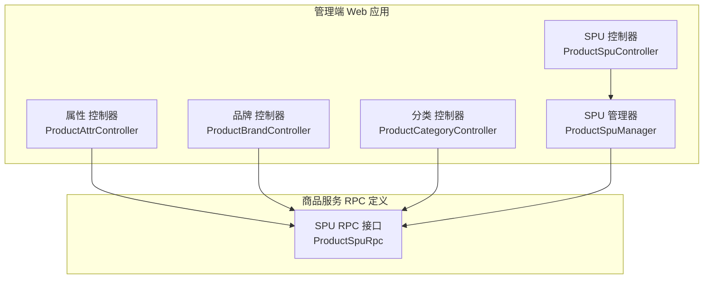
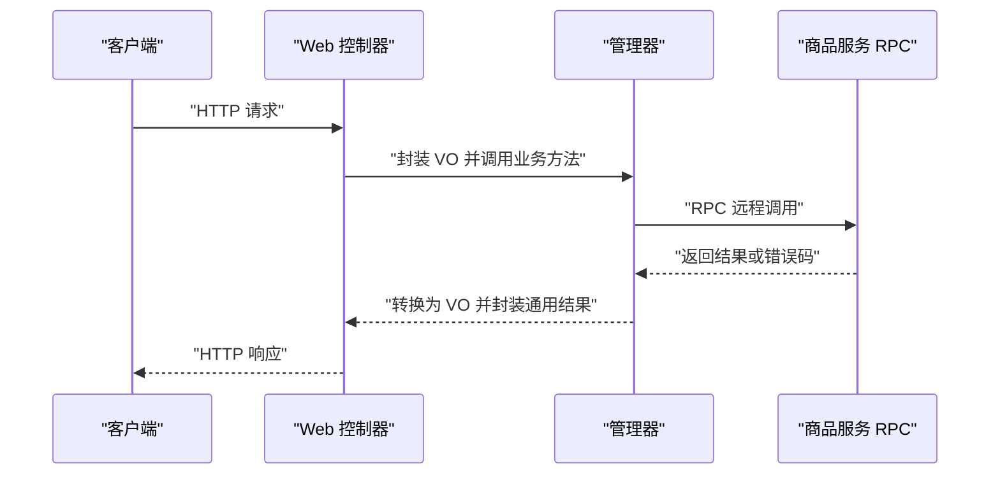
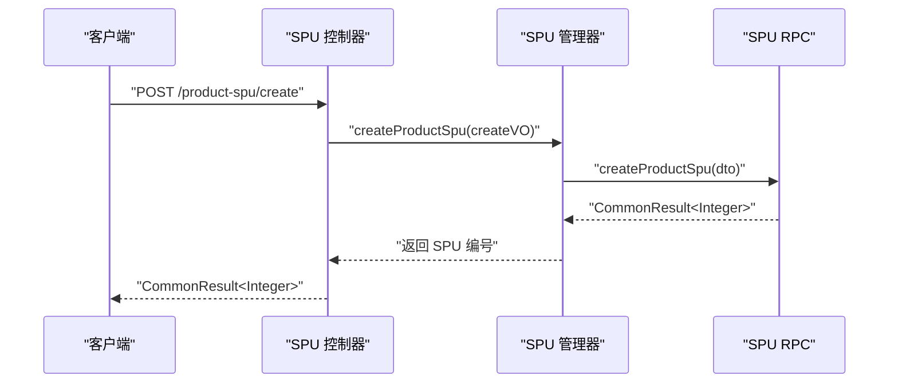
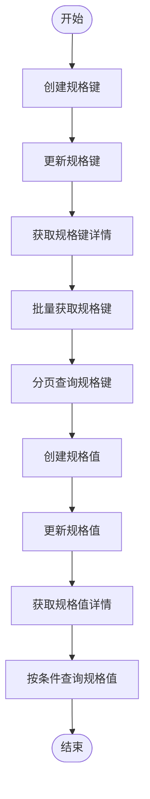
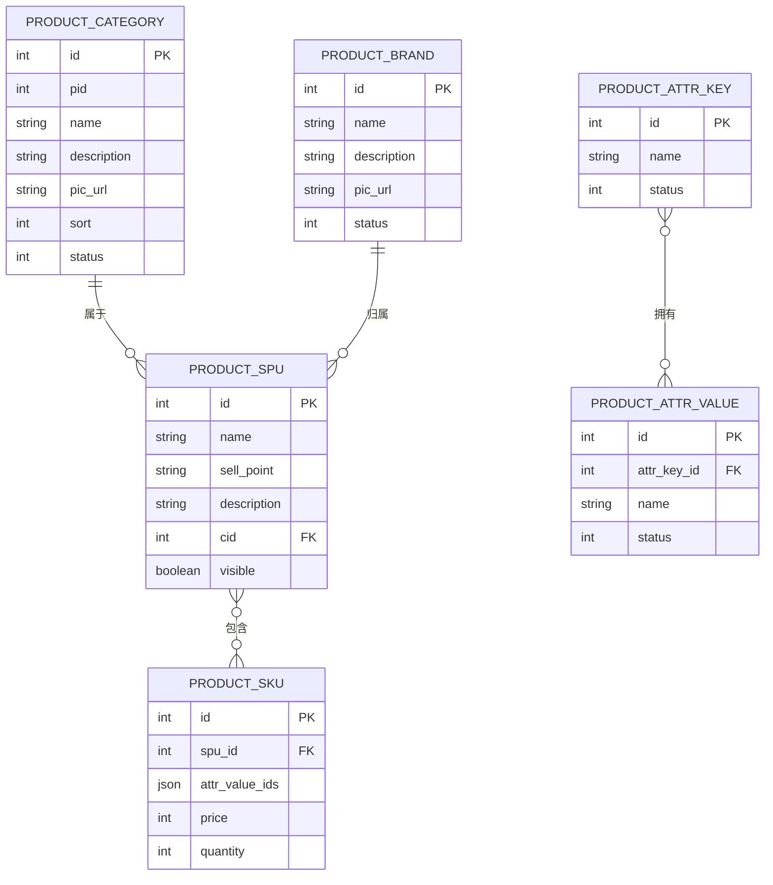

# 商品管理接口

<cite>
**本文引用的文件**
- [ProductSpuController.java](file://management-web-app/src/main/java/cn/iocoder/mall/managementweb/controller/product/ProductSpuController.java)
- [ProductAttrController.java](file://management-web-app/src/main/java/cn/iocoder/mall/managementweb/controller/product/ProductAttrController.java)
- [ProductBrandController.java](file://management-web-app/src/main/java/cn/iocoder/mall/managementweb/controller/product/ProductBrandController.java)
- [ProductCategoryController.java](file://management-web-app/src/main/java/cn/iocoder/mall/managementweb/controller/product/ProductCategoryController.java)
- [ProductSpuCreateReqVO.java](file://management-web-app/src/main/java/cn/iocoder/mall/managementweb/controller/product/vo/spu/ProductSpuCreateReqVO.java)
- [ProductSpuUpdateReqVO.java](file://management-web-app/src/main/java/cn/iocoder/mall/managementweb/controller/product/vo/spu/ProductSpuUpdateReqVO.java)
- [ProductSpuPageReqVO.java](file://management-web-app/src/main/java/cn/iocoder/mall/managementweb/controller/product/vo/spu/ProductSpuPageReqVO.java)
- [ProductAttrKeyCreateReqVO.java](file://management-web-app/src/main/java/cn/iocoder/mall/managementweb/controller/product/vo/attr/ProductAttrKeyCreateReqVO.java)
- [ProductBrandCreateReqVO.java](file://management-web-app/src/main/java/cn/iocoder/mall/managementweb/controller/product/vo/brand/ProductBrandCreateReqVO.java)
- [ProductCategoryCreateReqVO.java](file://management-web-app/src/main/java/cn/iocoder/mall/managementweb/controller/product/vo/category/ProductCategoryCreateReqVO.java)
- [ProductSpuManager.java](file://management-web-app/src/main/java/cn/iocoder/mall/managementweb/manager/product/ProductSpuManager.java)
- [ProductSpuRpc.java](file://product-service-project/product-service-api/src/main/java/cn/iocoder/mall/productservice/rpc/spu/ProductSpuRpc.java)
</cite>

## 目录
1. [简介](#简介)
2. [项目结构](#项目结构)
3. [核心组件](#核心组件)
4. [架构总览](#架构总览)
5. [详细组件分析](#详细组件分析)
6. [依赖分析](#依赖分析)
7. [性能考虑](#性能考虑)
8. [故障排查指南](#故障排查指南)
9. [结论](#结论)
10. [附录](#附录)

## 简介
本文件为“商品管理接口”模块的全面API文档，覆盖商品SPU管理、属性键值管理、品牌管理、分类树管理等能力。文档从接口规范、数据模型、业务流程、错误处理与性能优化等方面进行系统化说明，并提供测试与调试建议，帮助开发者快速理解并正确使用接口。

## 项目结构
- 控制层（REST）：位于 management-web-app 模块，分别提供 SPU、属性、品牌、分类的管理接口。
- 管理层（Manager）：封装对 RPC 接口的调用，负责参数转换与错误检查。
- RPC 接口：位于 product-service-project 的 product-service-api 模块，定义了商品领域服务的远程接口。
- VO 类：用于请求与响应的数据载体，包含字段校验规则与Swagger注解。

图表来源
- [ProductSpuController.java:25-74](file://management-web-app/src/main/java/cn/iocoder/mall/managementweb/controller/product/ProductSpuController.java#L25-L74)
- [ProductAttrController.java:23-100](file://management-web-app/src/main/java/cn/iocoder/mall/managementweb/controller/product/ProductAttrController.java#L23-L100)
- [ProductBrandController.java:26-82](file://management-web-app/src/main/java/cn/iocoder/mall/managementweb/controller/product/ProductBrandController.java#L26-L82)
- [ProductCategoryController.java:24-64](file://management-web-app/src/main/java/cn/iocoder/mall/managementweb/controller/product/ProductCategoryController.java#L24-L64)
- [ProductSpuManager.java:20-84](file://management-web-app/src/main/java/cn/iocoder/mall/managementweb/manager/product/ProductSpuManager.java#L20-L84)
- [ProductSpuRpc.java](file://product-service-project/product-service-api/src/main/java/cn/iocoder/mall/productservice/rpc/spu/ProductSpuRpc.java)

章节来源
- [ProductSpuController.java:25-74](file://management-web-app/src/main/java/cn/iocoder/mall/managementweb/controller/product/ProductSpuController.java#L25-L74)
- [ProductAttrController.java:23-100](file://management-web-app/src/main/java/cn/iocoder/mall/managementweb/controller/product/ProductAttrController.java#L23-L100)
- [ProductBrandController.java:26-82](file://management-web-app/src/main/java/cn/iocoder/mall/managementweb/controller/product/ProductBrandController.java#L26-L82)
- [ProductCategoryController.java:24-64](file://management-web-app/src/main/java/cn/iocoder/mall/managementweb/controller/product/ProductCategoryController.java#L24-L64)
- [ProductSpuManager.java:20-84](file://management-web-app/src/main/java/cn/iocoder/mall/managementweb/manager/product/ProductSpuManager.java#L20-L84)

## 核心组件
- SPU 控制器：提供 SPU 的创建、更新、单个/批量查询、分页查询等接口。
- 属性控制器：提供规格键与规格值的创建、更新、查询与分页接口。
- 品牌控制器：提供品牌的创建、更新、删除、查询与分页接口。
- 分类控制器：提供分类的创建、更新、删除与树形结构查询接口。
- SPU 管理器：统一调用商品服务的 RPC 接口，完成数据转换与错误处理。

章节来源
- [ProductSpuController.java:25-74](file://management-web-app/src/main/java/cn/iocoder/mall/managementweb/controller/product/ProductSpuController.java#L25-L74)
- [ProductAttrController.java:23-100](file://management-web-app/src/main/java/cn/iocoder/mall/managementweb/controller/product/ProductAttrController.java#L23-L100)
- [ProductBrandController.java:26-82](file://management-web-app/src/main/java/cn/iocoder/mall/managementweb/controller/product/ProductBrandController.java#L26-L82)
- [ProductCategoryController.java:24-64](file://management-web-app/src/main/java/cn/iocoder/mall/managementweb/controller/product/ProductCategoryController.java#L24-L64)
- [ProductSpuManager.java:20-84](file://management-web-app/src/main/java/cn/iocoder/mall/managementweb/manager/product/ProductSpuManager.java#L20-L84)

## 架构总览
下图展示了管理端 Web 应用与商品服务 RPC 的交互关系，以及各控制器与管理器之间的职责分工。

图表来源
- [ProductSpuController.java:34-72](file://management-web-app/src/main/java/cn/iocoder/mall/managementweb/controller/product/ProductSpuController.java#L34-L72)
- [ProductSpuManager.java:32-82](file://management-web-app/src/main/java/cn/iocoder/mall/managementweb/manager/product/ProductSpuManager.java#L32-L82)
- [ProductSpuRpc.java](file://product-service-project/product-service-api/src/main/java/cn/iocoder/mall/productservice/rpc/spu/ProductSpuRpc.java)

## 详细组件分析

### SPU 接口
- 接口概览
  - 创建 SPU：POST /product-spu/create
  - 更新 SPU：POST /product-spu/update
  - 获取 SPU：GET /product-spu/get?productSpuId=...
  - 批量获取 SPU：GET /product-spu/list?productSpuIds=...
  - 分页查询 SPU：GET /product-spu/page
- 请求参数与响应
  - 创建/更新请求体：包含 SPU 基本信息与 SKU 数组；SKU 包含规格值 ID 列表、价格（分）、库存数量。
  - 分页请求：支持按名称（模糊）、分类、上下架状态、是否有库存筛选。
  - 响应：统一包装为通用结果对象，成功时返回具体数据。
- 数据模型要点
  - SPU 与 SKU：SPU 代表商品抽象，SKU 代表具体销售单元，二者通过规格值组合关联。
  - 价格与库存：以分为单位，确保精确计算与存储。
- 业务约束
  - 必填字段校验、最小值校验（如价格与库存最小为 1）。
  - SKU 列表非空且每项必填。
- 错误处理
  - 管理器在调用 RPC 后统一检查错误并抛出异常，控制器返回通用结果。

图表来源
- [ProductSpuController.java:34-38](file://management-web-app/src/main/java/cn/iocoder/mall/managementweb/controller/product/ProductSpuController.java#L34-L38)
- [ProductSpuManager.java:32-36](file://management-web-app/src/main/java/cn/iocoder/mall/managementweb/manager/product/ProductSpuManager.java#L32-L36)
- [ProductSpuCreateReqVO.java:14-74](file://management-web-app/src/main/java/cn/iocoder/mall/managementweb/controller/product/vo/spu/ProductSpuCreateReqVO.java#L14-L74)

章节来源
- [ProductSpuController.java:34-72](file://management-web-app/src/main/java/cn/iocoder/mall/managementweb/controller/product/ProductSpuController.java#L34-L72)
- [ProductSpuCreateReqVO.java:14-74](file://management-web-app/src/main/java/cn/iocoder/mall/managementweb/controller/product/vo/spu/ProductSpuCreateReqVO.java#L14-L74)
- [ProductSpuUpdateReqVO.java:14-78](file://management-web-app/src/main/java/cn/iocoder/mall/managementweb/controller/product/vo/spu/ProductSpuUpdateReqVO.java#L14-L78)
- [ProductSpuPageReqVO.java:12-23](file://management-web-app/src/main/java/cn/iocoder/mall/managementweb/controller/product/vo/spu/ProductSpuPageReqVO.java#L12-L23)
- [ProductSpuManager.java:32-82](file://management-web-app/src/main/java/cn/iocoder/mall/managementweb/manager/product/ProductSpuManager.java#L32-L82)

### 属性（规格键/值）接口
- 接口概览
  - 规格键
    - 创建：POST /product-attr/key/create
    - 更新：POST /product-attr/key/update
    - 单个：GET /product-attr/key/get?productAttrKeyId=...
    - 批量：GET /product-attr/key/list?productAttrKeyIds=...
    - 分页：GET /product-attr/key/page
  - 规格值
    - 创建：POST /product-attr/value/create
    - 更新：POST /product-attr/value/update
    - 单个：GET /product-attr/value/get?productAttrValueId=...
    - 列表：GET /product-attr/value/list
- 请求参数与响应
  - 规格键：名称、状态（枚举校验）。
  - 规格值：与规格键关联，支持列表查询（可按规格键过滤）。
- 权限控制
  - 控制器使用权限注解，限制操作范围。
- 业务约束
  - 规格键名称非空，状态必须为合法枚举值。
  - 规格值列表查询支持按条件过滤。

图表来源
- [ProductAttrController.java:32-100](file://management-web-app/src/main/java/cn/iocoder/mall/managementweb/controller/product/ProductAttrController.java#L32-L100)
- [ProductAttrKeyCreateReqVO.java:12-25](file://management-web-app/src/main/java/cn/iocoder/mall/managementweb/controller/product/vo/attr/ProductAttrKeyCreateReqVO.java#L12-L25)

章节来源
- [ProductAttrController.java:32-100](file://management-web-app/src/main/java/cn/iocoder/mall/managementweb/controller/product/ProductAttrController.java#L32-L100)
- [ProductAttrKeyCreateReqVO.java:12-25](file://management-web-app/src/main/java/cn/iocoder/mall/managementweb/controller/product/vo/attr/ProductAttrKeyCreateReqVO.java#L12-L25)

### 品牌接口
- 接口概览
  - 创建：POST /product-brand/create
  - 更新：POST /product-brand/update
  - 删除：POST /product-brand/delete?productBrandId=...
  - 获取：GET /product-brand/get?productBrandId=...
  - 批量：GET /product-brand/list?productBrandIds=...
  - 分页：GET /product-brand/page
- 请求参数与响应
  - 创建/更新：名称、描述、图片、状态（枚举校验）。
  - 分页：支持按名称、状态筛选。
- 权限控制
  - 控制器使用权限注解，限制操作范围。

章节来源
- [ProductBrandController.java:35-80](file://management-web-app/src/main/java/cn/iocoder/mall/managementweb/controller/product/ProductBrandController.java#L35-L80)
- [ProductBrandCreateReqVO.java:7-21](file://management-web-app/src/main/java/cn/iocoder/mall/managementweb/controller/product/vo/brand/ProductBrandCreateReqVO.java#L7-L21)

### 分类接口
- 接口概览
  - 创建：POST /product-category/create
  - 更新：POST /product-category/update
  - 删除：POST /product-category/delete?productCategoryId=...
  - 树形结构：GET /product-category/tree
- 请求参数与响应
  - 创建：父节点、名称、描述、图片、排序、状态（枚举校验）。
  - 树形：返回分类树节点列表。
- 权限控制
  - 控制器使用权限注解，限制操作范围。

章节来源
- [ProductCategoryController.java:33-62](file://management-web-app/src/main/java/cn/iocoder/mall/managementweb/controller/product/ProductCategoryController.java#L33-L62)
- [ProductCategoryCreateReqVO.java:12-35](file://management-web-app/src/main/java/cn/iocoder/mall/managementweb/controller/product/vo/category/ProductCategoryCreateReqVO.java#L12-L35)

### 数据模型与关系
- SPU 与 SKU
  - SPU：商品抽象，包含基本信息（名称、卖点、描述、分类、主图、上下架状态）。
  - SKU：具体销售单元，由一组规格值确定，包含价格（分）与库存数量。
- 属性键/值
  - 属性键：如“颜色”、“尺寸”，用于组织属性维度。
  - 属性值：具体的取值，如“红色”、“L码”，与属性键关联。
- 品牌与分类
  - 品牌：商品的品牌标识。
  - 分类：树形结构，支持多级父子关系，根分类可有展示图片。

图表来源
- [ProductSpuCreateReqVO.java:14-74](file://management-web-app/src/main/java/cn/iocoder/mall/managementweb/controller/product/vo/spu/ProductSpuCreateReqVO.java#L14-L74)
- [ProductAttrKeyCreateReqVO.java:12-25](file://management-web-app/src/main/java/cn/iocoder/mall/managementweb/controller/product/vo/attr/ProductAttrKeyCreateReqVO.java#L12-L25)
- [ProductBrandCreateReqVO.java:7-21](file://management-web-app/src/main/java/cn/iocoder/mall/managementweb/controller/product/vo/brand/ProductBrandCreateReqVO.java#L7-L21)
- [ProductCategoryCreateReqVO.java:12-35](file://management-web-app/src/main/java/cn/iocoder/mall/managementweb/controller/product/vo/category/ProductCategoryCreateReqVO.java#L12-L35)

## 依赖分析
- 控制器到管理器：控制器仅负责参数接收与权限声明，业务逻辑委托给管理器。
- 管理器到 RPC：管理器负责 VO 到 DTO 的转换、调用 RPC、错误检查与结果转换。
- 外部依赖：基于 Dubbo 的远程调用，版本由配置注入。

图表来源
- [ProductSpuController.java:31-32](file://management-web-app/src/main/java/cn/iocoder/mall/managementweb/controller/product/ProductSpuController.java#L31-L32)
- [ProductSpuManager.java:23-24](file://management-web-app/src/main/java/cn/iocoder/mall/managementweb/manager/product/ProductSpuManager.java#L23-L24)

章节来源
- [ProductSpuController.java:31-32](file://management-web-app/src/main/java/cn/iocoder/mall/managementweb/controller/product/ProductSpuController.java#L31-L32)
- [ProductSpuManager.java:23-24](file://management-web-app/src/main/java/cn/iocoder/mall/managementweb/manager/product/ProductSpuManager.java#L23-L24)

## 性能考虑
- 批量接口优先：尽量使用批量查询（如批量获取 SPU、批量获取品牌）减少网络往返。
- 分页查询：合理设置分页参数，避免一次性返回过多数据。
- SKU 规格值组合：在创建/更新 SPU 时，确保 SKU 的 attrValueIds 组合唯一性，避免重复或无效组合。
- 缓存策略：对分类树、品牌列表等静态数据可引入缓存，降低 RPC 调用频率。
- 错误早返回：在控制器层进行基础参数校验，减少无效 RPC 调用。

## 故障排查指南
- 参数校验失败
  - 现象：返回参数校验错误。
  - 排查：确认必填字段、枚举值、数值范围是否满足要求。
- RPC 调用失败
  - 现象：统一结果返回错误码。
  - 排查：检查商品服务是否启动、Dubbo 版本配置是否一致、网络连通性。
- 权限不足
  - 现象：接口返回无权限。
  - 排查：确认当前管理员账号是否具备相应权限（如 product:brand:create）。
- 删除风险提示
  - SPU 删除接口在控制器中被注释保留，避免因关联数据复杂导致的风险。

章节来源
- [ProductSpuController.java:71-72](file://management-web-app/src/main/java/cn/iocoder/mall/managementweb/controller/product/ProductSpuController.java#L71-L72)
- [ProductBrandController.java:50-57](file://management-web-app/src/main/java/cn/iocoder/mall/managementweb/controller/product/ProductBrandController.java#L50-L57)

## 结论
本模块围绕 SPU、属性、品牌、分类四大领域提供了完善的管理接口，采用“控制器-管理器-RPC”的分层设计，职责清晰、扩展性强。通过 VO 的严格校验与统一结果封装，提升了接口的健壮性与易用性。建议在实际使用中结合业务场景合理选择批量与分页接口，并关注权限与数据一致性约束。

## 附录

### 接口清单与规范

- SPU
  - 创建 SPU
    - 方法：POST
    - 路径：/product-spu/create
    - 请求体：参见 [ProductSpuCreateReqVO.java:14-74](file://management-web-app/src/main/java/cn/iocoder/mall/managementweb/controller/product/vo/spu/ProductSpuCreateReqVO.java#L14-L74)
    - 响应：CommonResult<Integer>
  - 更新 SPU
    - 方法：POST
    - 路径：/product-spu/update
    - 请求体：参见 [ProductSpuUpdateReqVO.java:14-78](file://management-web-app/src/main/java/cn/iocoder/mall/managementweb/controller/product/vo/spu/ProductSpuUpdateReqVO.java#L14-L78)
    - 响应：CommonResult<Boolean>
  - 获取 SPU
    - 方法：GET
    - 路径：/product-spu/get
    - 查询参数：productSpuId（必填）
    - 响应：CommonResult<ProductSpuRespVO>
  - 批量获取 SPU
    - 方法：GET
    - 路径：/product-spu/list
    - 查询参数：productSpuIds（必填，逗号分隔）
    - 响应：CommonResult<List<ProductSpuRespVO>>
  - 分页查询 SPU
    - 方法：GET
    - 路径：/product-spu/page
    - 查询参数：参见 [ProductSpuPageReqVO.java:12-23](file://management-web-app/src/main/java/cn/iocoder/mall/managementweb/controller/product/vo/spu/ProductSpuPageReqVO.java#L12-L23)
    - 响应：CommonResult<PageResult<ProductSpuRespVO>>

- 属性（规格键/值）
  - 规格键
    - 创建：POST /product-attr/key/create，请求体参见 [ProductAttrKeyCreateReqVO.java:12-25](file://management-web-app/src/main/java/cn/iocoder/mall/managementweb/controller/product/vo/attr/ProductAttrKeyCreateReqVO.java#L12-L25)
    - 更新：POST /product-attr/key/update，请求体包含键 ID 与更新字段
    - 获取：GET /product-attr/key/get?productAttrKeyId=...
    - 批量：GET /product-attr/key/list?productAttrKeyIds=...
    - 分页：GET /product-attr/key/page
  - 规格值
    - 创建：POST /product-attr/value/create
    - 更新：POST /product-attr/value/update
    - 获取：GET /product-attr/value/get?productAttrValueId=...
    - 列表：GET /product-attr/value/list

- 品牌
  - 创建：POST /product-brand/create，请求体参见 [ProductBrandCreateReqVO.java:7-21](file://management-web-app/src/main/java/cn/iocoder/mall/managementweb/controller/product/vo/brand/ProductBrandCreateReqVO.java#L7-L21)
  - 更新：POST /product-brand/update
  - 删除：POST /product-brand/delete?productBrandId=...
  - 获取：GET /product-brand/get?productBrandId=...
  - 批量：GET /product-brand/list?productBrandIds=...
  - 分页：GET /product-brand/page

- 分类
  - 创建：POST /product-category/create，请求体参见 [ProductCategoryCreateReqVO.java:12-35](file://management-web-app/src/main/java/cn/iocoder/mall/managementweb/controller/product/vo/category/ProductCategoryCreateReqVO.java#L12-L35)
  - 更新：POST /product-category/update
  - 删除：POST /product-category/delete?productCategoryId=...
  - 树形：GET /product-category/tree

### 业务场景示例

- 商品发布流程
  - 步骤：创建品牌与分类 → 配置属性键/值 → 创建 SPU（包含 SKU 列表） → 上架。
  - 关键点：SKU 的 attrValueIds 组合需唯一；价格与库存为必填且大于 0。
- 属性配置
  - 新增属性键（如“颜色”），再新增属性值（如“红色”、“蓝色”）。
  - 使用分页与列表接口核对属性键/值状态与名称。
- 批量操作
  - 使用批量获取与分页查询提升效率，避免多次请求。
  - 删除前评估关联影响（SPU、SKU、订单等），谨慎操作。

### 测试指南与调试方法
- 单元测试：针对 VO 的校验规则编写断言，覆盖必填、枚举、范围等场景。
- 集成测试：通过 HTTP 客户端工具（如 Postman 或 curl）调用接口，逐步验证创建、更新、查询与分页。
- 调试建议：
  - 开启日志：观察控制器到管理器再到 RPC 的调用链路。
  - 参数校验：先本地校验 VO 字段，再发起请求。
  - 错误码：关注统一结果中的错误码与消息，定位问题来源。
  - 权限：确认管理员权限是否满足接口要求。