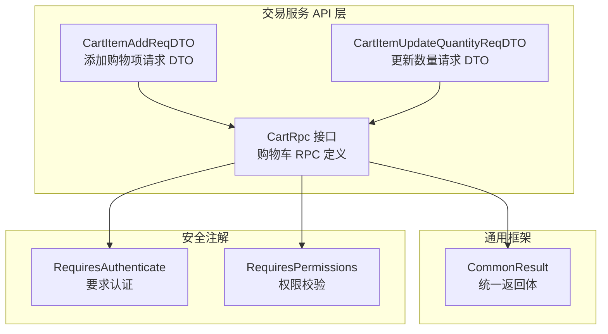
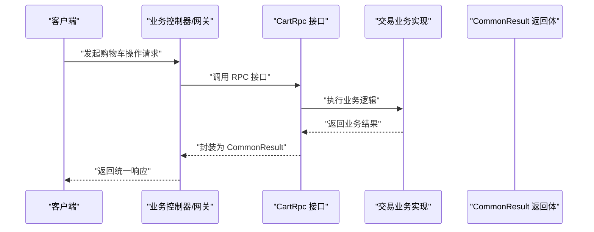
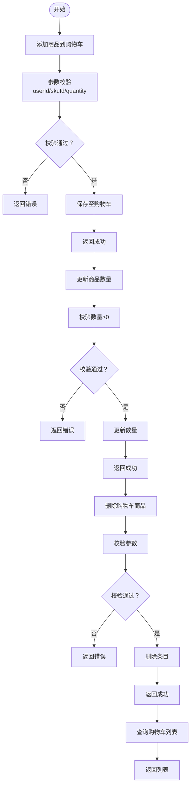
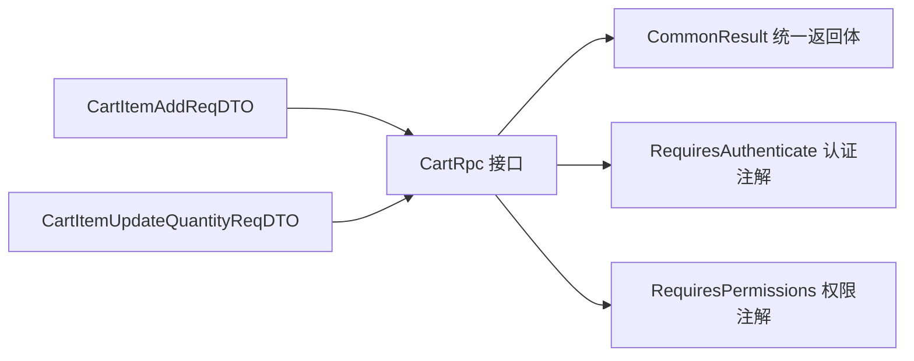

# 交易相关接口

<cite>
**本文引用的文件**
- [CartRpc.java](file://trade-service-project/trade-service-api/src/main/java/cn/iocoder/mall/tradeservice/rpc/cart/CartRpc.java)
- [CartItemAddReqDTO.java](file://trade-service-project/trade-service-api/src/main/java/cn/iocoder/mall/tradeservice/rpc/cart/dto/CartItemAddReqDTO.java)
- [CartItemUpdateQuantityReqDTO.java](file://trade-service-project/trade-service-api/src/main/java/cn/iocoder/mall/tradeservice/rpc/cart/dto/CartItemUpdateQuantityReqDTO.java)
- [CommonResult.java](file://common/common-framework/src/main/java/cn/iocoder/common/framework/vo/CommonResult.java)
- [RequiresAuthenticate.java](file://common/mall-security-annotations/src/main/java/cn/iocoder/security/annotations/RequiresAuthenticate.java)
- [RequiresPermissions.java](file://common/mall-security-annotations/src/main/java/cn/iocoder/security/annotations/RequiresPermissions.java)
</cite>

## 目录
1. [简介](#简介)
2. [项目结构](#项目结构)
3. [核心组件](#核心组件)
4. [架构总览](#架构总览)
5. [详细组件分析](#详细组件分析)
6. [依赖分析](#依赖分析)
7. [性能考虑](#性能考虑)
8. [故障排查指南](#故障排查指南)
9. [结论](#结论)
10. [附录](#附录)

## 简介
本文件聚焦于交易相关接口的API文档，覆盖购物车管理、订单创建与查询等交易流程的关键能力。基于当前仓库中可得的交易服务接口定义，本文提供接口规范、数据模型、调用流程、安全机制、一致性与并发控制策略、测试方法以及用户体验优化建议。由于订单相关RPC接口在当前上下文未找到对应文件，本文以购物车接口为核心，并对订单接口提供概念性说明以便后续扩展。

## 项目结构
交易相关接口主要位于 trade-service-project 模块中，采用 RPC 接口定义 + DTO 的分层设计，配合通用返回体与安全注解实现统一的对外契约与访问控制。

**图表来源**
- [CartRpc.java:1-62](file://trade-service-project/trade-service-api/src/main/java/cn/iocoder/mall/tradeservice/rpc/cart/CartRpc.java#L1-L62)
- [CartItemAddReqDTO.java:1-35](file://trade-service-project/trade-service-api/src/main/java/cn/iocoder/mall/tradeservice/rpc/cart/dto/CartItemAddReqDTO.java#L1-L35)
- [CartItemUpdateQuantityReqDTO.java:1-35](file://trade-service-project/trade-service-api/src/main/java/cn/iocoder/mall/tradeservice/rpc/cart/dto/CartItemUpdateQuantityReqDTO.java#L1-L35)
- [CommonResult.java](file://common/common-framework/src/main/java/cn/iocoder/common/framework/vo/CommonResult.java)

**章节来源**
- [CartRpc.java:1-62](file://trade-service-project/trade-service-api/src/main/java/cn/iocoder/mall/tradeservice/rpc/cart/CartRpc.java#L1-L62)

## 核心组件
- 购物车 RPC 接口：定义购物车的增删改查、数量更新、选中状态更新、统计与列表查询等能力。
- 请求 DTO：封装购物车操作所需的输入参数（如用户编号、SKU 编号、数量等）。
- 统一返回体：所有接口返回统一的包装结果对象，便于前端处理与错误识别。
- 安全注解：通过认证与权限注解保障接口访问安全。

**章节来源**
- [CartRpc.java:11-61](file://trade-service-project/trade-service-api/src/main/java/cn/iocoder/mall/tradeservice/rpc/cart/CartRpc.java#L11-L61)
- [CommonResult.java](file://common/common-framework/src/main/java/cn/iocoder/common/framework/vo/CommonResult.java)

## 架构总览
下图展示从客户端到交易服务的典型调用链路，以及与通用框架和安全注解的交互关系。

**图表来源**
- [CartRpc.java:11-61](file://trade-service-project/trade-service-api/src/main/java/cn/iocoder/mall/tradeservice/rpc/cart/CartRpc.java#L11-L61)
- [CommonResult.java](file://common/common-framework/src/main/java/cn/iocoder/common/framework/vo/CommonResult.java)

## 详细组件分析

### 购物车接口规范
以下为购物车相关接口的完整规范，涵盖 HTTP 方法、URL 路径、请求参数、响应格式与行为说明。

- 接口名称：添加购物车项
  - HTTP 方法：POST
  - URL 路径：/trade/cart/add
  - 请求头：需携带认证信息；根据权限策略可能需要特定权限
  - 请求体字段：
    - userId：整数，必填，用户编号
    - skuId：整数，必填，商品 SKU 编号
    - quantity：整数，必填，数量（>0）
  - 响应体字段：
    - code：整数，业务状态码
    - message：字符串，提示信息
    - data：布尔值，true 表示成功
  - 失败场景：
    - 参数缺失或不合法
    - 用户不存在或无权限
    - SKU 编号无效或库存不足（由业务实现决定）

- 接口名称：更新购物车商品数量
  - HTTP 方法：PUT
  - URL 路径：/trade/cart/updateQuantity
  - 请求头：需携带认证信息
  - 请求体字段：
    - userId：整数，必填
    - skuId：整数，必填
    - quantity：整数，必填，>0
  - 响应体字段：同上

- 接口名称：更新购物车商品选中状态
  - HTTP 方法：PATCH
  - URL 路径：/trade/cart/updateSelected
  - 请求头：需携带认证信息
  - 请求体字段：
    - userId：整数，必填
    - skuId：整数，必填
    - selected：布尔值，必填，true/false
  - 响应体字段：同上

- 接口名称：删除购物车商品
  - HTTP 方法：DELETE
  - URL 路径：/trade/cart/delete
  - 请求头：需携带认证信息
  - 请求体字段：
    - userId：整数，必填
    - skuIds：数组，必填，待删除的 SKU 编号列表
  - 响应体字段：同上

- 接口名称：统计购物车商品数量
  - HTTP 方法：GET
  - URL 路径：/trade/cart/sumQuantity
  - 请求头：需携带认证信息
  - 查询参数：
    - userId：整数，必填
  - 响应体字段：
    - code：整数
    - message：字符串
    - data：整数，购物车中商品总数量

- 接口名称：查询购物车列表
  - HTTP 方法：GET
  - URL 路径：/trade/cart/list
  - 请求头：需携带认证信息
  - 查询参数：
    - userId：整数，必填
    - selected：布尔值，可选，仅返回选中的条目
  - 响应体字段：
    - code：整数
    - message：字符串
    - data：数组，每项包含商品 SKU 编号、数量、价格、选中状态等信息

**章节来源**
- [CartRpc.java:13-59](file://trade-service-project/trade-service-api/src/main/java/cn/iocoder/mall/tradeservice/rpc/cart/CartRpc.java#L13-L59)
- [CommonResult.java](file://common/common-framework/src/main/java/cn/iocoder/common/framework/vo/CommonResult.java)

### 数据模型与复杂度分析
- 请求 DTO 结构
  - CartItemAddReqDTO：包含用户编号、SKU 编号、数量三个字段，均为非空且数量>0。
  - CartItemUpdateQuantityReqDTO：与添加请求类似，用于更新数量。
- 复杂度
  - 单条购物车项操作的时间复杂度通常为 O(1)，涉及缓存或数据库的读写。
  - 列表查询的时间复杂度取决于条目数量与索引使用情况，一般为 O(n)。
- 一致性与并发
  - 建议在更新数量时使用乐观锁或版本号，避免超卖与并发覆盖。
  - 对于批量删除与选中状态切换，建议使用事务或幂等设计确保最终一致。

**章节来源**
- [CartItemAddReqDTO.java:15-32](file://trade-service-project/trade-service-api/src/main/java/cn/iocoder/mall/tradeservice/rpc/cart/dto/CartItemAddReqDTO.java#L15-L32)
- [CartItemUpdateQuantityReqDTO.java:15-32](file://trade-service-project/trade-service-api/src/main/java/cn/iocoder/mall/tradeservice/rpc/cart/dto/CartItemUpdateQuantityReqDTO.java#L15-L32)

### 订单接口（概念性说明）
- 订单创建流程（概念）
  - 用户提交订单 -> 校验购物车与库存 -> 锁定库存 -> 生成订单 -> 发起支付 -> 支付回调同步 -> 完成订单
- 订单查询流程（概念）
  - 用户/商户查询订单 -> 根据订单号或状态筛选 -> 返回订单详情与物流信息
- 支付状态同步机制（概念）
  - 支付渠道回调 -> 校验签名 -> 幂等处理 -> 更新订单状态 -> 通知下游（如库存释放/发货）

[本节为概念性说明，不直接分析具体文件，故无“章节来源”]

### 购物车业务流程图

[该图为概念性流程示意，不直接映射具体源码文件，故无“图表来源”]

## 依赖分析
- CartRpc 依赖 CommonResult 作为统一返回体，确保前后端交互的一致性。
- CartRpc 可结合 RequiresAuthenticate 与 RequiresPermissions 注解进行访问控制，确保接口仅对已认证用户开放，并按权限策略放行。
- DTO 层通过注解实现参数校验，降低业务层重复校验成本。

**图表来源**
- [CartRpc.java:11-61](file://trade-service-project/trade-service-api/src/main/java/cn/iocoder/mall/tradeservice/rpc/cart/CartRpc.java#L11-L61)
- [CommonResult.java](file://common/common-framework/src/main/java/cn/iocoder/common/framework/vo/CommonResult.java)
- [RequiresAuthenticate.java](file://common/mall-security-annotations/src/main/java/cn/iocoder/security/annotations/RequiresAuthenticate.java)
- [RequiresPermissions.java](file://common/mall-security-annotations/src/main/java/cn/iocoder/security/annotations/RequiresPermissions.java)
- [CartItemAddReqDTO.java:15-32](file://trade-service-project/trade-service-api/src/main/java/cn/iocoder/mall/tradeservice/rpc/cart/dto/CartItemAddReqDTO.java#L15-L32)
- [CartItemUpdateQuantityReqDTO.java:15-32](file://trade-service-project/trade-service-api/src/main/java/cn/iocoder/mall/tradeservice/rpc/cart/dto/CartItemUpdateQuantityReqDTO.java#L15-L32)

**章节来源**
- [CartRpc.java:11-61](file://trade-service-project/trade-service-api/src/main/java/cn/iocoder/mall/tradeservice/rpc/cart/CartRpc.java#L11-L61)
- [CommonResult.java](file://common/common-framework/src/main/java/cn/iocoder/common/framework/vo/CommonResult.java)
- [RequiresAuthenticate.java](file://common/mall-security-annotations/src/main/java/cn/iocoder/security/annotations/RequiresAuthenticate.java)
- [RequiresPermissions.java](file://common/mall-security-annotations/src/main/java/cn/iocoder/security/annotations/RequiresPermissions.java)
- [CartItemAddReqDTO.java:15-32](file://trade-service-project/trade-service-api/src/main/java/cn/iocoder/mall/tradeservice/rpc/cart/dto/CartItemAddReqDTO.java#L15-L32)
- [CartItemUpdateQuantityReqDTO.java:15-32](file://trade-service-project/trade-service-api/src/main/java/cn/iocoder/mall/tradeservice/rpc/cart/dto/CartItemUpdateQuantityReqDTO.java#L15-L32)

## 性能考虑
- 缓存策略：购物车列表与统计可引入缓存，减少数据库压力；更新时采用写后失效或版本控制。
- 批量操作：批量删除与批量更新选中状态应尽量合并为单次调用，降低网络开销。
- 分页与过滤：列表查询支持分页与筛选，避免一次性返回大量数据。
- 并发控制：更新数量与删除操作建议使用分布式锁或版本号，防止超卖与竞态。
- 异步通知：订单支付完成后通过消息队列异步处理，避免阻塞主流程。

[本节为通用性能建议，不直接分析具体文件，故无“章节来源”]

## 故障排查指南
- 常见错误类型
  - 参数校验失败：检查 userId、skuId、quantity 是否为空或非法。
  - 权限不足：确认是否已登录及是否具备相应权限。
  - 业务异常：查看返回的业务状态码与消息，定位具体原因。
- 日志与监控
  - 在接口层打印请求与响应日志，便于问题追踪。
  - 对关键操作（如库存锁定、支付回调）增加埋点与告警。
- 幂等性与重试
  - 对外部回调（如支付通知）进行幂等处理，避免重复更新。
  - 对网络抖动导致的失败进行指数退避重试。

[本节为通用排查建议，不直接分析具体文件，故无“章节来源”]

## 结论
本文基于现有代码库梳理了购物车相关接口的规范与实现要点，明确了请求参数、响应格式与调用流程，并提供了安全机制、一致性与并发控制策略、性能优化与故障排查建议。对于订单相关接口，本文给出了概念性说明以便后续扩展。建议在后续迭代中补充订单 RPC 接口定义与实现细节，完善端到端交易流程的文档闭环。

[本节为总结性内容，不直接分析具体文件，故无“章节来源”]

## 附录

### 使用场景示例（概念性）
- 场景一：添加商品到购物车
  - 步骤：选择商品 -> 输入数量 -> 调用添加接口 -> 校验返回 -> 刷新购物车页面
- 场景二：批量结算
  - 步骤：勾选多个商品 -> 点击结算 -> 校验库存 -> 生成订单 -> 发起支付 -> 支付回调 -> 订单完成
- 场景三：订单确认与支付
  - 步骤：订单列表 -> 选择未支付订单 -> 进入订单详情 -> 确认收货信息 -> 发起支付 -> 支付完成 -> 订单状态更新

[本节为概念性示例，不直接分析具体文件，故无“章节来源”]