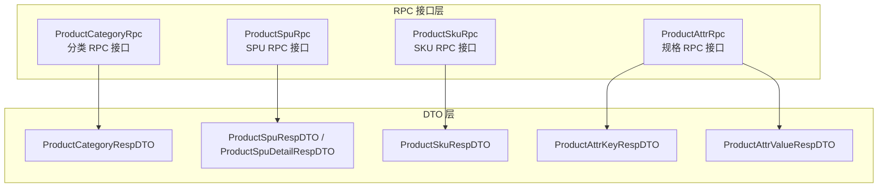
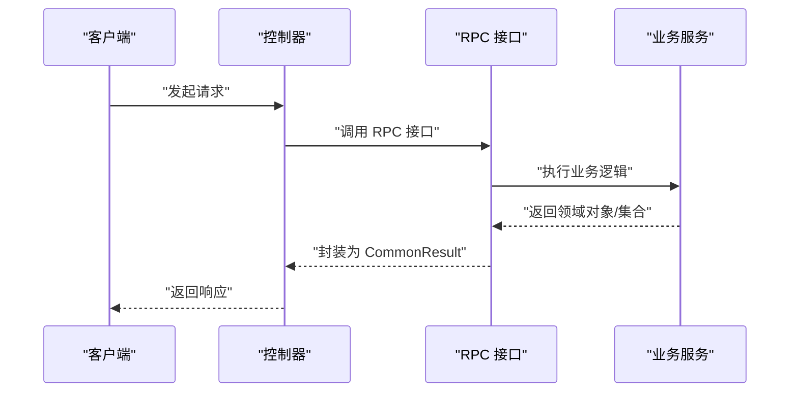
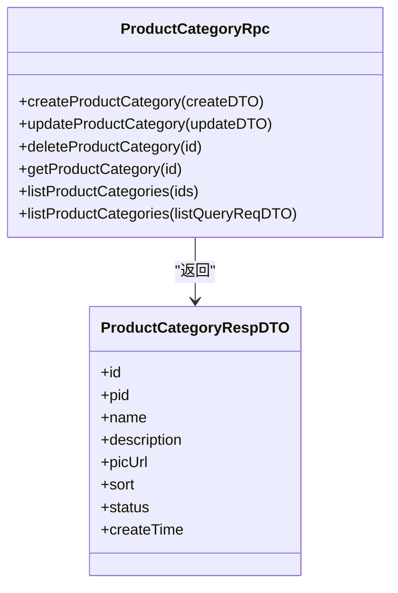
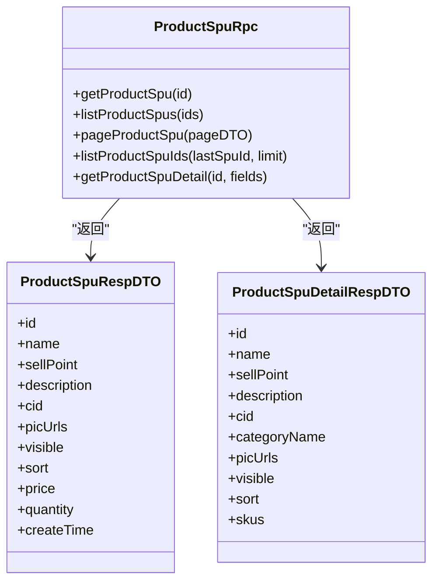
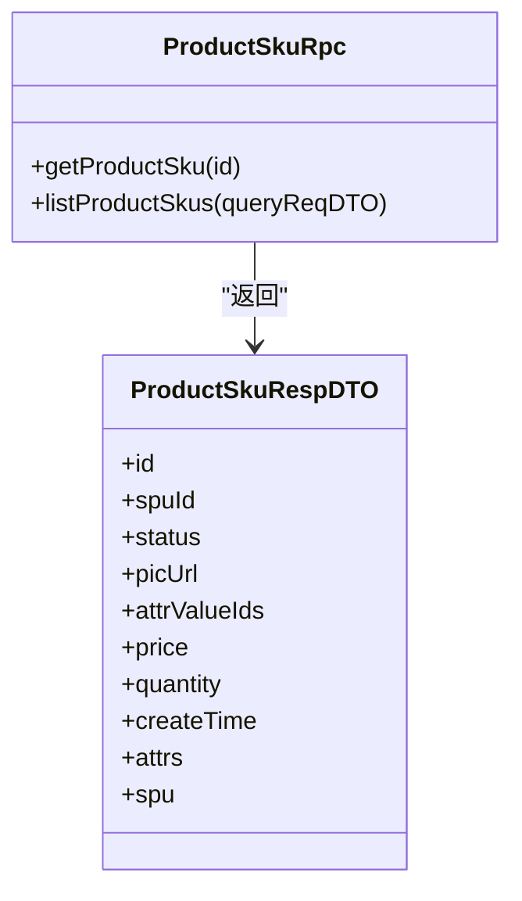
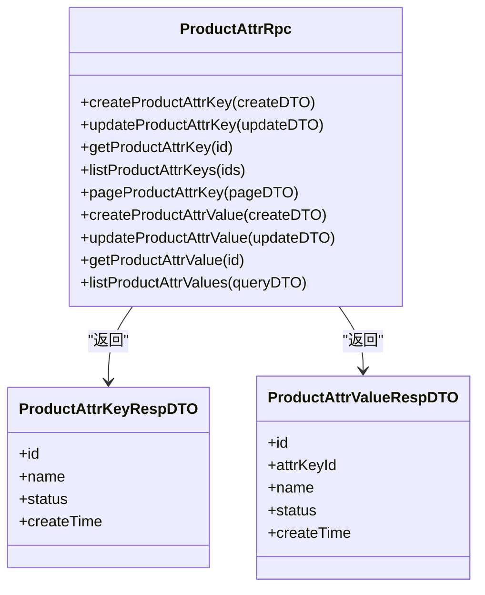
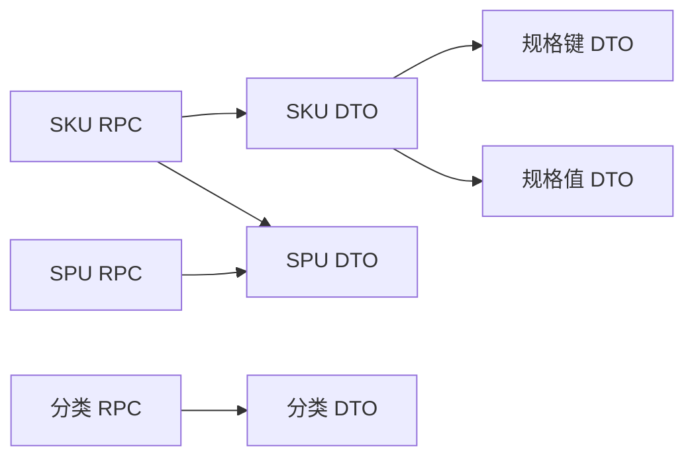
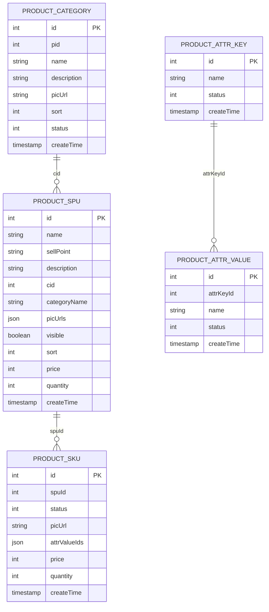

# 商品相关接口

<cite>
**本文引用的文件**
- [ProductCategoryRpc.java](file://product-service-project/product-service-api/src/main/java/cn/iocoder/mall/productservice/rpc/category/ProductCategoryRpc.java)
- [ProductCategoryRespDTO.java](file://product-service-project/product-service-api/src/main/java/cn/iocoder/mall/productservice/rpc/category/dto/ProductCategoryRespDTO.java)
- [ProductSpuRpc.java](file://product-service-project/product-service-api/src/main/java/cn/iocoder/mall/productservice/rpc/spu/ProductSpuRpc.java)
- [ProductSpuRespDTO.java](file://product-service-project/product-service-api/src/main/java/cn/iocoder/mall/productservice/rpc/spu/dto/ProductSpuRespDTO.java)
- [ProductSpuDetailRespDTO.java](file://product-service-project/product-service-api/src/main/java/cn/iocoder/mall/productservice/rpc/spu/dto/ProductSpuDetailRespDTO.java)
- [ProductSkuRpc.java](file://product-service-project/product-service-api/src/main/java/cn/iocoder/mall/productservice/rpc/sku/ProductSkuRpc.java)
- [ProductSkuRespDTO.java](file://product-service-project/product-service-api/src/main/java/cn/iocoder/mall/productservice/rpc/sku/dto/ProductSkuRespDTO.java)
- [ProductAttrRpc.java](file://product-service-project/product-service-api/src/main/java/cn/iocoder/mall/productservice/rpc/attr/ProductAttrRpc.java)
- [ProductAttrKeyRespDTO.java](file://product-service-project/product-service-api/src/main/java/cn/iocoder/mall/productservice/rpc/attr/dto/ProductAttrKeyRespDTO.java)
- [ProductAttrValueRespDTO.java](file://product-service-project/product-service-api/src/main/java/cn/iocoder/mall/productservice/rpc/attr/dto/ProductAttrValueRespDTO.java)
</cite>

## 目录
1. [简介](#简介)
2. [项目结构](#项目结构)
3. [核心组件](#核心组件)
4. [架构总览](#架构总览)
5. [详细组件分析](#详细组件分析)
6. [依赖分析](#依赖分析)
7. [性能考虑](#性能考虑)
8. [故障排查指南](#故障排查指南)
9. [结论](#结论)
10. [附录](#附录)

## 简介
本文件面向“商品相关接口”的使用者与维护者，系统化梳理商品分类查询、SPU 商品详情、SKU 规格查询等商品展示相关接口的定义与实现要点。内容覆盖接口规范（HTTP 方法、URL 路径、请求参数、响应格式）、数据模型、处理流程、缓存策略、图片加载优化、性能考量以及测试与用户体验建议。

## 项目结构
- 商品服务采用 RPC 接口与 DTO 的分层设计：
  - RPC 接口位于 product-service-api 模块，定义对外暴露的服务契约；
  - DTO 定义在对应的 rpc.*.dto 包中，用于传输数据；
  - 实现位于 product-service-app 模块（当前仓库未包含该模块源码，但接口契约清晰）。

图表来源
- [ProductCategoryRpc.java:15-62](file://product-service-project/product-service-api/src/main/java/cn/iocoder/mall/productservice/rpc/category/ProductCategoryRpc.java#L15-L62)
- [ProductSpuRpc.java:13-65](file://product-service-project/product-service-api/src/main/java/cn/iocoder/mall/productservice/rpc/spu/ProductSpuRpc.java#L13-L65)
- [ProductSkuRpc.java:12-30](file://product-service-project/product-service-api/src/main/java/cn/iocoder/mall/productservice/rpc/sku/ProductSkuRpc.java#L12-L30)
- [ProductAttrRpc.java:12-84](file://product-service-project/product-service-api/src/main/java/cn/iocoder/mall/productservice/rpc/attr/ProductAttrRpc.java#L12-L84)

章节来源
- [ProductCategoryRpc.java:15-62](file://product-service-project/product-service-api/src/main/java/cn/iocoder/mall/productservice/rpc/category/ProductCategoryRpc.java#L15-L62)
- [ProductSpuRpc.java:13-65](file://product-service-project/product-service-api/src/main/java/cn/iocoder/mall/productservice/rpc/spu/ProductSpuRpc.java#L13-L65)
- [ProductSkuRpc.java:12-30](file://product-service-project/product-service-api/src/main/java/cn/iocoder/mall/productservice/rpc/sku/ProductSkuRpc.java#L12-L30)
- [ProductAttrRpc.java:12-84](file://product-service-project/product-service-api/src/main/java/cn/iocoder/mall/productservice/rpc/attr/ProductAttrRpc.java#L12-L84)

## 核心组件
- 商品分类 RPC 接口：提供分类的增删改查、列表查询能力。
- SPU RPC 接口：提供 SPU 的单个查询、批量查询、分页查询、明细查询等能力。
- SKU RPC 接口：提供 SKU 的单个查询、列表查询能力。
- 规格 RPC 接口：提供规格键与规格值的增删改查、分页与列表查询能力。

章节来源
- [ProductCategoryRpc.java:15-62](file://product-service-project/product-service-api/src/main/java/cn/iocoder/mall/productservice/rpc/category/ProductCategoryRpc.java#L15-L62)
- [ProductSpuRpc.java:13-65](file://product-service-project/product-service-api/src/main/java/cn/iocoder/mall/productservice/rpc/spu/ProductSpuRpc.java#L13-L65)
- [ProductSkuRpc.java:12-30](file://product-service-project/product-service-api/src/main/java/cn/iocoder/mall/productservice/rpc/sku/ProductSkuRpc.java#L12-L30)
- [ProductAttrRpc.java:12-84](file://product-service-project/product-service-api/src/main/java/cn/iocoder/mall/productservice/rpc/attr/ProductAttrRpc.java#L12-L84)

## 架构总览
- 控制器通过 RPC 接口调用业务服务，返回统一包装的结果对象。
- DTO 作为跨进程传输的数据载体，包含必要的字段与注释说明。

图表来源
- [ProductSpuRpc.java:13-65](file://product-service-project/product-service-api/src/main/java/cn/iocoder/mall/productservice/rpc/spu/ProductSpuRpc.java#L13-L65)
- [ProductCategoryRpc.java:15-62](file://product-service-project/product-service-api/src/main/java/cn/iocoder/mall/productservice/rpc/category/ProductCategoryRpc.java#L15-L62)
- [ProductSkuRpc.java:12-30](file://product-service-project/product-service-api/src/main/java/cn/iocoder/mall/productservice/rpc/sku/ProductSkuRpc.java#L12-L30)
- [ProductAttrRpc.java:12-84](file://product-service-project/product-service-api/src/main/java/cn/iocoder/mall/productservice/rpc/attr/ProductAttrRpc.java#L12-L84)

## 详细组件分析

### 商品分类查询接口
- 接口职责
  - 获取单个分类详情
  - 根据编号列表批量获取分类
  - 条件查询分类列表
  - 新增、更新、删除分类（管理端）
- 请求与响应
  - 请求参数：分类编号、查询条件、新增/更新数据体
  - 响应：CommonResult 包裹分类 DTO 列表或单项
- 数据模型
  - 分类 DTO 字段包含：id、pid、name、description、picUrl、sort、status、createTime

图表来源
- [ProductCategoryRpc.java:15-62](file://product-service-project/product-service-api/src/main/java/cn/iocoder/mall/productservice/rpc/category/ProductCategoryRpc.java#L15-L62)
- [ProductCategoryRespDTO.java:14-49](file://product-service-project/product-service-api/src/main/java/cn/iocoder/mall/productservice/rpc/category/dto/ProductCategoryRespDTO.java#L14-L49)

章节来源
- [ProductCategoryRpc.java:15-62](file://product-service-project/product-service-api/src/main/java/cn/iocoder/mall/productservice/rpc/category/ProductCategoryRpc.java#L15-L62)
- [ProductCategoryRespDTO.java:14-49](file://product-service-project/product-service-api/src/main/java/cn/iocoder/mall/productservice/rpc/category/dto/ProductCategoryRespDTO.java#L14-L49)

### SPU 商品详情接口
- 接口职责
  - 获取单个 SPU 详情（可按字段选择）
  - 获取 SPU 列表与分页
  - 获取顺序递增的 SPU 编号列表
- 请求与响应
  - 请求参数：SPU 编号、编号集合、分页参数、字段选择集合
  - 响应：CommonResult 包裹 SPU DTO 或分页结果
- 数据模型
  - SPU 响应 DTO 字段包含：id、name、sellPoint、description、cid、picUrls、visible、sort、price、quantity、createTime
  - SPU 明细 DTO 字段包含：id、name、sellPoint、description、cid、categoryName、picUrls、visible、sort、skus；其中 skus 内含 attrs、price、quantity 等

图表来源
- [ProductSpuRpc.java:13-65](file://product-service-project/product-service-api/src/main/java/cn/iocoder/mall/productservice/rpc/spu/ProductSpuRpc.java#L13-L65)
- [ProductSpuRespDTO.java:15-62](file://product-service-project/product-service-api/src/main/java/cn/iocoder/mall/productservice/rpc/spu/dto/ProductSpuRespDTO.java#L15-L62)
- [ProductSpuDetailRespDTO.java:15-103](file://product-service-project/product-service-api/src/main/java/cn/iocoder/mall/productservice/rpc/spu/dto/ProductSpuDetailRespDTO.java#L15-L103)

章节来源
- [ProductSpuRpc.java:13-65](file://product-service-project/product-service-api/src/main/java/cn/iocoder/mall/productservice/rpc/spu/ProductSpuRpc.java#L13-L65)
- [ProductSpuRespDTO.java:15-62](file://product-service-project/product-service-api/src/main/java/cn/iocoder/mall/productservice/rpc/spu/dto/ProductSpuRespDTO.java#L15-L62)
- [ProductSpuDetailRespDTO.java:15-103](file://product-service-project/product-service-api/src/main/java/cn/iocoder/mall/productservice/rpc/spu/dto/ProductSpuDetailRespDTO.java#L15-L103)

### SKU 规格查询接口
- 接口职责
  - 获取单个 SKU 详情
  - 根据查询条件获取 SKU 列表
- 请求与响应
  - 请求参数：SKU 编号、查询条件（如 attrValueIds 等）
  - 响应：CommonResult 包裹 SKU DTO 列表或单项
- 数据模型
  - SKU 响应 DTO 字段包含：id、spuId、status、picUrl、attrValueIds、price、quantity、createTime、attrs、spu

图表来源
- [ProductSkuRpc.java:12-30](file://product-service-project/product-service-api/src/main/java/cn/iocoder/mall/productservice/rpc/sku/ProductSkuRpc.java#L12-L30)
- [ProductSkuRespDTO.java:18-67](file://product-service-project/product-service-api/src/main/java/cn/iocoder/mall/productservice/rpc/sku/dto/ProductSkuRespDTO.java#L18-L67)

章节来源
- [ProductSkuRpc.java:12-30](file://product-service-project/product-service-api/src/main/java/cn/iocoder/mall/productservice/rpc/sku/ProductSkuRpc.java#L12-L30)
- [ProductSkuRespDTO.java:18-67](file://product-service-project/product-service-api/src/main/java/cn/iocoder/mall/productservice/rpc/sku/dto/ProductSkuRespDTO.java#L18-L67)

### 规格键与规格值接口
- 接口职责
  - 规格键：新增、更新、查询、分页、列表
  - 规格值：新增、更新、查询、列表
- 请求与响应
  - 请求参数：规格键/值的新增/更新数据体、查询条件、分页参数
  - 响应：CommonResult 包裹规格 DTO 列表或单项
- 数据模型
  - 规格键 DTO：id、name、status、createTime
  - 规格值 DTO：id、attrKeyId、name、status、createTime

图表来源
- [ProductAttrRpc.java:12-84](file://product-service-project/product-service-api/src/main/java/cn/iocoder/mall/productservice/rpc/attr/ProductAttrRpc.java#L12-L84)
- [ProductAttrKeyRespDTO.java:14-33](file://product-service-project/product-service-api/src/main/java/cn/iocoder/mall/productservice/rpc/attr/dto/ProductAttrKeyRespDTO.java#L14-L33)
- [ProductAttrValueRespDTO.java:14-37](file://product-service-project/product-service-api/src/main/java/cn/iocoder/mall/productservice/rpc/attr/dto/ProductAttrValueRespDTO.java#L14-L37)

章节来源
- [ProductAttrRpc.java:12-84](file://product-service-project/product-service-api/src/main/java/cn/iocoder/mall/productservice/rpc/attr/ProductAttrRpc.java#L12-L84)
- [ProductAttrKeyRespDTO.java:14-33](file://product-service-project/product-service-api/src/main/java/cn/iocoder/mall/productservice/rpc/attr/dto/ProductAttrKeyRespDTO.java#L14-L33)
- [ProductAttrValueRespDTO.java:14-37](file://product-service-project/product-service-api/src/main/java/cn/iocoder/mall/productservice/rpc/attr/dto/ProductAttrValueRespDTO.java#L14-L37)

## 依赖分析
- 组件耦合
  - RPC 接口与 DTO 一一对应，职责清晰，便于扩展与替换
  - SKU 与 SPU 存在一对多关系，SKU 中包含 SPU 引用字段
  - SKU 与规格键值存在多对多关系，SKU 通过 attrValueIds 关联规格值
- 外部依赖
  - 统一返回包装类型（CommonResult），便于错误处理与版本演进
  - DTO 中包含字段注释，有助于前端与文档生成工具对接

图表来源
- [ProductSkuRpc.java:12-30](file://product-service-project/product-service-api/src/main/java/cn/iocoder/mall/productservice/rpc/sku/ProductSkuRpc.java#L12-L30)
- [ProductSkuRespDTO.java:18-67](file://product-service-project/product-service-api/src/main/java/cn/iocoder/mall/productservice/rpc/sku/dto/ProductSkuRespDTO.java#L18-L67)
- [ProductSpuRpc.java:13-65](file://product-service-project/product-service-api/src/main/java/cn/iocoder/mall/productservice/rpc/spu/ProductSpuRpc.java#L13-L65)
- [ProductCategoryRpc.java:15-62](file://product-service-project/product-service-api/src/main/java/cn/iocoder/mall/productservice/rpc/category/ProductCategoryRpc.java#L15-L62)

章节来源
- [ProductSkuRespDTO.java:18-67](file://product-service-project/product-service-api/src/main/java/cn/iocoder/mall/productservice/rpc/sku/dto/ProductSkuRespDTO.java#L18-L67)
- [ProductSpuRespDTO.java:15-62](file://product-service-project/product-service-api/src/main/java/cn/iocoder/mall/productservice/rpc/spu/dto/ProductSpuRespDTO.java#L15-L62)
- [ProductCategoryRespDTO.java:14-49](file://product-service-project/product-service-api/src/main/java/cn/iocoder/mall/productservice/rpc/category/dto/ProductCategoryRespDTO.java#L14-L49)

## 性能考虑
- 查询优化
  - 使用批量查询接口（如 listProductSpus、listProductCategories、listProductSkus）减少网络往返
  - 对于高频访问的 SPU 列表与详情，结合本地缓存与分布式缓存（Redis）降低数据库压力
- 分页与字段裁剪
  - SPU 明细支持字段选择，避免不必要的字段传输
  - 合理设置分页大小，避免一次性返回过多数据
- 图片加载优化
  - 主图采用固定尺寸（如 800x800）与压缩策略，减少带宽占用
  - 支持懒加载与占位图，提升首屏渲染体验
- 并发与一致性
  - SKU 库存读写分离，写操作采用队列异步更新，读取走缓存
  - 使用分布式锁或版本号控制库存超卖风险

## 故障排查指南
- 常见问题
  - 参数校验失败：检查请求 DTO 字段是否完整且符合约束
  - 数据为空：确认编号是否存在、状态是否有效、可见性是否开启
  - 性能瓶颈：核查是否使用了批量查询、是否启用了缓存、是否过度传输字段
- 错误码与异常
  - 统一使用 CommonResult 包裹结果，错误时返回错误码与提示信息
  - 建议在网关或拦截器中记录请求日志，便于定位问题

## 结论
本文档基于现有 RPC 接口与 DTO 定义，系统化梳理了商品分类、SPU 详情与 SKU 规格查询的关键接口与数据模型。通过批量查询、字段裁剪、缓存与图片优化等手段，可在保证功能完整性的同时显著提升性能与用户体验。

## 附录

### 接口规范总览（示例）
- 商品分类查询
  - 方法：GET
  - 路径：/product/category/get/{id}
  - 请求参数：id（路径参数）
  - 响应：CommonResult<ProductCategoryRespDTO>
- SPU 详情查询
  - 方法：GET
  - 路径：/product/spu/detail/{id}
  - 请求参数：id（路径参数）
  - 响应：CommonResult<ProductSpuDetailRespDTO>
- SKU 列表查询
  - 方法：POST
  - 路径：/product/sku/list
  - 请求体：ProductSkuListQueryReqDTO
  - 响应：CommonResult<List<ProductSkuRespDTO>>

### 商品浏览使用场景示例
- 分类筛选
  - 步骤：拉取分类树 → 用户选择分类 → 按分类编号查询 SPU 列表 → 展示主图与价格
- 商品搜索
  - 步骤：关键词匹配 → 返回 SPU 列表 → 点击进入详情页 → 加载 SKU 规格与库存
- 规格选择
  - 步骤：展示 SKU 组合 → 用户选择规格 → 更新价格与库存 → 提示可购买数量

### 数据模型关系图

图表来源
- [ProductCategoryRespDTO.java:14-49](file://product-service-project/product-service-api/src/main/java/cn/iocoder/mall/productservice/rpc/category/dto/ProductCategoryRespDTO.java#L14-L49)
- [ProductSpuRespDTO.java:15-62](file://product-service-project/product-service-api/src/main/java/cn/iocoder/mall/productservice/rpc/spu/dto/ProductSpuRespDTO.java#L15-L62)
- [ProductSpuDetailRespDTO.java:15-103](file://product-service-project/product-service-api/src/main/java/cn/iocoder/mall/productservice/rpc/spu/dto/ProductSpuDetailRespDTO.java#L15-L103)
- [ProductSkuRespDTO.java:18-67](file://product-service-project/product-service-api/src/main/java/cn/iocoder/mall/productservice/rpc/sku/dto/ProductSkuRespDTO.java#L18-L67)
- [ProductAttrKeyRespDTO.java:14-33](file://product-service-project/product-service-api/src/main/java/cn/iocoder/mall/productservice/rpc/attr/dto/ProductAttrKeyRespDTO.java#L14-L33)
- [ProductAttrValueRespDTO.java:14-37](file://product-service-project/product-service-api/src/main/java/cn/iocoder/mall/productservice/rpc/attr/dto/ProductAttrValueRespDTO.java#L14-L37)