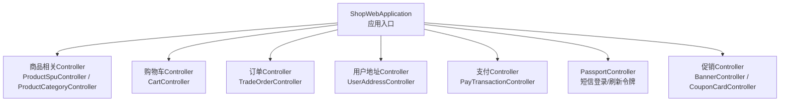
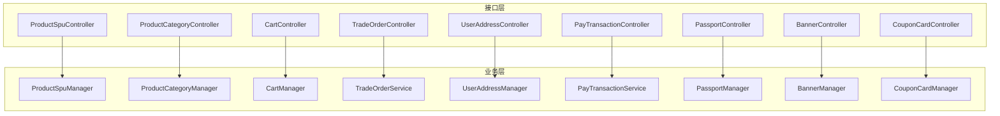
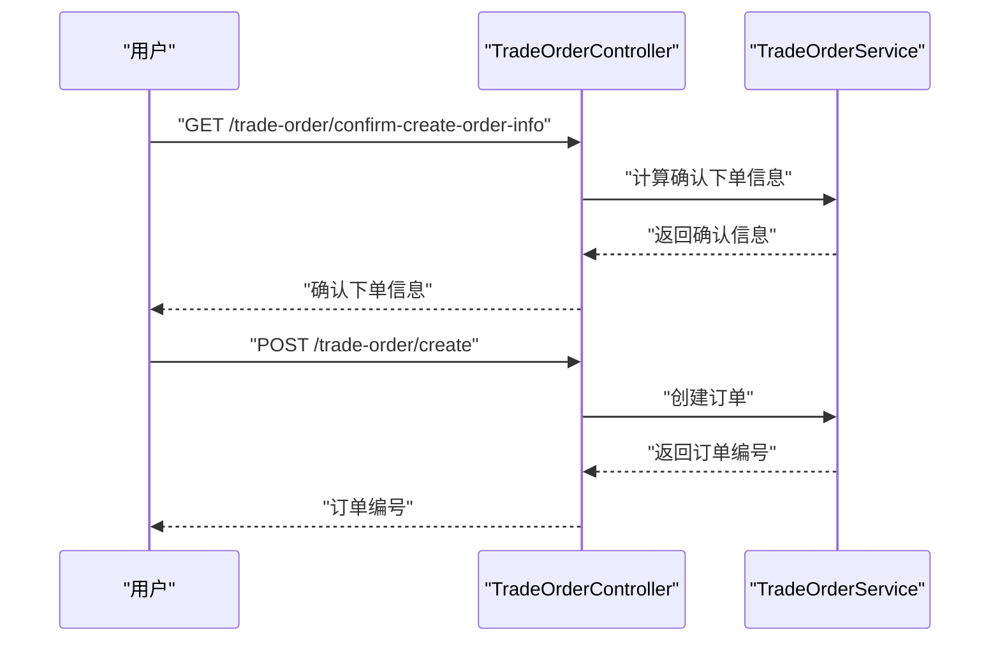
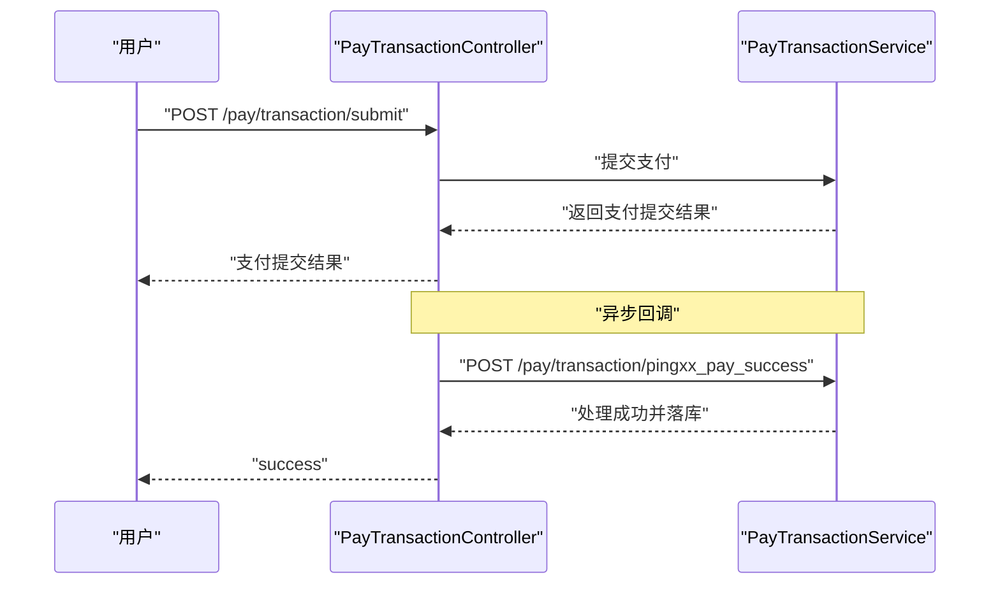
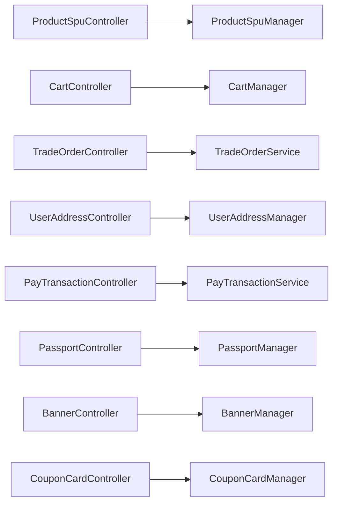

# 商城前端接口

<cite>
**本文引用的文件**
- [ShopWebApplication.java](file://shop-web-app/src/main/java/cn/iocoder/mall/shopweb/ShopWebApplication.java)
- [ProductSpuController.java](file://shop-web-app/src/main/java/cn/idiocoder/mall/shopweb/controller/product/ProductSpuController.java)
- [ProductCategoryController.java](file://shop-web-app/src/main/java/cn/idiocoder/mall/shopweb/controller/product/ProductCategoryController.java)
- [CartController.java](file://shop-web-app/src/main/java/cn/idiocoder/mall/shopweb/controller/trade/CartController.java)
- [TradeOrderController.java](file://shop-web-app/src/main/java/cn/idiocoder/mall/shopweb/controller/trade/TradeOrderController.java)
- [UserAddressController.java](file://shop-web-app/src/main/java/cn/idiocoder/mall/shopweb/controller/user/UserAddressController.java)
- [PayTransactionController.java](file://shop-web-app/src/main/java/cn/idiocoder/mall/shopweb/controller/pay/PayTransactionController.java)
- [PassportController.java](file://shop-web-app/src/main/java/cn/idiocoder/mall/shopweb/controller/user/PassportController.java)
- [BannerController.java](file://shop-web-app/src/main/java/cn/idiocoder/mall/shopweb/controller/promotion/BannerController.java)
- [CouponCardController.java](file://shop-web-app/src/main/java/cn/idiocoder/mall/shopweb/controller/promotion/CouponCardController.java)
</cite>

## 目录
1. [简介](#简介)
2. [项目结构](#项目结构)
3. [核心组件](#核心组件)
4. [架构总览](#架构总览)
5. [详细组件分析](#详细组件分析)
6. [依赖分析](#依赖分析)
7. [性能考虑](#性能考虑)
8. [故障排查指南](#故障排查指南)
9. [结论](#结论)
10. [附录](#附录)

## 简介
本文件为“商城前端接口”模块的完整API文档，覆盖用户端主要业务接口，包括商品浏览（SPU/分类）、购物车管理、订单交易、用户账户与短信登录、收货地址管理、促销（Banner、优惠券）以及支付交易与回调。文档逐项给出HTTP方法、URL路径、请求参数、响应结构、典型使用场景、用户体验优化建议、性能与缓存策略，以及接口测试方法。

## 项目结构
- 前端接口服务采用Spring Boot应用启动，入口类位于shop-web-app模块。
- 接口按业务域划分在不同Controller中，统一通过@RestController暴露REST API。
- 控制器依赖对应Manager或Service进行业务处理，返回统一的CommonResult包装结果。

图表来源
- [ShopWebApplication.java:1-14](file://shop-web-app/src/main/java/cn/idiocoder/mall/shopweb/ShopWebApplication.java#L1-L14)
- [ProductSpuController.java:1-53](file://shop-web-app/src/main/java/cn/idiocoder/mall/shopweb/controller/product/ProductSpuController.java#L1-L53)
- [ProductCategoryController.java:1-37](file://shop-web-app/src/main/java/cn/idiocoder/mall/shopweb/controller/product/ProductCategoryController.java#L1-L37)
- [CartController.java:1-84](file://shop-web-app/src/main/java/cn/idiocoder/mall/shopweb/controller/trade/CartController.java#L1-L84)
- [TradeOrderController.java:1-85](file://shop-web-app/src/main/java/cn/idiocoder/mall/shopweb/controller/trade/TradeOrderController.java#L1-L85)
- [UserAddressController.java:1-81](file://shop-web-app/src/main/java/cn/idiocoder/mall/shopweb/controller/user/UserAddressController.java#L1-L81)
- [PayTransactionController.java:1-82](file://shop-web-app/src/main/java/cn/idiocoder/mall/shopweb/controller/pay/PayTransactionController.java#L1-L82)
- [PassportController.java:1-57](file://shop-web-app/src/main/java/cn/idiocoder/mall/shopweb/controller/user/PassportController.java#L1-L57)
- [BannerController.java:1-34](file://shop-web-app/src/main/java/cn/idiocoder/mall/shopweb/controller/promotion/BannerController.java#L1-L34)
- [CouponCardController.java:1-44](file://shop-web-app/src/main/java/cn/idiocoder/mall/shopweb/controller/promotion/CouponCardController.java#L1-L44)

章节来源
- [ShopWebApplication.java:1-14](file://shop-web-app/src/main/java/cn/idiocoder/mall/shopweb/ShopWebApplication.java#L1-L14)

## 核心组件
- 商品域：SPU分页、详情、搜索条件；分类列表
- 购物车：添加、数量更新、选中状态更新、汇总数量、明细查询
- 订单域：确认下单信息（单SKU/购物车）、创建订单、获取订单、分页查询
- 用户域：短信登录、发送验证码、刷新令牌
- 地址域：创建、更新、删除、获取、默认地址、列表
- 促销域：Banner列表、优惠券分页与领取
- 支付域：查询支付交易、提交支付、Ping++回调

章节来源
- [ProductSpuController.java:1-53](file://shop-web-app/src/main/java/cn/idiocoder/mall/shopweb/controller/product/ProductSpuController.java#L1-L53)
- [ProductCategoryController.java:1-37](file://shop-web-app/src/main/java/cn/idiocoder/mall/shopweb/controller/product/ProductCategoryController.java#L1-L37)
- [CartController.java:1-84](file://shop-web-app/src/main/java/cn/idiocoder/mall/shopweb/controller/trade/CartController.java#L1-L84)
- [TradeOrderController.java:1-85](file://shop-web-app/src/main/java/cn/idiocoder/mall/shopweb/controller/trade/TradeOrderController.java#L1-L85)
- [PassportController.java:1-57](file://shop-web-app/src/main/java/cn/idiocoder/mall/shopweb/controller/user/PassportController.java#L1-L57)
- [UserAddressController.java:1-81](file://shop-web-app/src/main/java/cn/idiocoder/mall/shopweb/controller/user/UserAddressController.java#L1-L81)
- [BannerController.java:1-34](file://shop-web-app/src/main/java/cn/idiocoder/mall/shopweb/controller/promotion/BannerController.java#L1-L34)
- [CouponCardController.java:1-44](file://shop-web-app/src/main/java/cn/idiocoder/mall/shopweb/controller/promotion/CouponCardController.java#L1-L44)
- [PayTransactionController.java:1-82](file://shop-web-app/src/main/java/cn/idiocoder/mall/shopweb/controller/pay/PayTransactionController.java#L1-L82)

## 架构总览
前端接口层通过REST API对外提供能力，统一返回CommonResult包装体，内部调用各域Manager/Service完成业务处理。认证与权限控制由安全注解标注（如RequiresAuthenticate、RequiresPermissions、RequiresNone）。

图表来源
- [ProductSpuController.java:1-53](file://shop-web-app/src/main/java/cn/idiocoder/mall/shopweb/controller/product/ProductSpuController.java#L1-L53)
- [ProductCategoryController.java:1-37](file://shop-web-app/src/main/java/cn/idiocoder/mall/shopweb/controller/product/ProductCategoryController.java#L1-L37)
- [CartController.java:1-84](file://shop-web-app/src/main/java/cn/idiocoder/mall/shopweb/controller/trade/CartController.java#L1-L84)
- [TradeOrderController.java:1-85](file://shop-web-app/src/main/java/cn/idiocoder/mall/shopweb/controller/trade/TradeOrderController.java#L1-L85)
- [UserAddressController.java:1-81](file://shop-web-app/src/main/java/cn/idiocoder/mall/shopweb/controller/user/UserAddressController.java#L1-L81)
- [PayTransactionController.java:1-82](file://shop-web-app/src/main/java/cn/idiocoder/mall/shopweb/controller/pay/PayTransactionController.java#L1-L82)
- [PassportController.java:1-57](file://shop-web-app/src/main/java/cn/idiocoder/mall/shopweb/controller/user/PassportController.java#L1-L57)
- [BannerController.java:1-34](file://shop-web-app/src/main/java/cn/idiocoder/mall/shopweb/controller/promotion/BannerController.java#L1-L34)
- [CouponCardController.java:1-44](file://shop-web-app/src/main/java/cn/idiocoder/mall/shopweb/controller/promotion/CouponCardController.java#L1-L44)

## 详细组件分析

### 商品 SPU API
- 获取SPU分页
  - 方法与路径：GET /product-spu/page
  - 请求参数：分页相关字段（见请求对象）
  - 响应：分页结果，包含SPU列表
  - 典型场景：首页/分类页加载商品列表
- 获取搜索条件
  - 方法与路径：GET /product-spu/search-condition
  - 请求参数：keyword（可选）
  - 响应：搜索条件聚合
  - 典型场景：搜索页筛选条件展示
- 获取SPU明细
  - 方法与路径：GET /product-spu/get-detail
  - 请求参数：id（SPU编号）
  - 响应：SPU详情及SKU等信息
  - 典型场景：商品详情页渲染

章节来源
- [ProductSpuController.java:31-50](file://shop-web-app/src/main/java/cn/idiocoder/mall/shopweb/controller/product/ProductSpuController.java#L31-L50)

### 商品分类 API
- 获取分类列表
  - 方法与路径：GET /product-category/list
  - 请求参数：pid（父分类编号）
  - 响应：分类列表
  - 典型场景：导航/筛选

章节来源
- [ProductCategoryController.java:29-34](file://shop-web-app/src/main/java/cn/idiocoder/mall/shopweb/controller/product/ProductCategoryController.java#L29-L34)

### 购物车 API
- 添加商品到购物车
  - 方法与路径：POST /cart/add
  - 请求参数：skuId、quantity
  - 鉴权：需要登录
  - 响应：布尔成功
  - 典型场景：商品详情页加入购物车
- 查询购物车商品数量汇总
  - 方法与路径：GET /cart/sum-quantity
  - 鉴权：需要登录
  - 响应：整型数量
  - 典型场景：购物车徽标显示
- 查询购物车明细
  - 方法与路径：GET /cart/get-detail
  - 鉴权：需要登录
  - 响应：购物车明细
  - 典型场景：购物车页面展示
- 更新购物车商品数量
  - 方法与路径：POST /cart/update-quantity
  - 请求参数：skuId、quantity
  - 鉴权：需要登录
  - 响应：布尔成功
  - 典型场景：数量变更
- 更新购物车商品选中状态
  - 方法与路径：POST /cart/update-selected
  - 请求参数：skuIds（集合）、selected（布尔）
  - 鉴权：需要登录
  - 响应：布尔成功
  - 典型场景：批量勾选/取消

章节来源
- [CartController.java:29-81](file://shop-web-app/src/main/java/cn/idiocoder/mall/shopweb/controller/trade/CartController.java#L29-L81)

### 交易订单 API
- 基于商品确认下单信息
  - 方法与路径：GET /trade-order/confirm-create-order-info
  - 请求参数：skuId、quantity、couponCardId（可选）
  - 鉴权：需要登录
  - 响应：确认下单信息（价格、可用优惠等）
  - 典型场景：下单前预览
- 基于购物车确认下单信息
  - 方法与路径：GET /trade-order/confirm-create-order-info-from-cart
  - 请求参数：couponCardId（可选）
  - 鉴权：需要登录
  - 响应：确认下单信息
  - 典型场景：购物车直接下单
- 创建订单（单SKU）
  - 方法与路径：POST /trade-order/create
  - 请求体：创建订单请求对象
  - 鉴权：需要登录
  - 响应：新订单编号
  - 典型场景：提交订单
- 基于购物车创建订单
  - 方法与路径：GET /trade-order/create-from-cart
  - 请求体：从购物车创建订单请求对象
  - 鉴权：需要登录
  - 响应：新订单编号
  - 典型场景：购物车批量下单
- 获取订单
  - 方法与路径：GET /trade-order/get
  - 请求参数：tradeOrderId
  - 响应：订单详情
  - 典型场景：订单详情页
- 订单分页
  - 方法与路径：GET /trade-order/page
  - 请求参数：分页对象
  - 响应：订单分页
  - 典型场景：我的订单列表

图表来源
- [TradeOrderController.java:31-62](file://shop-web-app/src/main/java/cn/idiocoder/mall/shopweb/controller/trade/TradeOrderController.java#L31-L62)

章节来源
- [TradeOrderController.java:31-82](file://shop-web-app/src/main/java/cn/idiocoder/mall/shopweb/controller/trade/TradeOrderController.java#L31-L82)

### 用户 Passport API
- 手机验证码登录
  - 方法与路径：POST /passport/login-by-sms
  - 请求体：登录请求对象（含手机号、验证码）
  - 响应：访问令牌信息
  - 典型场景：移动端快速登录
- 发送手机验证码
  - 方法与路径：POST /passport/send-sms-code
  - 请求体：发送验证码请求对象
  - 响应：布尔成功
  - 典型场景：登录/注册时发送验证码
- 刷新令牌
  - 方法与路径：POST /passport/refresh-token
  - 请求参数：refreshToken
  - 响应：新的访问令牌信息
  - 典型场景：令牌续期

章节来源
- [PassportController.java:30-54](file://shop-web-app/src/main/java/cn/idiocoder/mall/shopweb/controller/user/PassportController.java#L30-L54)

### 用户收件地址 API
- 创建地址
  - 方法与路径：POST /user-address/create
  - 请求体：创建地址请求对象
  - 鉴权：需要登录
  - 响应：新增地址编号
- 更新地址
  - 方法与路径：POST /user-address/update
  - 请求体：更新地址请求对象
  - 鉴权：需要登录
  - 响应：布尔成功
- 删除地址
  - 方法与路径：POST /user-address/delete
  - 请求参数：userAddressId
  - 鉴权：需要登录
  - 响应：布尔成功
- 获取地址
  - 方法与路径：GET /user-address/get
  - 请求参数：userAddressId
  - 鉴权：需要登录
  - 响应：地址详情
- 获取默认地址
  - 方法与路径：GET /user-address/get-default
  - 鉴权：需要登录
  - 响应：默认地址
- 获取地址列表
  - 方法与路径：GET /user-address/list
  - 鉴权：需要登录
  - 响应：地址列表
- 典型场景：下单选择/编辑收货地址

章节来源
- [UserAddressController.java:34-78](file://shop-web-app/src/main/java/cn/idiocoder/mall/shopweb/controller/user/UserAddressController.java#L34-L78)

### 促销 Banner API
- 获取Banner列表
  - 方法与路径：GET /promotion/banner/list
  - 响应：Banner列表
  - 典型场景：首页轮播图展示

章节来源
- [BannerController.java:27-31](file://shop-web-app/src/main/java/cn/idiocoder/mall/shopweb/controller/promotion/BannerController.java#L27-L31)

### 优惠券 API
- 获取优惠券分页
  - 方法与路径：GET /promotion/coupon-card/page
  - 请求参数：分页对象
  - 鉴权：需要登录
  - 响应：优惠券分页
- 用户领取优惠券
  - 方法与路径：POST /promotion/coupon-card/create
  - 请求参数：couponTemplateId
  - 鉴权：需要登录
  - 响应：新优惠券编号
- 典型场景：营销活动页领取、下单页可用券展示

章节来源
- [CouponCardController.java:28-41](file://shop-web-app/src/main/java/cn/idiocoder/mall/shopweb/controller/promotion/CouponCardController.java#L28-L41)

### 支付交易 API
- 查询支付交易
  - 方法与路径：GET /pay/transaction/get
  - 请求参数：appId、orderId
  - 鉴权：需要登录
  - 响应：支付交易信息
- 提交支付交易
  - 方法与路径：POST /pay/transaction/submit
  - 请求体：提交支付请求对象
  - 鉴权：需要登录
  - 响应：支付提交结果
- Ping++ 支付成功回调
  - 方法与路径：POST /pay/transaction/pingxx_pay_success
  - 请求体：JSON Webhook
  - 响应：字符串“success”
- 典型场景：下单后发起支付、支付结果异步通知

图表来源
- [PayTransactionController.java:38-79](file://shop-web-app/src/main/java/cn/idiocoder/mall/shopweb/controller/pay/PayTransactionController.java#L38-L79)

章节来源
- [PayTransactionController.java:38-79](file://shop-web-app/src/main/java/cn/idiocoder/mall/shopweb/controller/pay/PayTransactionController.java#L38-L79)

## 依赖分析
- 控制器与业务层解耦：控制器仅负责参数校验、鉴权注解与结果封装，具体业务委托给Manager/Service。
- 统一返回：所有接口返回CommonResult包装，便于前端统一处理。
- 鉴权策略：通过注解区分匿名访问、登录访问、权限访问，确保接口安全。
- 外部集成：支付回调接收JSON Webhook，内部解析并更新支付状态。

图表来源
- [ProductSpuController.java:1-53](file://shop-web-app/src/main/java/cn/idiocoder/mall/shopweb/controller/product/ProductSpuController.java#L1-L53)
- [CartController.java:1-84](file://shop-web-app/src/main/java/cn/idiocoder/mall/shopweb/controller/trade/CartController.java#L1-L84)
- [TradeOrderController.java:1-85](file://shop-web-app/src/main/java/cn/idiocoder/mall/shopweb/controller/trade/TradeOrderController.java#L1-L85)
- [UserAddressController.java:1-81](file://shop-web-app/src/main/java/cn/idiocoder/mall/shopweb/controller/user/UserAddressController.java#L1-L81)
- [PayTransactionController.java:1-82](file://shop-web-app/src/main/java/cn/idiocoder/mall/shopweb/controller/pay/PayTransactionController.java#L1-L82)
- [PassportController.java:1-57](file://shop-web-app/src/main/java/cn/idiocoder/mall/shopweb/controller/user/PassportController.java#L1-L57)
- [BannerController.java:1-34](file://shop-web-app/src/main/java/cn/idiocoder/mall/shopweb/controller/promotion/BannerController.java#L1-L34)
- [CouponCardController.java:1-44](file://shop-web-app/src/main/java/cn/idiocoder/mall/shopweb/controller/promotion/CouponCardController.java#L1-L44)

## 性能考虑
- 分页与列表：商品、订单、优惠券均支持分页，建议前端实现虚拟滚动与懒加载，减少首屏压力。
- 缓存策略：商品详情、Banner列表可做短期缓存；购物车与订单详情建议结合用户会话与本地存储，避免频繁请求。
- 幂等性：支付提交与回调需保证幂等，防止重复处理导致的重复扣款或状态错乱。
- 异步通知：支付回调采用异步处理，前端轮询改为服务端回调，降低前端轮询开销。
- 参数校验：接口均使用校验注解，建议前端在提交前进行基础校验，减少无效请求。

## 故障排查指南
- 登录态失效：若出现401，请调用“刷新令牌”接口获取新令牌。
- 参数错误：核对请求参数类型与必填项，参考各接口的请求参数定义。
- 支付回调失败：检查回调地址可达性与签名验证逻辑，确保服务端正确解析Webhook。
- 订单状态异常：通过“获取订单”接口确认状态，必要时联系客服处理。

章节来源
- [PassportController.java:48-54](file://shop-web-app/src/main/java/cn/idiocoder/mall/shopweb/controller/user/PassportController.java#L48-L54)
- [PayTransactionController.java:60-79](file://shop-web-app/src/main/java/cn/idiocoder/mall/shopweb/controller/pay/PayTransactionController.java#L60-L79)
- [TradeOrderController.java:71-76](file://shop-web-app/src/main/java/cn/idiocoder/mall/shopweb/controller/trade/TradeOrderController.java#L71-L76)

## 结论
本API文档系统梳理了商城前端接口的核心能力，覆盖商品、购物车、订单、用户、地址、促销与支付全链路。建议在实际接入时严格遵循鉴权要求与参数规范，结合缓存与分页策略提升用户体验，并通过回调机制保障支付流程的可靠性。

## 附录
- 使用场景示例
  - 商品搜索：先调用“获取搜索条件”，再调用“SPU分页”获取列表
  - 下单支付：调用“确认下单信息”→“创建订单”→“提交支付”→等待回调
  - 收货地址：调用“获取默认地址/列表”，下单时选择地址
  - 优惠券：下单前调用“优惠券分页”，选择可用券
- 接口测试方法
  - 使用HTTP客户端工具（如curl或Postman）分别调用各接口，验证鉴权、参数与返回结构
  - 对支付回调接口，可通过模拟Webhook触发服务端处理逻辑
  - 对购物车与订单接口，建议构造多用户场景验证隔离性