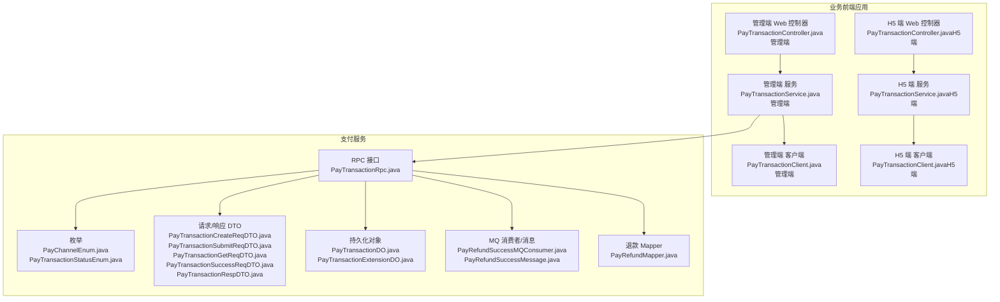
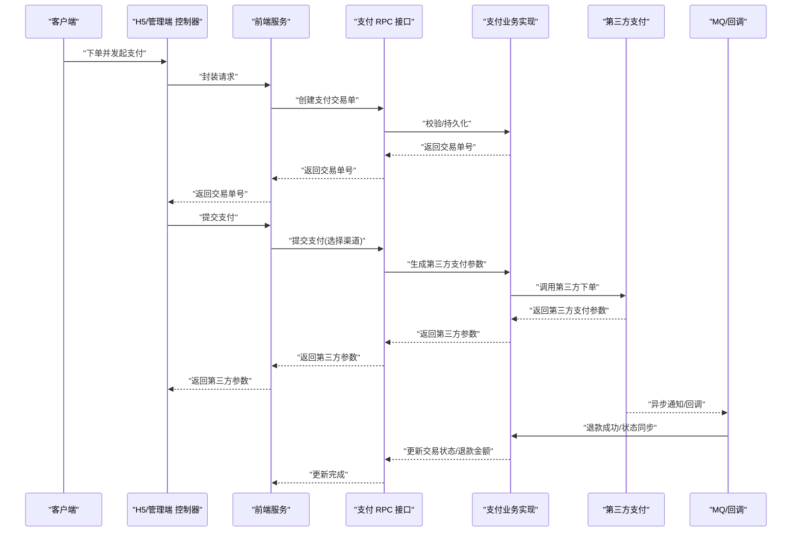
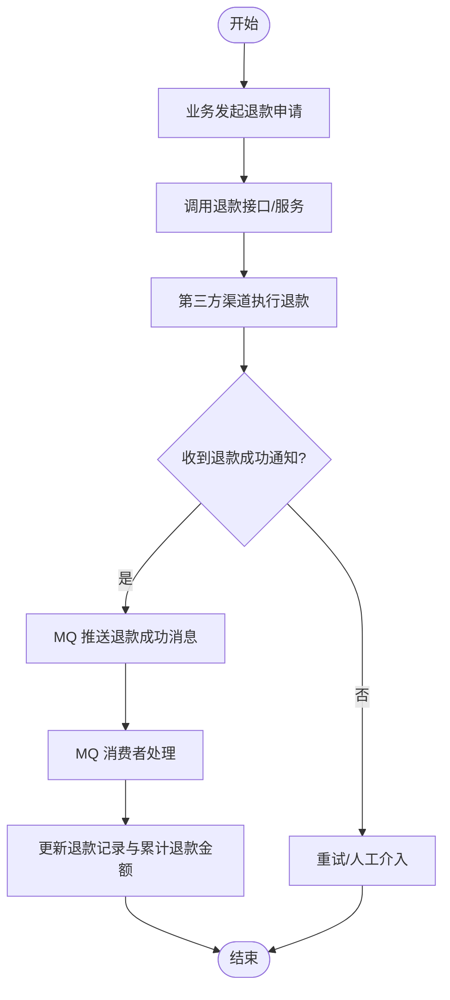
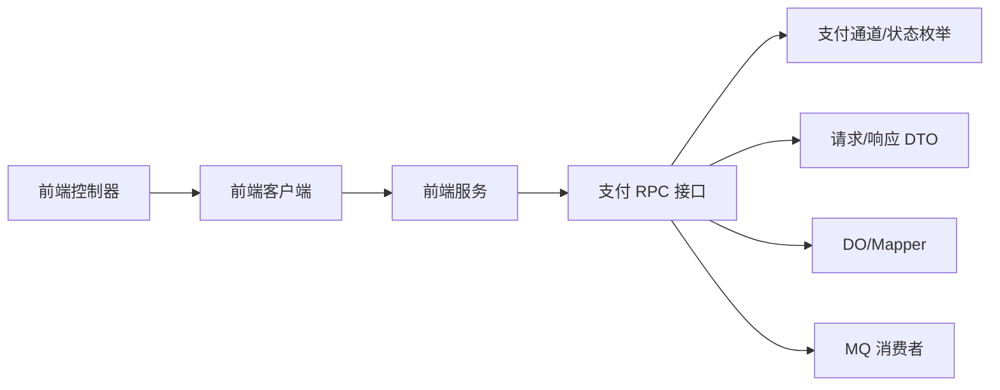

# 支付相关接口

<cite>
**本文引用的文件**
- [PayChannelEnum.java](file://pay-service-project/pay-service-api/src/main/java/cn/iocoder/mall/payservice/enums/PayChannelEnum.java)
- [PayTransactionStatusEnum.java](file://pay-service-project/pay-service-api/src/main/java/cn/iocoder/mall/payservice/enums/transaction/PayTransactionStatusEnum.java)
- [PayTransactionRpc.java](file://pay-service-project/pay-service-api/src/main/java/cn/iocoder/mall/payservice/rpc/transaction/PayTransactionRpc.java)
- [PayTransactionCreateReqDTO.java](file://pay-service-project/pay-service-api/src/main/java/cn/iocoder/mall/payservice/rpc/transaction/dto/PayTransactionCreateReqDTO.java)
- [PayTransactionSubmitReqDTO.java](file://pay-service-project/pay-service-api/src/main/java/cn/iocoder/mall/payservice/rpc/transaction/dto/PayTransactionSubmitReqDTO.java)
- [PayTransactionGetReqDTO.java](file://pay-service-project/pay-service-api/src/main/java/cn/iocoder/mall/payservice/rpc/transaction/dto/PayTransactionGetReqDTO.java)
- [PayTransactionSuccessReqDTO.java](file://pay-service-project/pay-service-api/src/main/java/cn/iocoder/mall/payservice/rpc/transaction/dto/PayTransactionSuccessReqDTO.java)
- [PayTransactionRespDTO.java](file://pay-service-project/pay-service-api/src/main/java/cn/iocoder/mall/payservice/rpc/transaction/dto/PayTransactionRespDTO.java)
- [PayTransactionDO.java](file://pay-service-project/pay-service-app/src/main/java/cn/iocoder/mall/payservice/dal/mysql/dataobject/transaction/PayTransactionDO.java)
- [PayTransactionExtensionDO.java](file://pay-service-project/pay-service-app/src/main/java/cn/iocoder/mall/payservice/dal/mysql/dataobject/transaction/PayTransactionExtensionDO.java)
- [ThirdPayTransactionSuccessRespDTO.java](file://pay-service-project/pay-service-app/src/main/java/cn/iocoder/mall/payservice/client/thirdpay/dto/ThirdPayTransactionSuccessRespDTO.java)
- [PayRefundStatus.java](file://pay-service-project/pay-service-api/src/main/java/cn/iocoder/mall/payservice/enums/refund/PayRefundStatus.java)
- [PayRefundDO.java](file://pay-service-project/pay-service-app/src/main/java/cn/iocoder/mall/payservice/dal/mysql/dataobject/refund/PayRefundDO.java)
- [PayRefundMapper.java](file://pay-service-project/pay-service-app/src/main/java/cn/iocoder/mall/payservice/dal/mysql/mapper/refund/PayRefundMapper.java)
- [PayRefundSuccessMQConsumer.java](file://pay-service-project/pay-service-app/src/main/java/cn/iocoder/mall/payservice/mq/consumer/PayRefundSuccessMQConsumer.java)
- [PayRefundSuccessMessage.java](file://pay-service-project/pay-service-app/src/main/java/cn/iocoder/mall/payservice/mq/producer/message/PayRefundSuccessMessage.java)
- [PayRefundServiceImpl.java](file://moved/pay/pay-application/src/main/java/cn/iocoder/mall/pay/biz/service/PayRefundServiceImpl.java)
- [PayTransactionServiceImpl.java](file://moved/pay/pay-application/src/main/java/cn/iocoder/mall/pay/biz/service/PayTransactionServiceImpl.java)
- [PayTransactionController.java（管理端）](file://management-web-app/src/main/java/cn/iocoder/mall/managementweb/controller/pay/PayTransactionController.java)
- [PayTransactionController.java（H5端）](file://shop-web-app/src/main/java/cn/iocoder/mall/shopweb/controller/pay/PayTransactionController.java)
- [PayTransactionClient.java（管理端）](file://management-web-app/src/main/java/cn/iocoder/mall/managementweb/client/pay/transaction/PayTransactionClient.java)
- [PayTransactionClient.java（H5端）](file://shop-web-app/src/main/java/cn/iocoder/mall/shopweb/client/pay/transaction/PayTransactionClient.java)
- [PayTransactionService.java（管理端）](file://management-web-app/src/main/java/cn/iocoder/mall/managementweb/service/pay/transaction/PayTransactionService.java)
- [PayTransactionService.java（H5端）](file://shop-web-app/src/main/java/cn/iocoder/mall/shopweb/service/pay/transaction/PayTransactionService.java)
- [PayTransactionConvert.java（管理端）](file://management-web-app/src/main/java/cn/iocoder/mall/managementweb/convert/pay/transaction/PayTransactionConvert.java)
- [PayTransactionConvert.java（H5端）](file://shop-web-app/src/main/java/cn/iocoder/mall/shopweb/convert/pay/transaction/PayTransactionConvert.java)
- [PayTransactionPageReqVO.java（管理端）](file://management-web-app/src/main/java/cn/iocoder/mall/managementweb/controller/pay/vo/transaction/PayTransactionPageReqVO.java)
- [PayTransactionRespVO.java（管理端）](file://management-web-app/src/main/java/cn/iocoder/mall/managementweb/controller/pay/vo/transaction/PayTransactionRespVO.java)
- [OrderPayStatus.java（订单模块）](file://moved/order/order-service-api02/src/main/java/cn/iocoder/mall/order/api/constant/OrderPayStatus.java)
</cite>

## 目录
1. [简介](#简介)
2. [项目结构](#项目结构)
3. [核心组件](#核心组件)
4. [架构总览](#架构总览)
5. [详细组件分析](#详细组件分析)
6. [依赖分析](#依赖分析)
7. [性能考虑](#性能考虑)
8. [故障排查指南](#故障排查指南)
9. [结论](#结论)
10. [附录](#附录)

## 简介
本文件面向支付相关接口的使用者与维护者，系统性梳理支付交易创建、支付提交、支付状态查询、支付结果通知、退款处理等全流程能力。文档覆盖接口规范（HTTP方法、URL路径、请求参数、响应格式）、支付订单生成、第三方支付渠道接入、支付状态同步、退款机制、安全与风控、测试方法与成功率优化建议，并提供典型使用场景示例。

## 项目结构
支付能力由“支付服务”与“业务前端应用（管理端/Shop端）”共同组成：
- 支付服务（RPC接口层、DTO定义、DO/Mapper、MQ消费者）
- 业务前端应用（控制器、客户端、服务封装、转换器、VO）

图表来源
- [PayTransactionRpc.java](file://pay-service-project/pay-service-api/src/main/java/cn/iocoder/mall/payservice/rpc/transaction/PayTransactionRpc.java)
- [PayChannelEnum.java](file://pay-service-project/pay-service-api/src/main/java/cn/iocoder/mall/payservice/enums/PayChannelEnum.java)
- [PayTransactionStatusEnum.java](file://pay-service-project/pay-service-api/src/main/java/cn/iocoder/mall/payservice/enums/transaction/PayTransactionStatusEnum.java)
- [PayTransactionCreateReqDTO.java](file://pay-service-project/pay-service-api/src/main/java/cn/iocoder/mall/payservice/rpc/transaction/dto/PayTransactionCreateReqDTO.java)
- [PayTransactionSubmitReqDTO.java](file://pay-service-project/pay-service-api/src/main/java/cn/iocoder/mall/payservice/rpc/transaction/dto/PayTransactionSubmitReqDTO.java)
- [PayTransactionGetReqDTO.java](file://pay-service-project/pay-service-api/src/main/java/cn/iocoder/mall/payservice/rpc/transaction/dto/PayTransactionGetReqDTO.java)
- [PayTransactionSuccessReqDTO.java](file://pay-service-project/pay-service-api/src/main/java/cn/iocoder/mall/payservice/rpc/transaction/dto/PayTransactionSuccessReqDTO.java)
- [PayTransactionRespDTO.java](file://pay-service-project/pay-service-api/src/main/java/cn/iocoder/mall/payservice/rpc/transaction/dto/PayTransactionRespDTO.java)
- [PayTransactionDO.java](file://pay-service-project/pay-service-app/src/main/java/cn/iocoder/mall/payservice/dal/mysql/dataobject/transaction/PayTransactionDO.java)
- [PayTransactionExtensionDO.java](file://pay-service-project/pay-service-app/src/main/java/cn/iocoder/mall/payservice/dal/mysql/dataobject/transaction/PayTransactionExtensionDO.java)
- [PayRefundSuccessMQConsumer.java](file://pay-service-project/pay-service-app/src/main/java/cn/iocoder/mall/payservice/mq/consumer/PayRefundSuccessMQConsumer.java)
- [PayRefundSuccessMessage.java](file://pay-service-project/pay-service-app/src/main/java/cn/iocoder/mall/payservice/mq/producer/message/PayRefundSuccessMessage.java)
- [PayRefundMapper.java](file://pay-service-project/pay-service-app/src/main/java/cn/iocoder/mall/payservice/dal/mysql/mapper/refund/PayRefundMapper.java)

章节来源
- [PayTransactionRpc.java](file://pay-service-project/pay-service-api/src/main/java/cn/iocoder/mall/payservice/rpc/transaction/PayTransactionRpc.java)
- [PayTransactionController.java（管理端）](file://management-web-app/src/main/java/cn/iocoder/mall/managementweb/controller/pay/PayTransactionController.java)
- [PayTransactionController.java（H5端）](file://shop-web-app/src/main/java/cn/iocoder/mall/shopweb/controller/pay/PayTransactionController.java)

## 核心组件
- 支付通道枚举：定义可用的第三方支付渠道及编码，用于提交支付时选择。
- 支付交易状态枚举：定义支付单状态（等待支付、支付成功、取消支付）。
- RPC 接口：统一对外暴露支付交易创建、提交、查询、更新成功、分页等能力。
- DTO：请求/响应的数据结构定义，确保跨模块契约清晰。
- DO/Mapper：持久化支付交易与退款数据。
- MQ：退款成功异步通知与落库。
- 前端控制器/客户端/服务：封装 RPC 调用，提供 HTTP 接口与业务 VO。

章节来源
- [PayChannelEnum.java](file://pay-service-project/pay-service-api/src/main/java/cn/iocoder/mall/payservice/enums/PayChannelEnum.java)
- [PayTransactionStatusEnum.java](file://pay-service-project/pay-service-api/src/main/java/cn/iocoder/mall/payservice/enums/transaction/PayTransactionStatusEnum.java)
- [PayTransactionRpc.java](file://pay-service-project/pay-service-api/src/main/java/cn/iocoder/mall/payservice/rpc/transaction/PayTransactionRpc.java)
- [PayTransactionCreateReqDTO.java](file://pay-service-project/pay-service-api/src/main/java/cn/iocoder/mall/payservice/rpc/transaction/dto/PayTransactionCreateReqDTO.java)
- [PayTransactionSubmitReqDTO.java](file://pay-service-project/pay-service-api/src/main/java/cn/iocoder/mall/payservice/rpc/transaction/dto/PayTransactionSubmitReqDTO.java)
- [PayTransactionGetReqDTO.java](file://pay-service-project/pay-service-api/src/main/java/cn/iocoder/mall/payservice/rpc/transaction/dto/PayTransactionGetReqDTO.java)
- [PayTransactionSuccessReqDTO.java](file://pay-service-project/pay-service-api/src/main/java/cn/iocoder/mall/payservice/rpc/transaction/dto/PayTransactionSuccessReqDTO.java)
- [PayTransactionRespDTO.java](file://pay-service-project/pay-service-api/src/main/java/cn/iocoder/mall/payservice/rpc/transaction/dto/PayTransactionRespDTO.java)
- [PayTransactionDO.java](file://pay-service-project/pay-service-app/src/main/java/cn/iocoder/mall/payservice/dal/mysql/dataobject/transaction/PayTransactionDO.java)
- [PayTransactionExtensionDO.java](file://pay-service-project/pay-service-app/src/main/java/cn/iocoder/mall/payservice/dal/mysql/dataobject/transaction/PayTransactionExtensionDO.java)
- [PayRefundStatus.java](file://pay-service-project/pay-service-api/src/main/java/cn/iocoder/mall/payservice/enums/refund/PayRefundStatus.java)
- [PayRefundMapper.java](file://pay-service-project/pay-service-app/src/main/java/cn/iocoder/mall/payservice/dal/mysql/mapper/refund/PayRefundMapper.java)
- [PayRefundSuccessMQConsumer.java](file://pay-service-project/pay-service-app/src/main/java/cn/iocoder/mall/payservice/mq/consumer/PayRefundSuccessMQConsumer.java)
- [PayRefundSuccessMessage.java](file://pay-service-project/pay-service-app/src/main/java/cn/iocoder/mall/payservice/mq/producer/message/PayRefundSuccessMessage.java)

## 架构总览
支付流程从“业务前端应用”发起，经“RPC 接口”进入“支付服务”，与第三方支付渠道交互后，通过“MQ/回调”实现状态同步与退款处理。

图表来源
- [PayTransactionRpc.java](file://pay-service-project/pay-service-api/src/main/java/cn/iocoder/mall/payservice/rpc/transaction/PayTransactionRpc.java)
- [PayTransactionServiceImpl.java](file://moved/pay/pay-application/src/main/java/cn/iocoder/mall/pay/biz/service/PayTransactionServiceImpl.java)
- [PayRefundSuccessMQConsumer.java](file://pay-service-project/pay-service-app/src/main/java/cn/iocoder/mall/payservice/mq/consumer/PayRefundSuccessMQConsumer.java)
- [ThirdPayTransactionSuccessRespDTO.java](file://pay-service-project/pay-service-app/src/main/java/cn/iocoder/mall/payservice/client/thirdpay/dto/ThirdPayTransactionSuccessRespDTO.java)

## 详细组件分析

### 支付交易创建接口
- 接口用途：在业务侧生成支付交易单，写入基础信息（用户、应用、订单、金额、过期时间等），返回交易单号。
- HTTP 方法与 URL：由前端控制器映射（以实际路由为准），请求体为创建 DTO。
- 请求参数（创建 DTO 字段）
  - userId：用户编号（必填）
  - appId：应用编号（必填）
  - createIp：发起交易的 IP（必填）
  - orderId：业务订单号（必填）
  - orderSubject：商品名（必填，长度限制）
  - orderDescription：商品描述（必填，长度限制）
  - orderMemo：商品备注（可选，长度限制）
  - price：支付金额（分，必填，必须大于 0）
  - expireTime：交易过期时间（必填）
- 响应格式：CommonResult<Integer>，返回交易单号
- 典型流程
  - 业务侧校验订单与金额
  - 调用创建接口生成交易单
  - 返回交易单号给前端，用于后续提交支付

章节来源
- [PayTransactionRpc.java](file://pay-service-project/pay-service-api/src/main/java/cn/iocoder/mall/payservice/rpc/transaction/PayTransactionRpc.java)
- [PayTransactionCreateReqDTO.java](file://pay-service-project/pay-service-api/src/main/java/cn/iocoder/mall/payservice/rpc/transaction/dto/PayTransactionCreateReqDTO.java)

### 支付交易提交接口
- 接口用途：根据交易单号与选择的支付渠道，生成第三方支付参数，返回给前端进行支付。
- HTTP 方法与 URL：由前端控制器映射（以实际路由为准），请求体为提交 DTO。
- 请求参数（提交 DTO 字段）
  - appId：应用编号（必填）
  - createIp：发起交易的 IP（必填）
  - orderId：业务订单号（必填）
  - payChannel：支付渠道（必填，取值范围见支付通道枚举）
- 响应格式：CommonResult<PayTransactionSubmitRespDTO>，包含第三方支付所需参数
- 典型流程
  - 前端展示支付页面并调用提交接口
  - 后端选择对应渠道并生成参数
  - 返回第三方参数给前端完成支付

章节来源
- [PayTransactionRpc.java](file://pay-service-project/pay-service-api/src/main/java/cn/iocoder/mall/payservice/rpc/transaction/PayTransactionRpc.java)
- [PayTransactionSubmitReqDTO.java](file://pay-service-project/pay-service-api/src/main/java/cn/iocoder/mall/payservice/rpc/transaction/dto/PayTransactionSubmitReqDTO.java)
- [PayChannelEnum.java](file://pay-service-project/pay-service-api/src/main/java/cn/iocoder/mall/payservice/enums/PayChannelEnum.java)

### 支付交易查询接口
- 接口用途：根据应用编号与订单号查询支付交易详情。
- HTTP 方法与 URL：由前端控制器映射（以实际路由为准），请求体为查询 DTO。
- 请求参数（查询 DTO 字段）
  - appId：应用编号（必填）
  - orderId：业务订单号（必填）
- 响应格式：CommonResult<PayTransactionRespDTO>，包含交易单完整信息（状态、金额、扩展信息、回调地址、第三方流水号等）
- 典型流程
  - 前端轮询或点击查询按钮
  - 调用查询接口获取最新状态
  - 根据状态引导用户或触发业务动作

章节来源
- [PayTransactionRpc.java](file://pay-service-project/pay-service-api/src/main/java/cn/iocoder/mall/payservice/rpc/transaction/PayTransactionRpc.java)
- [PayTransactionGetReqDTO.java](file://pay-service-project/pay-service-api/src/main/java/cn/iocoder/mall/payservice/rpc/transaction/dto/PayTransactionGetReqDTO.java)
- [PayTransactionRespDTO.java](file://pay-service-project/pay-service-api/src/main/java/cn/iocoder/mall/payservice/rpc/transaction/dto/PayTransactionRespDTO.java)

### 支付结果通知接口
- 接口用途：接收第三方支付渠道的异步通知，更新交易状态与第三方流水号等信息。
- HTTP 方法与 URL：由前端控制器映射（以实际路由为准），请求体为成功通知 DTO。
- 请求参数（成功通知 DTO 字段）
  - payChannel：支付渠道（可选）
  - params：渠道回调参数（可选）
- 响应格式：CommonResult<Boolean>，表示是否成功处理
- 典型流程
  - 第三方回调至支付服务
  - 支付服务解析参数并更新交易单
  - 触发业务侧回调（如订单支付成功）

章节来源
- [PayTransactionRpc.java](file://pay-service-project/pay-service-api/src/main/java/cn/iocoder/mall/payservice/rpc/transaction/PayTransactionRpc.java)
- [PayTransactionSuccessReqDTO.java](file://pay-service-project/pay-service-api/src/main/java/cn/iocoder/mall/payservice/rpc/transaction/dto/PayTransactionSuccessReqDTO.java)

### 支付交易分页接口
- 接口用途：按条件分页查询支付交易列表。
- HTTP 方法与 URL：由前端控制器映射（以实际路由为准），请求体为分页 DTO。
- 请求参数：分页条件（字段由分页 DTO 定义）
- 响应格式：CommonResult<PageResult<PayTransactionRespDTO>>
- 典型流程
  - 管理端或运营侧查询交易明细
  - 支持按状态、时间、订单号等筛选

章节来源
- [PayTransactionRpc.java](file://pay-service-project/pay-service-api/src/main/java/cn/iocoder/mall/payservice/rpc/transaction/PayTransactionRpc.java)

### 退款处理机制
- 退款状态枚举：定义退款状态（如未退款、退款中、已退款等）
- 退款数据模型：退款记录（金额、状态、关联交易单等）
- 退款成功通知：通过 MQ 消费者监听退款成功消息，更新退款状态与累计退款金额
- 退款 Mapper：提供退款记录的持久化操作
- 典型流程
  - 业务侧发起退款申请
  - 调用退款 RPC 或服务方法
  - 第三方渠道执行退款
  - 退款成功后 MQ 推送消息，支付服务落库并更新交易单累计退款金额

图表来源
- [PayRefundStatus.java](file://pay-service-project/pay-service-api/src/main/java/cn/iocoder/mall/payservice/enums/refund/PayRefundStatus.java)
- [PayRefundDO.java](file://pay-service-project/pay-service-app/src/main/java/cn/iocoder/mall/payservice/dal/mysql/dataobject/refund/PayRefundDO.java)
- [PayRefundMapper.java](file://pay-service-project/pay-service-app/src/main/java/cn/iocoder/mall/payservice/dal/mysql/mapper/refund/PayRefundMapper.java)
- [PayRefundSuccessMQConsumer.java](file://pay-service-project/pay-service-app/src/main/java/cn/iocoder/mall/payservice/mq/consumer/PayRefundSuccessMQConsumer.java)
- [PayRefundSuccessMessage.java](file://pay-service-project/pay-service-app/src/main/java/cn/iocoder/mall/payservice/mq/producer/message/PayRefundSuccessMessage.java)

章节来源
- [PayRefundServiceImpl.java](file://moved/pay/pay-application/src/main/java/cn/iocoder/mall/pay/biz/service/PayRefundServiceImpl.java)
- [PayRefundStatus.java](file://pay-service-project/pay-service-api/src/main/java/cn/iocoder/mall/payservice/enums/refund/PayRefundStatus.java)
- [PayRefundDO.java](file://pay-service-project/pay-service-app/src/main/java/cn/iocoder/mall/payservice/dal/mysql/dataobject/refund/PayRefundDO.java)
- [PayRefundMapper.java](file://pay-service-project/pay-service-app/src/main/java/cn/iocoder/mall/payservice/dal/mysql/mapper/refund/PayRefundMapper.java)
- [PayRefundSuccessMQConsumer.java](file://pay-service-project/pay-service-app/src/main/java/cn/iocoder/mall/payservice/mq/consumer/PayRefundSuccessMQConsumer.java)
- [PayRefundSuccessMessage.java](file://pay-service-project/pay-service-app/src/main/java/cn/iocoder/mall/payservice/mq/producer/message/PayRefundSuccessMessage.java)

### 支付订单生成与状态同步
- 订单状态与支付状态联动：支付成功后，业务侧可将订单状态更新为已支付；取消支付或过期则保持未支付。
- 支付状态枚举：WAITING/SUCCESS/CANCEL，用于标识交易当前状态。
- 订单模块常量：参考订单支付状态常量，确保与业务侧一致。

章节来源
- [PayTransactionStatusEnum.java](file://pay-service-project/pay-service-api/src/main/java/cn/iocoder/mall/payservice/enums/transaction/PayTransactionStatusEnum.java)
- [OrderPayStatus.java（订单模块）](file://moved/order/order-service-api02/src/main/java/cn/iocoder/mall/order/api/constant/OrderPayStatus.java)

## 依赖分析
- 前端应用依赖 RPC 接口，通过客户端与服务封装调用支付能力。
- RPC 接口依赖枚举、DTO、DO/Mapper、MQ 消费者等实现支付与退款闭环。
- 第三方支付通过“第三方支付参数 DTO”对接，最终由 MQ/回调完成异步通知。

图表来源
- [PayTransactionRpc.java](file://pay-service-project/pay-service-api/src/main/java/cn/iocoder/mall/payservice/rpc/transaction/PayTransactionRpc.java)
- [PayChannelEnum.java](file://pay-service-project/pay-service-api/src/main/java/cn/iocoder/mall/payservice/enums/PayChannelEnum.java)
- [PayTransactionStatusEnum.java](file://pay-service-project/pay-service-api/src/main/java/cn/iocoder/mall/payservice/enums/transaction/PayTransactionStatusEnum.java)
- [PayTransactionCreateReqDTO.java](file://pay-service-project/pay-service-api/src/main/java/cn/iocoder/mall/payservice/rpc/transaction/dto/PayTransactionCreateReqDTO.java)
- [PayTransactionSubmitReqDTO.java](file://pay-service-project/pay-service-api/src/main/java/cn/iocoder/mall/payservice/rpc/transaction/dto/PayTransactionSubmitReqDTO.java)
- [PayTransactionGetReqDTO.java](file://pay-service-project/pay-service-api/src/main/java/cn/iocoder/mall/payservice/rpc/transaction/dto/PayTransactionGetReqDTO.java)
- [PayTransactionSuccessReqDTO.java](file://pay-service-project/pay-service-api/src/main/java/cn/iocoder/mall/payservice/rpc/transaction/dto/PayTransactionSuccessReqDTO.java)
- [PayTransactionRespDTO.java](file://pay-service-project/pay-service-api/src/main/java/cn/iocoder/mall/payservice/rpc/transaction/dto/PayTransactionRespDTO.java)
- [PayTransactionDO.java](file://pay-service-project/pay-service-app/src/main/java/cn/iocoder/mall/payservice/dal/mysql/dataobject/transaction/PayTransactionDO.java)
- [PayTransactionExtensionDO.java](file://pay-service-project/pay-service-app/src/main/java/cn/iocoder/mall/payservice/dal/mysql/dataobject/transaction/PayTransactionExtensionDO.java)
- [PayRefundSuccessMQConsumer.java](file://pay-service-project/pay-service-app/src/main/java/cn/iocoder/mall/payservice/mq/consumer/PayRefundSuccessMQConsumer.java)

## 性能考虑
- 并发控制：支付创建/提交需加幂等与分布式锁，避免重复下单。
- 缓存策略：对查询接口增加缓存，降低数据库压力。
- 异步通知：通过 MQ 解耦第三方回调与业务处理，提升吞吐。
- 分页查询：合理设置分页大小与索引，避免全表扫描。
- 日志与监控：埋点统计成功率、耗时与错误类型，便于优化。

## 故障排查指南
- 支付创建失败
  - 检查请求参数是否满足 DTO 校验规则（必填、长度、数值范围）
  - 核对应用编号与用户编号是否正确
- 支付提交失败
  - 确认支付渠道是否在枚举范围内
  - 检查第三方参数生成逻辑与回调地址配置
- 查询不到交易
  - 确认 appId 与 orderId 是否匹配
  - 检查交易是否过期或被取消
- 通知未到账
  - 核对第三方回调地址与签名验证
  - 查看 MQ 消费者是否正常运行
- 退款异常
  - 检查退款状态与金额一致性
  - 确认 MQ 消息是否重复消费

章节来源
- [PayTransactionCreateReqDTO.java](file://pay-service-project/pay-service-api/src/main/java/cn/iocoder/mall/payservice/rpc/transaction/dto/PayTransactionCreateReqDTO.java)
- [PayTransactionSubmitReqDTO.java](file://pay-service-project/pay-service-api/src/main/java/cn/iocoder/mall/payservice/rpc/transaction/dto/PayTransactionSubmitReqDTO.java)
- [PayTransactionGetReqDTO.java](file://pay-service-project/pay-service-api/src/main/java/cn/iocoder/mall/payservice/rpc/transaction/dto/PayTransactionGetReqDTO.java)
- [PayTransactionSuccessReqDTO.java](file://pay-service-project/pay-service-api/src/main/java/cn/iocoder/mall/payservice/rpc/transaction/dto/PayTransactionSuccessReqDTO.java)
- [PayRefundSuccessMQConsumer.java](file://pay-service-project/pay-service-app/src/main/java/cn/iocoder/mall/payservice/mq/consumer/PayRefundSuccessMQConsumer.java)

## 结论
本文档系统化梳理了支付交易创建、提交、查询、通知与退款的全流程接口与实现要点。通过明确的 DTO 约定、RPC 接口与 MQ 异步通知，结合状态枚举与 DO/Mapper 的持久化设计，形成稳定可靠的支付能力。建议在生产环境中强化幂等、缓存与监控，并完善异常处理与重试策略，持续提升支付成功率与用户体验。

## 附录

### 使用场景示例

- 场景一：订单支付
  - 步骤
    1) 业务侧调用“创建支付交易单”接口，传入用户、应用、订单、金额、过期时间等信息
    2) 获取交易单号后，调用“提交支付”接口，选择支付渠道并返回第三方参数
    3) 前端拉起第三方支付页面完成支付
    4) 第三方回调至“支付结果通知”接口，支付服务更新交易状态
    5) 业务侧查询交易状态，将订单状态更新为已支付
  - 关键接口
    - 创建支付交易单：[PayTransactionRpc.java](file://pay-service-project/pay-service-api/src/main/java/cn/iocoder/mall/payservice/rpc/transaction/PayTransactionRpc.java)
    - 提交支付：[PayTransactionRpc.java](file://pay-service-project/pay-service-api/src/main/java/cn/iocoder/mall/payservice/rpc/transaction/PayTransactionRpc.java)
    - 支付结果通知：[PayTransactionRpc.java](file://pay-service-project/pay-service-api/src/main/java/cn/iocoder/mall/payservice/rpc/transaction/PayTransactionRpc.java)
    - 查询交易：[PayTransactionRpc.java](file://pay-service-project/pay-service-api/src/main/java/cn/iocoder/mall/payservice/rpc/transaction/PayTransactionRpc.java)

- 场景二：支付查询
  - 步骤
    1) 前端轮询或手动点击查询
    2) 调用“查询交易”接口，传入 appId 与 orderId
    3) 根据返回的状态决定下一步动作（如跳转支付页面或提示支付成功）
  - 关键接口
    - 查询交易：[PayTransactionRpc.java](file://pay-service-project/pay-service-api/src/main/java/cn/iocoder/mall/payservice/rpc/transaction/PayTransactionRpc.java)

- 场景三：支付回调与状态同步
  - 步骤
    1) 第三方回调至“支付结果通知”接口
    2) 支付服务解析回调参数，更新交易单与扩展信息
    3) 触发业务侧回调（如订单支付成功）
  - 关键接口
    - 支付结果通知：[PayTransactionRpc.java](file://pay-service-project/pay-service-api/src/main/java/cn/iocoder/mall/payservice/rpc/transaction/PayTransactionRpc.java)

- 场景四：退款处理
  - 步骤
    1) 业务侧发起退款申请
    2) 调用退款接口，第三方渠道执行退款
    3) 退款成功后 MQ 推送消息，支付服务更新退款记录与累计退款金额
  - 关键接口与组件
    - 退款状态枚举：[PayRefundStatus.java](file://pay-service-project/pay-service-api/src/main/java/cn/iocoder/mall/payservice/enums/refund/PayRefundStatus.java)
    - 退款 DO/Mapper：[PayRefundDO.java](file://pay-service-project/pay-service-app/src/main/java/cn/iocoder/mall/payservice/dal/mysql/dataobject/refund/PayRefundDO.java)，[PayRefundMapper.java](file://pay-service-project/pay-service-app/src/main/java/cn/iocoder/mall/payservice/dal/mysql/mapper/refund/PayRefundMapper.java)
    - MQ 消费者：[PayRefundSuccessMQConsumer.java](file://pay-service-project/pay-service-app/src/main/java/cn/iocoder/mall/payservice/mq/consumer/PayRefundSuccessMQConsumer.java)

### 接口测试方法
- 单元测试：针对 DTO 校验、状态枚举、DO/Mapper 进行单元测试
- 集成测试：模拟第三方回调，验证“支付结果通知”与 MQ 处理
- 压力测试：对“创建/提交/查询”接口进行并发压测，观察延迟与错误率
- 回归测试：在退款流程变更后，验证退款状态与累计退款金额一致性

### 支付安全机制与风控策略
- 参数校验：严格使用 DTO 注解进行参数校验（必填、长度、数值范围）
- 回调验签：第三方回调需进行签名验证，防止伪造通知
- 幂等设计：支付创建/提交/通知均需保证幂等，避免重复处理
- 限流与熔断：对高频接口进行限流，异常时快速熔断保护
- 日志审计：记录关键操作日志，便于追踪与审计