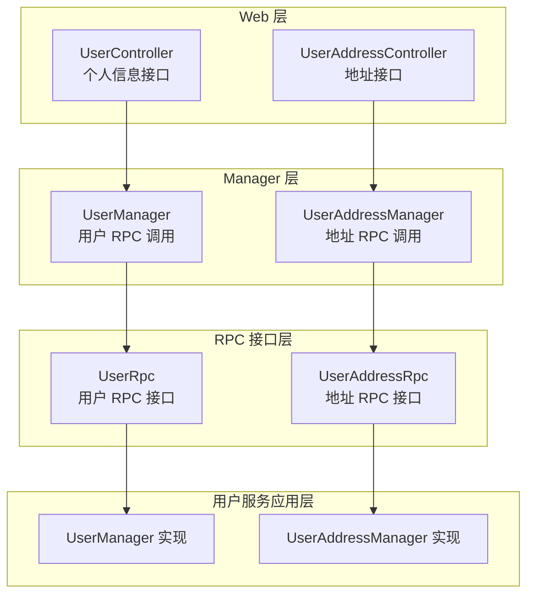
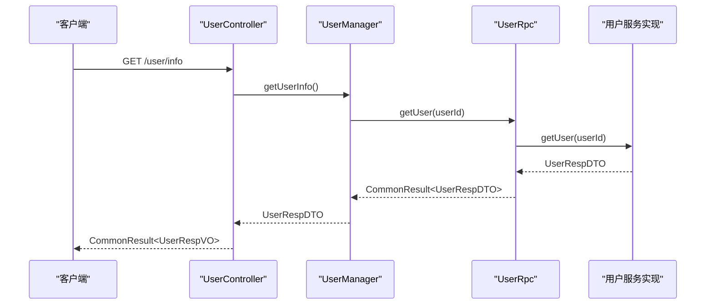
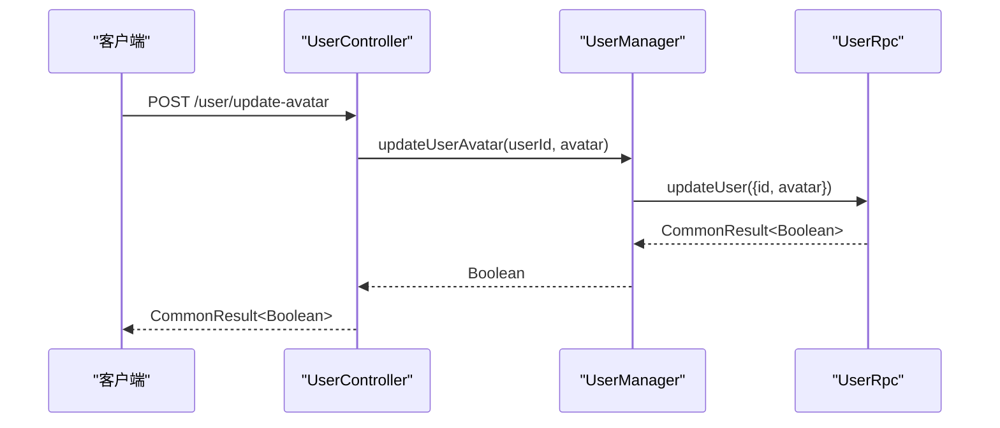
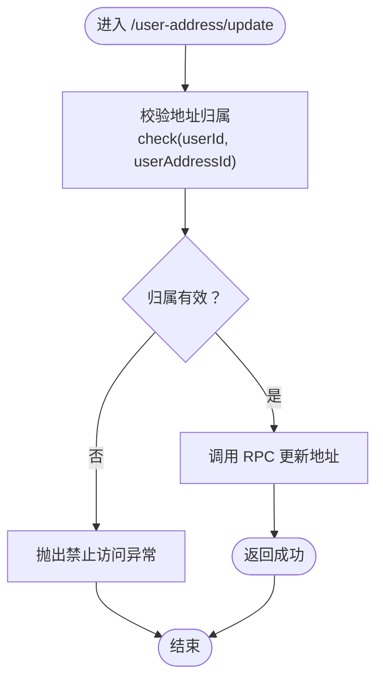
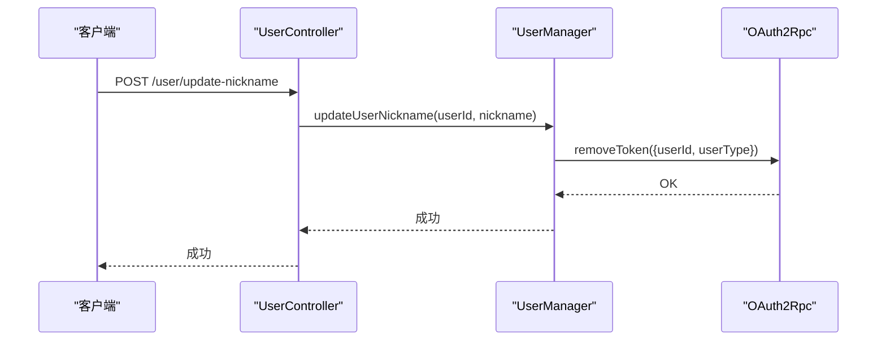
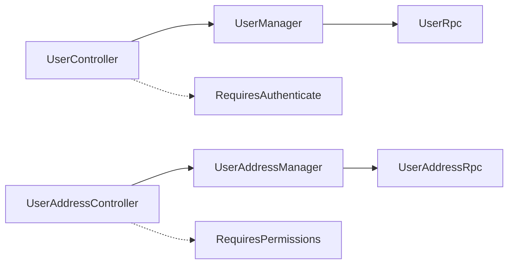

# 用户相关接口

<cite>
**本文引用的文件**
- [UserController.java](file://shop-web-app/src/main/java/cn/iocoder/mall/shopweb/controller/user/UserController.java)
- [UserAddressController.java](file://shop-web-app/src/main/java/cn/iocoder/mall/shopweb/controller/user/UserAddressController.java)
- [UserManager.java](file://shop-web-app/src/main/java/cn/iocoder/mall/shopweb/service/user/UserManager.java)
- [UserAddressManager.java](file://shop-web-app/src/main/java/cn/iocoder/mall/shopweb/service/user/UserAddressManager.java)
- [UserRpc.java](file://user-service-project/user-service-api/src/main/java/cn/iocoder/mall/userservice/rpc/user/UserRpc.java)
- [UserErrorCodeConstants.java](file://user-service-project/user-service-api/src/main/java/cn/iocoder/mall/userservice/enums/UserErrorCodeConstants.java)
- [UserAddressManager.java（用户服务实现）](file://user-service-project/user-service-app/src/main/java/cn/iocoder/mall/userservice/manager/address/UserAddressManager.java)
- [UserManager.java（用户服务实现）](file://user-service-project/user-service-app/src/main/java/cn/iocoder/mall/userservice/manager/user/UserManager.java)
- [CommonResult.java](file://common/common-framework/src/main/java/cn/iocoder/common/framework/vo/CommonResult.java)
- [RequiresAuthenticate.java](file://common/mall-security-annotations/src/main/java/cn/iocoder/security/annotations/RequiresAuthenticate.java)
- [RequiresPermissions.java](file://common/mall-security-annotations/src/main/java/cn/iocoder/security/annotations/RequiresPermissions.java)
- [UserSecurityContextHolder.java](file://common/mall-security-annotations/src/main/java/cn/iocoder/security/annotations/RequiresPermissions.java)
</cite>

## 目录
1. [简介](#简介)
2. [项目结构](#项目结构)
3. [核心组件](#核心组件)
4. [架构总览](#架构总览)
5. [详细组件分析](#详细组件分析)
6. [依赖分析](#依赖分析)
7. [性能考虑](#性能考虑)
8. [故障排查指南](#故障排查指南)
9. [结论](#结论)
10. [附录：接口清单与规范](#附录接口清单与规范)

## 简介
本文件面向“用户相关接口”的使用者与维护者，系统化梳理用户登录注册、个人信息管理、地址管理等账户能力的接口规范与实现要点。内容覆盖：
- 接口定义：HTTP 方法、URL 路径、请求参数、响应格式
- 认证与权限：鉴权注解、会话上下文、权限校验
- 数据安全：错误码体系、异常处理、访问控制
- 使用场景：手机号登录、密码修改、地址增删改查、个人信息完善
- 测试建议：接口测试方法与验证要点
- 隐私保护：最小化原则、敏感字段处理、日志与审计

## 项目结构
用户相关能力由“前端 Web 应用层 + 用户服务应用层 + RPC 接口层”构成，采用分层与职责分离的设计：
- Web 层（Shop Web App）：暴露 REST 接口，负责鉴权注解、参数校验、调用 Manager
- Manager 层：封装业务编排，统一错误检查与转换
- RPC 接口层：定义用户与地址的远程接口契约
- 用户服务应用层：实现 RPC 接口，落地到数据库与下游系统

图表来源
- [UserController.java:16-50](file://shop-web-app/src/main/java/cn/iocoder/mall/shopweb/controller/user/UserController.java#L16-L50)
- [UserAddressController.java:22-80](file://shop-web-app/src/main/java/cn/iocoder/mall/shopweb/controller/user/UserAddressController.java#L22-L80)
- [UserManager.java:12-34](file://shop-web-app/src/main/java/cn/iocoder/mall/shopweb/service/user/UserManager.java#L12-L34)
- [UserAddressManager.java:20-130](file://shop-web-app/src/main/java/cn/iocoder/mall/shopweb/service/user/UserAddressManager.java#L20-L130)
- [UserRpc.java:12-54](file://user-service-project/user-service-api/src/main/java/cn/iocoder/mall/userservice/rpc/user/UserRpc.java#L12-L54)

章节来源
- [UserController.java:16-50](file://shop-web-app/src/main/java/cn/iocoder/mall/shopweb/controller/user/UserController.java#L16-L50)
- [UserAddressController.java:22-80](file://shop-web-app/src/main/java/cn/iocoder/mall/shopweb/controller/user/UserAddressController.java#L22-L80)
- [UserManager.java:12-34](file://shop-web-app/src/main/java/cn/iocoder/mall/shopweb/service/user/UserManager.java#L12-L34)
- [UserAddressManager.java:20-130](file://shop-web-app/src/main/java/cn/iocoder/mall/shopweb/service/user/UserAddressManager.java#L20-L130)
- [UserRpc.java:12-54](file://user-service-project/user-service-api/src/main/java/cn/iocoder/mall/userservice/rpc/user/UserRpc.java#L12-L54)

## 核心组件
- 控制器层
  - UserController：提供用户信息查询、头像与昵称更新接口
  - UserAddressController：提供地址创建、更新、删除、查询、默认地址查询、列表查询
- Manager 层
  - UserManager：封装 UserRpc 的调用，统一错误检查与转换
  - UserAddressManager：封装 UserAddressRpc 的调用，统一错误检查与“用户-地址归属校验”
- RPC 接口层
  - UserRpc：用户基础 CRUD 与分页
  - UserAddressRpc：地址 CRUD、列表与默认地址查询（在实现中体现）
- 错误码体系
  - UserErrorCodeConstants：集中定义用户与地址相关错误码，便于统一处理与国际化

章节来源
- [UserController.java:16-50](file://shop-web-app/src/main/java/cn/iocoder/mall/shopweb/controller/user/UserController.java#L16-L50)
- [UserAddressController.java:22-80](file://shop-web-app/src/main/java/cn/iocoder/mall/shopweb/controller/user/UserAddressController.java#L22-L80)
- [UserManager.java:12-34](file://shop-web-app/src/main/java/cn/iocoder/mall/shopweb/service/user/UserManager.java#L12-L34)
- [UserAddressManager.java:20-130](file://shop-web-app/src/main/java/cn/iocoder/mall/shopweb/service/user/UserAddressManager.java#L20-L130)
- [UserRpc.java:12-54](file://user-service-project/user-service-api/src/main/java/cn/iocoder/mall/userservice/rpc/user/UserRpc.java#L12-L54)
- [UserErrorCodeConstants.java:10-29](file://user-service-project/user-service-api/src/main/java/cn/iocoder/mall/userservice/enums/UserErrorCodeConstants.java#L10-L29)

## 架构总览
用户相关接口遵循“Web 控制器 -> Manager -> RPC 接口 -> 服务实现”的链路，配合鉴权注解与权限校验，确保接口安全与可追溯。

图表来源
- [UserController.java:24-30](file://shop-web-app/src/main/java/cn/iocoder/mall/shopweb/controller/user/UserController.java#L24-L30)
- [UserManager.java:18-22](file://shop-web-app/src/main/java/cn/iocoder/mall/shopweb/service/user/UserManager.java#L18-L22)
- [UserRpc.java:20-20](file://user-service-project/user-service-api/src/main/java/cn/iocoder/mall/userservice/rpc/user/UserRpc.java#L20-L20)
- [UserManager.java（用户服务实现）:64-67](file://user-service-project/user-service-app/src/main/java/cn/iocoder/mall/userservice/manager/user/UserManager.java#L64-L67)

## 详细组件分析

### 用户信息接口
- 接口一：获取用户信息
  - 方法与路径：GET /user/info
  - 权限要求：需登录（RequiresAuthenticate）
  - 请求参数：无
  - 响应：CommonResult<UserRespVO>
  - 处理流程：从会话上下文中取出用户 ID，调用 UserManager.getUser，再返回
- 接口二：更新头像
  - 方法与路径：POST /user/update-avatar
  - 权限要求：需登录
  - 请求参数：avatar（头像 URL）
  - 响应：CommonResult<Boolean>
  - 处理流程：调用 UserManager.updateUserAvatar
- 接口三：更新昵称
  - 方法与路径：POST /user/update-nickname
  - 权限要求：需登录
  - 请求参数：nickname（昵称）
  - 响应：CommonResult<Boolean>
  - 处理流程：调用 UserManager.updateUserNickname

图表来源
- [UserController.java:32-39](file://shop-web-app/src/main/java/cn/iocoder/mall/shopweb/controller/user/UserController.java#L32-L39)
- [UserManager.java:24-27](file://shop-web-app/src/main/java/cn/iocoder/mall/shopweb/service/user/UserManager.java#L24-L27)
- [UserRpc.java:36-36](file://user-service-project/user-service-api/src/main/java/cn/iocoder/mall/userservice/rpc/user/UserRpc.java#L36-L36)

章节来源
- [UserController.java:24-48](file://shop-web-app/src/main/java/cn/iocoder/mall/shopweb/controller/user/UserController.java#L24-L48)
- [UserManager.java:18-32](file://shop-web-app/src/main/java/cn/iocoder/mall/shopweb/service/user/UserManager.java#L18-L32)
- [UserRpc.java:36-36](file://user-service-project/user-service-api/src/main/java/cn/iocoder/mall/userservice/rpc/user/UserRpc.java#L36-L36)

### 地址管理接口
- 接口一：创建地址
  - 方法与路径：POST /user-address/create
  - 权限要求：需登录且具备权限（RequiresPermissions）
  - 请求体：UserAddressCreateReqVO
  - 响应：CommonResult<Integer>（返回地址编号）
  - 处理流程：UserAddressManager 将 VO 转换为 DTO 并设置 userId，调用 RPC 创建
- 接口二：更新地址
  - 方法与路径：POST /user-address/update
  - 权限要求：需登录且具备权限
  - 请求体：UserAddressUpdateReqVO
  - 响应：CommonResult<Boolean>
  - 处理流程：先校验地址归属（check），再调用 RPC 更新
- 接口三：删除地址
  - 方法与路径：POST /user-address/delete
  - 权限要求：需登录且具备权限
  - 请求参数：userAddressId（地址编号）
  - 响应：CommonResult<Boolean>
  - 处理流程：先校验地址归属，再调用 RPC 删除
- 接口四：获取单个地址
  - 方法与路径：GET /user-address/get
  - 权限要求：需登录且具备权限
  - 请求参数：userAddressId
  - 响应：CommonResult<UserAddressRespVO>
  - 处理流程：调用 RPC 获取后，再次校验归属
- 接口五：获取默认地址
  - 方法与路径：GET /user-address/get-default
  - 权限要求：需登录且具备权限
  - 请求参数：无
  - 响应：CommonResult<UserAddressRespVO>
  - 处理流程：按类型筛选默认地址
- 接口六：获取地址列表
  - 方法与路径：GET /user-address/list
  - 权限要求：需登录且具备权限
  - 请求参数：无
  - 响应：CommonResult<List<UserAddressRespVO>>
  - 处理流程：按 userId 查询列表

图表来源
- [UserAddressManager.java:49-56](file://shop-web-app/src/main/java/cn/iocoder/mall/shopweb/service/user/UserAddressManager.java#L49-L56)
- [UserAddressManager.java:118-128](file://shop-web-app/src/main/java/cn/iocoder/mall/shopweb/service/user/UserAddressManager.java#L118-L128)

章节来源
- [UserAddressController.java:34-78](file://shop-web-app/src/main/java/cn/iocoder/mall/shopweb/controller/user/UserAddressController.java#L34-L78)
- [UserAddressManager.java:36-110](file://shop-web-app/src/main/java/cn/iocoder/mall/shopweb/service/user/UserAddressManager.java#L36-L110)

### 登录注册与认证流程（基于现有注解与上下文）
- 登录态获取
  - 通过 RequiresAuthenticate 注解标记需要登录的接口
  - 通过 UserSecurityContextHolder 获取当前用户 ID
- 权限校验
  - 通过 RequiresPermissions 注解标记需要权限的接口
  - 在地址管理中，对“更新/删除/查看”等操作进行“用户-地址归属校验”，防止越权访问
- 会话与令牌
  - 当用户信息被更新或状态变更时，用户服务侧会调用 OAuth2Rpc 移除相关令牌，确保安全生效

图表来源
- [UserManager.java（用户服务实现）:47-56](file://user-service-project/user-service-app/src/main/java/cn/iocoder/mall/userservice/manager/user/UserManager.java#L47-L56)

章节来源
- [UserController.java:26-29](file://shop-web-app/src/main/java/cn/iocoder/mall/shopweb/controller/user/UserController.java#L26-L29)
- [UserAddressManager.java:118-128](file://shop-web-app/src/main/java/cn/iocoder/mall/shopweb/service/user/UserAddressManager.java#L118-L128)
- [UserManager.java（用户服务实现）:47-56](file://user-service-project/user-service-app/src/main/java/cn/iocoder/mall/userservice/manager/user/UserManager.java#L47-L56)

## 依赖分析
- 控制器依赖
  - UserController 依赖 UserManager
  - UserAddressController 依赖 UserAddressManager
- Manager 依赖
  - UserManager 依赖 UserRpc
  - UserAddressManager 依赖 UserAddressRpc
- 安全注解
  - RequiresAuthenticate：强制登录
  - RequiresPermissions：强制权限
- 错误码
  - UserErrorCodeConstants：集中定义用户与地址错误码，便于统一处理

图表来源
- [UserController.java:26-29](file://shop-web-app/src/main/java/cn/iocoder/mall/shopweb/controller/user/UserController.java#L26-L29)
- [UserAddressController.java:36-36](file://shop-web-app/src/main/java/cn/iocoder/mall/shopweb/controller/user/UserAddressController.java#L36-L36)
- [UserManager.java:15-16](file://shop-web-app/src/main/java/cn/iocoder/mall/shopweb/service/user/UserManager.java#L15-L16)
- [UserAddressManager.java:26-27](file://shop-web-app/src/main/java/cn/iocoder/mall/shopweb/service/user/UserAddressManager.java#L26-L27)

章节来源
- [UserController.java:26-29](file://shop-web-app/src/main/java/cn/iocoder/mall/shopweb/controller/user/UserController.java#L26-L29)
- [UserAddressController.java:36-36](file://shop-web-app/src/main/java/cn/iocoder/mall/shopweb/controller/user/UserAddressController.java#L36-L36)
- [UserManager.java:15-16](file://shop-web-app/src/main/java/cn/iocoder/mall/shopweb/service/user/UserManager.java#L15-L16)
- [UserAddressManager.java:26-27](file://shop-web-app/src/main/java/cn/iocoder/mall/shopweb/service/user/UserAddressManager.java#L26-L27)

## 性能考虑
- 分页查询：用户分页接口支持 PageResult，避免一次性拉取大量数据
- 缓存与降级：结合通用框架与缓存组件，可在 Manager 层引入缓存以降低 RPC 调用频次
- 幂等性：地址创建与更新建议在服务端增加幂等键，避免重复提交
- 异步通知：如需异步通知（例如地址变更），可结合消息队列

## 故障排查指南
- 常见错误码
  - 用户验证码相关：验证码不存在、过期、已使用、不正确、超出发送上限、发送过快
  - 地址相关：地址不存在、获取的地址不存在
  - 用户信息：用户不存在、用户已是该状态、手机号已存在
- 错误处理
  - 所有 Manager 层均通过 CommonResult.checkError() 统一检查错误，失败时抛出异常
  - 地址归属校验失败时抛出禁止访问异常
- 排查步骤
  - 确认请求是否携带有效登录态与权限
  - 检查请求参数是否符合 VO/DTO 规范
  - 查看服务端日志定位具体错误码与原因

章节来源
- [UserErrorCodeConstants.java:13-28](file://user-service-project/user-service-api/src/main/java/cn/iocoder/mall/userservice/enums/UserErrorCodeConstants.java#L13-L28)
- [CommonResult.java](file://common/common-framework/src/main/java/cn/iocoder/common/framework/vo/CommonResult.java)
- [UserAddressManager.java:118-128](file://shop-web-app/src/main/java/cn/iocoder/mall/shopweb/service/user/UserAddressManager.java#L118-L128)

## 结论
本文档系统化梳理了用户信息与地址管理的接口规范、认证与权限策略、错误码与异常处理、以及典型使用场景。通过注解驱动的安全控制与严格的归属校验，保障了用户数据的安全与一致性；通过分层设计与 RPC 接口，实现了清晰的职责边界与良好的扩展性。

## 附录：接口清单与规范

### 用户信息接口
- 获取用户信息
  - 方法：GET
  - 路径：/user/info
  - 权限：登录（RequiresAuthenticate）
  - 请求：无
  - 响应：CommonResult<UserRespVO>
- 更新头像
  - 方法：POST
  - 路径：/user/update-avatar
  - 权限：登录
  - 参数：avatar（头像 URL）
  - 响应：CommonResult<Boolean>
- 更新昵称
  - 方法：POST
  - 路径：/user/update-nickname
  - 权限：登录
  - 参数：nickname（昵称）
  - 响应：CommonResult<Boolean>

章节来源
- [UserController.java:24-48](file://shop-web-app/src/main/java/cn/iocoder/mall/shopweb/controller/user/UserController.java#L24-L48)

### 地址管理接口
- 创建地址
  - 方法：POST
  - 路径：/user-address/create
  - 权限：登录+权限（RequiresPermissions）
  - 请求体：UserAddressCreateReqVO
  - 响应：CommonResult<Integer>
- 更新地址
  - 方法：POST
  - 路径：/user-address/update
  - 权限：登录+权限
  - 请求体：UserAddressUpdateReqVO
  - 响应：CommonResult<Boolean>
- 删除地址
  - 方法：POST
  - 路径：/user-address/delete
  - 权限：登录+权限
  - 参数：userAddressId（地址编号）
  - 响应：CommonResult<Boolean>
- 获取单个地址
  - 方法：GET
  - 路径：/user-address/get
  - 权限：登录+权限
  - 参数：userAddressId
  - 响应：CommonResult<UserAddressRespVO>
- 获取默认地址
  - 方法：GET
  - 路径：/user-address/get-default
  - 权限：登录+权限
  - 响应：CommonResult<UserAddressRespVO>
- 获取地址列表
  - 方法：GET
  - 路径：/user-address/list
  - 权限：登录+权限
  - 响应：CommonResult<List<UserAddressRespVO>>

章节来源
- [UserAddressController.java:34-78](file://shop-web-app/src/main/java/cn/iocoder/mall/shopweb/controller/user/UserAddressController.java#L34-L78)
- [UserAddressManager.java:36-110](file://shop-web-app/src/main/java/cn/iocoder/mall/shopweb/service/user/UserAddressManager.java#L36-L110)

### 使用场景示例
- 手机号登录
  - 说明：通过手机号创建用户（若不存在则创建，存在则直接返回）。该流程通常由系统服务中的 OAuth2 或短信模块配合完成，用户侧通过调用用户 RPC 的“创建用户（若不存在）”接口实现
  - 参考接口：UserRpc.createUserIfAbsent
- 密码修改
  - 说明：当用户信息被更新（含密码）或状态变更时，用户服务会移除相关令牌，确保修改立即生效
  - 参考流程：UserManager.updateUser -> OAuth2Rpc.removeToken
- 地址添加
  - 说明：调用创建地址接口，传入地址信息，返回地址编号
  - 参考接口：UserAddressController.create
- 个人信息完善
  - 说明：调用更新头像/昵称接口完善基础信息
  - 参考接口：UserController.update-avatar / update-nickname

章节来源
- [UserRpc.java:29-29](file://user-service-project/user-service-api/src/main/java/cn/iocoder/mall/userservice/rpc/user/UserRpc.java#L29-L29)
- [UserManager.java（用户服务实现）:47-56](file://user-service-project/user-service-app/src/main/java/cn/iocoder/mall/userservice/manager/user/UserManager.java#L47-L56)
- [UserAddressController.java:34-39](file://shop-web-app/src/main/java/cn/iocoder/mall/shopweb/controller/user/UserAddressController.java#L34-L39)
- [UserController.java:32-48](file://shop-web-app/src/main/java/cn/iocoder/mall/shopweb/controller/user/UserController.java#L32-L48)

### 数据安全与权限控制
- 认证与会话
  - 通过 RequiresAuthenticate 强制登录
  - 通过 UserSecurityContextHolder 获取当前用户 ID
- 权限控制
  - 通过 RequiresPermissions 强制权限
  - 地址管理中进行“用户-地址归属校验”，防止越权访问
- 错误码与异常
  - 通过 UserErrorCodeConstants 统一错误码
  - 通过 CommonResult.checkError() 统一异常处理

章节来源
- [RequiresAuthenticate.java](file://common/mall-security-annotations/src/main/java/cn/iocoder/security/annotations/RequiresAuthenticate.java)
- [RequiresPermissions.java](file://common/mall-security-annotations/src/main/java/cn/iocoder/security/annotations/RequiresPermissions.java)
- [UserAddressManager.java:118-128](file://shop-web-app/src/main/java/cn/iocoder/mall/shopweb/service/user/UserAddressManager.java#L118-L128)
- [UserErrorCodeConstants.java:13-28](file://user-service-project/user-service-api/src/main/java/cn/iocoder/mall/userservice/enums/UserErrorCodeConstants.java#L13-L28)

### 接口测试方法
- 登录态测试
  - 先通过登录流程获取 Token，再携带 Token 访问受 RequiresAuthenticate 保护的接口
- 权限测试
  - 使用具备权限的账号访问 RequiresPermissions 接口；使用普通账号访问应返回禁止访问
- 地址归属测试
  - 使用账号 A 创建地址，尝试用账号 B 更新/删除/查看该地址，应被拒绝
- 参数校验测试
  - 传入空值、非法值、超长值，验证 VO/DTO 校验与错误码返回
- 幂等性测试
  - 对创建/更新接口重复提交，验证服务端幂等处理

[本节为通用测试建议，无需特定文件引用]