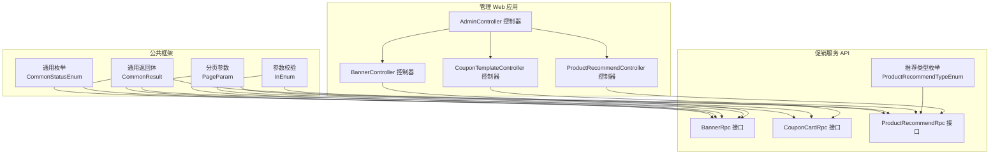
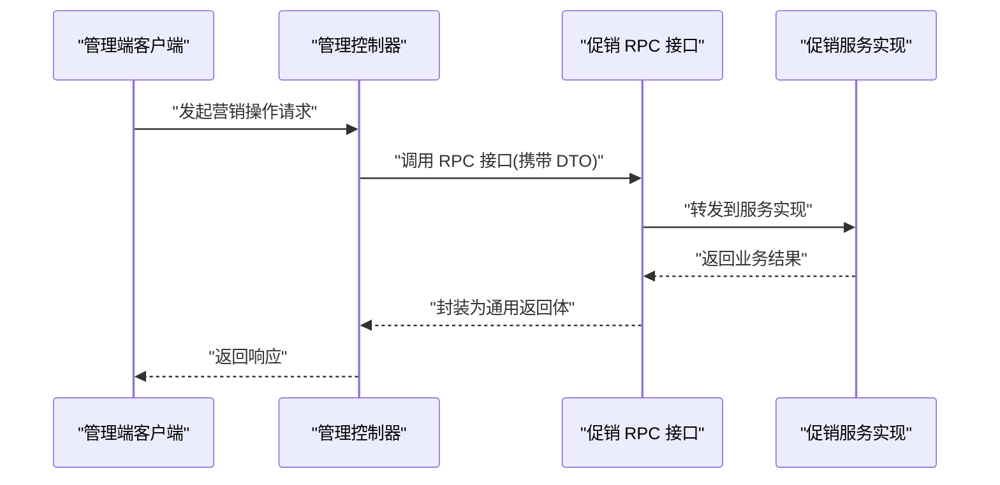
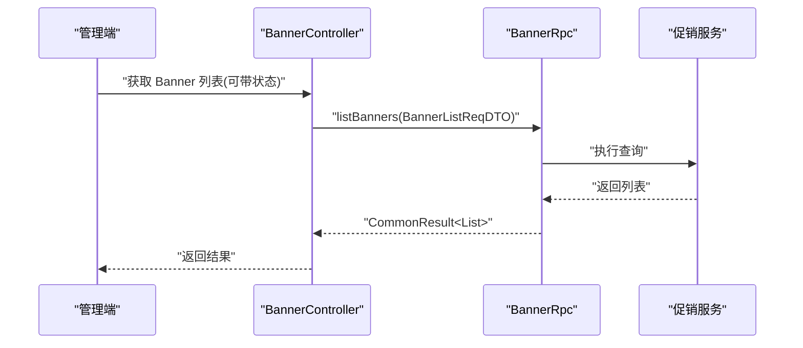
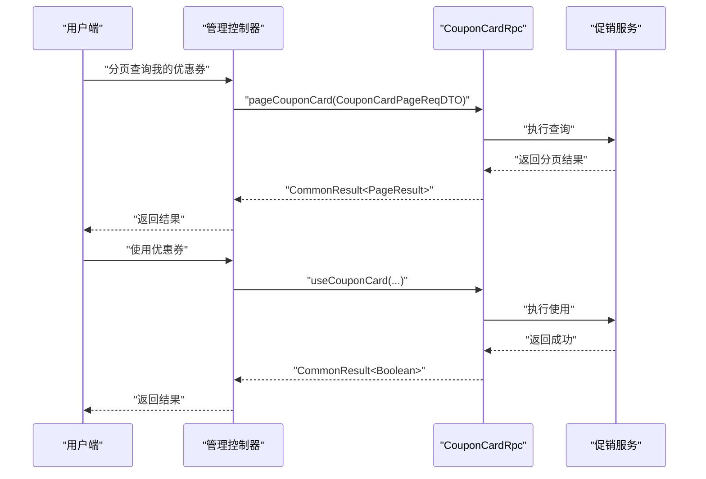
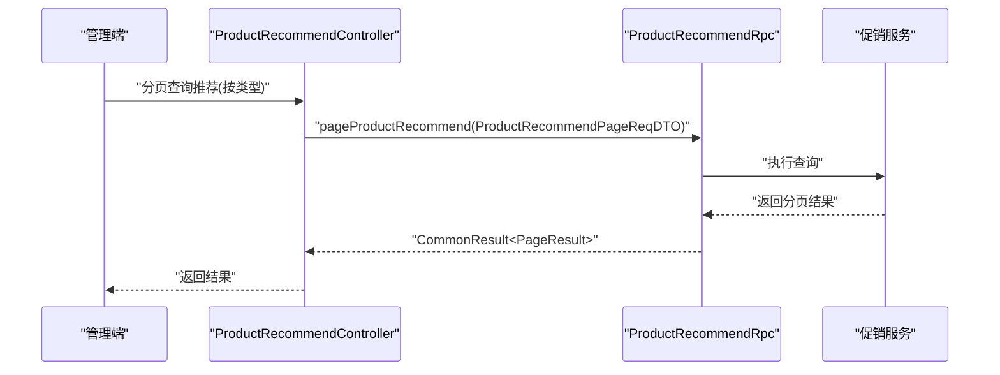
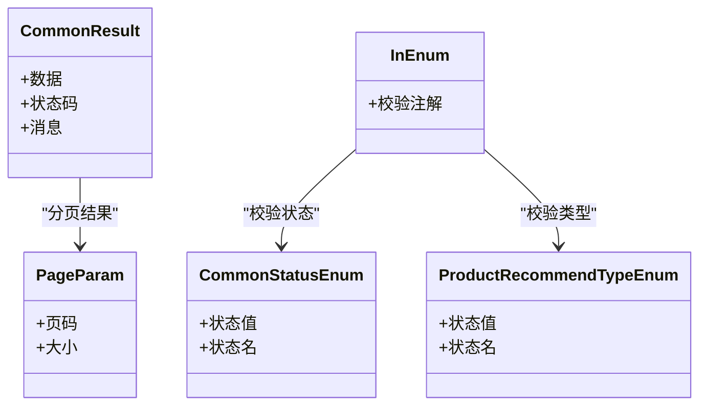
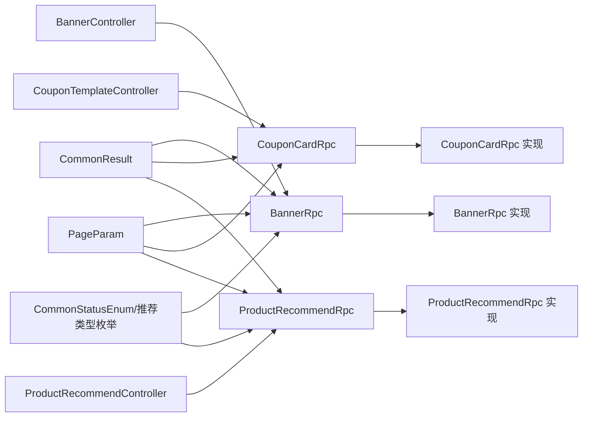

# 营销相关接口

<cite>
**本文引用的文件**
- [BannerRpc.java](file://promotion-service-project/promotion-service-api/src/main/java/cn/iocoder/mall/promotion/api/rpc/banner/BannerRpc.java)
- [BannerListReqDTO.java](file://promotion-service-project/promotion-service-api/src/main/java/cn/iocoder/mall/promotion/api/rpc/banner/dto/BannerListReqDTO.java)
- [CouponCardRpc.java](file://promotion-service-project/promotion-service-api/src/main/java/cn/iocoder/mall/promotion/api/rpc/coupon/CouponCardRpc.java)
- [CouponCardPageReqDTO.java](file://promotion-service-project/promotion-service-api/src/main/java/cn/iocoder/mall/promotion/api/rpc/coupon/dto/card/CouponCardPageReqDTO.java)
- [ProductRecommendRpc.java](file://promotion-service-project/promotion-service-api/src/main/java/cn/iocoder/mall/promotion/api/rpc/recommend/ProductRecommendRpc.java)
- [ProductRecommendPageReqDTO.java](file://promotion-service-project/promotion-service-api/src/main/java/cn/iocoder/mall/promotion/api/rpc/recommend/dto/ProductRecommendPageReqDTO.java)
- [ProductRecommendTypeEnum.java](file://promotion-service-project/promotion-service-api/src/main/java/cn/iocoder/mall/promotion/api/enums/recommend/ProductRecommendTypeEnum.java)
- [CommonResult.java](file://common/common-framework/src/main/java/cn/iocoder/common/framework/vo/CommonResult.java)
- [PageResult.java](file://common/common-framework/src/main/java/cn/iocoder/common/framework/vo/PageResult.java)
- [PageParam.java](file://common/common-framework/src/main/java/cn/iocoder/common/framework/vo/PageParam.java)
- [CommonStatusEnum.java](file://common/common-framework/src/main/java/cn/iocoder/common/framework/enums/CommonStatusEnum.java)
- [InEnum.java](file://common/common-framework/src/main/java/cn/iocoder/common/framework/validator/InEnum.java)
- [AdminController.java](file://management-web-app/src/main/java/cn/iocoder/mall/managementweb/controller/admin/AdminController.java)
- [BannerController.java](file://management-web-app/src/main/java/cn/iocoder/mall/managementweb/controller/promotion/brand/BannerController.java)
- [CouponTemplateController.java](file://management-web-app/src/main/java/cn/iocoder/mall/managementweb/controller/promotion/coupon/CouponTemplateController.java)
- [ProductRecommendController.java](file://management-web-app/src/main/java/cn/iocoder/mall/managementweb/controller/promotion/recommend/ProductRecommendController.java)
</cite>

## 目录
1. [引言](#引言)
2. [项目结构](#项目结构)
3. [核心组件](#核心组件)
4. [架构总览](#架构总览)
5. [详细组件分析](#详细组件分析)
6. [依赖关系分析](#依赖关系分析)
7. [性能考虑](#性能考虑)
8. [故障排查指南](#故障排查指南)
9. [结论](#结论)
10. [附录](#附录)

## 引言
本文件聚焦于营销相关接口，覆盖轮播图展示、优惠券领取与使用、商品推荐等核心能力。文档从接口规范、数据模型、处理流程、集成点、错误处理与性能优化等方面进行系统化梳理，并提供典型使用场景与测试建议，帮助开发者与测试人员快速理解并正确使用这些接口。

## 项目结构
营销能力位于独立的 promotion-service-project 中，采用 RPC 接口定义 + 应用层服务的分层设计。接口通过统一的返回体与分页参数进行封装，便于前端与管理端调用。

图表来源
- [BannerRpc.java:12-52](file://promotion-service-project/promotion-service-api/src/main/java/cn/iocoder/mall/promotion/api/rpc/banner/BannerRpc.java#L12-L52)
- [CouponCardRpc.java:12-54](file://promotion-service-project/promotion-service-api/src/main/java/cn/iocoder/mall/promotion/api/rpc/coupon/CouponCardRpc.java#L12-L54)
- [ProductRecommendRpc.java:12-52](file://promotion-service-project/promotion-service-api/src/main/java/cn/iocoder/mall/promotion/api/rpc/recommend/ProductRecommendRpc.java#L12-L52)
- [ProductRecommendTypeEnum.java:10-53](file://promotion-service-project/promotion-service-api/src/main/java/cn/iocoder/mall/promotion/api/enums/recommend/ProductRecommendTypeEnum.java#L10-L53)
- [BannerController.java](file://management-web-app/src/main/java/cn/iocoder/mall/managementweb/controller/promotion/brand/BannerController.java)
- [CouponTemplateController.java](file://management-web-app/src/main/java/cn/iocoder/mall/managementweb/controller/promotion/coupon/CouponTemplateController.java)
- [ProductRecommendController.java](file://management-web-app/src/main/java/cn/iocoder/mall/managementweb/controller/promotion/recommend/ProductRecommendController.java)
- [CommonResult.java](file://common/common-framework/src/main/java/cn/iocoder/common/framework/vo/CommonResult.java)
- [PageParam.java](file://common/common-framework/src/main/java/cn/iocoder/common/framework/vo/PageParam.java)
- [CommonStatusEnum.java](file://common/common-framework/src/main/java/cn/iocoder/common/framework/enums/CommonStatusEnum.java)
- [InEnum.java](file://common/common-framework/src/main/java/cn/iocoder/common/framework/validator/InEnum.java)

章节来源
- [BannerRpc.java:12-52](file://promotion-service-project/promotion-service-api/src/main/java/cn/iocoder/mall/promotion/api/rpc/banner/BannerRpc.java#L12-L52)
- [CouponCardRpc.java:12-54](file://promotion-service-project/promotion-service-api/src/main/java/cn/iocoder/mall/promotion/api/rpc/coupon/CouponCardRpc.java#L12-L54)
- [ProductRecommendRpc.java:12-52](file://promotion-service-project/promotion-service-api/src/main/java/cn/iocoder/mall/promotion/api/rpc/recommend/ProductRecommendRpc.java#L12-L52)
- [ProductRecommendTypeEnum.java:10-53](file://promotion-service-project/promotion-service-api/src/main/java/cn/iocoder/mall/promotion/api/enums/recommend/ProductRecommendTypeEnum.java#L10-L53)
- [BannerController.java](file://management-web-app/src/main/java/cn/iocoder/mall/managementweb/controller/promotion/brand/BannerController.java)
- [CouponTemplateController.java](file://management-web-app/src/main/java/cn/iocoder/mall/managementweb/controller/promotion/coupon/CouponTemplateController.java)
- [ProductRecommendController.java](file://management-web-app/src/main/java/cn/iocoder/mall/managementweb/controller/promotion/recommend/ProductRecommendController.java)

## 核心组件
- 轮播图接口（BannerRpc）
  - 提供创建、更新、删除、列表、分页查询等能力
  - 支持按状态筛选
- 优惠券接口（CouponCardRpc）
  - 提供分页查询、发放、使用、取消使用、可用列表等能力
  - 支持按用户与状态筛选
- 商品推荐接口（ProductRecommendRpc）
  - 提供创建、更新、删除、列表、分页查询等能力
  - 支持推荐类型（热卖/新品）筛选

章节来源
- [BannerRpc.java:12-52](file://promotion-service-project/promotion-service-api/src/main/java/cn/iocoder/mall/promotion/api/rpc/banner/BannerRpc.java#L12-L52)
- [CouponCardRpc.java:12-54](file://promotion-service-project/promotion-service-api/src/main/java/cn/iocoder/mall/promotion/api/rpc/coupon/CouponCardRpc.java#L12-L54)
- [ProductRecommendRpc.java:12-52](file://promotion-service-project/promotion-service-api/src/main/java/cn/iocoder/mall/promotion/api/rpc/recommend/ProductRecommendRpc.java#L12-L52)

## 架构总览
营销接口采用“RPC 接口 + DTO 参数 + 统一返回体”的设计模式，管理 Web 应用通过控制器暴露 REST 风格的入口，最终调用促销服务的 RPC 接口完成业务处理。

图表来源
- [BannerRpc.java:12-52](file://promotion-service-project/promotion-service-api/src/main/java/cn/iocoder/mall/promotion/api/rpc/banner/BannerRpc.java#L12-L52)
- [CouponCardRpc.java:12-54](file://promotion-service-project/promotion-service-api/src/main/java/cn/iocoder/mall/promotion/api/rpc/coupon/CouponCardRpc.java#L12-L54)
- [ProductRecommendRpc.java:12-52](file://promotion-service-project/promotion-service-api/src/main/java/cn/iocoder/mall/promotion/api/rpc/recommend/ProductRecommendRpc.java#L12-L52)
- [CommonResult.java](file://common/common-framework/src/main/java/cn/iocoder/common/framework/vo/CommonResult.java)

## 详细组件分析

### 轮播图接口（Banner）
- 接口职责
  - 创建、更新、删除轮播图
  - 获取轮播图列表与分页
  - 支持按状态过滤
- 请求与响应
  - 列表查询：支持状态过滤
  - 分页查询：继承通用分页参数
  - 返回：统一返回体包装的列表或分页结果
- 典型使用场景
  - 后台维护首页 Banner，按状态上下架
  - 前端拉取有效 Banner 列表用于页面渲染

图表来源
- [BannerRpc.java:36-42](file://promotion-service-project/promotion-service-api/src/main/java/cn/iocoder/mall/promotion/api/rpc/banner/BannerRpc.java#L36-L42)
- [BannerListReqDTO.java:15-23](file://promotion-service-project/promotion-service-api/src/main/java/cn/iocoder/mall/promotion/api/rpc/banner/dto/BannerListReqDTO.java#L15-L23)
- [CommonResult.java](file://common/common-framework/src/main/java/cn/iocoder/common/framework/vo/CommonResult.java)

章节来源
- [BannerRpc.java:12-52](file://promotion-service-project/promotion-service-api/src/main/java/cn/iocoder/mall/promotion/api/rpc/banner/BannerRpc.java#L12-L52)
- [BannerListReqDTO.java:15-23](file://promotion-service-project/promotion-service-api/src/main/java/cn/iocoder/mall/promotion/api/rpc/banner/dto/BannerListReqDTO.java#L15-L23)

### 优惠券接口（CouponCard）
- 接口职责
  - 分页查询用户优惠券
  - 发放优惠券给用户
  - 用户使用/取消使用优惠券
  - 查询可用优惠券列表
- 请求与响应
  - 分页查询：支持用户 ID 与状态过滤
  - 使用/取消使用：以请求 DTO 指定用户与券信息
  - 返回：统一返回体包装的布尔或分页结果
- 典型使用场景
  - 用户中心展示我的优惠券
  - 下单时选择可用优惠券
  - 订单支付后标记优惠券已使用

图表来源
- [CouponCardRpc.java:14-52](file://promotion-service-project/promotion-service-api/src/main/java/cn/iocoder/mall/promotion/api/rpc/coupon/CouponCardRpc.java#L14-L52)
- [CouponCardPageReqDTO.java:14-25](file://promotion-service-project/promotion-service-api/src/main/java/cn/iocoder/mall/promotion/api/rpc/coupon/dto/card/CouponCardPageReqDTO.java#L14-L25)
- [CommonResult.java](file://common/common-framework/src/main/java/cn/iocoder/common/framework/vo/CommonResult.java)
- [PageResult.java](file://common/common-framework/src/main/java/cn/iocoder/common/framework/vo/PageResult.java)

章节来源
- [CouponCardRpc.java:12-54](file://promotion-service-project/promotion-service-api/src/main/java/cn/iocoder/mall/promotion/api/rpc/coupon/CouponCardRpc.java#L12-L54)
- [CouponCardPageReqDTO.java:14-25](file://promotion-service-project/promotion-service-api/src/main/java/cn/iocoder/mall/promotion/api/rpc/coupon/dto/card/CouponCardPageReqDTO.java#L14-L25)

### 商品推荐接口（ProductRecommend）
- 接口职责
  - 创建、更新、删除推荐位
  - 获取推荐列表与分页
  - 支持推荐类型过滤（热卖/新品）
- 请求与响应
  - 分页查询：支持推荐类型过滤
  - 返回：统一返回体包装的列表或分页结果
- 典型使用场景
  - 后台配置首页“热卖推荐”“新品推荐”
  - 前端按类型拉取推荐商品集合

图表来源
- [ProductRecommendRpc.java:44-50](file://promotion-service-project/promotion-service-api/src/main/java/cn/iocoder/mall/promotion/api/rpc/recommend/ProductRecommendRpc.java#L44-L50)
- [ProductRecommendPageReqDTO.java:16-24](file://promotion-service-project/promotion-service-api/src/main/java/cn/iocoder/mall/promotion/api/rpc/recommend/dto/ProductRecommendPageReqDTO.java#L16-L24)
- [ProductRecommendTypeEnum.java:10-53](file://promotion-service-project/promotion-service-api/src/main/java/cn/iocoder/mall/promotion/api/enums/recommend/ProductRecommendTypeEnum.java#L10-L53)
- [CommonResult.java](file://common/common-framework/src/main/java/cn/iocoder/common/framework/vo/CommonResult.java)
- [PageResult.java](file://common/common-framework/src/main/java/cn/iocoder/common/framework/vo/PageResult.java)

章节来源
- [ProductRecommendRpc.java:12-52](file://promotion-service-project/promotion-service-api/src/main/java/cn/iocoder/mall/promotion/api/rpc/recommend/ProductRecommendRpc.java#L12-L52)
- [ProductRecommendPageReqDTO.java:16-24](file://promotion-service-project/promotion-service-api/src/main/java/cn/iocoder/mall/promotion/api/rpc/recommend/dto/ProductRecommendPageReqDTO.java#L16-L24)
- [ProductRecommendTypeEnum.java:10-53](file://promotion-service-project/promotion-service-api/src/main/java/cn/iocoder/mall/promotion/api/enums/recommend/ProductRecommendTypeEnum.java#L10-L53)

### 数据模型与参数校验
- 通用返回体与分页
  - 统一返回体封装业务结果
  - 分页参数支持页码与大小
- 参数校验
  - 状态枚举校验（CommonStatusEnum）
  - 推荐类型枚举校验（ProductRecommendTypeEnum）

图表来源
- [CommonResult.java](file://common/common-framework/src/main/java/cn/iocoder/common/framework/vo/CommonResult.java)
- [PageParam.java](file://common/common-framework/src/main/java/cn/iocoder/common/framework/vo/PageParam.java)
- [CommonStatusEnum.java](file://common/common-framework/src/main/java/cn/iocoder/common/framework/enums/CommonStatusEnum.java)
- [ProductRecommendTypeEnum.java:10-53](file://promotion-service-project/promotion-service-api/src/main/java/cn/iocoder/mall/promotion/api/enums/recommend/ProductRecommendTypeEnum.java#L10-L53)
- [InEnum.java](file://common/common-framework/src/main/java/cn/iocoder/common/framework/validator/InEnum.java)

章节来源
- [CommonResult.java](file://common/common-framework/src/main/java/cn/iocoder/common/framework/vo/CommonResult.java)
- [PageParam.java](file://common/common-framework/src/main/java/cn/iocoder/common/framework/vo/PageParam.java)
- [CommonStatusEnum.java](file://common/common-framework/src/main/java/cn/iocoder/common/framework/enums/CommonStatusEnum.java)
- [ProductRecommendTypeEnum.java:10-53](file://promotion-service-project/promotion-service-api/src/main/java/cn/iocoder/mall/promotion/api/enums/recommend/ProductRecommendTypeEnum.java#L10-L53)
- [InEnum.java](file://common/common-framework/src/main/java/cn/iocoder/common/framework/validator/InEnum.java)

## 依赖关系分析
- 控制器到 RPC 的依赖
  - 管理控制器依赖对应 RPC 接口完成业务编排
- RPC 到服务实现的依赖
  - RPC 接口由应用层服务实现，承担核心逻辑
- 统一返回体与参数校验
  - 所有接口统一使用 CommonResult 包装返回
  - 参数通过 InEnum 注解校验枚举合法性

图表来源
- [BannerController.java](file://management-web-app/src/main/java/cn/iocoder/mall/managementweb/controller/promotion/brand/BannerController.java)
- [CouponTemplateController.java](file://management-web-app/src/main/java/cn/iocoder/mall/managementweb/controller/promotion/coupon/CouponTemplateController.java)
- [ProductRecommendController.java](file://management-web-app/src/main/java/cn/iocoder/mall/managementweb/controller/promotion/recommend/ProductRecommendController.java)
- [BannerRpc.java:12-52](file://promotion-service-project/promotion-service-api/src/main/java/cn/iocoder/mall/promotion/api/rpc/banner/BannerRpc.java#L12-L52)
- [CouponCardRpc.java:12-54](file://promotion-service-project/promotion-service-api/src/main/java/cn/iocoder/mall/promotion/api/rpc/coupon/CouponCardRpc.java#L12-L54)
- [ProductRecommendRpc.java:12-52](file://promotion-service-project/promotion-service-api/src/main/java/cn/iocoder/mall/promotion/api/rpc/recommend/ProductRecommendRpc.java#L12-L52)
- [CommonResult.java](file://common/common-framework/src/main/java/cn/iocoder/common/framework/vo/CommonResult.java)
- [PageParam.java](file://common/common-framework/src/main/java/cn/iocoder/common/framework/vo/PageParam.java)
- [CommonStatusEnum.java](file://common/common-framework/src/main/java/cn/iocoder/common/framework/enums/CommonStatusEnum.java)
- [ProductRecommendTypeEnum.java:10-53](file://promotion-service-project/promotion-service-api/src/main/java/cn/iocoder/mall/promotion/api/enums/recommend/ProductRecommendTypeEnum.java#L10-L53)

章节来源
- [BannerController.java](file://management-web-app/src/main/java/cn/iocoder/mall/managementweb/controller/promotion/brand/BannerController.java)
- [CouponTemplateController.java](file://management-web-app/src/main/java/cn/iocoder/mall/managementweb/controller/promotion/coupon/CouponTemplateController.java)
- [ProductRecommendController.java](file://management-web-app/src/main/java/cn/iocoder/mall/managementweb/controller/promotion/recommend/ProductRecommendController.java)
- [BannerRpc.java:12-52](file://promotion-service-project/promotion-service-api/src/main/java/cn/iocoder/mall/promotion/api/rpc/banner/BannerRpc.java#L12-L52)
- [CouponCardRpc.java:12-54](file://promotion-service-project/promotion-service-api/src/main/java/cn/iocoder/mall/promotion/api/rpc/coupon/CouponCardRpc.java#L12-L54)
- [ProductRecommendRpc.java:12-52](file://promotion-service-project/promotion-service-api/src/main/java/cn/iocoder/mall/promotion/api/rpc/recommend/ProductRecommendRpc.java#L12-L52)

## 性能考虑
- 分页查询
  - 使用 PageParam 控制页码与大小，避免一次性返回大量数据
- 缓存策略
  - 对高频读取的 Banner 列表与推荐位可引入缓存，降低数据库压力
- 并发控制
  - 优惠券发放与使用需保证幂等性与并发安全，必要时使用分布式锁或数据库约束
- 接口幂等
  - 使用/取消使用优惠券应具备幂等语义，避免重复操作导致状态异常

## 故障排查指南
- 参数校验失败
  - 状态或类型不在允许范围内会导致校验失败，检查请求 DTO 的枚举字段
- 返回体结构
  - 统一使用 CommonResult 包裹，关注状态码与消息字段定位问题
- 分页异常
  - 检查 PageParam 的页码与大小是否合理，避免过大或过小

章节来源
- [InEnum.java](file://common/common-framework/src/main/java/cn/iocoder/common/framework/validator/InEnum.java)
- [CommonResult.java](file://common/common-framework/src/main/java/cn/iocoder/common/framework/vo/CommonResult.java)
- [PageParam.java](file://common/common-framework/src/main/java/cn/iocoder/common/framework/vo/PageParam.java)

## 结论
营销相关接口通过清晰的 RPC 定义与统一的返回体设计，实现了轮播图、优惠券与商品推荐的核心能力。结合参数校验与分页机制，能够满足后台管理与前端展示的多样化需求。建议在生产环境中配合缓存与并发控制策略，确保高并发下的稳定性与一致性。

## 附录

### 接口规范总览
- 轮播图（Banner）
  - 方法：列表查询
  - 路径：/promotion/banner/list（示例，实际路径以控制器为准）
  - 请求参数：状态（可选）
  - 响应：统一返回体 + 列表
- 优惠券（CouponCard）
  - 方法：分页查询
  - 路径：/promotion/coupon/page（示例，实际路径以控制器为准）
  - 请求参数：用户 ID、状态、分页参数
  - 响应：统一返回体 + 分页结果
- 商品推荐（ProductRecommend）
  - 方法：分页查询
  - 路径：/promotion/recommend/page（示例，实际路径以控制器为准）
  - 请求参数：推荐类型、分页参数
  - 响应：统一返回体 + 分页结果

章节来源
- [BannerRpc.java:36-42](file://promotion-service-project/promotion-service-api/src/main/java/cn/iocoder/mall/promotion/api/rpc/banner/BannerRpc.java#L36-L42)
- [CouponCardRpc.java:14-20](file://promotion-service-project/promotion-service-api/src/main/java/cn/iocoder/mall/promotion/api/rpc/coupon/CouponCardRpc.java#L14-L20)
- [ProductRecommendRpc.java:44-50](file://promotion-service-project/promotion-service-api/src/main/java/cn/iocoder/mall/promotion/api/rpc/recommend/ProductRecommendRpc.java#L44-L50)

### 使用场景示例
- 首页 Banner 展示
  - 后台配置有效状态的轮播图
  - 前端调用列表接口获取可用 Banner 进行渲染
- 优惠券使用
  - 用户下单前查询可用优惠券
  - 下单完成后调用使用接口标记状态
- 个性化推荐
  - 后台配置“热卖推荐”“新品推荐”
  - 前端按类型分页拉取推荐商品集合

### 接口测试方法
- 单元测试
  - 基于 RPC 接口的分页与列表查询进行断言
- 集成测试
  - 通过管理控制器发起请求，验证返回体结构与数据正确性
- 性能测试
  - 对高频接口进行压测，观察分页与缓存命中率

### 营销效果评估指标
- 轮播图点击率
- 优惠券领取率/使用率
- 推荐商品加购转化率
- A/B 测试对比（不同推荐策略/样式对转化的影响）