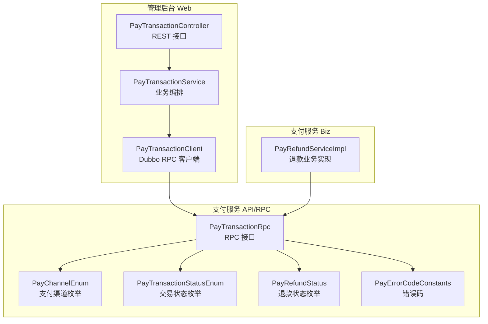
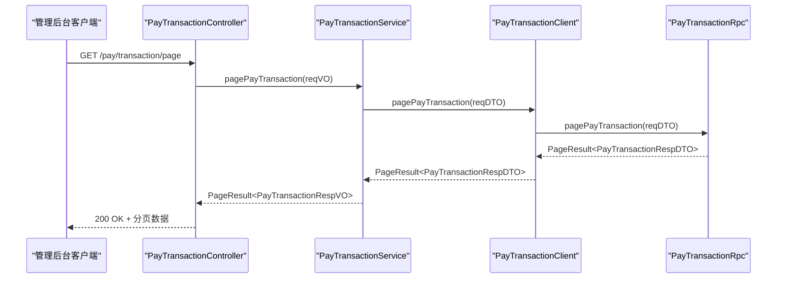
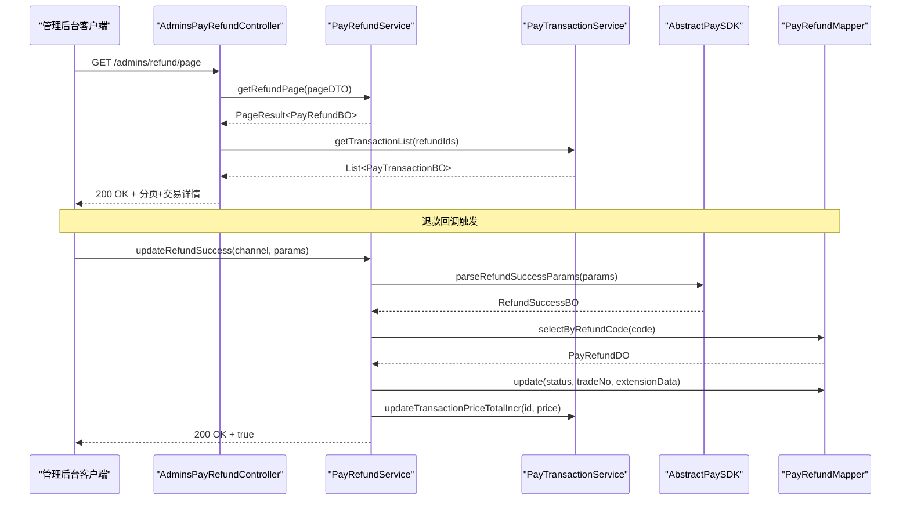
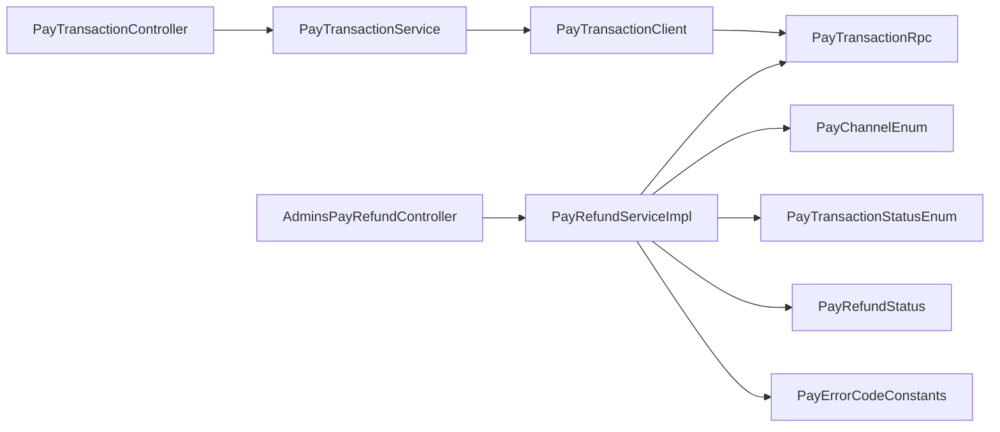

# 支付管理接口

<cite>
**本文引用的文件**
- [management-web-app/src/main/java/cn/iocoder/mall/managementweb/controller/pay/PayTransactionController.java](file://management-web-app/src/main/java/cn/iocoder/mall/managementweb/controller/pay/PayTransactionController.java)
- [management-web-app/src/main/java/cn/iocoder/mall/managementweb/service/pay/transaction/PayTransactionService.java](file://management-web-app/src/main/java/cn/iocoder/mall/managementweb/service/pay/transaction/PayTransactionService.java)
- [management-web-app/src/main/java/cn/iocoder/mall/managementweb/client/pay/transaction/PayTransactionClient.java](file://management-web-app/src/main/java/cn/iocoder/mall/managementweb/client/pay/transaction/PayTransactionClient.java)
- [management-web-app/src/main/java/cn/iocoder/mall/managementweb/controller/pay/vo/transaction/PayTransactionPageReqVO.java](file://management-web-app/src/main/java/cn/iocoder/mall/managementweb/controller/pay/vo/transaction/PayTransactionPageReqVO.java)
- [management-web-app/src/main/java/cn/iocoder/mall/managementweb/controller/pay/vo/transaction/PayTransactionRespVO.java](file://management-web-app/src/main/java/cn/iocoder/mall/managementweb/controller/pay/vo/transaction/PayTransactionRespVO.java)
- [moved/pay/pay-application/src/main/java/cn/iocoder/mall/pay/application/controller/admins/AdminsPayRefundController.java](file://moved/pay/pay-application/src/main/java/cn/iocoder/mall/pay/application/controller/admins/AdminsPayRefundController.java)
- [moved/pay/pay-application/src/main/java/cn/iocoder/mall/pay/biz/service/PayRefundServiceImpl.java](file://moved/pay/pay-application/src/main/java/cn/iocoder/mall/pay/biz/service/PayRefundServiceImpl.java)
- [moved/pay/pay-application/src/main/java/cn/iocoder/mall/pay/api/dto/refund/PayRefundPageDTO.java](file://moved/pay/pay-application/src/main/java/cn/iocoder/mall/pay/api/dto/refund/PayRefundPageDTO.java)
- [moved/pay/pay-application/src/main/java/cn/iocoder/mall/pay/api/bo/refund/PayRefundBO.java](file://moved/pay/pay-application/src/main/java/cn/iocoder/mall/pay/api/bo/refund/PayRefundBO.java)
- [pay-service-project/pay-service-api/src/main/java/cn/iocoder/mall/payservice/rpc/transaction/PayTransactionRpc.java](file://pay-service-project/pay-service-api/src/main/java/cn/iocoder/mall/payservice/rpc/transaction/PayTransactionRpc.java)
- [pay-service-project/pay-service-api/src/main/java/cn/iocoder/mall/payservice/enums/PayChannelEnum.java](file://pay-service-project/pay-service-api/src/main/java/cn/iocoder/mall/payservice/enums/PayChannelEnum.java)
- [pay-service-project/pay-service-api/src/main/java/cn/iocoder/mall/payservice/enums/transaction/PayTransactionStatusEnum.java](file://pay-service-project/pay-service-api/src/main/java/cn/iocoder/mall/payservice/enums/transaction/PayTransactionStatusEnum.java)
- [pay-service-project/pay-service-api/src/main/java/cn/iocoder/mall/payservice/enums/refund/PayRefundStatus.java](file://pay-service-project/pay-service-api/src/main/java/cn/iocoder/mall/payservice/enums/refund/PayRefundStatus.java)
- [pay-service-project/pay-service-api/src/main/java/cn/iocoder/mall/payservice/enums/PayErrorCodeConstants.java](file://pay-service-project/pay-service-api/src/main/java/cn/iocoder/mall/payservice/enums/PayErrorCodeConstants.java)
- [management-web-app/src/main/resources/application.yml](file://management-web-app/src/main/resources/application.yml)
</cite>

## 目录
1. [简介](#简介)
2. [项目结构](#项目结构)
3. [核心组件](#核心组件)
4. [架构总览](#架构总览)
5. [详细组件分析](#详细组件分析)
6. [依赖分析](#依赖分析)
7. [性能考量](#性能考量)
8. [故障排查指南](#故障排查指南)
9. [结论](#结论)
10. [附录](#附录)

## 简介
本文件为“支付管理接口”模块的全面API文档，覆盖以下能力：
- 支付交易单查询（分页）
- 退款申请与退款分页查询
- 退款状态更新与回调处理
- 支付状态监控与对账基础能力（通过交易单分页与退款分页）
- 支付安全机制、数据加密与风控策略说明
- 测试方法与异常处理指南

本模块采用前后端分离与RPC分层设计：前端管理后台通过REST接口调用，内部通过Dubbo RPC访问支付服务；支付服务内含退款业务逻辑与对账基础数据。

## 项目结构
围绕支付管理接口的关键目录与文件如下：
- 管理后台 Web 层：提供REST接口，封装分页请求与响应VO
- 支付服务 API/RPC：定义RPC接口与枚举、错误码
- 支付服务 Biz：实现退款提交、状态更新、分页查询等业务逻辑

图表来源
- [management-web-app/src/main/java/cn/iocoder/mall/managementweb/controller/pay/PayTransactionController.java:1-39](file://management-web-app/src/main/java/cn/iocoder/mall/managementweb/controller/pay/PayTransactionController.java#L1-L39)
- [management-web-app/src/main/java/cn/iocoder/mall/managementweb/service/pay/transaction/PayTransactionService.java:1-30](file://management-web-app/src/main/java/cn/iocoder/mall/managementweb/service/pay/transaction/PayTransactionService.java#L1-L30)
- [management-web-app/src/main/java/cn/iocoder/mall/managementweb/client/pay/transaction/PayTransactionClient.java:1-24](file://management-web-app/src/main/java/cn/iocoder/mall/managementweb/client/pay/transaction/PayTransactionClient.java#L1-L24)
- [pay-service-project/pay-service-api/src/main/java/cn/iocoder/mall/payservice/rpc/transaction/PayTransactionRpc.java:1-53](file://pay-service-project/pay-service-api/src/main/java/cn/iocoder/mall/payservice/rpc/transaction/PayTransactionRpc.java#L1-L53)
- [pay-service-project/pay-service-api/src/main/java/cn/iocoder/mall/payservice/enums/PayChannelEnum.java:1-59](file://pay-service-project/pay-service-api/src/main/java/cn/iocoder/mall/payservice/enums/PayChannelEnum.java#L1-L59)
- [pay-service-project/pay-service-api/src/main/java/cn/iocoder/mall/payservice/enums/transaction/PayTransactionStatusEnum.java:1-31](file://pay-service-project/pay-service-api/src/main/java/cn/iocoder/mall/payservice/enums/transaction/PayTransactionStatusEnum.java#L1-L31)
- [pay-service-project/pay-service-api/src/main/java/cn/iocoder/mall/payservice/enums/refund/PayRefundStatus.java:1-31](file://pay-service-project/pay-service-api/src/main/java/cn/iocoder/mall/payservice/enums/refund/PayRefundStatus.java#L1-L31)
- [pay-service-project/pay-service-api/src/main/java/cn/iocoder/mall/payservice/enums/PayErrorCodeConstants.java:1-32](file://pay-service-project/pay-service-api/src/main/java/cn/iocoder/mall/payservice/enums/PayErrorCodeConstants.java#L1-L32)
- [moved/pay/pay-application/src/main/java/cn/iocoder/mall/pay/biz/service/PayRefundServiceImpl.java:1-186](file://moved/pay/pay-application/src/main/java/cn/iocoder/mall/pay/biz/service/PayRefundServiceImpl.java#L1-L186)

章节来源
- [management-web-app/src/main/java/cn/iocoder/mall/managementweb/controller/pay/PayTransactionController.java:1-39](file://management-web-app/src/main/java/cn/iocoder/mall/managementweb/controller/pay/PayTransactionController.java#L1-L39)
- [management-web-app/src/main/java/cn/iocoder/mall/managementweb/service/pay/transaction/PayTransactionService.java:1-30](file://management-web-app/src/main/java/cn/iocoder/mall/managementweb/service/pay/transaction/PayTransactionService.java#L1-L30)
- [management-web-app/src/main/java/cn/iocoder/mall/managementweb/client/pay/transaction/PayTransactionClient.java:1-24](file://management-web-app/src/main/java/cn/iocoder/mall/managementweb/client/pay/transaction/PayTransactionClient.java#L1-L24)
- [pay-service-project/pay-service-api/src/main/java/cn/iocoder/mall/payservice/rpc/transaction/PayTransactionRpc.java:1-53](file://pay-service-project/pay-service-api/src/main/java/cn/iocoder/mall/payservice/rpc/transaction/PayTransactionRpc.java#L1-L53)

## 核心组件
- 管理后台 REST 控制器：提供交易单分页查询接口
- 管理后台 Service：编排RPC调用与VO转换
- 管理后台 RPC 客户端：封装Dubbo引用与错误检查
- 支付服务 RPC 接口：定义交易单创建、提交、查询、更新、分页等能力
- 支付服务退款实现：实现退款提交、状态更新、分页查询与回调处理
- 枚举与错误码：统一支付渠道、交易状态、退款状态与错误码

章节来源
- [management-web-app/src/main/java/cn/iocoder/mall/managementweb/controller/pay/PayTransactionController.java:1-39](file://management-web-app/src/main/java/cn/iocoder/mall/managementweb/controller/pay/PayTransactionController.java#L1-L39)
- [management-web-app/src/main/java/cn/iocoder/mall/managementweb/service/pay/transaction/PayTransactionService.java:1-30](file://management-web-app/src/main/java/cn/iocoder/mall/managementweb/service/pay/transaction/PayTransactionService.java#L1-L30)
- [management-web-app/src/main/java/cn/iocoder/mall/managementweb/client/pay/transaction/PayTransactionClient.java:1-24](file://management-web-app/src/main/java/cn/iocoder/mall/managementweb/client/pay/transaction/PayTransactionClient.java#L1-L24)
- [pay-service-project/pay-service-api/src/main/java/cn/iocoder/mall/payservice/rpc/transaction/PayTransactionRpc.java:1-53](file://pay-service-project/pay-service-api/src/main/java/cn/iocoder/mall/payservice/rpc/transaction/PayTransactionRpc.java#L1-L53)
- [moved/pay/pay-application/src/main/java/cn/iocoder/mall/pay/biz/service/PayRefundServiceImpl.java:1-186](file://moved/pay/pay-application/src/main/java/cn/iocoder/mall/pay/biz/service/PayRefundServiceImpl.java#L1-L186)

## 架构总览
管理后台通过REST接口调用，内部通过Dubbo RPC访问支付服务；支付服务负责退款业务与交易单分页查询。

图表来源
- [management-web-app/src/main/java/cn/iocoder/mall/managementweb/controller/pay/PayTransactionController.java:30-36](file://management-web-app/src/main/java/cn/iocoder/mall/managementweb/controller/pay/PayTransactionController.java#L30-L36)
- [management-web-app/src/main/java/cn/iocoder/mall/managementweb/service/pay/transaction/PayTransactionService.java:23-27](file://management-web-app/src/main/java/cn/iocoder/mall/managementweb/service/pay/transaction/PayTransactionService.java#L23-L27)
- [management-web-app/src/main/java/cn/iocoder/mall/managementweb/client/pay/transaction/PayTransactionClient.java:17-21](file://management-web-app/src/main/java/cn/iocoder/mall/managementweb/client/pay/transaction/PayTransactionClient.java#L17-L21)
- [pay-service-project/pay-service-api/src/main/java/cn/iocoder/mall/payservice/rpc/transaction/PayTransactionRpc.java:49-50](file://pay-service-project/pay-service-api/src/main/java/cn/iocoder/mall/payservice/rpc/transaction/PayTransactionRpc.java#L49-L50)

## 详细组件分析

### 支付交易单查询（分页）
- 接口名称：获得交易支付单分页
- 请求方法：GET
- URL 路径：/pay/transaction/page
- 权限标识：pay:transaction:page
- 请求参数（来自VO）：
  - createBeginTime：创建时间（开始），日期格式 yyyy-MM-dd HH:mm:ss
  - createEndTime：创建时间（结束），日期格式 yyyy-MM-dd HH:mm:ss
  - paymentBeginTime：支付时间（开始），日期格式 yyyy-MM-dd HH:mm:ss
  - paymentEndTime：支付时间（结束），日期格式 yyyy-MM-dd HH:mm:ss
  - status：支付状态，参考交易状态枚举
  - hasRefund：是否退款（布尔）
  - payChannel：支付渠道，参考支付渠道枚举
  - orderSubject：商品标题（模糊匹配）
  - pageNo：页码（默认1）
  - pageSize：每页条数（默认10）
- 响应数据：分页结果，包含交易单列表，字段详见交易单响应VO

章节来源
- [management-web-app/src/main/java/cn/iocoder/mall/managementweb/controller/pay/PayTransactionController.java:30-36](file://management-web-app/src/main/java/cn/iocoder/mall/managementweb/controller/pay/PayTransactionController.java#L30-L36)
- [management-web-app/src/main/java/cn/iocoder/mall/managementweb/controller/pay/vo/transaction/PayTransactionPageReqVO.java:1-45](file://management-web-app/src/main/java/cn/iocoder/mall/managementweb/controller/pay/vo/transaction/PayTransactionPageReqVO.java#L1-L45)
- [management-web-app/src/main/java/cn/iocoder/mall/managementweb/controller/pay/vo/transaction/PayTransactionRespVO.java:1-75](file://management-web-app/src/main/java/cn/iocoder/mall/managementweb/controller/pay/vo/transaction/PayTransactionRespVO.java#L1-L75)
- [pay-service-project/pay-service-api/src/main/java/cn/iocoder/mall/payservice/rpc/transaction/PayTransactionRpc.java:49-50](file://pay-service-project/pay-service-api/src/main/java/cn/iocoder/mall/payservice/rpc/transaction/PayTransactionRpc.java#L49-L50)

### 退款管理（申请、分页、回调）
- 退款申请（提交）：由业务线调用支付服务的退款提交接口，内部校验交易单状态、金额上限、扩展单状态等，并调用三方SDK发起退款
- 退款分页查询：支持按创建时间、完成时间、状态、支付渠道分页查询
- 退款回调处理：解析三方回调参数，严格校验状态与幂等，更新退款单与交易单退款累计金额，异步通知业务线

图表来源
- [moved/pay/pay-application/src/main/java/cn/iocoder/mall/pay/application/controller/admins/AdminsPayRefundController.java:34-66](file://moved/pay/pay-application/src/main/java/cn/iocoder/mall/pay/application/controller/admins/AdminsPayRefundController.java#L34-L66)
- [moved/pay/pay-application/src/main/java/cn/iocoder/mall/pay/biz/service/PayRefundServiceImpl.java:53-95](file://moved/pay/pay-application/src/main/java/cn/iocoder/mall/pay/biz/service/PayRefundServiceImpl.java#L53-L95)
- [moved/pay/pay-application/src/main/java/cn/iocoder/mall/pay/biz/service/PayRefundServiceImpl.java:98-147](file://moved/pay/pay-application/src/main/java/cn/iocoder/mall/pay/biz/service/PayRefundServiceImpl.java#L98-L147)

章节来源
- [moved/pay/pay-application/src/main/java/cn/iocoder/mall/pay/application/controller/admins/AdminsPayRefundController.java:1-69](file://moved/pay/pay-application/src/main/java/cn/iocoder/mall/pay/application/controller/admins/AdminsPayRefundController.java#L1-L69)
- [moved/pay/pay-application/src/main/java/cn/iocoder/mall/pay/biz/service/PayRefundServiceImpl.java:1-186](file://moved/pay/pay-application/src/main/java/cn/iocoder/mall/pay/biz/service/PayRefundServiceImpl.java#L1-L186)
- [moved/pay/pay-application/src/main/java/cn/iocoder/mall/pay/api/dto/refund/PayRefundPageDTO.java:1-47](file://moved/pay/pay-application/src/main/java/cn/iocoder/mall/pay/api/dto/refund/PayRefundPageDTO.java#L1-L47)
- [moved/pay/pay-application/src/main/java/cn/iocoder/mall/pay/api/bo/refund/PayRefundBO.java:1-103](file://moved/pay/pay-application/src/main/java/cn/iocoder/mall/pay/api/bo/refund/PayRefundBO.java#L1-L103)

### 支付状态监控与对账
- 交易单分页：用于对账与监控，筛选条件包括创建时间、支付时间、状态、是否退款、支付渠道、商品标题等
- 退款分页：用于对账差异核对，筛选条件包括创建/完成时间、状态、支付渠道

章节来源
- [management-web-app/src/main/java/cn/iocoder/mall/managementweb/controller/pay/vo/transaction/PayTransactionPageReqVO.java:1-45](file://management-web-app/src/main/java/cn/iocoder/mall/managementweb/controller/pay/vo/transaction/PayTransactionPageReqVO.java#L1-L45)
- [management-web-app/src/main/java/cn/iocoder/mall/managementweb/controller/pay/vo/transaction/PayTransactionRespVO.java:1-75](file://management-web-app/src/main/java/cn/iocoder/mall/managementweb/controller/pay/vo/transaction/PayTransactionRespVO.java#L1-L75)
- [moved/pay/pay-application/src/main/java/cn/iocoder/mall/pay/api/dto/refund/PayRefundPageDTO.java:1-47](file://moved/pay/pay-application/src/main/java/cn/iocoder/mall/pay/api/dto/refund/PayRefundPageDTO.java#L1-L47)

## 依赖分析
- 管理后台 Web 层依赖支付服务RPC接口，通过Dubbo版本化引用
- 支付服务Biz层实现退款业务，依赖枚举与错误码，调用三方SDK与数据库映射
- 枚举与错误码为跨模块共享契约，确保状态与错误的一致性

图表来源
- [management-web-app/src/main/java/cn/iocoder/mall/managementweb/controller/pay/PayTransactionController.java:1-39](file://management-web-app/src/main/java/cn/iocoder/mall/managementweb/controller/pay/PayTransactionController.java#L1-L39)
- [management-web-app/src/main/java/cn/iocoder/mall/managementweb/service/pay/transaction/PayTransactionService.java:1-30](file://management-web-app/src/main/java/cn/iocoder/mall/managementweb/service/pay/transaction/PayTransactionService.java#L1-L30)
- [management-web-app/src/main/java/cn/iocoder/mall/managementweb/client/pay/transaction/PayTransactionClient.java:1-24](file://management-web-app/src/main/java/cn/iocoder/mall/managementweb/client/pay/transaction/PayTransactionClient.java#L1-L24)
- [moved/pay/pay-application/src/main/java/cn/iocoder/mall/pay/application/controller/admins/AdminsPayRefundController.java:1-69](file://moved/pay/pay-application/src/main/java/cn/iocoder/mall/pay/application/controller/admins/AdminsPayRefundController.java#L1-L69)
- [moved/pay/pay-application/src/main/java/cn/iocoder/mall/pay/biz/service/PayRefundServiceImpl.java:1-186](file://moved/pay/pay-application/src/main/java/cn/iocoder/mall/pay/biz/service/PayRefundServiceImpl.java#L1-L186)
- [pay-service-project/pay-service-api/src/main/java/cn/iocoder/mall/payservice/enums/PayChannelEnum.java:1-59](file://pay-service-project/pay-service-api/src/main/java/cn/iocoder/mall/payservice/enums/PayChannelEnum.java#L1-L59)
- [pay-service-project/pay-service-api/src/main/java/cn/iocoder/mall/payservice/enums/transaction/PayTransactionStatusEnum.java:1-31](file://pay-service-project/pay-service-api/src/main/java/cn/iocoder/mall/payservice/enums/transaction/PayTransactionStatusEnum.java#L1-L31)
- [pay-service-project/pay-service-api/src/main/java/cn/iocoder/mall/payservice/enums/refund/PayRefundStatus.java:1-31](file://pay-service-project/pay-service-api/src/main/java/cn/iocoder/mall/payservice/enums/refund/PayRefundStatus.java#L1-L31)
- [pay-service-project/pay-service-api/src/main/java/cn/iocoder/mall/payservice/enums/PayErrorCodeConstants.java:1-32](file://pay-service-project/pay-service-api/src/main/java/cn/iocoder/mall/payservice/enums/PayErrorCodeConstants.java#L1-L32)

## 性能考量
- 分页查询：建议合理设置页码与每页大小，避免一次性拉取大量数据
- 幂等与重试：退款回调需严格校验状态与唯一键，防止重复回调导致的并发问题
- 异步通知：退款成功后异步通知业务线，降低主流程阻塞
- 缓存与索引：对常用筛选条件建立索引，优化分页查询性能

## 故障排查指南
- 常见错误码（退款相关）：
  - 退款金额超过可退金额
  - 退款单不存在
  - 退款单不处于待处理
- 常见错误码（交易相关）：
  - 支付交易单不存在
  - 支付交易单不处于待支付/已支付
  - 支付交易拓展单不存在/状态不正确
- 处理建议：
  - 核对交易单状态与金额上限
  - 校验退款单唯一键与回调参数签名
  - 查看回调日志与数据库状态变更
  - 结合交易单与退款单分页查询进行对账

章节来源
- [pay-service-project/pay-service-api/src/main/java/cn/iocoder/mall/payservice/enums/PayErrorCodeConstants.java:16-30](file://pay-service-project/pay-service-api/src/main/java/cn/iocoder/mall/payservice/enums/PayErrorCodeConstants.java#L16-L30)
- [moved/pay/pay-application/src/main/java/cn/iocoder/mall/pay/biz/service/PayRefundServiceImpl.java:54-95](file://moved/pay/pay-application/src/main/java/cn/iocoder/mall/pay/biz/service/PayRefundServiceImpl.java#L54-L95)
- [moved/pay/pay-application/src/main/java/cn/iocoder/mall/pay/biz/service/PayRefundServiceImpl.java:98-147](file://moved/pay/pay-application/src/main/java/cn/iocoder/mall/pay/biz/service/PayRefundServiceImpl.java#L98-L147)

## 结论
本模块提供了支付交易单查询与退款管理的基础能力，结合RPC分层与枚举/错误码契约，实现了清晰的职责划分与一致的状态管理。建议在生产环境中强化回调幂等、异步通知与对账流程，确保支付数据的准确性与一致性。

## 附录

### 接口清单与规范

- 交易单分页查询
  - 方法：GET
  - 路径：/pay/transaction/page
  - 权限：pay:transaction:page
  - 请求参数：见“支付交易单查询（分页）”章节
  - 响应：分页结果，包含交易单列表

- 退款分页查询（管理后台）
  - 方法：GET
  - 路径：/admins/refund/page
  - 请求参数：
    - createBeginTime/createEndTime：创建时间范围
    - finishBeginTime/finishEndTime：完成时间范围
    - status：退款状态
    - payChannel：支付渠道
    - pageNo/pageSize：分页参数
  - 响应：分页结果，包含退款单列表及关联交易单信息

章节来源
- [management-web-app/src/main/java/cn/iocoder/mall/managementweb/controller/pay/PayTransactionController.java:30-36](file://management-web-app/src/main/java/cn/iocoder/mall/managementweb/controller/pay/PayTransactionController.java#L30-L36)
- [moved/pay/pay-application/src/main/java/cn/iocoder/mall/pay/application/controller/admins/AdminsPayRefundController.java:34-66](file://moved/pay/pay-application/src/main/java/cn/iocoder/mall/pay/application/controller/admins/AdminsPayRefundController.java#L34-L66)

### 支付安全机制与风控策略
- 权限控制：REST接口使用权限注解保护
- 参数校验：Dubbo消费者侧开启参数校验
- 回调幂等：退款回调严格校验状态与唯一键，避免重复处理
- 错误码治理：统一错误码定义，便于定位问题
- 日志与监控：结合回调日志与监控指标，快速发现异常

章节来源
- [management-web-app/src/main/java/cn/iocoder/mall/managementweb/controller/pay/PayTransactionController.java:30-36](file://management-web-app/src/main/java/cn/iocoder/mall/managementweb/controller/pay/PayTransactionController.java#L30-L36)
- [management-web-app/src/main/resources/application.yml:25-28](file://management-web-app/src/main/resources/application.yml#L25-L28)
- [moved/pay/pay-application/src/main/java/cn/iocoder/mall/pay/biz/service/PayRefundServiceImpl.java:98-147](file://moved/pay/pay-application/src/main/java/cn/iocoder/mall/pay/biz/service/PayRefundServiceImpl.java#L98-L147)

### 测试方法与示例
- 单元测试：针对退款提交、状态更新与分页查询编写测试用例
- 集成测试：通过RPC桩或Mock验证回调处理与对账流程
- 示例场景：
  - 交易查询：构造分页请求，校验返回字段与总数
  - 退款审核：提交退款申请，模拟回调更新状态并核对累计退款金额
  - 对账差异处理：对比交易单与退款单分页结果，定位差异并修复

章节来源
- [moved/pay/pay-application/src/test/java/PayRefundServiceImplTest.java](file://moved/pay/pay-application/src/test/java/PayRefundServiceImplTest.java)
- [management-web-app/src/main/resources/application.yml:69-70](file://management-web-app/src/main/resources/application.yml#L69-L70)