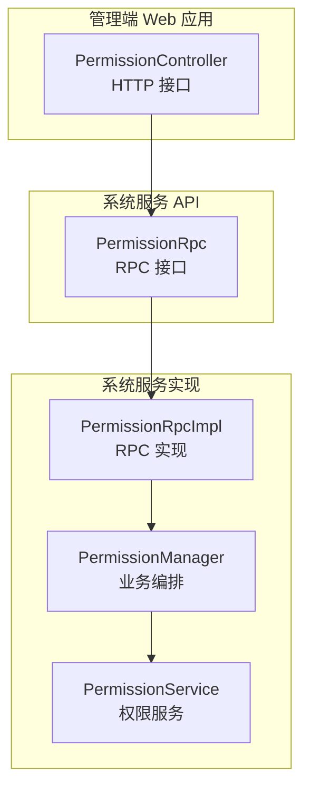
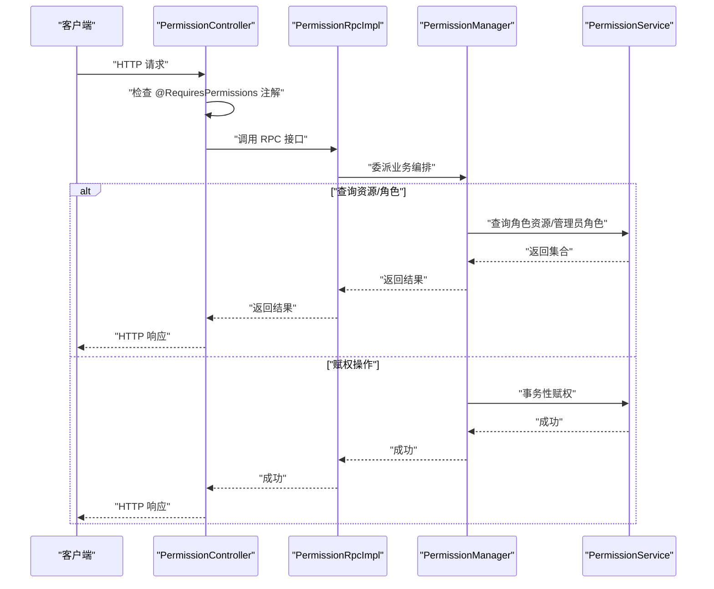
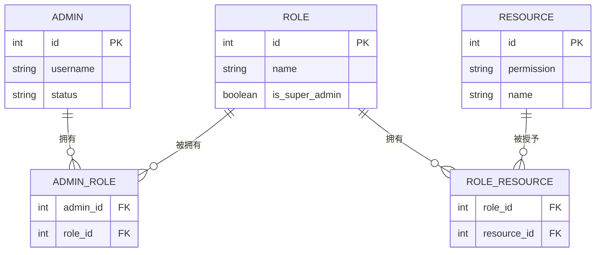
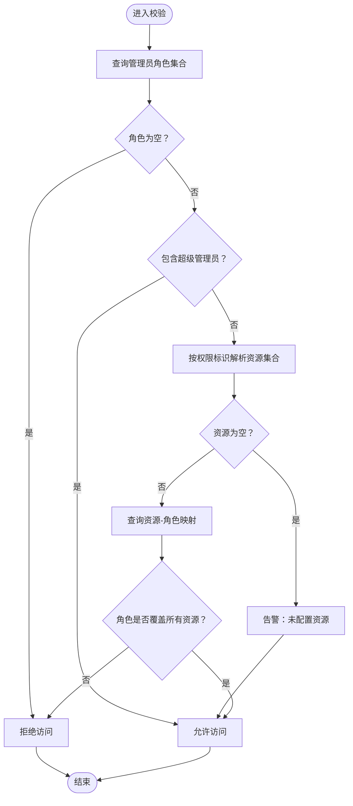
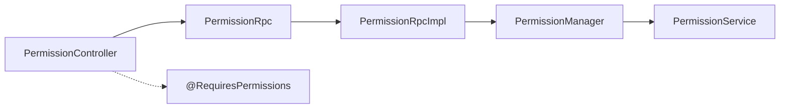

# 权限管理接口

<cite>
**本文引用的文件**
- [PermissionController.java](file://management-web-app/src/main/java/cn/iocoder/mall/managementweb/controller/permission/PermissionController.java)
- [PermissionAssignAdminRoleDTO.java（管理端）](file://management-web-app/src/main/java/cn/iocoder/mall/managementweb/controller/permission/dto/PermissionAssignAdminRoleDTO.java)
- [PermissionAssignRoleResourceDTO（管理端）](file://management-web-app/src/main/java/cn/iocoder/mall/managementweb/controller/permission/dto/PermissionAssignRoleResourceDTO.java)
- [PermissionRpc.java](file://system-service-project/system-service-api/src/main/java/cn/iocoder/mall/systemservice/rpc/permission/PermissionRpc.java)
- [PermissionRpcImpl.java](file://system-service-project/system-service-app/src/main/java/cn/iocoder/mall/systemservice/rpc/permission/PermissionRpcImpl.java)
- [PermissionManager.java](file://system-service-project/system-service-app/src/main/java/cn/iocoder/mall/systemservice/manager/permission/PermissionManager.java)
- [PermissionService.java](file://system-service-project/system-service-app/src/main/java/cn/iocoder/mall/systemservice/service/permission/PermissionService.java)
- [RequiresPermissions.java](file://common/mall-security-annotations/src/main/java/cn/iocoder/security/annotations/RequiresPermissions.java)
</cite>

## 目录
1. [简介](#简介)
2. [项目结构](#项目结构)
3. [核心组件](#核心组件)
4. [架构总览](#架构总览)
5. [详细组件分析](#详细组件分析)
6. [依赖分析](#依赖分析)
7. [性能考虑](#性能考虑)
8. [故障排查指南](#故障排查指南)
9. [结论](#结论)
10. [附录](#附录)

## 简介
本文件面向权限管理接口模块，系统性梳理 RBAC 权限模型下的“角色-资源-管理员”三元关系，覆盖权限动态分配、资源管理、角色绑定、动态权限校验与拦截等能力。文档提供每个接口的完整规范（HTTP 方法、URL、请求参数、响应格式），并给出 RBAC 模型说明、资源树形结构、权限继承关系、动态权限验证机制、安全机制、缓存策略、性能优化建议、测试与安全审计方法。

## 项目结构
权限管理相关代码主要分布在以下位置：
- 管理端 Web 控制器层：提供对外 HTTP 接口，负责参数接收与鉴权注解标注
- RPC 接口与实现：定义权限服务契约并由系统服务侧实现
- 管理器与服务层：封装业务逻辑，执行角色-资源与管理员-角色的赋权、查询与校验
- 安全注解：在控制器方法上声明所需权限标识，驱动统一鉴权拦截

图表来源
- [PermissionController.java:1-67](file://management-web-app/src/main/java/cn/iocoder/mall/managementweb/controller/permission/PermissionController.java#L1-L67)
- [PermissionRpc.java:1-69](file://system-service-project/system-service-api/src/main/java/cn/iocoder/mall/systemservice/rpc/permission/PermissionRpc.java#L1-L69)
- [PermissionRpcImpl.java:1-60](file://system-service-project/system-service-app/src/main/java/cn/iocoder/mall/systemservice/rpc/permission/PermissionRpcImpl.java#L1-L60)
- [PermissionManager.java:1-112](file://system-service-project/system-service-app/src/main/java/cn/iocoder/mall/systemservice/manager/permission/PermissionManager.java#L1-L112)
- [PermissionService.java:1-167](file://system-service-project/system-service-app/src/main/java/cn/iocoder/mall/systemservice/service/permission/PermissionService.java#L1-L167)

章节来源
- [PermissionController.java:1-67](file://management-web-app/src/main/java/cn/iocoder/mall/managementweb/controller/permission/PermissionController.java#L1-L67)
- [PermissionRpc.java:1-69](file://system-service-project/system-service-api/src/main/java/cn/iocoder/mall/systemservice/rpc/permission/PermissionRpc.java#L1-L69)
- [PermissionRpcImpl.java:1-60](file://system-service-project/system-service-app/src/main/java/cn/iocoder/mall/systemservice/rpc/permission/PermissionRpcImpl.java#L1-L60)
- [PermissionManager.java:1-112](file://system-service-project/system-service-app/src/main/java/cn/iocoder/mall/systemservice/manager/permission/PermissionManager.java#L1-L112)
- [PermissionService.java:1-167](file://system-service-project/system-service-app/src/main/java/cn/iocoder/mall/systemservice/service/permission/PermissionService.java#L1-L167)

## 核心组件
- 控制器层：暴露 HTTP 接口，使用权限注解进行方法级鉴权
- RPC 层：定义权限服务契约，供跨模块调用
- 管理器层：编排角色、资源、管理员之间的关系，处理超管特例与批量映射
- 服务层：持久化与校验，事务性地完成赋权与校验

章节来源
- [PermissionController.java:1-67](file://management-web-app/src/main/java/cn/iocoder/mall/managementweb/controller/permission/PermissionController.java#L1-L67)
- [PermissionRpc.java:1-69](file://system-service-project/system-service-api/src/main/java/cn/iocoder/mall/systemservice/rpc/permission/PermissionRpc.java#L1-L69)
- [PermissionRpcImpl.java:1-60](file://system-service-project/system-service-app/src/main/java/cn/iocoder/mall/systemservice/rpc/permission/PermissionRpcImpl.java#L1-L60)
- [PermissionManager.java:1-112](file://system-service-project/system-service-app/src/main/java/cn/iocoder/mall/systemservice/manager/permission/PermissionManager.java#L1-L112)
- [PermissionService.java:1-167](file://system-service-project/system-service-app/src/main/java/cn/iocoder/mall/systemservice/service/permission/PermissionService.java#L1-L167)

## 架构总览
下图展示从 HTTP 请求到权限校验与赋权的端到端流程：

图表来源
- [PermissionController.java:1-67](file://management-web-app/src/main/java/cn/iocoder/mall/managementweb/controller/permission/PermissionController.java#L1-L67)
- [PermissionRpcImpl.java:1-60](file://system-service-project/system-service-app/src/main/java/cn/iocoder/mall/systemservice/rpc/permission/PermissionRpcImpl.java#L1-L60)
- [PermissionManager.java:1-112](file://system-service-project/system-service-app/src/main/java/cn/iocoder/mall/systemservice/manager/permission/PermissionManager.java#L1-L112)
- [PermissionService.java:1-167](file://system-service-project/system-service-app/src/main/java/cn/iocoder/mall/systemservice/service/permission/PermissionService.java#L1-L167)

## 详细组件分析

### RBAC 权限模型与数据模型
- 角色（Role）：权限的承载者，可被管理员拥有
- 资源（Resource）：菜单/按钮/接口等权限粒度对象，具备权限标识
- 管理员（Admin）：系统使用者，可拥有多个角色
- 关系表：
  - 角色-资源：多对多，用于授予与校验
  - 管理员-角色：多对多，用于授权

说明
- 超级管理员拥有所有资源，绕过普通校验
- 资源通过权限标识与角色建立关联，管理员通过角色间接获得资源

图表来源
- [PermissionService.java:1-167](file://system-service-project/system-service-app/src/main/java/cn/iocoder/mall/systemservice/service/permission/PermissionService.java#L1-L167)
- [PermissionManager.java:1-112](file://system-service-project/system-service-app/src/main/java/cn/iocoder/mall/systemservice/manager/permission/PermissionManager.java#L1-L112)

章节来源
- [PermissionService.java:1-167](file://system-service-project/system-service-app/src/main/java/cn/iocoder/mall/systemservice/service/permission/PermissionService.java#L1-L167)
- [PermissionManager.java:1-112](file://system-service-project/system-service-app/src/main/java/cn/iocoder/mall/systemservice/manager/permission/PermissionManager.java#L1-L112)

### 接口规范

#### 1) 获得角色拥有的资源编号
- 方法与路径
  - GET /permission/list-role-resources
- 权限标识
  - system:permission:assign-role-resource
- 请求参数
  - roleId: 角色编号（整数，必填）
- 响应体
  - data: 资源编号集合（整数数组）

章节来源
- [PermissionController.java:34-40](file://management-web-app/src/main/java/cn/iocoder/mall/managementweb/controller/permission/PermissionController.java#L34-L40)
- [PermissionRpc.java:17-23](file://system-service-project/system-service-api/src/main/java/cn/iocoder/mall/systemservice/rpc/permission/PermissionRpc.java#L17-L23)
- [PermissionRpcImpl.java:26-29](file://system-service-project/system-service-app/src/main/java/cn/iocoder/mall/systemservice/rpc/permission/PermissionRpcImpl.java#L26-L29)
- [PermissionManager.java:42-49](file://system-service-project/system-service-app/src/main/java/cn/iocoder/mall/systemservice/manager/permission/PermissionManager.java#L42-L49)
- [PermissionService.java:52-55](file://system-service-project/system-service-app/src/main/java/cn/iocoder/mall/systemservice/service/permission/PermissionService.java#L52-L55)

#### 2) 赋予角色资源
- 方法与路径
  - POST /permission/assign-role-resource
- 权限标识
  - system:permission:assign-role-resource
- 请求体
  - roleId: 角色编号（整数，必填）
  - resourceIds: 资源编号集合（整数数组，可选）
- 响应体
  - data: true（布尔）

章节来源
- [PermissionController.java:42-48](file://management-web-app/src/main/java/cn/iocoder/mall/managementweb/controller/permission/PermissionController.java#L42-L48)
- [PermissionAssignRoleResourceDTO（管理端）:1-21](file://management-web-app/src/main/java/cn/iocoder/mall/managementweb/controller/permission/dto/PermissionAssignRoleResourceDTO.java#L1-L21)
- [PermissionRpc.java:25-31](file://system-service-project/system-service-api/src/main/java/cn/iocoder/mall/systemservice/rpc/permission/PermissionRpc.java#L25-L31)
- [PermissionRpcImpl.java:31-35](file://system-service-project/system-service-app/src/main/java/cn/iocoder/mall/systemservice/rpc/permission/PermissionRpcImpl.java#L31-L35)
- [PermissionManager.java:56-58](file://system-service-project/system-service-app/src/main/java/cn/iocoder/mall/systemservice/manager/permission/PermissionManager.java#L56-L58)
- [PermissionService.java:63-85](file://system-service-project/system-service-app/src/main/java/cn/iocoder/mall/systemservice/service/permission/PermissionService.java#L63-L85)

#### 3) 获得管理员拥有的角色编号列表
- 方法与路径
  - GET /permission/list-admin-roles
- 权限标识
  - system:permission:assign-admin-role
- 请求参数
  - adminId: 管理员编号（整数，必填）
- 响应体
  - data: 角色编号集合（整数数组）

章节来源
- [PermissionController.java:50-56](file://management-web-app/src/main/java/cn/iocoder/mall/managementweb/controller/permission/PermissionController.java#L50-L56)
- [PermissionRpc.java:33-39](file://system-service-project/system-service-api/src/main/java/cn/iocoder/mall/systemservice/rpc/permission/PermissionRpc.java#L33-L39)
- [PermissionRpcImpl.java:37-40](file://system-service-project/system-service-app/src/main/java/cn/iocoder/mall/systemservice/rpc/permission/PermissionRpcImpl.java#L37-L40)
- [PermissionManager.java:66-68](file://system-service-project/system-service-app/src/main/java/cn/iocoder/mall/systemservice/manager/permission/PermissionManager.java#L66-L68)
- [PermissionService.java:124-127](file://system-service-project/system-service-app/src/main/java/cn/iocoder/mall/systemservice/service/permission/PermissionService.java#L124-L127)

#### 4) 赋予管理员角色
- 方法与路径
  - POST /permission/assign-admin-role
- 权限标识
  - system:permission:assign-admin-role
- 请求体
  - adminId: 管理员编号（整数，必填）
  - roleIds: 角色编号集合（整数数组，可选）
- 响应体
  - data: true（布尔）

章节来源
- [PermissionController.java:58-64](file://management-web-app/src/main/java/cn/iocoder/mall/managementweb/controller/permission/PermissionController.java#L58-L64)
- [PermissionAssignAdminRoleDTO（管理端）:1-21](file://management-web-app/src/main/java/cn/iocoder/mall/managementweb/controller/permission/dto/PermissionAssignAdminRoleDTO.java#L1-L21)
- [PermissionRpc.java:50-56](file://system-service-project/system-service-api/src/main/java/cn/iocoder/mall/systemservice/rpc/permission/PermissionRpc.java#L50-L56)
- [PermissionRpcImpl.java:47-51](file://system-service-project/system-service-app/src/main/java/cn/iocoder/mall/systemservice/rpc/permission/PermissionRpcImpl.java#L47-L51)
- [PermissionManager.java:86-88](file://system-service-project/system-service-app/src/main/java/cn/iocoder/mall/systemservice/manager/permission/PermissionManager.java#L86-L88)
- [PermissionService.java:93-116](file://system-service-project/system-service-app/src/main/java/cn/iocoder/mall/systemservice/service/permission/PermissionService.java#L93-L116)

### 动态权限验证机制
- 校验流程
  - 获取管理员所拥有的角色集合
  - 若为空则直接拒绝
  - 若包含超级管理员角色则放行
  - 否则根据权限标识解析为资源集合，再反查角色-资源映射，判断管理员角色是否覆盖所有权限对应的资源
- 超级管理员特例
  - 超级管理员角色拥有所有资源，无需逐项校验

图表来源
- [PermissionManager.java:97-109](file://system-service-project/system-service-app/src/main/java/cn/iocoder/mall/systemservice/manager/permission/PermissionManager.java#L97-L109)
- [PermissionService.java:144-164](file://system-service-project/system-service-app/src/main/java/cn/iocoder/mall/systemservice/service/permission/PermissionService.java#L144-L164)

章节来源
- [PermissionManager.java:97-109](file://system-service-project/system-service-app/src/main/java/cn/iocoder/mall/systemservice/manager/permission/PermissionManager.java#L97-L109)
- [PermissionService.java:144-164](file://system-service-project/system-service-app/src/main/java/cn/iocoder/mall/systemservice/service/permission/PermissionService.java#L144-L164)

### 资源树形结构与权限继承
- 资源树形结构
  - 资源通常以菜单/页面/按钮/接口等维度组织，形成父子层级
  - 在权限系统中，资源通过“权限标识”与“资源编号”关联，角色通过角色-资源关系获得访问能力
- 权限继承
  - 角色之间不存在显式继承；权限继承通过“角色-资源”的组合体现
  - 超级管理员角色可视为“全局通配”，拥有所有资源

说明
- 本仓库未提供资源树形结构的直接实现细节，但通过“权限标识→资源→角色→管理员”的链路实现权限控制

章节来源
- [PermissionService.java:144-164](file://system-service-project/system-service-app/src/main/java/cn/iocoder/mall/systemservice/service/permission/PermissionService.java#L144-L164)
- [PermissionManager.java:42-49](file://system-service-project/system-service-app/src/main/java/cn/iocoder/mall/systemservice/manager/permission/PermissionManager.java#L42-L49)

### 安全机制
- 方法级权限注解
  - 在控制器方法上使用权限注解声明所需权限标识，拦截器在请求到达前进行鉴权
- 统一异常处理
  - 无权限或校验失败时抛出统一异常，返回受限状态码
- 超级管理员豁免
  - 超级管理员角色可绕过常规校验

章节来源
- [RequiresPermissions.java:1-25](file://common/mall-security-annotations/src/main/java/cn/iocoder/security/annotations/RequiresPermissions.java#L1-L25)
- [PermissionController.java:1-67](file://management-web-app/src/main/java/cn/iocoder/mall/managementweb/controller/permission/PermissionController.java#L1-L67)
- [PermissionManager.java:97-109](file://system-service-project/system-service-app/src/main/java/cn/iocoder/mall/systemservice/manager/permission/PermissionManager.java#L97-L109)
- [PermissionService.java:144-164](file://system-service-project/system-service-app/src/main/java/cn/iocoder/mall/systemservice/service/permission/PermissionService.java#L144-L164)

### 权限缓存策略
- 缓存目标
  - 角色-资源映射、管理员-角色映射、资源-权限标识映射
- 缓存策略建议
  - 写入时采用“先写数据库，后失效缓存”
  - 读取时优先命中缓存，未命中回源数据库并回填缓存
  - 对高频查询（如管理员当前权限集合）可增加本地缓存
- 注意事项
  - 超级管理员权限需特殊处理，避免缓存命中导致权限泄露
  - 批量查询（管理员集合）可使用批量缓存键

说明
- 本节为通用优化建议，具体实现需结合系统缓存组件与业务场景

### 性能优化方案
- 数据库层面
  - 为角色-资源、管理员-角色、资源-权限标识建立必要索引
  - 批量插入与删除时使用批处理
- 服务层面
  - 对批量查询（如 mapAdminRoleIds）使用一次性查询与聚合
  - 将权限校验逻辑中的多次查询合并为一次或少量查询
- 缓存层面
  - 引入本地缓存与分布式缓存，降低热点数据访问延迟
  - 对只读数据（资源树、权限标识）进行长时效缓存

说明
- 本节为通用优化建议，具体实现需结合系统缓存组件与业务场景

## 依赖分析
- 控制器依赖 RPC 接口，RPC 实现依赖管理器，管理器依赖服务层
- 权限注解驱动拦截器在控制器方法执行前进行鉴权
- 服务层依赖多个 Mapper 进行数据持久化

图表来源
- [PermissionController.java:1-67](file://management-web-app/src/main/java/cn/iocoder/mall/managementweb/controller/permission/PermissionController.java#L1-L67)
- [PermissionRpc.java:1-69](file://system-service-project/system-service-api/src/main/java/cn/iocoder/mall/systemservice/rpc/permission/PermissionRpc.java#L1-L69)
- [PermissionRpcImpl.java:1-60](file://system-service-project/system-service-app/src/main/java/cn/iocoder/mall/systemservice/rpc/permission/PermissionRpcImpl.java#L1-L60)
- [PermissionManager.java:1-112](file://system-service-project/system-service-app/src/main/java/cn/iocoder/mall/systemservice/manager/permission/PermissionManager.java#L1-L112)
- [PermissionService.java:1-167](file://system-service-project/system-service-app/src/main/java/cn/iocoder/mall/systemservice/service/permission/PermissionService.java#L1-L167)
- [RequiresPermissions.java:1-25](file://common/mall-security-annotations/src/main/java/cn/iocoder/security/annotations/RequiresPermissions.java#L1-L25)

章节来源
- [PermissionController.java:1-67](file://management-web-app/src/main/java/cn/iocoder/mall/managementweb/controller/permission/PermissionController.java#L1-L67)
- [PermissionRpcImpl.java:1-60](file://system-service-project/system-service-app/src/main/java/cn/iocoder/mall/systemservice/rpc/permission/PermissionRpcImpl.java#L1-L60)
- [PermissionManager.java:1-112](file://system-service-project/system-service-app/src/main/java/cn/iocoder/mall/systemservice/manager/permission/PermissionManager.java#L1-L112)
- [PermissionService.java:1-167](file://system-service-project/system-service-app/src/main/java/cn/iocoder/mall/systemservice/service/permission/PermissionService.java#L1-L167)
- [RequiresPermissions.java:1-25](file://common/mall-security-annotations/src/main/java/cn/iocoder/security/annotations/RequiresPermissions.java#L1-L25)

## 性能考虑
- 批量查询与映射
  - 使用 mapAdminRoleIds 一次性返回管理员-角色映射，减少多次往返
- 事务边界
  - 赋权操作使用事务保证一致性，避免部分更新导致的数据不一致
- 缓存与索引
  - 对高频查询建立缓存与索引，降低数据库压力
- 超级管理员特例
  - 超级管理员直接放行，避免额外查询

说明
- 本节为通用指导，具体实现需结合系统缓存与数据库配置

## 故障排查指南
- 常见错误与定位
  - 角色不存在：赋权角色资源时报错，检查角色 ID 是否正确
  - 资源不存在：赋权角色资源时报错，检查资源 ID 是否存在且类型匹配
  - 管理员不存在：赋权管理员角色时报错，检查管理员 ID 是否存在
  - 无权限访问：校验失败抛出受限异常，确认管理员角色是否包含超级管理员或是否已授予相应资源
- 日志与告警
  - 未配置资源的权限标识会输出告警日志，需补充资源映射
- 测试建议
  - 单元测试：针对权限校验、赋权流程、批量查询进行覆盖
  - 集成测试：模拟管理员登录、角色变更、资源变更后的权限生效情况

章节来源
- [PermissionService.java:63-116](file://system-service-project/system-service-app/src/main/java/cn/iocoder/mall/systemservice/service/permission/PermissionService.java#L63-L116)
- [PermissionManager.java:97-109](file://system-service-project/system-service-app/src/main/java/cn/iocoder/mall/systemservice/manager/permission/PermissionManager.java#L97-L109)

## 结论
本权限管理接口模块基于 RBAC 模型，围绕“角色-资源-管理员”三元关系实现了动态权限分配、资源管理与角色绑定，并通过注解驱动的鉴权拦截与统一异常处理保障了安全性与一致性。通过合理的缓存与索引策略、事务边界控制与批量查询优化，可在保证正确性的前提下提升整体性能。建议在生产环境中完善缓存失效策略、监控告警与安全审计，确保权限系统的稳定与可靠。

## 附录

### 示例：权限管理操作清单
- 用户权限分配
  - 步骤：为管理员分配角色 → 为角色分配资源 → 校验权限标识是否生效
  - 关联接口：赋予管理员角色、赋予角色资源、动态权限校验
- 角色权限配置
  - 步骤：新增/编辑角色 → 分配资源 → 批量下发给管理员
  - 关联接口：赋予管理员角色、赋予角色资源
- 资源访问控制
  - 步骤：维护资源树与权限标识 → 角色授权 → 管理员登录后按权限访问
  - 关联接口：获得角色拥有的资源编号、获得管理员拥有的角色编号列表

说明
- 以上为操作流程示例，具体实现需结合业务与资源树形结构