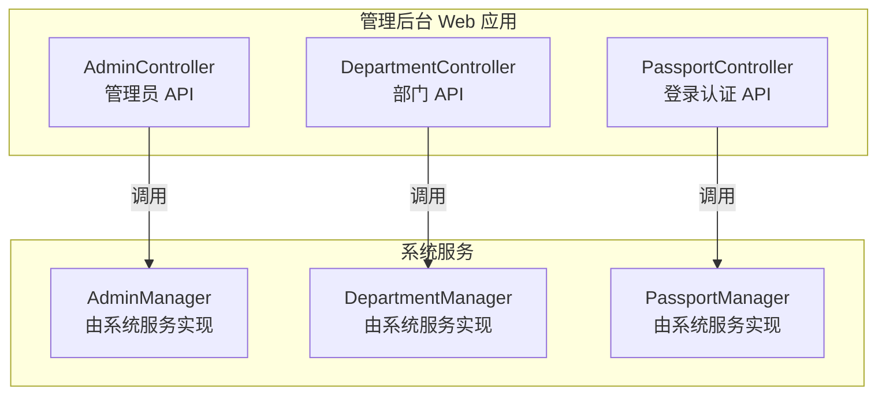
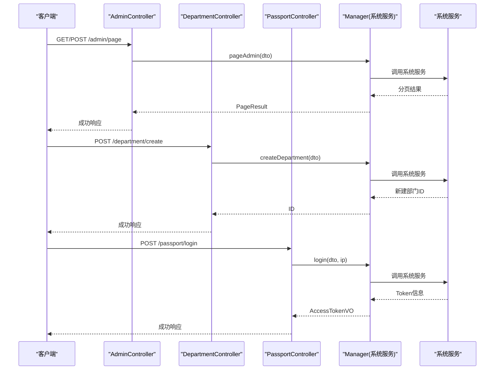
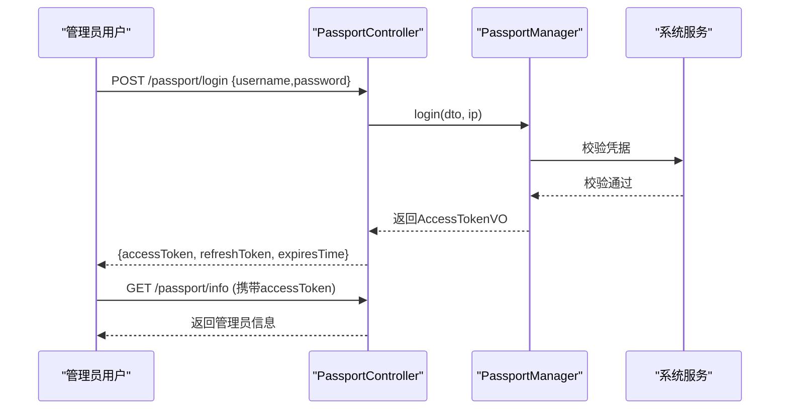
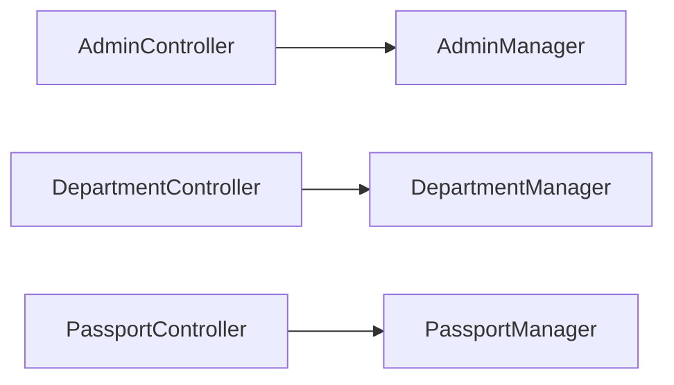

# 管理员接口

<cite>
**本文引用的文件**
- [AdminController.java](file://management-web-app/src/main/java/cn/iocoder/mall/managementweb/controller/admin/AdminController.java)
- [AdminCreateDTO.java](file://management-web-app/src/main/java/cn/iocoder/mall/managementweb/controller/admin/dto/AdminCreateDTO.java)
- [AdminUpdateInfoDTO.java](file://management-web-app/src/main/java/cn/iocoder/mall/managementweb/controller/admin/dto/AdminUpdateInfoDTO.java)
- [AdminUpdateStatusDTO.java](file://management-web-app/src/main/java/cn/iocoder/mall/managementweb/controller/admin/dto/AdminUpdateStatusDTO.java)
- [AdminPageDTO.java](file://management-web-app/src/main/java/cn/iocoder/mall/managementweb/controller/admin/dto/AdminPageDTO.java)
- [AdminPageItemVO.java](file://management-web-app/src/main/java/cn/iocoder/mall/managementweb/controller/admin/vo/AdminPageItemVO.java)
- [DepartmentController.java](file://management-web-app/src/main/java/cn/iocoder/mall/managementweb/controller/admin/DepartmentController.java)
- [DepartmentCreateDTO.java](file://management-web-app/src/main/java/cn/iocoder/mall/managementweb/controller/admin/dto/DepartmentCreateDTO.java)
- [DepartmentUpdateDTO.java](file://management-web-app/src/main/java/cn/iocoder/mall/managementweb/controller/admin/dto/DepartmentUpdateDTO.java)
- [DepartmentVO.java](file://management-web-app/src/main/java/cn/iocoder/mall/managementweb/controller/admin/vo/DepartmentVO.java)
- [DepartmentTreeNodeVO.java](file://management-web-app/src/main/java/cn/iocoder/mall/managementweb/controller/admin/vo/DepartmentTreeNodeVO.java)
- [PassportController.java](file://management-web-app/src/main/java/cn/iocoder/mall/managementweb/controller/passport/PassportController.java)
- [PassportLoginDTO.java](file://management-web-app/src/main/java/cn/iocoder/mall/managementweb/controller/passport/dto/PassportLoginDTO.java)
- [PassportAccessTokenVO.java](file://management-web-app/src/main/java/cn/iocoder/mall/managementweb/controller/passport/vo/PassportAccessTokenVO.java)
- [PassportAdminVO.java](file://management-web-app/src/main/java/cn/iocoder/mall/managementweb/controller/passport/vo/PassportAdminVO.java)
- [PassportAdminMenuTreeNodeVO.java](file://management-web-app/src/main/java/cn/iocoder/mall/managementweb/controller/passport/vo/PassportAdminMenuTreeNodeVO.java)
</cite>

## 目录
1. [简介](#简介)
2. [项目结构](#项目结构)
3. [核心组件](#核心组件)
4. [架构总览](#架构总览)
5. [详细组件分析](#详细组件分析)
6. [依赖分析](#依赖分析)
7. [性能考虑](#性能考虑)
8. [故障排查指南](#故障排查指南)
9. [结论](#结论)
10. [附录](#附录)

## 简介
本文件为“管理员接口”模块的完整API文档，覆盖以下能力：
- 管理员管理：分页查询、创建、更新信息、更新状态（启用/停用）
- 部门管理：创建、更新、删除、单个/批量查询、部门树形结构查询
- 登录认证：账号密码登录、刷新Token、获取当前管理员信息、获取菜单树与权限列表

文档包含每个接口的HTTP方法、URL路径、请求参数、响应格式、权限要求、参数校验规则、业务约束、请求/响应示例（以路径代替）、Token认证流程与权限控制机制说明，并提供接口测试方法与常见问题排查建议。

## 项目结构
管理后台Web应用通过REST控制器对外暴露管理端API，主要模块如下：
- 管理员控制器：提供管理员的增删改查与分页查询
- 部门控制器：提供部门的增删改查与树形结构查询
- Passport控制器：提供登录、Token刷新、当前管理员信息、菜单树与权限列表

图表来源
- [AdminController.java:32-67](file://management-web-app/src/main/java/cn/iocoder/mall/managementweb/controller/admin/AdminController.java#L32-L67)
- [DepartmentController.java:29-81](file://management-web-app/src/main/java/cn/iocoder/mall/managementweb/controller/admin/DepartmentController.java#L29-L81)
- [PassportController.java:26-67](file://management-web-app/src/main/java/cn/iocoder/mall/managementweb/controller/passport/PassportController.java#L26-L67)

章节来源
- [AdminController.java:28-67](file://management-web-app/src/main/java/cn/iocoder/mall/managementweb/controller/admin/AdminController.java#L28-L67)
- [DepartmentController.java:25-81](file://management-web-app/src/main/java/cn/iocoder/mall/managementweb/controller/admin/DepartmentController.java#L25-L81)
- [PassportController.java:23-67](file://management-web-app/src/main/java/cn/iocoder/mall/managementweb/controller/passport/PassportController.java#L23-L67)

## 核心组件
- 管理员控制器：提供管理员分页、创建、更新信息、更新状态等接口
- 部门控制器：提供部门创建、更新、删除、查询、树形结构查询等接口
- Passport控制器：提供登录、刷新Token、获取当前管理员信息、菜单树与权限列表接口

章节来源
- [AdminController.java:37-65](file://management-web-app/src/main/java/cn/iocoder/mall/managementweb/controller/admin/AdminController.java#L37-L65)
- [DepartmentController.java:34-79](file://management-web-app/src/main/java/cn/iocoder/mall/managementweb/controller/admin/DepartmentController.java#L34-L79)
- [PassportController.java:31-65](file://management-web-app/src/main/java/cn/iocoder/mall/managementweb/controller/passport/PassportController.java#L31-L65)

## 架构总览
下图展示管理员接口模块的典型调用链：客户端请求经控制器处理后，调用对应的Manager（由系统服务实现），最终返回统一结果包装。

图表来源
- [AdminController.java:37-65](file://management-web-app/src/main/java/cn/iocoder/mall/managementweb/controller/admin/AdminController.java#L37-L65)
- [DepartmentController.java:34-79](file://management-web-app/src/main/java/cn/iocoder/mall/managementweb/controller/admin/DepartmentController.java#L34-L79)
- [PassportController.java:31-51](file://management-web-app/src/main/java/cn/iocoder/mall/managementweb/controller/passport/PassportController.java#L31-L51)

## 详细组件分析

### 管理员管理 API

- 接口概览
  - 管理员分页：GET /admin/page
  - 创建管理员：POST /admin/create
  - 更新管理员信息：POST /admin/update
  - 更新管理员状态：POST /admin/update-status

- 权限要求
  - 管理员分页：需要权限 system:admin:page
  - 创建管理员：需要权限 system:admin:create
  - 更新管理员信息：需要权限 system:admin:update
  - 更新管理员状态：需要权限 system:admin:update-status

- 请求参数与响应格式

  1) 管理员分页
  - 方法与路径：GET /admin/page
  - 认证：需要已登录（携带有效Token）
  - 权限：system:admin:page
  - 查询参数（继承分页参数 PageParam，详见 AdminPageDTO）：
    - name：真实姓名，模糊匹配
    - departmentId：部门编号
  - 响应体：分页结果对象，包含管理员列表项 AdminPageItemVO
  - 示例请求/响应（以路径代替内容）：
    - 请求示例：[AdminPageDTO.java:14-22](file://management-web-app/src/main/java/cn/iocoder/mall/managementweb/controller/admin/dto/AdminPageDTO.java#L14-L22)
    - 成功响应示例：[AdminPageItemVO.java:14-62](file://management-web-app/src/main/java/cn/iocoder/mall/managementweb/controller/admin/vo/AdminPageItemVO.java#L14-L62)

  2) 创建管理员
  - 方法与路径：POST /admin/create
  - 认证：需要已登录（携带有效Token）
  - 权限：system:admin:create
  - 请求体：AdminCreateDTO
    - name：真实姓名，必填，长度限制
    - departmentId：部门编号，必填
    - username：登录账号，必填，长度与格式校验
    - password：密码，必填，长度限制
  - 响应体：新增管理员ID
  - 示例请求/响应：
    - 请求示例：[AdminCreateDTO.java:16-38](file://management-web-app/src/main/java/cn/iocoder/mall/managementweb/controller/admin/dto/AdminCreateDTO.java#L16-L38)
    - 成功响应示例：返回整数ID

  3) 更新管理员信息
  - 方法与路径：POST /admin/update
  - 认证：需要已登录（携带有效Token）
  - 权限：system:admin:update
  - 请求体：AdminUpdateInfoDTO
    - id：管理员编号，必填
    - username：登录账号，必填，长度与格式校验
    - password：密码，必填，长度限制
    - name：真实姓名，必填，长度限制
    - departmentId：部门编号，必填
  - 响应体：布尔值 true
  - 示例请求/响应：
    - 请求示例：[AdminUpdateInfoDTO.java:16-42](file://management-web-app/src/main/java/cn/iocoder/mall/managementweb/controller/admin/dto/AdminUpdateInfoDTO.java#L16-L42)
    - 成功响应示例：true

  4) 更新管理员状态
  - 方法与路径：POST /admin/update-status
  - 认证：需要已登录（携带有效Token）
  - 权限：system:admin:update-status
  - 请求体：AdminUpdateStatusDTO
    - adminId：管理员编号，必填
    - status：状态，必填，取值需符合通用状态枚举
  - 响应体：布尔值 true
  - 示例请求/响应：
    - 请求示例：[AdminUpdateStatusDTO.java:15-26](file://management-web-app/src/main/java/cn/iocoder/mall/managementweb/controller/admin/dto/AdminUpdateStatusDTO.java#L15-L26)
    - 成功响应示例：true

- 参数校验规则
  - 字段非空、长度范围、格式正则、枚举取值均在对应DTO中定义
  - 分页参数 PageParam 由系统框架提供

- 业务逻辑约束
  - 创建/更新管理员时，账号与姓名长度、格式有严格限制
  - 更新状态必须使用系统通用状态枚举的有效值

- 请求/响应示例（以路径代替）
  - 管理员分页：[AdminPageDTO.java:14-22](file://management-web-app/src/main/java/cn/iocoder/mall/managementweb/controller/admin/dto/AdminPageDTO.java#L14-L22)，[AdminPageItemVO.java:14-62](file://management-web-app/src/main/java/cn/iocoder/mall/managementweb/controller/admin/vo/AdminPageItemVO.java#L14-L62)
  - 创建管理员：[AdminCreateDTO.java:16-38](file://management-web-app/src/main/java/cn/iocoder/mall/managementweb/controller/admin/dto/AdminCreateDTO.java#L16-L38)
  - 更新管理员信息：[AdminUpdateInfoDTO.java:16-42](file://management-web-app/src/main/java/cn/iocoder/mall/managementweb/controller/admin/dto/AdminUpdateInfoDTO.java#L16-L42)
  - 更新管理员状态：[AdminUpdateStatusDTO.java:15-26](file://management-web-app/src/main/java/cn/iocoder/mall/managementweb/controller/admin/dto/AdminUpdateStatusDTO.java#L15-L26)

章节来源
- [AdminController.java:37-65](file://management-web-app/src/main/java/cn/iocoder/mall/managementweb/controller/admin/AdminController.java#L37-L65)
- [AdminPageDTO.java:14-22](file://management-web-app/src/main/java/cn/iocoder/mall/managementweb/controller/admin/dto/AdminPageDTO.java#L14-L22)
- [AdminCreateDTO.java:16-38](file://management-web-app/src/main/java/cn/iocoder/mall/managementweb/controller/admin/dto/AdminCreateDTO.java#L16-L38)
- [AdminUpdateInfoDTO.java:16-42](file://management-web-app/src/main/java/cn/iocoder/mall/managementweb/controller/admin/dto/AdminUpdateInfoDTO.java#L16-L42)
- [AdminUpdateStatusDTO.java:15-26](file://management-web-app/src/main/java/cn/iocoder/mall/managementweb/controller/admin/dto/AdminUpdateStatusDTO.java#L15-L26)
- [AdminPageItemVO.java:14-62](file://management-web-app/src/main/java/cn/iocoder/mall/managementweb/controller/admin/vo/AdminPageItemVO.java#L14-L62)

### 部门管理 API

- 接口概览
  - 创建部门：POST /department/create
  - 更新部门：POST /department/update
  - 删除部门：POST /department/delete
  - 获取部门：GET /department/get
  - 列表部门：GET /department/list
  - 部门树：GET /department/tree

- 权限要求
  - 创建/更新/删除/查询/树形查询均需相应权限前缀 system:department:*

- 请求参数与响应格式

  1) 创建部门
  - 方法与路径：POST /department/create
  - 权限：system:department:create
  - 请求体：DepartmentCreateDTO
    - name：部门名称，必填
    - sort：排序字段，必填
    - pid：父级部门编号，必填
  - 响应体：新建部门ID
  - 示例请求/响应：
    - 请求示例：[DepartmentCreateDTO.java:12-24](file://management-web-app/src/main/java/cn/iocoder/mall/managementweb/controller/admin/dto/DepartmentCreateDTO.java#L12-L24)
    - 成功响应示例：返回整数ID

  2) 更新部门
  - 方法与路径：POST /department/update
  - 权限：system:department:update
  - 请求体：DepartmentUpdateDTO
    - id：部门编号，必填
    - name：部门名称，必填
    - sort：排序字段，必填
    - pid：父级部门编号，必填
  - 响应体：布尔值 true
  - 示例请求/响应：
    - 请求示例：[DepartmentUpdateDTO.java:12-27](file://management-web-app/src/main/java/cn/iocoder/mall/managementweb/controller/admin/dto/DepartmentUpdateDTO.java#L12-L27)
    - 成功响应示例：true

  3) 删除部门
  - 方法与路径：POST /department/delete
  - 权限：system:department:delete
  - 查询参数：departmentId（部门编号，必填）
  - 响应体：布尔值 true
  - 示例请求/响应：
    - 请求示例：[DepartmentController.java:49-56](file://management-web-app/src/main/java/cn/iocoder/mall/managementweb/controller/admin/DepartmentController.java#L49-L56)
    - 成功响应示例：true

  4) 获取部门
  - 方法与路径：GET /department/get
  - 权限：system:department:tree
  - 查询参数：departmentId（部门编号，必填）
  - 响应体：DepartmentVO
  - 示例请求/响应：
    - 请求示例：[DepartmentController.java:58-64](file://management-web-app/src/main/java/cn/iocoder/mall/managementweb/controller/admin/DepartmentController.java#L58-L64)
    - 成功响应示例：[DepartmentVO.java:9-22](file://management-web-app/src/main/java/cn/iocoder/mall/managementweb/controller/admin/vo/DepartmentVO.java#L9-L22)

  5) 列表部门
  - 方法与路径：GET /department/list
  - 权限：system:department:tree
  - 查询参数：departmentIds（部门编号列表，必填）
  - 响应体：DepartmentVO 列表
  - 示例请求/响应：
    - 请求示例：[DepartmentController.java:66-72](file://management-web-app/src/main/java/cn/iocoder/mall/managementweb/controller/admin/DepartmentController.java#L66-L72)
    - 成功响应示例：[DepartmentVO.java:9-22](file://management-web-app/src/main/java/cn/iocoder/mall/managementweb/controller/admin/vo/DepartmentVO.java#L9-L22)

  6) 部门树
  - 方法与路径：GET /department/tree
  - 权限：system:department:tree
  - 查询参数：无
  - 响应体：DepartmentTreeNodeVO 列表（树形结构）
  - 示例请求/响应：
    - 请求示例：[DepartmentController.java:74-79](file://management-web-app/src/main/java/cn/iocoder/mall/managementweb/controller/admin/DepartmentController.java#L74-L79)
    - 成功响应示例：[DepartmentTreeNodeVO.java:12-30](file://management-web-app/src/main/java/cn/iocoder/mall/managementweb/controller/admin/vo/DepartmentTreeNodeVO.java#L12-L30)

- 参数校验规则
  - 所有必填字段均在DTO中声明
  - DepartmentVO/TreeNodeVO 包含标准字段与children子节点

- 业务逻辑约束
  - 树形查询返回带层级的部门结构，支持父子关系与排序字段

- 请求/响应示例（以路径代替）
  - 创建/更新/删除/查询/树形查询均参考上述对应DTO与VO文件

章节来源
- [DepartmentController.java:34-79](file://management-web-app/src/main/java/cn/iocoder/mall/managementweb/controller/admin/DepartmentController.java#L34-L79)
- [DepartmentCreateDTO.java:12-24](file://management-web-app/src/main/java/cn/iocoder/mall/managementweb/controller/admin/dto/DepartmentCreateDTO.java#L12-L24)
- [DepartmentUpdateDTO.java:12-27](file://management-web-app/src/main/java/cn/iocoder/mall/managementweb/controller/admin/dto/DepartmentUpdateDTO.java#L12-L27)
- [DepartmentVO.java:9-22](file://management-web-app/src/main/java/cn/iocoder/mall/managementweb/controller/admin/vo/DepartmentVO.java#L9-L22)
- [DepartmentTreeNodeVO.java:12-30](file://management-web-app/src/main/java/cn/iocoder/mall/managementweb/controller/admin/vo/DepartmentTreeNodeVO.java#L12-L30)

### 登录认证 API

- 接口概览
  - 账号密码登录：POST /passport/login
  - 刷新Token：POST /passport/refresh-token
  - 获取当前管理员信息：GET /passport/info
  - 获取当前管理员菜单树：GET /passport/tree-admin-menu
  - 获取当前管理员权限列表：GET /passport/list-admin-permission

- 权限要求
  - 登录与刷新Token：无需登录（匿名）
  - 其他接口：需要已登录（携带有效Token）

- 请求参数与响应格式

  1) 账号密码登录
  - 方法与路径：POST /passport/login
  - 权限：匿名
  - 请求体：PassportLoginDTO
    - username：用户名，必填，长度与格式校验
    - password：密码，必填，长度限制
  - 响应体：PassportAccessTokenVO（包含accessToken、refreshToken、expiresTime）
  - 示例请求/响应：
    - 请求示例：[PassportLoginDTO.java:16-29](file://management-web-app/src/main/java/cn/iocoder/mall/managementweb/controller/passport/dto/PassportLoginDTO.java#L16-L29)
    - 成功响应示例：[PassportAccessTokenVO.java:13-22](file://management-web-app/src/main/java/cn/iocoder/mall/managementweb/controller/passport/vo/PassportAccessTokenVO.java#L13-L22)

  2) 刷新Token
  - 方法与路径：POST /passport/refresh-token
  - 权限：匿名
  - 查询参数：refreshToken（刷新令牌，必填）
  - 响应体：新的 PassportAccessTokenVO
  - 示例请求/响应：
    - 请求示例：[PassportController.java:45-51](file://management-web-app/src/main/java/cn/iocoder/mall/managementweb/controller/passport/PassportController.java#L45-L51)
    - 成功响应示例：[PassportAccessTokenVO.java:13-22](file://management-web-app/src/main/java/cn/iocoder/mall/managementweb/controller/passport/vo/PassportAccessTokenVO.java#L13-L22)

  3) 获取当前管理员信息
  - 方法与路径：GET /passport/info
  - 权限：需要已登录
  - 查询参数：无
  - 响应体：PassportAdminVO（name、avatar）
  - 示例请求/响应：
    - 成功响应示例：[PassportAdminVO.java:11-18](file://management-web-app/src/main/java/cn/iocoder/mall/managementweb/controller/passport/vo/PassportAdminVO.java#L11-L18)

  4) 获取当前管理员菜单树
  - 方法与路径：GET /passport/tree-admin-menu
  - 权限：需要已登录
  - 查询参数：无
  - 响应体：PassportAdminMenuTreeNodeVO 列表（树形结构）
  - 示例请求/响应：
    - 成功响应示例：[PassportAdminMenuTreeNodeVO.java:13-33](file://management-web-app/src/main/java/cn/iocoder/mall/managementweb/controller/passport/vo/PassportAdminMenuTreeNodeVO.java#L13-L33)

  5) 获取当前管理员权限列表
  - 方法与路径：GET /passport/list-admin-permission
  - 权限：需要已登录
  - 查询参数：无
  - 响应体：字符串集合（权限标识）
  - 示例请求/响应：
    - 成功响应示例：返回字符串集合

- 参数校验规则
  - 用户名与密码长度、格式在DTO中定义
  - Token刷新接口仅接收refreshToken参数

- 业务逻辑约束
  - 登录成功后返回访问令牌与刷新令牌，需在后续请求中携带访问令牌
  - 菜单树与权限列表基于当前管理员的授权动态生成

- 请求/响应示例（以路径代替）
  - 登录与刷新Token：[PassportLoginDTO.java:16-29](file://management-web-app/src/main/java/cn/iocoder/mall/managementweb/controller/passport/dto/PassportLoginDTO.java#L16-L29)，[PassportAccessTokenVO.java:13-22](file://management-web-app/src/main/java/cn/iocoder/mall/managementweb/controller/passport/vo/PassportAccessTokenVO.java#L13-L22)
  - 当前管理员信息：[PassportAdminVO.java:11-18](file://management-web-app/src/main/java/cn/iocoder/mall/managementweb/controller/passport/vo/PassportAdminVO.java#L11-L18)
  - 菜单树与权限列表：[PassportAdminMenuTreeNodeVO.java:13-33](file://management-web-app/src/main/java/cn/iocoder/mall/managementweb/controller/passport/vo/PassportAdminMenuTreeNodeVO.java#L13-L33)

章节来源
- [PassportController.java:31-65](file://management-web-app/src/main/java/cn/iocoder/mall/managementweb/controller/passport/PassportController.java#L31-L65)
- [PassportLoginDTO.java:16-29](file://management-web-app/src/main/java/cn/iocoder/mall/managementweb/controller/passport/dto/PassportLoginDTO.java#L16-L29)
- [PassportAccessTokenVO.java:13-22](file://management-web-app/src/main/java/cn/iocoder/mall/managementweb/controller/passport/vo/PassportAccessTokenVO.java#L13-L22)
- [PassportAdminVO.java:11-18](file://management-web-app/src/main/java/cn/iocoder/mall/managementweb/controller/passport/vo/PassportAdminVO.java#L11-L18)
- [PassportAdminMenuTreeNodeVO.java:13-33](file://management-web-app/src/main/java/cn/iocoder/mall/managementweb/controller/passport/vo/PassportAdminMenuTreeNodeVO.java#L13-L33)

### 权限控制与Token认证流程

- 权限注解
  - 控制器方法上使用注解标注所需权限，如 system:admin:*、system:department:*、RequiresNone 等
  - 未满足权限将被拦截，返回统一错误结果

- Token认证流程
  - 登录：提交用户名与密码，系统验证通过后返回访问令牌与刷新令牌
  - 使用：后续请求在请求头中携带访问令牌进行身份认证
  - 刷新：当访问令牌即将过期时，使用刷新令牌换取新的访问令牌

图表来源
- [PassportController.java:31-43](file://management-web-app/src/main/java/cn/iocoder/mall/managementweb/controller/passport/PassportController.java#L31-L43)
- [PassportAccessTokenVO.java:13-22](file://management-web-app/src/main/java/cn/iocoder/mall/managementweb/controller/passport/vo/PassportAccessTokenVO.java#L13-L22)

- 密码加密策略
  - 登录时对密码进行安全处理（具体实现位于系统服务层）
  - 建议采用不可逆加密算法与盐值策略，避免明文存储

章节来源
- [PassportController.java:31-51](file://management-web-app/src/main/java/cn/iocoder/mall/managementweb/controller/passport/PassportController.java#L31-L51)

## 依赖分析
- 控制器到Manager的依赖：各控制器通过@Autowired注入对应的Manager，再由Manager调用系统服务实现
- 统一返回包装：所有接口返回统一的结果包装对象，便于前端处理
- 参数校验：DTO中使用校验注解，结合全局异常处理，保证入参合法性

图表来源
- [AdminController.java:34-35](file://management-web-app/src/main/java/cn/iocoder/mall/managementweb/controller/admin/AdminController.java#L34-L35)
- [DepartmentController.java:31-32](file://management-web-app/src/main/java/cn/iocoder/mall/managementweb/controller/admin/DepartmentController.java#L31-L32)
- [PassportController.java:28-29](file://management-web-app/src/main/java/cn/iocoder/mall/managementweb/controller/passport/PassportController.java#L28-L29)

章节来源
- [AdminController.java:34-35](file://management-web-app/src/main/java/cn/iocoder/mall/managementweb/controller/admin/AdminController.java#L34-L35)
- [DepartmentController.java:31-32](file://management-web-app/src/main/java/cn/iocoder/mall/managementweb/controller/admin/DepartmentController.java#L31-L32)
- [PassportController.java:28-29](file://management-web-app/src/main/java/cn/iocoder/mall/managementweb/controller/passport/PassportController.java#L28-L29)

## 性能考虑
- 分页查询：建议合理设置分页大小与筛选条件，避免一次性加载过多数据
- 部门树查询：树形结构建议按需加载或缓存热点节点，减少重复计算
- Token刷新：避免频繁刷新，合理设置过期时间与刷新策略
- 参数校验：在网关或控制器层尽早校验，减少无效请求进入业务层

## 故障排查指南
- 401 未授权
  - 检查是否携带有效的访问令牌
  - 若令牌过期，使用刷新令牌换取新令牌
  - 参考：[PassportController.java:31-51](file://management-web-app/src/main/java/cn/iocoder/mall/managementweb/controller/passport/PassportController.java#L31-L51)

- 403 权限不足
  - 确认当前管理员是否具备所需权限（如 system:admin:create）
  - 参考：权限注解与控制器方法上的权限声明
  - 参考：[AdminController.java:39-61](file://management-web-app/src/main/java/cn/iocoder/mall/managementweb/controller/admin/AdminController.java#L39-L61)

- 参数校验失败
  - 检查请求体字段是否满足长度、格式、必填等约束
  - 参考：各DTO中的校验注解与提示信息
  - 参考：[AdminCreateDTO.java:16-38](file://management-web-app/src/main/java/cn/iocoder/mall/managementweb/controller/admin/dto/AdminCreateDTO.java#L16-L38)，[DepartmentCreateDTO.java:12-24](file://management-web-app/src/main/java/cn/iocoder/mall/managementweb/controller/admin/dto/DepartmentCreateDTO.java#L12-L24)，[PassportLoginDTO.java:16-29](file://management-web-app/src/main/java/cn/iocoder/mall/managementweb/controller/passport/dto/PassportLoginDTO.java#L16-L29)

- 业务异常
  - 关注系统服务返回的错误码与消息，定位具体业务问题
  - 统一错误响应由公共框架提供，便于前端统一处理

章节来源
- [PassportController.java:31-51](file://management-web-app/src/main/java/cn/iocoder/mall/managementweb/controller/passport/PassportController.java#L31-L51)
- [AdminController.java:39-61](file://management-web-app/src/main/java/cn/iocoder/mall/managementweb/controller/admin/AdminController.java#L39-L61)
- [AdminCreateDTO.java:16-38](file://management-web-app/src/main/java/cn/iocoder/mall/managementweb/controller/admin/dto/AdminCreateDTO.java#L16-L38)
- [DepartmentCreateDTO.java:12-24](file://management-web-app/src/main/java/cn/iocoder/mall/managementweb/controller/admin/dto/DepartmentCreateDTO.java#L12-L24)
- [PassportLoginDTO.java:16-29](file://management-web-app/src/main/java/cn/iocoder/mall/managementweb/controller/passport/dto/PassportLoginDTO.java#L16-L29)

## 结论
本API文档系统性地梳理了管理员管理、部门管理与登录认证三大模块的接口规范，明确了权限要求、参数校验、业务约束与Token认证流程。建议在实际开发中：
- 严格遵循权限注解与DTO校验
- 合理设计分页与树形查询策略
- 完善日志与监控，提升可观测性
- 在前端侧做好错误提示与用户体验优化

## 附录
- 统一响应包装：所有接口返回统一的结果包装对象，包含状态码、消息与数据体
- 错误码体系：系统提供统一的错误码与错误消息，便于前后端协同定位问题