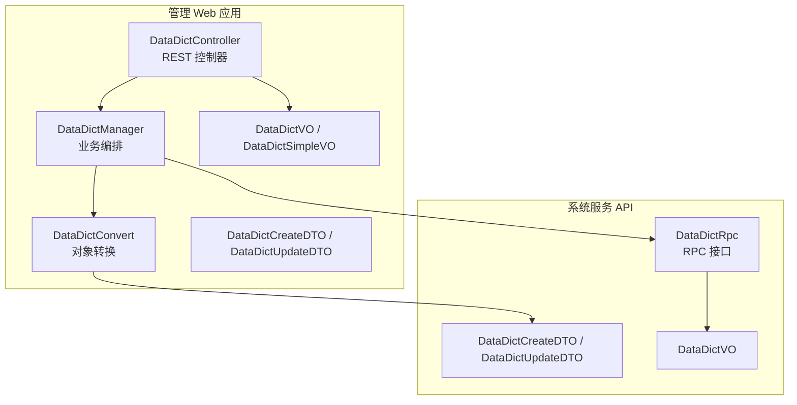
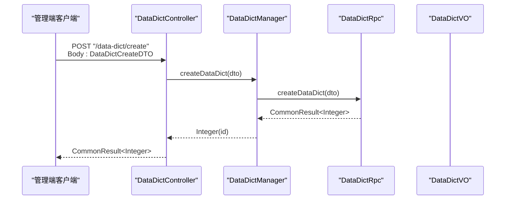
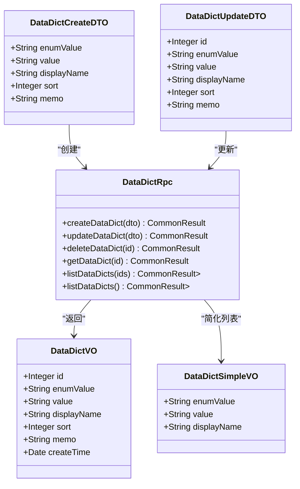
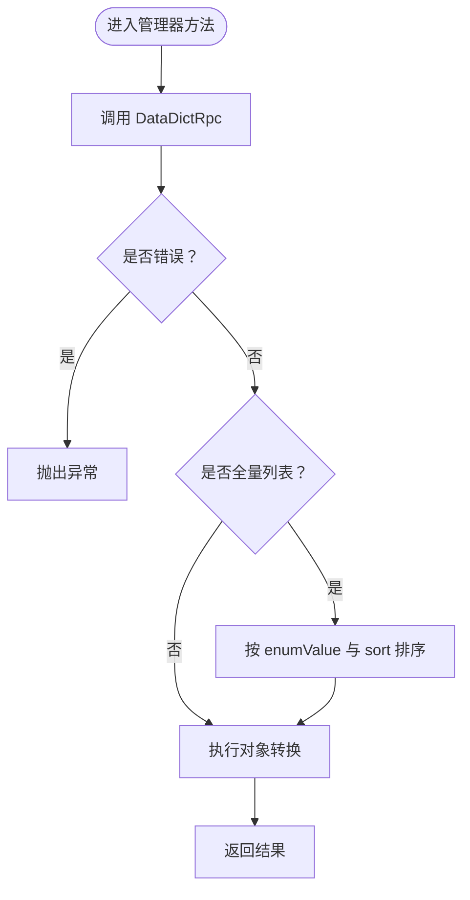
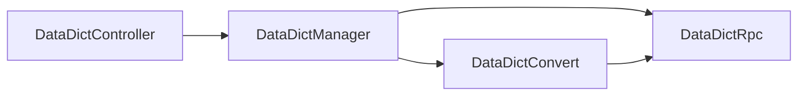

# 数据字典接口

<cite>
**本文引用的文件**
- [DataDictController.java](file://management-web-app/src/main/java/cn/iocoder/mall/managementweb/controller/datadict/DataDictController.java)
- [DataDictCreateDTO.java](file://management-web-app/src/main/java/cn/iocoder/mall/managementweb/controller/datadict/dto/DataDictCreateDTO.java)
- [DataDictUpdateDTO.java](file://management-web-app/src/main/java/cn/iocoder/mall/managementweb/controller/datadict/dto/DataDictUpdateDTO.java)
- [DataDictVO.java](file://management-web-app/src/main/java/cn/iocoder/mall/managementweb/controller/datadict/vo/DataDictVO.java)
- [DataDictSimpleVO.java](file://management-web-app/src/main/java/cn/iocoder/mall/managementweb/controller/datadict/vo/DataDictSimpleVO.java)
- [DataDictManager.java](file://management-web-app/src/main/java/cn/iocoder/mall/managementweb/manager/datadict/DataDictManager.java)
- [DataDictConvert.java](file://management-web-app/src/main/java/cn/iocoder/mall/managementweb/convert/datadict/DataDictConvert.java)
- [DataDictRpc.java](file://system-service-project/system-service-api/src/main/java/cn/iocoder/mall/systemservice/rpc/datadict/DataDictRpc.java)
- [DataDictCreateDTO.java](file://system-service-project/system-service-api/src/main/java/cn/iocoder/mall/systemservice/rpc/datadict/dto/DataDictCreateDTO.java)
- [DataDictUpdateDTO.java](file://system-service-project/system-service-api/src/main/java/cn/iocoder/mall/systemservice/rpc/datadict/dto/DataDictUpdateDTO.java)
- [DataDictVO.java](file://system-service-project/system-service-api/src/main/java/cn/iocoder/mall/systemservice/rpc/datadict/vo/DataDictVO.java)
</cite>

## 目录
1. [简介](#简介)
2. [项目结构](#项目结构)
3. [核心组件](#核心组件)
4. [架构总览](#架构总览)
5. [详细组件分析](#详细组件分析)
6. [依赖分析](#依赖分析)
7. [性能考虑](#性能考虑)
8. [故障排查指南](#故障排查指南)
9. [结论](#结论)
10. [附录：接口规范与示例](#附录接口规范与示例)

## 简介
本文件为“数据字典接口”模块的完整API文档，覆盖管理端对数据字典的增删改查能力，并补充简化版列表能力。内容包括：
- 接口清单与规范（HTTP方法、URL、请求参数、响应格式）
- 数据字典数据模型与字段定义
- 权限控制、缓存策略与性能优化建议
- 管理示例与测试方法

## 项目结构
数据字典接口采用“管理 Web 应用 → 系统服务 RPC”的分层设计：
- 管理 Web 应用层提供 REST 控制器与 VO/DTO 定义
- 系统服务 API 层定义 RPC 接口与服务 DTO/VO
- 管理器封装 RPC 调用与排序逻辑
- 转换器负责 DTO/VO 与 RPC 层对象之间的映射

图表来源
- [DataDictController.java:25-88](file://management-web-app/src/main/java/cn/iocoder/mall/managementweb/controller/datadict/DataDictController.java#L25-L88)
- [DataDictManager.java:19-113](file://management-web-app/src/main/java/cn/iocoder/mall/managementweb/manager/datadict/DataDictManager.java#L19-L113)
- [DataDictConvert.java:12-27](file://management-web-app/src/main/java/cn/iocoder/mall/managementweb/convert/datadict/DataDictConvert.java#L12-L27)
- [DataDictRpc.java:13-60](file://system-service-project/system-service-api/src/main/java/cn/iocoder/mall/systemservice/rpc/datadict/DataDictRpc.java#L13-L60)

章节来源
- [DataDictController.java:25-88](file://management-web-app/src/main/java/cn/iocoder/mall/managementweb/controller/datadict/DataDictController.java#L25-L88)
- [DataDictManager.java:19-113](file://management-web-app/src/main/java/cn/iocoder/mall/managementweb/manager/datadict/DataDictManager.java#L19-L113)
- [DataDictRpc.java:13-60](file://system-service-project/system-service-api/src/main/java/cn/iocoder/mall/systemservice/rpc/datadict/DataDictRpc.java#L13-L60)

## 核心组件
- REST 控制器：暴露数据字典的创建、更新、删除、单条查询、批量查询、全量查询、简化版全量查询等接口
- 管理器：封装 RPC 调用、错误检查、排序与结果转换
- 转换器：MapStruct 映射管理 Web 与系统服务层的对象
- DTO/VO：定义请求与响应的数据结构

章节来源
- [DataDictController.java:25-88](file://management-web-app/src/main/java/cn/iocoder/mall/managementweb/controller/datadict/DataDictController.java#L25-L88)
- [DataDictManager.java:19-113](file://management-web-app/src/main/java/cn/iocoder/mall/managementweb/manager/datadict/DataDictManager.java#L19-L113)
- [DataDictConvert.java:12-27](file://management-web-app/src/main/java/cn/iocoder/mall/managementweb/convert/datadict/DataDictConvert.java#L12-L27)

## 架构总览
以下序列图展示“创建数据字典”的典型调用链路。

图表来源
- [DataDictController.java:34-39](file://management-web-app/src/main/java/cn/iocoder/mall/managementweb/controller/datadict/DataDictController.java#L34-L39)
- [DataDictManager.java:35-39](file://management-web-app/src/main/java/cn/iocoder/mall/managementweb/manager/datadict/DataDictManager.java#L35-L39)
- [DataDictRpc.java:21-21](file://system-service-project/system-service-api/src/main/java/cn/iocoder/mall/systemservice/rpc/datadict/DataDictRpc.java#L21-L21)

## 详细组件分析

### 数据字典数据模型
- 字段定义
  - 编号：整型，唯一标识
  - 大类枚举值：字符串，如 gender、yes_no 等
  - 小类数值：字符串，同一枚举下的具体取值
  - 展示名：字符串，对外显示名称
  - 排序值：整型，用于排序
  - 备注：字符串，可选
  - 创建时间：日期时间，仅在完整 VO 中出现

- 层级关系
  - 同一“大类枚举值”下包含多个“小类数值”
  - 排序值决定展示顺序
  - 简化版 VO 去除编号与创建时间，便于前端缓存

图表来源
- [DataDictCreateDTO.java:10-29](file://management-web-app/src/main/java/cn/iocoder/mall/managementweb/controller/datadict/dto/DataDictCreateDTO.java#L10-L29)
- [DataDictUpdateDTO.java:10-32](file://management-web-app/src/main/java/cn/iocoder/mall/managementweb/controller/datadict/dto/DataDictUpdateDTO.java#L10-L32)
- [DataDictVO.java:10-34](file://management-web-app/src/main/java/cn/iocoder/mall/managementweb/controller/datadict/vo/DataDictVO.java#L10-L34)
- [DataDictSimpleVO.java:9-20](file://management-web-app/src/main/java/cn/iocoder/mall/managementweb/controller/datadict/vo/DataDictSimpleVO.java#L9-L20)
- [DataDictRpc.java:13-60](file://system-service-project/system-service-api/src/main/java/cn/iocoder/mall/systemservice/rpc/datadict/DataDictRpc.java#L13-L60)

章节来源
- [DataDictVO.java:10-34](file://management-web-app/src/main/java/cn/iocoder/mall/managementweb/controller/datadict/vo/DataDictVO.java#L10-L34)
- [DataDictSimpleVO.java:9-20](file://management-web-app/src/main/java/cn/iocoder/mall/managementweb/controller/datadict/vo/DataDictSimpleVO.java#L9-L20)
- [DataDictCreateDTO.java:10-29](file://management-web-app/src/main/java/cn/iocoder/mall/managementweb/controller/datadict/dto/DataDictCreateDTO.java#L10-L29)
- [DataDictUpdateDTO.java:10-32](file://management-web-app/src/main/java/cn/iocoder/mall/managementweb/controller/datadict/dto/DataDictUpdateDTO.java#L10-L32)

### 接口清单与规范

- 创建数据字典
  - 方法与路径：POST /data-dict/create
  - 权限：system:data-dict:create
  - 请求体：DataDictCreateDTO
  - 响应：CommonResult<Integer>，返回新建字典编号
  - 示例请求体字段：enumValue、value、displayName、sort、memo

- 更新数据字典
  - 方法与路径：POST /data-dict/update
  - 权限：system:data-dict:update
  - 请求体：DataDictUpdateDTO
  - 响应：CommonResult<Boolean>，成功即 true
  - 示例请求体字段：id、enumValue、value、displayName、sort、memo

- 删除数据字典
  - 方法与路径：POST /data-dict/delete
  - 权限：system:data-dict:delete
  - 查询参数：dataDictId（整型）
  - 响应：CommonResult<Boolean>，成功即 true

- 获取单个数据字典
  - 方法与路径：GET /data-dict/get
  - 权限：system:data-dict:list
  - 查询参数：dataDictId（整型）
  - 响应：CommonResult<DataDictVO>

- 批量获取数据字典
  - 方法与路径：GET /data-dict/list
  - 权限：system:data-dict:list
  - 查询参数：dataDictIds（整型数组）
  - 响应：CommonResult<List<DataDictVO>>

- 获取全部数据字典列表
  - 方法与路径：GET /data-dict/list-all
  - 权限：system:data-dict:list
  - 响应：CommonResult<List<DataDictVO>>，按 enumValue 与 sort 排序

- 获取简化版数据字典列表
  - 方法与路径：GET /data-dict/list-all-simple
  - 权限：无需认证
  - 响应：CommonResult<List<DataDictSimpleVO>>，按 enumValue 与 sort 排序

章节来源
- [DataDictController.java:34-86](file://management-web-app/src/main/java/cn/iocoder/mall/managementweb/controller/datadict/DataDictController.java#L34-L86)
- [DataDictCreateDTO.java:10-29](file://management-web-app/src/main/java/cn/iocoder/mall/managementweb/controller/datadict/dto/DataDictCreateDTO.java#L10-L29)
- [DataDictUpdateDTO.java:10-32](file://management-web-app/src/main/java/cn/iocoder/mall/managementweb/controller/datadict/dto/DataDictUpdateDTO.java#L10-L32)
- [DataDictVO.java:10-34](file://management-web-app/src/main/java/cn/iocoder/mall/managementweb/controller/datadict/vo/DataDictVO.java#L10-L34)
- [DataDictSimpleVO.java:9-20](file://management-web-app/src/main/java/cn/iocoder/mall/managementweb/controller/datadict/vo/DataDictSimpleVO.java#L9-L20)

### 管理器与转换器
- 管理器职责
  - 调用 DataDictRpc 执行 CRUD
  - 统一错误检查（checkError）
  - 全量列表按 enumValue 与 sort 排序
  - 返回 VO 或简化 VO 列表

- 转换器职责
  - 将管理 Web 的 DTO/VO 映射到系统服务的 DTO/VO
  - 支持普通列表与简化列表两种转换

图表来源
- [DataDictManager.java:22-96](file://management-web-app/src/main/java/cn/iocoder/mall/managementweb/manager/datadict/DataDictManager.java#L22-L96)
- [DataDictConvert.java:12-27](file://management-web-app/src/main/java/cn/iocoder/mall/managementweb/convert/datadict/DataDictConvert.java#L12-L27)

章节来源
- [DataDictManager.java:19-113](file://management-web-app/src/main/java/cn/iocoder/mall/managementweb/manager/datadict/DataDictManager.java#L19-L113)
- [DataDictConvert.java:12-27](file://management-web-app/src/main/java/cn/iocoder/mall/managementweb/convert/datadict/DataDictConvert.java#L12-L27)

## 依赖分析
- 控制器依赖管理器
- 管理器通过 Dubbo 引用依赖系统服务 RPC
- 管理器依赖转换器进行对象映射
- 系统服务 RPC 定义了标准的数据结构与方法签名

图表来源
- [DataDictController.java:31-32](file://management-web-app/src/main/java/cn/iocoder/mall/managementweb/controller/datadict/DataDictController.java#L31-L32)
- [DataDictManager.java:26-27](file://management-web-app/src/main/java/cn/iocoder/mall/managementweb/manager/datadict/DataDictManager.java#L26-L27)
- [DataDictConvert.java:15-25](file://management-web-app/src/main/java/cn/iocoder/mall/managementweb/convert/datadict/DataDictConvert.java#L15-L25)
- [DataDictRpc.java:13-60](file://system-service-project/system-service-api/src/main/java/cn/iocoder/mall/systemservice/rpc/datadict/DataDictRpc.java#L13-L60)

章节来源
- [DataDictController.java:31-32](file://management-web-app/src/main/java/cn/iocoder/mall/managementweb/controller/datadict/DataDictController.java#L31-L32)
- [DataDictManager.java:26-27](file://management-web-app/src/main/java/cn/iocoder/mall/managementweb/manager/datadict/DataDictManager.java#L26-L27)
- [DataDictRpc.java:13-60](file://system-service-project/system-service-api/src/main/java/cn/iocoder/mall/systemservice/rpc/datadict/DataDictRpc.java#L13-L60)

## 性能考虑
- 排序开销：全量列表按 enumValue 与 sort 排序，注意数据规模与排序成本
- 简化版列表：list-all-simple 无权限校验，适合前端全局缓存，减少网络与解析开销
- 分页与批量：批量查询接口支持传入 ids，避免多次往返
- 缓存策略建议
  - 前端缓存简化版列表，定时刷新或基于版本号变更触发刷新
  - 后端可对全量列表设置短时缓存，结合变更事件失效
- 并发与幂等：更新/删除接口需保证幂等性，避免重复提交导致状态不一致

## 故障排查指南
- 常见错误类型
  - 参数校验失败：请求 DTO 字段为空或类型不匹配
  - RPC 调用失败：网络异常、服务不可用、版本不匹配
  - 业务异常：数据不存在、违反约束

- 排查步骤
  - 检查控制器权限注解与实际权限配置
  - 校验请求参数与 DTO 字段定义
  - 查看管理器中 checkError 是否抛出异常
  - 关注排序逻辑与转换器映射是否正确

章节来源
- [DataDictController.java:36-61](file://management-web-app/src/main/java/cn/iocoder/mall/managementweb/controller/datadict/DataDictController.java#L36-L61)
- [DataDictManager.java:35-59](file://management-web-app/src/main/java/cn/iocoder/mall/managementweb/manager/datadict/DataDictManager.java#L35-L59)

## 结论
数据字典接口以清晰的分层设计实现了完整的 CRUD 能力，并提供了简化版列表以支撑前端缓存与性能优化。通过统一的 DTO/VO 与转换器，确保了前后端与服务层之间的数据一致性。建议在生产环境中配合缓存与版本控制策略，进一步提升可用性与性能。

## 附录：接口规范与示例

- 创建数据字典
  - 方法与路径：POST /data-dict/create
  - 权限：system:data-dict:create
  - 请求体字段：enumValue、value、displayName、sort、memo
  - 响应体：CommonResult<Integer>

- 更新数据字典
  - 方法与路径：POST /data-dict/update
  - 权限：system:data-dict:update
  - 请求体字段：id、enumValue、value、displayName、sort、memo
  - 响应体：CommonResult<Boolean>

- 删除数据字典
  - 方法与路径：POST /data-dict/delete
  - 权限：system:data-dict:delete
  - 查询参数：dataDictId
  - 响应体：CommonResult<Boolean>

- 获取单个数据字典
  - 方法与路径：GET /data-dict/get
  - 权限：system:data-dict:list
  - 查询参数：dataDictId
  - 响应体：CommonResult<DataDictVO>

- 批量获取数据字典
  - 方法与路径：GET /data-dict/list
  - 权限：system:data-dict:list
  - 查询参数：dataDictIds（数组）
  - 响应体：CommonResult<List<DataDictVO>>

- 获取全部数据字典列表
  - 方法与路径：GET /data-dict/list-all
  - 权限：system:data-dict:list
  - 响应体：CommonResult<List<DataDictVO>>（已排序）

- 获取简化版数据字典列表
  - 方法与路径：GET /data-dict/list-all-simple
  - 权限：无需认证
  - 响应体：CommonResult<List<DataDictSimpleVO>>（已排序）

- 数据字典数据模型字段
  - DataDictCreateDTO：enumValue、value、displayName、sort、memo
  - DataDictUpdateDTO：id、enumValue、value、displayName、sort、memo
  - DataDictVO：id、enumValue、value、displayName、sort、memo、createTime
  - DataDictSimpleVO：enumValue、value、displayName

- 使用场景
  - 管理后台：维护枚举类目与取值
  - 前端：拉取简化版列表进行本地缓存与渲染
  - 业务系统：通过 RPC 获取字典项进行展示与校验

章节来源
- [DataDictController.java:34-86](file://management-web-app/src/main/java/cn/iocoder/mall/managementweb/controller/datadict/DataDictController.java#L34-L86)
- [DataDictCreateDTO.java:10-29](file://management-web-app/src/main/java/cn/iocoder/mall/managementweb/controller/datadict/dto/DataDictCreateDTO.java#L10-L29)
- [DataDictUpdateDTO.java:10-32](file://management-web-app/src/main/java/cn/iocoder/mall/managementweb/controller/datadict/dto/DataDictUpdateDTO.java#L10-L32)
- [DataDictVO.java:10-34](file://management-web-app/src/main/java/cn/iocoder/mall/managementweb/controller/datadict/vo/DataDictVO.java#L10-L34)
- [DataDictSimpleVO.java:9-20](file://management-web-app/src/main/java/cn/iocoder/mall/managementweb/controller/datadict/vo/DataDictSimpleVO.java#L9-L20)