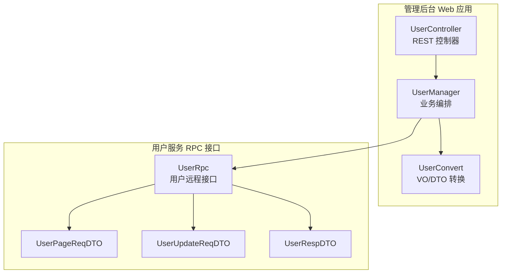
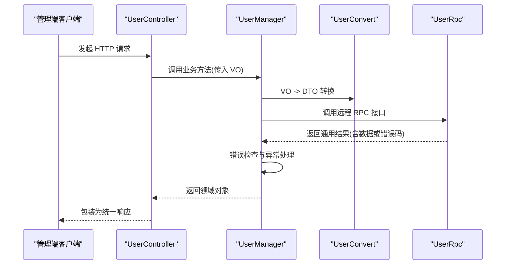
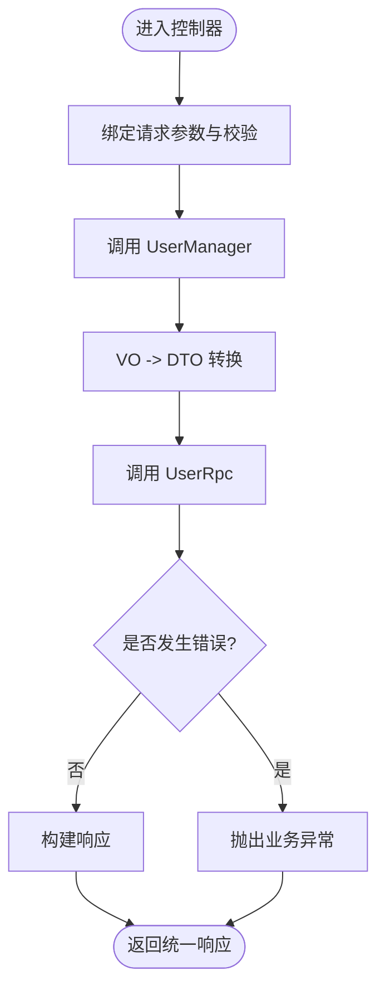
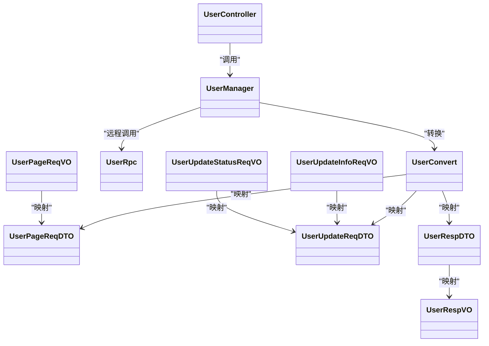

# 用户管理接口

<cite>
**本文引用的文件**
- [UserController.java](file://management-web-app/src/main/java/cn/iocoder/mall/managementweb/controller/user/UserController.java)
- [UserManager.java](file://management-web-app/src/main/java/cn/iocoder/mall/managementweb/manager/user/UserManager.java)
- [UserConvert.java](file://management-web-app/src/main/java/cn/iocoder/mall/managementweb/convert/user/UserConvert.java)
- [UserPageReqVO.java](file://management-web-app/src/main/java/cn/iocoder/mall/managementweb/controller/user/vo/UserPageReqVO.java)
- [UserRespVO.java](file://management-web-app/src/main/java/cn/iocoder/mall/managementweb/controller/user/vo/UserRespVO.java)
- [UserUpdateInfoReqVO.java](file://management-web-app/src/main/java/cn/iocoder/mall/managementweb/controller/user/vo/UserUpdateInfoReqVO.java)
- [UserUpdateStatusReqVO.java](file://management-web-app/src/main/java/cn/iocoder/mall/managementweb/controller/user/vo/UserUpdateStatusReqVO.java)
- [CommonStatusEnum.java](file://common/common-framework/src/main/java/cn/iocoder/common/framework/enums/CommonStatusEnum.java)
- [UserTypeEnum.java](file://common/common-framework/src/main/java/cn/iocoder/common/framework/enums/UserTypeEnum.java)
- [UserRpc.java](file://user-service-project/user-service-api/src/main/java/cn/iocoder/mall/userservice/rpc/user/UserRpc.java)
- [UserRespDTO.java](file://user-service-project/user-service-api/src/main/java/cn/iocoder/mall/userservice/rpc/user/dto/UserRespDTO.java)
- [UserPageReqDTO.java](file://user-service-project/user-service-api/src/main/java/cn/iocoder/mall/userservice/rpc/user/dto/UserPageReqDTO.java)
- [UserUpdateReqDTO.java](file://user-service-project/user-service-api/src/main/java/cn/iocoder/mall/userservice/rpc/user/dto/UserUpdateReqDTO.java)
</cite>

## 目录
1. [简介](#简介)
2. [项目结构](#项目结构)
3. [核心组件](#核心组件)
4. [架构总览](#架构总览)
5. [详细组件分析](#详细组件分析)
6. [依赖分析](#依赖分析)
7. [性能考虑](#性能考虑)
8. [故障排查指南](#故障排查指南)
9. [结论](#结论)
10. [附录](#附录)

## 简介
本文件为“用户管理接口”模块的完整API文档，覆盖管理后台侧对用户的查询与状态管理能力，包括：
- 用户分页查询
- 获取单个用户详情
- 批量获取用户
- 更新用户信息（昵称、头像、手机号、密码等）
- 更新用户状态（启用/禁用）

文档同时给出接口规范、数据模型、状态枚举、权限控制要点、安全与隐私建议、审计日志说明以及测试与安全最佳实践。

## 项目结构
用户管理接口位于管理后台 Web 应用中，采用“Controller -> Manager -> RPC”的分层设计，并通过 MapStruct 进行 VO/DTO 的转换。

图表来源
- [UserController.java:1-69](file://management-web-app/src/main/java/cn/iocoder/mall/managementweb/controller/user/UserController.java#L1-L69)
- [UserManager.java:1-84](file://management-web-app/src/main/java/cn/iocoder/mall/managementweb/manager/user/UserManager.java#L1-L84)
- [UserConvert.java:1-36](file://management-web-app/src/main/java/cn/iocoder/mall/managementweb/convert/user/UserConvert.java#L1-L36)
- [UserRpc.java](file://user-service-project/user-service-api/src/main/java/cn/iocoder/mall/userservice/rpc/user/UserRpc.java)
- [UserPageReqDTO.java](file://user-service-project/user-service-api/src/main/java/cn/iocoder/mall/userservice/rpc/user/dto/UserPageReqDTO.java)
- [UserUpdateReqDTO.java](file://user-service-project/user-service-api/src/main/java/cn/iocoder/mall/userservice/rpc/user/dto/UserUpdateReqDTO.java)
- [UserRespDTO.java](file://user-service-project/user-service-api/src/main/java/cn/iocoder/mall/userservice/rpc/user/dto/UserRespDTO.java)

章节来源
- [UserController.java:1-69](file://management-web-app/src/main/java/cn/iocoder/mall/managementweb/controller/user/UserController.java#L1-L69)
- [UserManager.java:1-84](file://management-web-app/src/main/java/cn/iocoder/mall/managementweb/manager/user/UserManager.java#L1-L84)

## 核心组件
- 控制器：提供 REST 接口，负责参数接收、校验与返回封装。
- 管理器：编排 RPC 调用，进行错误检查与结果转换。
- 转换器：使用 MapStruct 将 VO/DTO 在不同层之间转换。
- RPC 接口：面向用户服务的远程调用契约。
- 枚举：通用状态枚举与用户类型枚举，用于状态约束与扩展。

章节来源
- [UserManager.java:18-84](file://management-web-app/src/main/java/cn/iocoder/mall/managementweb/manager/user/UserManager.java#L18-L84)
- [UserConvert.java:17-36](file://management-web-app/src/main/java/cn/iocoder/mall/managementweb/convert/user/UserConvert.java#L17-L36)
- [CommonStatusEnum.java:10-45](file://common/common-framework/src/main/java/cn/iocoder/common/framework/enums/CommonStatusEnum.java#L10-L45)
- [UserTypeEnum.java:10-45](file://common/common-framework/src/main/java/cn/iocoder/common/framework/enums/UserTypeEnum.java#L10-L45)

## 架构总览
用户管理接口的调用链路如下：

图表来源
- [UserController.java:34-66](file://management-web-app/src/main/java/cn/iocoder/mall/managementweb/controller/user/UserController.java#L34-L66)
- [UserManager.java:32-81](file://management-web-app/src/main/java/cn/iocoder/mall/managementweb/manager/user/UserManager.java#L32-L81)
- [UserConvert.java:22-33](file://management-web-app/src/main/java/cn/iocoder/mall/managementweb/convert/user/UserConvert.java#L22-L33)
- [UserRpc.java](file://user-service-project/user-service-api/src/main/java/cn/iocoder/mall/userservice/rpc/user/UserRpc.java)

## 详细组件分析

### 接口清单与规范

- 查询用户详情
  - 方法：GET
  - 路径：/user/get
  - 参数：
    - userId: integer, 必填, 示例: 1
  - 响应：UserRespVO
  - 权限：需具备相应权限（见“权限控制”）
  - 安全：仅返回脱敏后的必要字段

- 批量查询用户
  - 方法：GET
  - 路径：/user/list
  - 参数：
    - userIds: array[int], 必填, 示例: [1,2,3]
  - 响应：List<UserRespVO>
  - 权限：需具备相应权限

- 分页查询用户
  - 方法：GET
  - 路径：/user/page
  - 参数：UserPageReqVO
    - nickname: string, 可选, 模糊匹配示例: "丑艿艿"
    - status: integer, 可选, 见“状态枚举”
    - pageNo/pageSize: 由 PageParam 提供（见 PageParam 定义）
  - 响应：PageResult<UserRespVO>

- 更新用户信息
  - 方法：POST
  - 路径：/user/update-info
  - 请求体：UserUpdateInfoReqVO
    - id: integer, 必填
    - nickname: string, 可选
    - avatar: string, 可选
    - mobile: string, 可选
    - password: string, 可选
  - 响应：布尔成功标志

- 更新用户状态
  - 方法：POST
  - 路径：/user/update-status
  - 请求体：UserUpdateStatusReqVO
    - userId: integer, 必填
    - status: integer, 必填, 仅允许 CommonStatusEnum 中的值
  - 响应：布尔成功标志

章节来源
- [UserController.java:34-66](file://management-web-app/src/main/java/cn/iocoder/mall/managementweb/controller/user/UserController.java#L34-L66)
- [UserPageReqVO.java:12-19](file://management-web-app/src/main/java/cn/iocoder/mall/managementweb/controller/user/vo/UserPageReqVO.java#L12-L19)
- [UserRespVO.java:9-26](file://management-web-app/src/main/java/cn/iocoder/mall/managementweb/controller/user/vo/UserRespVO.java#L9-L26)
- [UserUpdateInfoReqVO.java:11-25](file://management-web-app/src/main/java/cn/iocoder/mall/managementweb/controller/user/vo/UserUpdateInfoReqVO.java#L11-L25)
- [UserUpdateStatusReqVO.java:13-24](file://management-web-app/src/main/java/cn/iocoder/mall/managementweb/controller/user/vo/UserUpdateStatusReqVO.java#L13-L24)

### 数据模型与字段定义

- UserRespVO（响应模型）
  - 字段
    - id: integer, 必填
    - nickname: string, 可选
    - avatar: string, 可选
    - status: integer, 必填, 见“状态枚举”
    - mobile: string, 必填
    - createIp: string, 必填
    - createTime: datetime, 必填

- UserPageReqVO（分页查询请求）
  - 继承自 PageParam
  - 字段
    - nickname: string, 可选
    - status: integer, 可选

- UserUpdateInfoReqVO（更新用户信息请求）
  - 字段
    - id: integer, 必填
    - nickname: string, 可选
    - avatar: string, 可选
    - mobile: string, 可选
    - password: string, 可选

- UserUpdateStatusReqVO（更新用户状态请求）
  - 字段
    - userId: integer, 必填
    - status: integer, 必填, 仅允许 CommonStatusEnum 中的值

章节来源
- [UserRespVO.java:9-26](file://management-web-app/src/main/java/cn/iocoder/mall/managementweb/controller/user/vo/UserRespVO.java#L9-L26)
- [UserPageReqVO.java:12-19](file://management-web-app/src/main/java/cn/iocoder/mall/managementweb/controller/user/vo/UserPageReqVO.java#L12-L19)
- [UserUpdateInfoReqVO.java:11-25](file://management-web-app/src/main/java/cn/iocoder/mall/managementweb/controller/user/vo/UserUpdateInfoReqVO.java#L11-L25)
- [UserUpdateStatusReqVO.java:13-24](file://management-web-app/src/main/java/cn/iocoder/mall/managementweb/controller/user/vo/UserUpdateStatusReqVO.java#L13-L24)

### 状态枚举与类型枚举

- CommonStatusEnum（通用状态）
  - ENABLE: 1
  - DISABLE: 2
  - 用途：用户状态、开关类配置等

- UserTypeEnum（全局用户类型）
  - USER: 1
  - ADMIN: 2
  - 用途：区分普通用户与管理员

章节来源
- [CommonStatusEnum.java:10-45](file://common/common-framework/src/main/java/cn/iocoder/common/framework/enums/CommonStatusEnum.java#L10-L45)
- [UserTypeEnum.java:10-45](file://common/common-framework/src/main/java/cn/iocoder/common/framework/enums/UserTypeEnum.java#L10-L45)

### 权限控制
- 控制器方法标注了权限注解（如 RequiresPermissions），具体权限点以实际注解为准。
- 建议：
  - 对“更新用户信息/状态”接口设置高权限点。
  - 对“分页/详情/列表”接口设置只读权限点。
  - 结合基于角色的访问控制（RBAC）策略，确保最小权限原则。

章节来源
- [UserController.java:34-66](file://management-web-app/src/main/java/cn/iocoder/mall/managementweb/controller/user/UserController.java#L34-L66)

### 处理流程与错误处理

图表来源
- [UserManager.java:32-81](file://management-web-app/src/main/java/cn/iocoder/mall/managementweb/manager/user/UserManager.java#L32-L81)
- [UserConvert.java:22-33](file://management-web-app/src/main/java/cn/iocoder/mall/managementweb/convert/user/UserConvert.java#L22-L33)

## 依赖分析
- 控制器依赖管理器；管理器依赖转换器与 RPC 接口；RPC 接口对接用户服务。
- VO/DTO 层通过 MapStruct 映射，降低重复转换逻辑。
- 枚举在多处复用，保证状态一致性。

图表来源
- [UserController.java:25-66](file://management-web-app/src/main/java/cn/iocoder/mall/managementweb/controller/user/UserController.java#L25-L66)
- [UserManager.java:24-81](file://management-web-app/src/main/java/cn/iocoder/mall/managementweb/manager/user/UserManager.java#L24-L81)
- [UserConvert.java:17-35](file://management-web-app/src/main/java/cn/iocoder/mall/managementweb/convert/user/UserConvert.java#L17-L35)
- [UserPageReqVO.java:12-19](file://management-web-app/src/main/java/cn/iocoder/mall/managementweb/controller/user/vo/UserPageReqVO.java#L12-L19)
- [UserRespVO.java:9-26](file://management-web-app/src/main/java/cn/iocoder/mall/managementweb/controller/user/vo/UserRespVO.java#L9-L26)
- [UserUpdateInfoReqVO.java:11-25](file://management-web-app/src/main/java/cn/iocoder/mall/managementweb/controller/user/vo/UserUpdateInfoReqVO.java#L11-L25)
- [UserUpdateStatusReqVO.java:13-24](file://management-web-app/src/main/java/cn/iocoder/mall/managementweb/controller/user/vo/UserUpdateStatusReqVO.java#L13-L24)
- [UserPageReqDTO.java](file://user-service-project/user-service-api/src/main/java/cn/iocoder/mall/userservice/rpc/user/dto/UserPageReqDTO.java)
- [UserUpdateReqDTO.java](file://user-service-project/user-service-api/src/main/java/cn/iocoder/mall/userservice/rpc/user/dto/UserUpdateReqDTO.java)
- [UserRespDTO.java](file://user-service-project/user-service-api/src/main/java/cn/iocoder/mall/userservice/rpc/user/dto/UserRespDTO.java)

## 性能考虑
- 分页查询：合理设置 page 与 size，避免超大页码与过大每页数量。
- 批量查询：限制一次请求的用户 ID 数量，防止过载。
- 缓存策略：对高频只读数据（如用户基本信息）可引入缓存，注意缓存失效策略。
- 并发控制：对“更新状态/信息”这类写操作，建议加锁或幂等设计，避免并发冲突。
- 日志与监控：对关键接口埋点，统计 QPS、耗时与错误率。

## 故障排查指南
- 常见错误
  - 参数校验失败：检查必填字段与格式（如手机号、状态枚举值）。
  - RPC 调用异常：确认用户服务是否可用，版本号配置是否正确。
  - 业务异常：根据返回的错误码定位问题（例如用户不存在、状态非法等）。
- 排查步骤
  - 核对请求路径与 HTTP 方法是否正确。
  - 核对请求参数与 VO/DTO 字段映射关系。
  - 查看服务端日志与链路追踪信息。
  - 验证权限点是否满足。

章节来源
- [UserManager.java:32-81](file://management-web-app/src/main/java/cn/iocoder/mall/managementweb/manager/user/UserManager.java#L32-L81)

## 结论
用户管理接口提供了完善的用户查询与状态管理能力，采用清晰的分层与契约化设计，便于维护与扩展。结合权限控制、安全与隐私保护、审计日志与测试实践，可有效保障系统的稳定性与安全性。

## 附录

### 接口调用示例（说明性）
- 获取用户详情
  - 请求：GET /user/get?userId=1
  - 响应：包含用户基础信息的 JSON
- 分页查询
  - 请求：GET /user/page?nickname=丑艿&status=1&pageNo=1&pageSize=20
  - 响应：分页结果，包含用户列表与总数
- 批量查询
  - 请求：GET /user/list?userIds=[1,2,3]
  - 响应：用户列表
- 更新用户信息
  - 请求：POST /user/update-info
  - 请求体：包含 id 与可选字段（昵称、头像、手机号、密码）
  - 响应：true/false
- 更新用户状态
  - 请求：POST /user/update-status
  - 请求体：包含 userId 与 status（1 启用/2 禁用）
  - 响应：true/false

### 安全与隐私建议
- 输入校验：严格校验手机号、状态枚举、必填项。
- 权限控制：对敏感操作设置高权限点，结合 RBAC 实施。
- 数据脱敏：对外响应避免泄露敏感字段（如密码）。
- 审计日志：记录关键操作（如更新状态/信息）的时间、操作人、目标用户与变更内容。
- 传输安全：启用 HTTPS，防止中间人攻击。
- 最佳实践：对高频接口增加限流与熔断，对写操作实现幂等设计。

### 测试方法
- 单元测试：针对 VO/DTO 转换与参数校验逻辑编写用例。
- 集成测试：模拟控制器到 RPC 的完整链路，验证错误处理与边界条件。
- 性能测试：对分页与批量查询接口进行压力测试，评估分页大小与并发影响。
- 安全测试：验证越权访问、SQL 注入与参数篡改等场景。