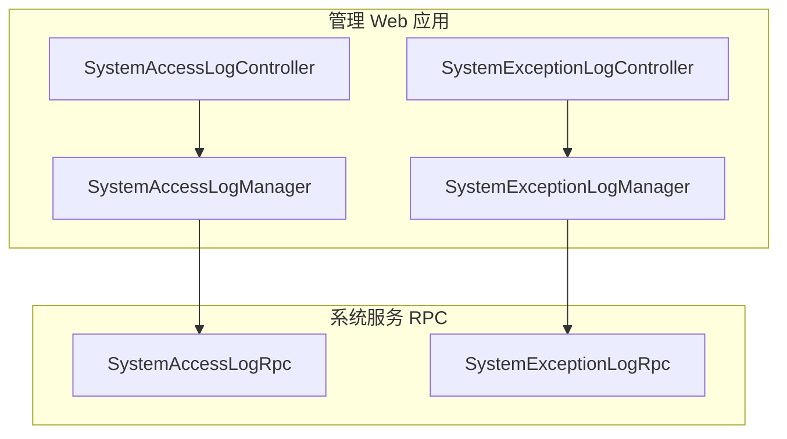
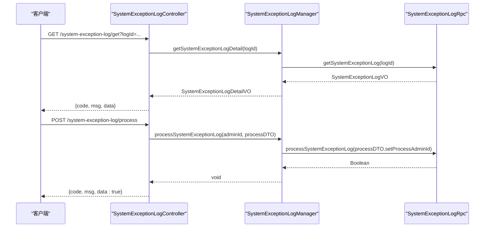
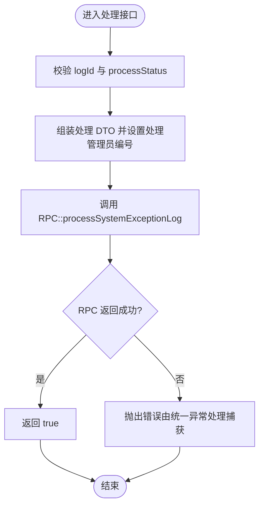
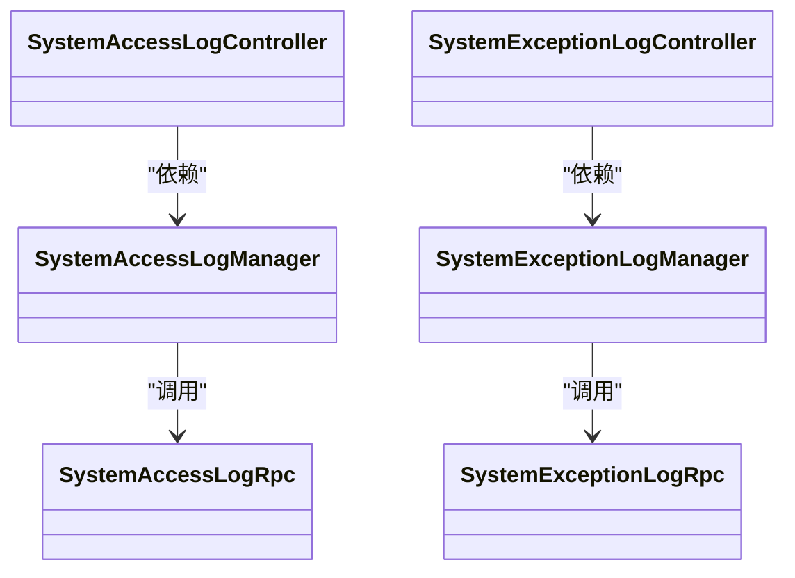

# 系统日志接口

<cite>
**本文引用的文件**
- [SystemAccessLogController.java](file://management-web-app/src/main/java/cn/iocoder/mall/managementweb/controller/systemlog/SystemAccessLogController.java)
- [SystemExceptionLogController.java](file://management-web-app/src/main/java/cn/iocoder/mall/managementweb/controller/systemlog/SystemExceptionLogController.java)
- [SystemAccessLogPageDTO.java](file://management-web-app/src/main/java/cn/iocoder/mall/managementweb/controller/systemlog/dto/SystemAccessLogPageDTO.java)
- [SystemExceptionLogPageDTO.java](file://management-web-app/src/main/java/cn/iocoder/mall/managementweb/controller/systemlog/dto/SystemExceptionLogPageDTO.java)
- [SystemExceptionLogProcessDTO.java](file://management-web-app/src/main/java/cn/iocoder/mall/managementweb/controller/systemlog/dto/SystemExceptionLogProcessDTO.java)
- [SystemAccessLogVO.java](file://management-web-app/src/main/java/cn/iocoder/mall/managementweb/controller/systemlog/vo/SystemAccessLogVO.java)
- [SystemExceptionLogVO.java](file://management-web-app/src/main/java/cn/iocoder/mall/managementweb/controller/systemlog/vo/SystemExceptionLogVO.java)
- [SystemExceptionLogDetailVO.java](file://management-web-app/src/main/java/cn/iocoder/mall/managementweb/controller/systemlog/vo/SystemExceptionLogDetailVO.java)
- [SystemAccessLogManager.java](file://management-web-app/src/main/java/cn/iocoder/mall/managementweb/manager/systemlog/SystemAccessLogManager.java)
- [SystemExceptionLogManager.java](file://management-web-app/src/main/java/cn/iocoder/mall/managementweb/manager/systemlog/SystemExceptionLogManager.java)
- [SystemAccessLogRpc.java](file://system-service-project/system-service-api/src/main/java/cn/iocoder/mall/systemservice/rpc/systemlog/SystemAccessLogRpc.java)
- [SystemExceptionLogRpc.java](file://system-service-project/system-service-api/src/main/java/cn/iocoder/mall/systemservice/rpc/systemlog/SystemExceptionLogRpc.java)
</cite>

## 目录
1. [简介](#简介)
2. [项目结构](#项目结构)
3. [核心组件](#核心组件)
4. [架构总览](#架构总览)
5. [详细组件分析](#详细组件分析)
6. [依赖关系分析](#依赖关系分析)
7. [性能考虑](#性能考虑)
8. [故障排查指南](#故障排查指南)
9. [结论](#结论)
10. [附录：接口规范与数据模型](#附录接口规范与数据模型)

## 简介
本文件面向“系统日志接口”模块，聚焦于两类日志的管理能力：
- 系统访问日志：提供分页查询能力，便于审计与行为追踪。
- 系统异常日志：提供分页查询、详情查询、处理（完成/忽略）能力，支撑问题定位与闭环。

接口采用前后端分离设计，前端通过管理 Web 应用暴露 REST API，后端通过 Dubbo RPC 调用系统服务实现具体逻辑；同时提供统一的返回体与权限控制注解，确保接口安全与一致性。

## 项目结构
围绕系统日志的模块化组织如下：
- 控制层（Controller）：对外暴露 HTTP 接口，负责参数接收与权限校验。
- 管理层（Manager）：封装 RPC 调用与转换逻辑，协调领域服务。
- RPC 接口（SystemAccessLogRpc / SystemExceptionLogRpc）：系统服务侧定义的远程接口契约。
- 数据传输对象（DTO）与视图对象（VO）：定义请求参数与响应结构。

图表来源
- [SystemAccessLogController.java:1-39](file://management-web-app/src/main/java/cn/iocoder/mall/managementweb/controller/systemlog/SystemAccessLogController.java#L1-L39)
- [SystemExceptionLogController.java:1-57](file://management-web-app/src/main/java/cn/iocoder/mall/managementweb/controller/systemlog/SystemExceptionLogController.java#L1-L57)
- [SystemAccessLogManager.java:1-35](file://management-web-app/src/main/java/cn/iocoder/mall/managementweb/manager/systemlog/SystemAccessLogManager.java#L1-L35)
- [SystemExceptionLogManager.java:1-77](file://management-web-app/src/main/java/cn/iocoder/mall/managementweb/manager/systemlog/SystemExceptionLogManager.java#L1-L77)
- [SystemAccessLogRpc.java:1-31](file://system-service-project/system-service-api/src/main/java/cn/iocoder/mall/systemservice/rpc/systemlog/SystemAccessLogRpc.java#L1-L31)
- [SystemExceptionLogRpc.java:1-48](file://system-service-project/system-service-api/src/main/java/cn/iocoder/mall/systemservice/rpc/systemlog/SystemExceptionLogRpc.java#L1-L48)

章节来源
- [SystemAccessLogController.java:1-39](file://management-web-app/src/main/java/cn/iocoder/mall/managementweb/controller/systemlog/SystemAccessLogController.java#L1-L39)
- [SystemExceptionLogController.java:1-57](file://management-web-app/src/main/java/cn/iocoder/mall/managementweb/controller/systemlog/SystemExceptionLogController.java#L1-L57)
- [SystemAccessLogManager.java:1-35](file://management-web-app/src/main/java/cn/iocoder/mall/managementweb/manager/systemlog/SystemAccessLogManager.java#L1-L35)
- [SystemExceptionLogManager.java:1-77](file://management-web-app/src/main/java/cn/iocoder/mall/managementweb/manager/systemlog/SystemExceptionLogManager.java#L1-L77)
- [SystemAccessLogRpc.java:1-31](file://system-service-project/system-service-api/src/main/java/cn/iocoder/mall/systemservice/rpc/systemlog/SystemAccessLogRpc.java#L1-L31)
- [SystemExceptionLogRpc.java:1-48](file://system-service-project/system-service-api/src/main/java/cn/iocoder/mall/systemservice/rpc/systemlog/SystemExceptionLogRpc.java#L1-L48)

## 核心组件
- 访问日志控制器：提供访问日志分页查询接口。
- 异常日志控制器：提供异常日志详情查询、分页查询、处理接口。
- 管理器：封装 RPC 调用与数据转换，负责调用链路编排。
- RPC 接口：系统服务侧定义的远程接口，承载业务逻辑。

章节来源
- [SystemAccessLogController.java:19-39](file://management-web-app/src/main/java/cn/iocoder/mall/managementweb/controller/systemlog/SystemAccessLogController.java#L19-L39)
- [SystemExceptionLogController.java:21-57](file://management-web-app/src/main/java/cn/iocoder/mall/managementweb/controller/systemlog/SystemExceptionLogController.java#L21-L57)
- [SystemAccessLogManager.java:12-35](file://management-web-app/src/main/java/cn/iocoder/mall/managementweb/manager/systemlog/SystemAccessLogManager.java#L12-L35)
- [SystemExceptionLogManager.java:16-77](file://management-web-app/src/main/java/cn/iocoder/mall/managementweb/manager/systemlog/SystemExceptionLogManager.java#L16-L77)
- [SystemAccessLogRpc.java:9-31](file://system-service-project/system-service-api/src/main/java/cn/iocoder/mall/systemservice/rpc/systemlog/SystemAccessLogRpc.java#L9-L31)
- [SystemExceptionLogRpc.java:10-48](file://system-service-project/system-service-api/src/main/java/cn/iocoder/mall/systemservice/rpc/systemlog/SystemExceptionLogRpc.java#L10-L48)

## 架构总览
系统日志接口遵循“控制层 -> 管理层 -> RPC 层”的分层架构，统一返回体与权限注解，保证接口的一致性与安全性。

图表来源
- [SystemExceptionLogController.java:33-54](file://management-web-app/src/main/java/cn/iocoder/mall/managementweb/controller/systemlog/SystemExceptionLogController.java#L33-L54)
- [SystemExceptionLogManager.java:33-74](file://management-web-app/src/main/java/cn/iocoder/mall/managementweb/manager/systemlog/SystemExceptionLogManager.java#L33-L74)
- [SystemExceptionLogRpc.java:23-45](file://system-service-project/system-service-api/src/main/java/cn/iocoder/mall/systemservice/rpc/systemlog/SystemExceptionLogRpc.java#L23-L45)

## 详细组件分析

### 访问日志分页查询
- 接口用途：按条件分页获取系统访问日志，支持用户维度与应用维度筛选。
- 权限标识：system:system-access-log:page
- 请求方式与路径：GET /system-access-log/page
- 请求参数（继承分页参数与可选过滤条件）
  - 用户编号（可选）
  - 用户类型（可选）
  - 应用名（可选）
- 响应数据：分页结果，元素为访问日志 VO
- 典型使用场景：审计登录、接口调用统计、异常溯源

章节来源
- [SystemAccessLogController.java:31-36](file://management-web-app/src/main/java/cn/iocoder/mall/managementweb/controller/systemlog/SystemAccessLogController.java#L31-L36)
- [SystemAccessLogPageDTO.java:10-19](file://management-web-app/src/main/java/cn/iocoder/mall/managementweb/controller/systemlog/dto/SystemAccessLogPageDTO.java#L10-L19)
- [SystemAccessLogVO.java:9-41](file://management-web-app/src/main/java/cn/iocoder/mall/managementweb/controller/systemlog/vo/SystemAccessLogVO.java#L9-L41)
- [SystemAccessLogManager.java:27-32](file://management-web-app/src/main/java/cn/iocoder/mall/managementweb/manager/systemlog/SystemAccessLogManager.java#L27-L32)
- [SystemAccessLogRpc.java:22-28](file://system-service-project/system-service-api/src/main/java/cn/iocoder/mall/systemservice/rpc/systemlog/SystemAccessLogRpc.java#L22-L28)

### 异常日志分页查询
- 接口用途：按条件分页获取系统异常日志，支持用户、应用与处理状态筛选。
- 权限标识：system:system-exception-log:page
- 请求方式与路径：GET /system-exception-log/page
- 请求参数（继承分页参数与可选过滤条件）
  - 用户编号（可选）
  - 用户类型（可选）
  - 应用名（可选）
  - 处理状态（可选）
- 响应数据：分页结果，元素为异常日志 VO
- 典型使用场景：问题定位、趋势分析、告警联动

章节来源
- [SystemExceptionLogController.java:41-46](file://management-web-app/src/main/java/cn/iocoder/mall/managementweb/controller/systemlog/SystemExceptionLogController.java#L41-L46)
- [SystemExceptionLogPageDTO.java:10-21](file://management-web-app/src/main/java/cn/iocoder/mall/managementweb/controller/systemlog/dto/SystemExceptionLogPageDTO.java#L10-L21)
- [SystemExceptionLogVO.java:9-59](file://management-web-app/src/main/java/cn/iocoder/mall/managementweb/controller/systemlog/vo/SystemExceptionLogVO.java#L9-L59)
- [SystemExceptionLogManager.java:57-62](file://management-web-app/src/main/java/cn/iocoder/mall/managementweb/manager/systemlog/SystemExceptionLogManager.java#L57-L62)
- [SystemExceptionLogRpc.java:31-37](file://system-service-project/system-service-api/src/main/java/cn/iocoder/mall/systemservice/rpc/systemlog/SystemExceptionLogRpc.java#L31-L37)

### 异常日志详情查询
- 接口用途：获取单条异常日志的完整信息，并拼接处理管理员信息（若存在）。
- 权限标识：system:system-exception-log:page
- 请求方式与路径：GET /system-exception-log/get?logId=...
- 请求参数
  - logId：异常日志编号（必填）
- 响应数据：异常日志详情 VO（包含处理管理员信息）
- 典型使用场景：问题复盘、证据链固化

章节来源
- [SystemExceptionLogController.java:33-39](file://management-web-app/src/main/java/cn/iocoder/mall/managementweb/controller/systemlog/SystemExceptionLogController.java#L33-L39)
- [SystemExceptionLogDetailVO.java:12-77](file://management-web-app/src/main/java/cn/iocoder/mall/managementweb/controller/systemlog/vo/SystemExceptionLogDetailVO.java#L12-L77)
- [SystemExceptionLogManager.java:33-49](file://management-web-app/src/main/java/cn/iocoder/mall/managementweb/manager/systemlog/SystemExceptionLogManager.java#L33-L49)
- [SystemExceptionLogRpc.java:23-29](file://system-service-project/system-service-api/src/main/java/cn/iocoder/mall/systemservice/rpc/systemlog/SystemExceptionLogRpc.java#L23-L29)

### 异常日志处理
- 接口用途：对异常日志进行处理（如完成或忽略），并记录处理人。
- 权限标识：system:system-exception-log:process
- 请求方式与路径：POST /system-exception-log/process
- 请求参数
  - logId：异常日志编号（必填）
  - processStatus：处理状态（必填）
- 响应数据：布尔值（成功即 true）
- 典型使用场景：工单闭环、自动化处置

章节来源
- [SystemExceptionLogController.java:48-54](file://management-web-app/src/main/java/cn/iocoder/mall/managementweb/controller/systemlog/SystemExceptionLogController.java#L48-L54)
- [SystemExceptionLogProcessDTO.java:12-19](file://management-web-app/src/main/java/cn/iocoder/mall/managementweb/controller/systemlog/dto/SystemExceptionLogProcessDTO.java#L12-L19)
- [SystemExceptionLogManager.java:70-74](file://management-web-app/src/main/java/cn/iocoder/mall/managementweb/manager/systemlog/SystemExceptionLogManager.java#L70-L74)
- [SystemExceptionLogRpc.java:39-45](file://system-service-project/system-service-api/src/main/java/cn/iocoder/mall/systemservice/rpc/systemlog/SystemExceptionLogRpc.java#L39-L45)

### 数据模型与字段说明

#### 访问日志 VO（SystemAccessLogVO）
- 关键字段
  - 编号、用户编号、用户类型、链路追踪编号
  - 应用名、URI、查询串、HTTP 方法、User-Agent、IP
  - 请求开始时间、响应时长（毫秒）、错误码、错误信息
- 适用场景：访问审计、性能分析、异常溯源

章节来源
- [SystemAccessLogVO.java:9-41](file://management-web-app/src/main/java/cn/iocoder/mall/managementweb/controller/systemlog/vo/SystemAccessLogVO.java#L9-L41)

#### 异常日志 VO（SystemExceptionLogVO）
- 关键字段
  - 编号、用户编号、用户类型、链路追踪编号
  - 应用名、URI、查询串、HTTP 方法、User-Agent、IP
  - 异常发生时间、异常类名、异常消息、根因消息、栈轨迹
  - 异常发生位置（类/文件/方法/行号）
  - 处理状态、处理时间、处理管理员编号、创建时间
- 适用场景：问题定位、根因分析、治理闭环

章节来源
- [SystemExceptionLogVO.java:9-59](file://management-web-app/src/main/java/cn/iocoder/mall/managementweb/controller/systemlog/vo/SystemExceptionLogVO.java#L9-L59)

#### 异常日志详情 VO（SystemExceptionLogDetailVO）
- 在异常日志 VO 基础上增加处理管理员信息（管理员编号、姓名）
- 适用场景：展示处理人、责任追溯

章节来源
- [SystemExceptionLogDetailVO.java:12-77](file://management-web-app/src/main/java/cn/iocoder/mall/managementweb/controller/systemlog/vo/SystemExceptionLogDetailVO.java#L12-L77)

### 处理流程（异常日志处理）

图表来源
- [SystemExceptionLogController.java:48-54](file://management-web-app/src/main/java/cn/iocoder/mall/managementweb/controller/systemlog/SystemExceptionLogController.java#L48-L54)
- [SystemExceptionLogManager.java:70-74](file://management-web-app/src/main/java/cn/iocoder/mall/managementweb/manager/systemlog/SystemExceptionLogManager.java#L70-L74)
- [SystemExceptionLogRpc.java:39-45](file://system-service-project/system-service-api/src/main/java/cn/iocoder/mall/systemservice/rpc/systemlog/SystemExceptionLogRpc.java#L39-L45)

## 依赖关系分析
- 控制器依赖管理器；管理器依赖 RPC 接口；RPC 接口定义在系统服务 API 中。
- 管理器负责参数转换与调用编排，控制器仅承担路由与鉴权职责。
- 权限注解统一约束接口访问，确保最小授权。

图表来源
- [SystemAccessLogController.java:22-36](file://management-web-app/src/main/java/cn/iocoder/mall/managementweb/controller/systemlog/SystemAccessLogController.java#L22-L36)
- [SystemExceptionLogController.java:24-54](file://management-web-app/src/main/java/cn/iocoder/mall/managementweb/controller/systemlog/SystemExceptionLogController.java#L24-L54)
- [SystemAccessLogManager.java:15-32](file://management-web-app/src/main/java/cn/iocoder/mall/managementweb/manager/systemlog/SystemAccessLogManager.java#L15-L32)
- [SystemExceptionLogManager.java:19-74](file://management-web-app/src/main/java/cn/iocoder/mall/managementweb/manager/systemlog/SystemExceptionLogManager.java#L19-L74)
- [SystemAccessLogRpc.java:12-28](file://system-service-project/system-service-api/src/main/java/cn/iocoder/mall/systemservice/rpc/systemlog/SystemAccessLogRpc.java#L12-L28)
- [SystemExceptionLogRpc.java:13-45](file://system-service-project/system-service-api/src/main/java/cn/iocoder/mall/systemservice/rpc/systemlog/SystemExceptionLogRpc.java#L13-L45)

## 性能考虑
- 分页查询：建议合理设置分页大小与排序字段，避免一次性拉取过多数据。
- 过滤条件：优先使用索引字段（如应用名、用户编号、处理状态）以提升查询效率。
- 缓存策略：对高频查询的异常日志汇总统计可引入缓存，降低数据库压力。
- 日志归档：异常日志体量较大，建议按时间分区或冷热分离，定期归档历史数据。
- RPC 调用：批量处理时合并请求，减少网络往返；对失败重试与熔断降级需结合实际场景配置。

## 故障排查指南
- 权限不足：检查权限注解与账号权限，确认是否具备 system:system-* 对应权限。
- 参数缺失：核对必填参数（如 logId、processStatus），确保请求体与查询参数正确。
- RPC 调用失败：关注管理器中 checkError 的错误传播，定位系统服务侧异常。
- 响应为空：确认过滤条件是否过于严格，尝试放宽筛选范围验证数据是否存在。
- 性能问题：检查分页大小、排序字段与索引使用情况，必要时调整查询策略。

## 结论
系统日志接口模块提供了完善的访问日志与异常日志管理能力，覆盖查询、详情、处理等关键环节。通过清晰的分层设计与统一的权限控制，既保障了易用性，也兼顾了安全性与可维护性。建议在生产环境中配合合理的日志归档与性能优化策略，持续提升可观测性与稳定性。

## 附录：接口规范与数据模型

### 接口一览
- 访问日志分页查询
  - 方法：GET
  - 路径：/system-access-log/page
  - 权限：system:system-access-log:page
  - 请求参数：分页参数 + 用户编号（可选）+ 用户类型（可选）+ 应用名（可选）
  - 响应：分页结果，元素为 SystemAccessLogVO
- 异常日志详情查询
  - 方法：GET
  - 路径：/system-exception-log/get?logId=...
  - 权限：system:system-exception-log:page
  - 请求参数：logId（必填）
  - 响应：SystemExceptionLogDetailVO
- 异常日志分页查询
  - 方法：GET
  - 路径：/system-exception-log/page
  - 权限：system:system-exception-log:page
  - 请求参数：分页参数 + 用户编号（可选）+ 用户类型（可选）+ 应用名（可选）+ 处理状态（可选）
  - 响应：分页结果，元素为 SystemExceptionLogVO
- 异常日志处理
  - 方法：POST
  - 路径：/system-exception-log/process
  - 权限：system:system-exception-log:process
  - 请求参数：logId（必填）、processStatus（必填）
  - 响应：true

章节来源
- [SystemAccessLogController.java:31-36](file://management-web-app/src/main/java/cn/iocoder/mall/managementweb/controller/systemlog/SystemAccessLogController.java#L31-L36)
- [SystemExceptionLogController.java:33-54](file://management-web-app/src/main/java/cn/iocoder/mall/managementweb/controller/systemlog/SystemExceptionLogController.java#L33-L54)
- [SystemAccessLogPageDTO.java:10-19](file://management-web-app/src/main/java/cn/iocoder/mall/managementweb/controller/systemlog/dto/SystemAccessLogPageDTO.java#L10-L19)
- [SystemExceptionLogPageDTO.java:10-21](file://management-web-app/src/main/java/cn/iocoder/mall/managementweb/controller/systemlog/dto/SystemExceptionLogPageDTO.java#L10-L21)
- [SystemExceptionLogProcessDTO.java:12-19](file://management-web-app/src/main/java/cn/iocoder/mall/managementweb/controller/systemlog/dto/SystemExceptionLogProcessDTO.java#L12-L19)
- [SystemAccessLogVO.java:9-41](file://management-web-app/src/main/java/cn/iocoder/mall/managementweb/controller/systemlog/vo/SystemAccessLogVO.java#L9-L41)
- [SystemExceptionLogVO.java:9-59](file://management-web-app/src/main/java/cn/iocoder/mall/managementweb/controller/systemlog/vo/SystemExceptionLogVO.java#L9-L59)
- [SystemExceptionLogDetailVO.java:12-77](file://management-web-app/src/main/java/cn/iocoder/mall/managementweb/controller/systemlog/vo/SystemExceptionLogDetailVO.java#L12-L77)

### 数据模型与字段定义
- 访问日志 VO（SystemAccessLogVO）
  - 字段要点：id、userId、userType、traceId、applicationName、uri、queryString、method、userAgent、ip、startTime、responseTime、errorCode、errorMessage
- 异常日志 VO（SystemExceptionLogVO）
  - 字段要点：id、userId、userType、traceId、applicationName、uri、queryString、method、userAgent、ip、exceptionTime、exceptionName、exceptionMessage、exceptionRootCauseMessage、exceptionStackTrace、exceptionClassName、exceptionFileName、exceptionMethodName、exceptionLineNumber、processStatus、processTime、processAdminId、createTime
- 异常日志详情 VO（SystemExceptionLogDetailVO）
  - 在上述基础上增加：processAdmin（id、name）

章节来源
- [SystemAccessLogVO.java:9-41](file://management-web-app/src/main/java/cn/iocoder/mall/managementweb/controller/systemlog/vo/SystemAccessLogVO.java#L9-L41)
- [SystemExceptionLogVO.java:9-59](file://management-web-app/src/main/java/cn/iocoder/mall/managementweb/controller/systemlog/vo/SystemExceptionLogVO.java#L9-L59)
- [SystemExceptionLogDetailVO.java:12-77](file://management-web-app/src/main/java/cn/iocoder/mall/managementweb/controller/systemlog/vo/SystemExceptionLogDetailVO.java#L12-L77)

### 日志管理示例（概念性说明）
- 检索
  - 使用访问日志分页接口按应用名与时间范围检索访问行为。
  - 使用异常日志分页接口按用户编号、应用名与处理状态检索异常。
- 分析
  - 基于异常日志详情中的异常类名、根因消息与栈轨迹进行根因分析。
  - 结合访问日志的 URI 与响应时长定位慢接口与高错误率接口。
- 导出
  - 将分页查询结果导出为 CSV/Excel，用于离线分析与报表生成。
- 处理
  - 对异常日志执行处理（完成/忽略），并记录处理管理员编号与处理时间。

[本节为概念性说明，不直接分析具体文件]