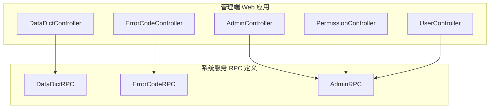
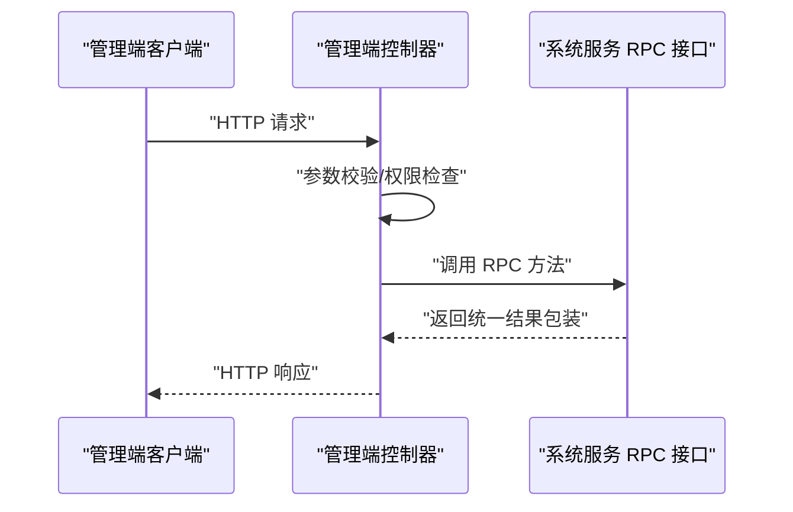
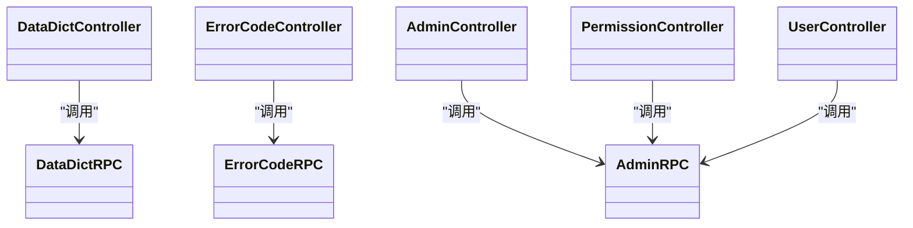

# 系统管理接口

<cite>
**本文引用的文件**
- [DataDictController.java](file://management-web-app/src/main/java/cn/iocoder/mall/managementweb/controller/datadict/DataDictController.java)
- [ErrorCodeController.java](file://management-web-app/src/main/java/cn/iocoder/mall/managementweb/controller/errorcode/ErrorCodeController.java)
- [AdminController.java](file://management-web-app/src/main/java/cn/iocoder/mall/managementweb/controller/admin/AdminController.java)
- [PermissionController.java](file://management-web-app/src/main/java/cn/iocoder/mall/managementweb/controller/permission/PermissionController.java)
- [UserController.java](file://management-web-app/src/main/java/cn/iocoder/mall/managementweb/controller/user/UserController.java)
- [DataDictRPC.java](file://system-service-project/system-service-api/src/main/java/cn/iocoder/mall/systemservice/rpc/datadict/DataDictRPC.java)
- [ErrorCodeRPC.java](file://system-service-project/system-service-api/src/main/java/cn/iocoder/mall/systemservice/rpc/errorcode/ErrorCodeRPC.java)
- [AdminRPC.java](file://system-service-project/system-service-api/src/main/java/cn/iocoder/mall/systemservice/rpc/admin/AdminRPC.java)
</cite>

## 目录
1. [简介](#简介)
2. [项目结构](#项目结构)
3. [核心组件](#核心组件)
4. [架构总览](#架构总览)
5. [详细组件分析](#详细组件分析)
6. [依赖分析](#依赖分析)
7. [性能考虑](#性能考虑)
8. [故障排查指南](#故障排查指南)
9. [结论](#结论)
10. [附录](#附录)

## 简介
本文件面向系统管理接口模块，聚焦于以下能力的API规范与实现说明：
- 数据字典：创建、更新、删除、查询、分页、批量查询、全量拉取
- 错误码：自动注册、创建、更新、删除、查询、分页、按分组增量拉取
- 管理员：分页、创建、更新、状态变更
- 权限：角色资源授权、管理员角色授权
- 用户：信息更新、状态变更、单个/批量/分页查询

同时覆盖数据字典层级结构、错误码分组与版本化策略、权限控制模型、用户状态管理机制，并提供系统运维示例（配置变更、日志分析、用户行为追踪）、接口日志记录策略、数据安全保护与性能监控建议，以及测试与运维最佳实践。

## 项目结构
系统管理接口采用“管理端 Web 应用 + RPC 接口定义”的分层设计：
- 管理端 Web 应用暴露 REST API，负责鉴权、参数校验、调用系统服务 RPC 接口并返回统一结果包装
- 系统服务 RPC 接口定义了数据字典、错误码、管理员等领域的领域接口契约
- 权限注解用于细粒度控制接口访问

图表来源
- [DataDictController.java:1-89](file://management-web-app/src/main/java/cn/iocoder/mall/managementweb/controller/datadict/DataDictController.java#L1-L89)
- [ErrorCodeController.java:1-74](file://management-web-app/src/main/java/cn/iocoder/mall/managementweb/controller/errorcode/ErrorCodeController.java#L1-L74)
- [AdminController.java:1-68](file://management-web-app/src/main/java/cn/iocoder/mall/managementweb/controller/admin/AdminController.java#L1-L68)
- [PermissionController.java:1-67](file://management-web-app/src/main/java/cn/iocoder/mall/managementweb/controller/permission/PermissionController.java#L1-L67)
- [UserController.java:1-69](file://management-web-app/src/main/java/cn/iocoder/mall/managementweb/controller/user/UserController.java#L1-L69)
- [DataDictRPC.java:1-61](file://system-service-project/system-service-api/src/main/java/cn/iocoder/mall/systemservice/rpc/datadict/DataDictRPC.java#L1-L61)
- [ErrorCodeRPC.java:1-81](file://system-service-project/system-service-api/src/main/java/cn/iocoder/mall/systemservice/rpc/errorcode/ErrorCodeRPC.java#L1-L81)
- [AdminRPC.java:1-27](file://system-service-project/system-service-api/src/main/java/cn/iocoder/mall/systemservice/rpc/admin/AdminRPC.java#L1-L27)

章节来源
- [DataDictController.java:1-89](file://management-web-app/src/main/java/cn/iocoder/mall/managementweb/controller/datadict/DataDictController.java#L1-L89)
- [ErrorCodeController.java:1-74](file://management-web-app/src/main/java/cn/iocoder/mall/managementweb/controller/errorcode/ErrorCodeController.java#L1-L74)
- [AdminController.java:1-68](file://management-web-app/src/main/java/cn/iocoder/mall/managementweb/controller/admin/AdminController.java#L1-L68)
- [PermissionController.java:1-67](file://management-web-app/src/main/java/cn/iocoder/mall/managementweb/controller/permission/PermissionController.java#L1-L67)
- [UserController.java:1-69](file://management-web-app/src/main/java/cn/iocoder/mall/managementweb/controller/user/UserController.java#L1-L69)
- [DataDictRPC.java:1-61](file://system-service-project/system-service-api/src/main/java/cn/iocoder/mall/systemservice/rpc/datadict/DataDictRPC.java#L1-L61)
- [ErrorCodeRPC.java:1-81](file://system-service-project/system-service-api/src/main/java/cn/iocoder/mall/systemservice/rpc/errorcode/ErrorCodeRPC.java#L1-L81)
- [AdminRPC.java:1-27](file://system-service-project/system-service-api/src/main/java/cn/iocoder/mall/systemservice/rpc/admin/AdminRPC.java#L1-L27)

## 核心组件
- 数据字典控制器：提供创建、更新、删除、单条、批量、全量查询等接口
- 错误码控制器：提供自动注册、创建、更新、删除、单条、批量、分页查询、按分组增量拉取等接口
- 管理员控制器：提供分页、创建、更新、状态变更接口
- 权限控制器：提供角色资源授权、管理员角色授权接口
- 用户控制器：提供信息更新、状态变更、单个/批量/分页查询接口

章节来源
- [DataDictController.java:34-86](file://management-web-app/src/main/java/cn/iocoder/mall/managementweb/controller/datadict/DataDictController.java#L34-L86)
- [ErrorCodeController.java:34-71](file://management-web-app/src/main/java/cn/iocoder/mall/managementweb/controller/errorcode/ErrorCodeController.java#L34-L71)
- [AdminController.java:37-64](file://management-web-app/src/main/java/cn/iocoder/mall/managementweb/controller/admin/AdminController.java#L37-L64)
- [PermissionController.java:34-63](file://management-web-app/src/main/java/cn/iocoder/mall/managementweb/controller/permission/PermissionController.java#L34-L63)
- [UserController.java:34-66](file://management-web-app/src/main/java/cn/iocoder/mall/managementweb/controller/user/UserController.java#L34-L66)

## 架构总览
管理端 Web 控制器通过权限注解进行访问控制，随后调用系统服务 RPC 接口完成业务处理。RPC 接口定义了清晰的数据结构与职责边界，便于跨模块协作与扩展。

图表来源
- [DataDictController.java:34-38](file://management-web-app/src/main/java/cn/iocoder/mall/managementweb/controller/datadict/DataDictController.java#L34-L38)
- [ErrorCodeController.java:34-38](file://management-web-app/src/main/java/cn/iocoder/mall/managementweb/controller/errorcode/ErrorCodeController.java#L34-L38)
- [AdminController.java:47-48](file://management-web-app/src/main/java/cn/iocoder/mall/managementweb/controller/admin/AdminController.java#L47-L48)
- [PermissionController.java:42-46](file://management-web-app/src/main/java/cn/iocoder/mall/managementweb/controller/permission/PermissionController.java#L42-L46)
- [UserController.java:34-38](file://management-web-app/src/main/java/cn/iocoder/mall/managementweb/controller/user/UserController.java#L34-L38)
- [DataDictRPC.java:21-21](file://system-service-project/system-service-api/src/main/java/cn/iocoder/mall/systemservice/rpc/datadict/DataDictRPC.java#L21-L21)
- [ErrorCodeRPC.java:40-40](file://system-service-project/system-service-api/src/main/java/cn/iocoder/mall/systemservice/rpc/errorcode/ErrorCodeRPC.java#L40-L40)
- [AdminRPC.java:18-18](file://system-service-project/system-service-api/src/main/java/cn/iocoder/mall/systemservice/rpc/admin/AdminRPC.java#L18-L18)

## 详细组件分析

### 数据字典接口
- 接口范围：创建、更新、删除、单条查询、批量查询、全量查询、全量简单查询
- 权限要求：各操作对应独立权限点，避免越权
- 统一返回：所有接口返回统一结果包装，内部封装业务结果或错误信息

接口清单
- POST /data-dict/create
  - 权限：system:data-dict:create
  - 请求体：创建数据字典 DTO
  - 返回：新增数据字典编号
- POST /data-dict/update
  - 权限：system:data-dict:update
  - 请求体：更新数据字典 DTO
  - 返回：布尔成功标记
- POST /data-dict/delete
  - 权限：system:data-dict:delete
  - 查询参数：dataDictId
  - 返回：布尔成功标记
- GET /data-dict/get
  - 权限：system:data-dict:list
  - 查询参数：dataDictId
  - 返回：单个数据字典详情
- GET /data-dict/list
  - 权限：system:data-dict:list
  - 查询参数：dataDictIds（数组）
  - 返回：多个数据字典详情
- GET /data-dict/list-all
  - 权限：system:data-dict:list
  - 返回：全量数据字典详情
- GET /data-dict/list-all-simple
  - 无需权限
  - 返回：全量数据字典简版信息（常用于前端缓存）

数据字典层级结构
- 字典项具备键值对属性，支持分组与层级组织
- 全量简单查询用于前端本地缓存，减少重复拉取
- 批量查询与全量查询用于后台管理与同步场景

章节来源
- [DataDictController.java:34-86](file://management-web-app/src/main/java/cn/iocoder/mall/managementweb/controller/datadict/DataDictController.java#L34-L86)
- [DataDictRPC.java:13-60](file://system-service-project/system-service-api/src/main/java/cn/iocoder/mall/systemservice/rpc/datadict/DataDictRPC.java#L13-L60)

### 错误码接口
- 接口范围：自动注册、创建、更新、删除、单条查询、批量查询、分页查询、按分组增量拉取
- 权限要求：各操作对应独立权限点
- 统一返回：所有接口返回统一结果包装

接口清单
- POST /error-code/create
  - 权限：system:error-code:create
  - 请求体：创建错误码 DTO
  - 返回：新增错误码编号
- POST /error-code/update
  - 权限：system:error-code:update
  - 请求体：更新错误码 DTO
  - 返回：布尔成功标记
- POST /error-code/delete
  - 权限：system:error-code:delete
  - 查询参数：errorCodeId
  - 返回：布尔成功标记
- GET /error-code/get
  - 权限：system:error-code:page
  - 查询参数：errorCodeId
  - 返回：单个错误码详情
- GET /error-code/page
  - 权限：system:error-code:page
  - 查询参数：分页查询 DTO
  - 返回：错误码分页结果

错误码分组与版本化策略
- 按业务域分组管理，支持按分组增量拉取以降低网络与存储压力
- 支持自动生成错误码，便于多模块协同维护

章节来源
- [ErrorCodeController.java:34-71](file://management-web-app/src/main/java/cn/iocoder/mall/managementweb/controller/errorcode/ErrorCodeController.java#L34-L71)
- [ErrorCodeRPC.java:15-80](file://system-service-project/system-service-api/src/main/java/cn/iocoder/mall/systemservice/rpc/errorcode/ErrorCodeRPC.java#L15-L80)

### 管理员接口
- 接口范围：分页、创建、更新、状态变更
- 权限要求：分页、创建、更新、状态变更分别受控

接口清单
- GET /admin/page
  - 权限：system:admin:page
  - 查询参数：分页查询 DTO
  - 返回：管理员分页结果
- POST /admin/create
  - 权限：system:admin:create
  - 请求体：创建管理员 DTO
  - 返回：新增管理员编号
- POST /admin/update
  - 权限：system:admin:update
  - 请求体：更新管理员信息 DTO
  - 返回：布尔成功标记
- POST /admin/update-status
  - 权限：system:admin:update-status
  - 请求体：状态变更 DTO
  - 返回：布尔成功标记

章节来源
- [AdminController.java:37-64](file://management-web-app/src/main/java/cn/iocoder/mall/managementweb/controller/admin/AdminController.java#L37-L64)
- [AdminRPC.java:14-26](file://system-service-project/system-service-api/src/main/java/cn/iocoder/mall/systemservice/rpc/admin/AdminRPC.java#L14-L26)

### 权限接口
- 接口范围：角色资源授权、管理员角色授权、查询角色已拥有资源、查询管理员已拥有角色
- 权限要求：角色资源授权、管理员角色授权分别受控

接口清单
- GET /permission/list-role-resources
  - 权限：system:permission:assign-role-resource
  - 查询参数：roleId
  - 返回：角色已拥有资源编号集合
- POST /permission/assign-role-resource
  - 权限：system:permission:assign-role-resource
  - 请求体：角色资源授权 DTO
  - 返回：布尔成功标记
- GET /permission/list-admin-roles
  - 权限：system:permission:assign-admin-role
  - 查询参数：adminId
  - 返回：管理员已拥有角色编号集合
- POST /permission/assign-admin-role
  - 权限：system:permission:assign-admin-role
  - 请求体：管理员角色授权 DTO
  - 返回：布尔成功标记

章节来源
- [PermissionController.java:34-63](file://management-web-app/src/main/java/cn/iocoder/mall/managementweb/controller/permission/PermissionController.java#L34-L63)

### 用户接口
- 接口范围：信息更新、状态变更、单个查询、批量查询、分页查询
- 权限要求：均无需登录态校验，但具体业务可结合业务侧策略使用

接口清单
- POST /user/update-info
  - 请求体：用户信息更新 DTO
  - 返回：布尔成功标记
- POST /user/update-status
  - 请求体：用户状态更新 DTO
  - 返回：布尔成功标记
- GET /user/get
  - 查询参数：userId
  - 返回：用户详情
- GET /user/list
  - 查询参数：userIds（数组）
  - 返回：用户详情列表
- GET /user/page
  - 请求体：分页查询 DTO
  - 返回：用户分页结果

章节来源
- [UserController.java:34-66](file://management-web-app/src/main/java/cn/iocoder/mall/managementweb/controller/user/UserController.java#L34-L66)

## 依赖分析
- 控制器到 RPC 的依赖清晰，控制器仅负责协议适配与权限校验
- 权限注解贯穿控制器层，确保最小权限原则
- 统一返回包装简化前端处理，提升一致性

图表来源
- [DataDictController.java:31-32](file://management-web-app/src/main/java/cn/iocoder/mall/managementweb/controller/datadict/DataDictController.java#L31-L32)
- [ErrorCodeController.java:31-32](file://management-web-app/src/main/java/cn/iocoder/mall/managementweb/controller/errorcode/ErrorCodeController.java#L31-L32)
- [AdminController.java:34-35](file://management-web-app/src/main/java/cn/iocoder/mall/managementweb/controller/admin/AdminController.java#L34-L35)
- [PermissionController.java:31-32](file://management-web-app/src/main/java/cn/iocoder/mall/managementweb/controller/permission/PermissionController.java#L31-L32)
- [UserController.java:31-32](file://management-web-app/src/main/java/cn/iocoder/mall/managementweb/controller/user/UserController.java#L31-L32)
- [DataDictRPC.java:13-13](file://system-service-project/system-service-api/src/main/java/cn/iocoder/mall/systemservice/rpc/datadict/DataDictRPC.java#L13-L13)
- [ErrorCodeRPC.java:15-15](file://system-service-project/system-service-api/src/main/java/cn/iocoder/mall/systemservice/rpc/errorcode/ErrorCodeRPC.java#L15-L15)
- [AdminRPC.java:14-14](file://system-service-project/system-service-api/src/main/java/cn/iocoder/mall/systemservice/rpc/admin/AdminRPC.java#L14-L14)

## 性能考虑
- 分页与批量接口优先：数据字典与错误码的批量/分页接口可显著降低网络与数据库压力
- 增量拉取：错误码按分组与最小更新时间进行增量拉取，避免全量同步带来的开销
- 前端缓存：数据字典全量简单查询用于前端本地缓存，减少重复请求
- 权限前置：控制器层权限校验避免无效调用进入业务层

## 故障排查指南
- 权限不足：若返回权限相关错误，请确认当前管理员是否具备相应权限点
- 参数校验失败：请检查请求参数类型与必填字段是否满足 DTO 约束
- RPC 调用异常：检查系统服务 RPC 实现是否可用，关注服务注册与发现状态
- 统一返回包装：所有接口均返回统一结果包装，错误信息包含在响应体中，便于前端统一处理

## 结论
系统管理接口模块通过清晰的控制器与 RPC 接口划分，实现了数据字典、错误码、管理员、权限与用户管理的统一治理。配合权限注解与统一返回包装，既保证了安全性与一致性，也为后续扩展提供了稳定基础。

## 附录

### 运维示例
- 配置变更
  - 使用错误码自动注册能力批量生成新模块的错误码，避免手工维护遗漏
  - 通过数据字典全量简单查询接口将字典项缓存至前端，降低后端压力
- 日志分析
  - 结合管理员操作与权限变更接口，追踪关键管理动作
  - 对高频接口（如分页、批量查询）进行埋点统计，识别异常流量
- 用户行为追踪
  - 利用用户状态变更与信息更新接口，结合审计日志，回溯用户关键操作轨迹

### 接口日志记录策略
- 访问日志：记录请求时间、IP、URI、方法、耗时、状态码
- 操作日志：对敏感操作（创建、更新、删除、状态变更）记录操作人、对象、变更前后值
- 异常日志：捕获异常并记录堆栈，便于快速定位问题

### 数据安全保护
- 权限控制：基于注解的最小权限原则，避免越权访问
- 参数校验：严格校验请求参数类型与范围，防止注入与越界
- 传输加密：生产环境启用 HTTPS，保障数据在传输过程中的机密性与完整性

### 性能监控方案
- 接口级指标：QPS、P95/P99 延迟、错误率
- 资源级指标：CPU、内存、连接数、GC 次数
- 链路追踪：对关键链路打点，定位慢调用与瓶颈

### 测试方法与运维最佳实践
- 单元测试：针对控制器参数校验与权限注解进行覆盖
- 集成测试：模拟 RPC 调用，验证接口契约与返回结构
- 回归测试：在配置变更与权限调整后，执行关键路径回归
- 变更演练：对高风险接口（创建、删除、状态变更）进行灰度发布与回滚预案