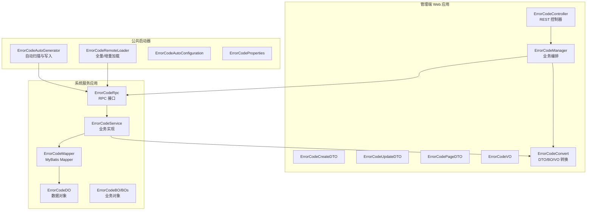
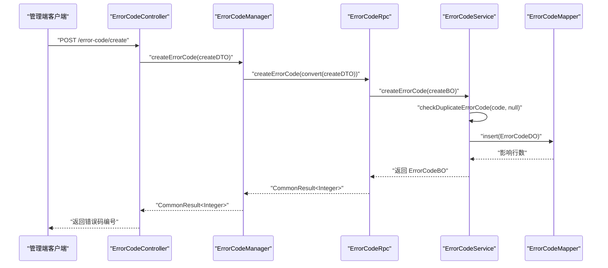
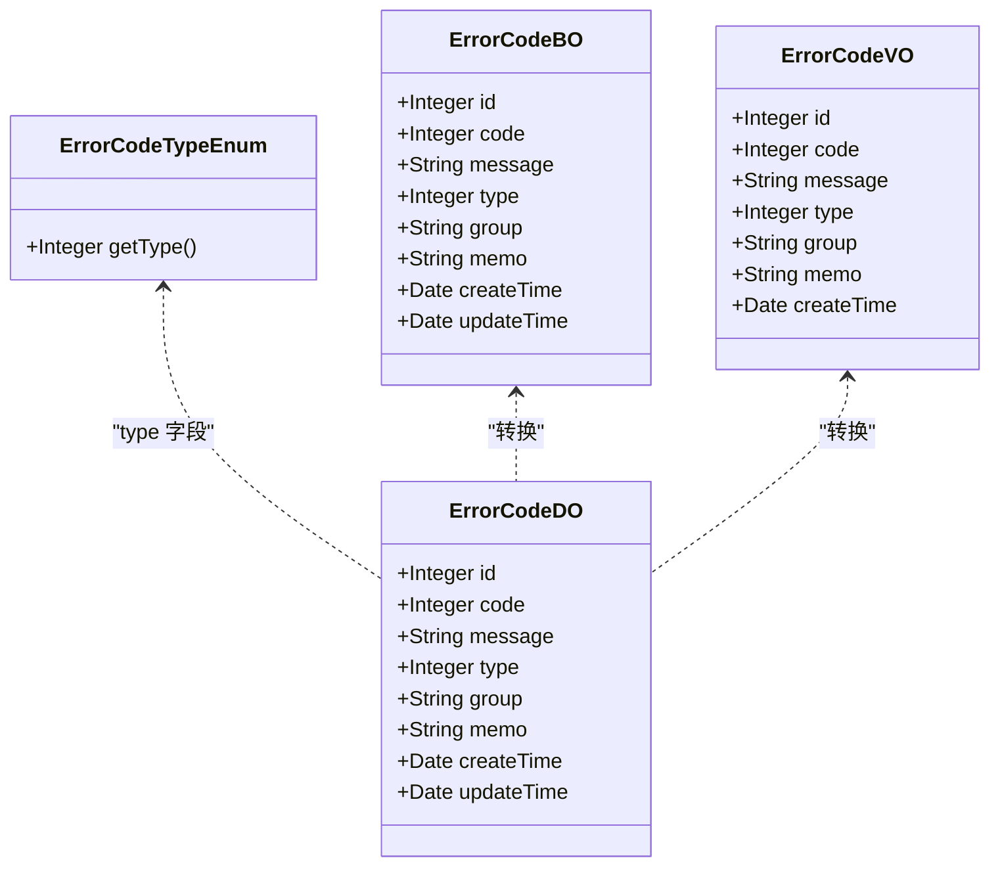
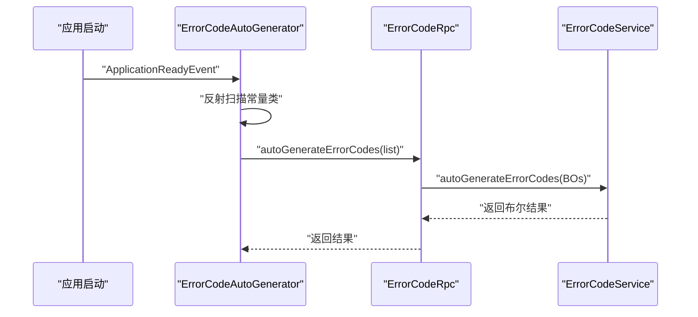
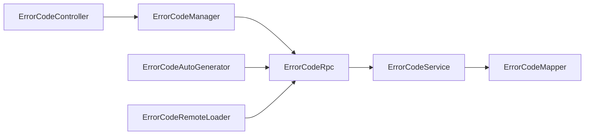
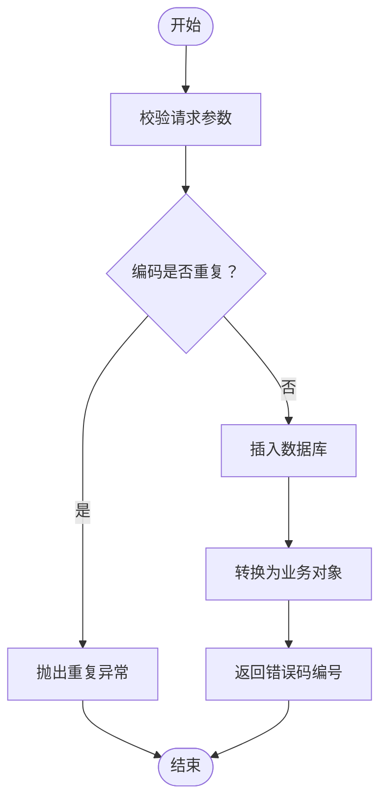

# 错误码管理接口

<cite>
**本文引用的文件**
- [ErrorCodeController.java](file://management-web-app/src/main/java/cn/iocoder/mall/managementweb/controller/errorcode/ErrorCodeController.java)
- [ErrorCodeManager.java](file://management-web-app/src/main/java/cn/iocoder/mall/managementweb/manager/errorcode/ErrorCodeManager.java)
- [ErrorCodeRpc.java](file://system-service-project/system-service-api/src/main/java/cn/iocoder/mall/systemservice/rpc/errorcode/ErrorCodeRpc.java)
- [ErrorCodeService.java](file://system-service-project/system-service-app/src/main/java/cn/iocoder/mall/systemservice/service/errorcode/ErrorCodeService.java)
- [ErrorCodeCreateDTO.java](file://management-web-app/src/main/java/cn/iocoder/mall/managementweb/controller/errorcode/dto/ErrorCodeCreateDTO.java)
- [ErrorCodeUpdateDTO.java](file://management-web-app/src/main/java/cn/iocoder/mall/managementweb/controller/errorcode/dto/ErrorCodeUpdateDTO.java)
- [ErrorCodePageDTO.java](file://management-web-app/src/main/java/cn/iocoder/mall/managementweb/controller/errorcode/dto/ErrorCodePageDTO.java)
- [ErrorCodeVO.java](file://management-web-app/src/main/java/cn/iocoder/mall/managementweb/controller/errorcode/vo/ErrorCodeVO.java)
- [ErrorCodeTypeEnum.java](file://system-service-project/system-service-api/src/main/java/cn/iocoder/mall/systemservice/enums/errorcode/ErrorCodeTypeEnum.java)
- [ErrorCodeAutoGenerator.java](file://common/mall-spring-boot-starter-system-error-code/src/main/java/cn/iocoder/mall/system/errorcode/core/ErrorCodeAutoGenerator.java)
- [ErrorCodeRemoteLoader.java](file://common/mall-spring-boot-starter-system-error-code/src/main/java/cn/iocoder/mall/system/errorcode/core/ErrorCodeRemoteLoader.java)
- [ErrorCodeAutoConfiguration.java](file://common/mall-spring-boot-starter-system-error-code/src/main/java/cn/iocoder/mall/system/errorcode/config/ErrorCodeAutoConfiguration.java)
- [ErrorCodeProperties.java](file://common/mall-spring-boot-starter-system-error-code/src/main/java/cn/iocoder/mall/system/errorcode/config/ErrorCodeProperties.java)
- [ErrorCodeDAO.java](file://system-service-project/system-service-app/src/main/java/cn/iocoder/mall/systemservice/dal/mysql/mapper/errorcode/ErrorCodeMapper.java)
- [ErrorCodeDO.java](file://system-service-project/system-service-app/src/main/java/cn/iocoder/mall/systemservice/dal/mysql/dataobject/errorcode/ErrorCodeDO.java)
- [ErrorCodeConvert.java](file://management-web-app/src/main/java/cn/iocoder/mall/managementweb/convert/errorcode/ErrorCodeConvert.java)
- [ErrorCodeConvert.java](file://system-service-project/system-service-app/src/main/java/cn/iocoder/mall/systemservice/convert/errorcode/ErrorCodeConvert.java)
- [ErrorCodeBO.java](file://system-service-project/system-service-app/src/main/java/cn/iocoder/mall/systemservice/service/errorcode/bo/ErrorCodeBO.java)
- [ErrorCodeCreateBO.java](file://system-service-project/system-service-app/src/main/java/cn/iocoder/mall/systemservice/service/errorcode/bo/ErrorCodeCreateBO.java)
- [ErrorCodeUpdateBO.java](file://system-service-project/system-service-app/src/main/java/cn/iocoder/mall/systemservice/service/errorcode/bo/ErrorCodeUpdateBO.java)
- [ErrorCodePageBO.java](file://system-service-project/system-service-app/src/main/java/cn/iocoder/mall/systemservice/service/errorcode/bo/ErrorCodePageBO.java)
- [ErrorCodeAutoGenerateBO.java](file://system-service-project/system-service-app/src/main/java/cn/iocoder/mall/systemservice/service/errorcode/bo/ErrorCodeAutoGenerateBO.java)
- [ErrorCodeAutoGenerateDTO.java](file://system-service-project/system-service-api/src/main/java/cn/iocoder/mall/systemservice/rpc/errorcode/dto/ErrorCodeAutoGenerateDTO.java)
- [ErrorCodeCreateDTO.java](file://system-service-project/system-service-api/src/main/java/cn/iocoder/mall/systemservice/rpc/errorcode/dto/ErrorCodeCreateDTO.java)
- [ErrorCodeUpdateDTO.java](file://system-service-project/system-service-api/src/main/java/cn/iocoder/mall/systemservice/rpc/errorcode/dto/ErrorCodeUpdateDTO.java)
- [ErrorCodePageDTO.java](file://system-service-project/system-service-api/src/main/java/cn/iocoder/mall/systemservice/rpc/errorcode/dto/ErrorCodePageDTO.java)
- [ErrorCodeVO.java](file://system-service-project/system-service-api/src/main/java/cn/iocoder/mall/systemservice/rpc/errorcode/vo/ErrorCodeVO.java)
- [ErrorCodeConstants.java（示例）](file://pay-service-project/pay-service-api/src/main/java/cn/iocoder/mall/payservice/enums/PayErrorCodeConstants.java)
</cite>

## 目录
1. [简介](#简介)
2. [项目结构](#项目结构)
3. [核心组件](#核心组件)
4. [架构总览](#架构总览)
5. [详细组件分析](#详细组件分析)
6. [依赖关系分析](#依赖关系分析)
7. [性能考量](#性能考量)
8. [故障排查指南](#故障排查指南)
9. [结论](#结论)
10. [附录](#附录)

## 简介
本文件面向“错误码管理接口”模块，提供完整的 API 文档与实现解析，覆盖以下能力：
- 错误码的增删改查：创建、更新、删除、分页查询、详情查询
- 错误码分类与编号规则：类型枚举、唯一约束、自动/手动类型区分
- 状态与版本管理：基于类型字段与更新时间的版本化思路
- 国际化支持：当前仓库未内置国际化，但接口具备扩展空间
- 自动化与动态更新：自动扫描常量类、远程全量/增量加载、定时刷新
- 测试与运维：接口测试建议、监控指标与告警建议

## 项目结构
错误码管理涉及三层：
- 管理端 Web 层：负责对外暴露 REST 接口，鉴权与权限控制
- 系统服务层：负责业务逻辑、数据持久化、RPC 暴露
- 公共启动器：负责自动扫描与远程加载机制

图表来源
- [ErrorCodeController.java:25-73](file://management-web-app/src/main/java/cn/iocoder/mall/managementweb/controller/errorcode/ErrorCodeController.java#L25-L73)
- [ErrorCodeManager.java:21-97](file://management-web-app/src/main/java/cn/iocoder/mall/managementweb/manager/errorcode/ErrorCodeManager.java#L21-L97)
- [ErrorCodeRpc.java:15-80](file://system-service-project/system-service-api/src/main/java/cn/iocoder/mall/systemservice/rpc/errorcode/ErrorCodeRpc.java#L15-L80)
- [ErrorCodeService.java:29-181](file://system-service-project/system-service-app/src/main/java/cn/iocoder/mall/systemservice/service/errorcode/ErrorCodeService.java#L29-L181)
- [ErrorCodeAutoGenerator.java:19-84](file://common/mall-spring-boot-starter-system-error-code/src/main/java/cn/iocoder/mall/system/errorcode/core/ErrorCodeAutoGenerator.java#L19-L84)
- [ErrorCodeRemoteLoader.java:19-71](file://common/mall-spring-boot-starter-system-error-code/src/main/java/cn/iocoder/mall/system/errorcode/core/ErrorCodeRemoteLoader.java#L19-L71)

章节来源
- [ErrorCodeController.java:25-73](file://management-web-app/src/main/java/cn/iocoder/mall/managementweb/controller/errorcode/ErrorCodeController.java#L25-L73)
- [ErrorCodeManager.java:21-97](file://management-web-app/src/main/java/cn/iocoder/mall/managementweb/manager/errorcode/ErrorCodeManager.java#L21-L97)
- [ErrorCodeRpc.java:15-80](file://system-service-project/system-service-api/src/main/java/cn/iocoder/mall/systemservice/rpc/errorcode/ErrorCodeRpc.java#L15-L80)
- [ErrorCodeService.java:29-181](file://system-service-project/system-service-app/src/main/java/cn/iocoder/mall/systemservice/service/errorcode/ErrorCodeService.java#L29-L181)
- [ErrorCodeAutoGenerator.java:19-84](file://common/mall-spring-boot-starter-system-error-code/src/main/java/cn/iocoder/mall/system/errorcode/core/ErrorCodeAutoGenerator.java#L19-L84)
- [ErrorCodeRemoteLoader.java:19-71](file://common/mall-spring-boot-starter-system-error-code/src/main/java/cn/iocoder/mall/system/errorcode/core/ErrorCodeRemoteLoader.java#L19-L71)

## 核心组件
- 管理端控制器：提供 REST 接口，完成权限校验与参数封装
- 管理端编排器：调用 RPC，统一处理返回结果并转换数据
- 系统服务 RPC：定义对外暴露的错误码 RPC 接口
- 系统服务实现：执行业务逻辑、数据访问与类型校验
- 自动化组件：扫描常量类并写入系统服务，远程加载并定时刷新

章节来源
- [ErrorCodeController.java:25-73](file://management-web-app/src/main/java/cn/iocoder/mall/managementweb/controller/errorcode/ErrorCodeController.java#L25-L73)
- [ErrorCodeManager.java:21-97](file://management-web-app/src/main/java/cn/iocoder/mall/managementweb/manager/errorcode/ErrorCodeManager.java#L21-L97)
- [ErrorCodeRpc.java:15-80](file://system-service-project/system-service-api/src/main/java/cn/iocoder/mall/systemservice/rpc/errorcode/ErrorCodeRpc.java#L15-L80)
- [ErrorCodeService.java:29-181](file://system-service-project/system-service-app/src/main/java/cn/iocoder/mall/systemservice/service/errorcode/ErrorCodeService.java#L29-L181)
- [ErrorCodeAutoGenerator.java:19-84](file://common/mall-spring-boot-starter-system-error-code/src/main/java/cn/iocoder/mall/system/errorcode/core/ErrorCodeAutoGenerator.java#L19-L84)
- [ErrorCodeRemoteLoader.java:19-71](file://common/mall-spring-boot-starter-system-error-code/src/main/java/cn/iocoder/mall/system/errorcode/core/ErrorCodeRemoteLoader.java#L19-L71)

## 架构总览
错误码管理采用“管理端 Web → 系统服务 RPC → 系统服务实现”的分层架构。管理端负责鉴权与参数校验，系统服务负责业务与持久化，公共启动器负责自动化与动态加载。

图表来源
- [ErrorCodeController.java:34-39](file://management-web-app/src/main/java/cn/iocoder/mall/managementweb/controller/errorcode/ErrorCodeController.java#L34-L39)
- [ErrorCodeManager.java:32-37](file://management-web-app/src/main/java/cn/iocoder/mall/managementweb/manager/errorcode/ErrorCodeManager.java#L32-L37)
- [ErrorCodeRpc.java:34-40](file://system-service-project/system-service-api/src/main/java/cn/iocoder/mall/systemservice/rpc/errorcode/ErrorCodeRpc.java#L34-L40)
- [ErrorCodeService.java:43-50](file://system-service-project/system-service-app/src/main/java/cn/iocoder/mall/systemservice/service/errorcode/ErrorCodeService.java#L43-L50)
- [ErrorCodeDAO.java](file://system-service-project/system-service-app/src/main/java/cn/iocoder/mall/systemservice/dal/mysql/mapper/errorcode/ErrorCodeMapper.java)

## 详细组件分析

### API 规范与接口清单
以下为错误码管理接口的完整规范，涵盖 HTTP 方法、URL 路径、请求参数、响应格式与权限要求。

- 创建错误码
  - 方法与路径：POST /error-code/create
  - 权限标识：system:error-code:create
  - 请求体：ErrorCodeCreateDTO
    - code：整数，错误码编码，必填
    - message：字符串，错误提示，必填
    - group：字符串，错误码分组，必填
    - memo：字符串，备注，可选
  - 响应：CommonResult<Integer>，data 为新创建的错误码编号
  - 失败场景：编码重复时抛出重复异常；权限不足时拒绝

- 更新错误码
  - 方法与路径：POST /error-code/update
  - 权限标识：system:error-code:update
  - 请求体：ErrorCodeUpdateDTO
    - id：整数，错误码编号，必填
    - code：整数，错误码编码，必填
    - message：字符串，错误提示，必填
    - group：字符串，错误码分组，必填
    - memo：字符串，备注，可选
  - 响应：CommonResult<Boolean>，data 为 true
  - 失败场景：目标错误码不存在、编码重复、权限不足

- 删除错误码
  - 方法与路径：POST /error-code/delete
  - 权限标识：system:error-code:delete
  - 查询参数：errorCodeId（整数）
  - 响应：CommonResult<Boolean>，data 为 true
  - 失败场景：目标错误码不存在、权限不足

- 获取错误码详情
  - 方法与路径：GET /error-code/get
  - 权限标识：system:error-code:page
  - 查询参数：errorCodeId（整数）
  - 响应：CommonResult<ErrorCodeVO>
  - 失败场景：目标错误码不存在、权限不足

- 分页查询错误码
  - 方法与路径：GET /error-code/page
  - 权限标识：system:error-code:page
  - 查询参数：ErrorCodePageDTO（继承分页参数）
    - code：整数，可选
    - message：字符串，可选
    - group：字符串，可选
  - 响应：CommonResult<PageResult<ErrorCodeVO>>
  - 失败场景：权限不足

章节来源
- [ErrorCodeController.java:34-71](file://management-web-app/src/main/java/cn/iocoder/mall/managementweb/controller/errorcode/ErrorCodeController.java#L34-L71)
- [ErrorCodeCreateDTO.java:12-26](file://management-web-app/src/main/java/cn/iocoder/mall/managementweb/controller/errorcode/dto/ErrorCodeCreateDTO.java#L12-L26)
- [ErrorCodeUpdateDTO.java:12-29](file://management-web-app/src/main/java/cn/iocoder/mall/managementweb/controller/errorcode/dto/ErrorCodeUpdateDTO.java#L12-L29)
- [ErrorCodePageDTO.java:12-21](file://management-web-app/src/main/java/cn/iocoder/mall/managementweb/controller/errorcode/dto/ErrorCodePageDTO.java#L12-L21)
- [ErrorCodeVO.java:11-28](file://management-web-app/src/main/java/cn/iocoder/mall/managementweb/controller/errorcode/vo/ErrorCodeVO.java#L11-L28)

### 数据模型与类型体系
- 错误码类型枚举：区分“自动生成”与“手动编辑”，用于控制自动同步策略
- 错误码数据对象：包含编码、消息、分组、类型、备注、创建/更新时间等字段
- 业务对象与传输对象：在系统服务层与管理端之间传递

图表来源
- [ErrorCodeTypeEnum.java:15-43](file://system-service-project/system-service-api/src/main/java/cn/iocoder/mall/systemservice/enums/errorcode/ErrorCodeTypeEnum.java#L15-L43)
- [ErrorCodeDO.java](file://system-service-project/system-service-app/src/main/java/cn/iocoder/mall/systemservice/dal/mysql/dataobject/errorcode/ErrorCodeDO.java)
- [ErrorCodeBO.java](file://system-service-project/system-service-app/src/main/java/cn/iocoder/mall/systemservice/service/errorcode/bo/ErrorCodeBO.java)
- [ErrorCodeVO.java:11-28](file://management-web-app/src/main/java/cn/iocoder/mall/managementweb/controller/errorcode/vo/ErrorCodeVO.java#L11-L28)

章节来源
- [ErrorCodeTypeEnum.java:15-43](file://system-service-project/system-service-api/src/main/java/cn/iocoder/mall/systemservice/enums/errorcode/ErrorCodeTypeEnum.java#L15-L43)
- [ErrorCodeDO.java](file://system-service-project/system-service-app/src/main/java/cn/iocoder/mall/systemservice/dal/mysql/dataobject/errorcode/ErrorCodeDO.java)
- [ErrorCodeBO.java](file://system-service-project/system-service-app/src/main/java/cn/iocoder/mall/systemservice/service/errorcode/bo/ErrorCodeBO.java)
- [ErrorCodeVO.java:11-28](file://management-web-app/src/main/java/cn/iocoder/mall/managementweb/controller/errorcode/vo/ErrorCodeVO.java#L11-L28)

### 编号规则与唯一性约束
- 编码唯一：同一编码在系统内唯一，创建/更新时进行重复校验
- 分组隔离：不同分组可使用相同编码，按分组维度隔离
- 类型区分：手动编辑类型禁止被自动同步覆盖，避免破坏人工维护

章节来源
- [ErrorCodeService.java:162-174](file://system-service-project/system-service-app/src/main/java/cn/iocoder/mall/systemservice/service/errorcode/ErrorCodeService.java#L162-L174)
- [ErrorCodeAutoGenerator.java:62-74](file://common/mall-spring-boot-starter-system-error-code/src/main/java/cn/iocoder/mall/system/errorcode/core/ErrorCodeAutoGenerator.java#L62-L74)

### 状态与版本管理
- 版本依据：以“类型 + 更新时间”作为版本信号
  - 类型：区分自动/手动，决定是否允许自动同步
  - 更新时间：用于远程增量加载的边界
- 同步策略：
  - 全量加载：应用启动后首次拉取
  - 增量加载：定时任务按最大更新时间增量拉取

章节来源
- [ErrorCodeTypeEnum.java:15-43](file://system-service-project/system-service-api/src/main/java/cn/iocoder/mall/systemservice/enums/errorcode/ErrorCodeTypeEnum.java#L15-L43)
- [ErrorCodeRemoteLoader.java:39-69](file://common/mall-spring-boot-starter-system-error-code/src/main/java/cn/iocoder/mall/system/errorcode/core/ErrorCodeRemoteLoader.java#L39-L69)

### 国际化支持
- 当前仓库未内置国际化框架与多语言存储
- 接口具备扩展空间：可在 VO 中增加 locale 字段，或在 RPC 层增加语言参数，配合系统服务侧的消息模板与本地化存储

章节来源
- [ErrorCodeVO.java:11-28](file://management-web-app/src/main/java/cn/iocoder/mall/managementweb/controller/errorcode/vo/ErrorCodeVO.java#L11-L28)
- [ErrorCodeVO.java](file://system-service-project/system-service-api/src/main/java/cn/iocoder/mall/systemservice/rpc/errorcode/vo/ErrorCodeVO.java)

### 自动化与动态更新
- 自动扫描与写入
  - 在应用启动完成后异步扫描指定常量类，将错误码批量写入系统服务
  - 仅对“自动生成”类型的错误码进行写入，避免覆盖“手动编辑”
- 远程加载与刷新
  - 启动时全量加载指定分组的错误码至本地缓存
  - 定时任务按最大更新时间增量刷新，保持本地与远端一致

图表来源
- [ErrorCodeAutoGenerator.java:44-82](file://common/mall-spring-boot-starter-system-error-code/src/main/java/cn/iocoder/mall/system/errorcode/core/ErrorCodeAutoGenerator.java#L44-L82)
- [ErrorCodeRpc.java:27-32](file://system-service-project/system-service-api/src/main/java/cn/iocoder/mall/systemservice/rpc/errorcode/ErrorCodeRpc.java#L27-L32)
- [ErrorCodeService.java:68-105](file://system-service-project/system-service-app/src/main/java/cn/iocoder/mall/systemservice/service/errorcode/ErrorCodeService.java#L68-L105)

章节来源
- [ErrorCodeAutoGenerator.java:19-84](file://common/mall-spring-boot-starter-system-error-code/src/main/java/cn/iocoder/mall/system/errorcode/core/ErrorCodeAutoGenerator.java#L19-L84)
- [ErrorCodeRemoteLoader.java:19-71](file://common/mall-spring-boot-starter-system-error-code/src/main/java/cn/iocoder/mall/system/errorcode/core/ErrorCodeRemoteLoader.java#L19-L71)

### 示例：错误码管理实践
- 自定义错误码创建
  - 在服务模块的错误码常量类中定义新的错误码常量
  - 通过自动扫描机制写入系统服务（类型为自动生成）
  - 管理员在管理端将类型改为手动编辑，锁定自动同步
- 错误码版本管理
  - 通过类型字段与更新时间实现版本化
  - 手动编辑后，自动同步不再覆盖该编码
- 批量操作
  - 使用自动扫描批量写入
  - 使用分页查询与列表查询进行批量展示与筛选

章节来源
- [ErrorCodeAutoGenerator.java:44-82](file://common/mall-spring-boot-starter-system-error-code/src/main/java/cn/iocoder/mall/system/errorcode/core/ErrorCodeAutoGenerator.java#L44-L82)
- [ErrorCodeService.java:149-152](file://system-service-project/system-service-app/src/main/java/cn/iocoder/mall/systemservice/service/errorcode/ErrorCodeService.java#L149-L152)
- [ErrorCodeController.java:66-71](file://management-web-app/src/main/java/cn/iocoder/mall/managementweb/controller/errorcode/ErrorCodeController.java#L66-L71)

## 依赖关系分析
- 控制器依赖管理端编排器
- 管理端编排器通过 Dubbo 引用系统服务 RPC
- 系统服务 RPC 实现由系统服务实现类提供
- 系统服务实现依赖数据访问层与转换层
- 自动化组件与远程加载组件通过 RPC 与系统服务交互

图表来源
- [ErrorCodeController.java:25-73](file://management-web-app/src/main/java/cn/iocoder/mall/managementweb/controller/errorcode/ErrorCodeController.java#L25-L73)
- [ErrorCodeManager.java:21-97](file://management-web-app/src/main/java/cn/iocoder/mall/managementweb/manager/errorcode/ErrorCodeManager.java#L21-L97)
- [ErrorCodeRpc.java:15-80](file://system-service-project/system-service-api/src/main/java/cn/iocoder/mall/systemservice/rpc/errorcode/ErrorCodeRpc.java#L15-L80)
- [ErrorCodeService.java:29-181](file://system-service-project/system-service-app/src/main/java/cn/iocoder/mall/systemservice/service/errorcode/ErrorCodeService.java#L29-L181)
- [ErrorCodeAutoGenerator.java:19-84](file://common/mall-spring-boot-starter-system-error-code/src/main/java/cn/iocoder/mall/system/errorcode/core/ErrorCodeAutoGenerator.java#L19-L84)
- [ErrorCodeRemoteLoader.java:19-71](file://common/mall-spring-boot-starter-system-error-code/src/main/java/cn/iocoder/mall/system/errorcode/core/ErrorCodeRemoteLoader.java#L19-L71)

章节来源
- [ErrorCodeController.java:25-73](file://management-web-app/src/main/java/cn/iocoder/mall/managementweb/controller/errorcode/ErrorCodeController.java#L25-L73)
- [ErrorCodeManager.java:21-97](file://management-web-app/src/main/java/cn/iocoder/mall/managementweb/manager/errorcode/ErrorCodeManager.java#L21-L97)
- [ErrorCodeRpc.java:15-80](file://system-service-project/system-service-api/src/main/java/cn/iocoder/mall/systemservice/rpc/errorcode/ErrorCodeRpc.java#L15-L80)
- [ErrorCodeService.java:29-181](file://system-service-project/system-service-app/src/main/java/cn/iocoder/mall/systemservice/service/errorcode/ErrorCodeService.java#L29-L181)
- [ErrorCodeAutoGenerator.java:19-84](file://common/mall-spring-boot-starter-system-error-code/src/main/java/cn/iocoder/mall/system/errorcode/core/ErrorCodeAutoGenerator.java#L19-L84)
- [ErrorCodeRemoteLoader.java:19-71](file://common/mall-spring-boot-starter-system-error-code/src/main/java/cn/iocoder/mall/system/errorcode/core/ErrorCodeRemoteLoader.java#L19-L71)

## 性能考量
- 自动扫描与写入：异步执行，避免阻塞应用启动
- 增量加载：基于最大更新时间，减少网络与内存开销
- 批量写入：系统服务侧对自动生成的错误码进行批量处理，避免频繁插入
- 分页查询：系统服务侧使用分页查询，前端传入合理页大小

章节来源
- [ErrorCodeAutoGenerator.java:44-82](file://common/mall-spring-boot-starter-system-error-code/src/main/java/cn/iocoder/mall/system/errorcode/core/ErrorCodeAutoGenerator.java#L44-L82)
- [ErrorCodeRemoteLoader.java:53-69](file://common/mall-spring-boot-starter-system-error-code/src/main/java/cn/iocoder/mall/system/errorcode/core/ErrorCodeRemoteLoader.java#L53-L69)
- [ErrorCodeService.java:68-105](file://system-service-project/system-service-app/src/main/java/cn/iocoder/mall/systemservice/service/errorcode/ErrorCodeService.java#L68-L105)
- [ErrorCodeService.java:149-152](file://system-service-project/system-service-app/src/main/java/cn/iocoder/mall/systemservice/service/errorcode/ErrorCodeService.java#L149-L152)

## 故障排查指南
- 创建/更新失败：检查编码是否重复、目标错误码是否存在
- 删除失败：确认目标错误码是否存在
- 权限不足：检查用户权限与接口权限标识
- 自动同步未生效：确认常量类字段类型为错误码常量、分组正确、类型为自动生成
- 远程加载异常：检查 RPC 连通性、分组参数与最小更新时间

章节来源
- [ErrorCodeService.java:43-66](file://system-service-project/system-service-app/src/main/java/cn/iocoder/mall/systemservice/service/errorcode/ErrorCodeService.java#L43-L66)
- [ErrorCodeService.java:112-119](file://system-service-project/system-service-app/src/main/java/cn/iocoder/mall/systemservice/service/errorcode/ErrorCodeService.java#L112-L119)
- [ErrorCodeAutoGenerator.java:44-82](file://common/mall-spring-boot-starter-system-error-code/src/main/java/cn/iocoder/mall/system/errorcode/core/ErrorCodeAutoGenerator.java#L44-L82)
- [ErrorCodeRemoteLoader.java:39-69](file://common/mall-spring-boot-starter-system-error-code/src/main/java/cn/iocoder/mall/system/errorcode/core/ErrorCodeRemoteLoader.java#L39-L69)

## 结论
错误码管理接口通过清晰的分层设计与完善的自动化机制，实现了从“常量定义 → 系统入库 → 远程加载 → 动态刷新”的闭环。接口提供了标准的增删改查能力与权限控制，结合类型与更新时间实现了版本化管理。未来可在消息模板与本地化方面进一步扩展，以满足国际化需求。

## 附录

### API 调用流程图（创建）

图表来源
- [ErrorCodeService.java:43-50](file://system-service-project/system-service-app/src/main/java/cn/iocoder/mall/systemservice/service/errorcode/ErrorCodeService.java#L43-L50)
- [ErrorCodeService.java:162-174](file://system-service-project/system-service-app/src/main/java/cn/iocoder/mall/systemservice/service/errorcode/ErrorCodeService.java#L162-L174)

### 配置与启动器
- 自动配置类与属性类负责装配自动化组件与远程加载组件
- 常量类扫描需在配置中指定分组与常量类全名

章节来源
- [ErrorCodeAutoConfiguration.java](file://common/mall-spring-boot-starter-system-error-code/src/main/java/cn/iocoder/mall/system/errorcode/config/ErrorCodeAutoConfiguration.java)
- [ErrorCodeProperties.java](file://common/mall-spring-boot-starter-system-error-code/src/main/java/cn/iocoder/mall/system/errorcode/config/ErrorCodeProperties.java)
- [ErrorCodeAutoGenerator.java:35-42](file://common/mall-spring-boot-starter-system-error-code/src/main/java/cn/iocoder/mall/system/errorcode/core/ErrorCodeAutoGenerator.java#L35-L42)

### 示例：服务模块错误码常量类
- 在各服务模块的错误码常量类中定义错误码常量
- 通过自动扫描机制写入系统服务

章节来源
- [ErrorCodeConstants.java（示例）](file://pay-service-project/pay-service-api/src/main/java/cn/iocoder/mall/payservice/enums/PayErrorCodeConstants.java)