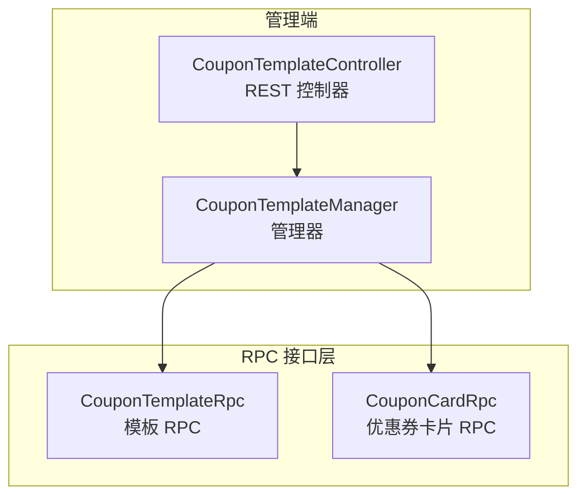
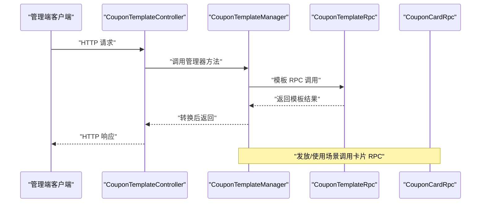
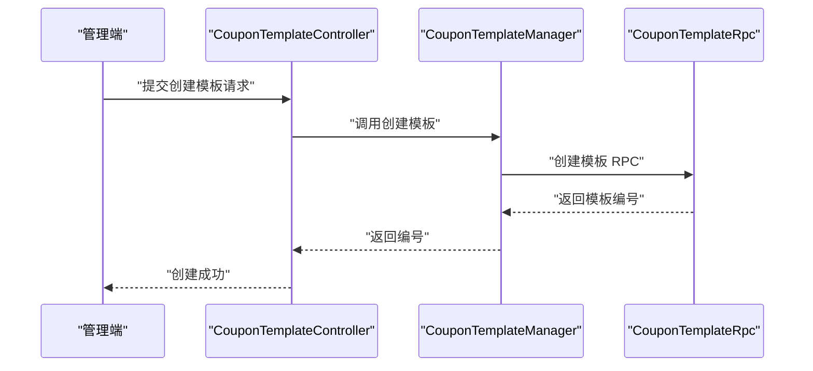
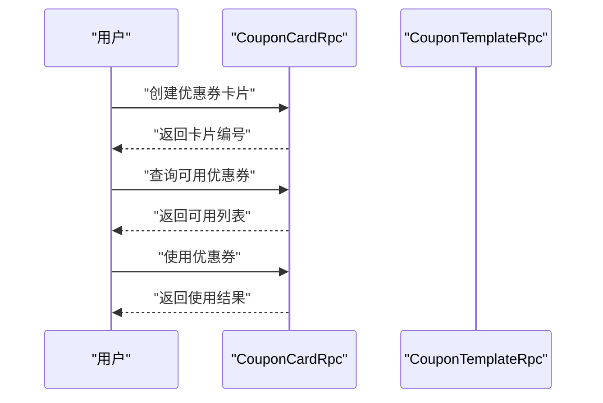
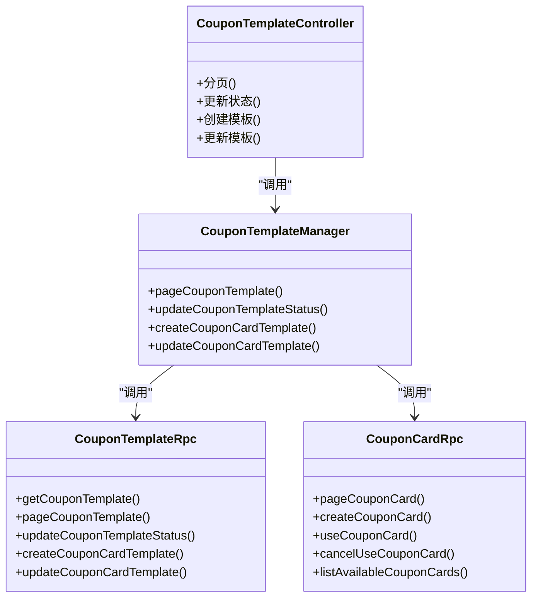

# 优惠券模板接口

<cite>
**本文引用的文件**
- [CouponTemplateController.java](file://management-web-app/src/main/java/cn/iocoder/mall/managementweb/controller/promotion/coupon/CouponTemplateController.java)
- [CouponTemplateManager.java](file://management-web-app/src/main/java/cn/iocoder/mall/managementweb/manager/promotion/coupon/CouponTemplateManager.java)
- [CouponTemplateRpc.java](file://promotion-service-project/promotion-service-api/src/main/java/cn/iocoder/mall/promotion/api/rpc/coupon/CouponTemplateRpc.java)
- [CouponCardRpc.java](file://promotion-service-project/promotion-service-api/src/main/java/cn/iocoder/mall/promotion/api/rpc/coupon/CouponCardRpc.java)
- [CouponCardTemplateCreateReqDTO.java](file://promotion-service-project/promotion-service-api/src/main/java/cn/iocoder/mall/promotion/api/rpc/coupon/dto/template/CouponCardTemplateCreateReqDTO.java)
- [CouponCardTemplateUpdateReqDTO.java](file://promotion-service-project/promotion-service-api/src/main/java/cn/iocoder/mall/promotion/api/rpc/coupon/dto/template/CouponCardTemplateUpdateReqDTO.java)
- [CouponCardCreateReqDTO.java](file://promotion-service-project/promotion-service-api/src/main/java/cn/iocoder/mall/promotion/api/rpc/coupon/dto/card/CouponCardCreateReqDTO.java)
- [CouponTemplateTypeEnum.java](file://promotion-service-project/promotion-service-api/src/main/java/cn/iocoder/mall/promotion/api/enums/coupon/template/CouponTemplateTypeEnum.java)
- [CouponTemplateStatusEnum.java](file://promotion-service-project/promotion-service-api/src/main/java/cn/iocoder/mall/promotion/api/enums/coupon/template/CouponTemplateStatusEnum.java)
- [CouponTemplateDateTypeEnum.java](file://promotion-service-project/promotion-service-api/src/main/java/cn/iocoder/mall/promotion/api/enums/coupon/template/CouponTemplateDateTypeEnum.java)
- [CouponCardStatusEnum.java](file://promotion-service-project/promotion-service-api/src/main/java/cn/iocoder/mall/promotion/api/enums/coupon/card/CouponCardStatusEnum.java)
- [CouponCardTakeTypeEnum.java](file://promotion-service-project/promotion-service-api/src/main/java/cn/iocoder/mall/promotion/api/enums/coupon/card/CouponCardTakeTypeEnum.java)
- [CouponTemplateCardCreateReqVO.java](file://management-web-app/src/main/java/cn/iocoder/mall/managementweb/controller/promotion/coupon/vo/template/CouponTemplateCardCreateReqVO.java)
</cite>

## 目录
1. [简介](#简介)
2. [项目结构](#项目结构)
3. [核心组件](#核心组件)
4. [架构总览](#架构总览)
5. [详细组件分析](#详细组件分析)
6. [依赖分析](#依赖分析)
7. [性能考虑](#性能考虑)
8. [故障排查指南](#故障排查指南)
9. [结论](#结论)
10. [附录](#附录)

## 简介
本文件面向“优惠券模板接口”的管理能力，覆盖优惠券模板的创建、配置、状态变更、分页查询等管理接口，并对优惠券类型、使用门槛、可用范围、有效期设置、发放策略、使用限制、叠加规则、风控机制等业务逻辑进行系统化说明。同时提供接口测试方法与效果分析建议，以及数据安全、防刷、并发控制与性能优化的技术要点。

## 项目结构
优惠券模板相关能力由“管理端 Web 控制器 + 管理端 Manager + RPC 接口”三层构成，管理端通过 Dubbo 调用促销服务的 RPC 接口完成模板与优惠券卡片的管理。

图表来源
- [CouponTemplateController.java:23-71](file://management-web-app/src/main/java/cn/iocoder/mall/managementweb/controller/promotion/coupon/CouponTemplateController.java#L23-L71)
- [CouponTemplateManager.java:17-54](file://management-web-app/src/main/java/cn/iocoder/mall/managementweb/manager/promotion/coupon/CouponTemplateManager.java#L17-L54)
- [CouponTemplateRpc.java:10-57](file://promotion-service-project/promotion-service-api/src/main/java/cn/iocoder/mall/promotion/api/rpc/coupon/CouponTemplateRpc.java#L10-L57)
- [CouponCardRpc.java:12-54](file://promotion-service-project/promotion-service-api/src/main/java/cn/iocoder/mall/promotion/api/rpc/coupon/CouponCardRpc.java#L12-L54)

章节来源
- [CouponTemplateController.java:23-71](file://management-web-app/src/main/java/cn/iocoder/mall/managementweb/controller/promotion/coupon/CouponTemplateController.java#L23-L71)
- [CouponTemplateManager.java:17-54](file://management-web-app/src/main/java/cn/iocoder/mall/managementweb/manager/promotion/coupon/CouponTemplateManager.java#L17-L54)
- [CouponTemplateRpc.java:10-57](file://promotion-service-project/promotion-service-api/src/main/java/cn/iocoder/mall/promotion/api/rpc/coupon/CouponTemplateRpc.java#L10-L57)
- [CouponCardRpc.java:12-54](file://promotion-service-project/promotion-service-api/src/main/java/cn/iocoder/mall/promotion/api/rpc/coupon/CouponCardRpc.java#L12-L54)

## 核心组件
- 管理端控制器：提供模板分页、状态更新、模板创建与更新等 HTTP 接口。
- 管理端管理器：负责参数校验、VO/DTO 转换、调用 RPC 接口并处理返回结果。
- RPC 接口：
  - 模板 RPC：提供模板的创建、更新、分页、状态更新等能力。
  - 卡片 RPC：提供优惠券卡片的分页、发放、使用、取消使用、可用列表等能力。

章节来源
- [CouponTemplateController.java:23-71](file://management-web-app/src/main/java/cn/iocoder/mall/managementweb/controller/promotion/coupon/CouponTemplateController.java#L23-L71)
- [CouponTemplateManager.java:17-54](file://management-web-app/src/main/java/cn/iocoder/mall/managementweb/manager/promotion/coupon/CouponTemplateManager.java#L17-L54)
- [CouponTemplateRpc.java:10-57](file://promotion-service-project/promotion-service-api/src/main/java/cn/iocoder/mall/promotion/api/rpc/coupon/CouponTemplateRpc.java#L10-L57)
- [CouponCardRpc.java:12-54](file://promotion-service-project/promotion-service-api/src/main/java/cn/iocoder/mall/promotion/api/rpc/coupon/CouponCardRpc.java#L12-L54)

## 架构总览
下图展示从管理端到 RPC 的调用链路与职责分工：

图表来源
- [CouponTemplateController.java:34-71](file://management-web-app/src/main/java/cn/iocoder/mall/managementweb/controller/promotion/coupon/CouponTemplateController.java#L34-L71)
- [CouponTemplateManager.java:26-52](file://management-web-app/src/main/java/cn/iocoder/mall/managementweb/manager/promotion/coupon/CouponTemplateManager.java#L26-L52)
- [CouponTemplateRpc.java:14-56](file://promotion-service-project/promotion-service-api/src/main/java/cn/iocoder/mall/promotion/api/rpc/coupon/CouponTemplateRpc.java#L14-L56)
- [CouponCardRpc.java:14-52](file://promotion-service-project/promotion-service-api/src/main/java/cn/iocoder/mall/promotion/api/rpc/coupon/CouponCardRpc.java#L14-L52)

## 详细组件分析

### 接口清单与规范

- 获取模板分页
  - 方法与路径：GET /promotion/coupon-template/page
  - 权限标识：promotion:coupon-template:page
  - 请求参数：分页与筛选条件（见请求 VO）
  - 响应：分页结果，包含模板详情
  - 章节来源
    - [CouponTemplateController.java:34-39](file://management-web-app/src/main/java/cn/iocoder/mall/managementweb/controller/promotion/coupon/CouponTemplateController.java#L34-L39)

- 更新模板状态
  - 方法与路径：POST /promotion/coupon-template/update-status
  - 权限标识：promotion:coupon-template:update-status
  - 请求参数：id（模板编号）、status（状态值）
  - 响应：布尔成功
  - 章节来源
    - [CouponTemplateController.java:41-52](file://management-web-app/src/main/java/cn/iocoder/mall/managementweb/controller/promotion/coupon/CouponTemplateController.java#L41-L52)

- 创建优惠券模板
  - 方法与路径：POST /promotion/coupon-template/create-card
  - 权限标识：promotion:coupon-template:create-card
  - 请求参数：模板创建参数（标题、描述、配额、总量、使用门槛、可用范围、有效期类型、优惠类型与金额等）
  - 响应：模板编号
  - 章节来源
    - [CouponTemplateController.java:56-61](file://management-web-app/src/main/java/cn/iocoder/mall/managementweb/controller/promotion/coupon/CouponTemplateController.java#L56-L61)

- 更新优惠券模板
  - 方法与路径：POST /promotion/coupon-template/update-card
  - 权限标识：promotion:coupon-template:update-card
  - 请求参数：模板更新参数（标题、描述、配额、总量、可用范围等）
  - 响应：布尔成功
  - 章节来源
    - [CouponTemplateController.java:63-69](file://management-web-app/src/main/java/cn/iocoder/mall/managementweb/controller/promotion/coupon/CouponTemplateController.java#L63-L69)

### 数据模型与字段说明

- 模板基础信息
  - 标题：字符串，长度限制
  - 描述：字符串，长度限制
  - 配额：整数，单用户限领数量
  - 总量：整数，总发放数量
  - 章节来源
    - [CouponCardTemplateCreateReqDTO.java:25-52](file://promotion-service-project/promotion-service-api/src/main/java/cn/iocoder/mall/promotion/api/rpc/coupon/dto/template/CouponCardTemplateCreateReqDTO.java#L25-L52)
    - [CouponCardTemplateUpdateReqDTO.java:21-51](file://promotion-service-project/promotion-service-api/src/main/java/cn/iocoder/mall/promotion/api/rpc/coupon/dto/template/CouponCardTemplateUpdateReqDTO.java#L21-L51)
    - [CouponTemplateCardCreateReqVO.java:25-39](file://management-web-app/src/main/java/cn/iocoder/mall/managementweb/controller/promotion/coupon/vo/template/CouponTemplateCardCreateReqVO.java#L25-L39)

- 使用门槛与可用范围
  - 使用门槛：整数，单位分，0 表示无门槛
  - 可用范围类型：枚举（全部/部分商品/部分分类等）
  - 指定范围值：字符串，逗号分隔的商品/分类编号
  - 章节来源
    - [CouponCardTemplateCreateReqDTO.java:54-79](file://promotion-service-project/promotion-service-api/src/main/java/cn/iocoder/mall/promotion/api/rpc/coupon/dto/template/CouponCardTemplateCreateReqDTO.java#L54-L79)
    - [CouponCardTemplateUpdateReqDTO.java:53-78](file://promotion-service-project/promotion-service-api/src/main/java/cn/iocoder/mall/promotion/api/rpc/coupon/dto/template/CouponCardTemplateUpdateReqDTO.java#L53-L78)
    - [CouponTemplateCardCreateReqVO.java:41-50](file://management-web-app/src/main/java/cn/iocoder/mall/managementweb/controller/promotion/coupon/vo/template/CouponTemplateCardCreateReqVO.java#L41-L50)

- 有效期设置
  - 有效期类型：固定日期/领取日期
  - 固定期限：生效起止时间
  - 领取期限：开始/结束天数
  - 章节来源
    - [CouponCardTemplateCreateReqDTO.java:81-108](file://promotion-service-project/promotion-service-api/src/main/java/cn/iocoder/mall/promotion/api/rpc/coupon/dto/template/CouponCardTemplateCreateReqDTO.java#L81-L108)
    - [CouponTemplateDateTypeEnum.java:10-14](file://promotion-service-project/promotion-service-api/src/main/java/cn/iocoder/mall/promotion/api/enums/coupon/template/CouponTemplateDateTypeEnum.java#L10-L14)
    - [CouponTemplateCardCreateReqVO.java:51-66](file://management-web-app/src/main/java/cn/iocoder/mall/managementweb/controller/promotion/coupon/vo/template/CouponTemplateCardCreateReqVO.java#L51-L66)

- 使用效果
  - 优惠类型：代金券/折扣券
  - 优惠金额：整数，单位分（代金券）
  - 折扣百分比：整数，最大 100（折扣券）
  - 折扣上限：整数，单位分（折扣券）
  - 章节来源
    - [CouponCardTemplateCreateReqDTO.java:111-141](file://promotion-service-project/promotion-service-api/src/main/java/cn/iocoder/mall/promotion/api/rpc/coupon/dto/template/CouponCardTemplateCreateReqDTO.java#L111-L141)
    - [CouponTemplateCardCreateReqVO.java:68-82](file://management-web-app/src/main/java/cn/iocoder/mall/managementweb/controller/promotion/coupon/vo/template/CouponTemplateCardCreateReqVO.java#L68-L82)

- 模板状态与类型
  - 模板状态：启用/禁用
  - 模板类型：优惠券/折扣卷
  - 章节来源
    - [CouponTemplateStatusEnum.java:10-14](file://promotion-service-project/promotion-service-api/src/main/java/cn/iocoder/mall/promotion/api/enums/coupon/template/CouponTemplateStatusEnum.java#L10-L14)
    - [CouponTemplateTypeEnum.java:8-12](file://promotion-service-project/promotion-service-api/src/main/java/cn/iocoder/mall/promotion/api/enums/coupon/template/CouponTemplateTypeEnum.java#L8-L12)

- 卡片状态与领取方式
  - 卡片状态：未使用/已使用/已过期
  - 领取方式：用户主动领取/后台发放
  - 章节来源
    - [CouponCardStatusEnum.java:10-15](file://promotion-service-project/promotion-service-api/src/main/java/cn/iocoder/mall/promotion/api/enums/coupon/card/CouponCardStatusEnum.java#L10-L15)
    - [CouponCardTakeTypeEnum.java:10-14](file://promotion-service-project/promotion-service-api/src/main/java/cn/iocoder/mall/promotion/api/enums/coupon/card/CouponCardTakeTypeEnum.java#L10-L14)

### 业务流程与时序

- 创建模板流程

图表来源
- [CouponTemplateController.java:56-61](file://management-web-app/src/main/java/cn/iocoder/mall/managementweb/controller/promotion/coupon/CouponTemplateController.java#L56-L61)
- [CouponTemplateManager.java:41-46](file://management-web-app/src/main/java/cn/iocoder/mall/managementweb/manager/promotion/coupon/CouponTemplateManager.java#L41-L46)
- [CouponTemplateRpc.java:39-45](file://promotion-service-project/promotion-service-api/src/main/java/cn/iocoder/mall/promotion/api/rpc/coupon/CouponTemplateRpc.java#L39-L45)

- 发放与使用流程

图表来源
- [CouponCardRpc.java:14-52](file://promotion-service-project/promotion-service-api/src/main/java/cn/iocoder/mall/promotion/api/rpc/coupon/CouponCardRpc.java#L14-L52)
- [CouponCardCreateReqDTO.java:16-25](file://promotion-service-project/promotion-service-api/src/main/java/cn/iocoder/mall/promotion/api/rpc/coupon/dto/card/CouponCardCreateReqDTO.java#L16-L25)

### 优惠券类型与规则

- 优惠类型
  - 代金券：直接抵扣金额
  - 折扣券：按百分比折扣，支持折扣上限
  - 章节来源
    - [CouponCardTemplateCreateReqDTO.java:111-141](file://promotion-service-project/promotion-service-api/src/main/java/cn/iocoder/mall/promotion/api/rpc/coupon/dto/template/CouponCardTemplateCreateReqDTO.java#L111-L141)

- 使用门槛与叠加
  - 使用门槛：满多少可用（0 表示无门槛）
  - 叠加规则：未在模板字段中显式定义，通常由业务策略决定
  - 章节来源
    - [CouponCardTemplateCreateReqDTO.java:54-63](file://promotion-service-project/promotion-service-api/src/main/java/cn/iocoder/mall/promotion/api/rpc/coupon/dto/template/CouponCardTemplateCreateReqDTO.java#L54-L63)

- 有效期策略
  - 固定期限：固定生效起止时间
  - 领取期限：自领取 N 天内有效
  - 章节来源
    - [CouponCardTemplateCreateReqDTO.java:81-108](file://promotion-service-project/promotion-service-api/src/main/java/cn/iocoder/mall/promotion/api/rpc/coupon/dto/template/CouponCardTemplateCreateReqDTO.java#L81-L108)
    - [CouponTemplateDateTypeEnum.java:10-14](file://promotion-service-project/promotion-service-api/src/main/java/cn/iocoder/mall/promotion/api/enums/coupon/template/CouponTemplateDateTypeEnum.java#L10-L14)

- 发放策略
  - 配额与总量：限制单用户领取数量与总发放数量
  - 领取方式：用户主动领取或后台发放
  - 章节来源
    - [CouponCardTemplateCreateReqDTO.java:39-52](file://promotion-service-project/promotion-service-api/src/main/java/cn/iocoder/mall/promotion/api/rpc/coupon/dto/template/CouponCardTemplateCreateReqDTO.java#L39-L52)
    - [CouponCardTakeTypeEnum.java:10-14](file://promotion-service-project/promotion-service-api/src/main/java/cn/iocoder/mall/promotion/api/enums/coupon/card/CouponCardTakeTypeEnum.java#L10-L14)

- 使用限制与风控
  - 可用范围：支持全部、部分商品、部分分类等
  - 状态控制：卡片状态（未使用/已使用/已过期）
  - 章节来源
    - [CouponCardTemplateCreateReqDTO.java:64-79](file://promotion-service-project/promotion-service-api/src/main/java/cn/iocoder/mall/promotion/api/rpc/coupon/dto/template/CouponCardTemplateCreateReqDTO.java#L64-L79)
    - [CouponCardStatusEnum.java:10-15](file://promotion-service-project/promotion-service-api/src/main/java/cn/iocoder/mall/promotion/api/enums/coupon/card/CouponCardStatusEnum.java#L10-L15)

### 场景示例

- 新用户礼包
  - 配置：无门槛、固定日期生效、代金券、限定商品范围
  - 章节来源
    - [CouponCardTemplateCreateReqDTO.java:54-96](file://promotion-service-project/promotion-service-api/src/main/java/cn/iocoder/mall/promotion/api/rpc/coupon/dto/template/CouponCardTemplateCreateReqDTO.java#L54-L96)

- 节日大促
  - 配置：满 300 可用、领取 N 天内有效、折扣券、折扣上限
  - 章节来源
    - [CouponCardTemplateCreateReqDTO.java:54-141](file://promotion-service-project/promotion-service-api/src/main/java/cn/iocoder/mall/promotion/api/rpc/coupon/dto/template/CouponCardTemplateCreateReqDTO.java#L54-L141)

- 会员专享
  - 配置：限定分类可用、固定日期生效、代金券
  - 章节来源
    - [CouponCardTemplateCreateReqDTO.java:64-96](file://promotion-service-project/promotion-service-api/src/main/java/cn/iocoder/mall/promotion/api/rpc/coupon/dto/template/CouponCardTemplateCreateReqDTO.java#L64-L96)

## 依赖分析

图表来源
- [CouponTemplateController.java:23-71](file://management-web-app/src/main/java/cn/iocoder/mall/managementweb/controller/promotion/coupon/CouponTemplateController.java#L23-L71)
- [CouponTemplateManager.java:17-54](file://management-web-app/src/main/java/cn/iocoder/mall/managementweb/manager/promotion/coupon/CouponTemplateManager.java#L17-L54)
- [CouponTemplateRpc.java:10-57](file://promotion-service-project/promotion-service-api/src/main/java/cn/iocoder/mall/promotion/api/rpc/coupon/CouponTemplateRpc.java#L10-L57)
- [CouponCardRpc.java:12-54](file://promotion-service-project/promotion-service-api/src/main/java/cn/iocoder/mall/promotion/api/rpc/coupon/CouponCardRpc.java#L12-L54)

章节来源
- [CouponTemplateController.java:23-71](file://management-web-app/src/main/java/cn/iocoder/mall/managementweb/controller/promotion/coupon/CouponTemplateController.java#L23-L71)
- [CouponTemplateManager.java:17-54](file://management-web-app/src/main/java/cn/iocoder/mall/managementweb/manager/promotion/coupon/CouponTemplateManager.java#L17-L54)
- [CouponTemplateRpc.java:10-57](file://promotion-service-project/promotion-service-api/src/main/java/cn/iocoder/mall/promotion/api/rpc/coupon/CouponTemplateRpc.java#L10-L57)
- [CouponCardRpc.java:12-54](file://promotion-service-project/promotion-service-api/src/main/java/cn/iocoder/mall/promotion/api/rpc/coupon/CouponCardRpc.java#L12-L54)

## 性能考虑
- 分页查询：优先使用分页接口，避免一次性加载大量模板数据。
- 缓存策略：对模板基础信息与状态进行缓存，降低数据库压力。
- 并发控制：在发放与使用环节采用分布式锁或幂等设计，防止超发与重复使用。
- 异步处理：对大批量发放任务采用消息队列异步执行，提升吞吐。
- 监控指标：对接口耗时、错误率、并发数进行埋点监控。

## 故障排查指南
- 参数校验失败
  - 现象：请求被拒绝或返回参数错误
  - 排查：检查必填字段、数值范围、枚举取值
  - 章节来源
    - [CouponCardTemplateCreateReqDTO.java:11-16](file://promotion-service-project/promotion-service-api/src/main/java/cn/iocoder/mall/promotion/api/rpc/coupon/dto/template/CouponCardTemplateCreateReqDTO.java#L11-L16)
    - [CouponTemplateCardCreateReqVO.java:14-18](file://management-web-app/src/main/java/cn/iocoder/mall/managementweb/controller/promotion/coupon/vo/template/CouponTemplateCardCreateReqVO.java#L14-L18)

- RPC 调用异常
  - 现象：管理器层抛出错误或返回失败
  - 排查：确认 Dubbo 服务版本、网络连通性、服务端日志
  - 章节来源
    - [CouponTemplateManager.java:21-22](file://management-web-app/src/main/java/cn/iocoder/mall/managementweb/manager/promotion/coupon/CouponTemplateManager.java#L21-L22)

- 状态不一致
  - 现象：模板状态与卡片状态不符
  - 排查：核对模板状态枚举与卡片状态枚举，检查业务逻辑
  - 章节来源
    - [CouponTemplateStatusEnum.java:10-15](file://promotion-service-project/promotion-service-api/src/main/java/cn/iocoder/mall/promotion/api/enums/coupon/template/CouponTemplateStatusEnum.java#L10-L15)
    - [CouponCardStatusEnum.java:10-15](file://promotion-service-project/promotion-service-api/src/main/java/cn/iocoder/mall/promotion/api/enums/coupon/card/CouponCardStatusEnum.java#L10-L15)

## 结论
本文档系统梳理了优惠券模板的管理接口与关键业务规则，明确了创建、配置、状态变更、分页查询等能力，并结合枚举与 DTO 字段给出可落地的实现依据。建议在生产环境中配合缓存、分布式锁、异步队列与监控体系，确保高并发下的稳定性与一致性。

## 附录

### 接口测试方法
- 分页查询：构造分页参数，验证返回条目与总数
- 状态更新：变更状态后查询模板状态是否同步
- 创建模板：提交完整参数，校验返回模板编号与字段一致性
- 发放与使用：通过卡片 RPC 完成发放、查询可用列表、使用与取消使用流程

### 优惠券效果分析
- 发放效果：对比模板总量与实际发放数量
- 使用效果：统计可用/已使用/已过期卡片占比
- 业务指标：核销转化率、客单价影响、活动 ROI