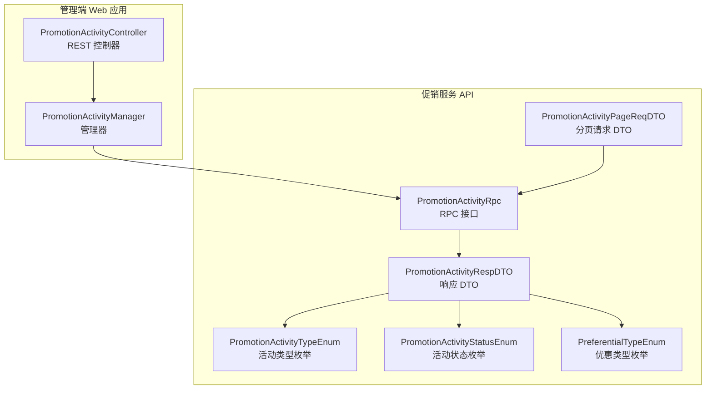
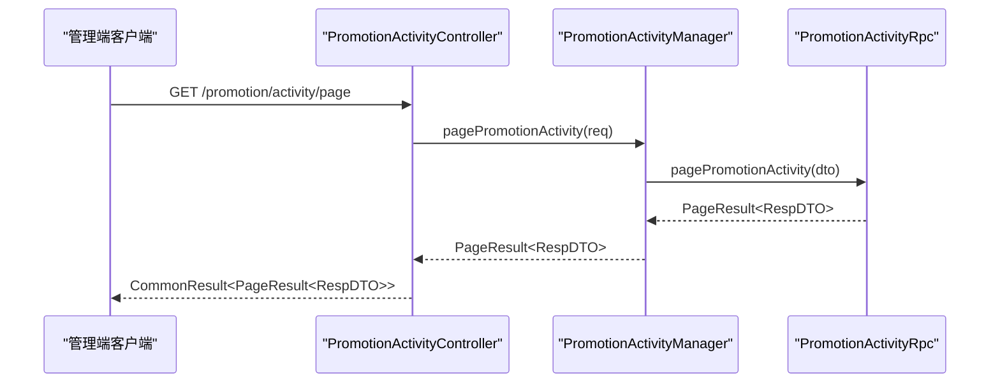
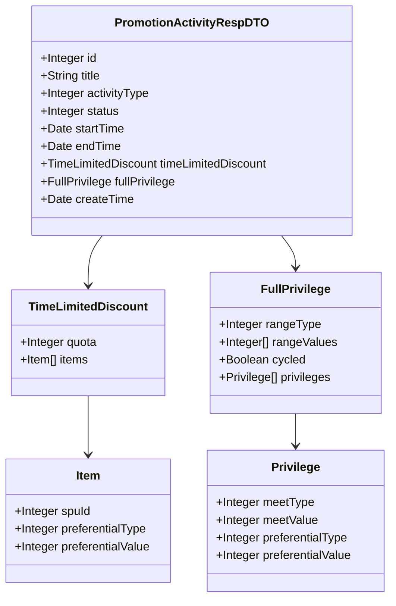
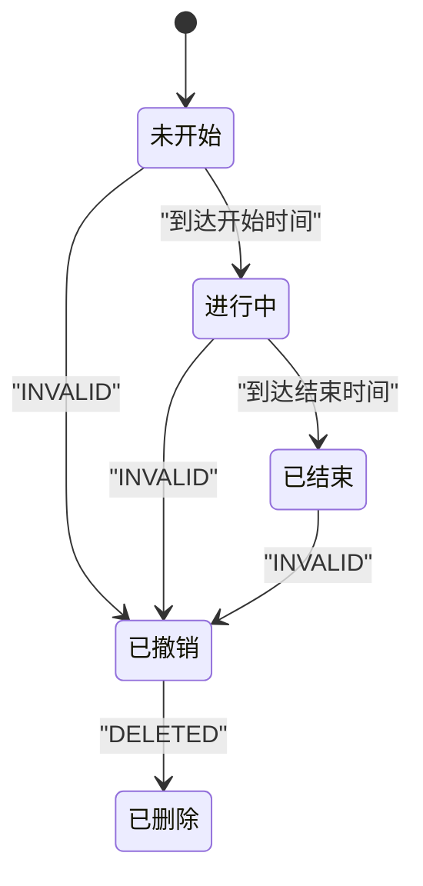
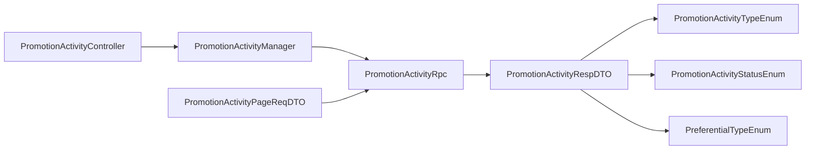

# 促销活动接口

<cite>
**本文引用的文件**
- [PromotionActivityController.java](file://management-web-app/src/main/java/cn/iocoder/mall/managementweb/controller/promotion/activity/PromotionActivityController.java)
- [PromotionActivityManager.java](file://management-web-app/src/main/java/cn/iocoder/mall/managementweb/manager/promotion/activity/PromotionActivityManager.java)
- [PromotionActivityRpc.java](file://promotion-service-project/promotion-service-api/src/main/java/cn/iocoder/mall/promotion/api/rpc/activity/PromotionActivityRpc.java)
- [PromotionActivityRespDTO.java](file://promotion-service-project/promotion-service-api/src/main/java/cn/iocoder/mall/promotion/api/rpc/activity/dto/PromotionActivityRespDTO.java)
- [PromotionActivityPageReqDTO.java](file://promotion-service-project/promotion-service-api/src/main/java/cn/iocoder/mall/promotion/api/rpc/activity/dto/PromotionActivityPageReqDTO.java)
- [PromotionActivityTypeEnum.java](file://promotion-service-project/promotion-service-api/src/main/java/cn/iocoder/mall/promotion/api/enums/activity/PromotionActivityTypeEnum.java)
- [PromotionActivityStatusEnum.java](file://promotion-service-project/promotion-service-api/src/main/java/cn/iocoder/mall/promotion/api/enums/activity/PromotionActivityStatusEnum.java)
- [PreferentialTypeEnum.java](file://promotion-service-project/promotion-service-api/src/main/java/cn/iocoder/mall/promotion/api/enums/PreferentialTypeEnum.java)
</cite>

## 目录
1. [简介](#简介)
2. [项目结构](#项目结构)
3. [核心组件](#核心组件)
4. [架构总览](#架构总览)
5. [详细组件分析](#详细组件分析)
6. [依赖分析](#依赖分析)
7. [性能考虑](#性能考虑)
8. [故障排查指南](#故障排查指南)
9. [结论](#结论)
10. [附录](#附录)

## 简介
本文件面向“促销活动接口”的管理端能力，聚焦于促销活动的分页查询与基础数据模型，覆盖活动类型（限时折扣、满减送）、活动状态（未开始、进行中、已结束、已撤销、已删除）以及优惠规则结构（如折扣、满减、可用范围、是否循环等）。文档提供接口规范、数据模型、流程图与时序图，并给出常见促销场景示例、权限控制、数据校验与并发处理建议、测试方法与监控指标。

## 项目结构
促销活动接口采用“管理端 Web 应用 + RPC 接口 + 服务端实现”的分层设计：
- 管理端 Web 控制器负责接收请求、鉴权与返回统一结果包装；
- 管理端 Manager 通过 Dubbo 调用促销服务的 RPC 接口；
- 促销服务 API 定义了活动分页查询、列表查询与响应数据模型；
- 枚举定义了活动类型、活动状态与优惠类型，确保前后端一致。

图表来源
- [PromotionActivityController.java:1-37](file://management-web-app/src/main/java/cn/iocoder/mall/managementweb/controller/promotion/activity/PromotionActivityController.java#L1-L37)
- [PromotionActivityManager.java:1-31](file://management-web-app/src/main/java/cn/iocoder/mall/managementweb/manager/promotion/activity/PromotionActivityManager.java#L1-L31)
- [PromotionActivityRpc.java:1-21](file://promotion-service-project/promotion-service-api/src/main/java/cn/iocoder/mall/promotion/api/rpc/activity/PromotionActivityRpc.java#L1-L21)
- [PromotionActivityRespDTO.java:1-161](file://promotion-service-project/promotion-service-api/src/main/java/cn/iocoder/mall/promotion/api/rpc/activity/dto/PromotionActivityRespDTO.java#L1-L161)
- [PromotionActivityPageReqDTO.java:1-34](file://promotion-service-project/promotion-service-api/src/main/java/cn/iocoder/mall/promotion/api/rpc/activity/dto/PromotionActivityPageReqDTO.java#L1-L34)
- [PromotionActivityTypeEnum.java:1-35](file://promotion-service-project/promotion-service-api/src/main/java/cn/iocoder/mall/promotion/api/enums/activity/PromotionActivityTypeEnum.java#L1-L35)
- [PromotionActivityStatusEnum.java:1-42](file://promotion-service-project/promotion-service-api/src/main/java/cn/iocoder/mall/promotion/api/enums/activity/PromotionActivityStatusEnum.java#L1-L42)
- [PreferentialTypeEnum.java:1-47](file://promotion-service-project/promotion-service-api/src/main/java/cn/iocoder/mall/promotion/api/enums/PreferentialTypeEnum.java#L1-L47)

章节来源
- [PromotionActivityController.java:1-37](file://management-web-app/src/main/java/cn/iocoder/mall/managementweb/controller/promotion/activity/PromotionActivityController.java#L1-L37)
- [PromotionActivityManager.java:1-31](file://management-web-app/src/main/java/cn/iocoder/mall/managementweb/manager/promotion/activity/PromotionActivityManager.java#L1-L31)
- [PromotionActivityRpc.java:1-21](file://promotion-service-project/promotion-service-api/src/main/java/cn/iocoder/mall/promotion/api/rpc/activity/PromotionActivityRpc.java#L1-L21)

## 核心组件
- REST 控制器：提供促销活动分页查询接口，使用统一结果包装与权限注解。
- 管理器：封装 RPC 调用，负责参数转换与错误检查。
- RPC 接口：定义分页查询与列表查询两个核心接口。
- 数据模型：包含活动基本信息、活动类型、活动状态、时间范围、优惠规则（限时折扣、满减送）等字段。
- 枚举：活动类型、活动状态、优惠类型，用于约束取值与语义表达。

章节来源
- [PromotionActivityController.java:28-34](file://management-web-app/src/main/java/cn/iocoder/mall/managementweb/controller/promotion/activity/PromotionActivityController.java#L28-L34)
- [PromotionActivityManager.java:23-28](file://management-web-app/src/main/java/cn/iocoder/mall/managementweb/manager/promotion/activity/PromotionActivityManager.java#L23-L28)
- [PromotionActivityRpc.java:14-20](file://promotion-service-project/promotion-service-api/src/main/java/cn/iocoder/mall/promotion/api/rpc/activity/PromotionActivityRpc.java#L14-L20)
- [PromotionActivityRespDTO.java:15-161](file://promotion-service-project/promotion-service-api/src/main/java/cn/iocoder/mall/promotion/api/rpc/activity/dto/PromotionActivityRespDTO.java#L15-L161)
- [PromotionActivityTypeEnum.java:6-10](file://promotion-service-project/promotion-service-api/src/main/java/cn/iocoder/mall/promotion/api/enums/activity/PromotionActivityTypeEnum.java#L6-L10)
- [PromotionActivityStatusEnum.java:6-17](file://promotion-service-project/promotion-service-api/src/main/java/cn/iocoder/mall/promotion/api/enums/activity/PromotionActivityStatusEnum.java#L6-L17)
- [PreferentialTypeEnum.java:10-14](file://promotion-service-project/promotion-service-api/src/main/java/cn/iocoder/mall/promotion/api/enums/PreferentialTypeEnum.java#L10-L14)

## 架构总览
下图展示从管理端到促销服务的调用链路与职责分工：

图表来源
- [PromotionActivityController.java:29-34](file://management-web-app/src/main/java/cn/iocoder/mall/managementweb/controller/promotion/activity/PromotionActivityController.java#L29-L34)
- [PromotionActivityManager.java:23-28](file://management-web-app/src/main/java/cn/iocoder/mall/managementweb/manager/promotion/activity/PromotionActivityManager.java#L23-L28)
- [PromotionActivityRpc.java:16-16](file://promotion-service-project/promotion-service-api/src/main/java/cn/iocoder/mall/promotion/api/rpc/activity/PromotionActivityRpc.java#L16-L16)

## 详细组件分析

### 接口规范：促销活动分页查询
- HTTP 方法：GET
- URL 路径：/promotion/activity/page
- 权限标识：promotion:activity:page
- 请求参数（分页请求 DTO 字段）
  - title：字符串，模糊匹配活动标题
  - activityType：整数，活动类型编码（参见活动类型枚举）
  - statuses：整数集合，活动状态集合（参见活动状态枚举）
  - 分页参数：继承自 PageParam（如页码、大小），由分页请求 DTO 继承
- 响应数据（响应 DTO 字段）
  - id：整数，活动编号
  - title：字符串，活动标题
  - activityType：整数，活动类型编码
  - status：整数，活动状态编码
  - startTime/endTime：日期时间，活动起止时间
  - timeLimitedDiscount：限时折扣结构（含配额与商品折扣项）
  - fullPrivilege：满减送结构（含满足类型/值、优惠类型/值、可用范围、是否循环、优惠数组）
  - createTime：日期时间，创建时间
- 返回包装：CommonResult<PageResult<RespDTO>>

章节来源
- [PromotionActivityController.java:29-34](file://management-web-app/src/main/java/cn/iocoder/mall/managementweb/controller/promotion/activity/PromotionActivityController.java#L29-L34)
- [PromotionActivityPageReqDTO.java:16-32](file://promotion-service-project/promotion-service-api/src/main/java/cn/iocoder/mall/promotion/api/rpc/activity/dto/PromotionActivityPageReqDTO.java#L16-L32)
- [PromotionActivityRespDTO.java:17-58](file://promotion-service-project/promotion-service-api/src/main/java/cn/iocoder/mall/promotion/api/rpc/activity/dto/PromotionActivityRespDTO.java#L17-L58)

### 数据模型：促销活动响应 DTO
- 活动基本信息
  - id、title、status、startTime、endTime、createTime
- 活动类型与状态
  - activityType：参见活动类型枚举
  - status：参见活动状态枚举
- 优惠规则
  - 限时折扣（timeLimitedDiscount）
    - 配额（quota）：每人每种限购数量；0 表示不限购
    - 商品折扣项（items）：包含 spuId、preferentialType、preferentialValue
  - 满减送（fullPrivilege）
    - 可用范围（rangeType、rangeValues）：参见范围类型枚举（当前支持“所有可用”+“指定商品包含”）
    - 是否循环（cycled）：布尔值
    - 优惠数组（privileges）：包含 meetType/meetValue、preferentialType/preferentialValue
- 优惠类型枚举
  - preferentialType：减价、打折

图表来源
- [PromotionActivityRespDTO.java:15-161](file://promotion-service-project/promotion-service-api/src/main/java/cn/iocoder/mall/promotion/api/rpc/activity/dto/PromotionActivityRespDTO.java#L15-L161)

章节来源
- [PromotionActivityRespDTO.java:48-158](file://promotion-service-project/promotion-service-api/src/main/java/cn/iocoder/mall/promotion/api/rpc/activity/dto/PromotionActivityRespDTO.java#L48-L158)
- [PreferentialTypeEnum.java:10-14](file://promotion-service-project/promotion-service-api/src/main/java/cn/iocoder/mall/promotion/api/enums/PreferentialTypeEnum.java#L10-L14)

### 业务流程：活动生命周期与状态流转
- 活动状态枚举
  - WAIT（未开始）、RUN（进行中）、END（已结束）、INVALID（已撤销）、DELETED（已删除）
  - 状态间约束：WAIT/RUN/END 可转为 INVALID；INVALID 仅可转为 DELETED
- 时间维度
  - startTime/endTIme 决定活动是否处于“未开始/进行中/已结束”
- 优惠规则生效
  - 限时折扣：按配额与商品折扣项计算
  - 满减送：按满足类型/值与优惠类型/值组合，结合可用范围与循环策略

图表来源
- [PromotionActivityStatusEnum.java:6-17](file://promotion-service-project/promotion-service-api/src/main/java/cn/iocoder/mall/promotion/api/enums/activity/PromotionActivityStatusEnum.java#L6-L17)

章节来源
- [PromotionActivityStatusEnum.java:12-16](file://promotion-service-project/promotion-service-api/src/main/java/cn/iocoder/mall/promotion/api/enums/activity/PromotionActivityStatusEnum.java#L12-L16)

### 场景示例
- 节日促销（限时折扣）
  - 活动类型：限时折扣
  - 规则要点：设置活动时间窗、商品折扣项（SPU 级别）、每人每种限购配额
- 会员活动（满减送）
  - 活动类型：满减送
  - 规则要点：设置满足金额或件数阈值、优惠类型/值、可用商品范围、是否循环
- 限时抢购（限时折扣 + 配额）
  - 活动类型：限时折扣
  - 规则要点：严格配额控制、明确开始/结束时间

章节来源
- [PromotionActivityTypeEnum.java:8-10](file://promotion-service-project/promotion-service-api/src/main/java/cn/iocoder/mall/promotion/api/enums/activity/PromotionActivityTypeEnum.java#L8-L10)
- [PromotionActivityRespDTO.java:65-100](file://promotion-service-project/promotion-service-api/src/main/java/cn/iocoder/mall/promotion/api/rpc/activity/dto/PromotionActivityRespDTO.java#L65-L100)
- [PromotionActivityRespDTO.java:107-158](file://promotion-service-project/promotion-service-api/src/main/java/cn/iocoder/mall/promotion/api/rpc/activity/dto/PromotionActivityRespDTO.java#L107-L158)

### 权限控制与数据校验
- 权限控制
  - 接口使用权限注解：promotion:activity:page
- 数据校验
  - 控制器与管理器均使用 @Validated，结合 DTO 字段约束（如 statuses 为整数集合、分页参数继承自 PageParam）
- 并发处理
  - 管理端通过 Dubbo 调用促销服务；具体并发控制与幂等策略由服务端实现细节决定

章节来源
- [PromotionActivityController.java:31-31](file://management-web-app/src/main/java/cn/iocoder/mall/managementweb/controller/promotion/activity/PromotionActivityController.java#L31-L31)
- [PromotionActivityPageReqDTO.java:16-32](file://promotion-service-project/promotion-service-api/src/main/java/cn/iocoder/mall/promotion/api/rpc/activity/dto/PromotionActivityPageReqDTO.java#L16-L32)
- [PromotionActivityManager.java:23-28](file://management-web-app/src/main/java/cn/iocoder/mall/managementweb/manager/promotion/activity/PromotionActivityManager.java#L23-L28)

### 接口测试方法
- 单元测试
  - 对控制器与管理器进行参数构造与断言，模拟分页查询返回
- 集成测试
  - 启动管理端与促销服务，调用 /promotion/activity/page，校验返回字段与分页行为
- 性能测试
  - 使用压测工具对分页接口施加并发负载，观察响应时间与吞吐量

章节来源
- [PromotionActivityController.java:29-34](file://management-web-app/src/main/java/cn/iocoder/mall/managementweb/controller/promotion/activity/PromotionActivityController.java#L29-L34)
- [PromotionActivityManager.java:23-28](file://management-web-app/src/main/java/cn/iocoder/mall/managementweb/manager/promotion/activity/PromotionActivityManager.java#L23-L28)

### 活动效果监控指标
- 交易侧
  - 活动参与人数、订单转化率、客单价变化
- 流量侧
  - 活动曝光 UV、点击率、加购率
- 收益侧
  - 活动 GMV、活动 ROI、优惠成本占比
- 系统侧
  - 接口 QPS、P95/P99 延迟、错误率、超时率

## 依赖分析
- 控制器依赖管理器
- 管理器依赖 RPC 接口
- 响应 DTO 引用活动类型/状态/优惠类型枚举
- 分页请求 DTO 继承分页参数

图表来源
- [PromotionActivityController.java:25-26](file://management-web-app/src/main/java/cn/iocoder/mall/managementweb/controller/promotion/activity/PromotionActivityController.java#L25-L26)
- [PromotionActivityManager.java:20-21](file://management-web-app/src/main/java/cn/iocoder/mall/managementweb/manager/promotion/activity/PromotionActivityManager.java#L20-L21)
- [PromotionActivityRpc.java:14-20](file://promotion-service-project/promotion-service-api/src/main/java/cn/iocoder/mall/promotion/api/rpc/activity/PromotionActivityRpc.java#L14-L20)
- [PromotionActivityRespDTO.java:15-161](file://promotion-service-project/promotion-service-api/src/main/java/cn/iocoder/mall/promotion/api/rpc/activity/dto/PromotionActivityRespDTO.java#L15-L161)
- [PromotionActivityPageReqDTO.java:16-32](file://promotion-service-project/promotion-service-api/src/main/java/cn/iocoder/mall/promotion/api/rpc/activity/dto/PromotionActivityPageReqDTO.java#L16-L32)
- [PromotionActivityTypeEnum.java:6-10](file://promotion-service-project/promotion-service-api/src/main/java/cn/iocoder/mall/promotion/api/enums/activity/PromotionActivityTypeEnum.java#L6-L10)
- [PromotionActivityStatusEnum.java:6-17](file://promotion-service-project/promotion-service-api/src/main/java/cn/iocoder/mall/promotion/api/enums/activity/PromotionActivityStatusEnum.java#L6-L17)
- [PreferentialTypeEnum.java:10-14](file://promotion-service-project/promotion-service-api/src/main/java/cn/iocoder/mall/promotion/api/enums/PreferentialTypeEnum.java#L10-L14)

章节来源
- [PromotionActivityController.java:25-26](file://management-web-app/src/main/java/cn/iocoder/mall/managementweb/controller/promotion/activity/PromotionActivityController.java#L25-L26)
- [PromotionActivityManager.java:20-21](file://management-web-app/src/main/java/cn/iocoder/mall/managementweb/manager/promotion/activity/PromotionActivityManager.java#L20-L21)
- [PromotionActivityRpc.java:14-20](file://promotion-service-project/promotion-service-api/src/main/java/cn/iocoder/mall/promotion/api/rpc/activity/PromotionActivityRpc.java#L14-L20)
- [PromotionActivityRespDTO.java:15-161](file://promotion-service-project/promotion-service-api/src/main/java/cn/iocoder/mall/promotion/api/rpc/activity/dto/PromotionActivityRespDTO.java#L15-L161)
- [PromotionActivityPageReqDTO.java:16-32](file://promotion-service-project/promotion-service-api/src/main/java/cn/iocoder/mall/promotion/api/rpc/activity/dto/PromotionActivityPageReqDTO.java#L16-L32)

## 性能考虑
- 分页查询
  - 合理设置分页大小，避免一次性返回过多数据
  - 在服务端对 title 进行索引优化，提高模糊匹配效率
- 缓存策略
  - 对热门活动的基础信息进行缓存，降低数据库压力
- 并发与限流
  - 对分页接口实施限流与熔断，防止突发流量击穿系统
- 数据序列化
  - DTO 字段尽量扁平化，减少嵌套层级带来的序列化开销

## 故障排查指南
- 常见问题
  - 权限不足：确认是否具备 promotion:activity:page 权限
  - 参数不合法：检查 statuses 是否为整数集合、分页参数是否正确
  - RPC 调用失败：检查 Dubbo 服务注册与发现、网络连通性
- 排查步骤
  - 控制台日志：定位控制器与管理器调用链
  - RPC 日志：确认服务端返回的 PageResult 结构与数据
  - 监控指标：关注接口 QPS、延迟与错误率

章节来源
- [PromotionActivityController.java:31-31](file://management-web-app/src/main/java/cn/iocoder/mall/managementweb/controller/promotion/activity/PromotionActivityController.java#L31-L31)
- [PromotionActivityManager.java:23-28](file://management-web-app/src/main/java/cn/iocoder/mall/managementweb/manager/promotion/activity/PromotionActivityManager.java#L23-L28)

## 结论
本文档基于现有代码梳理了促销活动分页查询接口的职责边界、数据模型与业务规则，明确了活动类型、状态与优惠类型的取值约束，并提供了流程与时序图帮助理解调用链路。后续可在服务端完善活动 CRUD 与状态变更逻辑，并在管理端补充创建/编辑/删除等接口，以形成完整的促销活动管理闭环。

## 附录

### 接口清单（当前已实现）
- GET /promotion/activity/page
  - 权限：promotion:activity:page
  - 请求：PromotionActivityPageReqDTO
  - 响应：CommonResult<PageResult<PromotionActivityRespDTO>>

章节来源
- [PromotionActivityController.java:29-34](file://management-web-app/src/main/java/cn/iocoder/mall/managementweb/controller/promotion/activity/PromotionActivityController.java#L29-L34)
- [PromotionActivityRpc.java:16-16](file://promotion-service-project/promotion-service-api/src/main/java/cn/iocoder/mall/promotion/api/rpc/activity/PromotionActivityRpc.java#L16-L16)