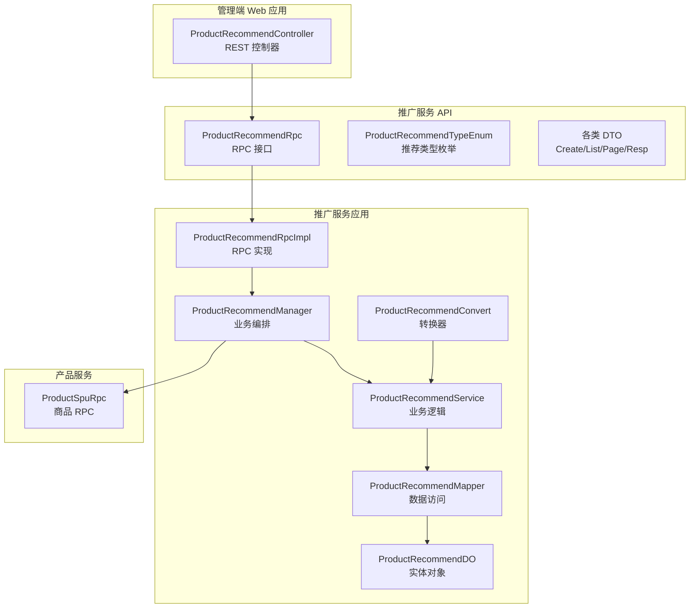
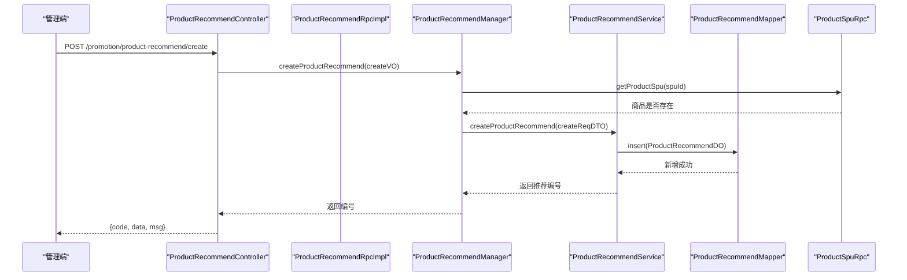
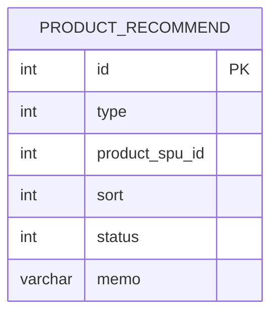
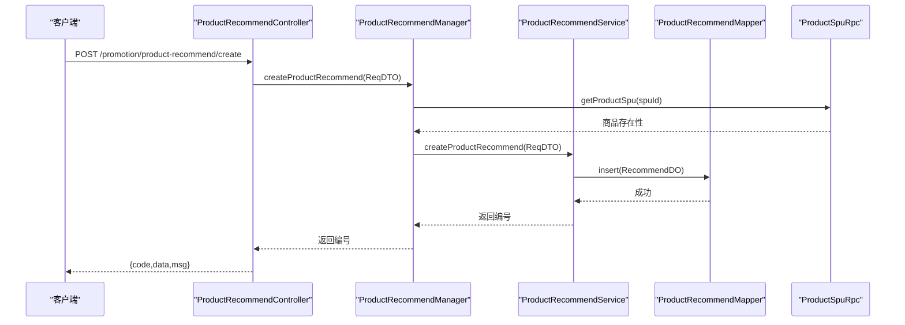
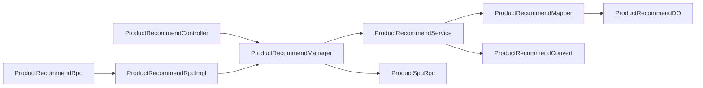

# 商品推荐接口

<cite>
**本文引用的文件**
- [ProductRecommendController.java](file://management-web-app/src/main/java/cn/iocoder/mall/managementweb/controller/promotion/recommend/ProductRecommendController.java)
- [ProductRecommendRpc.java](file://promotion-service-project/promotion-service-api/src/main/java/cn/iocoder/mall/promotion/api/rpc/recommend/ProductRecommendRpc.java)
- [ProductRecommendRpcImpl.java](file://promotion-service-project/promotion-service-app/src/main/java/cn/iocoder/mall/promotionservice/rpc/recommend/ProductRecommendRpcImpl.java)
- [ProductRecommendManager.java](file://promotion-service-project/promotion-service-app/src/main/java/cn/iocoder/mall/promotionservice/manager/recommend/ProductRecommendManager.java)
- [ProductRecommendService.java](file://promotion-service-project/promotion-service-app/src/main/java/cn/iocoder/mall/promotionservice/service/recommend/ProductRecommendService.java)
- [ProductRecommendMapper.java](file://promotion-service-project/promotion-service-app/src/main/java/cn/iocoder/mall/promotionservice/dal/mysql/mapper/recommend/ProductRecommendMapper.java)
- [ProductRecommendDO.java](file://promotion-service-project/promotion-service-app/src/main/java/cn/iocoder/mall/promotionservice/dal/mysql/dataobject/recommend/ProductRecommendDO.java)
- [ProductRecommendConvert.java](file://promotion-service-project/promotion-service-app/src/main/java/cn/iocoder/mall/promotionservice/convert/recommend/ProductRecommendConvert.java)
- [ProductRecommendCreateReqDTO.java](file://promotion-service-project/promotion-service-api/src/main/java/cn/iocoder/mall/promotion/api/rpc/recommend/dto/ProductRecommendCreateReqDTO.java)
- [ProductRecommendListReqDTO.java](file://promotion-service-project/promotion-service-api/src/main/java/cn/iocoder/mall/promotion/api/rpc/recommend/dto/ProductRecommendListReqDTO.java)
- [ProductRecommendPageReqDTO.java](file://promotion-service-project/promotion-service-api/src/main/java/cn/iocoder/mall/promotion/api/rpc/recommend/dto/ProductRecommendPageReqDTO.java)
- [ProductRecommendRespDTO.java](file://promotion-service-project/promotion-service-api/src/main/java/cn/iocoder/mall/promotion/api/rpc/recommend/dto/ProductRecommendRespDTO.java)
- [ProductRecommendTypeEnum.java](file://promotion-service-project/promotion-service-api/src/main/java/cn/iocoder/mall/promotion/api/enums/recommend/ProductRecommendTypeEnum.java)
- [CommonResult.java](file://common/common-framework/src/main/java/cn/iocoder/common/framework/vo/CommonResult.java)
- [PageResult.java](file://common/common-framework/src/main/java/cn/iocoder/common/framework/vo/PageResult.java)
- [ProductSpuRpc.java](file://product-service-project/product-service-api/src/main/java/cn/iocoder/mall/productservice/rpc/spu/ProductSpuRpc.java)
</cite>

## 目录
1. [简介](#简介)
2. [项目结构](#项目结构)
3. [核心组件](#核心组件)
4. [架构总览](#架构总览)
5. [详细组件分析](#详细组件分析)
6. [依赖分析](#依赖分析)
7. [性能考虑](#性能考虑)
8. [故障排查指南](#故障排查指南)
9. [结论](#结论)
10. [附录](#附录)

## 简介
本文件面向“商品推荐接口”的使用者与维护者，系统化梳理推荐配置、管理与分页查询能力，并给出接口规范、数据模型、调用流程、排序机制、错误处理、性能与缓存策略建议、A/B 测试实践以及效果评估指标与测试方法。当前仓库中已实现推荐类型的定义与基础的增删改查管理接口，推荐排序与个性化算法尚未在该仓库中直接实现，本文将基于现有代码进行严谨说明，并对缺失部分提供可落地的扩展建议。

## 项目结构
推荐相关代码采用“管理端 Web 控制器 → RPC 接口 → RPC 实现 → Manager → Service → Mapper/DO/DTO/Enum”的分层架构，遵循微服务与领域驱动设计原则，职责清晰、边界明确。

图表来源
- [ProductRecommendController.java:24-60](file://management-web-app/src/main/java/cn/iocoder/mall/managementweb/controller/promotion/recommend/ProductRecommendController.java#L24-L60)
- [ProductRecommendRpc.java:12-52](file://promotion-service-project/promotion-service-api/src/main/java/cn/iocoder/mall/promotion/api/rpc/recommend/ProductRecommendRpc.java#L12-L52)
- [ProductRecommendRpcImpl.java:15-48](file://promotion-service-project/promotion-service-app/src/main/java/cn/iocoder/mall/promotionservice/rpc/recommend/ProductRecommendRpcImpl.java#L15-L48)
- [ProductRecommendManager.java:22-66](file://promotion-service-project/promotion-service-app/src/main/java/cn/iocoder/mall/promotionservice/manager/recommend/ProductRecommendManager.java#L22-L66)
- [ProductRecommendService.java:22-93](file://promotion-service-project/promotion-service-app/src/main/java/cn/iocoder/mall/promotionservice/service/recommend/ProductRecommendService.java#L22-L93)
- [ProductRecommendMapper.java:15-33](file://promotion-service-project/promotion-service-app/src/main/java/cn/iocoder/mall/promotionservice/dal/mysql/mapper/recommend/ProductRecommendMapper.java#L15-L33)
- [ProductRecommendDO.java:13-48](file://promotion-service-project/promotion-service-app/src/main/java/cn/iocoder/mall/promotionservice/dal/mysql/dataobject/recommend/ProductRecommendDO.java#L13-L48)
- [ProductRecommendConvert.java:15-29](file://promotion-service-project/promotion-service-app/src/main/java/cn/iocoder/mall/promotionservice/convert/recommend/ProductRecommendConvert.java#L15-L29)
- [ProductSpuRpc.java](file://product-service-project/product-service-api/src/main/java/cn/iocoder/mall/productservice/rpc/spu/ProductSpuRpc.java)

章节来源
- [ProductRecommendController.java:24-60](file://management-web-app/src/main/java/cn/iocoder/mall/managementweb/controller/promotion/recommend/ProductRecommendController.java#L24-L60)
- [ProductRecommendRpc.java:12-52](file://promotion-service-project/promotion-service-api/src/main/java/cn/iocoder/mall/promotion/api/rpc/recommend/ProductRecommendRpc.java#L12-L52)
- [ProductRecommendRpcImpl.java:15-48](file://promotion-service-project/promotion-service-app/src/main/java/cn/iocoder/mall/promotionservice/rpc/recommend/ProductRecommendRpcImpl.java#L15-L48)
- [ProductRecommendManager.java:22-66](file://promotion-service-project/promotion-service-app/src/main/java/cn/iocoder/mall/promotionservice/manager/recommend/ProductRecommendManager.java#L22-L66)
- [ProductRecommendService.java:22-93](file://promotion-service-project/promotion-service-app/src/main/java/cn/iocoder/mall/promotionservice/service/recommend/ProductRecommendService.java#L22-L93)
- [ProductRecommendMapper.java:15-33](file://promotion-service-project/promotion-service-app/src/main/java/cn/iocoder/mall/promotionservice/dal/mysql/mapper/recommend/ProductRecommendMapper.java#L15-L33)
- [ProductRecommendDO.java:13-48](file://promotion-service-project/promotion-service-app/src/main/java/cn/iocoder/mall/promotionservice/dal/mysql/dataobject/recommend/ProductRecommendDO.java#L13-L48)
- [ProductRecommendConvert.java:15-29](file://promotion-service-project/promotion-service-app/src/main/java/cn/iocoder/mall/promotionservice/convert/recommend/ProductRecommendConvert.java#L15-L29)
- [ProductSpuRpc.java](file://product-service-project/product-service-api/src/main/java/cn/iocoder/mall/productservice/rpc/spu/ProductSpuRpc.java)

## 核心组件
- 推荐类型枚举：定义推荐类型集合与校验逻辑，支持热卖推荐、新品推荐等。
- DTO 层：封装创建、列表、分页、响应等数据传输对象，含必填与范围校验。
- 数据模型：持久化实体包含类型、SPU 编号、排序、状态与备注等字段。
- 管理器：负责商品存在性校验与 RPC 调用编排。
- 服务层：实现业务规则（如重复推荐校验、分页与列表查询）。
- 映射器：提供按类型、状态、分页条件的查询能力。
- RPC 接口与实现：对外暴露统一的推荐管理能力，供其他模块调用。

章节来源
- [ProductRecommendTypeEnum.java:10-53](file://promotion-service-project/promotion-service-api/src/main/java/cn/iocoder/mall/promotion/api/enums/recommend/ProductRecommendTypeEnum.java#L10-L53)
- [ProductRecommendCreateReqDTO.java:18-48](file://promotion-service-project/promotion-service-api/src/main/java/cn/iocoder/mall/promotion/api/rpc/recommend/dto/ProductRecommendCreateReqDTO.java#L18-L48)
- [ProductRecommendDO.java:16-48](file://promotion-service-project/promotion-service-app/src/main/java/cn/iocoder/mall/promotionservice/dal/mysql/dataobject/recommend/ProductRecommendDO.java#L16-L48)
- [ProductRecommendManager.java:24-66](file://promotion-service-project/promotion-service-app/src/main/java/cn/iocoder/mall/promotionservice/manager/recommend/ProductRecommendManager.java#L24-L66)
- [ProductRecommendService.java:24-93](file://promotion-service-project/promotion-service-app/src/main/java/cn/iocoder/mall/promotionservice/service/recommend/ProductRecommendService.java#L24-93)
- [ProductRecommendMapper.java:15-33](file://promotion-service-project/promotion-service-app/src/main/java/cn/iocoder/mall/promotionservice/dal/mysql/mapper/recommend/ProductRecommendMapper.java#L15-L33)
- [ProductRecommendRpc.java:12-52](file://promotion-service-project/promotion-service-api/src/main/java/cn/iocoder/mall/promotion/api/rpc/recommend/ProductRecommendRpc.java#L12-L52)
- [ProductRecommendRpcImpl.java:15-48](file://promotion-service-project/promotion-service-app/src/main/java/cn/iocoder/mall/promotionservice/rpc/recommend/ProductRecommendRpcImpl.java#L15-L48)

## 架构总览
推荐接口采用“管理端控制器 → RPC 接口 → RPC 实现 → Manager → Service → Mapper/DO”的链路，通过 Dubbo 暴露 RPC，内部以 MyBatis Plus 进行数据持久化。商品存在性由产品服务 RPC 校验，避免脏数据进入推荐表。

图表来源
- [ProductRecommendController.java:33-37](file://management-web-app/src/main/java/cn/iocoder/mall/managementweb/controller/promotion/recommend/ProductRecommendController.java#L33-L37)
- [ProductRecommendRpcImpl.java:21-24](file://promotion-service-project/promotion-service-app/src/main/java/cn/iocoder/mall/promotionservice/rpc/recommend/ProductRecommendRpcImpl.java#L21-L24)
- [ProductRecommendManager.java:40-45](file://promotion-service-project/promotion-service-app/src/main/java/cn/iocoder/mall/promotionservice/manager/recommend/ProductRecommendManager.java#L40-L45)
- [ProductRecommendService.java:57-67](file://promotion-service-project/promotion-service-app/src/main/java/cn/iocoder/mall/promotionservice/service/recommend/ProductRecommendService.java#L57-L67)
- [ProductRecommendMapper.java:18-21](file://promotion-service-project/promotion-service-app/src/main/java/cn/iocoder/mall/promotionservice/dal/mysql/mapper/recommend/ProductRecommendMapper.java#L18-L21)
- [ProductSpuRpc.java](file://product-service-project/product-service-api/src/main/java/cn/iocoder/mall/productservice/rpc/spu/ProductSpuRpc.java)

## 详细组件分析

### 接口规范与调用流程

- 创建商品推荐
  - 方法与路径：POST /promotion/product-recommend/create
  - 请求体：ProductRecommendCreateReqDTO
  - 响应体：CommonResult<Integer>（返回推荐编号）
  - 校验逻辑：校验商品存在性；同类型下同一 SPU 不可重复推荐
  - 错误码：重复推荐、商品不存在等

- 更新商品推荐
  - 方法与路径：POST /promotion/product-recommend/update
  - 请求体：ProductRecommendUpdateReqDTO
  - 响应体：CommonResult<Boolean>
  - 校验逻辑：更新前检查推荐存在性与重复性

- 删除商品推荐
  - 方法与路径：POST /promotion/product-recommend/delete
  - 查询参数：productRecommendId
  - 响应体：CommonResult<Boolean>

- 获取商品推荐分页
  - 方法与路径：GET /promotion/product-recommend/page
  - 查询参数：ProductRecommendPageReqDTO
  - 响应体：CommonResult<PageResult<ProductRecommendRespDTO>>

章节来源
- [ProductRecommendController.java:33-58](file://management-web-app/src/main/java/cn/iocoder/mall/managementweb/controller/promotion/recommend/ProductRecommendController.java#L33-L58)
- [ProductRecommendRpc.java:14-50](file://promotion-service-project/promotion-service-api/src/main/java/cn/iocoder/mall/promotion/api/rpc/recommend/ProductRecommendRpc.java#L14-L50)
- [ProductRecommendRpcImpl.java:21-46](file://promotion-service-project/promotion-service-app/src/main/java/cn/iocoder/mall/promotionservice/rpc/recommend/ProductRecommendRpcImpl.java#L21-L46)
- [ProductRecommendService.java:57-91](file://promotion-service-project/promotion-service-app/src/main/java/cn/iocoder/mall/promotionservice/service/recommend/ProductRecommendService.java#L57-L91)

### 数据模型与排序机制
- 实体字段
  - 编号、类型、商品 Spu 编号、排序、状态、备注
- 排序字段
  - 当前实体包含 sort 字段，用于推荐位内的排序控制
- 列表与分页查询
  - 支持按类型、状态过滤；分页按类型过滤
- 排序算法
  - 当前仓库未实现复杂排序算法，仅提供 sort 字段作为基础排序依据
  - 建议扩展：引入多因子加权排序（销量、时间衰减、价格区间、用户画像等），并结合缓存与预计算提升性能

图表来源
- [ProductRecommendDO.java:16-48](file://promotion-service-project/promotion-service-app/src/main/java/cn/iocoder/mall/promotionservice/dal/mysql/dataobject/recommend/ProductRecommendDO.java#L16-L48)

章节来源
- [ProductRecommendDO.java:16-48](file://promotion-service-project/promotion-service-app/src/main/java/cn/iocoder/mall/promotionservice/dal/mysql/dataobject/recommend/ProductRecommendDO.java#L16-L48)
- [ProductRecommendMapper.java:18-31](file://promotion-service-project/promotion-service-app/src/main/java/cn/iocoder/mall/promotionservice/dal/mysql/mapper/recommend/ProductRecommendMapper.java#L18-L31)

### 推荐类型与规则
- 推荐类型
  - 热卖推荐、新品推荐
  - 类型校验通过枚举与数组校验保障
- 规则约束
  - 同一 SPU 在同一类型下不可重复推荐
  - 更新时需避免与其他记录冲突

章节来源
- [ProductRecommendTypeEnum.java:10-53](file://promotion-service-project/promotion-service-api/src/main/java/cn/iocoder/mall/promotion/api/enums/recommend/ProductRecommendTypeEnum.java#L10-L53)
- [ProductRecommendService.java:58-82](file://promotion-service-project/promotion-service-app/src/main/java/cn/iocoder/mall/promotionservice/service/recommend/ProductRecommendService.java#L58-L82)

### 推荐场景示例
- 首页推荐位：按类型=热卖或新品拉取列表，结合 sort 排序
- 分类页面推荐：按分类维度与类型组合筛选
- 搜索结果推荐：在搜索上下文内叠加“猜你喜欢”（需扩展个性化算法）

说明：以上场景为概念性示例，具体实现需在前端或业务层根据推荐位与上下文拼装请求参数。

### 接口调用序列图（创建流程）

图表来源
- [ProductRecommendController.java:33-37](file://management-web-app/src/main/java/cn/iocoder/mall/managementweb/controller/promotion/recommend/ProductRecommendController.java#L33-L37)
- [ProductRecommendManager.java:40-45](file://promotion-service-project/promotion-service-app/src/main/java/cn/iocoder/mall/promotionservice/manager/recommend/ProductRecommendManager.java#L40-L45)
- [ProductRecommendService.java:57-67](file://promotion-service-project/promotion-service-app/src/main/java/cn/iocoder/mall/promotionservice/service/recommend/ProductRecommendService.java#L57-L67)
- [ProductRecommendMapper.java:18-21](file://promotion-service-project/promotion-service-app/src/main/java/cn/iocoder/mall/promotionservice/dal/mysql/mapper/recommend/ProductRecommendMapper.java#L18-L21)
- [ProductSpuRpc.java](file://product-service-project/product-service-api/src/main/java/cn/iocoder/mall/productservice/rpc/spu/ProductSpuRpc.java)

## 依赖分析
- 控制器依赖管理器，管理器依赖服务与商品 RPC，服务依赖映射器与转换器，形成清晰的单向依赖。
- 推荐类型通过枚举统一校验，DTO 层承担参数校验与入参约束。
- 使用 MyBatis Plus 提供分页与条件查询能力，简化数据访问层开发。

图表来源
- [ProductRecommendController.java:24-60](file://management-web-app/src/main/java/cn/iocoder/mall/managementweb/controller/promotion/recommend/ProductRecommendController.java#L24-L60)
- [ProductRecommendRpcImpl.java:15-48](file://promotion-service-project/promotion-service-app/src/main/java/cn/iocoder/mall/promotionservice/rpc/recommend/ProductRecommendRpcImpl.java#L15-L48)
- [ProductRecommendManager.java:24-66](file://promotion-service-project/promotion-service-app/src/main/java/cn/iocoder/mall/promotionservice/manager/recommend/ProductRecommendManager.java#L24-L66)
- [ProductRecommendService.java:24-93](file://promotion-service-project/promotion-service-app/src/main/java/cn/iocoder/mall/promotionservice/service/recommend/ProductRecommendService.java#L24-93)
- [ProductRecommendMapper.java:15-33](file://promotion-service-project/promotion-service-app/src/main/java/cn/iocoder/mall/promotionservice/dal/mysql/mapper/recommend/ProductRecommendMapper.java#L15-L33)
- [ProductRecommendDO.java:16-48](file://promotion-service-project/promotion-service-app/src/main/java/cn/iocoder/mall/promotionservice/dal/mysql/dataobject/recommend/ProductRecommendDO.java#L16-L48)
- [ProductRecommendConvert.java:15-29](file://promotion-service-project/promotion-service-app/src/main/java/cn/iocoder/mall/promotionservice/convert/recommend/ProductRecommendConvert.java#L15-L29)
- [ProductSpuRpc.java](file://product-service-project/product-service-api/src/main/java/cn/iocoder/mall/productservice/rpc/spu/ProductSpuRpc.java)

章节来源
- [ProductRecommendController.java:24-60](file://management-web-app/src/main/java/cn/iocoder/mall/managementweb/controller/promotion/recommend/ProductRecommendController.java#L24-L60)
- [ProductRecommendRpcImpl.java:15-48](file://promotion-service-project/promotion-service-app/src/main/java/cn/iocoder/mall/promotionservice/rpc/recommend/ProductRecommendRpcImpl.java#L15-L48)
- [ProductRecommendManager.java:24-66](file://promotion-service-project/promotion-service-app/src/main/java/cn/iocoder/mall/promotionservice/manager/recommend/ProductRecommendManager.java#L24-L66)
- [ProductRecommendService.java:24-93](file://promotion-service-project/promotion-service-app/src/main/java/cn/iocoder/mall/promotionservice/service/recommend/ProductRecommendService.java#L24-93)
- [ProductRecommendMapper.java:15-33](file://promotion-service-project/promotion-service-app/src/main/java/cn/iocoder/mall/promotionservice/dal/mysql/mapper/recommend/ProductRecommendMapper.java#L15-L33)
- [ProductRecommendDO.java:16-48](file://promotion-service-project/promotion-service-app/src/main/java/cn/iocoder/mall/promotionservice/dal/mysql/dataobject/recommend/ProductRecommendDO.java#L16-L48)
- [ProductRecommendConvert.java:15-29](file://promotion-service-project/promotion-service-app/src/main/java/cn/iocoder/mall/promotionservice/convert/recommend/ProductRecommendConvert.java#L15-L29)
- [ProductSpuRpc.java](file://product-service-project/product-service-api/src/main/java/cn/iocoder/mall/productservice/rpc/spu/ProductSpuRpc.java)

## 性能考虑
- 查询性能
  - 建议在 type、status、product_spu_id 上建立索引，提升列表与分页查询效率
  - 对于高频查询，可在服务层增加本地缓存（如 LRU）与分布式缓存（Redis），设置合理过期时间
- 写入性能
  - 批量写入与异步化（消息队列）可降低写入峰值压力
- 排序性能
  - sort 字段为 O(1) 排序基础；复杂排序建议预计算与缓存 TopK 结果
- 缓存策略
  - 推荐位缓存：按推荐位+类型+上下文构建键，短 TTL（如 1-5 分钟）
  - 变更同步：写操作后失效对应缓存键，保证最终一致性
- A/B 测试
  - 通过开关或灰度发布控制不同推荐策略生效范围，采集曝光、点击、转化等指标进行对比

## 故障排查指南
- 商品不存在
  - 现象：创建/更新时报错
  - 处理：确认商品 SPU 是否存在，修正入参
- 重复推荐
  - 现象：同类型下同一 SPU 已存在推荐
  - 处理：先删除旧记录再创建，或更新至新 SPU
- 记录不存在
  - 现象：更新/删除时找不到记录
  - 处理：确认推荐编号正确性

章节来源
- [ProductRecommendManager.java:58-64](file://promotion-service-project/promotion-service-app/src/main/java/cn/iocoder/mall/promotionservice/manager/recommend/ProductRecommendManager.java#L58-L64)
- [ProductRecommendService.java:58-91](file://promotion-service-project/promotion-service-app/src/main/java/cn/iocoder/mall/promotionservice/service/recommend/ProductRecommendService.java#L58-L91)

## 结论
本仓库提供了完善的推荐配置与管理接口，具备类型枚举、参数校验、重复性约束与基础分页能力。推荐排序目前以 sort 字段为基础，复杂算法与个性化策略需在现有架构上扩展实现。通过合理的缓存、索引与 A/B 测试体系，可进一步提升推荐系统的实时性、稳定性与效果。

## 附录

### 接口清单与参数说明

- 创建商品推荐
  - 方法：POST
  - 路径：/promotion/product-recommend/create
  - 请求体：ProductRecommendCreateReqDTO
    - type：推荐类型（必填，枚举校验）
    - productSpuId：商品 SPU 编号（必填）
    - sort：排序（必填）
    - status：状态（必填，枚举校验）
    - memo：备注（选填，长度限制）
  - 响应：CommonResult<Integer>

- 更新商品推荐
  - 方法：POST
  - 路径：/promotion/product-recommend/update
  - 请求体：ProductRecommendUpdateReqDTO
  - 响应：CommonResult<Boolean>

- 删除商品推荐
  - 方法：POST
  - 路径：/promotion/product-recommend/delete
  - 查询参数：productRecommendId（必填）
  - 响应：CommonResult<Boolean>

- 获取商品推荐分页
  - 方法：GET
  - 路径：/promotion/product-recommend/page
  - 查询参数：ProductRecommendPageReqDTO
    - type：推荐类型（可选）
    - pageNo：页码（必填）
    - pageSize：每页大小（必填）
  - 响应：CommonResult<PageResult<ProductRecommendRespDTO>>

章节来源
- [ProductRecommendController.java:33-58](file://management-web-app/src/main/java/cn/iocoder/mall/managementweb/controller/promotion/recommend/ProductRecommendController.java#L33-L58)
- [ProductRecommendCreateReqDTO.java:18-48](file://promotion-service-project/promotion-service-api/src/main/java/cn/iocoder/mall/promotion/api/rpc/recommend/dto/ProductRecommendCreateReqDTO.java#L18-L48)
- [ProductRecommendPageReqDTO.java](file://promotion-service-project/promotion-service-api/src/main/java/cn/iocoder/mall/promotion/api/rpc/recommend/dto/ProductRecommendPageReqDTO.java)
- [ProductRecommendListReqDTO.java](file://promotion-service-project/promotion-service-api/src/main/java/cn/iocoder/mall/promotion/api/rpc/recommend/dto/ProductRecommendListReqDTO.java)
- [ProductRecommendRespDTO.java](file://promotion-service-project/promotion-service-api/src/main/java/cn/iocoder/mall/promotion/api/rpc/recommend/dto/ProductRecommendRespDTO.java)
- [CommonResult.java](file://common/common-framework/src/main/java/cn/iocoder/common/framework/vo/CommonResult.java)
- [PageResult.java](file://common/common-framework/src/main/java/cn/iocoder/common/framework/vo/PageResult.java)

### 推荐算法与扩展建议
- 算法实现原理
  - 基础排序：以 sort 字段为主
  - 热销榜：可结合销量、GMV 等指标加权
  - 新品推荐：按上架时间倒序
  - 个性化推荐：基于用户行为、偏好与协同过滤
- 数据来源
  - 商品维度：SPU 基础信息、库存、价格
  - 行为维度：浏览、收藏、加购、购买
  - 业务维度：促销活动、品牌、类目
- 更新频率
  - 实时：事件驱动（MQ）增量更新
  - 定时：批处理任务每日/每小时重算
- 效果评估
  - 曝光、点击、加购、下单、支付等漏斗指标
  - A/B 测试：分组对比不同策略的转化率与收入贡献
- 测试方法
  - 单元测试：覆盖重复性校验、分页与列表查询
  - 集成测试：模拟商品 RPC 返回与缓存失效
  - 回归测试：变更后验证推荐位展示与排序