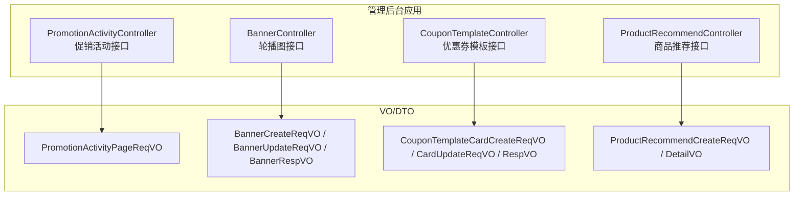
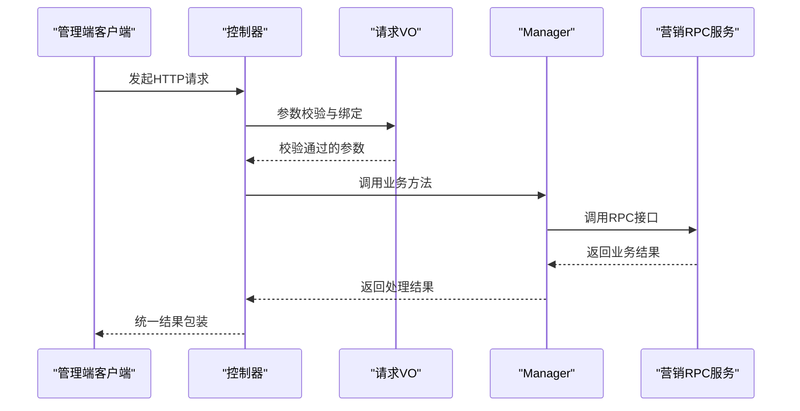
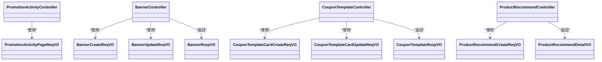

# 营销管理接口

<cite>
**本文引用的文件**
- [PromotionActivityController.java](file://management-web-app/src/main/java/cn/iocoder/mall/managementweb/controller/promotion/activity/PromotionActivityController.java)
- [PromotionActivityPageReqVO.java](file://management-web-app/src/main/java/cn/iocoder/mall/managementweb/controller/promotion/activity/vo/PromotionActivityPageReqVO.java)
- [BannerController.java](file://management-web-app/src/main/java/cn/iocoder/mall/managementweb/controller/promotion/brand/BannerController.java)
- [BannerCreateReqVO.java](file://management-web-app/src/main/java/cn/iocoder/mall/managementweb/controller/promotion/brand/vo/BannerCreateReqVO.java)
- [BannerUpdateReqVO.java](file://management-web-app/src/main/java/cn/iocoder/mall/managementweb/controller/promotion/brand/vo/BannerUpdateReqVO.java)
- [BannerRespVO.java](file://management-web-app/src/main/java/cn/iorcoder/mall/managementweb/controller/promotion/brand/vo/BannerRespVO.java)
- [CouponTemplateController.java](file://management-web-app/src/main/java/cn/iorcoder/mall/managementweb/controller/promotion/coupon/CouponTemplateController.java)
- [CouponTemplateCardCreateReqVO.java](file://management-web-app/src/main/java/cn/iorcoder/mall/managementweb/controller/promotion/coupon/vo/template/CouponTemplateCardCreateReqVO.java)
- [CouponTemplateCardUpdateReqVO.java](file://management-web-app/src/main/java/cn/iorcoder/mall/managementweb/controller/promotion/coupon/vo/template/CouponTemplateCardUpdateReqVO.java)
- [CouponTemplateRespVO.java](file://management-web-app/src/main/java/cn/iorcoder/mall/managementweb/controller/promotion/coupon/vo/template/CouponTemplateRespVO.java)
- [ProductRecommendController.java](file://management-web-app/src/main/java/cn/iorcoder/mall/managementweb/controller/promotion/recommend/ProductRecommendController.java)
- [ProductRecommendCreateReqVO.java](file://management-web-app/src/main/java/cn/iorcoder/mall/managementweb/controller/promotion/recommend/vo/ProductRecommendCreateReqVO.java)
- [ProductRecommendDetailVO.java](file://management-web-app/src/main/java/cn/iorcoder/mall/managementweb/controller/promotion/recommend/vo/ProductRecommendDetailVO.java)
</cite>

## 目录
1. [简介](#简介)
2. [项目结构](#项目结构)
3. [核心组件](#核心组件)
4. [架构总览](#架构总览)
5. [详细组件分析](#详细组件分析)
6. [依赖关系分析](#依赖关系分析)
7. [性能考量](#性能考量)
8. [故障排查指南](#故障排查指南)
9. [结论](#结论)
10. [附录](#附录)

## 简介
本文件面向“营销管理接口”模块，系统化梳理促销活动、轮播图、优惠券模板、商品推荐等能力的管理接口，覆盖接口规范、参数约束、响应结构、业务规则与生命周期管理，并提供典型营销场景示例与测试方法，帮助开发者与运营人员高效落地营销策略。

## 项目结构
营销管理接口位于管理后台应用中，采用按功能域分层组织：
- 控制器层：负责REST接口定义与权限校验
- VO/DTO层：封装请求参数与响应结构
- Manager层：调用RPC服务完成业务处理（当前仓库未包含具体实现，仅展示接口签名）
- RPC接口：与营销服务交互（枚举与RPC接口定义位于营销服务API模块）

图表来源
- [PromotionActivityController.java:1-37](file://management-web-app/src/main/java/cn/iorcoder/mall/managementweb/controller/promotion/activity/PromotionActivityController.java#L1-L37)
- [BannerController.java:1-66](file://management-web-app/src/main/java/cn/iorcoder/mall/managementweb/controller/promotion/brand/BannerController.java#L1-L66)
- [CouponTemplateController.java:1-72](file://management-web-app/src/main/java/cn/iorcoder/mall/managementweb/controller/promotion/coupon/CouponTemplateController.java#L1-L72)
- [ProductRecommendController.java:1-61](file://management-web-app/src/main/java/cn/iorcoder/mall/managementweb/controller/promotion/recommend/ProductRecommendController.java#L1-L61)

章节来源
- [PromotionActivityController.java:1-37](file://management-web-app/src/main/java/cn/iorcoder/mall/managementweb/controller/promotion/activity/PromotionActivityController.java#L1-L37)
- [BannerController.java:1-66](file://management-web-app/src/main/java/cn/iorcoder/mall/managementweb/controller/promotion/brand/BannerController.java#L1-L66)
- [CouponTemplateController.java:1-72](file://management-web-app/src/main/java/cn/iorcoder/mall/managementweb/controller/promotion/coupon/CouponTemplateController.java#L1-L72)
- [ProductRecommendController.java:1-61](file://management-web-app/src/main/java/cn/iorcoder/mall/managementweb/controller/promotion/recommend/ProductRecommendController.java#L1-L61)

## 核心组件
- 促销活动：提供活动分页查询能力，支持标题、类型、状态过滤
- 轮播图：提供创建、更新、删除、分页查询能力
- 优惠券模板：提供模板分页、状态变更、卡券模板创建与更新能力
- 商品推荐：提供推荐项创建、更新、删除、分页查询能力

章节来源
- [PromotionActivityController.java:29-34](file://management-web-app/src/main/java/cn/iorcoder/mall/managementweb/controller/promotion/activity/PromotionActivityController.java#L29-L34)
- [BannerController.java:34-63](file://management-web-app/src/main/java/cn/iorcoder/mall/managementweb/controller/promotion/brand/BannerController.java#L34-L63)
- [CouponTemplateController.java:34-71](file://management-web-app/src/main/java/cn/iorcoder/mall/managementweb/controller/promotion/coupon/CouponTemplateController.java#L34-L71)
- [ProductRecommendController.java:33-58](file://management-web-app/src/main/java/cn/iorcoder/mall/managementweb/controller/promotion/recommend/ProductRecommendController.java#L33-L58)

## 架构总览
营销管理接口通过控制器暴露REST端点，统一返回统一结果包装对象，内部通过Manager进行业务编排，最终调用营销服务RPC接口完成持久化与计算。

图表来源
- [PromotionActivityController.java:29-34](file://management-web-app/src/main/java/cn/iorcoder/mall/managementweb/controller/promotion/activity/PromotionActivityController.java#L29-L34)
- [BannerController.java:34-63](file://management-web-app/src/main/java/cn/iorcoder/mall/managementweb/controller/promotion/brand/BannerController.java#L34-L63)
- [CouponTemplateController.java:34-71](file://management-web-app/src/main/java/cn/iorcoder/mall/managementweb/controller/promotion/coupon/CouponTemplateController.java#L34-L71)
- [ProductRecommendController.java:33-58](file://management-web-app/src/main/java/cn/iorcoder/mall/managementweb/controller/promotion/recommend/ProductRecommendController.java#L33-L58)

## 详细组件分析

### 促销活动接口
- 接口名称：获得促销活动分页
- 请求方式：GET
- URL：/promotion/activity/page
- 权限标识：promotion:activity:page
- 请求参数（分页+筛选）
  - 标题：字符串，示例值：优惠券牛逼
  - 活动类型：整数，参考促销活动类型枚举
  - 状态集合：整数数组，参考促销活动状态枚举
- 响应数据：分页结果，元素为促销活动响应DTO（字段包含标题、类型、状态、时间等）
- 业务规则
  - 支持多状态组合筛选
  - 分页参数由公共分页参数承载
- 性能建议
  - 对标题、类型、状态建立索引
  - 合理设置分页大小，避免超大数据量一次性返回

章节来源
- [PromotionActivityController.java:29-34](file://management-web-app/src/main/java/cn/iorcoder/mall/managementweb/controller/promotion/activity/PromotionActivityController.java#L29-L34)
- [PromotionActivityPageReqVO.java:17-24](file://management-web-app/src/main/java/cn/iorcoder/mall/managementweb/controller/promotion/activity/vo/PromotionActivityPageReqVO.java#L17-L24)

### 轮播图接口
- 创建Banner
  - 接口名称：创建 Banner
  - 请求方式：POST
  - URL：/promotion/banner/create
  - 权限标识：promotion:banner:create
  - 请求参数：标题、跳转链接、图片链接、排序、状态、备注
  - 响应：返回新增Banner编号
- 更新Banner
  - 接口名称：更新 Banner
  - 请求方式：POST
  - URL：/promotion/banner/update
  - 权限标识：promotion:banner:update
  - 请求参数：编号、标题、跳转链接、图片链接、排序、状态、备注
  - 响应：布尔成功标记
- 删除Banner
  - 接口名称：删除 Banner
  - 请求方式：POST
  - URL：/promotion/banner/delete
  - 权限标识：promotion:banner:delete
  - 请求参数：bannerId（路径参数）
  - 响应：布尔成功标记
- 分页查询
  - 接口名称：获得 Banner 分页
  - 请求方式：GET
  - URL：/promotion/banner/page
  - 权限标识：promotion:banner:page
  - 请求参数：分页参数
  - 响应：分页结果，元素为Banner响应VO（含标题、链接、图片、排序、状态、创建时间）

参数校验要点
- 标题长度限制、URL格式校验、排序数值校验、状态枚举校验、备注长度限制

章节来源
- [BannerController.java:34-63](file://management-web-app/src/main/java/cn/iorcoder/mall/managementweb/controller/promotion/brand/BannerController.java#L34-L63)
- [BannerCreateReqVO.java:16-41](file://management-web-app/src/main/java/cn/iorcoder/mall/managementweb/controller/promotion/brand/vo/BannerCreateReqVO.java#L16-L41)
- [BannerUpdateReqVO.java:14-41](file://management-web-app/src/main/java/cn/iorcoder/mall/managementweb/controller/promotion/brand/vo/BannerUpdateReqVO.java#L14-L41)
- [BannerRespVO.java:13-30](file://management-web-app/src/main/java/cn/iorcoder/mall/managementweb/controller/promotion/brand/vo/BannerRespVO.java#L13-L30)

### 优惠券模板接口
- 通用能力
  - 分页查询：/promotion/coupon-template/page
  - 权限：promotion:coupon-template:page
  - 响应：分页结果，元素为优惠券模板VO
  - 状态变更：/promotion/coupon-template/update-status
  - 权限：promotion:coupon-template:update-status
  - 请求参数：id、status（1开启、2禁用）
  - 响应：布尔成功标记
- 卡券模板
  - 创建卡券模板：/promotion/coupon-template/create-card
    - 权限：promotion:coupon-template:create-card
    - 请求参数：标题、使用说明、每人限领个数、发放总量、使用门槛、可用范围类型及值、生效日期类型与有效期、优惠类型与优惠值、统计信息等
    - 响应：模板编号
  - 更新卡券模板：/promotion/coupon-template/update-card
    - 权限：promotion:coupon-template:update-card
    - 请求参数：模板编号、标题、使用说明、每人限领个数、发放总量、可用范围类型及值
    - 响应：布尔成功标记

参数校验要点
- 标题长度、使用说明长度、配额与总量最小值、使用门槛非负、范围类型枚举、日期类型枚举、折扣百分比上限、优惠金额与上限最小值、日期格式

章节来源
- [CouponTemplateController.java:34-71](file://management-web-app/src/main/java/cn/iorcoder/mall/managementweb/controller/promotion/coupon/CouponTemplateController.java#L34-L71)
- [CouponTemplateCardCreateReqVO.java:23-82](file://management-web-app/src/main/java/cn/iorcoder/mall/managementweb/controller/promotion/coupon/vo/template/CouponTemplateCardCreateReqVO.java#L23-L82)
- [CouponTemplateCardUpdateReqVO.java:18-45](file://management-web-app/src/main/java/cn/iorcoder/mall/managementweb/controller/promotion/coupon/vo/template/CouponTemplateCardUpdateReqVO.java#L18-L45)
- [CouponTemplateRespVO.java:14-79](file://management-web-app/src/main/java/cn/iorcoder/mall/managementweb/controller/promotion/coupon/vo/template/CouponTemplateRespVO.java#L14-L79)

### 商品推荐接口
- 创建推荐
  - 接口名称：创建商品推荐
  - 请求方式：POST
  - URL：/promotion/product-recommend/create
  - 请求参数：类型、商品SPU编号、排序、状态、备注
  - 响应：推荐编号
- 更新推荐
  - 接口名称：更新商品推荐
  - 请求方式：POST
  - URL：/promotion/product-recommend/update
  - 请求参数：编号、类型、商品SPU编号、排序、状态、备注
  - 响应：布尔成功标记
- 删除推荐
  - 接口名称：删除商品推荐
  - 请求方式：POST
  - URL：/promotion/product-recommend/delete
  - 请求参数：productRecommendId（路径参数）
  - 响应：布尔成功标记
- 分页查询
  - 接口名称：获得商品推荐分页
  - 请求方式：GET
  - URL：/promotion/product-recommend/page
  - 请求参数：分页参数
  - 响应：分页结果，元素为商品推荐明细VO（含类型、SPU编号、排序、状态、备注、创建时间、商品SPU名称）

参数校验要点
- 类型与状态枚举校验、SPU编号与排序必填、备注长度限制

章节来源
- [ProductRecommendController.java:33-58](file://management-web-app/src/main/java/cn/iorcoder/mall/managementweb/controller/promotion/recommend/ProductRecommendController.java#L33-L58)
- [ProductRecommendCreateReqVO.java:14-31](file://management-web-app/src/main/java/cn/iorcoder/mall/managementweb/controller/promotion/recommend/vo/ProductRecommendCreateReqVO.java#L14-L31)
- [ProductRecommendDetailVO.java:13-41](file://management-web-app/src/main/java/cn/iorcoder/mall/managementweb/controller/promotion/recommend/vo/ProductRecommendDetailVO.java#L13-L41)

## 依赖关系分析
- 控制器依赖VO进行参数校验与绑定
- 控制器通过Manager进行业务编排
- Manager最终调用营销服务RPC接口完成持久化与计算
- 响应统一包装为通用结果对象

图表来源
- [PromotionActivityController.java:29-34](file://management-web-app/src/main/java/cn/iorcoder/mall/managementweb/controller/promotion/activity/PromotionActivityController.java#L29-L34)
- [BannerController.java:34-63](file://management-web-app/src/main/java/cn/iorcoder/mall/managementweb/controller/promotion/brand/BannerController.java#L34-L63)
- [CouponTemplateController.java:34-71](file://management-web-app/src/main/java/cn/iorcoder/mall/managementweb/controller/promotion/coupon/CouponTemplateController.java#L34-L71)
- [ProductRecommendController.java:33-58](file://management-web-app/src/main/java/cn/iorcoder/mall/managementweb/controller/promotion/recommend/ProductRecommendController.java#L33-L58)

## 性能考量
- 分页查询
  - 合理设置每页数量，避免超大分页
  - 对常用筛选字段建立数据库索引（如标题、状态、创建时间）
- 缓存策略
  - 对热点Banner与推荐位可引入缓存，降低数据库压力
- 并发控制
  - 优惠券模板状态变更与创建需保证幂等性与一致性
- 数据一致性
  - 推荐与商品SPU关联需确保SPU存在且状态有效
  - 轮播图排序字段需保证全局唯一性或配合位置维度去重

## 故障排查指南
- 参数校验失败
  - 检查请求参数类型、长度、枚举值是否符合VO定义
  - 关注URL参数与表单参数是否正确传递
- 权限不足
  - 确认操作对应权限标识是否已授权
- 业务异常
  - 查看统一结果包装中的错误码与提示
  - 结合日志定位具体RPC调用问题
- 接口测试
  - 使用HTTP客户端工具对各接口进行冒烟测试
  - 针对边界条件（空值、超长、非法枚举）构造测试用例

## 结论
营销管理接口以清晰的REST设计与严格的参数校验为基础，覆盖促销活动、轮播图、优惠券模板与商品推荐的全链路管理能力。通过合理的分页与索引策略、缓存与并发控制，可满足高并发场景下的营销需求。建议结合业务规则与数据一致性要求持续优化接口与后端实现。

## 附录

### 营销场景示例
- 节日促销
  - 创建促销活动并设置活动类型与状态
  - 在轮播图中投放活动入口，设置跳转链接与图片
  - 发放优惠券模板，设置使用门槛与有效期
  - 将主推商品加入商品推荐，提升曝光
- 会员活动
  - 通过优惠券模板设置会员专属折扣
  - 轮播图突出会员权益，引导点击
  - 商品推荐优先展示会员商品
- 新品推广
  - 优惠券模板设置新品专项折扣
  - 轮播图与商品推荐联动，形成矩阵曝光
  - 活动结束后清理无效数据，复盘效果

### 接口测试方法
- 使用HTTP客户端工具（如REST Client、Postman）对各接口进行验证
- 针对分页接口，构造不同筛选条件与排序组合
- 针对状态变更与删除接口，构造幂等性与并发场景
- 针对参数校验，构造空值、超长、非法枚举等边界用例