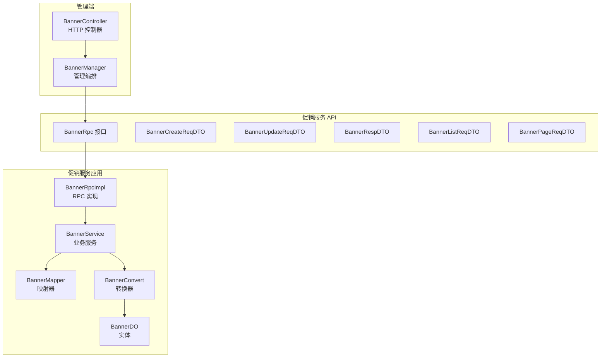
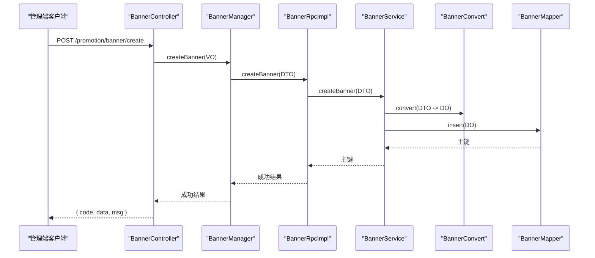
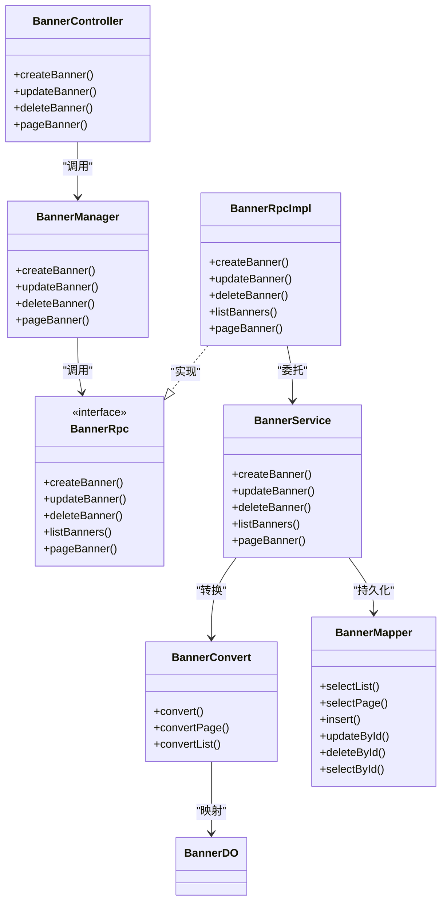
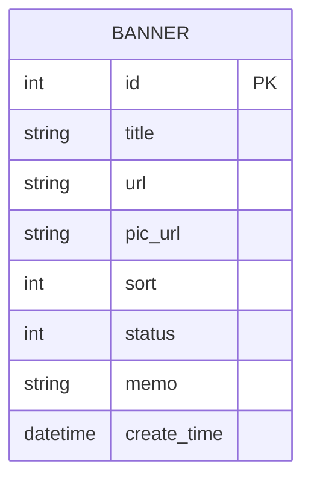

# 轮播图管理接口

<cite>
**本文引用的文件**
- [BannerController.java](file://management-web-app/src/main/java/cn/iocoder/mall/managementweb/controller/promotion/brand/BannerController.java)
- [BannerManager.java](file://management-web-app/src/main/java/cn/iocoder/mall/managementweb/manager/promotion/brand/BannerManager.java)
- [BannerRpc.java](file://promotion-service-project/promotion-service-api/src/main/java/cn/iocoder/mall/promotion/api/rpc/banner/BannerRpc.java)
- [BannerRpcImpl.java](file://promotion-service-project/promotion-service-app/src/main/java/cn/iocoder/mall/promotionservice/rpc/banner/BannerRpcImpl.java)
- [BannerService.java](file://promotion-service-project/promotion-service-app/src/main/java/cn/iocoder/mall/promotionservice/service/banner/BannerService.java)
- [BannerDO.java](file://promotion-service-project/promotion-service-app/src/main/java/cn/iocoder/mall/promotionservice/dal/mysql/dataobject/banner/BannerDO.java)
- [BannerMapper.java](file://promotion-service-project/promotion-service-app/src/main/java/cn/iocoder/mall/promotionservice/dal/mysql/mapper/banner/BannerMapper.java)
- [BannerCreateReqDTO.java](file://promotion-service-project/promotion-service-api/src/main/java/cn/iocoder/mall/promotion/api/rpc/banner/dto/BannerCreateReqDTO.java)
- [BannerUpdateReqDTO.java](file://promotion-service-project/promotion-service-api/src/main/java/cn/iocoder/mall/promotion/api/rpc/banner/dto/BannerUpdateReqDTO.java)
- [BannerRespDTO.java](file://promotion-service-project/promotion-service-api/src/main/java/cn/iocoder/mall/promotion/api/rpc/banner/dto/BannerRespDTO.java)
- [BannerListReqDTO.java](file://promotion-service-project/promotion-service-api/src/main/java/cn/iocoder/mall/promotion/api/rpc/banner/dto/BannerListReqDTO.java)
- [BannerPageReqDTO.java](file://promotion-service-project/promotion-service-api/src/main/java/cn/iocoder/mall/promotion/api/rpc/banner/dto/BannerPageReqDTO.java)
- [BannerConvert.java](file://promotion-service-project/promotion-service-app/src/main/java/cn/iocoder/mall/promotionservice/convert/banner/BannerConvert.java)
- [CommonStatusEnum.java](file://common/common-framework/src/main/java/cn/iocoder/common/framework/enums/CommonStatusEnum.java)
</cite>

## 目录
1. [简介](#简介)
2. [项目结构](#项目结构)
3. [核心组件](#核心组件)
4. [架构总览](#架构总览)
5. [详细组件分析](#详细组件分析)
6. [依赖关系分析](#依赖关系分析)
7. [性能考虑](#性能考虑)
8. [故障排查指南](#故障排查指南)
9. [结论](#结论)
10. [附录](#附录)

## 简介
本文件为“轮播图管理接口”的权威技术文档，覆盖管理端对轮播图（Banner）的创建、编辑、删除、分页查询等管理能力，并明确接口规范、数据模型、业务规则与技术实现要点。当前系统采用前后端分离与微服务架构，管理端通过 HTTP 控制器调用 Banner 管理服务，服务内部通过 RPC 接口与数据库交互。

## 项目结构
围绕轮播图管理的关键模块分布如下：
- 管理端 Web 应用：提供 HTTP 接口，负责权限校验与参数封装
- 管理端 Manager 层：编排 RPC 调用，统一错误处理
- 促销服务 API：定义 Banner 的 RPC 接口与 DTO
- 促销服务应用：实现 RPC 接口、服务层、DAO 层与 Mapper

图表来源
- [BannerController.java:25-66](file://management-web-app/src/main/java/cn/iocoder/mall/managementweb/controller/promotion/brand/BannerController.java#L25-L66)
- [BannerManager.java:18-69](file://management-web-app/src/main/java/cn/iocoder/mall/managementweb/manager/promotion/brand/BannerManager.java#L18-L69)
- [BannerRpc.java:12-52](file://promotion-service-project/promotion-service-api/src/main/java/cn/iocoder/mall/promotion/api/rpc/banner/BannerRpc.java#L12-L52)
- [BannerRpcImpl.java:15-49](file://promotion-service-project/promotion-service-app/src/main/java/cn/iocoder/mall/promotionservice/rpc/banner/BannerRpcImpl.java#L15-L49)
- [BannerService.java:20-93](file://promotion-service-project/promotion-service-app/src/main/java/cn/iocoder/mall/promotionservice/service/banner/BannerService.java#L20-L93)
- [BannerDO.java:16-51](file://promotion-service-project/promotion-service-app/src/main/java/cn/iocoder/mall/promotionservice/dal/mysql/dataobject/banner/BannerDO.java#L16-L51)
- [BannerMapper.java](file://promotion-service-project/promotion-service-app/src/main/java/cn/iocoder/mall/promotionservice/dal/mysql/mapper/banner/BannerMapper.java)

章节来源
- [BannerController.java:25-66](file://management-web-app/src/main/java/cn/iocoder/mall/managementweb/controller/promotion/brand/BannerController.java#L25-L66)
- [BannerManager.java:18-69](file://management-web-app/src/main/java/cn/iocoder/mall/managementweb/manager/promotion/brand/BannerManager.java#L18-L69)
- [BannerRpc.java:12-52](file://promotion-service-project/promotion-service-api/src/main/java/cn/iocoder/mall/promotion/api/rpc/banner/BannerRpc.java#L12-L52)
- [BannerRpcImpl.java:15-49](file://promotion-service-project/promotion-service-app/src/main/java/cn/iocoder/mall/promotionservice/rpc/banner/BannerRpcImpl.java#L15-L49)
- [BannerService.java:20-93](file://promotion-service-project/promotion-service-app/src/main/java/cn/iocoder/mall/promotionservice/service/banner/BannerService.java#L20-L93)
- [BannerDO.java:16-51](file://promotion-service-project/promotion-service-app/src/main/java/cn/iocoder/mall/promotionservice/dal/mysql/dataobject/banner/BannerDO.java#L16-L51)

## 核心组件
- HTTP 控制器：提供创建、更新、删除、分页查询等接口，绑定权限注解
- 管理编排层：封装 VO 到 DTO 的转换，调用 RPC 接口并处理返回
- RPC 接口：定义创建、更新、删除、列表、分页等能力
- 业务服务：执行校验、插入/更新/删除操作，返回主键或布尔值
- 数据访问层：MyBatis Plus 映射器，支持分页与列表查询
- 数据对象：持久化实体，包含标题、链接、图片、排序、状态、备注等字段
- 转换器：MapStruct 将 VO/DTO 与 DO 进行双向转换

章节来源
- [BannerController.java:25-66](file://management-web-app/src/main/java/cn/iocoder/mall/managementweb/controller/promotion/brand/BannerController.java#L25-L66)
- [BannerManager.java:18-69](file://management-web-app/src/main/java/cn/iocoder/mall/managementweb/manager/promotion/brand/BannerManager.java#L18-L69)
- [BannerRpc.java:12-52](file://promotion-service-project/promotion-service-api/src/main/java/cn/iocoder/mall/promotion/api/rpc/banner/BannerRpc.java#L12-L52)
- [BannerService.java:20-93](file://promotion-service-project/promotion-service-app/src/main/java/cn/iocoder/mall/promotionservice/service/banner/BannerService.java#L20-L93)
- [BannerDO.java:16-51](file://promotion-service-project/promotion-service-app/src/main/java/cn/iocoder/mall/promotionservice/dal/mysql/dataobject/banner/BannerDO.java#L16-L51)
- [BannerConvert.java:15-30](file://promotion-service-project/promotion-service-app/src/main/java/cn/iocoder/mall/promotionservice/convert/banner/BannerConvert.java#L15-L30)

## 架构总览
下图展示了从管理端 HTTP 请求到服务层处理与持久化的整体流程：

图表来源
- [BannerController.java:34-39](file://management-web-app/src/main/java/cn/iocoder/mall/managementweb/controller/promotion/brand/BannerController.java#L34-L39)
- [BannerManager.java:30-34](file://management-web-app/src/main/java/cn/iocoder/mall/managementweb/manager/promotion/brand/BannerManager.java#L30-L34)
- [BannerRpcImpl.java:21-24](file://promotion-service-project/promotion-service-app/src/main/java/cn/iocoder/mall/promotionservice/rpc/banner/BannerRpcImpl.java#L21-L24)
- [BannerService.java:55-61](file://promotion-service-project/promotion-service-app/src/main/java/cn/iocoder/mall/promotionservice/service/banner/BannerService.java#L55-L61)
- [BannerConvert.java:20](file://promotion-service-project/promotion-service-app/src/main/java/cn/iocoder/mall/promotionservice/convert/banner/BannerConvert.java#L20)
- [BannerMapper.java](file://promotion-service-project/promotion-service-app/src/main/java/cn/iocoder/mall/promotionservice/dal/mysql/mapper/banner/BannerMapper.java)

## 详细组件分析

### 接口清单与规范
以下为管理端提供的轮播图管理接口规范。所有接口均基于 HTTP 协议，使用 JSON 作为请求/响应体格式；权限控制通过注解进行校验。

- 创建轮播图
  - 方法与路径：POST /promotion/banner/create
  - 权限标识：promotion:banner:create
  - 请求体：BannerCreateReqVO → BannerCreateReqDTO
  - 响应体：CommonResult<Integer>，data 为新建 Banner 的主键
  - 参数校验：见请求 DTO 字段约束
  - 错误码：参考服务层异常与通用错误码

- 更新轮播图
  - 方法与路径：POST /promotion/banner/update
  - 权限标识：promotion:banner:update
  - 请求体：BannerUpdateReqVO → BannerUpdateReqDTO
  - 响应体：CommonResult<Boolean>，data 为 true
  - 参数校验：见请求 DTO 字段约束

- 删除轮播图
  - 方法与路径：POST /promotion/banner/delete
  - 权限标识：promotion:banner:delete
  - 查询参数：bannerId（整数）
  - 响应体：CommonResult<Boolean>，data 为 true

- 获取轮播图分页
  - 方法与路径：GET /promotion/banner/page
  - 权限标识：promotion:banner:page
  - 查询参数：title（可选，模糊匹配）、分页参数（由 PageParam 提供）
  - 响应体：CommonResult<PageResult<BannerRespVO>>

章节来源
- [BannerController.java:34-63](file://management-web-app/src/main/java/cn/iocoder/mall/managementweb/controller/promotion/brand/BannerController.java#L34-L63)
- [BannerManager.java:30-66](file://management-web-app/src/main/java/cn/iocoder/mall/managementweb/manager/promotion/brand/BannerManager.java#L30-L66)
- [BannerRpc.java:20-50](file://promotion-service-project/promotion-service-api/src/main/java/cn/iocoder/mall/promotion/api/rpc/banner/BannerRpc.java#L20-L50)
- [BannerRpcImpl.java:21-46](file://promotion-service-project/promotion-service-app/src/main/java/cn/iocoder/mall/promotionservice/rpc/banner/BannerRpcImpl.java#L21-L46)

### 请求与响应数据模型
- 创建请求模型 BannerCreateReqDTO
  - 字段：title、url、picUrl、sort、status、memo
  - 约束：必填、长度、URL 格式、枚举范围
- 更新请求模型 BannerUpdateReqDTO
  - 字段：id、title、url、picUrl、sort、status、memo
  - 约束：同上，且 id 必填
- 响应模型 BannerRespDTO
  - 字段：id、title、url、picUrl、sort、status、memo、createTime
- 列表查询模型 BannerListReqDTO
  - 字段：status（可选）
- 分页查询模型 BannerPageReqDTO
  - 继承 PageParam，新增 title 模糊查询

章节来源
- [BannerCreateReqDTO.java:19-58](file://promotion-service-project/promotion-service-api/src/main/java/cn/iocoder/mall/promotion/api/rpc/banner/dto/BannerCreateReqDTO.java#L19-L58)
- [BannerUpdateReqDTO.java:19-63](file://promotion-service-project/promotion-service-api/src/main/java/cn/iocoder/mall/promotion/api/rpc/banner/dto/BannerUpdateReqDTO.java#L19-L63)
- [BannerRespDTO.java:14-49](file://promotion-service-project/promotion-service-api/src/main/java/cn/iocoder/mall/promotion/api/rpc/banner/dto/BannerRespDTO.java#L14-L49)
- [BannerListReqDTO.java:15-23](file://promotion-service-project/promotion-service-api/src/main/java/cn/iocoder/mall/promotion/api/rpc/banner/dto/BannerListReqDTO.java#L15-L23)
- [BannerPageReqDTO.java:14-21](file://promotion-service-project/promotion-service-api/src/main/java/cn/iocoder/mall/promotion/api/rpc/banner/dto/BannerPageReqDTO.java#L14-L21)

### 业务规则与展示逻辑
- 状态管理
  - 使用通用状态枚举进行约束，确保状态合法
- 排序规则
  - 以 sort 字段进行排序，数值越小优先级越高（具体顺序以前端/服务端约定为准）
- 展示位置与投放
  - 当前 API 未定义“展示位置”字段；如需按位置投放，请在后续扩展中增加位置枚举与过滤条件
- 失效处理
  - 未发现自动失效逻辑；如需定时任务或过期字段，请在实体与服务层扩展
- 点击统计
  - 实体中预留字段用于记录点击次数；当前 API 未暴露点击统计接口，可在前端埋点或服务端埋点后扩展

章节来源
- [BannerDO.java:42-49](file://promotion-service-project/promotion-service-app/src/main/java/cn/iocoder/mall/promotionservice/dal/mysql/dataobject/banner/BannerDO.java#L42-L49)
- [CommonStatusEnum.java](file://common/common-framework/src/main/java/cn/iocoder/common/framework/enums/CommonStatusEnum.java)

### 图片上传、链接配置与 CDN
- 图片与链接
  - picUrl 与 url 均为 URL 类型，建议指向 CDN 或静态资源服务器
- 图片处理
  - 建议在存储层或网关层进行尺寸裁剪、压缩与格式转换，避免在服务端重复处理
- CDN 配置
  - 建议统一接入 CDN，设置缓存头与回源策略，提升加载速度
- 缓存策略
  - 可在服务端对热点 Banner 列表进行短期缓存，降低数据库压力
- 性能优化
  - 合理设置分页大小，避免一次性拉取过多数据
  - 对高频查询建立索引（如 status、title）

章节来源
- [BannerCreateReqDTO.java:37-40](file://promotion-service-project/promotion-service-api/src/main/java/cn/iocoder/mall/promotion/api/rpc/banner/dto/BannerCreateReqDTO.java#L37-L40)
- [BannerUpdateReqDTO.java:42-45](file://promotion-service-project/promotion-service-api/src/main/java/cn/iocoder/mall/promotion/api/rpc/banner/dto/BannerUpdateReqDTO.java#L42-L45)

### 接口测试方法与展示效果追踪
- 接口测试
  - 使用 HTTP 客户端工具（如 Postman、curl）调用各接口，验证权限、参数校验与分页行为
  - 测试步骤建议：
    - 创建：提交有效数据，断言返回主键
    - 更新：传入已存在 id，断言成功
    - 删除：传入已存在 id，断言成功
    - 分页：构造多条数据，断言分页与排序
- 展示效果追踪
  - 建议在前端埋点上报曝光与点击事件，服务端可扩展点击统计字段与报表接口

章节来源
- [BannerController.java:34-63](file://management-web-app/src/main/java/cn/iocoder/mall/managementweb/controller/promotion/brand/BannerController.java#L34-L63)

## 依赖关系分析
- 控制器依赖管理编排层
- 管理编排层依赖 RPC 接口
- RPC 实现依赖业务服务
- 业务服务依赖转换器与映射器
- 映射器访问数据库

图表来源
- [BannerController.java:25-66](file://management-web-app/src/main/java/cn/iocoder/mall/managementweb/controller/promotion/brand/BannerController.java#L25-L66)
- [BannerManager.java:18-69](file://management-web-app/src/main/java/cn/iocoder/mall/managementweb/manager/promotion/brand/BannerManager.java#L18-L69)
- [BannerRpc.java:12-52](file://promotion-service-project/promotion-service-api/src/main/java/cn/iocoder/mall/promotion/api/rpc/banner/BannerRpc.java#L12-L52)
- [BannerRpcImpl.java:15-49](file://promotion-service-project/promotion-service-app/src/main/java/cn/iocoder/mall/promotionservice/rpc/banner/BannerRpcImpl.java#L15-L49)
- [BannerService.java:20-93](file://promotion-service-project/promotion-service-app/src/main/java/cn/iocoder/mall/promotionservice/service/banner/BannerService.java#L20-L93)
- [BannerConvert.java:15-30](file://promotion-service-project/promotion-service-app/src/main/java/cn/iocoder/mall/promotionservice/convert/banner/BannerConvert.java#L15-L30)
- [BannerMapper.java](file://promotion-service-project/promotion-service-app/src/main/java/cn/iocoder/mall/promotionservice/dal/mysql/mapper/banner/BannerMapper.java)
- [BannerDO.java:16-51](file://promotion-service-project/promotion-service-app/src/main/java/cn/iocoder/mall/promotionservice/dal/mysql/dataobject/banner/BannerDO.java#L16-L51)

## 性能考虑
- 数据库层面
  - 为 status、title 建立索引，提升分页与筛选效率
  - 控制单页数量，避免超大分页
- 缓存层面
  - 对热门 Banner 列表进行短期缓存，降低数据库压力
- 网络与存储
  - 图片与链接走 CDN，合理设置缓存头
- 服务治理
  - RPC 调用使用连接池与超时控制，避免阻塞

## 故障排查指南
- 常见错误
  - 参数校验失败：检查必填项、长度、URL 格式、枚举值
  - Banner 不存在：更新/删除时若 id 无效会抛出异常
- 排查步骤
  - 确认权限是否具备（promotion:banner:*）
  - 核对请求 DTO 字段与约束
  - 查看服务端日志与异常码
- 建议
  - 在管理端统一捕获并提示错误信息
  - 对外暴露标准化错误码与消息

章节来源
- [BannerService.java:68-90](file://promotion-service-project/promotion-service-app/src/main/java/cn/iocoder/mall/promotionservice/service/banner/BannerService.java#L68-L90)
- [BannerManager.java:30-66](file://management-web-app/src/main/java/cn/iocoder/mall/managementweb/manager/promotion/brand/BannerManager.java#L30-L66)

## 结论
本接口体系提供了完整的轮播图管理能力，具备清晰的分层设计与良好的扩展性。当前版本聚焦于基础 CRUD 与分页查询，后续可按需扩展“展示位置”、“点击统计”、“自动失效”等高级特性，并完善图片处理与 CDN 配置策略。

## 附录

### Banner 配置示例（概念性说明）
- 首页轮播
  - 场景：首页顶部横幅，支持跳转至活动页或商品详情
  - 关键字段：title、picUrl、url、sort、status
- 活动专区
  - 场景：活动入口引导，建议使用短链或埋点链接
  - 关键字段：title、picUrl、url、memo
- 商品推荐
  - 场景：商品卡片式推荐，建议使用商品详情链接
  - 关键字段：title、picUrl、url、sort

### 数据模型关系图

图表来源
- [BannerDO.java:16-51](file://promotion-service-project/promotion-service-app/src/main/java/cn/iocoder/mall/promotionservice/dal/mysql/dataobject/banner/BannerDO.java#L16-L51)