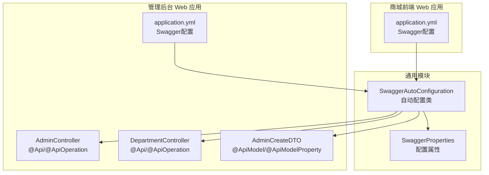
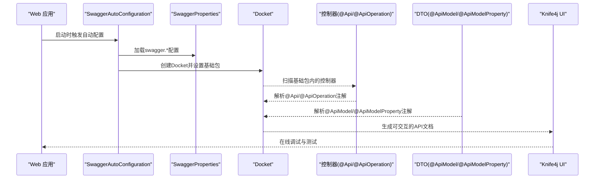
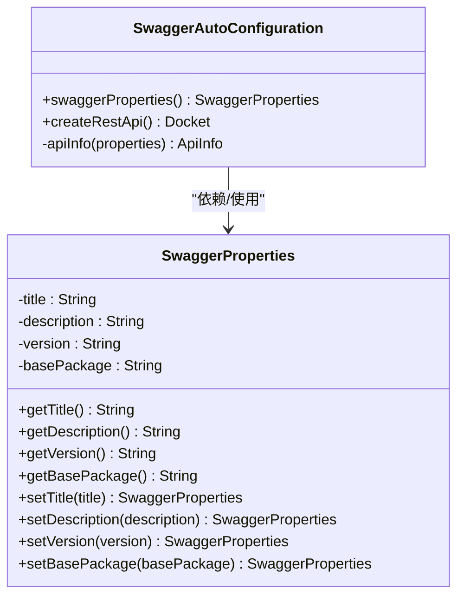
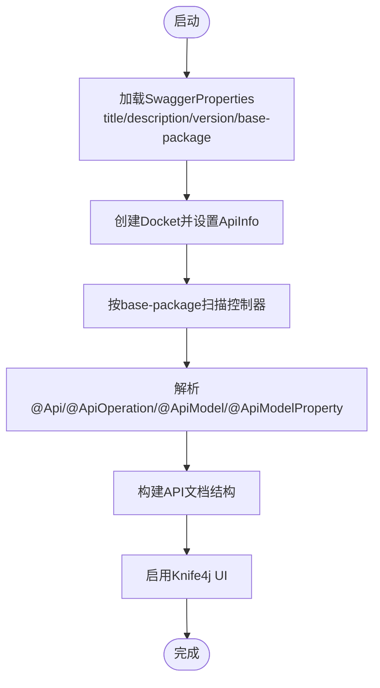
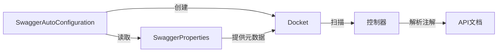

# Swagger API文档

<cite>
**本文引用的文件**
- [SwaggerAutoConfiguration.java](file://common/mall-spring-boot-starter-swagger/src/main/java/cn/iocoder/mall/swagger/config/SwaggerAutoConfiguration.java)
- [SwaggerProperties.java](file://common/mall-spring-boot-starter-swagger/src/main/java/cn/iocoder/mall/swagger/config/SwaggerProperties.java)
- [application.yml（管理后台）](file://management-web-app/src/main/resources/application.yml)
- [application.yml（商城前端）](file://shop-web-app/src/main/resources/application.yml)
- [AdminController.java](file://management-web-app/src/main/java/cn/iocoder/mall/managementweb/controller/admin/AdminController.java)
- [DepartmentController.java](file://management-web-app/src/main/java/cn/iocoder/mall/managementweb/controller/admin/DepartmentController.java)
- [AdminCreateDTO.java](file://management-web-app/src/main/java/cn/iocoder/mall/managementweb/controller/admin/dto/AdminCreateDTO.java)
</cite>

## 目录
1. [简介](#简介)
2. [项目结构](#项目结构)
3. [核心组件](#核心组件)
4. [架构总览](#架构总览)
5. [详细组件分析](#详细组件分析)
6. [依赖关系分析](#依赖关系分析)
7. [性能考虑](#性能考虑)
8. [故障排查指南](#故障排查指南)
9. [结论](#结论)
10. [附录](#附录)

## 简介
本技术文档围绕Swagger在Web应用中的集成与使用展开，重点覆盖以下方面：
- API文档自动生成与在线调试
- Swagger自动配置机制（文档扫描、配置加载、组件注册）
- SwaggerProperties配置项（API版本、标题、描述、基础包等元数据）
- 各Web应用的Swagger配置（管理后台与商城前端的文档生成规则）
- API文档的组织结构（接口分组、标签管理、版本控制）
- API测试与调试方法（在线测试工具、参数输入、响应查看）
- API文档的维护与更新指南

## 项目结构
Swagger相关能力由通用starter提供，具体在管理后台与商城前端两个Web应用中分别启用并配置。核心文件分布如下：
- 自动配置与属性定义：common/mall-spring-boot-starter-swagger
- 应用配置：management-web-app、shop-web-app 的 application.yml
- 控制器与DTO示例：management-web-app 控制器与DTO

图表来源
- [SwaggerAutoConfiguration.java:1-58](file://common/mall-spring-boot-starter-swagger/src/main/java/cn/iocoder/mall/swagger/config/SwaggerAutoConfiguration.java#L1-L58)
- [SwaggerProperties.java:1-49](file://common/mall-spring-boot-starter-swagger/src/main/java/cn/iocoder/mall/swagger/config/SwaggerProperties.java#L1-L49)
- [application.yml（管理后台）:72-78](file://management-web-app/src/main/resources/application.yml#L72-L78)
- [application.yml（商城前端）:65-71](file://shop-web-app/src/main/resources/application.yml#L65-L71)
- [AdminController.java:28-68](file://management-web-app/src/main/java/cn/iocoder/mall/managementweb/controller/admin/AdminController.java#L28-L68)
- [DepartmentController.java:27-82](file://management-web-app/src/main/java/cn/iocoder/mall/managementweb/controller/admin/DepartmentController.java#L27-L82)
- [AdminCreateDTO.java:13-39](file://management-web-app/src/main/java/cn/iocoder/mall/managementweb/controller/admin/dto/AdminCreateDTO.java#L13-L39)

章节来源
- [SwaggerAutoConfiguration.java:1-58](file://common/mall-spring-boot-starter-swagger/src/main/java/cn/iocoder/mall/swagger/config/SwaggerAutoConfiguration.java#L1-L58)
- [SwaggerProperties.java:1-49](file://common/mall-spring-boot-starter-swagger/src/main/java/cn/iocoder/mall/swagger/config/SwaggerProperties.java#L1-L49)
- [application.yml（管理后台）:72-78](file://management-web-app/src/main/resources/application.yml#L72-L78)
- [application.yml（商城前端）:65-71](file://shop-web-app/src/main/resources/application.yml#L65-L71)

## 核心组件
- Swagger自动配置类：负责条件化启用Swagger、加载SwaggerProperties、创建Docket并绑定基础包扫描。
- SwaggerProperties：封装Swagger元数据与扫描基础包配置。

章节来源
- [SwaggerAutoConfiguration.java:23-58](file://common/mall-spring-boot-starter-swagger/src/main/java/cn/iocoder/mall/swagger/config/SwaggerAutoConfiguration.java#L23-L58)
- [SwaggerProperties.java:5-49](file://common/mall-spring-boot-starter-swagger/src/main/java/cn/iocoder/mall/swagger/config/SwaggerProperties.java#L5-L49)

## 架构总览
下图展示Swagger在系统中的装配与运行流程：应用启动时通过自动配置类加载属性、创建Docket并扫描指定基础包；控制器与DTO上使用Swagger注解以生成文档；Knife4j增强UI用于在线调试。

图表来源
- [SwaggerAutoConfiguration.java:31-55](file://common/mall-spring-boot-starter-swagger/src/main/java/cn/iocoder/mall/swagger/config/SwaggerAutoConfiguration.java#L31-L55)
- [SwaggerProperties.java:5-49](file://common/mall-spring-boot-starter-swagger/src/main/java/cn/iocoder/mall/swagger/config/SwaggerProperties.java#L5-L49)
- [AdminController.java:28-68](file://management-web-app/src/main/java/cn/iocoder/mall/managementweb/controller/admin/AdminController.java#L28-L68)
- [DepartmentController.java:27-82](file://management-web-app/src/main/java/cn/iocoder/mall/managementweb/controller/admin/DepartmentController.java#L27-L82)
- [AdminCreateDTO.java:13-39](file://management-web-app/src/main/java/cn/iocoder/mall/managementweb/controller/admin/dto/AdminCreateDTO.java#L13-L39)

## 详细组件分析

### Swagger自动配置机制
- 条件化启用：基于是否存在Docket与ApiInfoBuilder类、以及swagger.enable属性是否启用。
- 属性绑定：@EnableConfigurationProperties绑定swagger前缀的配置。
- 组件注册：注册SwaggerProperties默认Bean；创建Docket Bean并设置API元信息与基础包扫描。
- 文档扫描：通过RequestHandlerSelectors.basePackage读取SwaggerProperties的base-package，限定扫描范围。

图表来源
- [SwaggerAutoConfiguration.java:29-55](file://common/mall-spring-boot-starter-swagger/src/main/java/cn/iocoder/mall/swagger/config/SwaggerAutoConfiguration.java#L29-L55)
- [SwaggerProperties.java:6-48](file://common/mall-spring-boot-starter-swagger/src/main/java/cn/iocoder/mall/swagger/config/SwaggerProperties.java#L6-L48)

章节来源
- [SwaggerAutoConfiguration.java:23-58](file://common/mall-spring-boot-starter-swagger/src/main/java/cn/iocoder/mall/swagger/config/SwaggerAutoConfiguration.java#L23-L58)
- [SwaggerProperties.java:5-49](file://common/mall-spring-boot-starter-swagger/src/main/java/cn/iocoder/mall/swagger/config/SwaggerProperties.java#L5-L49)

### SwaggerProperties配置项
- 标题（title）：API文档标题
- 描述（description）：API功能描述
- 版本（version）：API版本号
- 基础包（base-package）：扫描控制器的基础包路径

章节来源
- [SwaggerProperties.java:8-11](file://common/mall-spring-boot-starter-swagger/src/main/java/cn/iocoder/mall/swagger/config/SwaggerProperties.java#L8-L11)

### 各Web应用的Swagger配置
- 管理后台（management-web-app）
  - 标题：管理后台
  - 描述：提供管理员管理的所有功能
  - 版本：1.0.0
  - 基础包：cn.iocoder.mall.managementweb.controller
- 商城前端（shop-web-app）
  - 标题：商城中心
  - 描述：提供用户商城购物流程中的 API
  - 版本：1.0.0
  - 基础包：cn.iocoder.mall.shopweb.controller

章节来源
- [application.yml（管理后台）:72-78](file://management-web-app/src/main/resources/application.yml#L72-L78)
- [application.yml（商城前端）:65-71](file://shop-web-app/src/main/resources/application.yml#L65-L71)

### API文档组织结构
- 接口分组与标签管理：通过@Controller或@RestController上的@Api注解的tags字段对控制器进行分组；@ApiOperation用于为具体接口添加说明。
- 版本控制：通过SwaggerProperties的version字段统一管理。
- 基础包扫描：通过swagger.base-package限定扫描范围，确保文档生成仅包含目标模块。

图表来源
- [SwaggerAutoConfiguration.java:37-55](file://common/mall-spring-boot-starter-swagger/src/main/java/cn/iocoder/mall/swagger/config/SwaggerAutoConfiguration.java#L37-L55)
- [SwaggerProperties.java:5-49](file://common/mall-spring-boot-starter-swagger/src/main/java/cn/iocoder/mall/swagger/config/SwaggerProperties.java#L5-L49)

章节来源
- [AdminController.java:28-68](file://management-web-app/src/main/java/cn/iocoder/mall/managementweb/controller/admin/AdminController.java#L28-L68)
- [DepartmentController.java:27-82](file://management-web-app/src/main/java/cn/iocoder/mall/managementweb/controller/admin/DepartmentController.java#L27-L82)
- [AdminCreateDTO.java:13-39](file://management-web-app/src/main/java/cn/iocoder/mall/managementweb/controller/admin/dto/AdminCreateDTO.java#L13-L39)

### API测试与调试
- 在线调试入口：应用静态路径配置为/doc.html，可通过该路径访问Knife4j UI。
- 参数输入：控制器与DTO上已标注@ApiModel/@ApiModelProperty等注解，便于在UI中直观填写请求参数。
- 响应查看：UI支持直接调用接口并查看响应内容与状态码。

章节来源
- [application.yml（管理后台）:17](file://management-web-app/src/main/resources/application.yml#L17)
- [application.yml（商城前端）:17](file://shop-web-app/src/main/resources/application.yml#L17)
- [AdminCreateDTO.java:18-36](file://management-web-app/src/main/java/cn/iocoder/mall/managementweb/controller/admin/dto/AdminCreateDTO.java#L18-L36)

## 依赖关系分析
- 自动配置类依赖Springfox Swagger2与Knife4j，通过@EnableSwagger2与@EnableKnife4j启用。
- Docket的创建依赖SwaggerProperties提供的元数据与基础包。
- 控制器与DTO通过Swagger注解参与文档生成。

图表来源
- [SwaggerAutoConfiguration.java:23-55](file://common/mall-spring-boot-starter-swagger/src/main/java/cn/iocoder/mall/swagger/config/SwaggerAutoConfiguration.java#L23-L55)
- [SwaggerProperties.java:5-49](file://common/mall-spring-boot-starter-swagger/src/main/java/cn/iocoder/mall/swagger/config/SwaggerProperties.java#L5-L49)

章节来源
- [SwaggerAutoConfiguration.java:23-28](file://common/mall-spring-boot-starter-swagger/src/main/java/cn/iocoder/mall/swagger/config/SwaggerAutoConfiguration.java#L23-L28)

## 性能考虑
- 文档扫描范围：通过swagger.base-package精确限定扫描范围，避免不必要的包扫描开销。
- 条件化启用：当swagger.enable=false时禁用Swagger，减少运行时开销。
- UI静态资源：doc.html作为静态路径，避免动态路由带来的额外处理。

章节来源
- [SwaggerAutoConfiguration.java:26-28](file://common/mall-spring-boot-starter-swagger/src/main/java/cn/iocoder/mall/swagger/config/SwaggerAutoConfiguration.java#L26-L28)
- [application.yml（管理后台）:17](file://management-web-app/src/main/resources/application.yml#L17)
- [application.yml（商城前端）:17](file://shop-web-app/src/main/resources/application.yml#L17)

## 故障排查指南
- 文档未生成
  - 检查swagger.enable是否为true（默认true），确认自动配置类被加载。
  - 确认swagger.base-package是否正确指向控制器所在包。
- 文档空白或无接口
  - 确保控制器类上存在@Api注解且方法上存在@ApiOperation注解。
  - 确认DTO类上存在@ApiModel/@ApiModelProperty注解。
- UI无法访问
  - 检查静态路径配置是否为/doc.html。
  - 确认应用端口与context-path配置正确。

章节来源
- [SwaggerAutoConfiguration.java:26-28](file://common/mall-spring-boot-starter-swagger/src/main/java/cn/iocoder/mall/swagger/config/SwaggerAutoConfiguration.java#L26-L28)
- [application.yml（管理后台）:17](file://management-web-app/src/main/resources/application.yml#L17)
- [application.yml（商城前端）:17](file://shop-web-app/src/main/resources/application.yml#L17)
- [AdminController.java:28-68](file://management-web-app/src/main/java/cn/iocoder/mall/managementweb/controller/admin/AdminController.java#L28-L68)
- [DepartmentController.java:27-82](file://management-web-app/src/main/java/cn/iocoder/mall/managementweb/controller/admin/DepartmentController.java#L27-L82)
- [AdminCreateDTO.java:13-39](file://management-web-app/src/main/java/cn/iocoder/mall/managementweb/controller/admin/dto/AdminCreateDTO.java#L13-L39)

## 结论
本项目通过通用Swagger Starter实现了对管理后台与商城前端的API文档自动生成与在线调试能力。自动配置类负责加载属性、创建Docket并限定扫描范围；应用通过application.yml配置标题、描述、版本与基础包；控制器与DTO上的Swagger注解共同构建了清晰的接口文档与交互式UI。建议在新增模块时遵循相同的注解规范与配置约定，以保持文档的一致性与可维护性。

## 附录
- 维护与更新建议
  - 新增控制器时，务必添加@Api与@ApiOperation注解，并为复杂DTO添加@ApiModel/@ApiModelProperty注解。
  - 当业务模块迁移或包结构调整时，同步更新swagger.base-package。
  - 定期核对swagger.title、swagger.description、swagger.version，确保与实际版本一致。
  - 如需禁用Swagger，请设置swagger.enable=false。