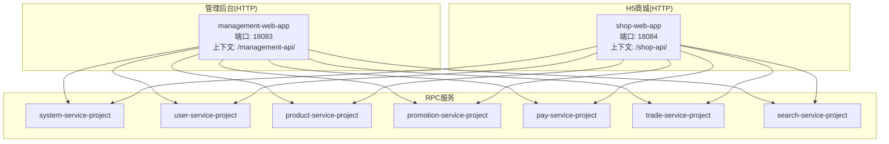
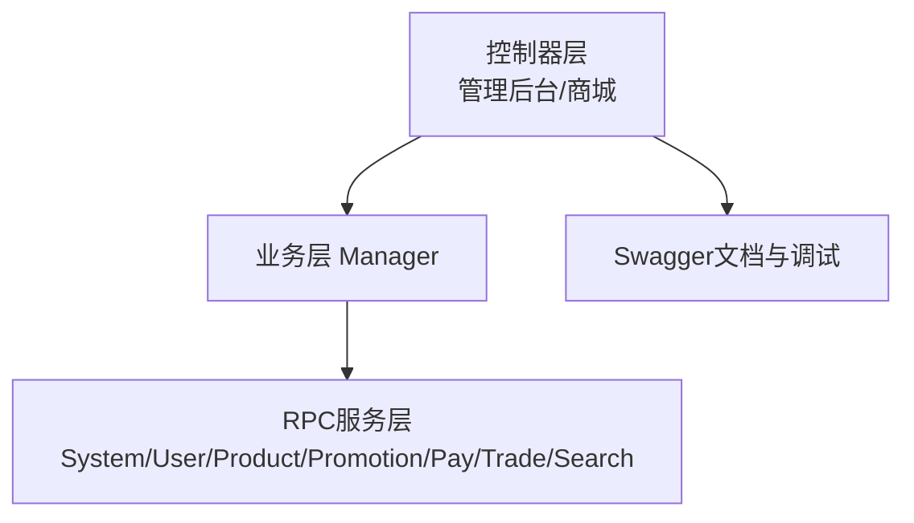
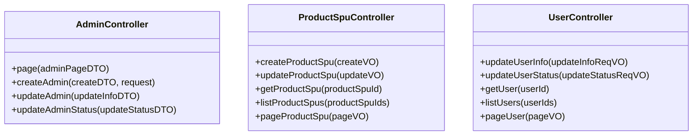
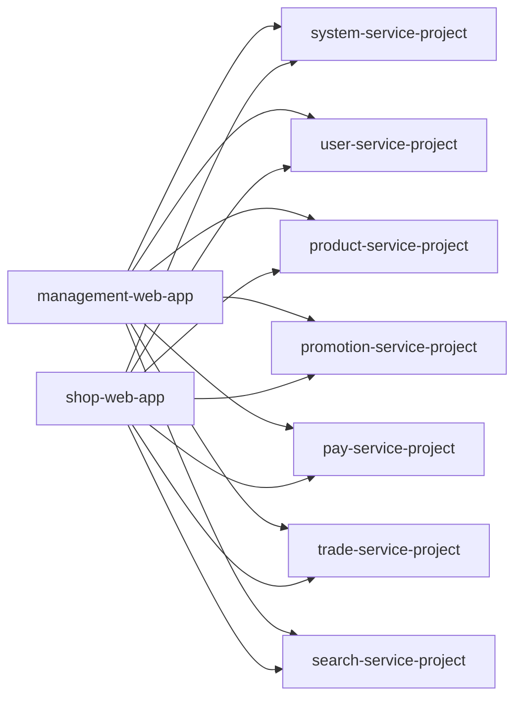

# Web应用模块

<cite>
**本文引用的文件**
- [README.md](file://README.md)
- [docs/README.md](file://docs/README.md)
- [docs/setup/quick-start.md](file://docs/setup/quick-start.md)
- [management-web-app/ManagementWebApplication.java](file://management-web-app/src/main/java/cn/iocoder/mall/managementweb/ManagementWebApplication.java)
- [management-web-app/application.yml](file://management-web-app/src/main/resources/application.yml)
- [management-web-app/controller/admin/AdminController.java](file://management-web-app/src/main/java/cn/iocoder/mall/managementweb/controller/admin/AdminController.java)
- [management-web-app/controller/product/ProductSpuController.java](file://management-web-app/src/main/java/cn/iocoder/mall/managementweb/controller/product/ProductSpuController.java)
- [management-web-app/controller/user/UserController.java](file://management-web-app/src/main/java/cn/iocoder/mall/managementweb/controller/user/UserController.java)
- [shop-web-app/ShopWebApplication.java](file://shop-web-app/src/main/java/cn/iocoder/mall/shopweb/ShopWebApplication.java)
- [shop-web-app/application.yml](file://shop-web-app/src/main/resources/application.yml)
</cite>

## 目录
1. [简介](#简介)
2. [项目结构](#项目结构)
3. [核心组件](#核心组件)
4. [架构总览](#架构总览)
5. [详细组件分析](#详细组件分析)
6. [依赖关系分析](#依赖关系分析)
7. [性能考量](#性能考量)
8. [故障排查指南](#故障排查指南)
9. [结论](#结论)
10. [附录](#附录)

## 简介
本文件面向“Web应用模块”，围绕管理后台与H5商城两大HTTP服务，系统化梳理其架构设计、前后端分离实现、API接口规范、认证授权与跨域策略、Swagger文档集成、静态资源与前端路由配置、控制器职责与实现要点、接口文档与使用示例，以及前端开发环境搭建与调试方法。目标是帮助开发者快速理解并高效扩展管理后台与H5商城的功能。

## 项目结构
- 后端采用“xxx-web-app”提供对外HTTP API，“xxx-service-project”提供RPC内部服务的分层架构。
- 管理后台HTTP服务：management-web-app，端口18083，上下文路径“/management-api/”，集成Swagger。
- H5商城HTTP服务：shop-web-app，端口18084，上下文路径“/shop-api/”，集成Swagger。
- 前端项目位于独立仓库，分别提供管理后台与H5商城的Vue实现，端口分别为9527与8080。

图表来源
- [management-web-app/application.yml:1-83](file://management-web-app/src/main/resources/application.yml#L1-L83)
- [shop-web-app/application.yml:1-76](file://shop-web-app/src/main/resources/application.yml#L1-L76)

章节来源
- [README.md:107-126](file://README.md#L107-L126)
- [docs/README.md:1-12](file://docs/README.md#L1-L12)

## 核心组件
- 管理后台HTTP服务入口：management-web-app，负责管理员、商品、用户、权限、营销、支付、系统日志等管理功能的HTTP接口。
- H5商城HTTP服务入口：shop-web-app，负责商品浏览、购物车、下单支付、订单管理、个人中心等用户功能的HTTP接口。
- Swagger集成：两套HTTP服务均集成Swagger，提供接口文档与在线调试能力。
- RPC消费：HTTP服务通过Dubbo消费各RPC服务，实现业务解耦与复用。

章节来源
- [management-web-app/ManagementWebApplication.java:1-14](file://management-web-app/src/main/java/cn/iocoder/mall/managementweb/ManagementWebApplication.java#L1-L14)
- [shop-web-app/ShopWebApplication.java:1-14](file://shop-web-app/src/main/java/cn/iocoder/mall/shopweb/ShopWebApplication.java#L1-L14)
- [management-web-app/application.yml:72-78](file://management-web-app/src/main/resources/application.yml#L72-L78)
- [shop-web-app/application.yml:65-70](file://shop-web-app/src/main/resources/application.yml#L65-L70)

## 架构总览
- 控制器层：按功能域划分控制器，统一返回包装结构，集中参数校验与权限控制。
- 业务层：Manager负责编排与参数转换，调用RPC服务完成具体业务。
- RPC层：各领域服务提供RPC接口，HTTP服务作为消费者。
- 文档层：Swagger自动生成接口文档，支持在线调试。

图表来源
- [management-web-app/controller/admin/AdminController.java:30-67](file://management-web-app/src/main/java/cn/iocoder/mall/managementweb/controller/admin/AdminController.java#L30-L67)
- [management-web-app/controller/product/ProductSpuController.java:25-74](file://management-web-app/src/main/java/cn/iocoder/mall/managementweb/controller/product/ProductSpuController.java#L25-L74)
- [management-web-app/controller/user/UserController.java:25-68](file://management-web-app/src/main/java/cn/iocoder/mall/managementweb/controller/user/UserController.java#L25-L68)
- [management-web-app/application.yml:19-71](file://management-web-app/src/main/resources/application.yml#L19-L71)
- [shop-web-app/application.yml:19-63](file://shop-web-app/src/main/resources/application.yml#L19-L63)

## 详细组件分析

### 管理后台HTTP服务
- 应用入口：ManagementWebApplication，标准Spring Boot启动类。
- 配置要点：
  - 服务器端口：18083；上下文路径：/management-api/。
  - Dubbo消费者：订阅system-service等RPC服务，开启参数校验。
  - Swagger：标题“管理后台”，描述“提供管理员管理的所有功能”，扫描包为cn.iocoder.mall.managementweb.controller。
  - Actuator：独立端口38087，暴露全部监控端点。
- 控制器示例：
  - 管理员控制器：提供分页查询、创建、更新信息、更新状态等接口，配合权限注解进行鉴权。
  - 商品SPU控制器：提供创建、更新、获取单个、批量获取、分页查询等接口。
  - 用户控制器：提供更新信息、更新状态、获取单个、批量获取、分页查询等接口。

图表来源
- [management-web-app/controller/admin/AdminController.java:30-67](file://management-web-app/src/main/java/cn/iocoder/mall/managementweb/controller/admin/AdminController.java#L30-L67)
- [management-web-app/controller/product/ProductSpuController.java:25-74](file://management-web-app/src/main/java/cn/iocoder/mall/managementweb/controller/product/ProductSpuController.java#L25-L74)
- [management-web-app/controller/user/UserController.java:25-68](file://management-web-app/src/main/java/cn/iocoder/mall/managementweb/controller/user/UserController.java#L25-L68)

章节来源
- [management-web-app/ManagementWebApplication.java:1-14](file://management-web-app/src/main/java/cn/iocoder/mall/managementweb/ManagementWebApplication.java#L1-L14)
- [management-web-app/application.yml:1-83](file://management-web-app/src/main/resources/application.yml#L1-L83)
- [management-web-app/controller/admin/AdminController.java:1-68](file://management-web-app/src/main/java/cn/iocoder/mall/managementweb/controller/admin/AdminController.java#L1-L68)
- [management-web-app/controller/product/ProductSpuController.java:1-75](file://management-web-app/src/main/java/cn/iocoder/mall/managementweb/controller/product/ProductSpuController.java#L1-L75)
- [management-web-app/controller/user/UserController.java:1-69](file://management-web-app/src/main/java/cn/iocoder/mall/managementweb/controller/user/UserController.java#L1-L69)

### H5商城HTTP服务
- 应用入口：ShopWebApplication，标准Spring Boot启动类。
- 配置要点：
  - 服务器端口：18084；上下文路径：/shop-api/。
  - Dubbo消费者：订阅user-service、system-service等RPC服务，开启参数校验。
  - Swagger：标题“商城中心”，描述“提供用户商城购物流程中的 API”，扫描包为cn.iocoder.mall.shopweb.controller。
  - Actuator：独立端口38088，暴露全部监控端点。

章节来源
- [shop-web-app/ShopWebApplication.java:1-14](file://shop-web-app/src/main/java/cn/iocoder/mall/shopweb/ShopWebApplication.java#L1-L14)
- [shop-web-app/application.yml:1-76](file://shop-web-app/src/main/resources/application.yml#L1-L76)

### Swagger API文档集成与使用
- 管理后台文档：http://api-dashboard.shop.iocoder.cn/management-api/doc.html
- H5商城文档：http://api-h5.shop.iocoder.cn/shop-api/doc.html
- 使用方式：
  - 启动任一HTTP服务后，在浏览器访问上述/doc.html路径，即可查看与在线调试接口。
  - Swagger自动扫描对应controller包，生成接口文档。

章节来源
- [README.md:115-116](file://README.md#L115-L116)
- [management-web-app/application.yml:72-78](file://management-web-app/src/main/resources/application.yml#L72-L78)
- [shop-web-app/application.yml:65-70](file://shop-web-app/src/main/resources/application.yml#L65-L70)

### 前端开发环境搭建与调试
- 启动顺序与端口：
  - 后端：按顺序启动System、User、Product、Pay、Promotion、Order、Search服务。
  - 前端：H5商城端口8080，管理后台端口9527。
- 启动命令：
  - H5商城：在mobile-web项目下执行npm start。
  - 管理后台：在admin-web项目下执行npm run start:no-mock。
- 访问地址：
  - H5商城：http://127.0.0.1:8080
  - 管理后台：http://127.0.0.1:9527

章节来源
- [docs/setup/quick-start.md:168-180](file://docs/setup/quick-start.md#L168-L180)

## 依赖关系分析
- HTTP服务通过Dubbo消费RPC服务，实现业务解耦。
- 管理后台订阅更多系统与业务RPC服务，覆盖管理员、商品、营销、支付、订单、日志等领域。
- H5商城订阅用户、商品、营销、支付、交易、搜索等RPC服务，支撑购物流程。

图表来源
- [management-web-app/application.yml:19-71](file://management-web-app/src/main/resources/application.yml#L19-L71)
- [shop-web-app/application.yml:19-63](file://shop-web-app/src/main/resources/application.yml#L19-L63)

章节来源
- [management-web-app/application.yml:19-71](file://management-web-app/src/main/resources/application.yml#L19-L71)
- [shop-web-app/application.yml:19-63](file://shop-web-app/src/main/resources/application.yml#L19-L63)

## 性能考量
- 建议关注以下方面以提升性能与稳定性：
  - RPC调用超时与重试策略：根据业务场景调整Dubbo超时时间。
  - 缓存与热点数据：结合Redis或本地缓存降低RPC压力。
  - 分页查询与排序字段：确保PageParam与SortingField合理使用，避免全量查询。
  - 日志与监控：利用Actuator暴露端点，结合Prometheus/Grafana进行指标采集与告警。
  - 并发与限流：在网关或服务端增加限流策略，防止突发流量击穿系统。

## 故障排查指南
- 启动失败
  - 检查后端服务启动顺序与依赖中间件（Zookeeper、RocketMQ、Elasticsearch等）连通性。
  - 查看IDE控制台输出，确认端口占用与配置文件正确性。
- 接口异常
  - 确认Swagger文档路径/doc.html可访问，检查接口签名与参数校验。
  - 关注CommonResult统一返回结构，定位业务异常与参数异常。
- 跨域与认证
  - 若前端直连后端接口，需在后端配置CORS或通过Nginx代理。
  - 管理后台与H5商城均提供独立端口与上下文路径，避免冲突。

章节来源
- [docs/setup/quick-start.md:150-180](file://docs/setup/quick-start.md#L150-L180)

## 结论
本模块采用前后端分离架构，管理后台与H5商城分别提供独立HTTP服务，通过Swagger实现接口文档与在线调试，借助Dubbo消费RPC服务完成业务编排。通过合理的控制器职责划分、参数校验与权限控制、统一响应封装，能够快速扩展商品管理、订单处理、用户管理、营销活动等功能，并为前端提供稳定可靠的API支撑。

## 附录
- 快速开始与环境搭建：参见“docs/setup/quick-start.md”。
- 项目结构与模块说明：参见“README.md”。