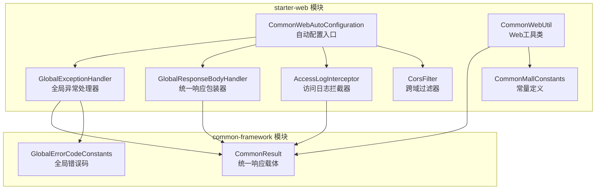
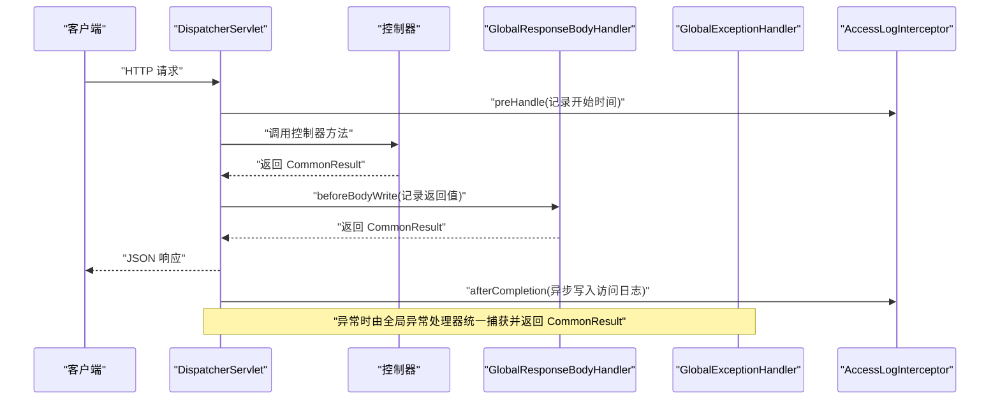
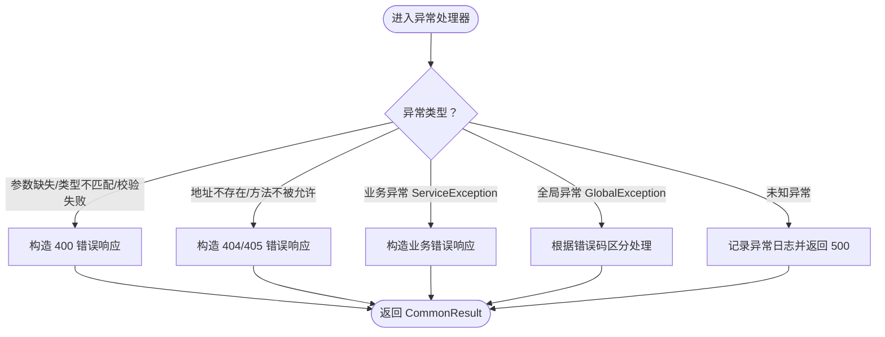
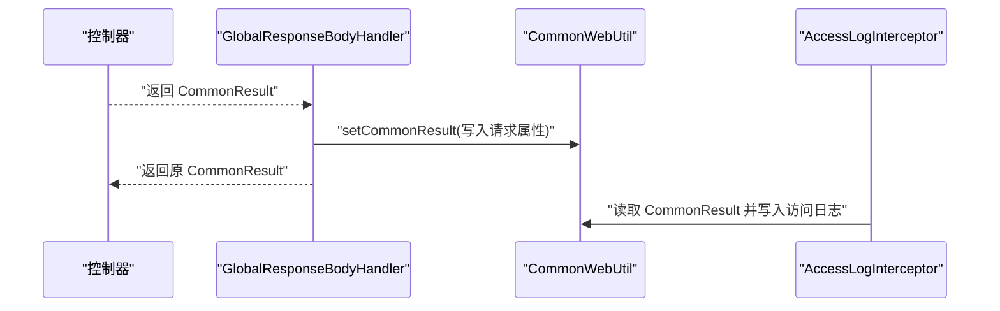
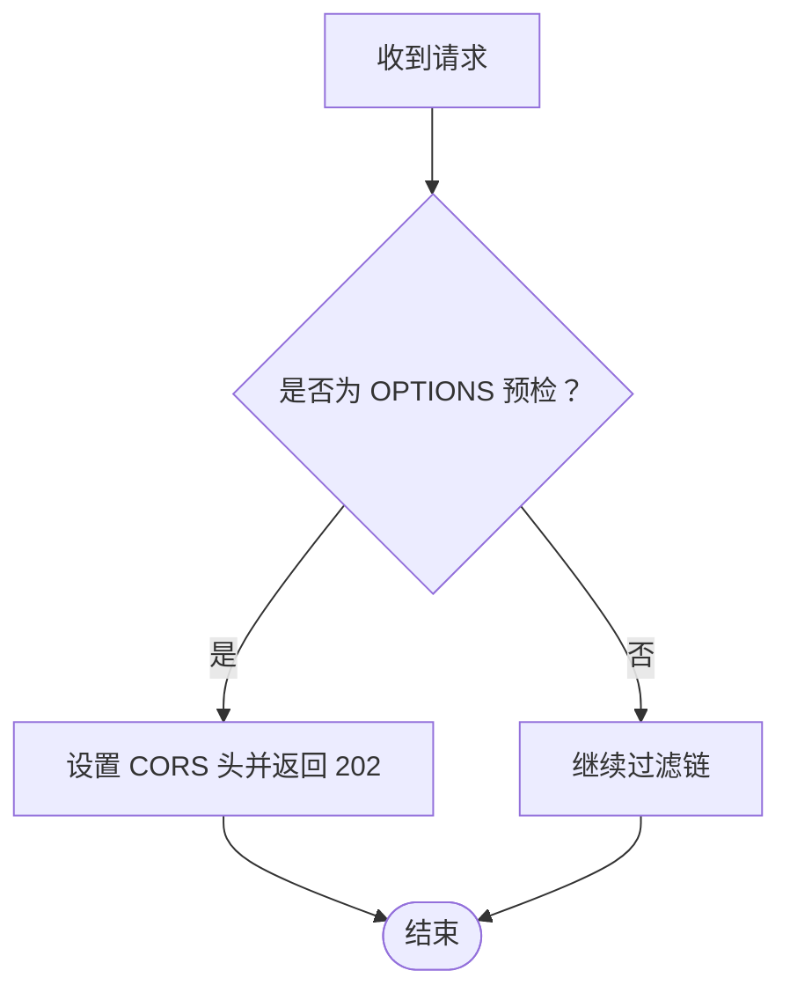
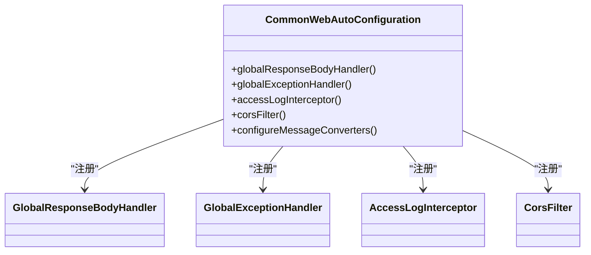
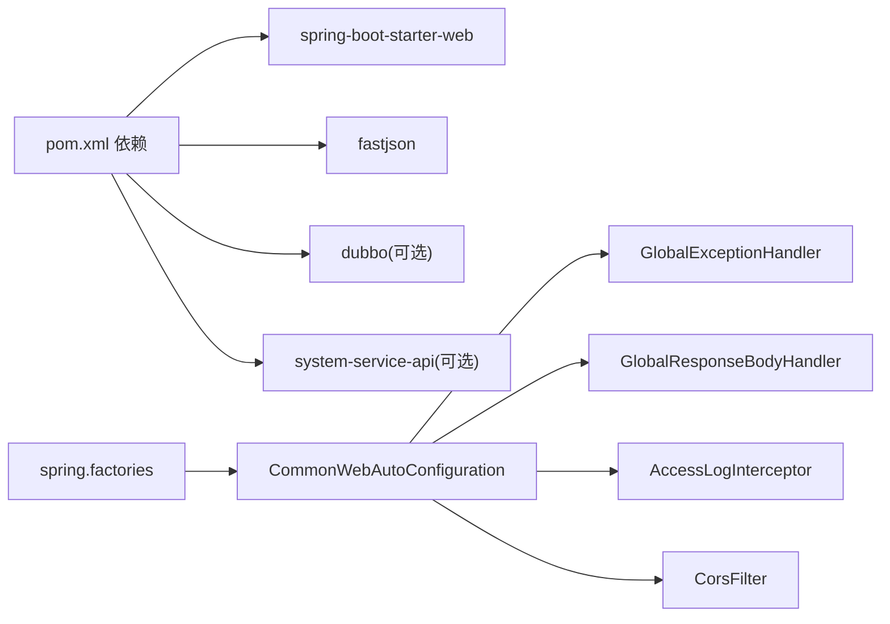

# Web通用配置

<cite>
**本文引用的文件**
- [CommonWebAutoConfiguration.java](file://common/mall-spring-boot-starter-web/src/main/java/cn/iocoder/mall/web/config/CommonWebAutoConfiguration.java)
- [GlobalExceptionHandler.java](file://common/mall-spring-boot-starter-web/src/main/java/cn/iocoder/mall/web/core/handler/GlobalExceptionHandler.java)
- [GlobalResponseBodyHandler.java](file://common/mall-spring-boot-starter-web/src/main/java/cn/iocoder/mall/web/core/handler/GlobalResponseBodyHandler.java)
- [CorsFilter.java](file://common/mall-spring-boot-starter-web/src/main/java/cn/iocoder/mall/web/core/servlet/CorsFilter.java)
- [AccessLogInterceptor.java](file://common/mall-spring-boot-starter-web/src/main/java/cn/iocoder/mall/web/core/interceptor/AccessLogInterceptor.java)
- [CommonWebUtil.java](file://common/mall-spring-boot-starter-web/src/main/java/cn/iocoder/mall/web/core/util/CommonWebUtil.java)
- [CommonMallConstants.java](file://common/mall-spring-boot-starter-web/src/main/java/cn/iocoder/mall/web/core/constant/CommonMallConstants.java)
- [CommonResult.java](file://common/common-framework/src/main/java/cn/iocoder/common/framework/vo/CommonResult.java)
- [GlobalErrorCodeConstants.java](file://common/common-framework/src/main/java/cn/iocoder/common/framework/exception/enums/GlobalErrorCodeConstants.java)
- [spring.factories](file://common/mall-spring-boot-starter-web/src/main/resources/META-INF/spring.factories)
- [pom.xml](file://common/mall-spring-boot-starter-web/pom.xml)
</cite>

## 目录
1. [简介](#简介)
2. [项目结构](#项目结构)
3. [核心组件](#核心组件)
4. [架构总览](#架构总览)
5. [组件详解](#组件详解)
6. [依赖关系分析](#依赖关系分析)
7. [性能与稳定性考量](#性能与稳定性考量)
8. [故障排查指南](#故障排查指南)
9. [结论](#结论)
10. [附录：最佳实践与配置示例](#附录最佳实践与配置示例)

## 简介
本技术文档围绕“Web通用配置”主题，系统梳理并深入解析以下关键能力：
- 全局异常处理：异常分类、错误码定义、响应格式标准化
- 统一响应封装：CommonResult 的使用、数据格式统一、状态码管理
- 跨域配置：CorsFilter 的允许域名、请求头、方法设置
- Web 自动配置：条件注解、配置类加载、组件注册机制
- 访问日志拦截：结合全局响应处理器记录返回结果，异步写入系统日志

目标是帮助开发者快速理解并正确使用这些通用能力，提升 Web 应用的一致性、可观测性和可维护性。

## 项目结构
本仓库采用多模块结构，Web 通用配置位于 mall-spring-boot-starter-web 模块；公共 VO、异常与错误码位于 common-framework 模块。自动配置通过 spring.factories 注册，Spring Boot 启动时自动装配。

图表来源
- [CommonWebAutoConfiguration.java:28-96](file://common/mall-spring-boot-starter-web/src/main/java/cn/iocoder/mall/web/config/CommonWebAutoConfiguration.java#L28-L96)
- [GlobalExceptionHandler.java:39-252](file://common/mall-spring-boot-starter-web/src/main/java/cn/iocoder/mall/web/core/handler/GlobalExceptionHandler.java#L39-L252)
- [GlobalResponseBodyHandler.java:13-45](file://common/mall-spring-boot-starter-web/src/main/java/cn/iocoder/mall/web/core/handler/GlobalResponseBodyHandler.java#L13-L45)
- [AccessLogInterceptor.java:22-90](file://common/mall-spring-boot-starter-web/src/main/java/cn/iocoder/mall/web/core/interceptor/AccessLogInterceptor.java#L22-L90)
- [CorsFilter.java:8-40](file://common/mall-spring-boot-starter-web/src/main/java/cn/iocoder/mall/web/core/servlet/CorsFilter.java#L8-L40)
- [CommonWebUtil.java:9-43](file://common/mall-spring-boot-starter-web/src/main/java/cn/iocoder/mall/web/core/util/CommonWebUtil.java#L9-L43)
- [CommonMallConstants.java:3-44](file://common/mall-spring-boot-starter-web/src/main/java/cn/iocoder/mall/web/core/constant/CommonMallConstants.java#L3-L44)
- [CommonResult.java:12-154](file://common/common-framework/src/main/java/cn/iocoder/common/framework/vo/CommonResult.java#L12-L154)
- [GlobalErrorCodeConstants.java:13-36](file://common/common-framework/src/main/java/cn/iocoder/common/framework/exception/enums/GlobalErrorCodeConstants.java#L13-L36)

章节来源
- [spring.factories:1-3](file://common/mall-spring-boot-starter-web/src/main/resources/META-INF/spring.factories#L1-L3)
- [pom.xml:14-48](file://common/mall-spring-boot-starter-web/pom.xml#L14-L48)

## 核心组件
- 全局异常处理器：将各类异常映射为统一的 CommonResult 响应，并对系统级异常进行异步日志记录。
- 统一响应包装器：拦截返回类型为 CommonResult 的响应，记录返回值以便访问日志使用。
- 跨域过滤器：提供基础的 CORS 放通策略，兼容预检请求。
- 自动配置类：注册上述组件、拦截器、过滤器，并替换默认 JSON 转换器为 Fastjson。
- 访问日志拦截器：在请求完成后收集上下文与响应结果，异步上报系统日志。
- 工具与常量：通过 Request 属性共享用户上下文与响应结果，便于跨组件使用。

章节来源
- [CommonWebAutoConfiguration.java:28-96](file://common/mall-spring-boot-starter-web/src/main/java/cn/iocoder/mall/web/config/CommonWebAutoConfiguration.java#L28-L96)
- [GlobalExceptionHandler.java:39-252](file://common/mall-spring-boot-starter-web/src/main/java/cn/iocoder/mall/web/core/handler/GlobalExceptionHandler.java#L39-L252)
- [GlobalResponseBodyHandler.java:13-45](file://common/mall-spring-boot-starter-web/src/main/java/cn/iocoder/mall/web/core/handler/GlobalResponseBodyHandler.java#L13-L45)
- [CorsFilter.java:8-40](file://common/mall-spring-boot-starter-web/src/main/java/cn/iocoder/mall/web/core/servlet/CorsFilter.java#L8-L40)
- [AccessLogInterceptor.java:22-90](file://common/mall-spring-boot-starter-web/src/main/java/cn/iocoder/mall/web/core/interceptor/AccessLogInterceptor.java#L22-L90)
- [CommonWebUtil.java:9-43](file://common/mall-spring-boot-starter-web/src/main/java/cn/iocoder/mall/web/core/util/CommonWebUtil.java#L9-L43)
- [CommonMallConstants.java:3-44](file://common/mall-spring-boot-starter-web/src/main/java/cn/iocoder/mall/web/core/constant/CommonMallConstants.java#L3-L44)
- [CommonResult.java:12-154](file://common/common-framework/src/main/java/cn/iocoder/common/framework/vo/CommonResult.java#L12-L154)
- [GlobalErrorCodeConstants.java:13-36](file://common/common-framework/src/main/java/cn/iocoder/common/framework/exception/enums/GlobalErrorCodeConstants.java#L13-L36)

## 架构总览
下图展示 Web 自动配置如何在启动时装配各组件，并在请求生命周期中协同工作：

图表来源
- [CommonWebAutoConfiguration.java:57-65](file://common/mall-spring-boot-starter-web/src/main/java/cn/iocoder/mall/web/config/CommonWebAutoConfiguration.java#L57-L65)
- [GlobalResponseBodyHandler.java:26-43](file://common/mall-spring-boot-starter-web/src/main/java/cn/iocoder/mall/web/core/handler/GlobalResponseBodyHandler.java#L26-L43)
- [AccessLogInterceptor.java:35-54](file://common/mall-spring-boot-starter-web/src/main/java/cn/iocoder/mall/web/core/interceptor/AccessLogInterceptor.java#L35-L54)
- [GlobalExceptionHandler.java:190-198](file://common/mall-spring-boot-starter-web/src/main/java/cn/iocoder/mall/web/core/handler/GlobalExceptionHandler.java#L190-L198)

## 组件详解

### 全局异常处理机制（GlobalExceptionHandler）
- 异常分类与处理
  - SpringMVC 参数缺失、类型不匹配、参数校验失败、绑定异常、JSR-303 校验异常、地址不存在、方法不被允许等场景均有专门处理器，统一返回 CommonResult。
  - 业务异常 ServiceException 与全局异常 GlobalException 分别按业务错误与系统错误路径处理。
  - 未知异常兜底，异步记录异常日志并返回系统异常响应。
- 错误码与响应格式
  - 使用全局错误码常量定义错误码范围与语义，确保前后端一致。
  - 响应体包含 code、message、detailMessage 字段，便于前端展示与定位问题。
- 异步日志记录
  - 对系统级异常进行异步写入系统异常日志，避免阻塞主流程。
- 关键行为
  - 对特定异常（如地址不存在、方法不被允许）记录警告日志；对业务异常记录信息日志；对未知异常记录错误日志。
  - 通过工具类提取异常根因、栈信息、请求上下文等，增强可观测性。

图表来源
- [GlobalExceptionHandler.java:66-198](file://common/mall-spring-boot-starter-web/src/main/java/cn/iocoder/mall/web/core/handler/GlobalExceptionHandler.java#L66-L198)
- [GlobalErrorCodeConstants.java:17-28](file://common/common-framework/src/main/java/cn/iocoder/common/framework/exception/enums/GlobalErrorCodeConstants.java#L17-L28)

章节来源
- [GlobalExceptionHandler.java:39-252](file://common/mall-spring-boot-starter-web/src/main/java/cn/iocoder/mall/web/core/handler/GlobalExceptionHandler.java#L39-L252)
- [GlobalErrorCodeConstants.java:13-36](file://common/common-framework/src/main/java/cn/iocoder/common/framework/exception/enums/GlobalErrorCodeConstants.java#L13-L36)

### 统一响应封装（GlobalResponseBodyHandler）
- 设计理念
  - 控制器返回值由业务方自行包裹为 CommonResult，避免 AOP 改变返回结构。
  - 该处理器仅在返回类型为 CommonResult 时生效，负责将结果写入 Request 属性，供访问日志拦截器使用。
- 关键行为
  - supports：仅拦截返回类型为 CommonResult 的方法。
  - beforeBodyWrite：将 CommonResult 写入 Request 属性，供后续读取。

图表来源
- [GlobalResponseBodyHandler.java:26-43](file://common/mall-spring-boot-starter-web/src/main/java/cn/iocoder/mall/web/core/handler/GlobalResponseBodyHandler.java#L26-L43)
- [CommonWebUtil.java:27-33](file://common/mall-spring-boot-starter-web/src/main/java/cn/iocoder/mall/web/core/util/CommonWebUtil.java#L27-L33)
- [AccessLogInterceptor.java:56-78](file://common/mall-spring-boot-starter-web/src/main/java/cn/iocoder/mall/web/core/interceptor/AccessLogInterceptor.java#L56-L78)

章节来源
- [GlobalResponseBodyHandler.java:13-45](file://common/mall-spring-boot-starter-web/src/main/java/cn/iocoder/mall/web/core/handler/GlobalResponseBodyHandler.java#L13-L45)
- [CommonWebUtil.java:9-43](file://common/mall-spring-boot-starter-web/src/main/java/cn/iocoder/mall/web/core/util/CommonWebUtil.java#L9-L43)

### 跨域配置（CorsFilter）
- 配置要点
  - 允许来源：*（生产环境建议限定具体域名）
  - 允许方法：*（含常见 HTTP 方法）
  - 允许头：*（含自定义头）
  - 预检缓存：1800 秒
  - 预检请求：对 OPTIONS 方法直接返回 Accepted 状态，不透传至下游
- 使用建议
  - 生产环境建议改为白名单域名与精确允许头，避免安全风险。
  - 未来可替换为 Spring 内置的 CorsFilter 实现。

图表来源
- [CorsFilter.java:15-34](file://common/mall-spring-boot-starter-web/src/main/java/cn/iocoder/mall/web/core/servlet/CorsFilter.java#L15-L34)

章节来源
- [CorsFilter.java:8-40](file://common/mall-spring-boot-starter-web/src/main/java/cn/iocoder/mall/web/core/servlet/CorsFilter.java#L8-L40)

### Web 自动配置（CommonWebAutoConfiguration）
- 条件注解
  - 仅在 Servlet Web 环境生效。
  - 优先注册业务自定义 Bean，若未定义则使用默认实现。
- 组件注册
  - 全局响应包装器、全局异常处理器、访问日志拦截器、跨域过滤器均通过 @Bean 注册。
  - 拦截器注册时具备容错：当依赖缺失导致 Bean 不存在时，记录警告并跳过。
- 消息转换器
  - 替换默认 JSON 转换器为 Fastjson，设置字符集与序列化特性，保证兼容性与性能。

图表来源
- [CommonWebAutoConfiguration.java:28-96](file://common/mall-spring-boot-starter-web/src/main/java/cn/iocoder/mall/web/config/CommonWebAutoConfiguration.java#L28-L96)

章节来源
- [CommonWebAutoConfiguration.java:28-96](file://common/mall-spring-boot-starter-web/src/main/java/cn/iocoder/mall/web/config/CommonWebAutoConfiguration.java#L28-L96)
- [spring.factories:1-3](file://common/mall-spring-boot-starter-web/src/main/resources/META-INF/spring.factories#L1-L3)

### 访问日志拦截（AccessLogInterceptor）
- 生命周期
  - preHandle：记录请求开始时间。
  - afterCompletion：组装访问日志 DTO，读取 CommonResult 中的错误码与消息，异步上报系统访问日志。
- 上下文来源
  - 用户 ID/类型、TraceId、URI、查询串、方法、UA、IP、开始时间、响应时长等。
- 异步落库
  - 使用异步线程池上报，避免阻塞请求主线程。

章节来源
- [AccessLogInterceptor.java:22-90](file://common/mall-spring-boot-starter-web/src/main/java/cn/iocoder/mall/web/core/interceptor/AccessLogInterceptor.java#L22-L90)
- [CommonWebUtil.java:9-43](file://common/mall-spring-boot-starter-web/src/main/java/cn/iocoder/mall/web/core/util/CommonWebUtil.java#L9-L43)

### 统一响应模型（CommonResult）与错误码（GlobalErrorCodeConstants）
- CommonResult
  - 包含 code、data、message、detailMessage 字段，提供 success/isError 辅助判断。
  - 支持从异常对象构造统一响应，或从已有 CommonResult 转换泛型。
- 错误码常量
  - 定义客户端错误（400/401/403/404/405）、服务端错误（500）与成功（0）等标准错误码区间。
  - 提供 isMatch 判定，用于区分全局异常与业务异常。

章节来源
- [CommonResult.java:12-154](file://common/common-framework/src/main/java/cn/iocoder/common/framework/vo/CommonResult.java#L12-L154)
- [GlobalErrorCodeConstants.java:13-36](file://common/common-framework/src/main/java/cn/iocoder/common/framework/exception/enums/GlobalErrorCodeConstants.java#L13-L36)

## 依赖关系分析
- 自动配置入口
  - 通过 spring.factories 指定 EnableAutoConfiguration，Spring Boot 启动时加载 CommonWebAutoConfiguration。
- 模块依赖
  - starter-web 依赖 Spring Web、Fastjson、Dubbo（可选），以及 system-service-api（可选）以启用日志上报。
- 组件耦合
  - GlobalExceptionHandler 与 GlobalErrorCodeConstants、CommonResult 强耦合；与系统日志 RPC 通过 Dubbo 可选依赖集成。
  - GlobalResponseBodyHandler 与 AccessLogInterceptor 通过 CommonWebUtil 的 Request 属性解耦。

图表来源
- [pom.xml:14-48](file://common/mall-spring-boot-starter-web/pom.xml#L14-L48)
- [spring.factories:1-3](file://common/mall-spring-boot-starter-web/src/main/resources/META-INF/spring.factories#L1-L3)

章节来源
- [pom.xml:14-48](file://common/mall-spring-boot-starter-web/pom.xml#L14-L48)
- [spring.factories:1-3](file://common/mall-spring-boot-starter-web/src/main/resources/META-INF/spring.factories#L1-L3)

## 性能与稳定性考量
- JSON 序列化
  - 使用 Fastjson 并禁用循环引用检测与非字符串键序列化，减少序列化开销与浏览器兼容问题。
- 异步日志
  - 异常日志与访问日志均采用异步写入，降低对请求延迟的影响。
- 拦截器与过滤器
  - 仅在必要条件下注册与生效，避免不必要的处理链开销。
- 跨域策略
  - 默认放开较多，生产需收紧来源与头，防止 CORS 滥用带来的安全与性能风险。

## 故障排查指南
- 控制器未返回 CommonResult
  - 现象：访问日志未记录错误码。
  - 处理：确保控制器返回值为 CommonResult；或在业务层将结果封装后再返回。
- 未触发异常处理
  - 现象：异常未被统一处理。
  - 处理：确认异常类型是否在处理器中有对应处理方法；检查是否抛出了未覆盖的异常类型。
- 跨域失败
  - 现象：浏览器报跨域错误。
  - 处理：核对来源、方法、头是否符合当前策略；生产环境建议明确白名单。
- 访问日志未入库
  - 现象：系统日志未记录。
  - 处理：检查 Dubbo 依赖与 RPC 版本配置；确认异步线程池可用。

章节来源
- [GlobalResponseBodyHandler.java:26-43](file://common/mall-spring-boot-starter-web/src/main/java/cn/iocoder/mall/web/core/handler/GlobalResponseBodyHandler.java#L26-L43)
- [AccessLogInterceptor.java:42-54](file://common/mall-spring-boot-starter-web/src/main/java/cn/iocoder/mall/web/core/interceptor/AccessLogInterceptor.java#L42-L54)
- [CorsFilter.java:15-34](file://common/mall-spring-boot-starter-web/src/main/java/cn/iocoder/mall/web/core/servlet/CorsFilter.java#L15-L34)
- [GlobalExceptionHandler.java:190-198](file://common/mall-spring-boot-starter-web/src/main/java/cn/iocoder/mall/web/core/handler/GlobalExceptionHandler.java#L190-L198)

## 结论
本套 Web 通用配置通过自动装配将异常处理、统一响应、跨域与访问日志等能力标准化，既保证了对外输出的一致性，也提升了系统的可观测性与安全性。建议在生产环境中进一步收紧跨域策略、完善日志上报与监控告警，并在团队内推广统一的响应与异常处理规范。

## 附录：最佳实践与配置示例
- 统一响应规范
  - 控制器返回值必须为 CommonResult；成功场景使用成功错误码，失败场景使用对应错误码与提示。
  - 业务异常 ServiceException 与全局异常 GlobalException 明确区分，前者用于业务规则，后者用于系统异常。
- 错误码管理
  - 使用全局错误码常量定义错误码区间；新增错误码遵循现有命名与范围约定。
- 跨域配置
  - 开发环境可保持宽松；生产环境务必限制来源与头，避免安全风险。
- 自动配置启用
  - 在应用依赖中引入 starter-web 即可自动生效；如需自定义，可通过覆盖 Bean 的方式替换默认实现。
- 访问日志
  - 确保系统日志 RPC 可用；对高并发场景建议增加异步队列与限流策略。