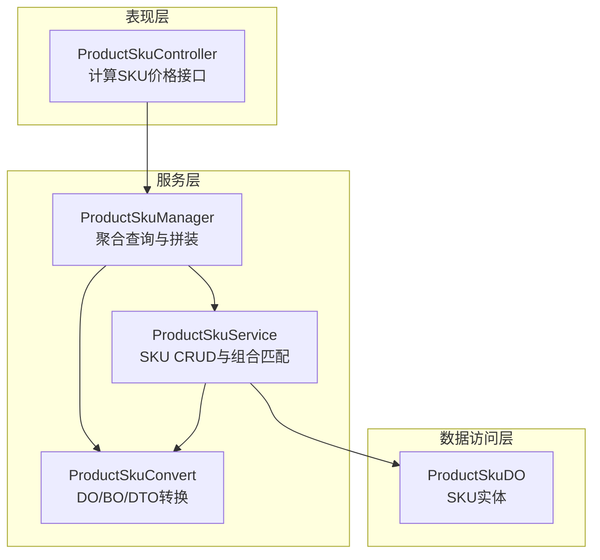
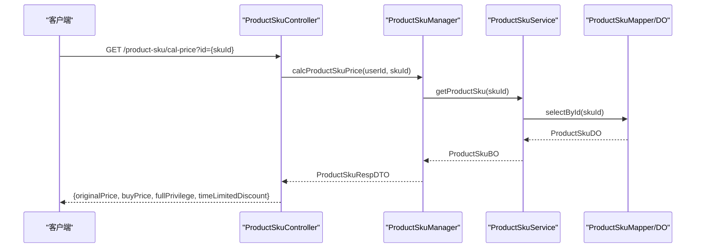
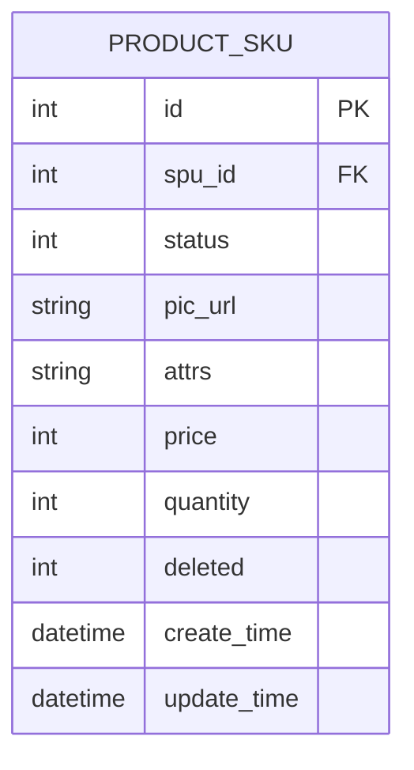
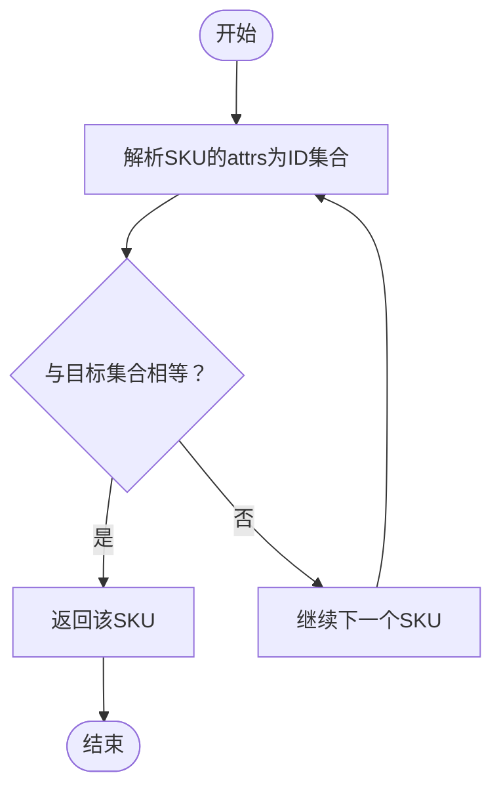
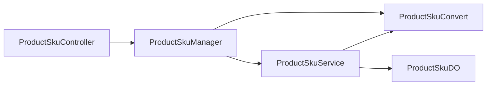

# SKU规格管理

<cite>
**本文引用的文件**
- [ProductSkuController.java](file://shop-web-app/src/main/java/cn/iocoder/mall/shopweb/controller/product/ProductSkuController.java)
- [ProductSkuCalcPriceRespVO.java](file://shop-web-app/src/main/java/cn/iocoder/mall/shopweb/controller/product/vo/sku/ProductSkuCalcPriceRespVO.java)
- [ProductSkuManager.java](file://product-service-project/product-service-app/src/main/java/cn/iocoder/mall/productservice/manager/sku/ProductSkuManager.java)
- [ProductSkuService.java](file://product-service-project/product-service-app/src/main/java/cn/iocoder/mall/productservice/service/sku/ProductSkuService.java)
- [ProductSkuBO.java](file://product-service-project/product-service-app/src/main/java/cn/iocoder/mall/productservice/service/sku/bo/ProductSkuBO.java)
- [ProductSkuDO.java](file://product-service-project/product-service-app/src/main/java/cn/iocoder/mall/productservice/dal/mysql/dataobject/sku/ProductSkuDO.java)
- [ProductSkuConvert.java](file://product-service-project/product-service-app/src/main/java/cn/iocoder/mall/productservice/convert/sku/ProductSkuConvert.java)
- [ProductSkuRpc.java](file://product-service-project/product-service-api/src/main/java/cn/iocoder/mall/productservice/rpc/sku/ProductSkuRpc.java)
</cite>

## 目录
1. [简介](#简介)
2. [项目结构](#项目结构)
3. [核心组件](#核心组件)
4. [架构总览](#架构总览)
5. [详细组件分析](#详细组件分析)
6. [依赖分析](#依赖分析)
7. [性能考量](#性能考量)
8. [故障排查指南](#故障排查指南)
9. [结论](#结论)
10. [附录](#附录)

## 简介
本技术文档围绕“SKU规格管理”功能展开，系统性阐述SKU规格查询、规格详情展示、规格组合算法、价格与库存查询、以及规格与SPU的关系映射与变更影响。重点解析Shop Web端控制器ProductSkuController的实现逻辑，剖析ProductSkuManager与ProductSkuService的数据流与业务处理，梳理SKU数据模型字段与复杂度，总结规格选择的用户体验设计要点，并给出使用示例与开发调试方法。

## 项目结构
SKU规格管理涉及三层：
- 表现层（Shop Web）：对外提供HTTP接口，调用服务层能力，返回前端所需的价格与规格信息。
- 服务层（Product Service）：封装SKU的增删改查、组合匹配、与SPU/规格属性的拼装逻辑。
- 数据访问层（MyBatis Mapper）：持久化SKU实体，支持批量插入、更新、删除与按SPU查询。

图表来源
- [ProductSkuController.java:1-34](file://shop-web-app/src/main/java/cn/iocoder/mall/shopweb/controller/product/ProductSkuController.java#L1-L34)
- [ProductSkuManager.java:1-77](file://product-service-project/product-service-app/src/main/java/cn/iocoder/mall/productservice/manager/sku/ProductSkuManager.java#L1-L77)
- [ProductSkuService.java:1-119](file://product-service-project/product-service-app/src/main/java/cn/iocoder/mall/productservice/service/sku/ProductSkuService.java#L1-L119)
- [ProductSkuConvert.java:1-79](file://product-service-project/product-service-app/src/main/java/cn/iocoder/mall/productservice/convert/sku/ProductSkuConvert.java#L1-L79)
- [ProductSkuDO.java:1-65](file://product-service-project/product-service-app/src/main/java/cn/iocoder/mall/productservice/dal/mysql/dataobject/sku/ProductSkuDO.java#L1-L65)

章节来源
- [ProductSkuController.java:1-34](file://shop-web-app/src/main/java/cn/iocoder/mall/shopweb/controller/product/ProductSkuController.java#L1-L34)
- [ProductSkuManager.java:1-77](file://product-service-project/product-service-app/src/main/java/cn/iocoder/mall/productservice/manager/sku/ProductSkuManager.java#L1-L77)
- [ProductSkuService.java:1-119](file://product-service-project/product-service-app/src/main/java/cn/iocoder/mall/productservice/service/sku/ProductSkuService.java#L1-L119)
- [ProductSkuConvert.java:1-79](file://product-service-project/product-service-app/src/main/java/cn/iocoder/mall/productservice/convert/sku/ProductSkuConvert.java#L1-L79)
- [ProductSkuDO.java:1-65](file://product-service-project/product-service-app/src/main/java/cn/iocoder/mall/productservice/dal/mysql/dataobject/sku/ProductSkuDO.java#L1-L65)

## 核心组件
- ProductSkuController：提供/cal-price接口，接收SKU编号，调用Manager层计算价格并返回结果。
- ProductSkuManager：负责聚合SKU、SPU与规格属性，按需拼装返回字段。
- ProductSkuService：负责SKU的创建/更新/查询，包含规格组合匹配与批量操作。
- ProductSkuConvert：负责DO/BO/DTO之间的双向转换，含规格值数组与集合的互转。
- ProductSkuDO/BO：分别对应数据库实体与服务层业务对象，承载SKU状态、图片、规格值、价格、库存等字段。

章节来源
- [ProductSkuController.java:26-31](file://shop-web-app/src/main/java/cn/iocoder/mall/shopweb/controller/product/ProductSkuController.java#L26-L31)
- [ProductSkuManager.java:41-74](file://product-service-project/product-service-app/src/main/java/cn/iocoder/mall/productservice/manager/sku/ProductSkuManager.java#L41-L74)
- [ProductSkuService.java:25-116](file://product-service-project/product-service-app/src/main/java/cn/iocoder/mall/productservice/service/sku/ProductSkuService.java#L25-L116)
- [ProductSkuConvert.java:47-66](file://product-service-project/product-service-app/src/main/java/cn/iocoder/mall/productservice/convert/sku/ProductSkuConvert.java#L47-L66)
- [ProductSkuDO.java:14-64](file://product-service-project/product-service-app/src/main/java/cn/iocoder/mall/productservice/dal/mysql/dataobject/sku/ProductSkuDO.java#L14-L64)
- [ProductSkuBO.java:14-60](file://product-service-project/product-service-app/src/main/java/cn/iocoder/mall/productservice/service/sku/bo/ProductSkuBO.java#L14-L60)

## 架构总览
从用户请求到最终响应的关键流程如下：

图表来源
- [ProductSkuController.java:26-31](file://shop-web-app/src/main/java/cn/iocoder/mall/shopweb/controller/product/ProductSkuController.java#L26-L31)
- [ProductSkuManager.java:41-44](file://product-service-project/product-service-app/src/main/java/cn/iocoder/mall/productservice/manager/sku/ProductSkuManager.java#L41-L44)
- [ProductSkuService.java:101-104](file://product-service-project/product-service-app/src/main/java/cn/iocoder/mall/productservice/service/sku/ProductSkuService.java#L101-L104)
- [ProductSkuDO.java:14-64](file://product-service-project/product-service-app/src/main/java/cn/iocoder/mall/productservice/dal/mysql/dataobject/sku/ProductSkuDO.java#L14-L64)

## 详细组件分析

### ProductSkuController 实现逻辑
- 接口职责：提供/cal-price接口，接收SKU编号，调用Manager层计算价格并返回统一结果包装。
- 关键点：
  - 使用用户上下文获取当前用户ID（用于促销匹配等场景）。
  - 返回值封装为通用结果类型，便于前端统一处理。
- 典型调用路径参考：[ProductSkuController.java:26-31](file://shop-web-app/src/main/java/cn/iocoder/mall/shopweb/controller/product/ProductSkuController.java#L26-L31)

章节来源
- [ProductSkuController.java:17-31](file://shop-web-app/src/main/java/cn/iocoder/mall/shopweb/controller/product/ProductSkuController.java#L17-L31)

### ProductSkuManager 聚合与拼装
- 职责：
  - 单个SKU查询：直接委托Service层获取并转换。
  - 列表查询：根据字段需求，按需加载SPU与规格属性，完成最终DTO拼装。
- 字段拼装策略：
  - 当请求包含SPU字段时，批量查询SPU并映射回SKU。
  - 当请求包含ATTR字段时，收集所有规格值ID，调用规格服务校验并返回规格键值对。
- 关键实现参考：[ProductSkuManager.java:41-74](file://product-service-project/product-service-app/src/main/java/cn/iocoder/mall/productservice/manager/sku/ProductSkuManager.java#L41-L74)

章节来源
- [ProductSkuManager.java:22-74](file://product-service-project/product-service-app/src/main/java/cn/iocoder/mall/productservice/manager/sku/ProductSkuManager.java#L22-L74)

### ProductSkuService 组合匹配与批量操作
- 创建SKU：将传入的创建BO转换为DO，设置状态与SPU编号，批量插入。
- 更新SKU：基于规格值ID集合进行匹配，执行插入、更新、删除三类操作的差异化处理。
- 查询SKU：单个查询与列表查询，支持按条件过滤。
- 规格组合匹配：将字符串形式的规格值ID数组解析为集合，与目标集合进行等价判断，定位已存在的SKU记录。
- 复杂度分析：
  - 匹配算法：对每个待匹配SKU，遍历现有SKU集合，每次比较为O(n)，整体O(n^2)；可通过预构建attr值ID集合哈希表优化至O(n)。
- 关键实现参考：
  - [ProductSkuService.java:25-70](file://product-service-project/product-service-app/src/main/java/cn/iocoder/mall/productservice/service/sku/ProductSkuService.java#L25-L70)
  - [ProductSkuService.java:79-93](file://product-service-project/product-service-app/src/main/java/cn/iocoder/mall/productservice/service/sku/ProductSkuService.java#L79-L93)
  - [ProductSkuService.java:101-116](file://product-service-project/product-service-app/src/main/java/cn/iocoder/mall/productservice/service/sku/ProductSkuService.java#L101-L116)

章节来源
- [ProductSkuService.java:19-119](file://product-service-project/product-service-app/src/main/java/cn/iocoder/mall/productservice/service/sku/ProductSkuService.java#L19-L119)

### SKU数据模型设计
- 实体字段（ProductSkuDO）：
  - 主键与SPU编号：标识SKU归属。
  - 状态：启用/禁用。
  - 图片地址：SKU展示图。
  - 规格值数组：以逗号分隔的规格值ID字符串。
  - 价格：单位为分。
  - 库存：可用库存数量。
- 业务对象（ProductSkuBO）：
  - 在DO基础上，将规格值数组转换为整型列表，便于业务处理。
- 字段映射与转换：
  - 字符串与集合互转：通过工具类进行逗号分隔的字符串与整数列表互转。
  - 参考：[ProductSkuConvert.java:68-76](file://product-service-project/product-service-app/src/main/java/cn/iocoder/mall/productservice/convert/sku/ProductSkuConvert.java#L68-L76)

图表来源
- [ProductSkuDO.java:14-64](file://product-service-project/product-service-app/src/main/java/cn/iocoder/mall/productservice/dal/mysql/dataobject/sku/ProductSkuDO.java#L14-L64)

章节来源
- [ProductSkuDO.java:14-64](file://product-service-project/product-service-app/src/main/java/cn/iocoder/mall/productservice/dal/mysql/dataobject/sku/ProductSkuDO.java#L14-L64)
- [ProductSkuBO.java:14-60](file://product-service-project/product-service-app/src/main/java/cn/iocoder/mall/productservice/service/sku/bo/ProductSkuBO.java#L14-L60)
- [ProductSkuConvert.java:31-35](file://product-service-project/product-service-app/src/main/java/cn/iocoder/mall/productservice/convert/sku/ProductSkuConvert.java#L31-L35)

### 规格组合算法
- 输入：规格值ID集合（来自前端选择或业务输入）。
- 匹配策略：将SKU的attrs字段解析为ID集合，与目标集合进行集合相等判断。
- 性能优化建议：
  - 预先将SKU的attrs解析为集合，建立attrValueIds -> SKU的索引，匹配复杂度降为O(n)。
  - 对attrValueIds进行排序后再比较，避免顺序差异导致误判。
- 流程图示意：

图表来源
- [ProductSkuService.java:79-93](file://product-service-project/product-service-app/src/main/java/cn/iocoder/mall/productservice/service/sku/ProductSkuService.java#L79-L93)

章节来源
- [ProductSkuService.java:79-93](file://product-service-project/product-service-app/src/main/java/cn/iocoder/mall/productservice/service/sku/ProductSkuService.java#L79-L93)

### 价格与库存查询
- 控制器返回值包含原价与购买价，并携带促销活动信息（满减送、限时折扣），便于前端动态展示与计算。
- 价格计算通常由促销RPC或价格服务参与，此处控制器仅透传结果。
- 参考VO定义：[ProductSkuCalcPriceRespVO.java:12-35](file://shop-web-app/src/main/java/cn/iocoder/mall/shopweb/controller/product/vo/sku/ProductSkuCalcPriceRespVO.java#L12-L35)

章节来源
- [ProductSkuCalcPriceRespVO.java:8-35](file://shop-web-app/src/main/java/cn/iocoder/mall/shopweb/controller/product/vo/sku/ProductSkuCalcPriceRespVO.java#L8-L35)

### 规格选择的用户体验设计
- 规格项展示：按SPU维度聚合规格属性，展示可选规格值，支持多规格联动。
- 规格组合验证：当用户选择规格值后，实时校验是否存在对应的SKU；若不存在，禁用加入购物车/立即购买按钮。
- 价格动态更新：根据选中的SKU，动态更新显示原价与优惠后价格，并提示适用的促销活动。
- 库存提示：当库存不足时，提示用户并限制购买数量。

（本节为概念性说明，不直接分析具体源码文件）

### 规格与SPU的关系映射
- 关系说明：SKU属于SPU，一个SPU可包含多个SKU，SKU通过attrs字段存储其规格值ID集合。
- 映射策略：
  - 列表查询时，若请求包含SPU字段，则批量查询SPU并映射回SKU。
  - 若请求包含ATTR字段，则收集所有规格值ID，调用规格服务返回规格键值对，用于前端展示。
- 参考实现：[ProductSkuManager.java:52-74](file://product-service-project/product-service-app/src/main/java/cn/iocoder/mall/productservice/manager/sku/ProductSkuManager.java#L52-L74)

章节来源
- [ProductSkuManager.java:52-74](file://product-service-project/product-service-app/src/main/java/cn/iocoder/mall/productservice/manager/sku/ProductSkuManager.java#L52-L74)

### 规格变更对价格与库存的影响
- 规格变更通常指规格值ID集合的变化，这会改变SKU的唯一性，进而影响：
  - 价格：不同SKU可能有不同的定价策略，变更后需重新查询对应SKU的价格。
  - 库存：不同SKU的可用库存独立管理，变更后需同步更新库存信息。
- 处理建议：
  - 在前端切换规格时，优先查询对应SKU的最新价格与库存。
  - 后端在更新SKU时，采用“插入/更新/删除”的三段式策略，确保数据一致性。

章节来源
- [ProductSkuService.java:34-70](file://product-service-project/product-service-app/src/main/java/cn/iocoder/mall/productservice/service/sku/ProductSkuService.java#L34-L70)

## 依赖分析
- 控制器依赖Manager，Manager依赖Service与RPC/Service层，Service依赖Mapper与Convert。
- Convert承担DO/BO/DTO之间的双向转换，是数据流转的关键桥梁。
- 依赖关系图：

图表来源
- [ProductSkuController.java:23-24](file://shop-web-app/src/main/java/cn/iocoder/mall/shopweb/controller/product/ProductSkuController.java#L23-L24)
- [ProductSkuManager.java:28-33](file://product-service-project/product-service-app/src/main/java/cn/iocoder/mall/productservice/manager/sku/ProductSkuManager.java#L28-L33)
- [ProductSkuService.java:22-23](file://product-service-project/product-service-app/src/main/java/cn/iocoder/mall/productservice/service/sku/ProductSkuService.java#L22-L23)
- [ProductSkuConvert.java:24-27](file://product-service-project/product-service-app/src/main/java/cn/iocoder/mall/productservice/convert/sku/ProductSkuConvert.java#L24-L27)
- [ProductSkuDO.java:14-18](file://product-service-project/product-service-app/src/main/java/cn/iocoder/mall/productservice/dal/mysql/dataobject/sku/ProductSkuDO.java#L14-L18)

章节来源
- [ProductSkuController.java:23-24](file://shop-web-app/src/main/java/cn/iocoder/mall/shopweb/controller/product/ProductSkuController.java#L23-L24)
- [ProductSkuManager.java:28-33](file://product-service-project/product-service-app/src/main/java/cn/iocoder/mall/productservice/manager/sku/ProductSkuManager.java#L28-L33)
- [ProductSkuService.java:22-23](file://product-service-project/product-service-app/src/main/java/cn/iocoder/mall/productservice/service/sku/ProductSkuService.java#L22-L23)
- [ProductSkuConvert.java:24-27](file://product-service-project/product-service-app/src/main/java/cn/iocoder/mall/productservice/convert/sku/ProductSkuConvert.java#L24-L27)
- [ProductSkuDO.java:14-18](file://product-service-project/product-service-app/src/main/java/cn/iocoder/mall/productservice/dal/mysql/dataobject/sku/ProductSkuDO.java#L14-L18)

## 性能考量
- 规格组合匹配：当前实现为O(n^2)，建议引入索引与排序策略，将匹配复杂度降至O(n)。
- 批量查询：列表查询时按需加载SPU与规格属性，避免不必要的跨服务调用。
- 字符串与集合转换：尽量在DAO层或Convert层一次性完成，减少重复解析。

（本节为通用性能建议，不直接分析具体源码文件）

## 故障排查指南
- SKU不存在或状态异常：
  - 检查SPU与SKU状态是否启用，确认attrs字段是否正确写入规格值ID集合。
  - 参考：[ProductSkuService.java:101-104](file://product-service-project/product-service-app/src/main/java/cn/iocoder/mall/productservice/service/sku/ProductSkuService.java#L101-L104)
- 规格组合无法匹配：
  - 确认前端传入的规格值ID集合与后端attrs存储格式一致（逗号分隔）。
  - 参考：[ProductSkuService.java:79-93](file://product-service-project/product-service-app/src/main/java/cn/iocoder/mall/productservice/service/sku/ProductSkuService.java#L79-L93)
- 价格与库存不一致：
  - 核对SKU的price与quantity字段是否更新，检查促销RPC返回的buyPrice是否生效。
  - 参考：[ProductSkuCalcPriceRespVO.java:12-35](file://shop-web-app/src/main/java/cn/iocoder/mall/shopweb/controller/product/vo/sku/ProductSkuCalcPriceRespVO.java#L12-L35)

章节来源
- [ProductSkuService.java:79-104](file://product-service-project/product-service-app/src/main/java/cn/iocoder/mall/productservice/service/sku/ProductSkuService.java#L79-L104)
- [ProductSkuCalcPriceRespVO.java:12-35](file://shop-web-app/src/main/java/cn/iocoder/mall/shopweb/controller/product/vo/sku/ProductSkuCalcPriceRespVO.java#L12-L35)

## 结论
SKU规格管理通过清晰的分层设计与规范的DTO转换，实现了规格查询、详情拼装、价格与库存查询以及规格组合匹配。建议在高并发场景下优化规格组合匹配算法，并完善前端规格联动与库存提示，以提升用户体验与系统性能。

## 附录
- 使用示例（接口调用）
  - 计算SKU价格：GET /product-sku/cal-price?id={skuId}
  - 返回字段：originalPrice、buyPrice、fullPrivilege、timeLimitedDiscount
  - 参考：[ProductSkuController.java:26-31](file://shop-web-app/src/main/java/cn/iocoder/mall/shopweb/controller/product/ProductSkuController.java#L26-L31)，[ProductSkuCalcPriceRespVO.java:12-35](file://shop-web-app/src/main/java/cn/iocoder/mall/shopweb/controller/product/vo/sku/ProductSkuCalcPriceRespVO.java#L12-L35)
- 开发调试方法
  - 断点定位：在ProductSkuController入口、ProductSkuManager聚合逻辑、ProductSkuService匹配逻辑处设置断点。
  - 日志观察：关注规格值ID集合的解析与比对过程，核对attrs字段格式。
  - 单元测试：针对规格组合匹配与批量更新逻辑编写测试用例，覆盖边界场景。

章节来源
- [ProductSkuController.java:26-31](file://shop-web-app/src/main/java/cn/iocoder/mall/shopweb/controller/product/ProductSkuController.java#L26-L31)
- [ProductSkuManager.java:41-74](file://product-service-project/product-service-app/src/main/java/cn/iocoder/mall/productservice/manager/sku/ProductSkuManager.java#L41-L74)
- [ProductSkuService.java:25-70](file://product-service-project/product-service-app/src/main/java/cn/iocoder/mall/productservice/service/sku/ProductSkuService.java#L25-L70)