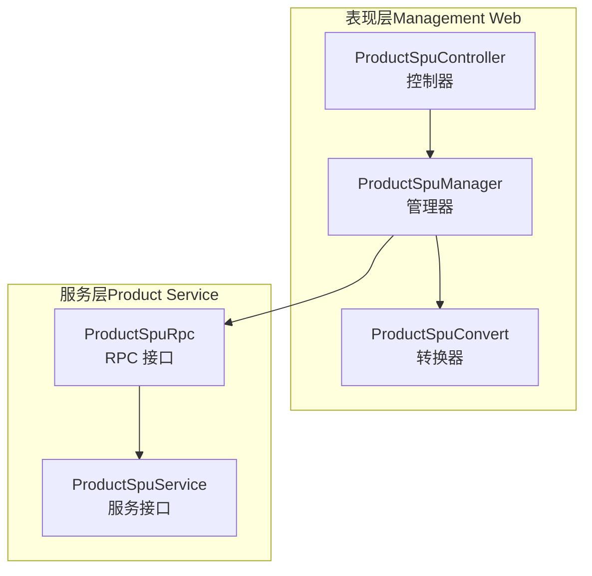
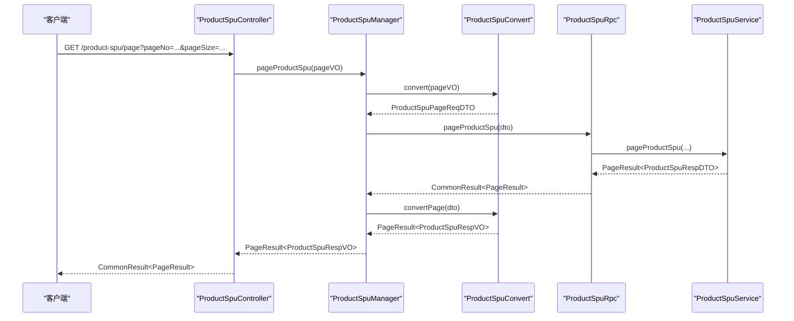
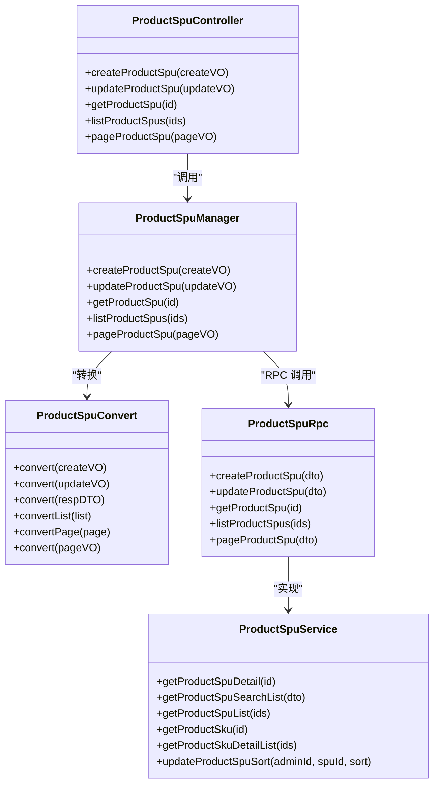
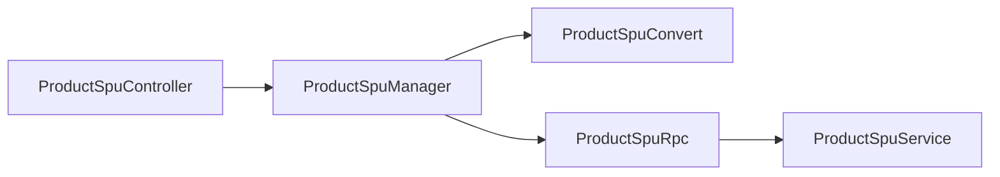

# SPU商品管理

<cite>
**本文引用的文件**
- [ProductSpuController.java](file://management-web-app/src/main/java/cn/iocoder/mall/managementweb/controller/product/ProductSpuController.java)
- [ProductSpuManager.java](file://management-web-app/src/main/java/cn/iocoder/mall/managementweb/manager/product/ProductSpuManager.java)
- [ProductSpuConvert.java](file://management-web-app/src/main/java/cn/iocoder/mall/managementweb/convert/product/ProductSpuConvert.java)
- [ProductSpuPageReqVO.java](file://management-web-app/src/main/java/cn/iocoder/mall/managementweb/controller/product/vo/spu/ProductSpuPageReqVO.java)
- [ProductSpuRespVO.java](file://management-web-app/src/main/java/cn/iocoder/mall/managementweb/controller/product/vo/spu/ProductSpuRespVO.java)
- [ProductSpuService.java](file://moved/product/product-service-api/src/main/java/cn/iocoder/mall/product/api/ProductSpuService.java)
- [ProductSpuBO.java](file://moved/product/product-biz/src/main/java/cn/iocoder/mall/product/biz/bo/product/ProductSpuBO.java)
- [ProductSpuSearchListDTO.java](file://moved/product/product-biz/src/main/java/cn/iocoder/mall/product/biz/dto/product/ProductSpuSearchListDTO.java)
- [ProductSpuRpc.java](file://product-service-project/product-service-api/src/main/java/cn/iocoder/mall/productservice/rpc/spu/ProductSpuRpc.java)
</cite>

## 目录
1. [简介](#简介)
2. [项目结构](#项目结构)
3. [核心组件](#核心组件)
4. [架构总览](#架构总览)
5. [详细组件分析](#详细组件分析)
6. [依赖分析](#依赖分析)
7. [性能考虑](#性能考虑)
8. [故障排查指南](#故障排查指南)
9. [结论](#结论)
10. [附录](#附录)

## 简介
本技术文档围绕 SPU（Standard Product Unit，标准商品单元）商品管理功能展开，系统性阐述 SPUs 的分页查询、搜索条件生成、详情获取等核心能力。重点解析管理端控制器 ProductSpuController 的实现逻辑，覆盖以下接口：
- /product-spu/create：创建 SPU
- /product-spu/update：更新 SPU
- /product-spu/get：按编号获取 SPU
- /product-spu/list：按编号列表批量获取 SPU
- /product-spu/page：分页查询 SPU（含名称、分类、上下架、库存状态等条件）

同时，文档将说明 SPU 数据模型设计（基本信息、卖点、描述、主图、价格、库存、排序、可见性等），解释搜索与筛选机制（关键词模糊匹配、分类筛选、上下架与库存状态组合），并梳理与商品服务模块的交互方式与数据流转。

## 项目结构
SPU 管理涉及三层：
- 表现层（Management Web）：控制器负责接收请求、参数校验、调用管理器，并返回统一响应包装。
- 管理器层（Management Web Manager）：封装 RPC 调用，完成 VO/DTO 转换与错误处理。
- 服务层（Product Service）：提供 RPC 接口与业务实现，完成实际的持久化与聚合查询。

图表来源
- [ProductSpuController.java:25-75](file://management-web-app/src/main/java/cn/iocoder/mall/managementweb/controller/product/ProductSpuController.java#L25-L75)
- [ProductSpuManager.java:20-85](file://management-web-app/src/main/java/cn/iocoder/mall/managementweb/manager/product/ProductSpuManager.java#L20-L85)
- [ProductSpuConvert.java:17-35](file://management-web-app/src/main/java/cn/iocoder/mall/managementweb/convert/product/ProductSpuConvert.java#L17-L35)
- [ProductSpuRpc.java:13-66](file://product-service-project/product-service-api/src/main/java/cn/iocoder/mall/productservice/rpc/spu/ProductSpuRpc.java#L13-L66)
- [ProductSpuService.java:12-27](file://moved/product/product-service-api/src/main/java/cn/iocoder/mall/product/api/ProductSpuService.java#L12-L27)

章节来源
- [ProductSpuController.java:25-75](file://management-web-app/src/main/java/cn/iocoder/mall/managementweb/controller/product/ProductSpuController.java#L25-L75)
- [ProductSpuManager.java:20-85](file://management-web-app/src/main/java/cn/iocoder/mall/managementweb/manager/product/ProductSpuManager.java#L20-L85)
- [ProductSpuConvert.java:17-35](file://management-web-app/src/main/java/cn/iocoder/mall/managementweb/convert/product/ProductSpuConvert.java#L17-L35)
- [ProductSpuRpc.java:13-66](file://product-service-project/product-service-api/src/main/java/cn/iocoder/mall/productservice/rpc/spu/ProductSpuRpc.java#L13-L66)
- [ProductSpuService.java:12-27](file://moved/product/product-service-api/src/main/java/cn/iocoder/mall/product/api/ProductSpuService.java#L12-L27)

## 核心组件
- 控制器 ProductSpuController：暴露 REST 接口，负责参数接收与响应封装。
- 管理器 ProductSpuManager：通过 Dubbo 调用 ProductSpuRpc，完成 VO/DTO 转换与错误检查。
- 转换器 ProductSpuConvert：MapStruct 实现 VO/DTO 与 RPC 层 DTO 的双向转换。
- 分页请求 VO ProductSpuPageReqVO：定义分页查询的筛选条件（名称、分类、可见性、库存状态）。
- 响应 VO ProductSpuRespVO：定义对外输出的 SPU 字段集合。
- 服务接口 ProductSpuService：定义商品详情、搜索列表、SKU 查询、排序更新等能力。
- BO/DTO：ProductSpuBO、ProductSpuSearchListDTO 等用于业务层与 RPC 层的数据传输对象。

章节来源
- [ProductSpuController.java:25-75](file://management-web-app/src/main/java/cn/iocoder/mall/managementweb/controller/product/ProductSpuController.java#L25-L75)
- [ProductSpuManager.java:20-85](file://management-web-app/src/main/java/cn/iocoder/mall/managementweb/manager/product/ProductSpuManager.java#L20-L85)
- [ProductSpuConvert.java:17-35](file://management-web-app/src/main/java/cn/iocoder/mall/managementweb/convert/product/ProductSpuConvert.java#L17-L35)
- [ProductSpuPageReqVO.java:12-23](file://management-web-app/src/main/java/cn/iocoder/mall/managementweb/controller/product/vo/spu/ProductSpuPageReqVO.java#L12-L23)
- [ProductSpuRespVO.java:9-34](file://management-web-app/src/main/java/cn/iocoder/mall/managementweb/controller/product/vo/spu/ProductSpuRespVO.java#L9-L34)
- [ProductSpuService.java:12-27](file://moved/product/product-service-api/src/main/java/cn/iocoder/mall/product/api/ProductSpuService.java#L12-L27)
- [ProductSpuBO.java:14-74](file://moved/product/product-biz/src/main/java/cn/iocoder/mall/product/biz/bo/product/ProductSpuBO.java#L14-L74)
- [ProductSpuSearchListDTO.java:11-20](file://moved/product/product-biz/src/main/java/cn/iocoder/mall/product/biz/dto/product/ProductSpuSearchListDTO.java#L11-L20)

## 架构总览
SPU 管理采用“控制器 -> 管理器 -> RPC -> 服务”的分层架构。控制器负责 HTTP 请求接入与 Swagger 注解；管理器负责参数转换、错误处理与 RPC 调用；服务层提供商品领域能力。

图表来源
- [ProductSpuController.java:61-69](file://management-web-app/src/main/java/cn/iocoder/mall/managementweb/controller/product/ProductSpuController.java#L61-L69)
- [ProductSpuManager.java:72-82](file://management-web-app/src/main/java/cn/iocoder/mall/managementweb/manager/product/ProductSpuManager.java#L72-L82)
- [ProductSpuConvert.java:30-32](file://management-web-app/src/main/java/cn/iocoder/mall/managementweb/convert/product/ProductSpuConvert.java#L30-L32)
- [ProductSpuRpc.java:46-52](file://product-service-project/product-service-api/src/main/java/cn/iocoder/mall/productservice/rpc/spu/ProductSpuRpc.java#L46-L52)
- [ProductSpuService.java:12-27](file://moved/product/product-service-api/src/main/java/cn/iocoder/mall/product/api/ProductSpuService.java#L12-L27)

## 详细组件分析

### 控制器：ProductSpuController
- 责任边界：仅负责路由、参数校验、调用管理器与返回统一响应包装。
- 关键接口
  - /product-spu/create：POST，创建 SPU，返回新生成的 SPU 编号。
  - /product-spu/update：POST，更新 SPU，返回布尔成功标记。
  - /product-spu/get：GET，按编号获取 SPU，返回详情 VO。
  - /product-spu/list：GET，按编号列表批量获取 SPU，返回列表 VO。
  - /product-spu/page：GET，分页查询 SPU，支持名称模糊、分类、可见性、库存状态筛选。
- 备注：注释中对“在售中/已售罄/仓库中”状态组合有说明，便于前端与运营理解状态含义。

章节来源
- [ProductSpuController.java:34-69](file://management-web-app/src/main/java/cn/iocoder/mall/managementweb/controller/product/ProductSpuController.java#L34-L69)

### 管理器：ProductSpuManager
- 责任边界：封装 RPC 调用，完成 VO/DTO 转换与错误检查。
- 关键方法
  - createProductSpu：创建 SPU 并返回编号。
  - updateProductSpu：更新 SPU。
  - getProductSpu：按编号获取 SPU。
  - listProductSpus：按编号列表批量获取 SPU。
  - pageProductSpu：分页查询 SPU。
- 错误处理：统一调用 checkError() 抛出异常，避免吞掉错误。

章节来源
- [ProductSpuManager.java:32-82](file://management-web-app/src/main/java/cn/iocoder/mall/managementweb/manager/product/ProductSpuManager.java#L32-L82)

### 转换器：ProductSpuConvert
- 职责：基于 MapStruct 将 VO/DTO 与 RPC 层 DTO 进行双向转换。
- 能力范围
  - VO -> DTO：创建/更新/分页请求转换。
  - DTO -> VO：响应与分页结果转换。
  - 列表与分页转换：支持批量与分页场景。

章节来源
- [ProductSpuConvert.java:22-32](file://management-web-app/src/main/java/cn/iocoder/mall/managementweb/convert/product/ProductSpuConvert.java#L22-L32)

### 分页请求 VO：ProductSpuPageReqVO
- 字段定义
  - name：SPU 名称，模糊匹配。
  - cid：分类编号。
  - visible：是否上架（可见）。
  - hasQuantity：是否有库存。
- 用途：作为分页查询的筛选条件载体。

章节来源
- [ProductSpuPageReqVO.java:14-21](file://management-web-app/src/main/java/cn/iocoder/mall/managementweb/controller/product/vo/spu/ProductSpuPageReqVO.java#L14-L21)

### 响应 VO：ProductSpuRespVO
- 字段定义（面向管理端）
  - id、name、sellPoint、description、cid、picUrls、visible、sort、price、quantity、createTime。
- 说明：包含商品基本信息、卖点、描述、主图集合、可见性、排序、价格（分）、库存、创建时间等。

章节来源
- [ProductSpuRespVO.java:11-32](file://management-web-app/src/main/java/cn/iocoder/mall/managementweb/controller/product/vo/spu/ProductSpuRespVO.java#L11-L32)

### 服务接口：ProductSpuService
- 能力概览
  - 获取 SPU 详情 BO。
  - 获取搜索列表 BO 集合。
  - 批量获取 SPU BO。
  - 获取 SKU 对象或 SKU 明细列表。
  - 更新 SPU 排序。
- 作用：定义商品领域能力契约，供 RPC 层实现。

章节来源
- [ProductSpuService.java:14-24](file://moved/product/product-service-api/src/main/java/cn/iocoder/mall/product/api/ProductSpuService.java#L14-L24)

### 数据模型：ProductSpuBO
- 字段分组
  - 基本信息：id、name、sellPoint、description、cid、picUrls。
  - 其他信息：visible、sort。
  - SKU 相关：price（最小 SKU 价格）、quantity（SKU 库存累计）。
- 设计要点：将 SKU 聚合后的价格与库存暴露给上层，简化调用方逻辑。

章节来源
- [ProductSpuBO.java:19-72](file://moved/product/product-biz/src/main/java/cn/iocoder/mall/product/biz/bo/product/ProductSpuBO.java#L19-L72)

### 搜索 DTO：ProductSpuSearchListDTO
- 字段定义
  - name：商品名，模糊匹配。
- 用途：用户侧搜索列表查询的输入参数。

章节来源
- [ProductSpuSearchListDTO.java:18-18](file://moved/product/product-biz/src/main/java/cn/iocoder/mall/product/biz/dto/product/ProductSpuSearchListDTO.java#L18-L18)

### RPC 接口：ProductSpuRpc
- 能力概览
  - createProductSpu：创建并返回编号。
  - updateProductSpu：更新。
  - getProductSpu：按编号获取。
  - listProductSpus：按编号列表获取。
  - pageProductSpu：分页查询。
  - listProductSpuIds：顺序获取 SPU 编号数组。
  - getProductSpuDetail：按字段选择获取详情。
- 作用：定义服务层对外暴露的 RPC 接口规范。

章节来源
- [ProductSpuRpc.java:15-63](file://product-service-project/product-service-api/src/main/java/cn/iocoder/mall/productservice/rpc/spu/ProductSpuRpc.java#L15-L63)

### 类关系图

图表来源
- [ProductSpuController.java:34-69](file://management-web-app/src/main/java/cn/iocoder/mall/managementweb/controller/product/ProductSpuController.java#L34-L69)
- [ProductSpuManager.java:32-82](file://management-web-app/src/main/java/cn/iocoder/mall/managementweb/manager/product/ProductSpuManager.java#L32-L82)
- [ProductSpuConvert.java:22-32](file://management-web-app/src/main/java/cn/iocoder/mall/managementweb/convert/product/ProductSpuConvert.java#L22-L32)
- [ProductSpuRpc.java:15-63](file://product-service-project/product-service-api/src/main/java/cn/iocoder/mall/productservice/rpc/spu/ProductSpuRpc.java#L15-L63)
- [ProductSpuService.java:14-24](file://moved/product/product-service-api/src/main/java/cn/iocoder/mall/product/api/ProductSpuService.java#L14-L24)

## 依赖分析
- 控制器依赖管理器，管理器依赖转换器与 RPC 接口，RPC 接口由服务实现提供。
- 参数从控制器进入，经管理器转换后传递到 RPC，最终落到服务层执行。
- 错误处理集中在管理器层统一检查，避免异常穿透。

图表来源
- [ProductSpuController.java:34-69](file://management-web-app/src/main/java/cn/iocoder/mall/managementweb/controller/product/ProductSpuController.java#L34-L69)
- [ProductSpuManager.java:32-82](file://management-web-app/src/main/java/cn/iocoder/mall/managementweb/manager/product/ProductSpuManager.java#L32-L82)
- [ProductSpuConvert.java:22-32](file://management-web-app/src/main/java/cn/iocoder/mall/managementweb/convert/product/ProductSpuConvert.java#L22-L32)
- [ProductSpuRpc.java:15-63](file://product-service-project/product-service-api/src/main/java/cn/iocoder/mall/productservice/rpc/spu/ProductSpuRpc.java#L15-L63)
- [ProductSpuService.java:14-24](file://moved/product/product-service-api/src/main/java/cn/iocoder/mall/product/api/ProductSpuService.java#L14-L24)

## 性能考虑
- 分页查询：建议结合索引与分页大小限制，避免一次性加载过多数据。
- 批量查询：listProductSpus 支持批量 ID 查询，减少多次 RPC 调用。
- 聚合字段：price 与 quantity 由 SKU 聚合而来，避免重复计算，提升读取性能。
- 缓存策略：可针对热点 SPU 详情与搜索列表进行缓存，降低数据库压力（需结合具体业务与缓存组件）。

## 故障排查指南
- 统一错误处理：管理器层调用 checkError()，若 RPC 返回失败，将抛出异常。排查时优先检查 RPC 层返回码与日志。
- 参数校验：控制器与 VO/DTO 上的注解确保入参合法，若出现 400 系列错误，优先核对必填字段与类型。
- 转换链路：若出现字段缺失或类型不一致，检查 ProductSpuConvert 的映射配置。
- RPC 可用性：确认 Dubbo 服务注册与发现正常，版本号配置正确。

章节来源
- [ProductSpuManager.java:34-35](file://management-web-app/src/main/java/cn/iocoder/mall/managementweb/manager/product/ProductSpuManager.java#L34-L35)
- [ProductSpuManager.java:45-46](file://management-web-app/src/main/java/cn/iocoder/mall/managementweb/manager/product/ProductSpuManager.java#L45-L46)
- [ProductSpuManager.java:57-57](file://management-web-app/src/main/java/cn/iocoder/mall/managementweb/manager/product/ProductSpuManager.java#L57-L57)
- [ProductSpuManager.java:69-69](file://management-web-app/src/main/java/cn/iocoder/mall/managementweb/manager/product/ProductSpuManager.java#L69-L69)
- [ProductSpuManager.java:81-81](file://management-web-app/src/main/java/cn/iocoder/mall/managementweb/manager/product/ProductSpuManager.java#L81-L81)

## 结论
SPU 商品管理通过清晰的分层设计与 RPC 调用，实现了创建、更新、查询与分页等核心能力。控制器层专注接口与参数，管理器层负责转换与错误处理，服务层承载业务逻辑。数据模型以 BO 聚合 SKU 信息，简化调用方复杂度。结合本文提供的接口说明、数据模型与依赖关系，可快速开展二次开发与联调。

## 附录

### 使用示例（接口与参数）
- 创建 SPU
  - 方法：POST
  - 路径：/product-spu/create
  - 输入：ProductSpuCreateReqVO（对应 RPC 层创建 DTO）
  - 输出：CommonResult<Integer>（SPU 编号）
- 更新 SPU
  - 方法：POST
  - 路径：/product-spu/update
  - 输入：ProductSpuUpdateReqVO（对应 RPC 层更新 DTO）
  - 输出：CommonResult<Boolean>
- 获取 SPU
  - 方法：GET
  - 路径：/product-spu/get
  - 查询参数：productSpuId（整数）
  - 输出：CommonResult<ProductSpuRespVO>
- 批量获取 SPU
  - 方法：GET
  - 路径：/product-spu/list
  - 查询参数：productSpuIds（整数列表）
  - 输出：CommonResult<List<ProductSpuRespVO>>
- 分页查询 SPU
  - 方法：GET
  - 路径：/product-spu/page
  - 查询参数：pageNo、pageSize、name（模糊）、cid、visible、hasQuantity
  - 输出：CommonResult<PageResult<ProductSpuRespVO>>

章节来源
- [ProductSpuController.java:34-69](file://management-web-app/src/main/java/cn/iocoder/mall/managementweb/controller/product/ProductSpuController.java#L34-L69)
- [ProductSpuPageReqVO.java:14-21](file://management-web-app/src/main/java/cn/iocoder/mall/managementweb/controller/product/vo/spu/ProductSpuPageReqVO.java#L14-L21)
- [ProductSpuRespVO.java:11-32](file://management-web-app/src/main/java/cn/iocoder/mall/managementweb/controller/product/vo/spu/ProductSpuRespVO.java#L11-L32)

### 开发调试指南
- 启动顺序：先启动商品服务（RPC 提供者），再启动管理端应用（RPC 消费者）。
- 参数校验：在控制器层与 VO/DTO 上添加必要注解，确保入参合法。
- 日志与监控：关注 RPC 调用耗时与失败率，定位慢查询与异常。
- 单元测试：针对 ProductSpuConvert 的映射与 ProductSpuManager 的错误处理编写测试用例。