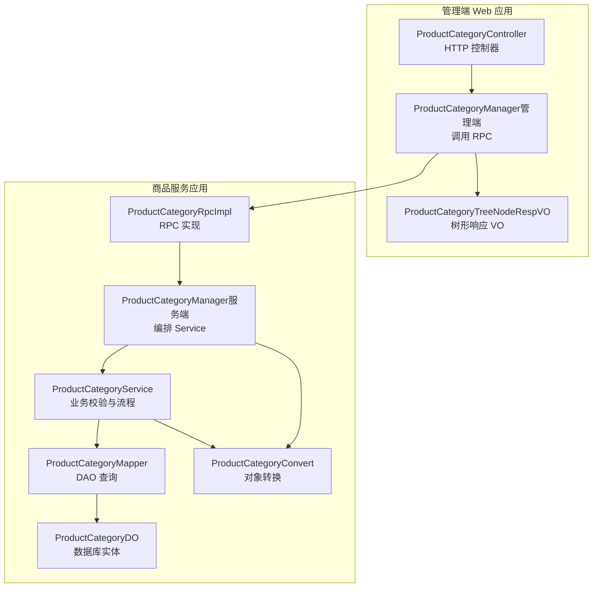
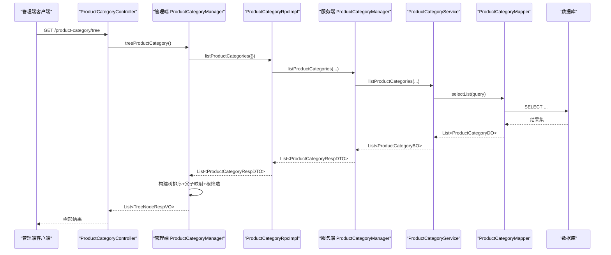
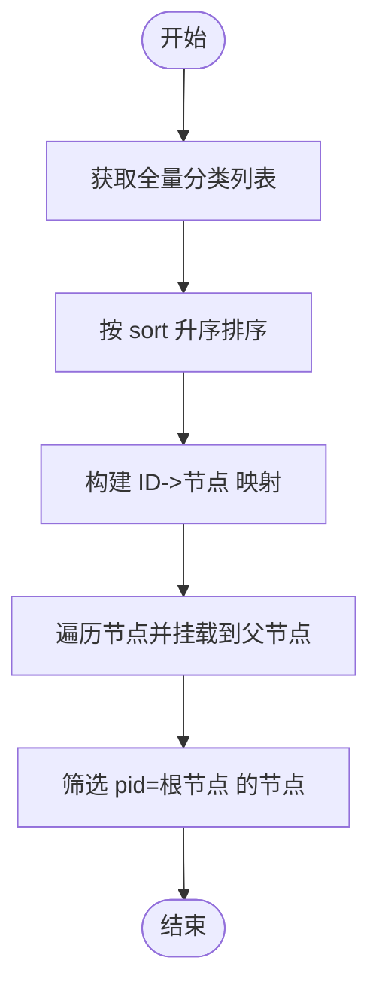
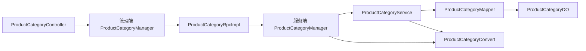

# 商品分类管理

<cite>
**本文引用的文件**
- [ProductCategoryController.java](file://management-web-app/src/main/java/cn/iocoder/mall/managementweb/controller/product/ProductCategoryController.java)
- [ProductCategoryManager（管理端）.java](file://management-web-app/src/main/java/cn/iocoder/mall/managementweb/manager/product/ProductCategoryManager.java)
- [ProductCategoryTreeNodeRespVO.java](file://management-web-app/src/main/java/cn/iocoder/mall/managementweb/controller/product/vo/category/ProductCategoryTreeNodeRespVO.java)
- [ProductCategoryRpc.java](file://product-service-project/product-service-api/src/main/java/cn/iocoder/mall/productservice/rpc/category/ProductCategoryRpc.java)
- [ProductCategoryRpcImpl.java](file://product-service-project/product-service-app/src/main/java/cn/iocoder/mall/productservice/rpc/category/ProductCategoryRpcImpl.java)
- [ProductCategoryManager（服务端）.java](file://product-service-project/product-service-app/src/main/java/cn/iocoder/mall/productservice/manager/category/ProductCategoryManager.java)
- [ProductCategoryService.java](file://product-service-project/product-service-app/src/main/java/cn/iocoder/mall/productservice/service/category/ProductCategoryService.java)
- [ProductCategoryMapper.java](file://product-service-project/product-service-app/src/main/java/cn/iocoder/mall/productservice/dal/mysql/mapper/category/ProductCategoryMapper.java)
- [ProductCategoryDO.java](file://product-service-project/product-service-app/src/main/java/cn/iocoder/mall/productservice/dal/mysql/dataobject/category/ProductCategoryDO.java)
- [ProductCategoryConvert.java](file://product-service-project/product-service-app/src/main/java/cn/iocoder/mall/productservice/convert/category/ProductCategoryConvert.java)
- [ProductCategoryListQueryReqDTO.java](file://product-service-project/product-service-api/src/main/java/cn/iocoder/mall/productservice/rpc/category/dto/ProductCategoryListQueryReqDTO.java)
- [ProductCategoryIdEnum.java](file://product-service-project/product-service-api/src/main/java/cn/iocoder/mall/productservice/enums/category/ProductCategoryIdEnum.java)
</cite>

## 目录
1. [简介](#简介)
2. [项目结构](#项目结构)
3. [核心组件](#核心组件)
4. [架构总览](#架构总览)
5. [详细组件分析](#详细组件分析)
6. [依赖分析](#依赖分析)
7. [性能考虑](#性能考虑)
8. [故障排查指南](#故障排查指南)
9. [结论](#结论)
10. [附录：使用示例与开发调试](#附录使用示例与开发调试)

## 简介
本技术文档围绕商品分类管理功能展开，系统性阐述从管理端控制器到服务端 RPC、Manager、Service、Mapper、DO 的完整链路，重点覆盖以下方面：
- 商品分类的查询、树形结构构建、层级管理
- ProductCategoryController 的实现逻辑与接口职责
- 数据模型设计（基本信息、层级关系、排序、状态）
- 分类树形结构的实现机制（父子关系、递归/映射、层级渲染）
- 分类与商品的关联关系（筛选、归属、统计）
- 权限控制与数据安全机制
- 使用示例与开发调试指南

## 项目结构
商品分类管理涉及“管理端 Web 应用”与“商品服务应用”两大模块，采用分层清晰的架构：
- 管理端 Web 应用：提供 HTTP 控制器、VO、Manager（通过 Dubbo 调用服务端 RPC）
- 商品服务应用：提供 RPC 接口实现、Manager、Service、Mapper、DO、转换器

图表来源
- [ProductCategoryController.java:1-65](file://management-web-app/src/main/java/cn/iocoder/mall/managementweb/controller/product/ProductCategoryController.java#L1-65)
- [ProductCategoryManager（管理端）.java:1-107](file://management-web-app/src/main/java/cn/iocoder/mall/managementweb/manager/product/ProductCategoryManager.java#L1-107)
- [ProductCategoryTreeNodeRespVO.java:1-37](file://management-web-app/src/main/java/cn/iocoder/mall/managementweb/controller/product/vo/category/ProductCategoryTreeNodeRespVO.java#L1-37)
- [ProductCategoryRpcImpl.java:1-59](file://product-service-project/product-service-app/src/main/java/cn/iocoder/mall/productservice/rpc/category/ProductCategoryRpcImpl.java#L1-59)
- [ProductCategoryManager（服务端）.java:1-88](file://product-service-project/product-service-app/src/main/java/cn/iocoder/mall/productservice/manager/category/ProductCategoryManager.java#L1-88)
- [ProductCategoryService.java:1-136](file://product-service-project/product-service-app/src/main/java/cn/iocoder/mall/productservice/service/category/ProductCategoryService.java#L1-136)
- [ProductCategoryMapper.java:1-25](file://product-service-project/product-service-app/src/main/java/cn/iocoder/mall/productservice/dal/mysql/mapper/category/ProductCategoryMapper.java#L1-25)
- [ProductCategoryDO.java:1-53](file://product-service-project/product-service-app/src/main/java/cn/iocoder/mall/productservice/dal/mysql/dataobject/category/ProductCategoryDO.java#L1-53)
- [ProductCategoryConvert.java:1-41](file://product-service-project/product-service-app/src/main/java/cn/iocoder/mall/productservice/convert/category/ProductCategoryConvert.java#L1-41)

章节来源
- [ProductCategoryController.java:1-65](file://management-web-app/src/main/java/cn/iocoder/mall/managementweb/controller/product/ProductCategoryController.java#L1-65)
- [ProductCategoryManager（管理端）.java:1-107](file://management-web-app/src/main/java/cn/iocoder/mall/managementweb/manager/product/ProductCategoryManager.java#L1-107)
- [ProductCategoryRpcImpl.java:1-59](file://product-service-project/product-service-app/src/main/java/cn/iocoder/mall/productservice/rpc/category/ProductCategoryRpcImpl.java#L1-59)
- [ProductCategoryService.java:1-136](file://product-service-project/product-service-app/src/main/java/cn/iocoder/mall/productservice/service/category/ProductCategoryService.java#L1-136)

## 核心组件
- 管理端控制器：提供创建、更新、删除、树形查询等 HTTP 接口，并进行权限校验
- 管理端 Manager：封装 RPC 调用，负责树形结构构建（排序、父子映射、根节点筛选）
- RPC 接口与实现：统一对外暴露能力，屏蔽服务端细节
- 服务端 Manager/Service：执行业务校验（父分类、层级限制、自环）、数据持久化
- Mapper/DO/Convert：数据访问与对象转换
- 列表查询 DTO：支持按父节点与状态过滤

章节来源
- [ProductCategoryController.java:24-64](file://management-web-app/src/main/java/cn/iocoder/mall/managementweb/controller/product/ProductCategoryController.java#L24-L64)
- [ProductCategoryManager（管理端）.java:22-104](file://management-web-app/src/main/java/cn/iocoder/mall/managementweb/manager/product/ProductCategoryManager.java#L22-L104)
- [ProductCategoryRpc.java:15-62](file://product-service-project/product-service-api/src/main/java/cn/iocoder/mall/productservice/rpc/category/ProductCategoryRpc.java#L15-L62)
- [ProductCategoryRpcImpl.java:21-58](file://product-service-project/product-service-app/src/main/java/cn/iocoder/mall/productservice/rpc/category/ProductCategoryRpcImpl.java#L21-L58)
- [ProductCategoryManager（服务端）.java:20-87](file://product-service-project/product-service-app/src/main/java/cn/iocoder/mall/productservice/manager/category/ProductCategoryManager.java#L20-L87)
- [ProductCategoryService.java:27-135](file://product-service-project/product-service-app/src/main/java/cn/iocoder/mall/productservice/service/category/ProductCategoryService.java#L27-L135)
- [ProductCategoryMapper.java:13-24](file://product-service-project/product-service-app/src/main/java/cn/iocoder/mall/productservice/dal/mysql/mapper/category/ProductCategoryMapper.java#L13-L24)
- [ProductCategoryDO.java:18-52](file://product-service-project/product-service-app/src/main/java/cn/iocoder/mall/productservice/dal/mysql/dataobject/category/ProductCategoryDO.java#L18-L52)
- [ProductCategoryConvert.java:18-40](file://product-service-project/product-service-app/src/main/java/cn/iocoder/mall/productservice/convert/category/ProductCategoryConvert.java#L18-L40)
- [ProductCategoryListQueryReqDTO.java:15-27](file://product-service-project/product-service-api/src/main/java/cn/iocoder/mall/productservice/rpc/category/dto/ProductCategoryListQueryReqDTO.java#L15-L27)

## 架构总览
下图展示从管理端 HTTP 请求到服务端数据库的完整调用链路。

图表来源
- [ProductCategoryController.java:57-62](file://management-web-app/src/main/java/cn/iocoder/mall/managementweb/controller/product/ProductCategoryController.java#L57-L62)
- [ProductCategoryManager（管理端）.java:66-104](file://management-web-app/src/main/java/cn/iocoder/mall/managementweb/manager/product/ProductCategoryManager.java#L66-L104)
- [ProductCategoryRpcImpl.java:48-56](file://product-service-project/product-service-app/src/main/java/cn/iocoder/mall/productservice/rpc/category/ProductCategoryRpcImpl.java#L48-L56)
- [ProductCategoryService.java:116-119](file://product-service-project/product-service-app/src/main/java/cn/iocoder/mall/productservice/service/category/ProductCategoryService.java#L116-L119)
- [ProductCategoryMapper.java:19-22](file://product-service-project/product-service-app/src/main/java/cn/iocoder/mall/productservice/dal/mysql/mapper/category/ProductCategoryMapper.java#L19-L22)

## 详细组件分析

### 控制器：ProductCategoryController
- 职责
  - 提供创建、更新、删除、树形查询接口
  - 基于注解进行权限校验（如 product:category:create/update/delete/tree）
- 关键点
  - 使用 CommonResult 统一返回
  - 树形查询直接委托给管理端 Manager

章节来源
- [ProductCategoryController.java:33-62](file://management-web-app/src/main/java/cn/iocoder/mall/managementweb/controller/product/ProductCategoryController.java#L33-L62)

### 管理端 Manager：ProductCategoryManager（管理端）
- 职责
  - 通过 Dubbo 调用服务端 RPC 获取全量分类列表
  - 构建树形结构：排序、父子映射、根节点筛选
- 树形构建算法要点
  - 全量排序：按 sort 升序，保证渲染顺序稳定
  - 映射构建：以 LinkedHashMap 保持插入顺序
  - 父子关系处理：遍历非根节点，将自身挂载到父节点 children
  - 根节点筛选：仅保留 pid 等于根枚举的节点

图表来源
- [ProductCategoryManager（管理端）.java:66-104](file://management-web-app/src/main/java/cn/iocoder/mall/managementweb/manager/product/ProductCategoryManager.java#L66-L104)

章节来源
- [ProductCategoryManager（管理端）.java:66-104](file://management-web-app/src/main/java/cn/iocoder/mall/managementweb/manager/product/ProductCategoryManager.java#L66-L104)
- [ProductCategoryTreeNodeRespVO.java:12-36](file://management-web-app/src/main/java/cn/iocoder/mall/managementweb/controller/product/vo/category/ProductCategoryTreeNodeRespVO.java#L12-L36)

### RPC 接口与实现：ProductCategoryRpc / ProductCategoryRpcImpl
- 职责
  - 对外暴露创建、更新、删除、查询、列表等能力
  - 实现类将请求委派给服务端 Manager
- 特点
  - 使用 @DubboService 暴露服务
  - 统一返回 CommonResult 包裹结果

章节来源
- [ProductCategoryRpc.java:15-62](file://product-service-project/product-service-api/src/main/java/cn/iocoder/mall/productservice/rpc/category/ProductCategoryRpc.java#L15-L62)
- [ProductCategoryRpcImpl.java:21-58](file://product-service-project/product-service-app/src/main/java/cn/iocoder/mall/productservice/rpc/category/ProductCategoryRpcImpl.java#L21-L58)

### 服务端 Manager/Service：ProductCategoryManager（服务端）/ ProductCategoryService
- 职责
  - 编排业务流程：创建、更新、删除、查询、列表
  - 校验父分类合法性、层级限制、自环约束
  - 删除前检查是否存在子分类（不允许存在子分类时删除）
- 关键校验
  - validParent：非根节点时校验父节点存在且为一级分类
  - 自环校验：更新时禁止将 pid 设为自身
  - 删除前置条件：仅当无子分类时允许删除

章节来源
- [ProductCategoryManager（服务端）.java:31-85](file://product-service-project/product-service-app/src/main/java/cn/iocoder/mall/productservice/manager/category/ProductCategoryManager.java#L31-L85)
- [ProductCategoryService.java:38-133](file://product-service-project/product-service-app/src/main/java/cn/iocoder/mall/productservice/service/category/ProductCategoryService.java#L38-L133)

### 数据访问层：ProductCategoryMapper / ProductCategoryDO
- Mapper
  - 提供按 pid 计数、按条件列表查询等便捷方法
- DO
  - 字段包含 id、pid、name、description、picUrl、sort、status 等
  - 继承通用可删除基类，支持软删除

章节来源
- [ProductCategoryMapper.java:13-24](file://product-service-project/product-service-app/src/main/java/cn/iocoder/mall/productservice/dal/mysql/mapper/category/ProductCategoryMapper.java#L13-L24)
- [ProductCategoryDO.java:18-52](file://product-service-project/product-service-app/src/main/java/cn/iocoder/mall/productservice/dal/mysql/dataobject/category/ProductCategoryDO.java#L18-L52)

### 对象转换：ProductCategoryConvert
- 职责
  - 在 VO/DTO/BO/DO 之间进行双向转换
  - 支持列表转换与树节点转换

章节来源
- [ProductCategoryConvert.java:18-40](file://product-service-project/product-service-app/src/main/java/cn/iocoder/mall/productservice/convert/category/ProductCategoryConvert.java#L18-L40)

### 列表查询 DTO：ProductCategoryListQueryReqDTO
- 支持按父节点 pid 与状态 status 过滤
- 使用枚举校验注解确保状态合法

章节来源
- [ProductCategoryListQueryReqDTO.java:15-27](file://product-service-project/product-service-api/src/main/java/cn/iocoder/mall/productservice/rpc/category/dto/ProductCategoryListQueryReqDTO.java#L15-L27)

### 根节点枚举：ProductCategoryIdEnum
- 定义根节点 id 为 0，用于树构建与过滤

章节来源
- [ProductCategoryIdEnum.java:6-23](file://product-service-project/product-service-api/src/main/java/cn/iocoder/mall/productservice/enums/category/ProductCategoryIdEnum.java#L6-L23)

## 依赖分析
- 控制器依赖管理端 Manager
- 管理端 Manager 通过 Dubbo 依赖 RPC 接口
- RPC 实现依赖服务端 Manager
- 服务端 Manager 依赖 Service
- Service 依赖 Mapper
- Mapper 依赖 DO
- 各层均通过 Convert 进行对象转换

图表来源
- [ProductCategoryController.java:30-31](file://management-web-app/src/main/java/cn/iocoder/mall/managementweb/controller/product/ProductCategoryController.java#L30-L31)
- [ProductCategoryManager（管理端）.java:26-27](file://management-web-app/src/main/java/cn/iocoder/mall/managementweb/manager/product/ProductCategoryManager.java#L26-L27)
- [ProductCategoryRpcImpl.java](file://product-service-project/product-service-app/src/main/java/cn/iocoder/mall/productservice/rpc/category/ProductCategoryRpcImpl.java#L24)
- [ProductCategoryManager（服务端）.java](file://product-service-project/product-service-app/src/main/java/cn/iocoder/mall/productservice/manager/category/ProductCategoryManager.java#L23)
- [ProductCategoryService.java](file://product-service-project/product-service-app/src/main/java/cn/iocoder/mall/productservice/service/category/ProductCategoryService.java#L30)
- [ProductCategoryMapper.java](file://product-service-project/product-service-app/src/main/java/cn/iocoder/mall/productservice/dal/mysql/mapper/category/ProductCategoryMapper.java#L13)
- [ProductCategoryDO.java](file://product-service-project/product-service-app/src/main/java/cn/iocoder/mall/productservice/dal/mysql/dataobject/category/ProductCategoryDO.java#L18)
- [ProductCategoryConvert.java](file://product-service-project/product-service-app/src/main/java/cn/iocoder/mall/productservice/convert/category/ProductCategoryConvert.java#L20)

章节来源
- [ProductCategoryController.java:30-31](file://management-web-app/src/main/java/cn/iocoder/mall/managementweb/controller/product/ProductCategoryController.java#L30-L31)
- [ProductCategoryManager（管理端）.java:26-27](file://management-web-app/src/main/java/cn/iocoder/mall/managementweb/manager/product/ProductCategoryManager.java#L26-L27)
- [ProductCategoryRpcImpl.java](file://product-service-project/product-service-app/src/main/java/cn/iocoder/mall/productservice/rpc/category/ProductCategoryRpcImpl.java#L24)
- [ProductCategoryService.java](file://product-service-project/product-service-app/src/main/java/cn/iocoder/mall/productservice/service/category/ProductCategoryService.java#L30)

## 性能考虑
- 树构建在内存中完成，复杂度 O(n)（一次遍历 + 映射查找），适合中小规模分类数据
- 列表查询支持按 pid 与 status 过滤，建议在数据库侧建立相应索引以提升查询效率
- 排序字段 sort 的使用确保渲染顺序稳定，避免前端二次排序带来的开销
- 树构建使用 LinkedHashMap 保持插入顺序，减少额外排序成本

## 故障排查指南
- 创建失败：检查父分类是否为一级分类、pid 是否为根或有效一级节点
- 更新失败：确认目标分类存在、pid 不得等于自身
- 删除失败：若提示存在子分类，请先删除所有子分类后再尝试删除
- 树形为空：确认分类数据已导入、状态正常、pid 关系正确

章节来源
- [ProductCategoryService.java:121-133](file://product-service-project/product-service-app/src/main/java/cn/iocoder/mall/productservice/service/category/ProductCategoryService.java#L121-L133)
- [ProductCategoryManager（服务端）.java:121-133](file://product-service-project/product-service-app/src/main/java/cn/iocoder/mall/productservice/manager/category/ProductCategoryManager.java#L121-L133)

## 结论
商品分类管理功能通过清晰的分层与职责划分，实现了从管理端到服务端的完整链路。树形结构构建采用“排序 + 映射 + 父子挂载 + 根筛选”的高效策略；服务端对父分类、层级与自环进行了严格校验，保障了数据一致性与安全性。结合权限注解与统一返回体，整体具备良好的可维护性与扩展性。

## 附录：使用示例与开发调试
- 创建分类
  - 接口：POST /product-category/create
  - 权限：product:category:create
  - 参数：创建请求 VO（由管理端 VO 转换为 DTO 后调用 RPC）
- 更新分类
  - 接口：POST /product-category/update
  - 权限：product:category:update
  - 参数：更新请求 VO → DTO → RPC
- 删除分类
  - 接口：POST /product-category/delete
  - 权限：product:category:delete
  - 参数：productCategoryId
- 获取树形结构
  - 接口：GET /product-category/tree
  - 权限：product:category:tree
  - 返回：树形结构 VO 列表（children 递归）

开发调试建议
- 使用管理端 HTTP 文件或工具发起请求，观察返回体中的错误码与消息
- 在服务端开启日志，关注树构建过程中的父子节点匹配与根节点筛选
- 如需批量查询，可通过 ProductCategoryListQueryReqDTO 指定 pid 与 status 过滤条件

章节来源
- [ProductCategoryController.java:33-62](file://management-web-app/src/main/java/cn/iocoder/mall/managementweb/controller/product/ProductCategoryController.java#L33-L62)
- [ProductCategoryManager（管理端）.java:66-104](file://management-web-app/src/main/java/cn/iocoder/mall/managementweb/manager/product/ProductCategoryManager.java#L66-L104)
- [ProductCategoryRpcImpl.java:27-56](file://product-service-project/product-service-app/src/main/java/cn/iocoder/mall/productservice/rpc/category/ProductCategoryRpcImpl.java#L27-L56)
- [ProductCategoryService.java:38-119](file://product-service-project/product-service-app/src/main/java/cn/iocoder/mall/productservice/service/category/ProductCategoryService.java#L38-L119)