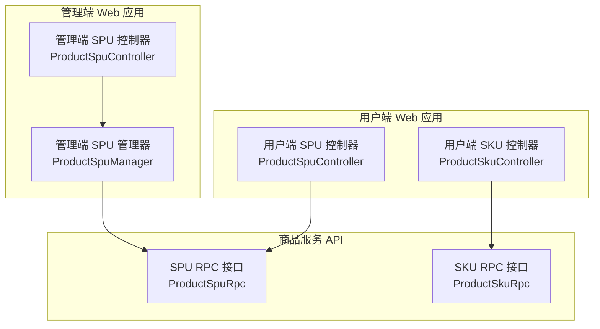
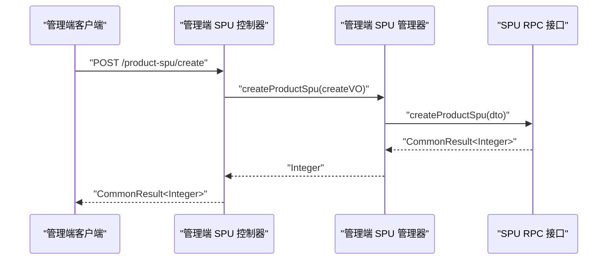
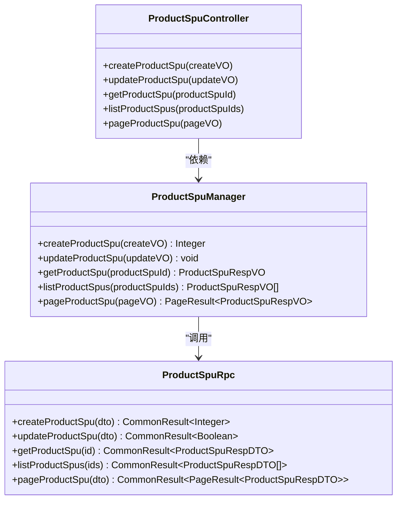
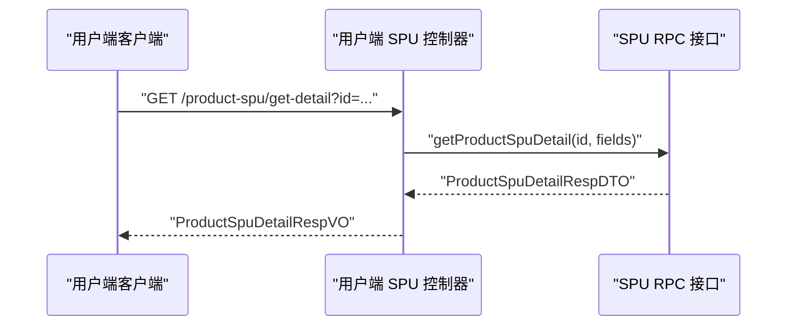
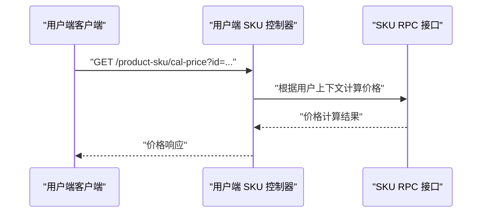
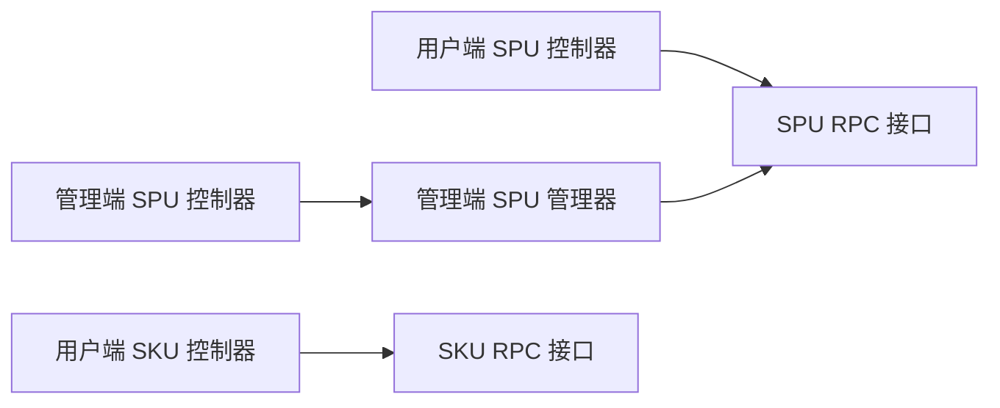

# 商品管理模块

<cite>
**本文引用的文件**
- [management-web-app/src/main/java/cn/iocoder/mall/managementweb/controller/product/ProductSpuController.java](file://management-web-app/src/main/java/cn/iocoder/mall/managementweb/controller/product/ProductSpuController.java)
- [management-web-app/src/main/java/cn/iocoder/mall/managementweb/manager/product/ProductSpuManager.java](file://management-web-app/src/main/java/cn/iocoder/mall/managementweb/manager/product/ProductSpuManager.java)
- [shop-web-app/src/main/java/cn/iocoder/mall/shopweb/controller/product/ProductSpuController.java](file://shop-web-app/src/main/java/cn/iocoder/mall/shopweb/controller/product/ProductSpuController.java)
- [shop-web-app/src/main/java/cn/iocoder/mall/shopweb/controller/product/ProductSkuController.java](file://shop-web-app/src/main/java/cn/iocoder/mall/shopweb/controller/product/ProductSkuController.java)
- [product-service-project/product-service-api/src/main/java/cn/iocoder/mall/productservice/rpc/spu/ProductSpuRpc.java](file://product-service-project/product-service-api/src/main/java/cn/iocoder/mall/productservice/rpc/spu/ProductSpuRpc.java)
- [product-service-project/product-service-api/src/main/java/cn/iocoder/mall/productservice/rpc/sku/ProductSkuRpc.java](file://product-service-project/product-service-api/src/main/java/cn/iocoder/mall/productservice/rpc/sku/ProductSkuRpc.java)
</cite>

## 目录
1. [简介](#简介)
2. [项目结构](#项目结构)
3. [核心组件](#核心组件)
4. [架构总览](#架构总览)
5. [详细组件分析](#详细组件分析)
6. [依赖分析](#依赖分析)
7. [性能考虑](#性能考虑)
8. [故障排查指南](#故障排查指南)
9. [结论](#结论)
10. [附录](#附录)

## 简介
本技术文档聚焦于商品管理模块，系统性阐述商品展示与管理的核心能力，包括：
- SPU 商品详情展示与分页检索
- SKU 规格选择与价格计算
- 商品分类浏览与搜索条件聚合
- 数据模型设计（SPU/SKU 结构、属性关联、库存管理）
- 用户体验设计（图片轮播、规格选择、价格显示、库存提示）
- 与商品服务模块的交互与数据同步机制
- 使用指南与开发调试方法

## 项目结构
商品管理模块由三层组成：
- 表现层（Web 控制器）：管理端与用户端分别提供商品管理与展示接口
- 管理器层（Manager）：封装 RPC 调用，负责参数转换与错误处理
- 服务层（RPC 接口）：定义商品服务的统一接口，供上层调用

图表来源
- [management-web-app/src/main/java/cn/iocoder/mall/managementweb/controller/product/ProductSpuController.java:25-74](file://management-web-app/src/main/java/cn/iocoder/mall/managementweb/controller/product/ProductSpuController.java#L25-L74)
- [management-web-app/src/main/java/cn/iocoder/mall/managementweb/manager/product/ProductSpuManager.java:20-84](file://management-web-app/src/main/java/cn/iocoder/mall/managementweb/manager/product/ProductSpuManager.java#L20-L84)
- [shop-web-app/src/main/java/cn/iocoder/mall/shopweb/controller/product/ProductSpuController.java:22-52](file://shop-web-app/src/main/java/cn/iocoder/mall/shopweb/controller/product/ProductSpuController.java#L22-L52)
- [shop-web-app/src/main/java/cn/iocoder/mall/shopweb/controller/product/ProductSkuController.java:17-33](file://shop-web-app/src/main/java/cn/iocoder/mall/shopweb/controller/product/ProductSkuController.java#L17-L33)
- [product-service-project/product-service-api/src/main/java/cn/iocoder/mall/productservice/rpc/spu/ProductSpuRpc.java:10-65](file://product-service-project/product-service-api/src/main/java/cn/iocoder/mall/productservice/rpc/spu/ProductSpuRpc.java#L10-L65)
- [product-service-project/product-service-api/src/main/java/cn/iocoder/mall/productservice/rpc/sku/ProductSkuRpc.java:9-30](file://product-service-project/product-service-api/src/main/java/cn/iocoder/mall/productservice/rpc/sku/ProductSkuRpc.java#L9-L30)

章节来源
- [management-web-app/src/main/java/cn/iocoder/mall/managementweb/controller/product/ProductSpuController.java:25-74](file://management-web-app/src/main/java/cn/iocoder/mall/managementweb/controller/product/ProductSpuController.java#L25-L74)
- [shop-web-app/src/main/java/cn/iocoder/mall/shopweb/controller/product/ProductSpuController.java:22-52](file://shop-web-app/src/main/java/cn/iocoder/mall/shopweb/controller/product/ProductSpuController.java#L22-L52)
- [shop-web-app/src/main/java/cn/iocoder/mall/shopweb/controller/product/ProductSkuController.java:17-33](file://shop-web-app/src/main/java/cn/iocoder/mall/shopweb/controller/product/ProductSkuController.java#L17-L33)
- [product-service-project/product-service-api/src/main/java/cn/iocoder/mall/productservice/rpc/spu/ProductSpuRpc.java:10-65](file://product-service-project/product-service-api/src/main/java/cn/iocoder/mall/productservice/rpc/spu/ProductSpuRpc.java#L10-L65)
- [product-service-project/product-service-api/src/main/java/cn/iocoder/mall/productservice/rpc/sku/ProductSkuRpc.java:9-30](file://product-service-project/product-service-api/src/main/java/cn/iocoder/mall/productservice/rpc/sku/ProductSkuRpc.java#L9-L30)

## 核心组件
- 管理端 SPU 控制器：提供 SPU 的创建、更新、单个/批量查询、分页查询等管理能力
- 管理端 SPU 管理器：封装 Dubbo RPC 调用，完成 VO/DTO 转换与错误检查
- 用户端 SPU 控制器：提供商品分页、搜索条件聚合、详情（含 SKU 组合）查询
- 用户端 SKU 控制器：提供 SKU 价格计算接口（结合用户上下文）
- 商品服务 SPU RPC：定义 SPU 的增删改查与详情查询等接口
- 商品服务 SKU RPC：定义 SKU 查询与列表查询接口

章节来源
- [management-web-app/src/main/java/cn/iocoder/mall/managementweb/controller/product/ProductSpuController.java:25-74](file://management-web-app/src/main/java/cn/iocoder/mall/managementweb/controller/product/ProductSpuController.java#L25-L74)
- [management-web-app/src/main/java/cn/iocoder/mall/managementweb/manager/product/ProductSpuManager.java:20-84](file://management-web-app/src/main/java/cn/iocoder/mall/managementweb/manager/product/ProductSpuManager.java#L20-L84)
- [shop-web-app/src/main/java/cn/iocoder/mall/shopweb/controller/product/ProductSpuController.java:22-52](file://shop-web-app/src/main/java/cn/iocoder/mall/shopweb/controller/product/ProductSpuController.java#L22-L52)
- [shop-web-app/src/main/java/cn/iocoder/mall/shopweb/controller/product/ProductSkuController.java:17-33](file://shop-web-app/src/main/java/cn/iocoder/mall/shopweb/controller/product/ProductSkuController.java#L17-L33)
- [product-service-project/product-service-api/src/main/java/cn/iocoder/mall/productservice/rpc/spu/ProductSpuRpc.java:10-65](file://product-service-project/product-service-api/src/main/java/cn/iocoder/mall/productservice/rpc/spu/ProductSpuRpc.java#L10-L65)
- [product-service-project/product-service-api/src/main/java/cn/iocoder/mall/productservice/rpc/sku/ProductSkuRpc.java:9-30](file://product-service-project/product-service-api/src/main/java/cn/iocoder/mall/productservice/rpc/sku/ProductSkuRpc.java#L9-L30)

## 架构总览
商品管理模块采用“表现层-管理器层-RPC 接口”的分层架构，通过 Dubbo 进行远程调用，确保管理端与用户端的职责清晰分离。

图表来源
- [management-web-app/src/main/java/cn/iocoder/mall/managementweb/controller/product/ProductSpuController.java:34-38](file://management-web-app/src/main/java/cn/iocoder/mall/managementweb/controller/product/ProductSpuController.java#L34-L38)
- [management-web-app/src/main/java/cn/iocoder/mall/managementweb/manager/product/ProductSpuManager.java:32-36](file://management-web-app/src/main/java/cn/iocoder/mall/managementweb/manager/product/ProductSpuManager.java#L32-L36)
- [product-service-project/product-service-api/src/main/java/cn/iocoder/mall/productservice/rpc/spu/ProductSpuRpc.java](file://product-service-project/product-service-api/src/main/java/cn/iocoder/mall/productservice/rpc/spu/ProductSpuRpc.java#L21)

## 详细组件分析

### 管理端 SPU 控制器与管理器
- 控制器提供以下接口：
  - 创建 SPU：POST /product-spu/create
  - 更新 SPU：POST /product-spu/update
  - 获取单个 SPU：GET /product-spu/get
  - 获取多个 SPU：GET /product-spu/list
  - 分页查询 SPU：GET /product-spu/page
- 管理器负责：
  - 将 VO 转换为 DTO
  - 调用 SPU RPC 接口
  - 检查返回结果并抛出异常
  - 将 RPC 返回的 DTO 转换为 VO

图表来源
- [management-web-app/src/main/java/cn/iocoder/mall/managementweb/controller/product/ProductSpuController.java:25-74](file://management-web-app/src/main/java/cn/iocoder/mall/managementweb/controller/product/ProductSpuController.java#L25-L74)
- [management-web-app/src/main/java/cn/iocoder/mall/managementweb/manager/product/ProductSpuManager.java:20-84](file://management-web-app/src/main/java/cn/iocoder/mall/managementweb/manager/product/ProductSpuManager.java#L20-L84)
- [product-service-project/product-service-api/src/main/java/cn/iocoder/mall/productservice/rpc/spu/ProductSpuRpc.java:10-65](file://product-service-project/product-service-api/src/main/java/cn/iocoder/mall/productservice/rpc/spu/ProductSpuRpc.java#L10-L65)

章节来源
- [management-web-app/src/main/java/cn/iocoder/mall/managementweb/controller/product/ProductSpuController.java:25-74](file://management-web-app/src/main/java/cn/iocoder/mall/managementweb/controller/product/ProductSpuController.java#L25-L74)
- [management-web-app/src/main/java/cn/iocoder/mall/managementweb/manager/product/ProductSpuManager.java:20-84](file://management-web-app/src/main/java/cn/iocoder/mall/managementweb/manager/product/ProductSpuManager.java#L20-L84)
- [product-service-project/product-service-api/src/main/java/cn/iocoder/mall/productservice/rpc/spu/ProductSpuRpc.java:10-65](file://product-service-project/product-service-api/src/main/java/cn/iocoder/mall/productservice/rpc/spu/ProductSpuRpc.java#L10-L65)

### 用户端 SPU 控制器
- 提供以下接口：
  - 商品分页：GET /product-spu/page
  - 搜索条件聚合：GET /product-spu/search-condition
  - 商品详情（含 SKU 信息）：GET /product-spu/get-detail
- 该控制器直接调用商品服务 RPC 接口，返回用户侧所需的数据结构

图表来源
- [shop-web-app/src/main/java/cn/iocoder/mall/shopweb/controller/product/ProductSpuController.java:45-50](file://shop-web-app/src/main/java/cn/iocoder/mall/shopweb/controller/product/ProductSpuController.java#L45-L50)
- [product-service-project/product-service-api/src/main/java/cn/iocoder/mall/productservice/rpc/spu/ProductSpuRpc.java](file://product-service-project/product-service-api/src/main/java/cn/iocoder/mall/productservice/rpc/spu/ProductSpuRpc.java#L63)

章节来源
- [shop-web-app/src/main/java/cn/iocoder/mall/shopweb/controller/product/ProductSpuController.java:22-52](file://shop-web-app/src/main/java/cn/iocoder/mall/shopweb/controller/product/ProductSpuController.java#L22-L52)
- [product-service-project/product-service-api/src/main/java/cn/iocoder/mall/productservice/rpc/spu/ProductSpuRpc.java:10-65](file://product-service-project/product-service-api/src/main/java/cn/iocoder/mall/productservice/rpc/spu/ProductSpuRpc.java#L10-L65)

### 用户端 SKU 控制器与价格计算
- 提供 SKU 价格计算接口：GET /product-sku/cal-price
- 该接口在内部获取当前用户 ID，并调用商品服务进行价格计算
- 用于在用户选择具体 SKU 后，实时计算最终价格

图表来源
- [shop-web-app/src/main/java/cn/iocoder/mall/shopweb/controller/product/ProductSkuController.java:26-31](file://shop-web-app/src/main/java/cn/iocoder/mall/shopweb/controller/product/ProductSkuController.java#L26-L31)
- [product-service-project/product-service-api/src/main/java/cn/iocoder/mall/productservice/rpc/sku/ProductSkuRpc.java:12-30](file://product-service-project/product-service-api/src/main/java/cn/iocoder/mall/productservice/rpc/sku/ProductSkuRpc.java#L12-L30)

章节来源
- [shop-web-app/src/main/java/cn/iocoder/mall/shopweb/controller/product/ProductSkuController.java:17-33](file://shop-web-app/src/main/java/cn/iocoder/mall/shopweb/controller/product/ProductSkuController.java#L17-L33)
- [product-service-project/product-service-api/src/main/java/cn/iocoder/mall/productservice/rpc/sku/ProductSkuRpc.java:9-30](file://product-service-project/product-service-api/src/main/java/cn/iocoder/mall/productservice/rpc/sku/ProductSkuRpc.java#L9-L30)

### 商品数据模型与库存管理
- SPU（Standard Product Unit）：标准化商品单元，描述商品的通用属性与主图、卖点、详情等
- SKU（Stock Keeping Unit）：库存量单位，对应具体的规格组合（如颜色、尺寸），包含独立的价格、库存等
- 属性关联：SPU 与 SKU 通过属性值组合形成多种 SKU，用户在前端选择规格时，实际选择的是 SKU
- 库存管理：SKU 级别维护库存数量；在用户下单或促销场景下，库存需与交易服务协同扣减与回滚

（本节为概念性说明，不直接分析具体代码文件）

### 商品展示的用户体验设计
- 图片轮播：SPU 详情中展示多张主图，支持左右切换
- 规格选择：以属性维度展示可选规格，选择后锁定对应 SKU
- 价格显示：根据所选 SKU 实时展示价格；若存在会员价/活动价，应叠加优惠规则
- 库存提示：当 SKU 库存为 0 或不足时，给出明确提示并禁用购买按钮

（本节为概念性说明，不直接分析具体代码文件）

## 依赖分析
- 控制器仅负责路由与参数校验，不直接访问数据库
- 管理器通过 Dubbo 调用商品服务 RPC 接口，完成业务编排与数据转换
- RPC 接口定义了稳定的契约，便于前后端解耦与横向扩展

图表来源
- [management-web-app/src/main/java/cn/iocoder/mall/managementweb/controller/product/ProductSpuController.java:25-74](file://management-web-app/src/main/java/cn/iocoder/mall/managementweb/controller/product/ProductSpuController.java#L25-L74)
- [management-web-app/src/main/java/cn/iocoder/mall/managementweb/manager/product/ProductSpuManager.java:20-84](file://management-web-app/src/main/java/cn/iocoder/mall/managementweb/manager/product/ProductSpuManager.java#L20-L84)
- [shop-web-app/src/main/java/cn/iocoder/mall/shopweb/controller/product/ProductSpuController.java:22-52](file://shop-web-app/src/main/java/cn/iocoder/mall/shopweb/controller/product/ProductSpuController.java#L22-L52)
- [shop-web-app/src/main/java/cn/iocoder/mall/shopweb/controller/product/ProductSkuController.java:17-33](file://shop-web-app/src/main/java/cn/iocoder/mall/shopweb/controller/product/ProductSkuController.java#L17-L33)
- [product-service-project/product-service-api/src/main/java/cn/iocoder/mall/productservice/rpc/spu/ProductSpuRpc.java:10-65](file://product-service-project/product-service-api/src/main/java/cn/iocoder/mall/productservice/rpc/spu/ProductSpuRpc.java#L10-L65)
- [product-service-project/product-service-api/src/main/java/cn/iocoder/mall/productservice/rpc/sku/ProductSkuRpc.java:9-30](file://product-service-project/product-service-api/src/main/java/cn/iocoder/mall/productservice/rpc/sku/ProductSkuRpc.java#L9-L30)

章节来源
- [management-web-app/src/main/java/cn/iocoder/mall/managementweb/controller/product/ProductSpuController.java:25-74](file://management-web-app/src/main/java/cn/iocoder/mall/managementweb/controller/product/ProductSpuController.java#L25-L74)
- [management-web-app/src/main/java/cn/iocoder/mall/managementweb/manager/product/ProductSpuManager.java:20-84](file://management-web-app/src/main/java/cn/iocoder/mall/managementweb/manager/product/ProductSpuManager.java#L20-L84)
- [shop-web-app/src/main/java/cn/iocoder/mall/shopweb/controller/product/ProductSpuController.java:22-52](file://shop-web-app/src/main/java/cn/iocoder/mall/shopweb/controller/product/ProductSpuController.java#L22-L52)
- [shop-web-app/src/main/java/cn/iocoder/mall/shopweb/controller/product/ProductSkuController.java:17-33](file://shop-web-app/src/main/java/cn/iocoder/mall/shopweb/controller/product/ProductSkuController.java#L17-L33)
- [product-service-project/product-service-api/src/main/java/cn/iocoder/mall/productservice/rpc/spu/ProductSpuRpc.java:10-65](file://product-service-project/product-service-api/src/main/java/cn/iocoder/mall/productservice/rpc/spu/ProductSpuRpc.java#L10-L65)
- [product-service-project/product-service-api/src/main/java/cn/iocoder/mall/productservice/rpc/sku/ProductSkuRpc.java:9-30](file://product-service-project/product-service-api/src/main/java/cn/iocoder/mall/productservice/rpc/sku/ProductSkuRpc.java#L9-L30)

## 性能考虑
- 分页查询：优先使用分页接口，避免一次性加载大量数据
- 缓存策略：对商品详情与热门商品可引入缓存，降低 RPC 压力
- 批量查询：在管理端批量获取 SPU 时，尽量合并请求，减少网络往返
- 异步处理：库存扣减与价格计算可异步化，提升响应速度

（本节为通用建议，不直接分析具体代码文件）

## 故障排查指南
- 控制器层
  - 参数校验失败：检查请求参数是否符合 VO 定义
  - 接口未生效：确认请求路径与注解映射一致
- 管理器层
  - RPC 调用失败：检查 Dubbo 版本配置与服务注册中心状态
  - 错误码处理：关注返回结果的错误码与消息
- RPC 接口层
  - 方法签名不匹配：确保 DTO 字段与服务端一致
  - 超时与重试：合理设置超时时间与重试策略

章节来源
- [management-web-app/src/main/java/cn/iocoder/mall/managementweb/manager/product/ProductSpuManager.java:32-36](file://management-web-app/src/main/java/cn/iocoder/mall/managementweb/manager/product/ProductSpuManager.java#L32-L36)
- [management-web-app/src/main/java/cn/iocoder/mall/managementweb/manager/product/ProductSpuManager.java:43-46](file://management-web-app/src/main/java/cn/iocoder/mall/managementweb/manager/product/ProductSpuManager.java#L43-L46)
- [management-web-app/src/main/java/cn/iocoder/mall/managementweb/manager/product/ProductSpuManager.java:54-58](file://management-web-app/src/main/java/cn/iocoder/mall/managementweb/manager/product/ProductSpuManager.java#L54-L58)
- [management-web-app/src/main/java/cn/iocoder/mall/managementweb/manager/product/ProductSpuManager.java:66-70](file://management-web-app/src/main/java/cn/iocoder/mall/managementweb/manager/product/ProductSpuManager.java#L66-L70)
- [management-web-app/src/main/java/cn/iocoder/mall/managementweb/manager/product/ProductSpuManager.java:78-82](file://management-web-app/src/main/java/cn/iocoder/mall/managementweb/manager/product/ProductSpuManager.java#L78-L82)

## 结论
商品管理模块通过清晰的分层设计与稳定的 RPC 接口，实现了管理端与用户端的商品管理与展示能力。SPU/SKU 的数据模型与属性组合为规格选择与价格计算提供了基础，配合合理的缓存与异步策略，可在高并发场景下保持良好的性能与稳定性。

## 附录
- 使用指南
  - 管理端：通过 /product-spu 下的接口进行商品的创建、更新、查询与分页
  - 用户端：通过 /product-spu 与 /product-sku 下的接口进行商品浏览、规格选择与价格计算
- 开发调试
  - 使用 HTTP 客户端工具（如 Postman）调用接口
  - 关注返回的错误码与消息，定位问题
  - 在本地环境启动 Dubbo 服务，确保 RPC 可达