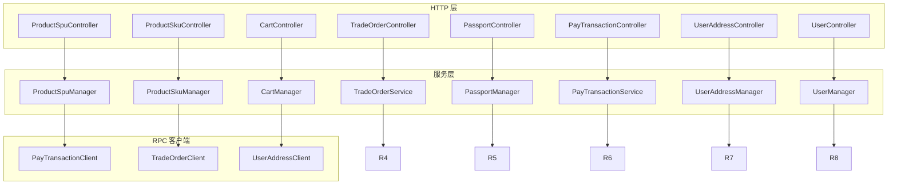
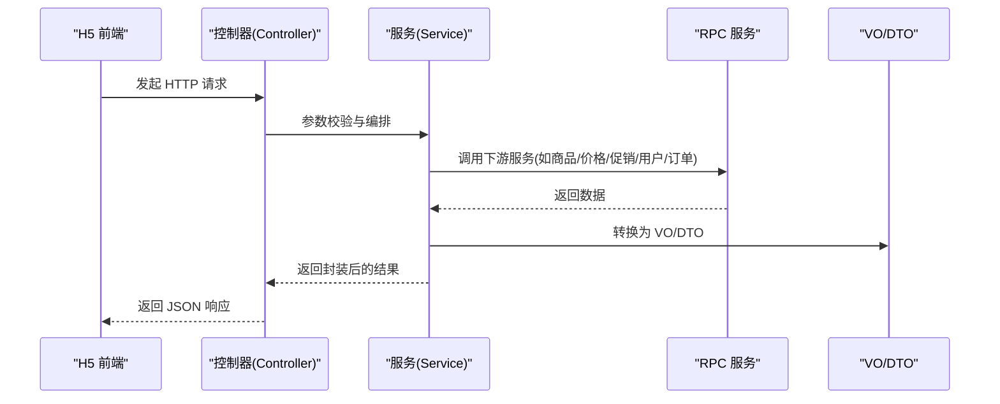
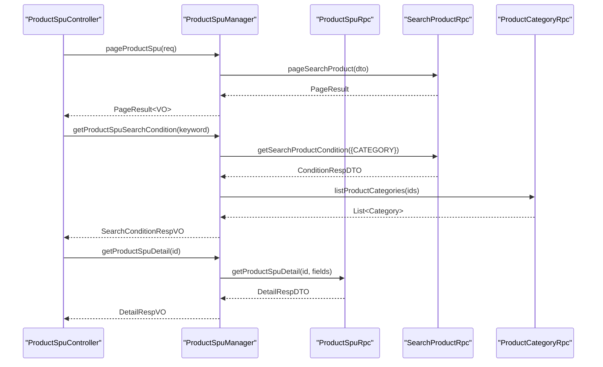
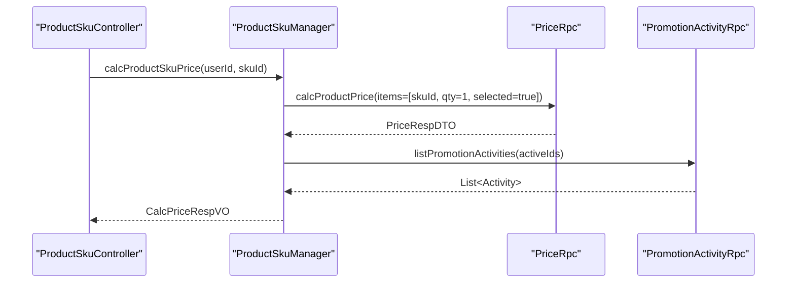
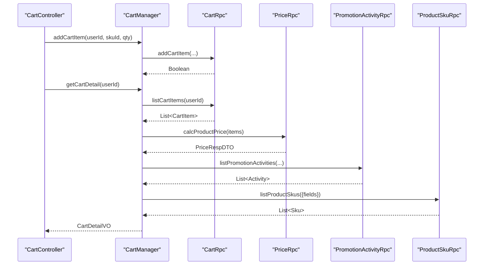
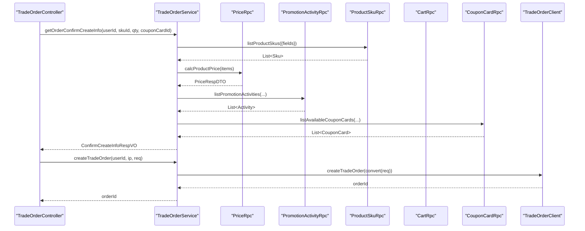
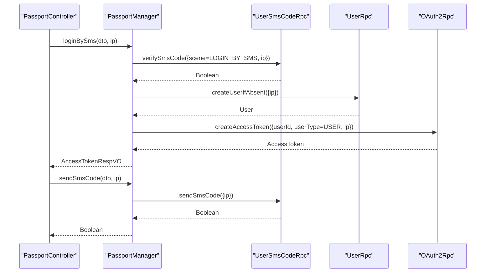
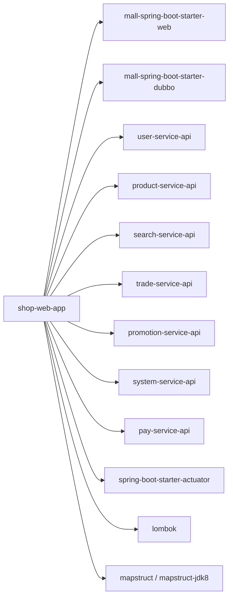

# 商城前端应用

<cite>
**本文引用的文件**
- [README.md](file://README.md)
- [功能列表-H5 商城.md](file://docs/guides/功能列表/功能列表-H5 商城.md)
- [quick-start.md](file://docs/setup/quick-start.md)
- [ShopWebApplication.java](file://shop-web-app/src/main/java/cn/iocoder/mall/shopweb/ShopWebApplication.java)
- [pom.xml](file://shop-web-app/pom.xml)
- [ProductSpuController.java](file://shop-web-app/src/main/java/cn/iocoder/mall/shopweb/controller/product/ProductSpuController.java)
- [ProductSkuController.java](file://shop-web-app/src/main/java/cn/iocoder/mall/shopweb/controller/product/ProductSkuController.java)
- [CartController.java](file://shop-web-app/src/main/java/cn/iocoder/mall/shopweb/controller/trade/CartController.java)
- [TradeOrderController.java](file://shop-web-app/src/main/java/cn/iocoder/mall/shopweb/controller/trade/TradeOrderController.java)
- [PassportController.java](file://shop-web-app/src/main/java/cn/iocoder/mall/shopweb/controller/user/PassportController.java)
- [ProductSpuManager.java](file://shop-web-app/src/main/java/cn/iocoder/mall/shopweb/service/product/ProductSpuManager.java)
- [ProductSkuManager.java](file://shop-web-app/src/main/java/cn/iocoder/mall/shopweb/service/product/ProductSkuManager.java)
- [CartManager.java](file://shop-web-app/src/main/java/cn/iocoder/mall/shopweb/service/trade/CartManager.java)
- [TradeOrderService.java](file://shop-web-app/src/main/java/cn/iocoder/mall/shopweb/service/trade/TradeOrderService.java)
- [PassportManager.java](file://shop-web-app/src/main/java/cn/iocoder/mall/shopweb/service/user/PassportManager.java)
- [PayTransactionClient.java](file://shop-web-app/src/main/java/cn/iocoder/mall/shopweb/client/pay/PayTransactionClient.java)
- [TradeOrderClient.java](file://shop-web-app/src/main/java/cn/iocoder/mall/shopweb/client/trade/TradeOrderClient.java)
- [UserAddressClient.java](file://shop-web-app/src/main/java/cn/iocoder/mall/shopweb/client/user/UserAddressClient.java)
- [PayTransactionController.java](file://shop-web-app/src/main/java/cn/iocoder/mall/shopweb/controller/pay/PayTransactionController.java)
- [PayTransactionRespVO.java](file://shop-web-app/src/main/java/cn/iocoder/mall/shopweb/controller/pay/vo/transaction/PayTransactionRespVO.java)
- [PayTransactionSubmitReqVO.java](file://shop-web-app/src/main/java/cn/iocoder/mall/shopweb/controller/pay/vo/transaction/PayTransactionSubmitReqVO.java)
- [PayTransactionSubmitRespVO.java](file://shop-web-app/src/main/java/cn/iocoder/mall/shopweb/controller/pay/vo/transaction/PayTransactionSubmitRespVO.java)
- [PayTransactionService.java](file://shop-web-app/src/main/java/cn/iocoder/mall/shopweb/service/pay/PayTransactionService.java)
- [PayTransactionConvert.java](file://shop-web-app/src/main/java/cn/iocoder/mall/shopweb/convert/pay/PayTransactionConvert.java)
- [PayTransactionConvert.java](file://shop-web-app/src/main/java/cn/iocoder/mall/shopweb/convert/pay/PayTransactionConvert.java)
- [UserAddressController.java](file://shop-web-app/src/main/java/cn/iocoder/mall/shopweb/controller/user/UserAddressController.java)
- [UserController.java](file://shop-web-app/src/main/java/cn/iocoder/mall/shopweb/controller/user/UserController.java)
- [UserAddressManager.java](file://shop-web-app/src/main/java/cn/iocoder/mall/shopweb/service/user/UserAddressManager.java)
- [UserManager.java](file://shop-web-app/src/main/java/cn/iocoder/mall/shopweb/service/user/UserManager.java)
- [ShopWebErrorCodeConstants.java](file://shop-web-app/src/main/java/cn/iocoder/mall/shopweb/enums/ShopWebErrorCodeConstants.java)
</cite>

## 目录
1. [简介](#简介)
2. [项目结构](#项目结构)
3. [核心组件](#核心组件)
4. [架构总览](#架构总览)
5. [详细组件分析](#详细组件分析)
6. [依赖关系分析](#依赖关系分析)
7. [性能考量](#性能考量)
8. [故障排查指南](#故障排查指南)
9. [结论](#结论)
10. [附录](#附录)

## 简介
本文件面向“H5 商城前端应用”的后端服务侧（shop-web-app），系统化梳理其整体架构、核心功能模块与控制器职责，覆盖商品浏览（SPU/SKU）、购物车管理、下单支付、订单查询、用户中心等关键路径；并结合后端服务的交互方式、数据传输与状态管理进行说明，最后给出性能优化策略与开发调试方法。

## 项目结构
shop-web-app 是一个基于 Spring Boot 的 HTTP 服务模块，负责对外提供 H5 商城所需的用户认证、商品、购物车、订单、支付、营销等接口。其典型分层为：
- 控制器层（Controller）：暴露 REST 接口，处理请求参数与响应封装
- 服务层（Service）：编排 RPC 调用、聚合多服务数据、进行业务校验
- 客户端/转换层（Client/Convert）：RPC 客户端与 VO/DTO 转换
- 配置与入口：Spring Boot 启动类、Swagger 文档、Dubbo 消费者配置

图表来源
- [ProductSpuController.java:22-52](file://shop-web-app/src/main/java/cn/iocoder/mall/shopweb/controller/product/ProductSpuController.java#L22-L52)
- [ProductSkuController.java:17-33](file://shop-web-app/src/main/java/cn/iocoder/mall/shopweb/controller/product/ProductSkuController.java#L17-L33)
- [CartController.java:20-83](file://shop-web-app/src/main/java/cn/iocoder/mall/shopweb/controller/trade/CartController.java#L20-L83)
- [TradeOrderController.java:22-84](file://shop-web-app/src/main/java/cn/iocoder/mall/shopweb/controller/trade/TradeOrderController.java#L22-L84)
- [PassportController.java:22-56](file://shop-web-app/src/main/java/cn/iocoder/mall/shopweb/controller/user/PassportController.java#L22-L56)
- [ProductSpuManager.java:32-78](file://shop-web-app/src/main/java/cn/iocoder/mall/shopweb/service/product/ProductSpuManager.java#L32-L78)
- [ProductSkuManager.java:22-60](file://shop-web-app/src/main/java/cn/iocoder/mall/shopweb/service/product/ProductSkuManager.java#L22-L60)
- [CartManager.java:28-168](file://shop-web-app/src/main/java/cn/iocoder/mall/shopweb/service/trade/CartManager.java#L28-L168)
- [TradeOrderService.java:48-203](file://shop-web-app/src/main/java/cn/iocoder/mall/shopweb/service/trade/TradeOrderService.java#L48-L203)
- [PassportManager.java:20-61](file://shop-web-app/src/main/java/cn/iocoder/mall/shopweb/service/user/PassportManager.java#L20-L61)

章节来源
- [ShopWebApplication.java](file://shop-web-app/src/main/java/cn/iocoder/mall/shopweb/ShopWebApplication.java)
- [pom.xml:1-135](file://shop-web-app/pom.xml#L1-L135)

## 核心组件
- 商品模块
  - ProductSpuController：提供商品 SPU 分页、搜索条件、详情等接口
  - ProductSkuController：提供 SKU 价格计算接口
  - ProductSpuManager/ProductSkuManager：聚合搜索、价格、促销等 RPC 结果
- 购物车模块
  - CartController：提供添加、查询、更新数量与选中状态等接口
  - CartManager：统一聚合价格、促销、SKU 信息，返回购物车明细
- 订单模块
  - TradeOrderController：提供下单确认信息、创建订单、查询订单等接口
  - TradeOrderService：校验 SKU、计算价格、聚合促销与优惠券、调用客户端创建订单
- 用户模块
  - PassportController：提供短信登录、发送验证码、刷新令牌等接口
  - PassportManager：整合短信校验、用户创建、OAuth2 令牌发放
- 支付模块
  - PayTransactionController：提供支付事务相关接口
  - PayTransactionService：封装支付事务 RPC 调用与转换
- 用户地址与用户信息
  - UserAddressController/UserController：提供地址与用户信息相关接口
  - UserAddressManager/UserManager：封装 RPC 调用与转换

章节来源
- [ProductSpuController.java:22-52](file://shop-web-app/src/main/java/cn/iocoder/mall/shopweb/controller/product/ProductSpuController.java#L22-L52)
- [ProductSkuController.java:17-33](file://shop-web-app/src/main/java/cn/iocoder/mall/shopweb/controller/product/ProductSkuController.java#L17-L33)
- [CartController.java:20-83](file://shop-web-app/src/main/java/cn/iocoder/mall/shopweb/controller/trade/CartController.java#L20-L83)
- [TradeOrderController.java:22-84](file://shop-web-app/src/main/java/cn/iocoder/mall/shopweb/controller/trade/TradeOrderController.java#L22-L84)
- [PassportController.java:22-56](file://shop-web-app/src/main/java/cn/iocoder/mall/shopweb/controller/user/PassportController.java#L22-L56)
- [PayTransactionController.java](file://shop-web-app/src/main/java/cn/iocoder/mall/shopweb/controller/pay/PayTransactionController.java)
- [UserAddressController.java](file://shop-web-app/src/main/java/cn/iocoder/mall/shopweb/controller/user/UserAddressController.java)
- [UserController.java](file://shop-web-app/src/main/java/cn/iocoder/mall/shopweb/controller/user/UserController.java)

## 架构总览
shop-web-app 通过 Dubbo 消费多个后端 RPC 服务，形成“网关/HTTP 层 → 业务编排层 → 多 RPC 服务”的分层架构。核心交互链路如下：

图表来源
- [ProductSpuManager.java:45-76](file://shop-web-app/src/main/java/cn/iocoder/mall/shopweb/service/product/ProductSpuManager.java#L45-L76)
- [CartManager.java:96-135](file://shop-web-app/src/main/java/cn/iocoder/mall/shopweb/service/trade/CartManager.java#L96-L135)
- [TradeOrderService.java:66-127](file://shop-web-app/src/main/java/cn/iocoder/mall/shopweb/service/trade/TradeOrderService.java#L66-L127)
- [PassportManager.java:30-59](file://shop-web-app/src/main/java/cn/iocoder/mall/shopweb/service/user/PassportManager.java#L30-L59)

## 详细组件分析

### 商品 SPU 控制器（ProductSpuController）
- 职责
  - 提供商品 SPU 分页查询、搜索条件获取、详情（含 SKU/属性）查询
- 关键接口
  - GET /product-spu/page：分页查询
  - GET /product-spu/search-condition：根据关键词返回搜索条件（如分类）
  - GET /product-spu/get-detail：按 SPU 获取详情
- 与服务层关系
  - 委托 ProductSpuManager 完成 RPC 调用与 VO 转换

图表来源
- [ProductSpuController.java:31-50](file://shop-web-app/src/main/java/cn/iocoder/mall/shopweb/controller/product/ProductSpuController.java#L31-L50)
- [ProductSpuManager.java:45-76](file://shop-web-app/src/main/java/cn/iocoder/mall/shopweb/service/product/ProductSpuManager.java#L45-L76)

章节来源
- [ProductSpuController.java:22-52](file://shop-web-app/src/main/java/cn/iocoder/mall/shopweb/controller/product/ProductSpuController.java#L22-L52)
- [ProductSpuManager.java:32-78](file://shop-web-app/src/main/java/cn/iocoder/mall/shopweb/service/product/ProductSpuManager.java#L32-L78)

### 商品 SKU 控制器（ProductSkuController）
- 职责
  - 提供 SKU 价格计算接口，支持当前登录用户上下文
- 关键接口
  - GET /product-sku/cal-price：按 SKU 计算价格，包含满减送与限时折扣等促销信息
- 与服务层关系
  - 委托 ProductSkuManager 完成价格计算与促销活动查询

图表来源
- [ProductSkuController.java:26-31](file://shop-web-app/src/main/java/cn/iocoder/mall/shopweb/controller/product/ProductSkuController.java#L26-L31)
- [ProductSkuManager.java:38-51](file://shop-web-app/src/main/java/cn/iocoder/mall/shopweb/service/product/ProductSkuManager.java#L38-L51)

章节来源
- [ProductSkuController.java:17-33](file://shop-web-app/src/main/java/cn/iocoder/mall/shopweb/controller/product/ProductSkuController.java#L17-L33)
- [ProductSkuManager.java:19-60](file://shop-web-app/src/main/java/cn/iocoder/mall/shopweb/service/product/ProductSkuManager.java#L19-L60)

### 购物车控制器（CartController）
- 职责
  - 提供添加商品到购物车、查询购物车汇总数量、获取购物车明细、更新数量与选中状态
- 关键接口
  - POST /cart/add：添加商品
  - GET /cart/sum-quantity：统计数量
  - GET /cart/get-detail：获取明细
  - POST /cart/update-quantity：更新数量
  - POST /cart/update-selected：更新选中状态
- 与服务层关系
  - 委托 CartManager 完成 RPC 调用、价格计算、促销与 SKU 信息聚合

图表来源
- [CartController.java:29-54](file://shop-web-app/src/main/java/cn/iocoder/mall/shopweb/controller/trade/CartController.java#L29-L54)
- [CartManager.java:47-135](file://shop-web-app/src/main/java/cn/iocoder/mall/shopweb/service/trade/CartManager.java#L47-L135)

章节来源
- [CartController.java:20-83](file://shop-web-app/src/main/java/cn/iocoder/mall/shopweb/controller/trade/CartController.java#L20-L83)
- [CartManager.java:28-168](file://shop-web-app/src/main/java/cn/iocoder/mall/shopweb/service/trade/CartManager.java#L28-L168)

### 订单控制器（TradeOrderController）
- 职责
  - 提供下单前确认信息（直接购买/购物车）、创建订单、查询订单、分页查询
- 关键接口
  - GET /trade-order/confirm-create-order-info：基于单个 SKU 确认下单
  - GET /trade-order/confirm-create-order-info-from-cart：基于购物车确认下单
  - POST /trade-order/create：创建订单
  - GET /trade-order/get：查询订单
  - GET /trade-order/page：分页查询
- 与服务层关系
  - 委托 TradeOrderService 完成 SKU 校验、价格计算、促销与优惠券聚合、调用客户端创建订单

图表来源
- [TradeOrderController.java:31-62](file://shop-web-app/src/main/java/cn/iocoder/mall/shopweb/controller/trade/TradeOrderController.java#L31-L62)
- [TradeOrderService.java:66-127](file://shop-web-app/src/main/java/cn/iocoder/mall/shopweb/service/trade/TradeOrderService.java#L66-L127)

章节来源
- [TradeOrderController.java:22-84](file://shop-web-app/src/main/java/cn/iocoder/mall/shopweb/controller/trade/TradeOrderController.java#L22-L84)
- [TradeOrderService.java:48-203](file://shop-web-app/src/main/java/cn/iocoder/mall/shopweb/service/trade/TradeOrderService.java#L48-L203)

### 用户 Passport 控制器（PassportController）
- 职责
  - 提供短信登录、发送验证码、刷新令牌
- 关键接口
  - POST /passport/login-by-sms：短信登录
  - POST /passport/send-sms-code：发送验证码
  - POST /passport/refresh-token：刷新访问令牌
- 与服务层关系
  - 委托 PassportManager 完成短信校验、用户创建、OAuth2 令牌发放

图表来源
- [PassportController.java:30-54](file://shop-web-app/src/main/java/cn/iocoder/mall/shopweb/controller/user/PassportController.java#L30-L54)
- [PassportManager.java:30-59](file://shop-web-app/src/main/java/cn/iocoder/mall/shopweb/service/user/PassportManager.java#L30-L59)

章节来源
- [PassportController.java:22-56](file://shop-web-app/src/main/java/cn/iocoder/mall/shopweb/controller/user/PassportController.java#L22-L56)
- [PassportManager.java:20-61](file://shop-web-app/src/main/java/cn/iocoder/mall/shopweb/service/user/PassportManager.java#L20-L61)

### 支付事务控制器（PayTransactionController）
- 职责
  - 提供支付事务相关接口（如提交支付、查询支付结果等）
- 关键接口
  - 由 PayTransactionController 暴露，具体见接口定义
- 与服务层关系
  - 委托 PayTransactionService 完成 RPC 调用与 VO 转换

章节来源
- [PayTransactionController.java](file://shop-web-app/src/main/java/cn/iocoder/mall/shopweb/controller/pay/PayTransactionController.java)
- [PayTransactionService.java](file://shop-web-app/src/main/java/cn/iocoder/mall/shopweb/service/pay/PayTransactionService.java)
- [PayTransactionClient.java](file://shop-web-app/src/main/java/cn/iocoder/mall/shopweb/client/pay/PayTransactionClient.java)
- [PayTransactionRespVO.java](file://shop-web-app/src/main/java/cn/iocoder/mall/shopweb/controller/pay/vo/transaction/PayTransactionRespVO.java)
- [PayTransactionSubmitReqVO.java](file://shop-web-app/src/main/java/cn/iocoder/mall/shopweb/controller/pay/vo/transaction/PayTransactionSubmitReqVO.java)
- [PayTransactionSubmitRespVO.java](file://shop-web-app/src/main/java/cn/iocoder/mall/shopweb/controller/pay/vo/transaction/PayTransactionSubmitRespVO.java)
- [PayTransactionConvert.java](file://shop-web-app/src/main/java/cn/iocoder/mall/shopweb/convert/pay/PayTransactionConvert.java)

### 用户地址与用户信息控制器
- 职责
  - 提供用户地址、用户信息相关接口
- 关键接口
  - UserAddressController：地址增删改查、默认地址设置等
  - UserController：用户信息查询与更新等
- 与服务层关系
  - 委托 UserAddressManager/UserManager 完成 RPC 调用与 VO 转换

章节来源
- [UserAddressController.java](file://shop-web-app/src/main/java/cn/iocoder/mall/shopweb/controller/user/UserAddressController.java)
- [UserController.java](file://shop-web-app/src/main/java/cn/iocoder/mall/shopweb/controller/user/UserController.java)
- [UserAddressManager.java](file://shop-web-app/src/main/java/cn/iocoder/mall/shopweb/service/user/UserAddressManager.java)
- [UserManager.java](file://shop-web-app/src/main/java/cn/iocoder/mall/shopweb/service/user/UserManager.java)
- [UserAddressClient.java](file://shop-web-app/src/main/java/cn/iocoder/mall/shopweb/client/user/UserAddressClient.java)

## 依赖关系分析
- 依赖范围
  - Web：mall-spring-boot-starter-web、swagger、security-user
  - RPC：mall-spring-boot-starter-dubbo
  - 多服务 API：user-service-api、product-service-api、search-service-api、trade-service-api、promotion-service-api、system-service-api、pay-service-api
  - 监控：spring-boot-starter-actuator
  - 工具：lombok、mapstruct/mapstruct-jdk8
- 启动类与入口
  - ShopWebApplication：Spring Boot 启动类

图表来源
- [pom.xml:28-120](file://shop-web-app/pom.xml#L28-L120)

章节来源
- [pom.xml:1-135](file://shop-web-app/pom.xml#L1-L135)
- [ShopWebApplication.java](file://shop-web-app/src/main/java/cn/iocoder/mall/shopweb/ShopWebApplication.java)

## 性能考量
- 接口层面
  - 分页查询：优先使用 PageResult，避免一次性返回大量数据
  - 条件查询：按需传入字段集合（如商品详情仅请求 SKU/属性），减少冗余数据
- RPC 调用
  - 批量查询：购物车与订单确认时，将多个 SKU 打包一次 RPC 调用，降低网络往返
  - 活动与 SKU 聚合：先收集所有活动 ID 与 SKU ID，再统一批量查询，减少多次 RPC
- 业务校验
  - 在下单前进行 SKU 存在性与库存校验，避免无效下单流程
- 缓存与降级
  - 对热点商品与促销活动可引入缓存（仓库未显式引入 Redis，建议在业务层按需缓存）
  - 对第三方支付/短信等外部依赖，建议增加超时与熔断策略（仓库未显式引入 Sentinel，可在服务层增强）

## 故障排查指南
- 常见错误码
  - 订单模块：商品 SKU 不存在、商品 SKU 库存不足等错误码常量
- 排查步骤
  - 检查控制器参数校验与异常抛出位置
  - 核对服务层 RPC 调用返回值与 checkError() 调用
  - 关注 Swagger 文档与接口签名，确保请求参数与 VO/DTO 字段一致
- 开发调试
  - 使用 quick-start.md 中的启动顺序与端口说明，定位服务启动问题
  - 通过 Actuator 监控端点观察健康状态与指标

章节来源
- [ShopWebErrorCodeConstants.java](file://shop-web-app/src/main/java/cn/iocoder/mall/shopweb/enums/ShopWebErrorCodeConstants.java)
- [quick-start.md:150-180](file://docs/setup/quick-start.md#L150-L180)

## 结论
shop-web-app 以清晰的分层与 RPC 调用实现了 H5 商城的核心业务闭环：商品浏览、购物车管理、下单支付、订单查询与用户中心。通过控制器-服务层-客户端的协作，配合多服务聚合，满足了前端所需的数据与状态管理需求。建议在后续迭代中进一步完善缓存与监控策略，提升系统稳定性与性能表现。

## 附录
- 快速开始与演示
  - 参考 quick-start.md 的环境搭建与启动说明
  - H5 商城演示地址与功能列表见 README 与功能列表文档
- 接口文档
  - 各模块控制器均标注 Swagger 注解，可通过 Swagger UI 查看接口定义

章节来源
- [README.md:46-52](file://README.md#L46-L52)
- [功能列表-H5 商城.md:1-35](file://docs/guides/功能列表/功能列表-H5%20商城.md#L1-L35)
- [quick-start.md:168-180](file://docs/setup/quick-start.md#L168-L180)