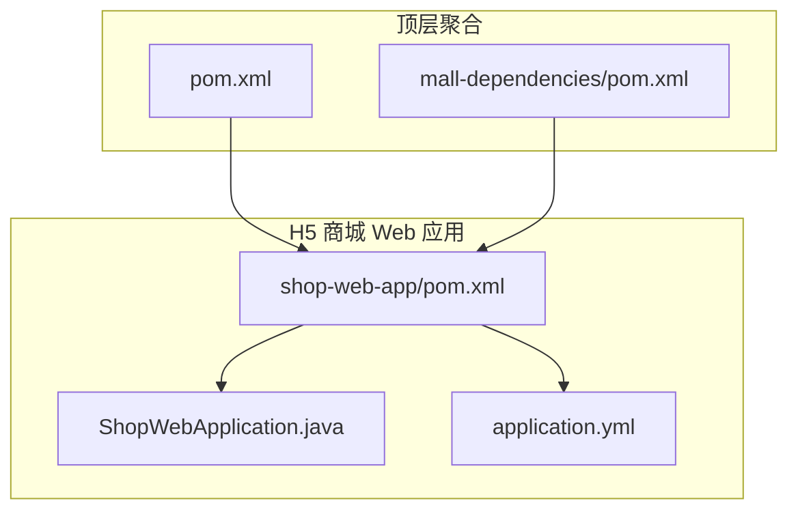
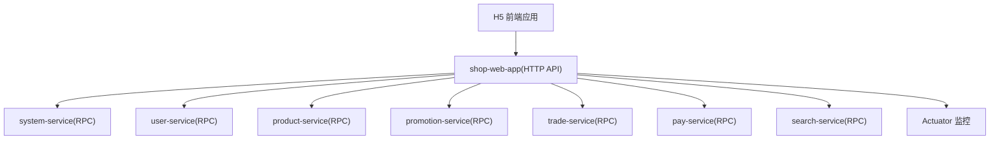
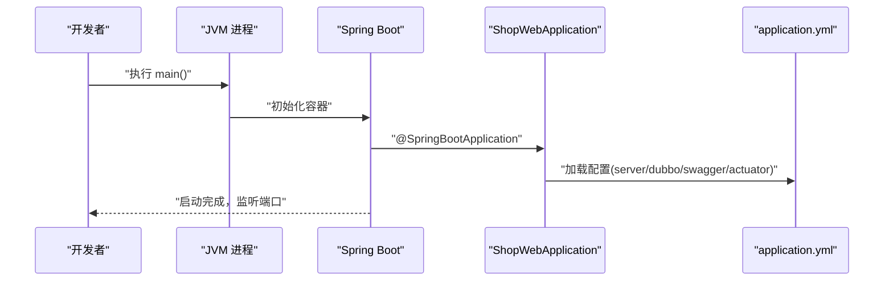
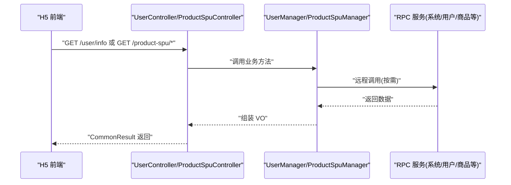
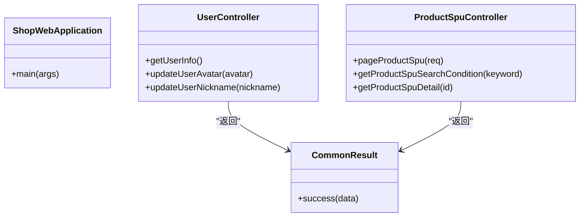
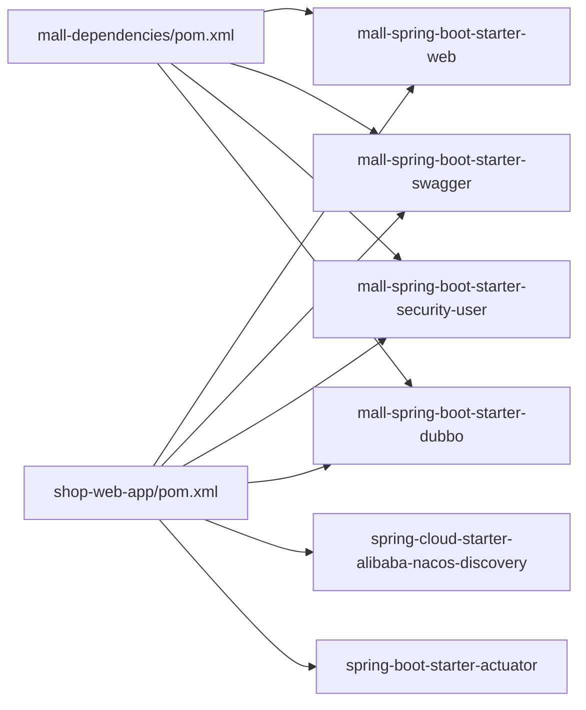

# 商城应用概览

<cite>
**本文引用的文件**
- [README.md](file://README.md)
- [pom.xml](file://pom.xml)
- [mall-dependencies/pom.xml](file://mall-dependencies/pom.xml)
- [shop-web-app/pom.xml](file://shop-web-app/pom.xml)
- [shop-web-app/src/main/java/cn/iocoder/mall/shopweb/ShopWebApplication.java](file://shop-web-app/src/main/java/cn/iocoder/mall/shopweb/ShopWebApplication.java)
- [shop-web-app/src/main/resources/application.yml](file://shop-web-app/src/main/resources/application.yml)
- [docs/setup/quick-start.md](file://docs/setup/quick-start.md)
- [common/mall-spring-boot-starter-web/pom.xml](file://common/mall-spring-boot-starter-web/pom.xml)
- [common/mall-spring-boot-starter-dubbo/pom.xml](file://common/mall-spring-boot-starter-dubbo/pom.xml)
- [common/mall-spring-boot-starter-security-user/pom.xml](file://common/mall-spring-boot-starter-security-user/pom.xml)
- [common/mall-spring-boot-starter-swagger/pom.xml](file://common/mall-spring-boot-starter-swagger/pom.xml)
- [shop-web-app/src/main/java/cn/iocoder/mall/shopweb/controller/product/ProductSpuController.java](file://shop-web-app/src/main/java/cn/iocoder/mall/shopweb/controller/product/ProductSpuController.java)
- [shop-web-app/src/main/java/cn/iocoder/mall/shopweb/controller/user/UserController.java](file://shop-web-app/src/main/java/cn/iocoder/mall/shopweb/controller/user/UserController.java)
</cite>

## 目录
1. [引言](#引言)
2. [项目结构](#项目结构)
3. [核心组件](#核心组件)
4. [架构总览](#架构总览)
5. [详细组件分析](#详细组件分析)
6. [依赖分析](#依赖分析)
7. [性能考虑](#性能考虑)
8. [故障排查指南](#故障排查指南)
9. [结论](#结论)
10. [附录](#附录)

## 引言
本文件面向“H5 商城应用”（shop-web-app），提供从架构设计、技术选型、启动流程、配置参数、运行环境到部署与运维的全景式说明。该应用在微服务架构中承担“用户侧 H5 商城 HTTP API 网关”的角色，负责聚合用户相关的业务接口并调用后端各 RPC 服务（如用户、商品、营销、交易、支付、系统等）。通过统一的 Spring Boot 启动、自动装配与 Starter 机制，实现高内聚低耦合的服务编排。

## 项目结构
- 顶层聚合工程采用 Maven 多模块组织，包含公共基础模块（common）、依赖版本管理模块（mall-dependencies）、以及各业务域的 web/app/service 三层结构。
- shop-web-app 为对外提供 HTTP API 的 Web 层模块，负责路由、鉴权、参数校验、调用 RPC 接口并返回结果。
- 依赖版本由 mall-dependencies 统一管理，确保各模块版本一致与可演进。

图表来源
- [pom.xml:16-28](file://pom.xml#L16-L28)
- [mall-dependencies/pom.xml:10-16](file://mall-dependencies/pom.xml#L10-L16)
- [shop-web-app/pom.xml:15-26](file://shop-web-app/pom.xml#L15-L26)
- [shop-web-app/src/main/java/cn/iocoder/mall/shopweb/ShopWebApplication.java:6-11](file://shop-web-app/src/main/java/cn/iocoder/mall/shopweb/ShopWebApplication.java#L6-L11)
- [shop-web-app/src/main/resources/application.yml:2-6](file://shop-web-app/src/main/resources/application.yml#L2-L6)

章节来源
- [pom.xml:16-28](file://pom.xml#L16-L28)
- [mall-dependencies/pom.xml:10-16](file://mall-dependencies/pom.xml#L10-L16)
- [shop-web-app/pom.xml:15-26](file://shop-web-app/pom.xml#L15-L26)

## 核心组件
- Spring Boot 启动入口：ShopWebApplication，标准注解驱动的主类，负责加载自动配置与扫描组件。
- Web 层 Starter：mall-spring-boot-starter-web，封装 Web、配置处理器、JSON 工具等依赖，统一 Web 层能力。
- 安全 Starter：mall-spring-boot-starter-security-user，提供用户鉴权注解与拦截器能力，结合系统服务进行安全控制。
- RPC 调用：mall-spring-boot-starter-dubbo，提供 Dubbo 自动装配与过滤器、集群拦截器等能力，支撑对后端各服务的远程调用。
- 文档：mall-spring-boot-starter-swagger，集成 Knife4j，提供在线接口文档。
- 配置：application.yml，集中定义服务器端口、上下文路径、Dubbo 消费者超时与版本、Swagger 基础包、Actuator 独立端口与暴露策略等。

章节来源
- [shop-web-app/src/main/java/cn/iocoder/mall/shopweb/ShopWebApplication.java:6-11](file://shop-web-app/src/main/java/cn/iocoder/mall/shopweb/ShopWebApplication.java#L6-L11)
- [common/mall-spring-boot-starter-web/pom.xml:14-48](file://common/mall-spring-boot-starter-web/pom.xml#L14-L48)
- [common/mall-spring-boot-starter-security-user/pom.xml:14-45](file://common/mall-spring-boot-starter-security-user/pom.xml#L14-L45)
- [common/mall-spring-boot-starter-dubbo/pom.xml:14-51](file://common/mall-spring-boot-starter-dubbo/pom.xml#L14-L51)
- [common/mall-spring-boot-starter-swagger/pom.xml:14-31](file://common/mall-spring-boot-starter-swagger/pom.xml#L14-L31)
- [shop-web-app/src/main/resources/application.yml:2-6](file://shop-web-app/src/main/resources/application.yml#L2-L6)
- [shop-web-app/src/main/resources/application.yml:19-64](file://shop-web-app/src/main/resources/application.yml#L19-L64)
- [shop-web-app/src/main/resources/application.yml:66-76](file://shop-web-app/src/main/resources/application.yml#L66-L76)

## 架构总览
H5 商城应用在微服务架构中的定位：
- 作为“用户侧 H5 平台”的 HTTP 服务，提供商品浏览、用户信息、订单与支付等前端所需接口。
- 通过 Dubbo 消费者调用后端系统服务（system-service）、用户服务（user-service）、商品服务（product-service）、营销服务（promotion-service）、交易服务（trade-service）、支付服务（pay-service）、搜索服务（search-service）等。
- 通过 Actuator 对外暴露监控端点，便于运维观测。

图表来源
- [README.md:109-126](file://README.md#L109-L126)
- [shop-web-app/src/main/resources/application.yml:19-64](file://shop-web-app/src/main/resources/application.yml#L19-L64)
- [shop-web-app/pom.xml:45-92](file://shop-web-app/pom.xml#L45-L92)

章节来源
- [README.md:109-126](file://README.md#L109-L126)
- [shop-web-app/pom.xml:45-92](file://shop-web-app/pom.xml#L45-L92)

## 详细组件分析

### 启动流程与配置参数
- 启动入口：ShopWebApplication.main() 触发 Spring Boot 自动装配。
- 服务器配置：端口、上下文路径、静态资源路径等。
- Dubbo 消费者：超时、参数校验、订阅的应用列表、各 RPC 接口的版本号。
- Swagger：标题、描述、版本、基础包。
- Actuator：独立端口与监控端点暴露策略。

图表来源
- [shop-web-app/src/main/java/cn/iocoder/mall/shopweb/ShopWebApplication.java:6-11](file://shop-web-app/src/main/java/cn/iocoder/mall/shopweb/ShopWebApplication.java#L6-L11)
- [shop-web-app/src/main/resources/application.yml:2-6](file://shop-web-app/src/main/resources/application.yml#L2-L6)
- [shop-web-app/src/main/resources/application.yml:19-64](file://shop-web-app/src/main/resources/application.yml#L19-L64)
- [shop-web-app/src/main/resources/application.yml:66-76](file://shop-web-app/src/main/resources/application.yml#L66-L76)

章节来源
- [shop-web-app/src/main/java/cn/iocoder/mall/shopweb/ShopWebApplication.java:6-11](file://shop-web-app/src/main/java/cn/iocoder/mall/shopweb/ShopWebApplication.java#L6-L11)
- [shop-web-app/src/main/resources/application.yml:2-6](file://shop-web-app/src/main/resources/application.yml#L2-L6)
- [shop-web-app/src/main/resources/application.yml:19-64](file://shop-web-app/src/main/resources/application.yml#L19-L64)
- [shop-web-app/src/main/resources/application.yml:66-76](file://shop-web-app/src/main/resources/application.yml#L66-L76)

### 控制器与业务交互（示例）
- 商品 SPU 控制器：提供分页查询、搜索条件、详情等接口，内部委托给 Manager 层处理并调用 RPC 服务。
- 用户控制器：提供用户信息、更新头像、更新昵称等接口，结合鉴权注解与上下文获取当前用户 ID。

图表来源
- [shop-web-app/src/main/java/cn/iocoder/mall/shopweb/controller/user/UserController.java:24-30](file://shop-web-app/src/main/java/cn/iocoder/mall/shopweb/controller/user/UserController.java#L24-L30)
- [shop-web-app/src/main/java/cn/iocoder/mall/shopweb/controller/product/ProductSpuController.java:31-35](file://shop-web-app/src/main/java/cn/iocoder/mall/shopweb/controller/product/ProductSpuController.java#L31-L35)

章节来源
- [shop-web-app/src/main/java/cn/iocoder/mall/shopweb/controller/user/UserController.java:24-30](file://shop-web-app/src/main/java/cn/iocoder/mall/shopweb/controller/user/UserController.java#L24-L30)
- [shop-web-app/src/main/java/cn/iocoder/mall/shopweb/controller/product/ProductSpuController.java:31-35](file://shop-web-app/src/main/java/cn/iocoder/mall/shopweb/controller/product/ProductSpuController.java#L31-L35)

### 类关系与依赖（代码级）

图表来源
- [shop-web-app/src/main/java/cn/iocoder/mall/shopweb/ShopWebApplication.java:6-11](file://shop-web-app/src/main/java/cn/iocoder/mall/shopweb/ShopWebApplication.java#L6-L11)
- [shop-web-app/src/main/java/cn/iocoder/mall/shopweb/controller/user/UserController.java:24-48](file://shop-web-app/src/main/java/cn/iocoder/mall/shopweb/controller/user/UserController.java#L24-L48)
- [shop-web-app/src/main/java/cn/iocoder/mall/shopweb/controller/product/ProductSpuController.java:31-49](file://shop-web-app/src/main/java/cn/iocoder/mall/shopweb/controller/product/ProductSpuController.java#L31-L49)

## 依赖分析
- 依赖版本管理：mall-dependencies 通过 dependencyManagement 统一管理 Spring Boot、Spring Cloud、Spring Cloud Alibaba、Dubbo、MyBatis/Plus、RocketMQ、XXL-Job、SkyWalking、Sentry、MapStruct、Lombok 等版本。
- shop-web-app 依赖：
  - Web/Starter：mall-spring-boot-starter-web、mall-spring-boot-starter-swagger、mall-spring-boot-starter-security-user
  - RPC：mall-spring-boot-starter-dubbo
  - 注册发现：spring-cloud-starter-alibaba-nacos-discovery
  - 监控：spring-boot-starter-actuator
  - 工具：lombok、mapstruct/mapstruct-jdk8

图表来源
- [mall-dependencies/pom.xml:70-384](file://mall-dependencies/pom.xml#L70-L384)
- [shop-web-app/pom.xml:28-121](file://shop-web-app/pom.xml#L28-L121)

章节来源
- [mall-dependencies/pom.xml:70-384](file://mall-dependencies/pom.xml#L70-L384)
- [shop-web-app/pom.xml:28-121](file://shop-web-app/pom.xml#L28-L121)

## 性能考虑
- 启动与打包：顶层 pom 配置了 spring-boot-maven-plugin 与 fork=true，提升打包与启动效率。
- RPC 调用：通过 Dubbo 消费者超时与参数校验，避免慢调用拖垮接口响应；按需订阅服务，减少网络开销。
- 监控：Actuator 暴露指标端点，结合外部监控系统进行性能观测与告警。
- 缓存与限流：项目规划引入 Sentinel 与 Redis/Redisson，建议在业务成熟阶段逐步落地。

章节来源
- [pom.xml:65-72](file://pom.xml#L65-L72)
- [shop-web-app/src/main/resources/application.yml:25-27](file://shop-web-app/src/main/resources/application.yml#L25-L27)
- [README.md:163-167](file://README.md#L163-L167)

## 故障排查指南
- 启动失败
  - 检查 application.yml 的端口占用与上下文路径配置。
  - 确认 Dubbo 注册中心（Zookeeper/Nacos）连通性与订阅列表。
  - 查看 Actuator 端点是否正常暴露，便于诊断健康状态。
- 接口异常
  - 关注 Swagger 文档定位接口，确认请求参数与鉴权头是否正确。
  - 检查各 RPC 服务是否正常启动与暴露。
- 环境问题
  - 参考快速开始文档，核对数据库、消息队列、注册中心、定时任务等中间件配置。

章节来源
- [shop-web-app/src/main/resources/application.yml:2-6](file://shop-web-app/src/main/resources/application.yml#L2-L6)
- [shop-web-app/src/main/resources/application.yml:19-64](file://shop-web-app/src/main/resources/application.yml#L19-L64)
- [shop-web-app/src/main/resources/application.yml:73-76](file://shop-web-app/src/main/resources/application.yml#L73-L76)
- [docs/setup/quick-start.md:150-167](file://docs/setup/quick-start.md#L150-L167)

## 结论
H5 商城应用以 Spring Boot 为核心，借助 Starter 与依赖管理模块，实现了清晰的分层与可扩展的微服务接入。通过 Dubbo 消费者与 Actuator 监控，既能满足用户侧高频接口的稳定性，也为后续引入缓存、限流、配置中心等能力预留了空间。配合统一的版本管理与规范化的模块划分，具备良好的可维护性与演进弹性。

## 附录
- 快速开始与环境准备：参考快速开始文档，按步骤安装 JDK/Maven/IDE、MySQL、Zookeeper、RocketMQ、Elasticsearch 等，并按顺序启动后端服务。
- 运行与访问：应用默认端口与上下文路径见配置文件；接口文档可通过 Swagger 访问。

章节来源
- [docs/setup/quick-start.md:9-191](file://docs/setup/quick-start.md#L9-L191)
- [shop-web-app/src/main/resources/application.yml:2-6](file://shop-web-app/src/main/resources/application.yml#L2-L6)