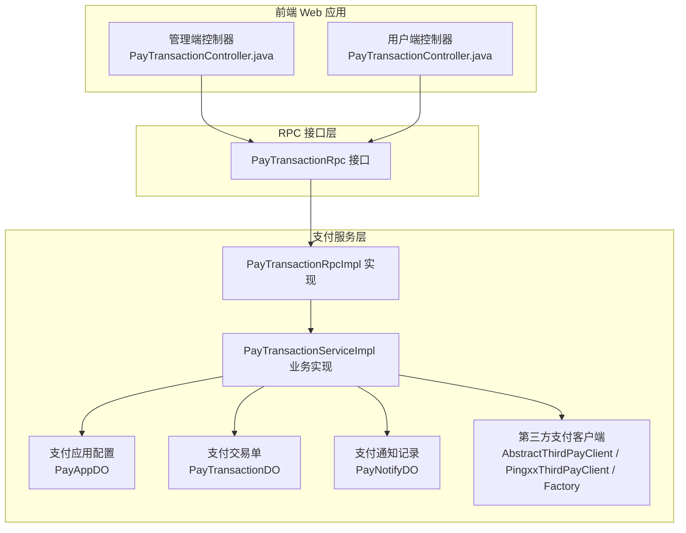
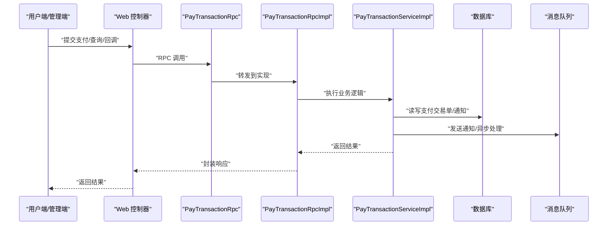
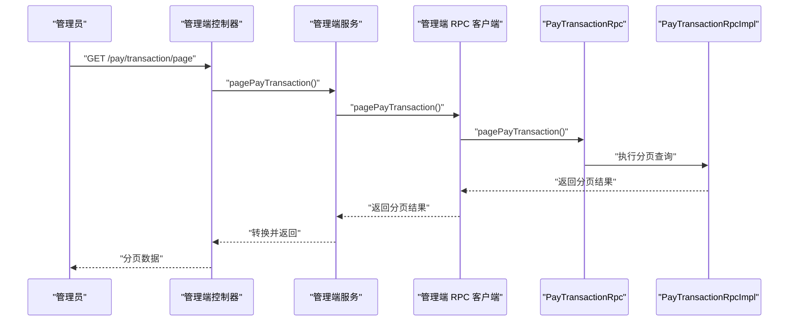
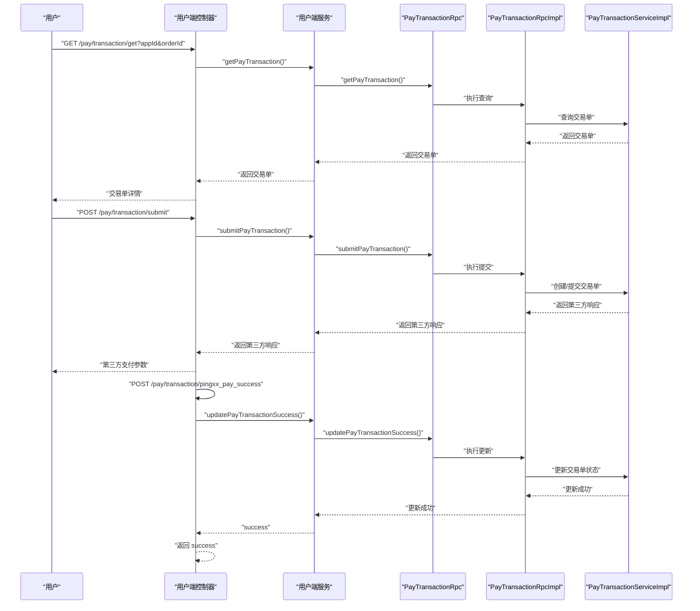
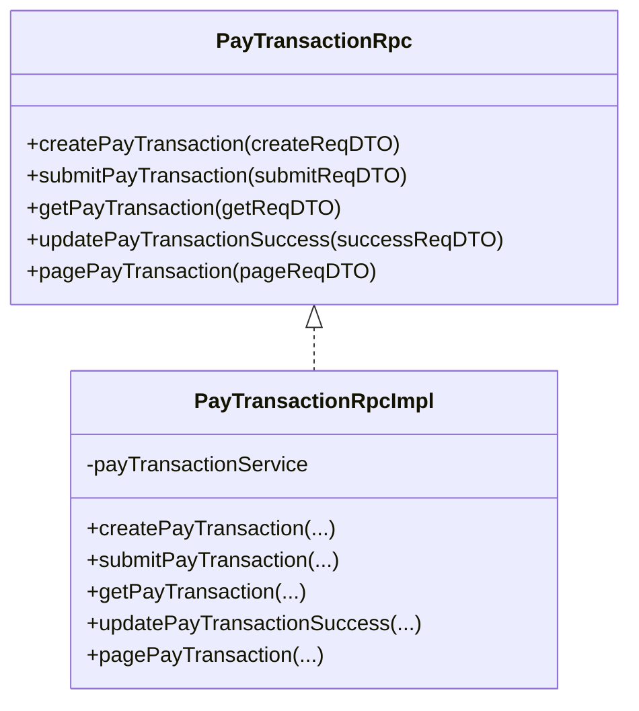
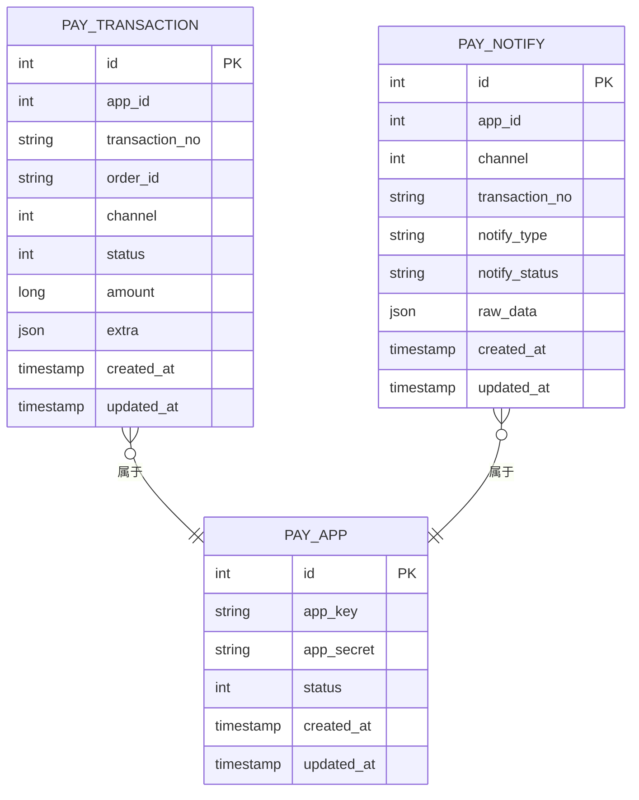
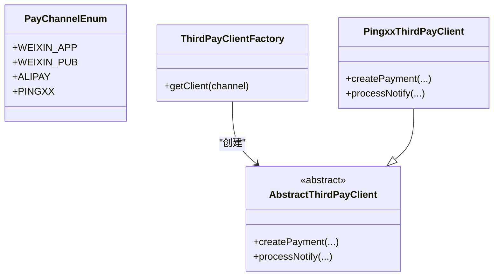
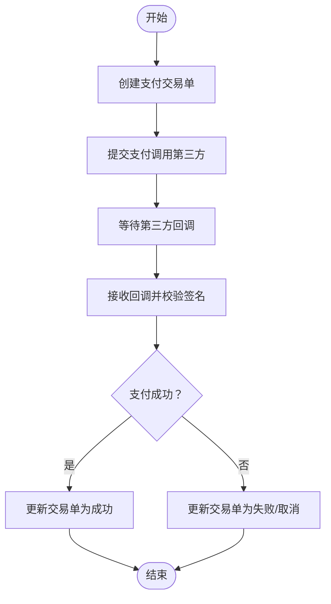
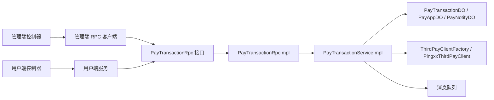

# 支付模块

<cite>
**本文引用的文件**
- [management-web-app/src/main/java/cn/iocoder/mall/managementweb/controller/pay/PayTransactionController.java](file://management-web-app/src/main/java/cn/iocoder/mall/managementweb/controller/pay/PayTransactionController.java)
- [management-web-app/src/main/java/cn/iocoder/mall/managementweb/service/pay/transaction/PayTransactionService.java](file://management-web-app/src/main/java/cn/iocoder/mall/managementweb/service/pay/transaction/PayTransactionService.java)
- [management-web-app/src/main/java/cn/iocoder/mall/managementweb/client/pay/transaction/PayTransactionClient.java](file://management-web-app/src/main/java/cn/iocoder/mall/managementweb/client/pay/transaction/PayTransactionClient.java)
- [shop-web-app/src/main/java/cn/iocoder/mall/shopweb/controller/pay/PayTransactionController.java](file://shop-web-app/src/main/java/cn/iocoder/mall/shopweb/controller/pay/PayTransactionController.java)
- [pay-service-project/pay-service-api/src/main/java/cn/iocoder/mall/payservice/rpc/transaction/PayTransactionRpc.java](file://pay-service-project/pay-service-api/src/main/java/cn/iocoder/mall/payservice/rpc/transaction/PayTransactionRpc.java)
- [pay-service-project/pay-service-api/src/main/java/cn/iocoder/mall/payservice/enums/transaction/PayTransactionStatusEnum.java](file://pay-service-project/pay-service-api/src/main/java/cn/iocoder/mall/payservice/enums/transaction/PayTransactionStatusEnum.java)
- [pay-service-project/pay-service-api/src/main/java/cn/iocoder/mall/payservice/enums/PayChannelEnum.java](file://pay-service-project/pay-service-api/src/main/java/cn/iocoder/mall/payservice/enums/PayChannelEnum.java)
- [pay-service-project/pay-service-app/src/main/java/cn/iocoder/mall/payservice/rpc/transaction/PayTransactionRpcImpl.java](file://pay-service-project/pay-service-app/src/main/java/cn/iocoder/mall/payservice/rpc/transaction/PayTransactionRpcImpl.java)
- [pay-service-project/pay-service-app/src/main/resources/mapper/PayTransactionMapper.xml](file://pay-service-project/pay-service-app/src/main/resources/mapper/PayTransactionMapper.xml)
- [pay-service-project/pay-service-app/src/main/java/cn/iocoder/mall/payservice/client/thirdpay/AbstractThirdPayClient.java](file://pay-service-project/pay-service-app/src/main/java/cn/iocoder/mall/payservice/client/thirdpay/AbstractThirdPayClient.java)
- [pay-service-project/pay-service-app/src/main/java/cn/iocoder/mall/payservice/client/thirdpay/PingxxThirdPayClient.java](file://pay-service-project/pay-service-app/src/main/java/cn/iocoder/mall/payservice/client/thirdpay/PingxxThirdPayClient.java)
- [pay-service-project/pay-service-app/src/main/java/cn/iocoder/mall/payservice/client/thirdpay/ThirdPayClientFactory.java](file://pay-service-project/pay-service-app/src/main/java/cn/iocoder/mall/payservice/client/thirdpay/ThirdPayClientFactory.java)
- [pay-service-project/pay-service-app/src/main/java/cn/iocoder/mall/payservice/dal/mysql/dataobject/transaction/PayTransactionDO.java](file://pay-service-project/pay-service-app/src/main/java/cn/iocoder/mall/payservice/dal/mysql/dataobject/transaction/PayTransactionDO.java)
- [pay-service-project/pay-service-app/src/main/java/cn/iocoder/mall/payservice/dal/mysql/dataobject/notify/PayNotifyDO.java](file://pay-service-project/pay-service-app/src/main/java/cn/iocoder/mall/payservice/dal/mysql/dataobject/notify/PayNotifyDO.java)
- [pay-service-project/pay-service-app/src/main/java/cn/iocoder/mall/payservice/dal/mysql/dataobject/app/PayAppDO.java](file://pay-service-project/pay-service-app/src/main/java/cn/iocoder/mall/payservice/dal/mysql/dataobject/app/PayAppDO.java)
- [pay-service-project/pay-service-app/src/main/java/cn/iocoder/mall/payservice/service/transaction/PayTransactionServiceImpl.java](file://pay-service-project/pay-service-app/src/main/java/cn/iocoder/mall/payservice/service/transaction/PayTransactionServiceImpl.java)
- [pay-service-project/pay-service-app/src/main/java/cn/iocoder/mall/payservice/service/notify/PayNotifyServiceImpl.java](file://pay-service-project/pay-service-app/src/main/java/cn/iocoder/mall/payservice/service/notify/PayNotifyServiceImpl.java)
- [pay-service-project/pay-service-app/src/main/java/cn/iocoder/mall/payservice/mq/consumer/PayNotifyConsumer.java](file://pay-service-project/pay-service-app/src/main/java/cn/iocoder/mall/payservice/mq/consumer/PayNotifyConsumer.java)
- [pay-service-project/pay-service-app/src/main/java/cn/iocoder/mall/payservice/mq/producer/PayNotifyProducer.java](file://pay-service-project/pay-service-app/src/main/java/cn/iocoder/mall/payservice/mq/producer/PayNotifyProducer.java)
</cite>

## 目录
1. [简介](#简介)
2. [项目结构](#项目结构)
3. [核心组件](#核心组件)
4. [架构总览](#架构总览)
5. [组件详解](#组件详解)
6. [依赖关系分析](#依赖关系分析)
7. [性能与扩展性](#性能与扩展性)
8. [故障排查指南](#故障排查指南)
9. [结论](#结论)
10. [附录](#附录)

## 简介
本技术文档围绕支付模块展开，系统性阐述支付流程与交易处理的核心能力，包括支付订单创建、支付方式选择、支付状态查询、第三方支付集成与回调处理等。重点解析前端 Web 应用（管理端与用户端）与支付服务之间的接口设计、RPC 调用链路、支付通道配置与安全校验机制，并给出完整的使用指南与开发调试方法。

## 项目结构
支付模块由三层构成：
- 前端 Web 层：管理端与用户端分别提供支付交易查询、提交与回调入口。
- RPC 接口层：定义支付交易单的创建、提交、查询、更新成功状态与分页等接口。
- 支付服务层：实现支付交易单业务逻辑、对接第三方支付通道、处理回调与通知。

图表来源
- [management-web-app/src/main/java/cn/iocoder/mall/managementweb/controller/pay/PayTransactionController.java:1-39](file://management-web-app/src/main/java/cn/iocoder/mall/managementweb/controller/pay/PayTransactionController.java#L1-L39)
- [shop-web-app/src/main/java/cn/iocoder/mall/shopweb/controller/pay/PayTransactionController.java:1-82](file://shop-web-app/src/main/java/cn/iocoder/mall/shopweb/controller/pay/PayTransactionController.java#L1-L82)
- [pay-service-project/pay-service-api/src/main/java/cn/iocoder/mall/payservice/rpc/transaction/PayTransactionRpc.java:1-53](file://pay-service-project/pay-service-api/src/main/java/cn/iocoder/mall/payservice/rpc/transaction/PayTransactionRpc.java#L1-L53)
- [pay-service-project/pay-service-app/src/main/java/cn/iocoder/mall/payservice/rpc/transaction/PayTransactionRpcImpl.java](file://pay-service-project/pay-service-app/src/main/java/cn/iocoder/mall/payservice/rpc/transaction/PayTransactionRpcImpl.java)
- [pay-service-project/pay-service-app/src/main/java/cn/iocoder/mall/payservice/service/transaction/PayTransactionServiceImpl.java](file://pay-service-project/pay-service-app/src/main/java/cn/iocoder/mall/payservice/service/transaction/PayTransactionServiceImpl.java)
- [pay-service-project/pay-service-app/src/main/java/cn/iocoder/mall/payservice/dal/mysql/dataobject/transaction/PayTransactionDO.java](file://pay-service-project/pay-service-app/src/main/java/cn/iocoder/mall/payservice/dal/mysql/dataobject/transaction/PayTransactionDO.java)
- [pay-service-project/pay-service-app/src/main/java/cn/iocoder/mall/payservice/dal/mysql/dataobject/app/PayAppDO.java](file://pay-service-project/pay-service-app/src/main/java/cn/iocoder/mall/payservice/dal/mysql/dataobject/app/PayAppDO.java)
- [pay-service-project/pay-service-app/src/main/java/cn/iocoder/mall/payservice/dal/mysql/dataobject/notify/PayNotifyDO.java](file://pay-service-project/pay-service-app/src/main/java/cn/iocoder/mall/payservice/dal/mysql/dataobject/notify/PayNotifyDO.java)
- [pay-service-project/pay-service-app/src/main/java/cn/iocoder/mall/payservice/client/thirdpay/AbstractThirdPayClient.java](file://pay-service-project/pay-service-app/src/main/java/cn/iocoder/mall/payservice/client/thirdpay/AbstractThirdPayClient.java)
- [pay-service-project/pay-service-app/src/main/java/cn/iocoder/mall/payservice/client/thirdpay/PingxxThirdPayClient.java](file://pay-service-project/pay-service-app/src/main/java/cn/iocoder/mall/payservice/client/thirdpay/PingxxThirdPayClient.java)
- [pay-service-project/pay-service-app/src/main/java/cn/iocoder/mall/payservice/client/thirdpay/ThirdPayClientFactory.java](file://pay-service-project/pay-service-app/src/main/java/cn/iocoder/mall/payservice/client/thirdpay/ThirdPayClientFactory.java)

章节来源
- [management-web-app/src/main/java/cn/iocoder/mall/managementweb/controller/pay/PayTransactionController.java:1-39](file://management-web-app/src/main/java/cn/iocoder/mall/managementweb/controller/pay/PayTransactionController.java#L1-L39)
- [shop-web-app/src/main/java/cn/iocoder/mall/shopweb/controller/pay/PayTransactionController.java:1-82](file://shop-web-app/src/main/java/cn/iocoder/mall/shopweb/controller/pay/PayTransactionController.java#L1-L82)
- [pay-service-project/pay-service-api/src/main/java/cn/iocoder/mall/payservice/rpc/transaction/PayTransactionRpc.java:1-53](file://pay-service-project/pay-service-api/src/main/java/cn/iocoder/mall/payservice/rpc/transaction/PayTransactionRpc.java#L1-L53)

## 核心组件
- 管理端控制器：提供支付交易单分页查询接口，供后台管理使用。
- 用户端控制器：提供支付交易查询、提交支付、接收第三方回调等接口。
- RPC 接口：统一定义支付交易单的创建、提交、查询、更新成功状态与分页。
- 支付服务实现：负责业务编排、持久化、第三方支付通道对接与回调处理。
- 数据模型：支付交易单、应用配置、通知记录等核心实体。
- 第三方支付客户端：抽象出统一的第三方支付客户端接口与具体实现工厂。

章节来源
- [management-web-app/src/main/java/cn/iocoder/mall/managementweb/controller/pay/PayTransactionController.java:1-39](file://management-web-app/src/main/java/cn/iocoder/mall/managementweb/controller/pay/PayTransactionController.java#L1-L39)
- [shop-web-app/src/main/java/cn/iocoder/mall/shopweb/controller/pay/PayTransactionController.java:1-82](file://shop-web-app/src/main/java/cn/iocoder/mall/shopweb/controller/pay/PayTransactionController.java#L1-L82)
- [pay-service-project/pay-service-api/src/main/java/cn/iocoder/mall/payservice/rpc/transaction/PayTransactionRpc.java:1-53](file://pay-service-project/pay-service-api/src/main/java/cn/iocoder/mall/payservice/rpc/transaction/PayTransactionRpc.java#L1-L53)
- [pay-service-project/pay-service-app/src/main/java/cn/iocoder/mall/payservice/service/transaction/PayTransactionServiceImpl.java](file://pay-service-project/pay-service-app/src/main/java/cn/iocoder/mall/payservice/service/transaction/PayTransactionServiceImpl.java)
- [pay-service-project/pay-service-app/src/main/java/cn/iocoder/mall/payservice/dal/mysql/dataobject/transaction/PayTransactionDO.java](file://pay-service-project/pay-service-app/src/main/java/cn/iocoder/mall/payservice/dal/mysql/dataobject/transaction/PayTransactionDO.java)
- [pay-service-project/pay-service-app/src/main/java/cn/iocoder/mall/payservice/client/thirdpay/ThirdPayClientFactory.java](file://pay-service-project/pay-service-app/src/main/java/cn/iocoder/mall/payservice/client/thirdpay/ThirdPayClientFactory.java)

## 架构总览
支付模块采用前后端分离与 RPC 调用的分层架构。前端 Web 应用通过 Dubbo RPC 调用支付服务层，服务层内部完成支付交易单的创建、提交、状态更新与第三方回调处理，并通过数据库与消息队列保障一致性与可追溯性。

图表来源
- [shop-web-app/src/main/java/cn/iocoder/mall/shopweb/controller/pay/PayTransactionController.java:1-82](file://shop-web-app/src/main/java/cn/iocoder/mall/shopweb/controller/pay/PayTransactionController.java#L1-L82)
- [pay-service-project/pay-service-api/src/main/java/cn/iocoder/mall/payservice/rpc/transaction/PayTransactionRpc.java:1-53](file://pay-service-project/pay-service-api/src/main/java/cn/iocoder/mall/payservice/rpc/transaction/PayTransactionRpc.java#L1-L53)
- [pay-service-project/pay-service-app/src/main/java/cn/iocoder/mall/payservice/rpc/transaction/PayTransactionRpcImpl.java](file://pay-service-project/pay-service-app/src/main/java/cn/iocoder/mall/payservice/rpc/transaction/PayTransactionRpcImpl.java)
- [pay-service-project/pay-service-app/src/main/java/cn/iocoder/mall/payservice/service/transaction/PayTransactionServiceImpl.java](file://pay-service-project/pay-service-app/src/main/java/cn/iocoder/mall/payservice/service/transaction/PayTransactionServiceImpl.java)

## 组件详解

### 管理端支付交易控制器
- 职责：提供支付交易单分页查询接口，权限控制为“pay:transaction:page”。
- 典型流程：接收分页请求参数，调用服务层获取分页结果并返回。

图表来源
- [management-web-app/src/main/java/cn/iocoder/mall/managementweb/controller/pay/PayTransactionController.java:1-39](file://management-web-app/src/main/java/cn/iocoder/mall/managementweb/controller/pay/PayTransactionController.java#L1-L39)
- [management-web-app/src/main/java/cn/iocoder/mall/managementweb/service/pay/transaction/PayTransactionService.java:1-30](file://management-web-app/src/main/java/cn/iocoder/mall/managementweb/service/pay/transaction/PayTransactionService.java#L1-L30)
- [management-web-app/src/main/java/cn/iocoder/mall/managementweb/client/pay/transaction/PayTransactionClient.java:1-24](file://management-web-app/src/main/java/cn/iocoder/mall/managementweb/client/pay/transaction/PayTransactionClient.java#L1-L24)
- [pay-service-project/pay-service-api/src/main/java/cn/iocoder/mall/payservice/rpc/transaction/PayTransactionRpc.java:1-53](file://pay-service-project/pay-service-api/src/main/java/cn/iocoder/mall/payservice/rpc/transaction/PayTransactionRpc.java#L1-L53)

章节来源
- [management-web-app/src/main/java/cn/iocoder/mall/managementweb/controller/pay/PayTransactionController.java:1-39](file://management-web-app/src/main/java/cn/iocoder/mall/managementweb/controller/pay/PayTransactionController.java#L1-L39)
- [management-web-app/src/main/java/cn/iocoder/mall/managementweb/service/pay/transaction/PayTransactionService.java:1-30](file://management-web-app/src/main/java/cn/iocoder/mall/managementweb/service/pay/transaction/PayTransactionService.java#L1-L30)
- [management-web-app/src/main/java/cn/iocoder/mall/managementweb/client/pay/transaction/PayTransactionClient.java:1-24](file://management-web-app/src/main/java/cn/iocoder/mall/managementweb/client/pay/transaction/PayTransactionClient.java#L1-L24)

### 用户端支付交易控制器
- 支付查询：根据应用编号与订单号查询支付交易。
- 支付提交：接收提交请求，记录客户端 IP，调用服务层发起支付。
- 回调处理：接收第三方回调（如 Pingxx），解析回调内容并更新支付状态。

图表来源
- [shop-web-app/src/main/java/cn/iocoder/mall/shopweb/controller/pay/PayTransactionController.java:1-82](file://shop-web-app/src/main/java/cn/iocoder/mall/shopweb/controller/pay/PayTransactionController.java#L1-L82)
- [pay-service-project/pay-service-api/src/main/java/cn/iocoder/mall/payservice/rpc/transaction/PayTransactionRpc.java:1-53](file://pay-service-project/pay-service-api/src/main/java/cn/iocoder/mall/payservice/rpc/transaction/PayTransactionRpc.java#L1-L53)
- [pay-service-project/pay-service-app/src/main/java/cn/iocoder/mall/payservice/rpc/transaction/PayTransactionRpcImpl.java](file://pay-service-project/pay-service-app/src/main/java/cn/iocoder/mall/payservice/rpc/transaction/PayTransactionRpcImpl.java)
- [pay-service-project/pay-service-app/src/main/java/cn/iocoder/mall/payservice/service/transaction/PayTransactionServiceImpl.java](file://pay-service-project/pay-service-app/src/main/java/cn/iocoder/mall/payservice/service/transaction/PayTransactionServiceImpl.java)

章节来源
- [shop-web-app/src/main/java/cn/iocoder/mall/shopweb/controller/pay/PayTransactionController.java:1-82](file://shop-web-app/src/main/java/cn/iocoder/mall/shopweb/controller/pay/PayTransactionController.java#L1-L82)

### 支付服务 RPC 接口与实现
- 接口职责：定义创建、提交、查询、更新成功状态与分页等 RPC 方法。
- 实现职责：将 DTO 转换为 DO，调用业务服务，持久化与异步处理。

图表来源
- [pay-service-project/pay-service-api/src/main/java/cn/iocoder/mall/payservice/rpc/transaction/PayTransactionRpc.java:1-53](file://pay-service-project/pay-service-api/src/main/java/cn/iocoder/mall/payservice/rpc/transaction/PayTransactionRpc.java#L1-L53)
- [pay-service-project/pay-service-app/src/main/java/cn/iocoder/mall/payservice/rpc/transaction/PayTransactionRpcImpl.java](file://pay-service-project/pay-service-app/src/main/java/cn/iocoder/mall/payservice/rpc/transaction/PayTransactionRpcImpl.java)

章节来源
- [pay-service-project/pay-service-api/src/main/java/cn/iocoder/mall/payservice/rpc/transaction/PayTransactionRpc.java:1-53](file://pay-service-project/pay-service-api/src/main/java/cn/iocoder/mall/payservice/rpc/transaction/PayTransactionRpc.java#L1-L53)
- [pay-service-project/pay-service-app/src/main/java/cn/iocoder/mall/payservice/rpc/transaction/PayTransactionRpcImpl.java](file://pay-service-project/pay-service-app/src/main/java/cn/iocoder/mall/payservice/rpc/transaction/PayTransactionRpcImpl.java)

### 支付数据模型与状态管理
- 支付交易单：记录交易单号、应用编号、订单号、金额、支付渠道、状态等。
- 支付应用：记录应用的支付配置信息。
- 支付通知：记录第三方回调通知的原始内容与处理状态。
- 状态枚举：定义支付交易单的状态（等待支付、支付成功、取消支付）。

图表来源
- [pay-service-project/pay-service-app/src/main/java/cn/iocoder/mall/payservice/dal/mysql/dataobject/transaction/PayTransactionDO.java](file://pay-service-project/pay-service-app/src/main/java/cn/iocoder/mall/payservice/dal/mysql/dataobject/transaction/PayTransactionDO.java)
- [pay-service-project/pay-service-app/src/main/java/cn/iocoder/mall/payservice/dal/mysql/dataobject/app/PayAppDO.java](file://pay-service-project/pay-service-app/src/main/java/cn/iocoder/mall/payservice/dal/mysql/dataobject/app/PayAppDO.java)
- [pay-service-project/pay-service-app/src/main/java/cn/iocoder/mall/payservice/dal/mysql/dataobject/notify/PayNotifyDO.java](file://pay-service-project/pay-service-app/src/main/java/cn/iocoder/mall/payservice/dal/mysql/dataobject/notify/PayNotifyDO.java)
- [pay-service-project/pay-service-api/src/main/java/cn/iocoder/mall/payservice/enums/transaction/PayTransactionStatusEnum.java:1-31](file://pay-service-project/pay-service-api/src/main/java/cn/iocoder/mall/payservice/enums/transaction/PayTransactionStatusEnum.java#L1-L31)

章节来源
- [pay-service-project/pay-service-app/src/main/java/cn/iocoder/mall/payservice/dal/mysql/dataobject/transaction/PayTransactionDO.java](file://pay-service-project/pay-service-app/src/main/java/cn/iocoder/mall/payservice/dal/mysql/dataobject/transaction/PayTransactionDO.java)
- [pay-service-project/pay-service-app/src/main/java/cn/iocoder/mall/payservice/dal/mysql/dataobject/app/PayAppDO.java](file://pay-service-project/pay-service-app/src/main/java/cn/iocoder/mall/payservice/dal/mysql/dataobject/app/PayAppDO.java)
- [pay-service-project/pay-service-app/src/main/java/cn/iocoder/mall/payservice/dal/mysql/dataobject/notify/PayNotifyDO.java](file://pay-service-project/pay-service-app/src/main/java/cn/iocoder/mall/payservice/dal/mysql/dataobject/notify/PayNotifyDO.java)
- [pay-service-project/pay-service-api/src/main/java/cn/iocoder/mall/payservice/enums/transaction/PayTransactionStatusEnum.java:1-31](file://pay-service-project/pay-service-api/src/main/java/cn/iocoder/mall/payservice/enums/transaction/PayTransactionStatusEnum.java#L1-L31)

### 第三方支付集成与回调处理
- 支付通道枚举：定义支持的支付通道（如微信、支付宝、Pingxx）。
- 抽象客户端：定义第三方支付客户端的统一接口。
- Pingxx 客户端：实现 Pingxx 的支付与回调处理。
- 工厂模式：根据支付通道选择对应的第三方客户端。

图表来源
- [pay-service-project/pay-service-api/src/main/java/cn/iocoder/mall/payservice/enums/PayChannelEnum.java:1-59](file://pay-service-project/pay-service-api/src/main/java/cn/iocoder/mall/payservice/enums/PayChannelEnum.java#L1-L59)
- [pay-service-project/pay-service-app/src/main/java/cn/iocoder/mall/payservice/client/thirdpay/AbstractThirdPayClient.java](file://pay-service-project/pay-service-app/src/main/java/cn/iocoder/mall/payservice/client/thirdpay/AbstractThirdPayClient.java)
- [pay-service-project/pay-service-app/src/main/java/cn/iocoder/mall/payservice/client/thirdpay/PingxxThirdPayClient.java](file://pay-service-project/pay-service-app/src/main/java/cn/iocoder/mall/payservice/client/thirdpay/PingxxThirdPayClient.java)
- [pay-service-project/pay-service-app/src/main/java/cn/iocoder/mall/payservice/client/thirdpay/ThirdPayClientFactory.java](file://pay-service-project/pay-service-app/src/main/java/cn/iocoder/mall/payservice/client/thirdpay/ThirdPayClientFactory.java)

章节来源
- [pay-service-project/pay-service-api/src/main/java/cn/iocoder/mall/payservice/enums/PayChannelEnum.java:1-59](file://pay-service-project/pay-service-api/src/main/java/cn/iocoder/mall/payservice/enums/PayChannelEnum.java#L1-L59)
- [pay-service-project/pay-service-app/src/main/java/cn/iocoder/mall/payservice/client/thirdpay/AbstractThirdPayClient.java](file://pay-service-project/pay-service-app/src/main/java/cn/iocoder/mall/payservice/client/thirdpay/AbstractThirdPayClient.java)
- [pay-service-project/pay-service-app/src/main/java/cn/iocoder/mall/payservice/client/thirdpay/PingxxThirdPayClient.java](file://pay-service-project/pay-service-app/src/main/java/cn/iocoder/mall/payservice/client/thirdpay/PingxxThirdPayClient.java)
- [pay-service-project/pay-service-app/src/main/java/cn/iocoder/mall/payservice/client/thirdpay/ThirdPayClientFactory.java](file://pay-service-project/pay-service-app/src/main/java/cn/iocoder/mall/payservice/client/thirdpay/ThirdPayClientFactory.java)

### 支付流程与状态机
支付流程从创建到回调大致如下：

图表来源
- [pay-service-project/pay-service-api/src/main/java/cn/iocoder/mall/payservice/enums/transaction/PayTransactionStatusEnum.java:1-31](file://pay-service-project/pay-service-api/src/main/java/cn/iocoder/mall/payservice/enums/transaction/PayTransactionStatusEnum.java#L1-L31)
- [pay-service-project/pay-service-app/src/main/java/cn/iocoder/mall/payservice/service/transaction/PayTransactionServiceImpl.java](file://pay-service-project/pay-service-app/src/main/java/cn/iocoder/mall/payservice/service/transaction/PayTransactionServiceImpl.java)
- [pay-service-project/pay-service-app/src/main/java/cn/iocoder/mall/payservice/mq/consumer/PayNotifyConsumer.java](file://pay-service-project/pay-service-app/src/main/java/cn/iocoder/mall/payservice/mq/consumer/PayNotifyConsumer.java)

章节来源
- [pay-service-project/pay-service-api/src/main/java/cn/iocoder/mall/payservice/enums/transaction/PayTransactionStatusEnum.java:1-31](file://pay-service-project/pay-service-api/src/main/java/cn/iocoder/mall/payservice/enums/transaction/PayTransactionStatusEnum.java#L1-L31)
- [pay-service-project/pay-service-app/src/main/java/cn/iocoder/mall/payservice/service/transaction/PayTransactionServiceImpl.java](file://pay-service-project/pay-service-app/src/main/java/cn/iocoder/mall/payservice/service/transaction/PayTransactionServiceImpl.java)

## 依赖关系分析
- 前端 Web 应用通过 Dubbo 引用调用支付服务的 RPC 接口。
- 支付服务实现依赖业务服务进行交易单处理，并持久化到数据库。
- 第三方支付客户端通过工厂按通道选择具体实现。
- 通知与回调通过消息队列异步处理，保证最终一致性。

图表来源
- [management-web-app/src/main/java/cn/iocoder/mall/managementweb/controller/pay/PayTransactionController.java:1-39](file://management-web-app/src/main/java/cn/iocoder/mall/managementweb/controller/pay/PayTransactionController.java#L1-L39)
- [management-web-app/src/main/java/cn/iocoder/mall/managementweb/client/pay/transaction/PayTransactionClient.java:1-24](file://management-web-app/src/main/java/cn/iocoder/mall/managementweb/client/pay/transaction/PayTransactionClient.java#L1-L24)
- [shop-web-app/src/main/java/cn/iocoder/mall/shopweb/controller/pay/PayTransactionController.java:1-82](file://shop-web-app/src/main/java/cn/iocoder/mall/shopweb/controller/pay/PayTransactionController.java#L1-L82)
- [pay-service-project/pay-service-api/src/main/java/cn/iocoder/mall/payservice/rpc/transaction/PayTransactionRpc.java:1-53](file://pay-service-project/pay-service-api/src/main/java/cn/iocoder/mall/payservice/rpc/transaction/PayTransactionRpc.java#L1-L53)
- [pay-service-project/pay-service-app/src/main/java/cn/iocoder/mall/payservice/rpc/transaction/PayTransactionRpcImpl.java](file://pay-service-project/pay-service-app/src/main/java/cn/iocoder/mall/payservice/rpc/transaction/PayTransactionRpcImpl.java)
- [pay-service-project/pay-service-app/src/main/java/cn/iocoder/mall/payservice/service/transaction/PayTransactionServiceImpl.java](file://pay-service-project/pay-service-app/src/main/java/cn/iocoder/mall/payservice/service/transaction/PayTransactionServiceImpl.java)
- [pay-service-project/pay-service-app/src/main/java/cn/iocoder/mall/payservice/client/thirdpay/ThirdPayClientFactory.java](file://pay-service-project/pay-service-app/src/main/java/cn/iocoder/mall/payservice/client/thirdpay/ThirdPayClientFactory.java)
- [pay-service-project/pay-service-app/src/main/java/cn/iocoder/mall/payservice/dal/mysql/dataobject/transaction/PayTransactionDO.java](file://pay-service-project/pay-service-app/src/main/java/cn/iocoder/mall/payservice/dal/mysql/dataobject/transaction/PayTransactionDO.java)
- [pay-service-project/pay-service-app/src/main/java/cn/iocoder/mall/payservice/dal/mysql/dataobject/app/PayAppDO.java](file://pay-service-project/pay-service-app/src/main/java/cn/iocoder/mall/payservice/dal/mysql/dataobject/app/PayAppDO.java)
- [pay-service-project/pay-service-app/src/main/java/cn/iocoder/mall/payservice/dal/mysql/dataobject/notify/PayNotifyDO.java](file://pay-service-project/pay-service-app/src/main/java/cn/iocoder/mall/payservice/dal/mysql/dataobject/notify/PayNotifyDO.java)

章节来源
- [management-web-app/src/main/java/cn/iocoder/mall/managementweb/controller/pay/PayTransactionController.java:1-39](file://management-web-app/src/main/java/cn/iocoder/mall/managementweb/controller/pay/PayTransactionController.java#L1-L39)
- [management-web-app/src/main/java/cn/iocoder/mall/managementweb/client/pay/transaction/PayTransactionClient.java:1-24](file://management-web-app/src/main/java/cn/iocoder/mall/managementweb/client/pay/transaction/PayTransactionClient.java#L1-L24)
- [shop-web-app/src/main/java/cn/iocoder/mall/shopweb/controller/pay/PayTransactionController.java:1-82](file://shop-web-app/src/main/java/cn/iocoder/mall/shopweb/controller/pay/PayTransactionController.java#L1-L82)
- [pay-service-project/pay-service-api/src/main/java/cn/iocoder/mall/payservice/rpc/transaction/PayTransactionRpc.java:1-53](file://pay-service-project/pay-service-api/src/main/java/cn/iocoder/mall/payservice/rpc/transaction/PayTransactionRpc.java#L1-L53)
- [pay-service-project/pay-service-app/src/main/java/cn/iocoder/mall/payservice/rpc/transaction/PayTransactionRpcImpl.java](file://pay-service-project/pay-service-app/src/main/java/cn/iocoder/mall/payservice/rpc/transaction/PayTransactionRpcImpl.java)
- [pay-service-project/pay-service-app/src/main/java/cn/iocoder/mall/payservice/service/transaction/PayTransactionServiceImpl.java](file://pay-service-project/pay-service-app/src/main/java/cn/iocoder/mall/payservice/service/transaction/PayTransactionServiceImpl.java)

## 性能与扩展性
- RPC 调用：通过 Dubbo 进行远程调用，建议开启连接池与超时配置，避免阻塞。
- 并发与锁：在提交支付与回调处理中注意幂等与分布式锁，防止重复处理。
- 缓存策略：对应用配置与常用查询结果进行缓存，降低数据库压力。
- 异步处理：通过消息队列解耦回调处理与主流程，提升吞吐量。
- 第三方通道扩展：通过工厂与抽象客户端模式，新增通道成本低，只需实现统一接口。

## 故障排查指南
- 回调无法到达：检查回调地址是否正确、网络连通性与防火墙设置。
- 签名校验失败：核对应用密钥、回调参数顺序与签名算法。
- 重复回调：确保回调处理具备幂等性，必要时引入去重键或状态判断。
- RPC 调用失败：检查 Dubbo 版本配置、服务注册中心状态与消费者引用配置。
- 数据不一致：核对数据库事务边界与消息队列消费确认机制。

## 结论
支付模块以清晰的分层架构与 RPC 接口为核心，结合抽象的第三方支付客户端与工厂模式，实现了支付订单创建、支付方式选择、支付状态查询与回调处理的完整闭环。通过状态机与消息队列保障一致性，具备良好的扩展性与可维护性。

## 附录

### 使用指南
- 管理端分页查询：调用管理端控制器的分页接口，传入分页参数即可获取交易单列表。
- 用户端查询与提交：先查询交易单，再提交支付，最后接收第三方回调并更新状态。
- 第三方通道配置：在应用配置中维护通道参数，通过工厂选择对应客户端。
- 安全校验：回调接口需进行签名校验与参数完整性校验，确保请求来源可信。

### 开发与调试
- 启动顺序：先启动支付服务应用，再启动前端 Web 应用，确保 Dubbo 注册中心可用。
- 日志与监控：开启支付相关日志与 RPC 调用链路追踪，定位问题快速定位。
- 单元测试：针对支付流程与回调处理编写单元测试，覆盖正常与异常分支。
- 回归测试：在新增支付通道或调整回调逻辑后，进行回归测试确保稳定性。