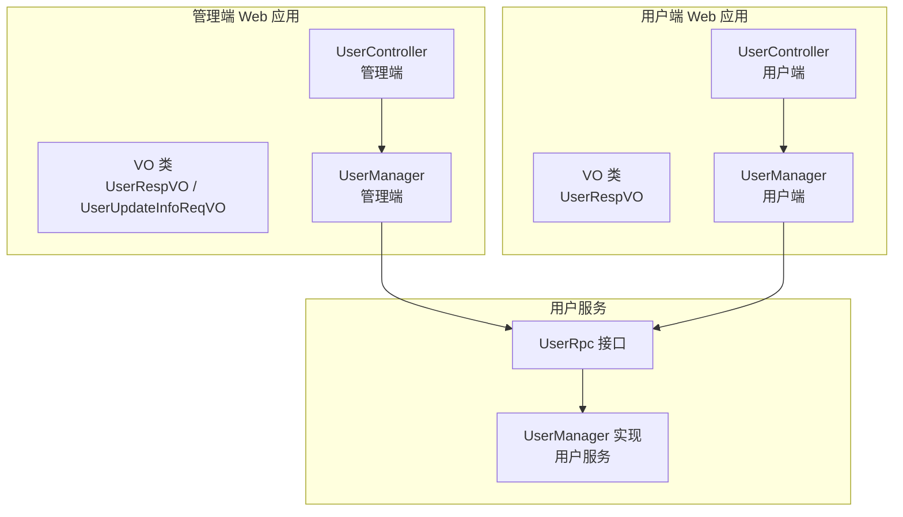
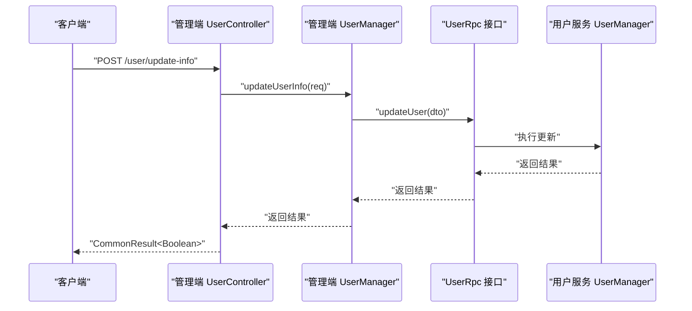
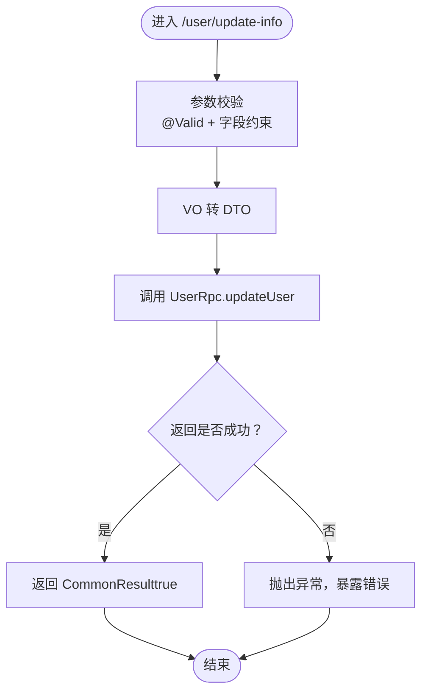
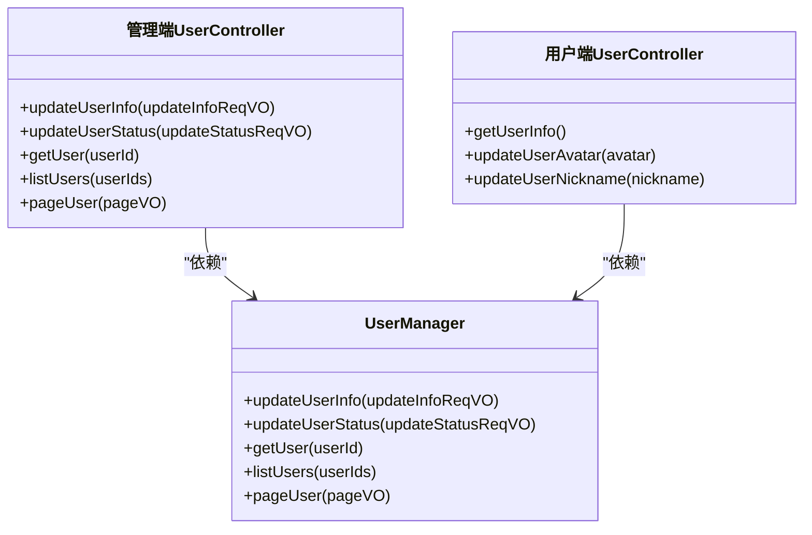
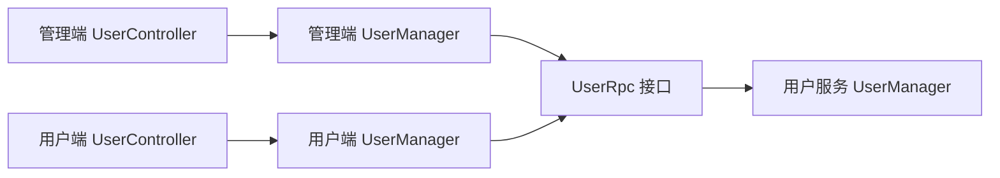

# 个人信息管理

<cite>
**本文引用的文件**
- [management-web-app/src/main/java/cn/iocoder/mall/managementweb/controller/user/UserController.java](file://management-web-app/src/main/java/cn/iocoder/mall/managementweb/controller/user/UserController.java)
- [shop-web-app/src/main/java/cn/iocoder/mall/shopweb/controller/user/UserController.java](file://shop-web-app/src/main/java/cn/iocoder/mall/shopweb/controller/user/UserController.java)
- [management-web-app/src/main/java/cn/iocoder/mall/managementweb/controller/user/vo/UserRespVO.java](file://management-web-app/src/main/java/cn/iocoder/mall/managementweb/controller/user/vo/UserRespVO.java)
- [management-web-app/src/main/java/cn/iocoder/mall/managementweb/controller/user/vo/UserUpdateInfoReqVO.java](file://management-web-app/src/main/java/cn/iocoder/mall/managementweb/controller/user/vo/UserUpdateInfoReqVO.java)
- [management-web-app/src/main/java/cn/iocoder/mall/managementweb/manager/user/UserManager.java](file://management-web-app/src/main/java/cn/iocoder/mall/managementweb/manager/user/UserManager.java)
- [shop-web-app/src/main/java/cn/iocoder/mall/shopweb/controller/user/vo/user/UserRespVO.java](file://shop-web-app/src/main/java/cn/iocoder/mall/shopweb/controller/user/vo/user/UserRespVO.java)
- [user-service-project/user-service-app/src/main/java/cn/iocoder/mall/userservice/manager/user/UserManager.java](file://user-service-project/user-service-app/src/main/java/cn/iocoder/mall/userservice/manager/user/UserManager.java)
- [user-service-project/user-service-api/src/main/java/cn/iocoder/mall/userservice/rpc/user/UserRpc.java](file://user-service-project/user-service-api/src/main/java/cn/iocoder/mall/userservice/rpc/user/UserRpc.java)
</cite>

## 目录
1. [简介](#简介)
2. [项目结构](#项目结构)
3. [核心组件](#核心组件)
4. [架构总览](#架构总览)
5. [详细组件分析](#详细组件分析)
6. [依赖分析](#依赖分析)
7. [性能考虑](#性能考虑)
8. [故障排查指南](#故障排查指南)
9. [结论](#结论)
10. [附录：使用指南与隐私最佳实践](#附录使用指南与隐私最佳实践)

## 简介
本技术文档聚焦于“个人信息管理”功能，覆盖用户个人资料的查询与修改能力，包括昵称修改、头像更新、性别与生日管理（如涉及）等。文档从系统架构、控制器实现、数据模型、安全控制、与用户服务的集成、到使用指南与隐私保护最佳实践进行全链路梳理，帮助开发者与运维人员快速理解与落地该功能。

## 项目结构
个人信息管理相关代码分布在多个模块中：
- 管理端 Web 应用：提供用户信息查询与批量管理接口
- 用户端 Web 应用：提供认证后的个人信息查询与修改接口（昵称、头像）
- 用户服务应用：提供用户信息的 RPC 查询与更新能力
- 公共框架与注解：提供统一返回体、参数校验、鉴权注解等基础设施

图表来源
- [management-web-app/src/main/java/cn/iocoder/mall/managementweb/controller/user/UserController.java:34-66](file://management-web-app/src/main/java/cn/iocoder/mall/managementweb/controller/user/UserController.java#L34-L66)
- [shop-web-app/src/main/java/cn/iocoder/mall/shopweb/controller/user/UserController.java:24-48](file://shop-web-app/src/main/java/cn/iocoder/mall/shopweb/controller/user/UserController.java#L24-L48)
- [management-web-app/src/main/java/cn/iocoder/mall/managementweb/manager/user/UserManager.java:24-81](file://management-web-app/src/main/java/cn/iocoder/mall/managementweb/manager/user/UserManager.java#L24-L81)
- [user-service-project/user-service-api/src/main/java/cn/iocoder/mall/userservice/rpc/user/UserRpc.java](file://user-service-project/user-service-api/src/main/java/cn/iocoder/mall/userservice/rpc/user/UserRpc.java)

章节来源
- [management-web-app/src/main/java/cn/iocoder/mall/managementweb/controller/user/UserController.java:1-69](file://management-web-app/src/main/java/cn/iocoder/mall/managementweb/controller/user/UserController.java#L1-69)
- [shop-web-app/src/main/java/cn/iocoder/mall/shopweb/controller/user/UserController.java:1-51](file://shop-web-app/src/main/java/cn/iocoder/mall/shopweb/controller/user/UserController.java#L1-51)

## 核心组件
- 管理端 UserController：提供用户信息更新、状态更新、单个/批量/分页查询等接口
- 用户端 UserController：提供认证后获取个人信息、更新昵称、更新头像接口
- 管理端 UserManager：封装对用户服务的 RPC 调用，负责参数转换与错误处理
- 用户服务 UserRpc：定义用户信息查询与更新的远程接口契约
- VO 对象：管理端与用户端分别定义了对应的请求/响应 VO，用于传输层数据结构

章节来源
- [management-web-app/src/main/java/cn/iocoder/mall/managementweb/controller/user/UserController.java:34-66](file://management-web-app/src/main/java/cn/iocoder/mall/managementweb/controller/user/UserController.java#L34-L66)
- [shop-web-app/src/main/java/cn/iocoder/mall/shopweb/controller/user/UserController.java:24-48](file://shop-web-app/src/main/java/cn/iocoder/mall/shopweb/controller/user/UserController.java#L24-L48)
- [management-web-app/src/main/java/cn/iocoder/mall/managementweb/manager/user/UserManager.java:24-81](file://management-web-app/src/main/java/cn/iocoder/mall/managementweb/manager/user/UserManager.java#L24-L81)
- [management-web-app/src/main/java/cn/iocoder/mall/managementweb/controller/user/vo/UserRespVO.java:1-27](file://management-web-app/src/main/java/cn/iocoder/mall/managementweb/controller/user/vo/UserRespVO.java#L1-27)
- [management-web-app/src/main/java/cn/iocoder/mall/managementweb/controller/user/vo/UserUpdateInfoReqVO.java:1-26](file://management-web-app/src/main/java/cn/iocoder/mall/managementweb/controller/user/vo/UserUpdateInfoReqVO.java#L1-26)
- [shop-web-app/src/main/java/cn/iocoder/mall/shopweb/controller/user/vo/user/UserRespVO.java:1-23](file://shop-web-app/src/main/java/cn/iocoder/mall/shopweb/controller/user/vo/user/UserRespVO.java#L1-23)

## 架构总览
个人信息管理采用“前端/移动端 → Web 控制器 → Manager → 用户服务 RPC”的分层架构。管理端与用户端分别暴露不同的接口面，满足不同场景下的用户信息操作需求。

图表来源
- [management-web-app/src/main/java/cn/iocoder/mall/managementweb/controller/user/UserController.java:34-39](file://management-web-app/src/main/java/cn/iocoder/mall/managementweb/controller/user/UserController.java#L34-L39)
- [management-web-app/src/main/java/cn/iocoder/mall/managementweb/manager/user/UserManager.java:32-35](file://management-web-app/src/main/java/cn/iocoder/mall/managementweb/manager/user/UserManager.java#L32-L35)
- [user-service-project/user-service-api/src/main/java/cn/iocoder/mall/userservice/rpc/user/UserRpc.java](file://user-service-project/user-service-api/src/main/java/cn/iocoder/mall/userservice/rpc/user/UserRpc.java)

## 详细组件分析

### 管理端：UserController
- 提供以下接口：
  - 更新用户信息：POST /user/update-info
  - 更新用户状态：POST /user/update-status
  - 获取单个用户：GET /user/get
  - 获取用户列表：GET /user/list
  - 获取用户分页：GET /user/page
- 参数校验：使用 @Valid 对请求 VO 进行参数校验
- 返回值：统一使用 CommonResult 包裹

章节来源
- [management-web-app/src/main/java/cn/iocoder/mall/managementweb/controller/user/UserController.java:34-66](file://management-web-app/src/main/java/cn/iocoder/mall/managementweb/controller/user/UserController.java#L34-L66)

### 用户端：UserController
- 提供以下接口：
  - 获取当前用户信息：GET /user/info（需登录）
  - 更新头像：POST /user/update-avatar（需登录）
  - 更新昵称：POST /user/update-nickname（需登录）
- 安全注解：使用 @RequiresAuthenticate 保证接口仅在已登录状态下可访问
- 参数来源：通过 UserSecurityContextHolder 获取当前登录用户 ID

章节来源
- [shop-web-app/src/main/java/cn/iocoder/mall/shopweb/controller/user/UserController.java:24-48](file://shop-web-app/src/main/java/cn/iocoder/mall/shopweb/controller/user/UserController.java#L24-L48)

### 管理端：UserManager
- 通过 Dubbo 注解 @Reference 引用用户服务的 UserRpc
- 将 VO 转换为 DTO 后调用 RPC 接口
- 统一处理 RPC 返回的 CommonResult，并抛出异常以暴露错误
- 支持单个用户查询、批量查询、分页查询

章节来源
- [management-web-app/src/main/java/cn/iocoder/mall/managementweb/manager/user/UserManager.java:24-81](file://management-web-app/src/main/java/cn/iocoder/mall/managementweb/manager/user/UserManager.java#L24-L81)

### 用户服务：UserRpc 与 UserManager
- UserRpc 定义用户信息查询与更新的远程接口契约
- 用户服务端 UserManager 实现具体业务逻辑（如持久化、缓存同步等）

章节来源
- [user-service-project/user-service-api/src/main/java/cn/iocoder/mall/userservice/rpc/user/UserRpc.java](file://user-service-project/user-service-api/src/main/java/cn/iocoder/mall/userservice/rpc/user/UserRpc.java)
- [user-service-project/user-service-app/src/main/java/cn/iocoder/mall/userservice/manager/user/UserManager.java](file://user-service-project/user-service-app/src/main/java/cn/iocoder/mall/userservice/manager/user/UserManager.java)

### 数据模型与参数校验
- 管理端请求对象（UserUpdateInfoReqVO）包含用户编号、昵称、头像、手机号、密码等字段；其中用户编号必填
- 管理端响应对象（UserRespVO）包含用户编号、昵称、头像、状态、手机号、注册 IP、创建时间等字段
- 用户端响应对象（UserRespVO）包含用户编号、手机号、昵称、头像等字段

章节来源
- [management-web-app/src/main/java/cn/iocoder/mall/managementweb/controller/user/vo/UserUpdateInfoReqVO.java:1-26](file://management-web-app/src/main/java/cn/iocoder/mall/managementweb/controller/user/vo/UserUpdateInfoReqVO.java#L1-26)
- [management-web-app/src/main/java/cn/iocoder/mall/managementweb/controller/user/vo/UserRespVO.java:1-27](file://management-web-app/src/main/java/cn/iocoder/mall/managementweb/controller/user/vo/UserRespVO.java#L1-27)
- [shop-web-app/src/main/java/cn/iocoder/mall/shopweb/controller/user/vo/user/UserRespVO.java:1-23](file://shop-web-app/src/main/java/cn/iocoder/mall/shopweb/controller/user/vo/user/UserRespVO.java#L1-23)

### 处理流程图：管理端更新用户信息

图表来源
- [management-web-app/src/main/java/cn/iocoder/mall/managementweb/controller/user/UserController.java:34-39](file://management-web-app/src/main/java/cn/iocoder/mall/managementweb/controller/user/UserController.java#L34-L39)
- [management-web-app/src/main/java/cn/iocoder/mall/managementweb/manager/user/UserManager.java:32-35](file://management-web-app/src/main/java/cn/iocoder/mall/managementweb/manager/user/UserManager.java#L32-L35)

### 类关系图：控制器与 Manager

图表来源
- [management-web-app/src/main/java/cn/iocoder/mall/managementweb/controller/user/UserController.java:34-66](file://management-web-app/src/main/java/cn/iocoder/mall/managementweb/controller/user/UserController.java#L34-L66)
- [shop-web-app/src/main/java/cn/iocoder/mall/shopweb/controller/user/UserController.java:24-48](file://shop-web-app/src/main/java/cn/iocoder/mall/shopweb/controller/user/UserController.java#L24-L48)
- [management-web-app/src/main/java/cn/iocoder/mall/managementweb/manager/user/UserManager.java:24-81](file://management-web-app/src/main/java/cn/iocoder/mall/managementweb/manager/user/UserManager.java#L24-L81)

## 依赖分析
- 控制器层依赖 Manager 层，Manager 层通过 Dubbo 消费用户服务的 UserRpc
- VO/DTO 转换由转换器完成，确保传输层与服务层解耦
- 错误处理统一通过 CommonResult 的 checkError 抛出异常，便于上层捕获与展示

图表来源
- [management-web-app/src/main/java/cn/iocoder/mall/managementweb/manager/user/UserManager.java:24-25](file://management-web-app/src/main/java/cn/iocoder/mall/managementweb/manager/user/UserManager.java#L24-L25)
- [user-service-project/user-service-api/src/main/java/cn/iocoder/mall/userservice/rpc/user/UserRpc.java](file://user-service-project/user-service-api/src/main/java/cn/iocoder/mall/userservice/rpc/user/UserRpc.java)

章节来源
- [management-web-app/src/main/java/cn/iocoder/mall/managementweb/manager/user/UserManager.java:24-81](file://management-web-app/src/main/java/cn/iocoder/mall/managementweb/manager/user/UserManager.java#L24-L81)

## 性能考虑
- 分页查询与批量查询：优先使用分页与批量接口，避免一次性拉取大量用户数据
- 缓存策略：结合用户服务侧的缓存机制，减少重复查询
- RPC 调用：合理设置超时与重试策略，避免阻塞线程池
- 响应体精简：仅返回必要字段，降低网络传输开销

## 故障排查指南
- 参数校验失败：检查请求 VO 的字段约束与必填项，确保传参符合要求
- RPC 调用异常：查看 CommonResult 的错误码与错误信息，定位用户服务侧问题
- 权限不足：用户端接口需登录，确认鉴权上下文是否正确注入

章节来源
- [management-web-app/src/main/java/cn/iocoder/mall/managementweb/controller/user/UserController.java:34-39](file://management-web-app/src/main/java/cn/iocoder/mall/managementweb/controller/user/UserController.java#L34-L39)
- [management-web-app/src/main/java/cn/iocoder/mall/managementweb/manager/user/UserManager.java:32-35](file://management-web-app/src/main/java/cn/iocoder/mall/managementweb/manager/user/UserManager.java#L32-L35)

## 结论
个人信息管理功能通过清晰的分层设计与统一的返回体规范，实现了用户信息的查询与更新能力。管理端与用户端分别面向不同场景，配合用户服务的 RPC 能力，形成高内聚、低耦合的架构。建议在实际落地中重点关注参数校验、错误处理与鉴权控制，确保功能稳定与安全。

## 附录：使用指南与隐私最佳实践
- 使用指南
  - 管理端：通过 /user/update-info 传入用户编号与待更新字段；通过 /user/get、/user/list、/user/page 获取用户信息
  - 用户端：登录后通过 /user/info 获取个人信息；通过 /user/update-avatar、/user/update-nickname 更新头像与昵称
- 隐私与安全
  - 字段权限控制：仅暴露必要的用户字段，避免泄露敏感信息
  - 敏感信息保护：密码等敏感字段不在响应体中返回；上传头像需校验 URL 合法性与安全性
  - 数据一致性：更新操作需保证幂等性与事务一致性，必要时引入分布式锁或版本号控制
  - 鉴权与审计：所有用户端接口均需登录；建议记录关键操作日志，便于审计与追踪