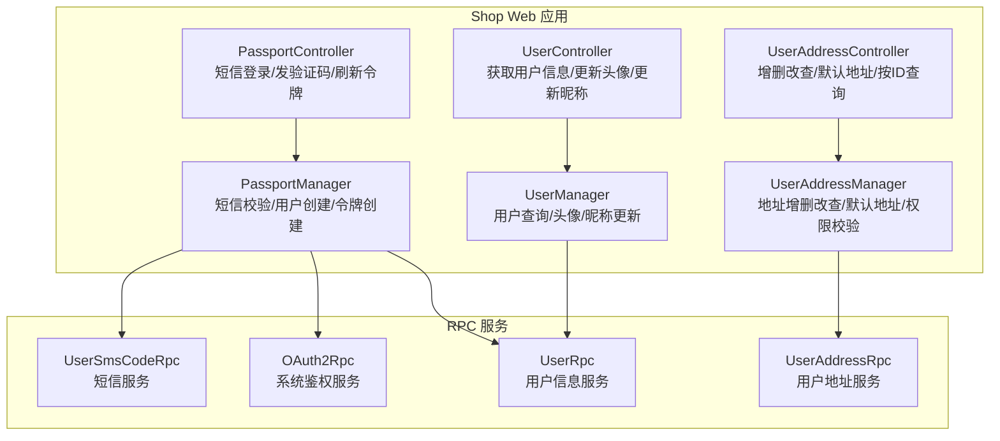
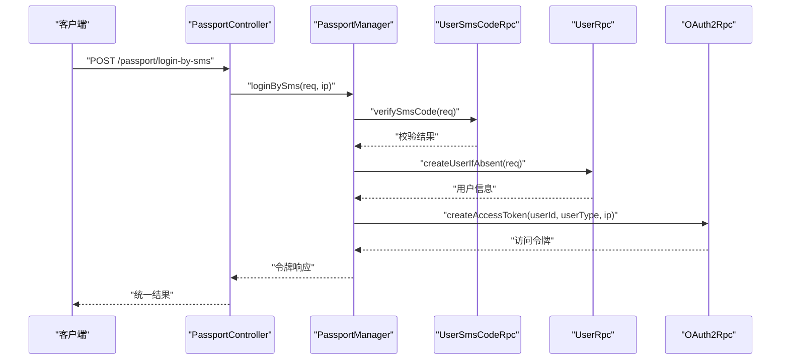
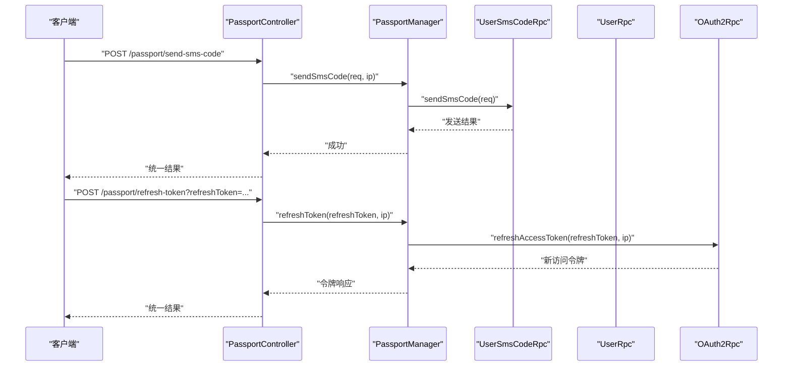
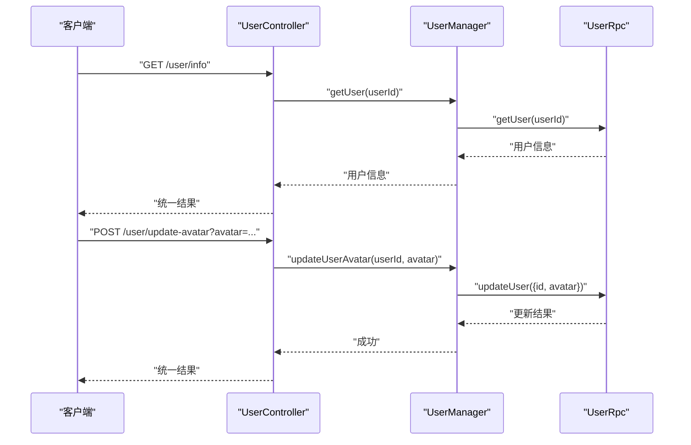
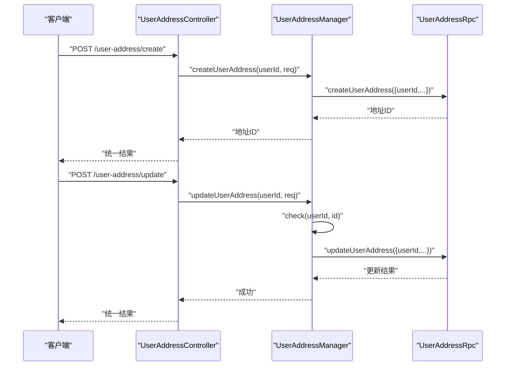
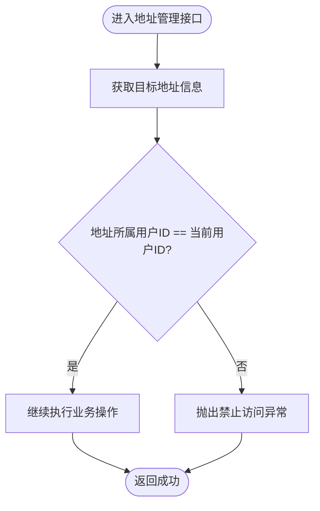
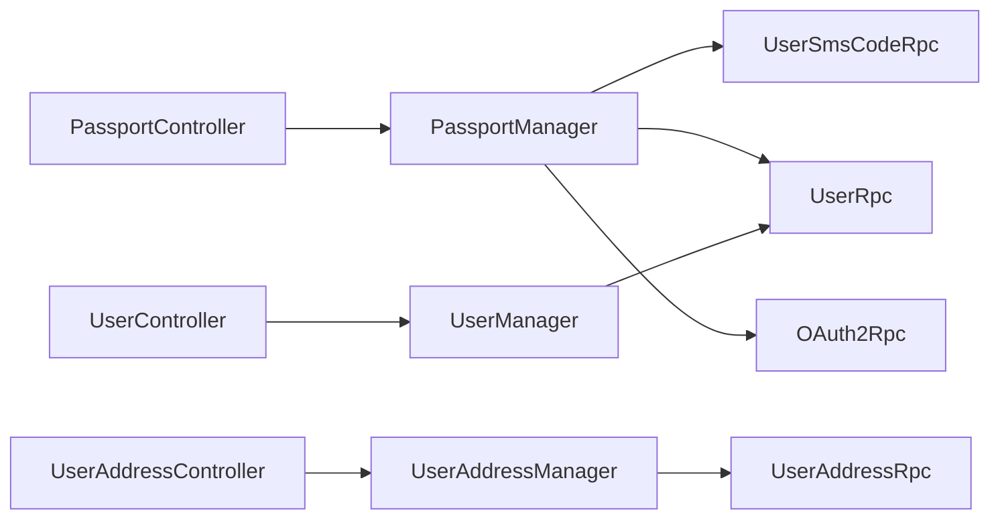

# 用户中心模块

<cite>
**本文引用的文件**
- [PassportController.java](file://shop-web-app/src/main/java/cn/iocoder/mall/shopweb/controller/user/PassportController.java)
- [UserController.java](file://shop-web-app/src/main/java/cn/iocoder/mall/shopweb/controller/user/UserController.java)
- [UserAddressController.java](file://shop-web-app/src/main/java/cn/iocoder/mall/shopweb/controller/user/UserAddressController.java)
- [PassportManager.java](file://shop-web-app/src/main/java/cn/iocoder/mall/shopweb/service/user/PassportManager.java)
- [UserManager.java](file://shop-web-app/src/main/java/cn/iocoder/mall/shopweb/service/user/UserManager.java)
- [UserAddressManager.java](file://shop-web-app/src/main/java/cn/iocoder/mall/shopweb/service/user/UserAddressManager.java)
</cite>

## 目录
1. [简介](#简介)
2. [项目结构](#项目结构)
3. [核心组件](#核心组件)
4. [架构总览](#架构总览)
5. [详细组件分析](#详细组件分析)
6. [依赖分析](#依赖分析)
7. [性能考虑](#性能考虑)
8. [故障排查指南](#故障排查指南)
9. [结论](#结论)
10. [附录](#附录)

## 简介
本文件面向“用户中心模块”的技术文档，聚焦于用户认证与管理的核心能力：短信验证码登录、令牌刷新、个人信息查询与更新（头像、昵称）、收货地址的增删改查与默认地址管理。文档从系统架构、组件职责、数据流、处理逻辑、权限控制、错误处理与性能优化等方面进行深入解析，并提供使用指南与调试方法，帮助开发者快速理解并高效扩展用户中心能力。

## 项目结构
用户中心相关代码位于“shop-web-app”应用中，采用“控制器层-业务管理器层-RPC调用层”的分层架构：
- 控制器层：对外暴露REST接口，负责参数接收、鉴权注解校验、返回统一结果包装。
- 业务管理器层：封装具体业务逻辑，执行权限校验、参数转换、RPC调用与异常处理。
- RPC调用层：通过Dubbo远程调用用户服务、系统服务等后端能力。

图表来源
- [PassportController.java:22-56](file://shop-web-app/src/main/java/cn/iocoder/mall/shopweb/controller/user/PassportController.java#L22-L56)
- [UserController.java:16-50](file://shop-web-app/src/main/java/cn/iocoder/mall/shopweb/controller/user/UserController.java#L16-L50)
- [UserAddressController.java:22-80](file://shop-web-app/src/main/java/cn/iocoder/mall/shopweb/controller/user/UserAddressController.java#L22-L80)
- [PassportManager.java:20-61](file://shop-web-app/src/main/java/cn/iocoder/mall/shopweb/service/user/PassportManager.java#L20-L61)
- [UserManager.java:12-34](file://shop-web-app/src/main/java/cn/iocoder/mall/shopweb/service/user/UserManager.java#L12-L34)
- [UserAddressManager.java:23-130](file://shop-web-app/src/main/java/cn/iocoder/mall/shopweb/service/user/UserAddressManager.java#L23-L130)

章节来源
- [PassportController.java:22-56](file://shop-web-app/src/main/java/cn/iocoder/mall/shopweb/controller/user/PassportController.java#L22-L56)
- [UserController.java:16-50](file://shop-web-app/src/main/java/cn/iocoder/mall/shopweb/controller/user/UserController.java#L16-L50)
- [UserAddressController.java:22-80](file://shop-web-app/src/main/java/cn/iocoder/mall/shopweb/controller/user/UserAddressController.java#L22-L80)

## 核心组件
- PassportController：提供短信验证码登录、发送验证码、刷新访问令牌的接口；使用匿名可访问注解，便于未登录用户完成登录与获取令牌。
- UserController：提供用户信息查询、头像更新、昵称更新接口；需要已认证用户上下文。
- UserAddressController：提供地址创建、更新、删除、按ID查询、默认地址查询、地址列表查询；需要已认证用户上下文并具备相应权限。
- PassportManager：封装登录流程（短信验证码校验、用户创建、访问令牌创建/刷新），并调用短信、用户、鉴权RPC服务。
- UserManager：封装用户信息查询与头像/昵称更新，调用用户RPC服务。
- UserAddressManager：封装地址增删改查与默认地址查询，并在更新/删除/查询时进行“用户归属校验”，防止越权访问。

章节来源
- [PassportController.java:22-56](file://shop-web-app/src/main/java/cn/iocoder/mall/shopweb/controller/user/PassportController.java#L22-L56)
- [UserController.java:16-50](file://shop-web-app/src/main/java/cn/iocoder/mall/shopweb/controller/user/UserController.java#L16-L50)
- [UserAddressController.java:22-80](file://shop-web-app/src/main/java/cn/iocoder/mall/shopweb/controller/user/UserAddressController.java#L22-L80)
- [PassportManager.java:20-61](file://shop-web-app/src/main/java/cn/iocoder/mall/shopweb/service/user/PassportManager.java#L20-L61)
- [UserManager.java:12-34](file://shop-web-app/src/main/java/cn/iocoder/mall/shopweb/service/user/UserManager.java#L12-L34)
- [UserAddressManager.java:23-130](file://shop-web-app/src/main/java/cn/iocoder/mall/shopweb/service/user/UserAddressManager.java#L23-L130)

## 架构总览
用户中心通过Web控制器接收请求，经由业务管理器完成参数校验、权限校验与RPC调用，最终返回统一的结果包装。鉴权采用基于注解的拦截机制，确保接口访问的安全性。

图表来源
- [PassportController.java:30-36](file://shop-web-app/src/main/java/cn/iocoder/mall/shopweb/controller/user/PassportController.java#L30-L36)
- [PassportManager.java:30-46](file://shop-web-app/src/main/java/cn/iocoder/mall/shopweb/service/user/PassportManager.java#L30-L46)

## 详细组件分析

### PassportController 分析
- 接口职责
  - 短信验证码登录：接收手机号与验证码，校验通过后创建用户并发放访问令牌。
  - 发送短信验证码：向指定手机号发送验证码。
  - 刷新访问令牌：使用刷新令牌换取新的访问令牌。
- 鉴权策略
  - 使用匿名可访问注解，允许未登录用户调用登录与发验证码接口。
- 参数与返回
  - 请求体/参数对象对应VO类，返回统一结果包装。
- 错误处理
  - 内部通过RPC调用返回的统一结果进行错误检查，失败时抛出全局异常。

图表来源
- [PassportController.java:38-54](file://shop-web-app/src/main/java/cn/iocoder/mall/shopweb/controller/user/PassportController.java#L38-L54)
- [PassportManager.java:48-59](file://shop-web-app/src/main/java/cn/iocoder/mall/shopweb/service/user/PassportManager.java#L48-L59)

章节来源
- [PassportController.java:22-56](file://shop-web-app/src/main/java/cn/iocoder/mall/shopweb/controller/user/PassportController.java#L22-L56)
- [PassportManager.java:20-61](file://shop-web-app/src/main/java/cn/iocoder/mall/shopweb/service/user/PassportManager.java#L20-L61)

### UserController 分析
- 接口职责
  - 获取用户信息：根据当前用户ID查询用户详情。
  - 更新头像：设置用户头像URL。
  - 更新昵称：设置用户昵称。
- 鉴权策略
  - 使用认证注解，要求请求携带有效访问令牌。
- 数据模型
  - 响应VO封装用户基本信息，便于前端展示与编辑。

图表来源
- [UserController.java:24-39](file://shop-web-app/src/main/java/cn/iocoder/mall/shopweb/controller/user/UserController.java#L24-L39)
- [UserManager.java:18-32](file://shop-web-app/src/main/java/cn/iocoder/mall/shopweb/service/user/UserManager.java#L18-L32)

章节来源
- [UserController.java:16-50](file://shop-web-app/src/main/java/cn/iocoder/mall/shopweb/controller/user/UserController.java#L16-L50)
- [UserManager.java:12-34](file://shop-web-app/src/main/java/cn/iocoder/mall/shopweb/service/user/UserManager.java#L12-L34)

### UserAddressController 分析
- 接口职责
  - 创建地址：新增一条用户收货地址。
  - 更新地址：更新一条用户收货地址（含默认地址标记）。
  - 删除地址：删除指定用户地址。
  - 查询地址：按ID查询单条地址。
  - 默认地址：查询用户的默认地址。
  - 地址列表：查询用户所有地址。
- 权限与安全
  - 所有接口均需认证且具备权限注解。
  - 在更新/删除/查询前，内部会校验地址是否属于当前用户，防止越权访问。
- 数据模型
  - 请求/响应VO封装地址字段，支持省市区、收件人、电话、是否默认等。

图表来源
- [UserAddressController.java:34-47](file://shop-web-app/src/main/java/cn/iocoder/mall/shopweb/controller/user/UserAddressController.java#L34-L47)
- [UserAddressManager.java:36-56](file://shop-web-app/src/main/java/cn/iocoder/mall/shopweb/service/user/UserAddressManager.java#L36-L56)

章节来源
- [UserAddressController.java:22-80](file://shop-web-app/src/main/java/cn/iocoder/mall/shopweb/controller/user/UserAddressController.java#L22-L80)
- [UserAddressManager.java:23-130](file://shop-web-app/src/main/java/cn/iocoder/mall/shopweb/service/user/UserAddressManager.java#L23-L130)

### 权限校验与越权保护流程
- 用户地址管理在更新/删除/查询前，先通过RPC获取目标地址，再比对地址所属用户ID与当前用户ID，不一致则抛出禁止访问异常。

图表来源
- [UserAddressManager.java:118-128](file://shop-web-app/src/main/java/cn/iocoder/mall/shopweb/service/user/UserAddressManager.java#L118-L128)

章节来源
- [UserAddressManager.java:118-128](file://shop-web-app/src/main/java/cn/iocoder/mall/shopweb/service/user/UserAddressManager.java#L118-L128)

## 依赖分析
- 控制器到管理器：控制器仅负责参数接收与鉴权，业务逻辑委托给管理器。
- 管理器到RPC：管理器通过Dubbo引用调用用户、地址、短信、鉴权等RPC服务。
- 统一异常处理：RPC调用返回的统一结果在管理器侧进行错误检查，保证上层控制器无需关心细节。

图表来源
- [PassportManager.java:23-28](file://shop-web-app/src/main/java/cn/iocoder/mall/shopweb/service/user/PassportManager.java#L23-L28)
- [UserManager.java:15-16](file://shop-web-app/src/main/java/cn/iocoder/mall/shopweb/service/user/UserManager.java#L15-L16)
- [UserAddressManager.java:26-27](file://shop-web-app/src/main/java/cn/iocoder/mall/shopweb/service/user/UserAddressManager.java#L26-L27)

章节来源
- [PassportManager.java:20-61](file://shop-web-app/src/main/java/cn/iocoder/mall/shopweb/service/user/PassportManager.java#L20-L61)
- [UserManager.java:12-34](file://shop-web-app/src/main/java/cn/iocoder/mall/shopweb/service/user/UserManager.java#L12-L34)
- [UserAddressManager.java:23-130](file://shop-web-app/src/main/java/cn/iocoder/mall/shopweb/service/user/UserAddressManager.java#L23-L130)

## 性能考虑
- RPC调用链路：登录与地址管理均涉及多次RPC调用，建议在管理器层对调用顺序与参数做必要合并，减少往返次数。
- 缓存策略：对于常用用户信息与默认地址，可在管理器或服务层引入缓存，降低重复RPC开销。
- 并发控制：地址更新/删除前的权限校验与RPC查询可并行化，但需注意幂等性与一致性。
- 异常短路：RPC返回错误时立即抛出，避免无效重试与资源浪费。

## 故障排查指南
- 登录失败
  - 检查短信验证码是否正确、是否过期。
  - 核对用户创建与令牌创建的RPC调用返回状态。
- 更新头像/昵称失败
  - 确认当前用户上下文是否正确，请求是否携带有效令牌。
  - 检查用户RPC更新接口返回状态。
- 地址越权访问
  - 若出现禁止访问异常，确认当前用户与目标地址所属用户是否一致。
  - 检查地址ID是否正确，以及默认地址标记是否符合预期。
- 通用排查
  - 查看控制器返回的统一结果状态码与错误信息。
  - 关注管理器侧RPC调用的错误检查逻辑，定位具体失败环节。

章节来源
- [PassportManager.java:30-46](file://shop-web-app/src/main/java/cn/iocoder/mall/shopweb/service/user/PassportManager.java#L30-L46)
- [UserManager.java:18-32](file://shop-web-app/src/main/java/cn/iocoder/mall/shopweb/service/user/UserManager.java#L18-L32)
- [UserAddressManager.java:118-128](file://shop-web-app/src/main/java/cn/iocoder/mall/shopweb/service/user/UserAddressManager.java#L118-L128)

## 结论
用户中心模块通过清晰的分层设计与严格的权限控制，实现了从登录到个人信息、再到地址管理的完整用户生命周期能力。借助统一的RPC调用与异常处理机制，系统在可维护性与可扩展性方面具备良好基础。后续可在缓存、并发与链路优化方面进一步提升性能与稳定性。

## 附录
- 使用指南
  - 登录：调用短信登录接口，输入手机号与验证码，获取访问令牌。
  - 发验证码：调用发送验证码接口，接收短信验证码。
  - 刷新令牌：使用刷新令牌接口换取新的访问令牌。
  - 个人信息：调用用户信息接口获取详情，支持更新头像与昵称。
  - 地址管理：支持创建、更新、删除、查询单条、查询默认、查询列表。
- 开发调试
  - 使用HTTP客户端工具调用各接口，关注统一结果中的状态与消息。
  - 在本地环境配置好RPC依赖与数据库连接，确保各服务正常启动。
  - 对照控制器与管理器的调用链路，逐步定位问题点。