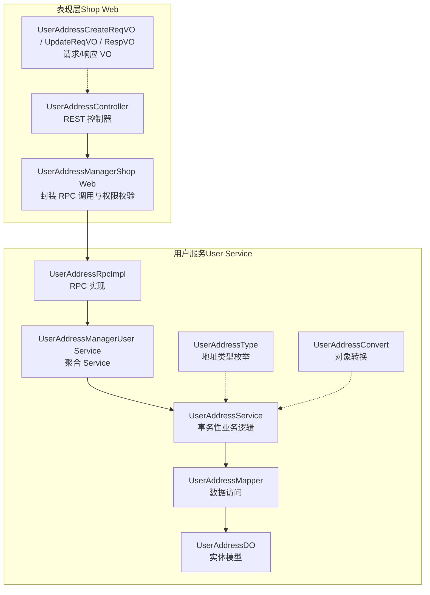
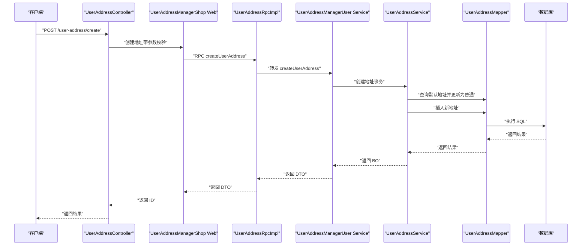
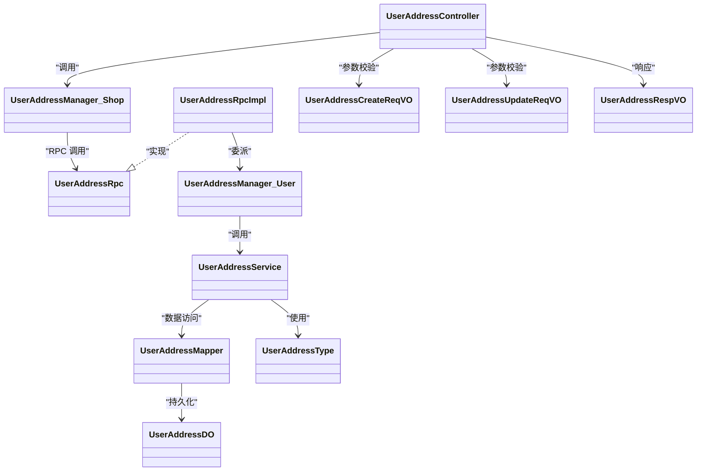
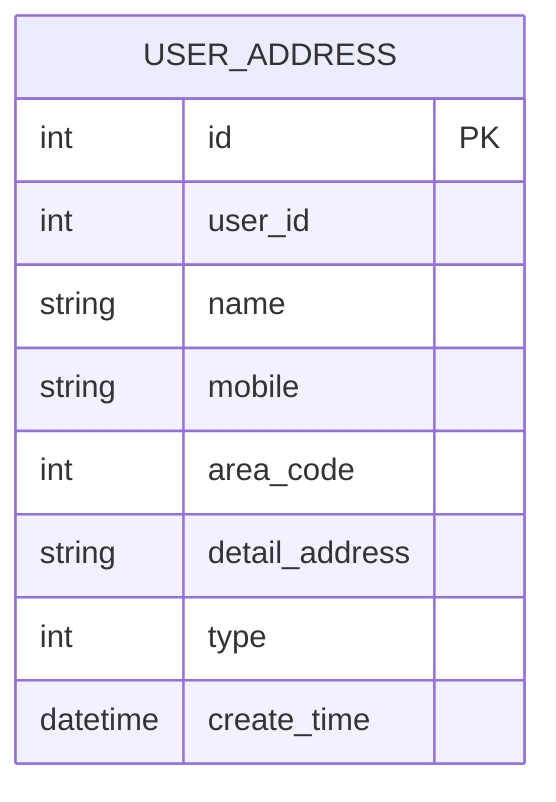

# 用户地址管理

<cite>
**本文引用的文件**
- [UserAddressController.java](file://shop-web-app/src/main/java/cn/iocoder/mall/shopweb/controller/user/UserAddressController.java)
- [UserAddressCreateReqVO.java](file://shop-web-app/src/main/java/cn/iocoder/mall/shopweb/controller/user/vo/address/UserAddressCreateReqVO.java)
- [UserAddressUpdateReqVO.java](file://shop-web-app/src/main/java/cn/iocoder/mall/shopweb/controller/user/vo/address/UserAddressUpdateReqVO.java)
- [UserAddressRespVO.java](file://shop-web-app/src/main/java/cn/iocoder/mall/shopweb/controller/user/vo/address/UserAddressRespVO.java)
- [UserAddressManager.java（Shop Web）](file://shop-web-app/src/main/java/cn/iocoder/mall/shopweb/service/user/UserAddressManager.java)
- [UserAddressRpc.java](file://user-service-project/user-service-api/src/main/java/cn/iocoder/mall/userservice/rpc/address/UserAddressRpc.java)
- [UserAddressRpcImpl.java](file://user-service-project/user-service-app/src/main/java/cn/iocoder/mall/userservice/rpc/address/UserAddressRpcImpl.java)
- [UserAddressManager.java（User Service）](file://user-service-project/user-service-app/src/main/java/cn/iocoder/mall/userservice/manager/address/UserAddressManager.java)
- [UserAddressService.java](file://user-service-project/user-service-app/src/main/java/cn/iocoder/mall/userservice/service/address/UserAddressService.java)
- [UserAddressDO.java](file://user-service-project/user-service-app/src/main/java/cn/iocoder/mall/userservice/dal/mysql/dataobject/address/UserAddressDO.java)
- [UserAddressMapper.java](file://user-service-project/user-service-app/src/main/java/cn/iocoder/mall/userservice/dal/mysql/mapper/address/UserAddressMapper.java)
- [UserAddressConvert.java](file://user-service-project/user-service-app/src/main/java/cn/iocoder/mall/userservice/convert/address/UserAddressConvert.java)
- [UserAddressType.java](file://user-service-project/user-service-api/src/main/java/cn/iocoder/mall/userservice/enums/address/UserAddressType.java)
</cite>

## 目录
1. [简介](#简介)
2. [项目结构](#项目结构)
3. [核心组件](#核心组件)
4. [架构总览](#架构总览)
5. [详细组件分析](#详细组件分析)
6. [依赖分析](#依赖分析)
7. [性能考虑](#性能考虑)
8. [故障排查指南](#故障排查指南)
9. [结论](#结论)
10. [附录](#附录)

## 简介
本技术文档围绕“用户地址管理”功能展开，覆盖用户收货地址的增删改查全流程，包括地址创建、编辑、删除、设置默认地址、查询默认地址及地址列表。文档从接口设计、参数校验、数据模型、业务规则、与用户服务的集成方式、错误处理与性能优化等方面进行系统化说明，并提供使用指南与用户体验优化建议。

## 项目结构
用户地址管理涉及三层：
- 表现层（Shop Web）：对外暴露 REST 接口，负责参数校验与权限控制，调用用户服务 RPC。
- 用户服务（User Service）：提供地址管理的业务实现，包含 RPC 暴露、Manager 层、Service 层、Mapper 层与 DO 数据模型。
- 数据层：MyBatis-Plus Mapper 访问数据库表 user_address。

图表来源
- [UserAddressController.java:1-81](file://shop-web-app/src/main/java/cn/iocoder/mall/shopweb/controller/user/UserAddressController.java#L1-L81)
- [UserAddressManager.java（Shop Web）:1-131](file://shop-web-app/src/main/java/cn/iocoder/mall/shopweb/service/user/UserAddressManager.java#L1-L131)
- [UserAddressRpcImpl.java:1-57](file://user-service-project/user-service-app/src/main/java/cn/iocoder/mall/userservice/rpc/address/UserAddressRpcImpl.java#L1-L57)
- [UserAddressManager.java（User Service）:1-87](file://user-service-project/user-service-app/src/main/java/cn/iocoder/mall/userservice/manager/address/UserAddressManager.java#L1-L87)
- [UserAddressService.java:1-131](file://user-service-project/user-service-app/src/main/java/cn/iocoder/mall/userservice/service/address/UserAddressService.java#L1-L131)
- [UserAddressMapper.java:1-20](file://user-service-project/user-service-app/src/main/java/cn/iocoder/mall/userservice/dal/mysql/mapper/address/UserAddressMapper.java#L1-L20)
- [UserAddressDO.java:1-56](file://user-service-project/user-service-app/src/main/java/cn/iocoder/mall/userservice/dal/mysql/dataobject/address/UserAddressDO.java#L1-L56)
- [UserAddressType.java:1-40](file://user-service-project/user-service-api/src/main/java/cn/iocoder/mall/userservice/enums/address/UserAddressType.java#L1-L40)
- [UserAddressConvert.java:1-37](file://user-service-project/user-service-app/src/main/java/cn/iocoder/mall/userservice/convert/address/UserAddressConvert.java#L1-L37)

章节来源
- [UserAddressController.java:1-81](file://shop-web-app/src/main/java/cn/iocoder/mall/shopweb/controller/user/UserAddressController.java#L1-L81)
- [UserAddressManager.java（Shop Web）:1-131](file://shop-web-app/src/main/java/cn/iocoder/mall/shopweb/service/user/UserAddressManager.java#L1-L131)
- [UserAddressRpcImpl.java:1-57](file://user-service-project/user-service-app/src/main/java/cn/iocoder/mall/userservice/rpc/address/UserAddressRpcImpl.java#L1-L57)
- [UserAddressService.java:1-131](file://user-service-project/user-service-app/src/main/java/cn/iocoder/mall/userservice/service/address/UserAddressService.java#L1-L131)

## 核心组件
- 控制器层：UserAddressController 提供创建、更新、删除、查询单个、查询默认、查询列表等接口，统一进行权限注解与参数校验。
- 管理器层（Shop Web）：UserAddressManager 封装 RPC 调用、用户归属校验、异常透传与结果转换。
- RPC 层：UserAddressRpc 定义接口；UserAddressRpcImpl 实现 RPC 方法，委托给 UserAddressManager（User Service）。
- 业务层（User Service）：UserAddressManager（User Service）聚合 UserAddressService；UserAddressService 实现事务性业务逻辑，含默认地址互斥、存在性校验、删除标记等。
- 数据层：UserAddressMapper 提供按用户与类型查询；UserAddressDO 为持久化实体；UserAddressConvert 提供多层对象映射。
- 枚举与 VO：UserAddressType 定义默认/普通两类地址；Shop Web 的 VO 用于请求参数校验与响应展示。

章节来源
- [UserAddressController.java:25-81](file://shop-web-app/src/main/java/cn/iocoder/mall/shopweb/controller/user/UserAddressController.java#L25-L81)
- [UserAddressManager.java（Shop Web）:23-131](file://shop-web-app/src/main/java/cn/iocoder/mall/shopweb/service/user/UserAddressManager.java#L23-L131)
- [UserAddressRpc.java:10-63](file://user-service-project/user-service-api/src/main/java/cn/iocoder/mall/userservice/rpc/address/UserAddressRpc.java#L10-L63)
- [UserAddressRpcImpl.java:15-57](file://user-service-project/user-service-app/src/main/java/cn/iocoder/mall/userservice/rpc/address/UserAddressRpcImpl.java#L15-L57)
- [UserAddressManager.java（User Service）:14-87](file://user-service-project/user-service-app/src/main/java/cn/iocoder/mall/userservice/manager/address/UserAddressManager.java#L14-L87)
- [UserAddressService.java:22-131](file://user-service-project/user-service-app/src/main/java/cn/iocoder/mall/userservice/service/address/UserAddressService.java#L22-L131)
- [UserAddressMapper.java:11-20](file://user-service-project/user-service-app/src/main/java/cn/iocoder/mall/userservice/dal/mysql/mapper/address/UserAddressMapper.java#L11-L20)
- [UserAddressDO.java:10-56](file://user-service-project/user-service-app/src/main/java/cn/iocoder/mall/userservice/dal/mysql/dataobject/address/UserAddressDO.java#L10-L56)
- [UserAddressConvert.java:15-37](file://user-service-project/user-service-app/src/main/java/cn/iocoder/mall/userservice/convert/address/UserAddressConvert.java#L15-L37)
- [UserAddressType.java:7-40](file://user-service-project/user-service-api/src/main/java/cn/iocoder/mall/userservice/enums/address/UserAddressType.java#L7-L40)

## 架构总览
下图展示了从 Shop Web 到 User Service 的调用链路与职责划分：

图表来源
- [UserAddressController.java:34-39](file://shop-web-app/src/main/java/cn/iocoder/mall/shopweb/controller/user/UserAddressController.java#L34-L39)
- [UserAddressManager.java（Shop Web）:36-41](file://shop-web-app/src/main/java/cn/iocoder/mall/shopweb/service/user/UserAddressManager.java#L36-L41)
- [UserAddressRpcImpl.java:24-27](file://user-service-project/user-service-app/src/main/java/cn/iocoder/mall/userservice/rpc/address/UserAddressRpcImpl.java#L24-L27)
- [UserAddressManager.java（User Service）:29-32](file://user-service-project/user-service-app/src/main/java/cn/iocoder/mall/userservice/manager/address/UserAddressManager.java#L29-L32)
- [UserAddressService.java:38-54](file://user-service-project/user-service-app/src/main/java/cn/iocoder/mall/userservice/service/address/UserAddressService.java#L38-L54)
- [UserAddressMapper.java:14-17](file://user-service-project/user-service-app/src/main/java/cn/iocoder/mall/userservice/dal/mysql/mapper/address/UserAddressMapper.java#L14-L17)

## 详细组件分析

### 控制器层：UserAddressController
- 职责：定义 REST 接口，标注权限注解，进行参数校验，调用 Manager 并返回统一结果包装。
- 关键接口：
  - POST /user-address/create：创建地址，接收 UserAddressCreateReqVO。
  - POST /user-address/update：更新地址，接收 UserAddressUpdateReqVO。
  - POST /user-address/delete：删除地址，接收地址编号。
  - GET /user-address/get：根据地址编号获取地址详情。
  - GET /user-address/get-default：获取默认地址。
  - GET /user-address/list：获取当前用户地址列表。
- 参数校验：通过 VO 中的注解确保必填字段与枚举值合法。
- 权限控制：所有接口均需登录态。

章节来源
- [UserAddressController.java:25-81](file://shop-web-app/src/main/java/cn/iocoder/mall/shopweb/controller/user/UserAddressController.java#L25-L81)
- [UserAddressCreateReqVO.java:12-34](file://shop-web-app/src/main/java/cn/iocoder/mall/shopweb/controller/user/vo/address/UserAddressCreateReqVO.java#L12-L34)
- [UserAddressUpdateReqVO.java:12-37](file://shop-web-app/src/main/java/cn/iocoder/mall/shopweb/controller/user/vo/address/UserAddressUpdateReqVO.java#L12-L37)

### 管理器层（Shop Web）：UserAddressManager
- 职责：封装 RPC 调用、注入用户标识、执行权限校验（检查地址归属）、异常透传、结果转换。
- 关键方法：
  - createUserAddress：调用 RPC 创建并返回地址编号。
  - updateUserAddress：先校验归属再调用 RPC 更新。
  - deleteUserAddress：先校验归属再调用 RPC 删除。
  - getUserAddress：先调用 RPC 获取，再校验归属后返回。
  - listUserAddresses / getDefaultUserAddress：分别获取列表与默认地址。
- 归属校验：通过 getUserAddress 查询 DTO 后比对 userId，不一致则抛出禁止访问异常。

章节来源
- [UserAddressManager.java（Shop Web）:23-131](file://shop-web-app/src/main/java/cn/iocoder/mall/shopweb/service/user/UserAddressManager.java#L23-L131)

### RPC 层：UserAddressRpc 与 UserAddressRpcImpl
- UserAddressRpc：定义创建、更新、删除、查询、按用户与类型查询等 RPC 接口。
- UserAddressRpcImpl：实现上述接口，直接委托给 UserAddressManager（User Service），并将结果包装为通用结果。

章节来源
- [UserAddressRpc.java:10-63](file://user-service-project/user-service-api/src/main/java/cn/iocoder/mall/userservice/rpc/address/UserAddressRpc.java#L10-L63)
- [UserAddressRpcImpl.java:15-57](file://user-service-project/user-service-app/src/main/java/cn/iocoder/mall/userservice/rpc/address/UserAddressRpcImpl.java#L15-L57)

### 业务层（User Service）：UserAddressManager 与 UserAddressService
- UserAddressManager（User Service）：聚合 Service，负责调用 Service 层完成具体业务。
- UserAddressService：
  - 创建：若新增默认地址，则将该用户已有默认地址更新为普通地址；随后插入新记录。
  - 更新：先校验地址存在性，若修改为默认地址，则将该用户其它默认地址更新为普通地址；最后更新记录。
  - 删除：先校验地址存在性，再执行删除标记。
  - 查询：支持按 ID、批量 ID、按用户与类型查询。
- 事务性：创建、更新、删除均在 Service 层以事务包裹，保证一致性。

章节来源
- [UserAddressManager.java（User Service）:14-87](file://user-service-project/user-service-app/src/main/java/cn/iocoder/mall/userservice/manager/address/UserAddressManager.java#L14-L87)
- [UserAddressService.java:22-131](file://user-service-project/user-service-app/src/main/java/cn/iocoder/mall/userservice/service/address/UserAddressService.java#L22-L131)

### 数据层：UserAddressMapper 与 UserAddressDO
- Mapper：提供按用户与类型查询的便捷方法，默认类型查询仅返回一条记录或空集合。
- DO：持久化实体，包含主键、用户标识、收件人、手机、地区编码、详细地址、地址类型、创建时间等字段。

章节来源
- [UserAddressMapper.java:11-20](file://user-service-project/user-service-app/src/main/java/cn/iocoder/mall/userservice/dal/mysql/mapper/address/UserAddressMapper.java#L11-L20)
- [UserAddressDO.java:10-56](file://user-service-project/user-service-app/src/main/java/cn/iocoder/mall/userservice/dal/mysql/dataobject/address/UserAddressDO.java#L10-L56)

### 数据模型与转换
- Shop Web VO：
  - UserAddressCreateReqVO：创建时的请求参数，包含姓名、手机、地区编码、详细地址、地址类型。
  - UserAddressUpdateReqVO：更新时的请求参数，包含地址编号、姓名、手机、地区编码、详细地址、地址类型。
  - UserAddressRespVO：响应参数，包含地址编号、用户编号、姓名、手机、地区编码、详细地址、地址类型、创建时间。
- 枚举：UserAddressType 定义默认与普通两类地址类型。
- 转换器：UserAddressConvert 提供 VO/DTO/BO/DO 之间的映射。

章节来源
- [UserAddressCreateReqVO.java:12-34](file://shop-web-app/src/main/java/cn/iocoder/mall/shopweb/controller/user/vo/address/UserAddressCreateReqVO.java#L12-L34)
- [UserAddressUpdateReqVO.java:12-37](file://shop-web-app/src/main/java/cn/iocoder/mall/shopweb/controller/user/vo/address/UserAddressUpdateReqVO.java#L12-L37)
- [UserAddressRespVO.java:9-32](file://shop-web-app/src/main/java/cn/iocoder/mall/shopweb/controller/user/vo/address/UserAddressRespVO.java#L9-L32)
- [UserAddressType.java:7-40](file://user-service-project/user-service-api/src/main/java/cn/iocoder/mall/userservice/enums/address/UserAddressType.java#L7-L40)
- [UserAddressConvert.java:15-37](file://user-service-project/user-service-app/src/main/java/cn/iocoder/mall/userservice/convert/address/UserAddressConvert.java#L15-L37)

### 业务规则与约束
- 默认地址互斥：同一用户只能有一个默认地址。创建或更新为默认地址时，会将该用户其它默认地址降级为普通地址。
- 存在性校验：删除与更新前会校验地址是否存在，不存在则抛出“地址不存在”异常。
- 归属校验：Shop Web 层在查询与更新/删除时，会再次校验地址是否属于当前用户，防止越权访问。
- 地址类型：仅允许默认与普通两种类型，由枚举约束。

章节来源
- [UserAddressService.java:38-80](file://user-service-project/user-service-app/src/main/java/cn/iocoder/mall/userservice/service/address/UserAddressService.java#L38-L80)
- [UserAddressManager.java（Shop Web）:118-128](file://shop-web-app/src/main/java/cn/iocoder/mall/shopweb/service/user/UserAddressManager.java#L118-L128)
- [UserAddressType.java:10-17](file://user-service-project/user-service-api/src/main/java/cn/iocoder/mall/userservice/enums/address/UserAddressType.java#L10-L17)

### 与用户服务的集成方式
- Shop Web 通过 Dubbo 引用 UserAddressRpc，调用其方法完成地址 CRUD。
- UserAddressRpcImpl 作为 Provider，将请求委派给 UserAddressManager（User Service）。
- UserAddressManager（User Service）再调用 UserAddressService 执行业务逻辑，最终通过 Mapper 访问数据库。

章节来源
- [UserAddressManager.java（Shop Web）:26-27](file://shop-web-app/src/main/java/cn/iocoder/mall/shopweb/service/user/UserAddressManager.java#L26-L27)
- [UserAddressRpcImpl.java:18-19](file://user-service-project/user-service-app/src/main/java/cn/iocoder/mall/userservice/rpc/address/UserAddressRpcImpl.java#L18-L19)
- [UserAddressManager.java（User Service）:17-22](file://user-service-project/user-service-app/src/main/java/cn/iocoder/mall/userservice/manager/address/UserAddressManager.java#L17-L22)

## 依赖分析
- 控制器依赖管理器（Shop Web），管理器依赖 RPC 接口，RPC 实现依赖管理器（User Service），管理器依赖 Service，Service 依赖 Mapper，Mapper 依赖 DO。
- 参数校验依赖 VO 注解与枚举校验器。
- 错误处理贯穿各层，统一通过通用结果包装与异常工具抛出。

图表来源
- [UserAddressController.java:25-81](file://shop-web-app/src/main/java/cn/iocoder/mall/shopweb/controller/user/UserAddressController.java#L25-L81)
- [UserAddressManager.java（Shop Web）:23-131](file://shop-web-app/src/main/java/cn/iocoder/mall/shopweb/service/user/UserAddressManager.java#L23-L131)
- [UserAddressRpc.java:10-63](file://user-service-project/user-service-api/src/main/java/cn/iocoder/mall/userservice/rpc/address/UserAddressRpc.java#L10-L63)
- [UserAddressRpcImpl.java:15-57](file://user-service-project/user-service-app/src/main/java/cn/iocoder/mall/userservice/rpc/address/UserAddressRpcImpl.java#L15-L57)
- [UserAddressManager.java（User Service）:14-87](file://user-service-project/user-service-app/src/main/java/cn/iocoder/mall/userservice/manager/address/UserAddressManager.java#L14-L87)
- [UserAddressService.java:22-131](file://user-service-project/user-service-app/src/main/java/cn/iocoder/mall/userservice/service/address/UserAddressService.java#L22-L131)
- [UserAddressMapper.java:11-20](file://user-service-project/user-service-app/src/main/java/cn/iocoder/mall/userservice/dal/mysql/mapper/address/UserAddressMapper.java#L11-L20)
- [UserAddressDO.java:10-56](file://user-service-project/user-service-app/src/main/java/cn/iocoder/mall/userservice/dal/mysql/dataobject/address/UserAddressDO.java#L10-L56)
- [UserAddressType.java:7-40](file://user-service-project/user-service-api/src/main/java/cn/iocoder/mall/userservice/enums/address/UserAddressType.java#L7-L40)
- [UserAddressCreateReqVO.java:12-34](file://shop-web-app/src/main/java/cn/iocoder/mall/shopweb/controller/user/vo/address/UserAddressCreateReqVO.java#L12-L34)
- [UserAddressUpdateReqVO.java:12-37](file://shop-web-app/src/main/java/cn/iocoder/mall/shopweb/controller/user/vo/address/UserAddressUpdateReqVO.java#L12-L37)
- [UserAddressRespVO.java:9-32](file://shop-web-app/src/main/java/cn/iocoder/mall/shopweb/controller/user/vo/address/UserAddressRespVO.java#L9-L32)

## 性能考虑
- 事务边界：创建/更新/删除均在 Service 层以事务包裹，避免部分成功导致的数据不一致。
- 查询优化：按用户与类型查询默认地址时，Mapper 提供便捷方法，减少重复条件拼装。
- 归属校验：在 Shop Web 层二次校验归属，避免跨用户访问带来的无效 RPC 调用。
- 响应体：响应 VO 仅包含必要字段，避免冗余数据传输。
- 批量查询：支持按 ID 列表批量查询，减少多次 RPC 调用次数（如需要扩展）。

## 故障排查指南
- 参数校验失败：检查 VO 中的必填项与枚举值是否正确。
- 地址不存在：确认地址编号是否有效，或已被删除。
- 越权访问：检查当前登录用户与地址所属用户是否一致。
- 默认地址冲突：当创建/更新为默认地址时，系统会自动将旧默认地址降级为普通地址；若出现异常，检查事务是否正常提交。
- RPC 调用失败：检查 Dubbo 配置、版本号与服务注册情况。

章节来源
- [UserAddressService.java:87-94](file://user-service-project/user-service-app/src/main/java/cn/iocoder/mall/userservice/service/address/UserAddressService.java#L87-L94)
- [UserAddressManager.java（Shop Web）:118-128](file://shop-web-app/src/main/java/cn/iocoder/mall/shopweb/service/user/UserAddressManager.java#L118-L128)

## 结论
用户地址管理功能采用清晰的分层架构：控制器负责接口与校验，管理器负责 RPC 调用与归属校验，RPC 与业务层负责事务性业务逻辑与数据访问。通过默认地址互斥、存在性校验与归属校验，保障了数据一致性与安全性。配合 VO/DTO/BO/DO 的转换器，实现了良好的可维护性与扩展性。

## 附录

### 使用指南与最佳实践
- 创建地址
  - 请求路径：POST /user-address/create
  - 必填参数：name、mobile、areaCode、detailAddress、type
  - 类型限制：type 必须为默认或普通
  - 默认地址互斥：若 type 为默认，系统会自动将该用户其它默认地址降级为普通
- 更新地址
  - 请求路径：POST /user-address/update
  - 必填参数：id、name、mobile、areaCode、detailAddress、type
  - 归属校验：仅能更新属于自己的地址
- 删除地址
  - 请求路径：POST /user-address/delete
  - 必填参数：userAddressId
  - 存在性校验：若地址不存在则报错
- 查询地址
  - 获取单个：GET /user-address/get?id=xxx
  - 获取默认：GET /user-address/get-default
  - 获取列表：GET /user-address/list
- 用户体验优化建议
  - 在前端展示时，优先显示默认地址，便于下单时快速选择。
  - 对手机号、详细地址等字段提供输入提示与格式校验。
  - 支持批量删除与批量设默认，提升管理效率。
  - 对频繁查询的地址列表进行本地缓存，降低 RPC 调用频率。

### 数据模型图

图表来源
- [UserAddressDO.java:10-56](file://user-service-project/user-service-app/src/main/java/cn/iocoder/mall/userservice/dal/mysql/dataobject/address/UserAddressDO.java#L10-L56)