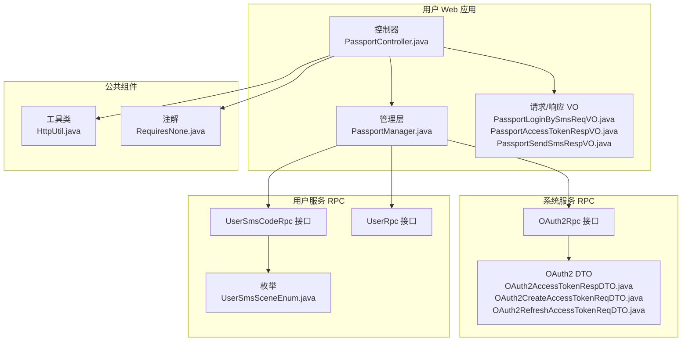
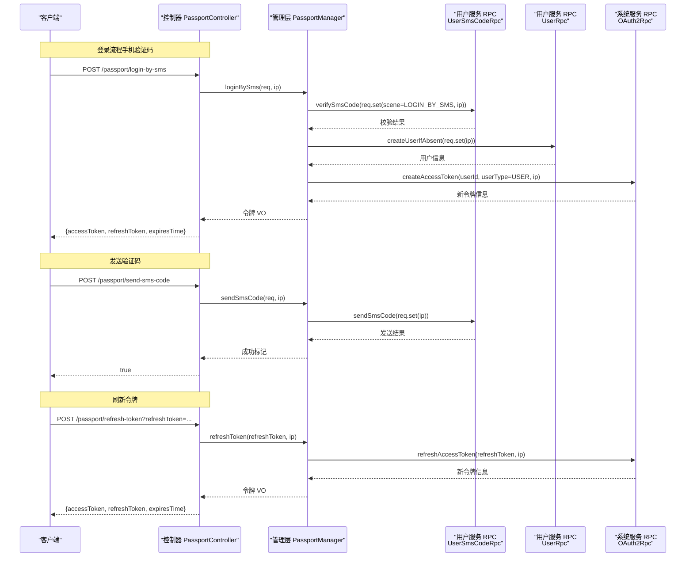
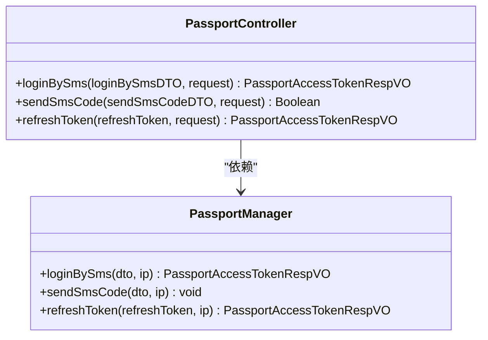
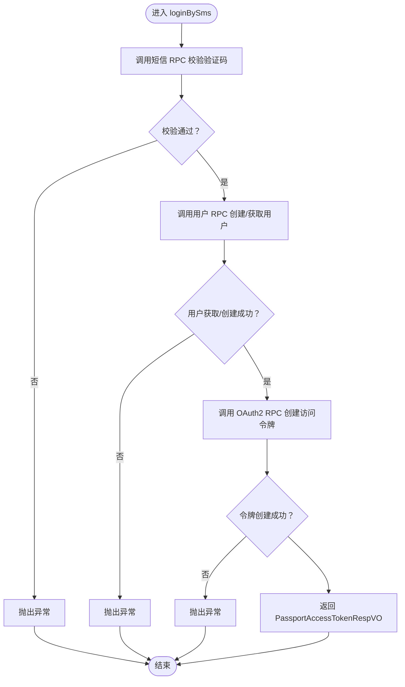
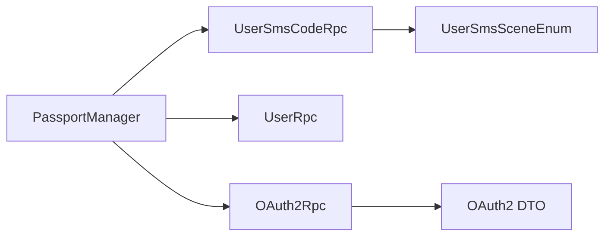
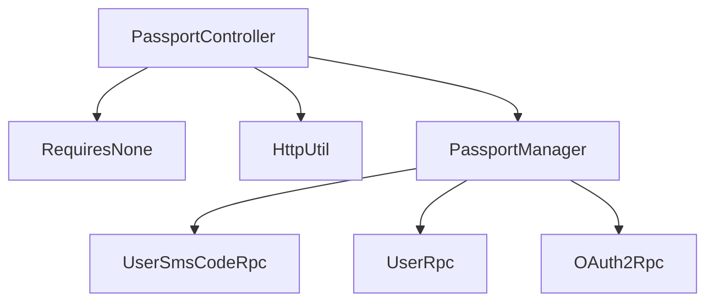

# 用户认证模块

<cite>
**本文引用的文件**
- [shop-web-app/src/main/java/cn/iocoder/mall/shopweb/controller/user/PassportController.java](file://shop-web-app/src/main/java/cn/iocoder/mall/shopweb/controller/user/PassportController.java)
- [management-web-app/src/main/java/cn/iocoder/mall/managementweb/controller/passport/PassportController.java](file://management-web-app/src/main/java/cn/iocoder/mall/managementweb/controller/passport/PassportController.java)
- [shop-web-app/src/main/java/cn/iocoder/mall/shopweb/service/user/PassportManager.java](file://shop-web-app/src/main/java/cn/iocoder/mall/shopweb/service/user/PassportManager.java)
- [shop-web-app/src/main/java/cn/iocoder/mall/shopweb/controller/user/vo/passport/PassportLoginBySmsReqVO.java](file://shop-web-app/src/main/java/cn/iocoder/mall/shopweb/controller/user/vo/passport/PassportLoginBySmsReqVO.java)
- [shop-web-app/src/main/java/cn/iocoder/mall/shopweb/controller/user/vo/passport/PassportAccessTokenRespVO.java](file://shop-web-app/src/main/java/cn/iocoder/mall/shopweb/controller/user/vo/passport/PassportAccessTokenRespVO.java)
- [shop-web-app/src/main/java/cn/iocoder/mall/shopweb/controller/user/vo/passport/PassportSendSmsRespVO.java](file://shop-web-app/src/main/java/cn/iocoder/mall/shopweb/controller/user/vo/passport/PassportSendSmsRespVO.java)
- [common/common-framework/src/main/java/cn/iocoder/common/framework/util/HttpUtil.java](file://common/common-framework/src/main/java/cn/iocoder/common/framework/util/HttpUtil.java)
- [common/mall-security-annotations/src/main/java/cn/iocoder/security/annotations/RequiresNone.java](file://common/mall-security-annotations/src/main/java/cn/iocoder/security/annotations/RequiresNone.java)
- [system-service-project/system-service-api/src/main/java/cn/iotv/mall/systemservice/rpc/oauth/OAuth2Rpc.java](file://system-service-project/system-service-api/src/main/java/cn/iotv/mall/systemservice/rpc/oauth/OAuth2Rpc.java)
- [system-service-project/system-service-api/src/main/java/cn/iotv/mall/systemservice/rpc/oauth/dto/OAuth2AccessTokenRespDTO.java](file://system-service-project/system-service-api/src/main/java/cn/iotv/mall/systemservice/rpc/oauth/dto/OAuth2AccessTokenRespDTO.java)
- [system-service-project/system-service-api/src/main/java/cn/iotv/mall/systemservice/rpc/oauth/dto/OAuth2CreateAccessTokenReqDTO.java](file://system-service-project/system-service-api/src/main/java/cn/iotv/mall/systemservice/rpc/oauth/dto/OAuth2CreateAccessTokenReqDTO.java)
- [system-service-project/system-service-api/src/main/java/cn/iotv/mall/systemservice/rpc/oauth/dto/OAuth2RefreshAccessTokenReqDTO.java](file://system-service-project/system-service-api/src/main/java/cn/iotv/mall/systemservice/rpc/oauth/dto/OAuth2RefreshAccessTokenReqDTO.java)
- [user-service-project/user-service-api/src/main/java/cn/iotv/mall/userservice/rpc/sms/UserSmsCodeRpc.java](file://user-service-project/user-service-api/src/main/java/cn/iotv/mall/userservice/rpc/sms/UserSmsCodeRpc.java)
- [user-service-project/user-service-api/src/main/java/cn/iotv/mall/userservice/rpc/user/UserRpc.java](file://user-service-project/user-service-api/src/main/java/cn/iotv/mall/userservice/rpc/user/UserRpc.java)
- [user-service-project/user-service-api/src/main/java/cn/iotv/mall/userservice/enums/sms/UserSmsSceneEnum.java](file://user-service-project/user-service-api/src/main/java/cn/iotv/mall/userservice/enums/sms/UserSmsSceneEnum.java)
- [user-service-project/user-service-api/src/main/java/cn/iotv/mall/userservice/rpc/user/dto/UserRespDTO.java](file://user-service-project/user-service-api/src/main/java/cn/iotv/mall/userservice/rpc/user/dto/UserRespDTO.java)
</cite>

## 目录
1. [简介](#简介)
2. [项目结构](#项目结构)
3. [核心组件](#核心组件)
4. [架构总览](#架构总览)
5. [详细组件分析](#详细组件分析)
6. [依赖分析](#依赖分析)
7. [性能考虑](#性能考虑)
8. [故障排查指南](#故障排查指南)
9. [结论](#结论)
10. [附录](#附录)

## 简介
本技术文档围绕用户认证模块展开，重点覆盖以下能力：
- 手机验证码登录（/passport/login-by-sms）
- 短信验证码发送（/passport/send-sms-code）
- 访问令牌刷新（/passport/refresh-token）

文档将深入解析控制器 PassportController 的实现逻辑、认证流程设计（短信校验、令牌生成、IP 记录等安全机制）、认证数据模型（请求/响应 VO）、以及与用户服务的集成方式（RPC 调用、权限验证、会话管理）。同时提供完整的使用指南与安全最佳实践。

## 项目结构
用户认证模块主要由三层组成：
- 控制层：对外暴露 REST 接口，负责参数接收、IP 获取与返回封装
- 管理层：业务编排，协调 RPC 调用与结果处理
- 数据模型：请求/响应 VO，定义接口输入输出结构

图表来源
- [shop-web-app/src/main/java/cn/iocoder/mall/shopweb/controller/user/PassportController.java:1-57](file://shop-web-app/src/main/java/cn/iocoder/mall/shopweb/controller/user/PassportController.java#L1-L57)
- [shop-web-app/src/main/java/cn/iocoder/mall/shopweb/service/user/PassportManager.java:1-62](file://shop-web-app/src/main/java/cn/iocoder/mall/shopweb/service/user/PassportManager.java#L1-L62)
- [common/common-framework/src/main/java/cn/iocoder/common/framework/util/HttpUtil.java](file://common/common-framework/src/main/java/cn/iocoder/common/framework/util/HttpUtil.java)
- [common/mall-security-annotations/src/main/java/cn/iocoder/security/annotations/RequiresNone.java](file://common/mall-security-annotations/src/main/java/cn/iocoder/security/annotations/RequiresNone.java)
- [system-service-project/system-service-api/src/main/java/cn/iotv/mall/systemservice/rpc/oauth/OAuth2Rpc.java](file://system-service-project/system-service-api/src/main/java/cn/iotv/mall/systemservice/rpc/oauth/OAuth2Rpc.java)
- [system-service-project/system-service-api/src/main/java/cn/iotv/mall/systemservice/rpc/oauth/dto/OAuth2AccessTokenRespDTO.java](file://system-service-project/system-service-api/src/main/java/cn/iotv/mall/systemservice/rpc/oauth/dto/OAuth2AccessTokenRespDTO.java)
- [system-service-project/system-service-api/src/main/java/cn/iotv/mall/systemservice/rpc/oauth/dto/OAuth2CreateAccessTokenReqDTO.java](file://system-service-project/system-service-api/src/main/java/cn/iotv/mall/systemservice/rpc/oauth/dto/OAuth2CreateAccessTokenReqDTO.java)
- [system-service-project/system-service-api/src/main/java/cn/iotv/mall/systemservice/rpc/oauth/dto/OAuth2RefreshAccessTokenReqDTO.java](file://system-service-project/system-service-api/src/main/java/cn/iotv/mall/systemservice/rpc/oauth/dto/OAuth2RefreshAccessTokenReqDTO.java)
- [user-service-project/user-service-api/src/main/java/cn/iotv/mall/userservice/rpc/sms/UserSmsCodeRpc.java](file://user-service-project/user-service-api/src/main/java/cn/iotv/mall/userservice/rpc/sms/UserSmsCodeRpc.java)
- [user-service-project/user-service-api/src/main/java/cn/iotv/mall/userservice/rpc/user/UserRpc.java](file://user-service-project/user-service-api/src/main/java/cn/iotv/mall/userservice/rpc/user/UserRpc.java)
- [user-service-project/user-service-api/src/main/java/cn/iotv/mall/userservice/enums/sms/UserSmsSceneEnum.java](file://user-service-project/user-service-api/src/main/java/cn/iotv/mall/userservice/enums/sms/UserSmsSceneEnum.java)

章节来源
- [shop-web-app/src/main/java/cn/iocoder/mall/shopweb/controller/user/PassportController.java:1-57](file://shop-web-app/src/main/java/cn/iocoder/mall/shopweb/controller/user/PassportController.java#L1-L57)
- [shop-web-app/src/main/java/cn/iocoder/mall/shopweb/service/user/PassportManager.java:1-62](file://shop-web-app/src/main/java/cn/iocoder/mall/shopweb/service/user/PassportManager.java#L1-L62)

## 核心组件
- 控制器 PassportController（用户侧）：提供 /passport/login-by-sms、/passport/send-sms-code、/passport/refresh-token 三个接口；通过注解控制鉴权策略；通过工具类获取客户端 IP 并传递给管理层。
- 管理层 PassportManager：编排业务流程，依次调用短信 RPC 验证/发送、用户 RPC 创建用户、OAuth2 RPC 创建/刷新访问令牌，并进行错误检查与结果转换。
- 数据模型 VO：
  - PassportLoginBySmsReqVO：手机号、验证码参数校验
  - PassportSendSmsRespVO：手机号、短信场景参数校验
  - PassportAccessTokenRespVO：返回 accessToken、refreshToken、expiresTime

章节来源
- [shop-web-app/src/main/java/cn/iocoder/mall/shopweb/controller/user/PassportController.java:30-54](file://shop-web-app/src/main/java/cn/iocoder/mall/shopweb/controller/user/PassportController.java#L30-L54)
- [shop-web-app/src/main/java/cn/iocoder/mall/shopweb/service/user/PassportManager.java:30-59](file://shop-web-app/src/main/java/cn/iocoder/mall/shopweb/service/user/PassportManager.java#L30-L59)
- [shop-web-app/src/main/java/cn/iocoder/mall/shopweb/controller/user/vo/passport/PassportLoginBySmsReqVO.java:14-30](file://shop-web-app/src/main/java/cn/iocoder/mall/shopweb/controller/user/vo/passport/PassportLoginBySmsReqVO.java#L14-L30)
- [shop-web-app/src/main/java/cn/iocoder/mall/shopweb/controller/user/vo/passport/PassportSendSmsRespVO.java:11-23](file://shop-web-app/src/main/java/cn/iocoder/mall/shopweb/controller/user/vo/passport/PassportSendSmsRespVO.java#L11-L23)
- [shop-web-app/src/main/java/cn/iocoder/mall/shopweb/controller/user/vo/passport/PassportAccessTokenRespVO.java:10-22](file://shop-web-app/src/main/java/cn/iocoder/mall/shopweb/controller/user/vo/passport/PassportAccessTokenRespVO.java#L10-L22)

## 架构总览
用户认证模块采用“控制器-管理层-RPC”分层架构，结合 Dubbo 进行跨服务调用。整体交互如下：

图表来源
- [shop-web-app/src/main/java/cn/iocoder/mall/shopweb/controller/user/PassportController.java:30-54](file://shop-web-app/src/main/java/cn/iocoder/mall/shopweb/controller/user/PassportController.java#L30-L54)
- [shop-web-app/src/main/java/cn/iocoder/mall/shopweb/service/user/PassportManager.java:30-59](file://shop-web-app/src/main/java/cn/iocoder/mall/shopweb/service/user/PassportManager.java#L30-L59)
- [user-service-project/user-service-api/src/main/java/cn/iotv/mall/userservice/rpc/sms/UserSmsCodeRpc.java](file://user-service-project/user-service-api/src/main/java/cn/iotv/mall/userservice/rpc/sms/UserSmsCodeRpc.java)
- [user-service-project/user-service-api/src/main/java/cn/iotv/mall/userservice/rpc/user/UserRpc.java](file://user-service-project/user-service-api/src/main/java/cn/iotv/mall/userservice/rpc/user/UserRpc.java)
- [system-service-project/system-service-api/src/main/java/cn/iotv/mall/systemservice/rpc/oauth/OAuth2Rpc.java](file://system-service-project/system-service-api/src/main/java/cn/iotv/mall/systemservice/rpc/oauth/OAuth2Rpc.java)

## 详细组件分析

### 控制器 PassportController（用户侧）
- 职责
  - 对外暴露 /passport/login-by-sms、/passport/send-sms-code、/passport/refresh-token 接口
  - 使用注解控制鉴权策略（无需登录）
  - 从请求中提取客户端 IP 并传递给管理层
- 关键行为
  - 登录：接收 PassportLoginBySmsReqVO，调用 PassportManager.loginBySms，返回 PassportAccessTokenRespVO
  - 发送验证码：接收 PassportSendSmsRespVO，调用 PassportManager.sendSmsCode，返回布尔成功标记
  - 刷新令牌：接收 refreshToken 参数，调用 PassportManager.refreshToken，返回新的 PassportAccessTokenRespVO

图表来源
- [shop-web-app/src/main/java/cn/iocoder/mall/shopweb/controller/user/PassportController.java:30-54](file://shop-web-app/src/main/java/cn/iocoder/mall/shopweb/controller/user/PassportController.java#L30-L54)
- [shop-web-app/src/main/java/cn/iocoder/mall/shopweb/service/user/PassportManager.java:30-59](file://shop-web-app/src/main/java/cn/iocoder/mall/shopweb/service/user/PassportManager.java#L30-L59)

章节来源
- [shop-web-app/src/main/java/cn/iocoder/mall/shopweb/controller/user/PassportController.java:30-54](file://shop-web-app/src/main/java/cn/iocoder/mall/shopweb/controller/user/PassportController.java#L30-L54)

### 管理层 PassportManager
- 职责
  - 编排登录、发送验证码、刷新令牌的完整流程
  - 统一处理 RPC 调用结果并进行错误检查
- 关键流程
  - 登录（短信）：先校验短信验证码，再确保用户存在（不存在则创建），最后创建访问令牌
  - 发送验证码：直接调用短信 RPC 发送
  - 刷新令牌：调用 OAuth2 RPC 刷新令牌

图表来源
- [shop-web-app/src/main/java/cn/iocoder/mall/shopweb/service/user/PassportManager.java:30-46](file://shop-web-app/src/main/java/cn/iocoder/mall/shopweb/service/user/PassportManager.java#L30-L46)

章节来源
- [shop-web-app/src/main/java/cn/iocoder/mall/shopweb/service/user/PassportManager.java:30-59](file://shop-web-app/src/main/java/cn/iocoder/mall/shopweb/service/user/PassportManager.java#L30-L59)

### 数据模型 VO
- PassportLoginBySmsReqVO
  - 字段：mobile（手机号）、code（验证码）
  - 校验：非空、手机号格式、验证码长度与字符集
- PassportSendSmsRespVO
  - 字段：mobile（手机号）、scene（发送场景）
  - 校验：手机号格式、场景非空
- PassportAccessTokenRespVO
  - 字段：accessToken、refreshToken、expiresTime

章节来源
- [shop-web-app/src/main/java/cn/iocoder/mall/shopweb/controller/user/vo/passport/PassportLoginBySmsReqVO.java:14-30](file://shop-web-app/src/main/java/cn/iocoder/mall/shopweb/controller/user/vo/passport/PassportLoginBySmsReqVO.java#L14-L30)
- [shop-web-app/src/main/java/cn/iocoder/mall/shopweb/controller/user/vo/passport/PassportSendSmsRespVO.java:11-23](file://shop-web-app/src/main/java/cn/iocoder/mall/shopweb/controller/user/vo/passport/PassportSendSmsRespVO.java#L11-L23)
- [shop-web-app/src/main/java/cn/iocoder/mall/shopweb/controller/user/vo/passport/PassportAccessTokenRespVO.java:10-22](file://shop-web-app/src/main/java/cn/iocoder/mall/shopweb/controller/user/vo/passport/PassportAccessTokenRespVO.java#L10-L22)

### 与用户服务的集成
- 短信验证码校验与发送：通过 UserSmsCodeRpc 完成，场景值来自 UserSmsSceneEnum（如 LOGIN_BY_SMS）
- 用户创建/获取：通过 UserRpc createUserIfAbsent 确保用户存在
- 令牌生成/刷新：通过 OAuth2Rpc 完成，包含创建与刷新两个 RPC 接口

图表来源
- [shop-web-app/src/main/java/cn/iocoder/mall/shopweb/service/user/PassportManager.java:23-28](file://shop-web-app/src/main/java/cn/iocoder/mall/shopweb/service/user/PassportManager.java#L23-L28)
- [user-service-project/user-service-api/src/main/java/cn/iotv/mall/userservice/rpc/sms/UserSmsCodeRpc.java](file://user-service-project/user-service-api/src/main/java/cn/iotv/mall/userservice/rpc/sms/UserSmsCodeRpc.java)
- [user-service-project/user-service-api/src/main/java/cn/iotv/mall/userservice/rpc/user/UserRpc.java](file://user-service-project/user-service-api/src/main/java/cn/iotv/mall/userservice/rpc/user/UserRpc.java)
- [system-service-project/system-service-api/src/main/java/cn/iotv/mall/systemservice/rpc/oauth/OAuth2Rpc.java](file://system-service-project/system-service-api/src/main/java/cn/iotv/mall/systemservice/rpc/oauth/OAuth2Rpc.java)
- [user-service-project/user-service-api/src/main/java/cn/iotv/mall/userservice/enums/sms/UserSmsSceneEnum.java](file://user-service-project/user-service-api/src/main/java/cn/iotv/mall/userservice/enums/sms/UserSmsSceneEnum.java)
- [system-service-project/system-service-api/src/main/java/cn/iotv/mall/systemservice/rpc/oauth/dto/OAuth2AccessTokenRespDTO.java](file://system-service-project/system-service-api/src/main/java/cn/iotv/mall/systemservice/rpc/oauth/dto/OAuth2AccessTokenRespDTO.java)
- [system-service-project/system-service-api/src/main/java/cn/iotv/mall/systemservice/rpc/oauth/dto/OAuth2CreateAccessTokenReqDTO.java](file://system-service-project/system-service-api/src/main/java/cn/iotv/mall/systemservice/rpc/oauth/dto/OAuth2CreateAccessTokenReqDTO.java)
- [system-service-project/system-service-api/src/main/java/cn/iotv/mall/systemservice/rpc/oauth/dto/OAuth2RefreshAccessTokenReqDTO.java](file://system-service-project/system-service-api/src/main/java/cn/iotv/mall/systemservice/rpc/oauth/dto/OAuth2RefreshAccessTokenReqDTO.java)

章节来源
- [shop-web-app/src/main/java/cn/iocoder/mall/shopweb/service/user/PassportManager.java:30-59](file://shop-web-app/src/main/java/cn/iocoder/mall/shopweb/service/user/PassportManager.java#L30-L59)

## 依赖分析
- 控制器依赖
  - 注解 RequiresNone：无需登录即可访问
  - 工具类 HttpUtil：获取客户端真实 IP
- 管理层依赖
  - Dubbo 引用 UserSmsCodeRpc、UserRpc、OAuth2Rpc
  - 结果统一通过 checkError() 处理异常
- 数据模型依赖
  - 校验注解（手机号、长度、正则等）保证输入合法性

图表来源
- [common/mall-security-annotations/src/main/java/cn/iocoder/security/annotations/RequiresNone.java](file://common/mall-security-annotations/src/main/java/cn/iocoder/security/annotations/RequiresNone.java)
- [common/common-framework/src/main/java/cn/iocoder/common/framework/util/HttpUtil.java](file://common/common-framework/src/main/java/cn/iocoder/common/framework/util/HttpUtil.java)
- [shop-web-app/src/main/java/cn/iocoder/mall/shopweb/controller/user/PassportController.java:30-54](file://shop-web-app/src/main/java/cn/iocoder/mall/shopweb/controller/user/PassportController.java#L30-L54)
- [shop-web-app/src/main/java/cn/iocoder/mall/shopweb/service/user/PassportManager.java:23-28](file://shop-web-app/src/main/java/cn/iocoder/mall/shopweb/service/user/PassportManager.java#L23-L28)

章节来源
- [common/mall-security-annotations/src/main/java/cn/iocoder/security/annotations/RequiresNone.java](file://common/mall-security-annotations/src/main/java/cn/iocoder/security/annotations/RequiresNone.java)
- [common/common-framework/src/main/java/cn/iocoder/common/framework/util/HttpUtil.java](file://common/common-framework/src/main/java/cn/iocoder/common/framework/util/HttpUtil.java)
- [shop-web-app/src/main/java/cn/iocoder/mall/shopweb/controller/user/PassportController.java:30-54](file://shop-web-app/src/main/java/cn/iocoder/mall/shopweb/controller/user/PassportController.java#L30-L54)
- [shop-web-app/src/main/java/cn/iocoder/mall/shopweb/service/user/PassportManager.java:23-28](file://shop-web-app/src/main/java/cn/iocoder/mall/shopweb/service/user/PassportManager.java#L23-L28)

## 性能考虑
- RPC 调用链路
  - 登录流程涉及三次 RPC 调用（短信校验、用户创建/获取、令牌创建），建议在管理层对失败场景快速短路，避免无效调用
- 缓存与限流
  - 建议对短信发送频率、验证码校验次数进行限流与缓存，降低后端压力
- IP 记录
  - 将客户端 IP 作为风控与审计依据，建议在日志与审计系统中保留

## 故障排查指南
- 常见问题
  - 验证码错误或过期：短信 RPC 校验失败，需检查短信服务与验证码有效期
  - 用户创建失败：用户 RPC 返回异常，需检查用户服务状态
  - 令牌创建/刷新失败：OAuth2 RPC 返回异常，需检查系统服务状态
- 排查步骤
  - 检查控制器到管理层的调用链是否正常
  - 检查各 RPC 服务的可用性与版本配置
  - 查看返回结果中的错误码与错误信息，定位具体环节

章节来源
- [shop-web-app/src/main/java/cn/iocoder/mall/shopweb/service/user/PassportManager.java:30-59](file://shop-web-app/src/main/java/cn/iocoder/mall/shopweb/service/user/PassportManager.java#L30-L59)

## 结论
用户认证模块以清晰的分层设计实现了“短信验证码登录、短信发送、令牌刷新”的核心能力。通过 Dubbo RPC 与 VO 校验，保障了接口的稳定性与安全性。建议在生产环境中配合限流、缓存与完善的日志审计体系，进一步提升系统的可靠性与可运维性。

## 附录

### 接口一览
- 登录（手机验证码）
  - 方法：POST
  - 路径：/passport/login-by-sms
  - 请求体：PassportLoginBySmsReqVO
  - 响应体：PassportAccessTokenRespVO
- 发送短信验证码
  - 方法：POST
  - 路径：/passport/send-sms-code
  - 请求体：PassportSendSmsRespVO
  - 响应体：Boolean（true 表示成功）
- 刷新令牌
  - 方法：POST
  - 路径：/passport/refresh-token
  - 查询参数：refreshToken
  - 响应体：PassportAccessTokenRespVO

章节来源
- [shop-web-app/src/main/java/cn/iocoder/mall/shopweb/controller/user/PassportController.java:30-54](file://shop-web-app/src/main/java/cn/iocoder/mall/shopweb/controller/user/PassportController.java#L30-L54)