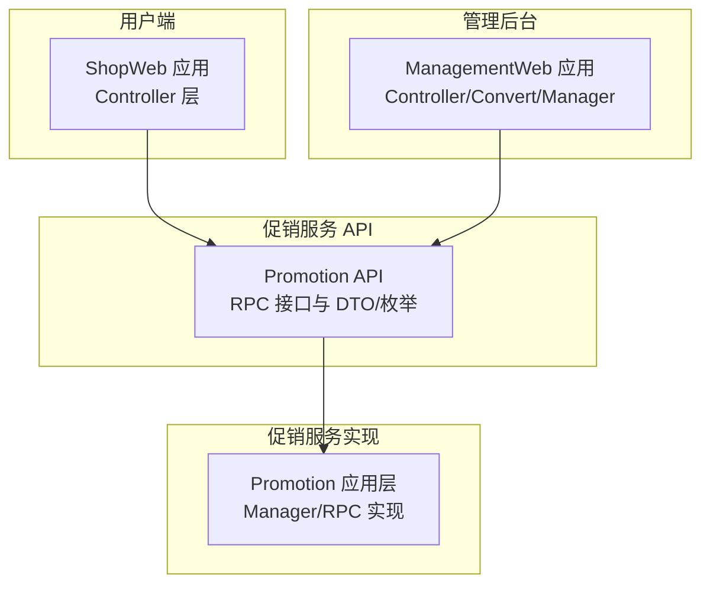
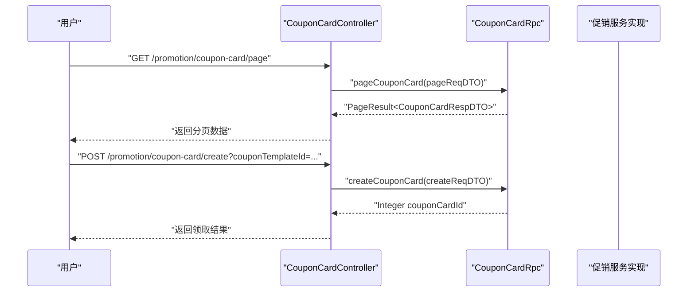
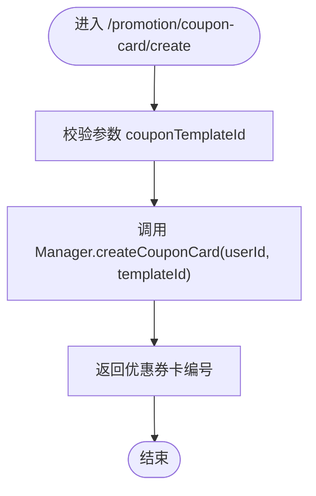
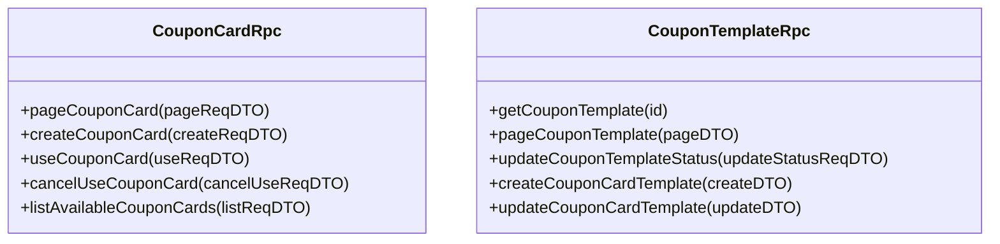
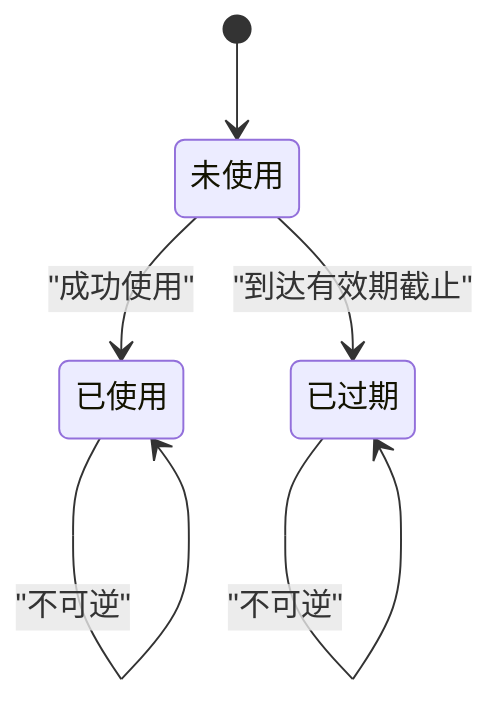
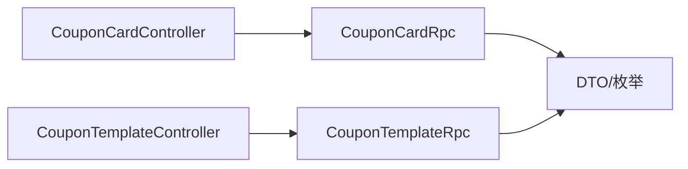

# 优惠券管理

<cite>
**本文引用的文件**
- [CouponCardController.java](file://shop-web-app/src/main/java/cn/iocoder/mall/shopweb/controller/promotion/CouponCardController.java)
- [CouponCardRpc.java](file://promotion-service-project/promotion-service-api/src/main/java/cn/iocoder/mall/promotion/api/rpc/coupon/CouponCardRpc.java)
- [CouponTemplateRpc.java](file://promotion-service-project/promotion-service-api/src/main/java/cn/iocoder/mall/promotion/api/rpc/coupon/CouponTemplateRpc.java)
- [CouponCardStatusEnum.java](file://promotion-service-project/promotion-service-api/src/main/java/cn/iocoder/mall/promotion/api/enums/coupon/card/CouponCardStatusEnum.java)
- [CouponTemplateStatusEnum.java](file://promotion-service-project/promotion-service-api/src/main/java/cn/iocoder/mall/promotion/api/enums/coupon/template/CouponTemplateStatusEnum.java)
- [CouponCardCreateReqDTO.java](file://promotion-service-project/promotion-service-api/src/main/java/cn/iocoder/mall/promotion/api/rpc/coupon/dto/card/CouponCardCreateReqDTO.java)
- [CouponCardPageReqDTO.java](file://promotion-service-project/promotion-service-api/src/main/java/cn/iocoder/mall/promotion/api/rpc/coupon/dto/card/CouponCardPageReqDTO.java)
- [CouponCardAvailableListReqDTO.java](file://promotion-service-project/promotion-service-api/src/main/java/cn/iocoder/mall/promotion/api/rpc/coupon/dto/card/CouponCardAvailableListReqDTO.java)
- [CouponCardUseReqDTO.java](file://promotion-service-project/promotion-service-api/src/main/java/cn/iocoder/mall/promotion/api/rpc/coupon/dto/card/CouponCardUseReqDTO.java)
- [CouponCardCancelUseReqDTO.java](file://promotion-service-project/promotion-service-api/src/main/java/cn/iocoder/mall/promotion/api/rpc/coupon/dto/card/CouponCardCancelUseReqDTO.java)
- [CouponCardAvailableRespDTO.java](file://promotion-service-project/promotion-service-api/src/main/java/cn/iocoder/mall/promotion/api/rpc/coupon/dto/card/CouponCardAvailableRespDTO.java)
- [CouponCardRespDTO.java](file://promotion-service-project/promotion-service-api/src/main/java/cn/iocoder/mall/promotion/api/rpc/coupon/dto/card/CouponCardRespDTO.java)
- [CouponCardTemplateCreateReqDTO.java](file://promotion-service-project/promotion-service-api/src/main/java/cn/iocoder/mall/promotion/api/rpc/coupon/dto/template/CouponCardTemplateCreateReqDTO.java)
- [CouponCardTemplateUpdateReqDTO.java](file://promotion-service-project/promotion-service-api/src/main/java/cn/iocoder/mall/promotion/api/rpc/coupon/dto/template/CouponCardTemplateUpdateReqDTO.java)
- [CouponCardTemplateUpdateStatusReqDTO.java](file://promotion-service-project/promotion-service-api/src/main/java/cn/iocoder/mall/promotion/api/rpc/coupon/dto/template/CouponCardTemplateUpdateStatusReqDTO.java)
- [CouponTemplatePageReqDTO.java](file://promotion-service-project/promotion-service-api/src/main/java/cn/iocoder/mall/promotion/api/rpc/coupon/dto/template/CouponTemplatePageReqDTO.java)
- [CouponTemplateRespDTO.java](file://promotion-service-project/promotion-service-api/src/main/java/cn/iocoder/mall/promotion/api/rpc/coupon/dto/template/CouponTemplateRespDTO.java)
- [CouponTemplateController.java](file://management-web-app/src/main/java/cn/iocoder/mall/managementweb/controller/promotion/coupon/CouponTemplateController.java)
- [CouponTemplateCardCreateReqVO.java](file://management-web-app/src/main/java/cn/iocoder/mall/managementweb/controller/promotion/coupon/vo/template/CouponTemplateCardCreateReqVO.java)
- [CouponTemplateCardUpdateReqVO.java](file://management-web-app/src/main/java/cn/iocoder/mall/managementweb/controller/promotion/coupon/vo/template/CouponTemplateCardUpdateReqVO.java)
- [CouponTemplatePageReqVO.java](file://management-web-app/src/main/java/cn/iocoder/mall/managementweb/controller/promotion/coupon/vo/template/CouponTemplatePageReqVO.java)
- [CouponTemplateRespVO.java](file://management-web-app/src/main/java/cn/iocoder/mall/managementweb/controller/promotion/coupon/vo/template/CouponTemplateRespVO.java)
- [CouponTemplateConvert.java](file://management-web-app/src/main/java/cn/iocoder/mall/managementweb/convert/promotion/CouponTemplateConvert.java)
- [CouponTemplateManager.java](file://management-web-app/src/main/java/cn/iocoder/mall/managementweb/manager/promotion/coupon/CouponTemplateManager.java)
</cite>

## 目录
1. [简介](#简介)
2. [项目结构](#项目结构)
3. [核心组件](#核心组件)
4. [架构总览](#架构总览)
5. [详细组件分析](#详细组件分析)
6. [依赖关系分析](#依赖关系分析)
7. [性能考量](#性能考量)
8. [故障排查指南](#故障排查指南)
9. [结论](#结论)
10. [附录](#附录)

## 简介
本技术文档围绕优惠券管理功能展开，重点覆盖以下方面：
- CouponCardController 的实现与职责边界，包括优惠券模板管理、优惠券发放、使用记录查询等。
- 优惠券数据模型设计，涵盖优惠券模板与优惠券卡的数据结构、字段定义与业务规则。
- 优惠券生命周期管理，从创建、发放、使用到过期的状态流转。
- 优惠券与商品价格计算的集成方式，包括满减条件、折扣规则、适用范围等。
- 优惠券前端展示逻辑，包括领取按钮、使用状态、倒计时等用户体验设计要点。
- 优惠券管理的 API 接口文档与实际使用示例。

## 项目结构
优惠券相关代码分布在多个模块中：
- shop-web-app：面向用户的 Web 控制层，提供优惠券分页、领取等接口。
- promotion-service-api：定义优惠券 RPC 接口与 DTO/枚举。
- promotion-service-app：优惠券服务实现（应用层、管理器、RPC 实现等）。
- management-web-app：管理后台控制层与转换器、管理器，负责优惠券模板的增删改查与状态变更。

图表来源
- [CouponCardController.java:1-44](file://shop-web-app/src/main/java/cn/iocoder/mall/shopweb/controller/promotion/CouponCardController.java#L1-L44)
- [CouponCardRpc.java:1-55](file://promotion-service-project/promotion-service-api/src/main/java/cn/iocoder/mall/promotion/api/rpc/coupon/CouponCardRpc.java#L1-L55)
- [CouponTemplateRpc.java:1-58](file://promotion-service-project/promotion-service-api/src/main/java/cn/iocoder/mall/promotion/api/rpc/coupon/CouponTemplateRpc.java#L1-L58)
- [CouponTemplateController.java](file://management-web-app/src/main/java/cn/iocoder/mall/managementweb/controller/promotion/coupon/CouponTemplateController.java)

章节来源
- [CouponCardController.java:1-44](file://shop-web-app/src/main/java/cn/iocoder/mall/shopweb/controller/promotion/CouponCardController.java#L1-L44)
- [CouponCardRpc.java:1-55](file://promotion-service-project/promotion-service-api/src/main/java/cn/iocoder/mall/promotion/api/rpc/coupon/CouponCardRpc.java#L1-L55)
- [CouponTemplateRpc.java:1-58](file://promotion-service-project/promotion-service-api/src/main/java/cn/iocoder/mall/promotion/api/rpc/coupon/CouponTemplateRpc.java#L1-L58)
- [CouponTemplateController.java](file://management-web-app/src/main/java/cn/iocoder/mall/managementweb/controller/promotion/coupon/CouponTemplateController.java)

## 核心组件
- 用户端控制器：提供优惠券分页查询与领取接口，鉴权要求登录态。
- 促销服务 RPC 接口：定义优惠券卡与模板的 RPC 能力，包括分页、创建、使用、可用列表等。
- 管理后台控制器：提供优惠券模板的 CRUD 与状态更新能力。
- 数据传输对象与枚举：统一定义请求/响应结构与状态、日期类型、范围类型、优惠类型等。

章节来源
- [CouponCardController.java:28-41](file://shop-web-app/src/main/java/cn/iocoder/mall/shopweb/controller/promotion/CouponCardController.java#L28-L41)
- [CouponCardRpc.java:12-54](file://promotion-service-project/promotion-service-api/src/main/java/cn/iocoder/mall/promotion/api/rpc/coupon/CouponCardRpc.java#L12-L54)
- [CouponTemplateRpc.java:10-57](file://promotion-service-project/promotion-service-api/src/main/java/cn/iocoder/mall/promotion/api/rpc/coupon/CouponTemplateRpc.java#L10-L57)

## 架构总览
优惠券管理采用“Web 控制器 → RPC 接口 → 应用实现”的分层架构。用户通过 ShopWeb 控制器发起操作，调用 Promotion API 的 RPC 接口，由应用层实现具体逻辑并持久化。

图表来源
- [CouponCardController.java:28-41](file://shop-web-app/src/main/java/cn/iocoder/mall/shopweb/controller/promotion/CouponCardController.java#L28-L41)
- [CouponCardRpc.java:20-28](file://promotion-service-project/promotion-service-api/src/main/java/cn/iocoder/mall/promotion/api/rpc/coupon/CouponCardRpc.java#L20-L28)

## 详细组件分析

### 用户端控制器：CouponCardController
- 职责
  - 提供优惠券分页查询接口，需登录态。
  - 提供用户领取优惠券接口，传入优惠券模板编号。
- 关键点
  - 分页参数封装为 VO，内部转为 DTO 并调用 Manager。
  - 领取接口通过模板 ID 创建优惠券卡，返回卡编号。
  - 需要鉴权注解保证用户登录态。

图表来源
- [CouponCardController.java:35-41](file://shop-web-app/src/main/java/cn/iocoder/mall/shopweb/controller/promotion/CouponCardController.java#L35-L41)

章节来源
- [CouponCardController.java:28-41](file://shop-web-app/src/main/java/cn/iocoder/mall/shopweb/controller/promotion/CouponCardController.java#L28-L41)

### 促销服务 RPC 接口：CouponCardRpc 与 CouponTemplateRpc
- CouponCardRpc
  - 分页查询优惠券卡、创建优惠券卡、使用/取消使用优惠券卡、查询可用优惠券列表。
- CouponTemplateRpc
  - 获取模板详情、分页查询模板、更新模板状态；包含优惠券模板与优惠码模板的扩展点。

图表来源
- [CouponCardRpc.java:12-54](file://promotion-service-project/promotion-service-api/src/main/java/cn/iocoder/mall/promotion/api/rpc/coupon/CouponCardRpc.java#L12-L54)
- [CouponTemplateRpc.java:10-57](file://promotion-service-project/promotion-service-api/src/main/java/cn/iocoder/mall/promotion/api/rpc/coupon/CouponTemplateRpc.java#L10-L57)

章节来源
- [CouponCardRpc.java:12-54](file://promotion-service-project/promotion-service-api/src/main/java/cn/iocoder/mall/promotion/api/rpc/coupon/CouponCardRpc.java#L12-L54)
- [CouponTemplateRpc.java:10-57](file://promotion-service-project/promotion-service-api/src/main/java/cn/iocoder/mall/promotion/api/rpc/coupon/CouponTemplateRpc.java#L10-L57)

### 数据模型与业务规则

#### 优惠券卡状态枚举：CouponCardStatusEnum
- 状态
  - 未使用、已使用、已过期。
- 用途
  - 标识优惠券卡当前可用性与生命周期阶段。

章节来源
- [CouponCardStatusEnum.java:10-45](file://promotion-service-project/promotion-service-api/src/main/java/cn/iocoder/mall/promotion/api/enums/coupon/card/CouponCardStatusEnum.java#L10-L45)

#### 优惠券模板状态枚举：CouponTemplateStatusEnum
- 状态
  - 生效中、已失效。
- 说明
  - 模板状态影响是否允许继续发放优惠券卡。

章节来源
- [CouponTemplateStatusEnum.java:10-45](file://promotion-service-project/promotion-service-api/src/main/java/cn/iocoder/mall/promotion/api/enums/coupon/template/CouponTemplateStatusEnum.java#L10-L45)

#### 优惠券模板创建 DTO：CouponCardTemplateCreateReqDTO
- 基本信息
  - 标题、描述等。
- 领取规则
  - 每人限领数量、发放总量。
- 使用规则
  - 使用金额门槛（分）、可用范围类型与范围值、生效日期类型与起止时间。
- 使用效果
  - 优惠类型（代金/折扣）、优惠金额（分）、折扣百分比、折扣上限。

章节来源
- [CouponCardTemplateCreateReqDTO.java:23-143](file://promotion-service-project/promotion-service-api/src/main/java/cn/iocoder/mall/promotion/api/rpc/coupon/dto/template/CouponCardTemplateCreateReqDTO.java#L23-L143)

#### 优惠券卡创建 DTO：CouponCardCreateReqDTO
- 字段
  - 用户编号、优惠券模板编号。
- 用途
  - 作为领取接口的请求载体。

章节来源
- [CouponCardCreateReqDTO.java:14-27](file://promotion-service-project/promotion-service-api/src/main/java/cn/iocoder/mall/promotion/api/rpc/coupon/dto/card/CouponCardCreateReqDTO.java#L14-L27)

#### 优惠券卡分页/可用列表/使用/取消使用 DTO
- 分页查询：CouponCardPageReqDTO
- 可用列表：CouponCardAvailableListReqDTO、CouponCardAvailableRespDTO
- 使用/取消使用：CouponCardUseReqDTO、CouponCardCancelUseReqDTO
- 响应模型：CouponCardRespDTO

章节来源
- [CouponCardPageReqDTO.java](file://promotion-service-project/promotion-service-api/src/main/java/cn/iocoder/mall/promotion/api/rpc/coupon/dto/card/CouponCardPageReqDTO.java)
- [CouponCardAvailableListReqDTO.java](file://promotion-service-project/promotion-service-api/src/main/java/cn/iocoder/mall/promotion/api/rpc/coupon/dto/card/CouponCardAvailableListReqDTO.java)
- [CouponCardAvailableRespDTO.java](file://promotion-service-project/promotion-service-api/src/main/java/cn/iocoder/mall/promotion/api/rpc/coupon/dto/card/CouponCardAvailableRespDTO.java)
- [CouponCardUseReqDTO.java](file://promotion-service-project/promotion-service-api/src/main/java/cn/iocoder/mall/promotion/api/rpc/coupon/dto/card/CouponCardUseReqDTO.java)
- [CouponCardCancelUseReqDTO.java](file://promotion-service-project/promotion-service-api/src/main/java/cn/iocoder/mall/promotion/api/rpc/coupon/dto/card/CouponCardCancelUseReqDTO.java)
- [CouponCardRespDTO.java](file://promotion-service-project/promotion-service-api/src/main/java/cn/iocoder/mall/promotion/api/rpc/coupon/dto/card/CouponCardRespDTO.java)

### 生命周期管理：创建 → 发放 → 使用 → 过期
- 创建
  - 管理后台通过模板创建接口生成优惠券模板。
- 发放
  - 用户通过领取接口将模板转化为个人持有的优惠券卡。
- 使用
  - 在满足门槛与适用范围条件下，用户可使用优惠券卡抵扣订单金额。
- 过期
  - 到期后状态变为“已过期”，不再可用。

图表来源
- [CouponCardStatusEnum.java:12-14](file://promotion-service-project/promotion-service-api/src/main/java/cn/iocoder/mall/promotion/api/enums/coupon/card/CouponCardStatusEnum.java#L12-L14)

章节来源
- [CouponCardStatusEnum.java:10-45](file://promotion-service-project/promotion-service-api/src/main/java/cn/iocoder/mall/promotion/api/enums/coupon/card/CouponCardStatusEnum.java#L10-L45)

### 与价格计算的集成
- 满减条件
  - 使用金额门槛（分），订单金额需达到门槛才可使用。
- 折扣规则
  - 支持代金券与折扣券两种类型；折扣券支持折扣上限。
- 适用范围
  - 支持全部可用、部分商品/分类可用或不可用等多种范围类型与范围值组合。

章节来源
- [CouponCardTemplateCreateReqDTO.java:54-141](file://promotion-service-project/promotion-service-api/src/main/java/cn/iocoder/mall/promotion/api/rpc/coupon/dto/template/CouponCardTemplateCreateReqDTO.java#L54-L141)

### 前端展示逻辑建议
- 领取按钮
  - 显示“立即领取”按钮，点击后调用领取接口；若已达领取上限或模板失效则禁用。
- 使用状态
  - 未使用：可选择使用；已使用/已过期：不可用。
- 倒计时显示
  - 展示有效期剩余时间，临近到期可高亮提示。

（本节为概念性设计说明，不直接对应具体源码）

## 依赖关系分析
- 控制器依赖 Manager/RPC 接口进行业务处理。
- DTO/枚举在 API 层统一定义，避免跨模块重复实现。
- 管理后台控制器与转换器、管理器配合完成模板管理。

图表来源
- [CouponCardController.java:25-26](file://shop-web-app/src/main/java/cn/iocoder/mall/shopweb/controller/promotion/CouponCardController.java#L25-L26)
- [CouponTemplateController.java](file://management-web-app/src/main/java/cn/iocoder/mall/managementweb/controller/promotion/coupon/CouponTemplateController.java)
- [CouponCardRpc.java:12-54](file://promotion-service-project/promotion-service-api/src/main/java/cn/iocoder/mall/promotion/api/rpc/coupon/CouponCardRpc.java#L12-L54)
- [CouponTemplateRpc.java:10-57](file://promotion-service-project/promotion-service-api/src/main/java/cn/iocoder/mall/promotion/api/rpc/coupon/CouponTemplateRpc.java#L10-L57)

章节来源
- [CouponCardController.java:25-26](file://shop-web-app/src/main/java/cn/iocoder/mall/shopweb/controller/promotion/CouponCardController.java#L25-L26)
- [CouponTemplateController.java](file://management-web-app/src/main/java/cn/iocoder/mall/managementweb/controller/promotion/coupon/CouponTemplateController.java)

## 性能考量
- 分页查询
  - 使用分页 DTO 限制单页数量，避免一次性加载过多优惠券卡。
- 缓存策略
  - 对模板基础信息与用户可用优惠券列表可做缓存，降低数据库压力。
- 批量操作
  - 在批量发放或查询时，注意数据库索引与 SQL 优化，避免全表扫描。
- 异步任务
  - 对定时过期检查等任务可采用异步执行，减少对主流程的影响。

（本节提供通用指导，不直接分析具体文件）

## 故障排查指南
- 领取失败
  - 检查模板状态是否生效、是否达到每人限领与总量上限。
- 使用失败
  - 核对订单金额是否满足门槛、商品是否在适用范围内、卡状态是否为未使用。
- 分页无数据
  - 确认查询条件与用户 ID 正确，检查数据库是否存在符合条件的记录。

（本节提供通用指导，不直接分析具体文件）

## 结论
本文档系统梳理了优惠券管理的功能边界、数据模型、生命周期与与价格计算的集成方式，并给出了前后端交互与性能优化建议。通过明确的 RPC 接口与 DTO 规范，实现了用户端与管理后台的协同工作，保障了优惠券发放、使用与状态管理的稳定性与一致性。

## 附录

### API 接口清单与示例

- 获取优惠券分页
  - 方法：GET
  - 路径：/promotion/coupon-card/page
  - 认证：需要登录态
  - 示例：调用后返回分页结果，包含优惠券卡列表与分页信息

- 用户领取优惠券
  - 方法：POST
  - 路径：/promotion/coupon-card/create
  - 参数：couponTemplateId（模板编号）
  - 认证：需要登录态
  - 示例：成功返回优惠券卡编号

章节来源
- [CouponCardController.java:28-41](file://shop-web-app/src/main/java/cn/iocoder/mall/shopweb/controller/promotion/CouponCardController.java#L28-L41)