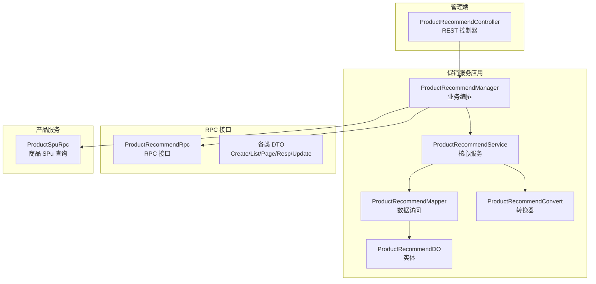
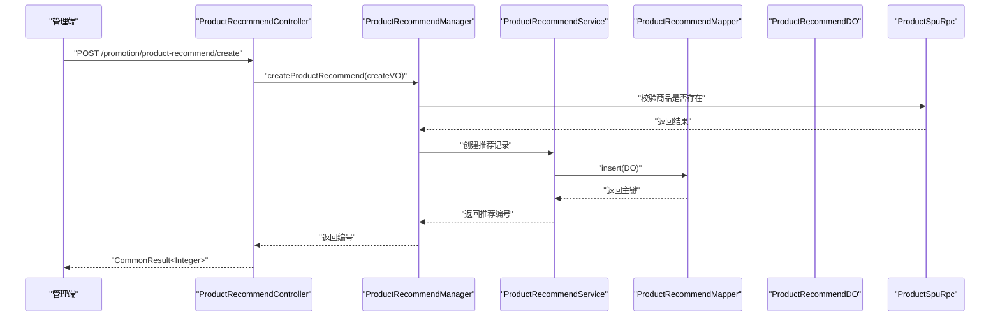
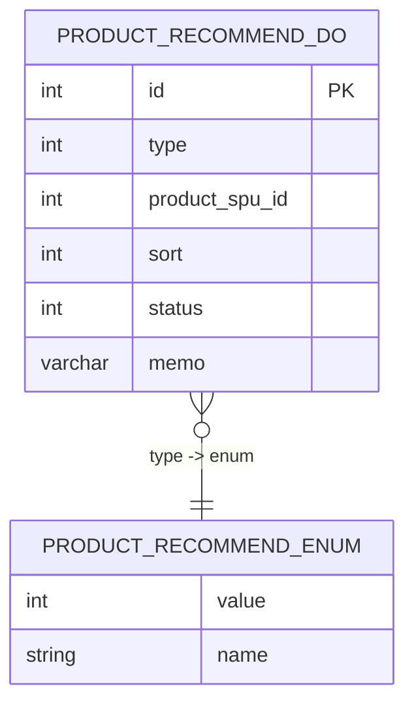
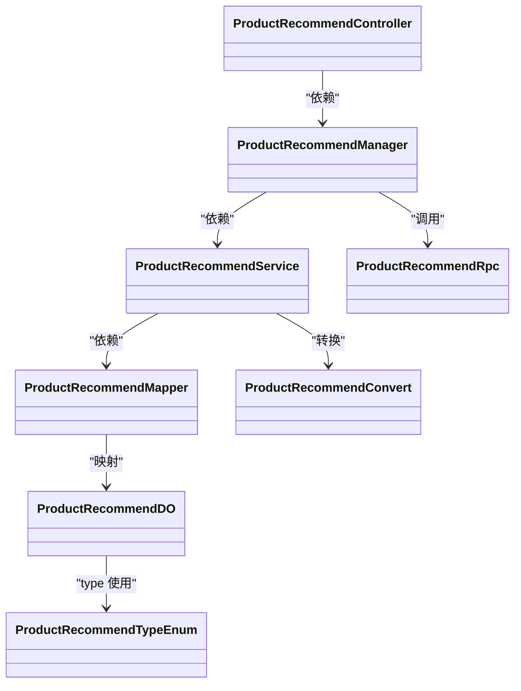

# 商品推荐

<cite>
**本文引用的文件**
- [ProductRecommendController.java](file://management-web-app/src/main/java/cn/iocoder/mall/managementweb/controller/promotion/recommend/ProductRecommendController.java)
- [ProductRecommendCreateReqVO.java](file://management-web-app/src/main/java/cn/iocoder/mall/managementweb/controller/promotion/recommend/vo/ProductRecommendCreateReqVO.java)
- [ProductRecommendDetailVO.java](file://management-web-app/src/main/java/cn/iocoder/mall/managementweb/controller/promotion/recommend/vo/ProductRecommendDetailVO.java)
- [ProductRecommendPageReqVO.java](file://management-web-app/src/main/java/cn/iocoder/mall/managementweb/controller/promotion/recommend/vo/ProductRecommendPageReqVO.java)
- [ProductRecommendManager.java](file://promotion-service-project/promotion-service-app/src/main/java/cn/iocoder/mall/promotionservice/manager/recommend/ProductRecommendManager.java)
- [ProductRecommendService.java](file://promotion-service-project/promotion-service-app/src/main/java/cn/iocoder/mall/promotionservice/service/recommend/ProductRecommendService.java)
- [ProductRecommendMapper.java](file://promotion-service-project/promotion-service-app/src/main/java/cn/iocoder/mall/promotionservice/dal/mysql/mapper/recommend/ProductRecommendMapper.java)
- [ProductRecommendDO.java](file://promotion-service-project/promotion-service-app/src/main/java/cn/iocoder/mall/promotionservice/dal/mysql/dataobject/recommend/ProductRecommendDO.java)
- [ProductRecommendConvert.java](file://promotion-service-project/promotion-service-app/src/main/java/cn/iocoder/mall/promotionservice/convert/recommend/ProductRecommendConvert.java)
- [ProductRecommendRpc.java](file://promotion-service-project/promotion-service-api/src/main/java/cn/iocoder/mall/promotion/api/rpc/recommend/ProductRecommendRpc.java)
- [ProductRecommendCreateReqDTO.java](file://promotion-service-project/promotion-service-api/src/main/java/cn/iocoder/mall/promotion/api/rpc/recommend/dto/ProductRecommendCreateReqDTO.java)
- [ProductRecommendListReqDTO.java](file://promotion-service-project/promotion-service-api/src/main/java/cn/iocoder/mall/promotion/api/rpc/recommend/dto/ProductRecommendListReqDTO.java)
- [ProductRecommendPageReqDTO.java](file://promotion-service-project/promotion-service-api/src/main/java/cn/iocoder/mall/promotion/api/rpc/recommend/dto/ProductRecommendPageReqDTO.java)
- [ProductRecommendRespDTO.java](file://promotion-service-project/promotion-service-api/src/main/java/cn/iocoder/mall/promotion/api/rpc/recommend/dto/ProductRecommendRespDTO.java)
- [ProductRecommendUpdateReqDTO.java](file://promotion-service-project/promotion-service-api/src/main/java/cn/iocoder/mall/promotion/api/rpc/recommend/dto/ProductRecommendUpdateReqDTO.java)
- [ProductRecommendTypeEnum.java](file://promotion-service-project/promotion-service-api/src/main/java/cn/iocoder/mall/promotion/api/enums/recommend/ProductRecommendTypeEnum.java)
</cite>

## 目录
1. [简介](#简介)
2. [项目结构](#项目结构)
3. [核心组件](#核心组件)
4. [架构总览](#架构总览)
5. [详细组件分析](#详细组件分析)
6. [依赖分析](#依赖分析)
7. [性能考虑](#性能考虑)
8. [故障排查指南](#故障排查指南)
9. [结论](#结论)
10. [附录](#附录)

## 简介
本技术文档围绕商品推荐功能展开，重点覆盖以下方面：
- 管理端控制器与业务流程：商品推荐的增删改查、分页与校验
- 数据模型设计：推荐位与推荐商品的持久化结构及枚举约束
- 推荐算法现状与扩展建议：协同过滤、基于内容的推荐、热门商品推荐
- 性能优化：缓存策略、异步更新、批量处理
- 展示逻辑：推荐位布局、商品卡片样式、点击追踪
- API 接口文档与效果监控方法

## 项目结构
商品推荐功能由“管理端 Web 控制器 + 促销服务应用层 + RPC 接口 + 数据访问层”构成，采用分层清晰的微服务架构。

图表来源
- [ProductRecommendController.java:24-60](file://management-web-app/src/main/java/cn/iocoder/mall/managementweb/controller/promotion/recommend/ProductRecommendController.java#L24-L60)
- [ProductRecommendManager.java:22-66](file://promotion-service-project/promotion-service-app/src/main/java/cn/iocoder/mall/promotionservice/manager/recommend/ProductRecommendManager.java#L22-L66)
- [ProductRecommendService.java:22-93](file://promotion-service-project/promotion-service-app/src/main/java/cn/iocoder/mall/promotionservice/service/recommend/ProductRecommendService.java#L22-L93)
- [ProductRecommendMapper.java:15-33](file://promotion-service-project/promotion-service-app/src/main/java/cn/iocoder/mall/promotionservice/dal/mysql/mapper/recommend/ProductRecommendMapper.java#L15-L33)
- [ProductRecommendDO.java:13-48](file://promotion-service-project/promotion-service-app/src/main/java/cn/iocoder/mall/promotionservice/dal/mysql/dataobject/recommend/ProductRecommendDO.java#L13-L48)
- [ProductRecommendConvert.java:15-29](file://promotion-service-project/promotion-service-app/src/main/java/cn/iocoder/mall/promotionservice/convert/recommend/ProductRecommendConvert.java#L15-L29)
- [ProductRecommendRpc.java](file://promotion-service-project/promotion-service-api/src/main/java/cn/iocoder/mall/promotion/api/rpc/recommend/ProductRecommendRpc.java)
- [ProductRecommendCreateReqDTO.java](file://promotion-service-project/promotion-service-api/src/main/java/cn/iocoder/mall/promotion/api/rpc/recommend/dto/ProductRecommendCreateReqDTO.java)
- [ProductRecommendListReqDTO.java](file://promotion-service-project/promotion-service-api/src/main/java/cn/iocoder/mall/promotion/api/rpc/recommend/dto/ProductRecommendListReqDTO.java)
- [ProductRecommendPageReqDTO.java](file://promotion-service-project/promotion-service-api/src/main/java/cn/iocoder/mall/promotion/api/rpc/recommend/dto/ProductRecommendPageReqDTO.java)
- [ProductRecommendRespDTO.java](file://promotion-service-project/promotion-service-api/src/main/java/cn/iocoder/mall/promotion/api/rpc/recommend/dto/ProductRecommendRespDTO.java)
- [ProductRecommendUpdateReqDTO.java](file://promotion-service-project/promotion-service-api/src/main/java/cn/iocoder/mall/promotion/api/rpc/recommend/dto/ProductRecommendUpdateReqDTO.java)

章节来源
- [ProductRecommendController.java:24-60](file://management-web-app/src/main/java/cn/iocoder/mall/managementweb/controller/promotion/recommend/ProductRecommendController.java#L24-L60)
- [ProductRecommendManager.java:22-66](file://promotion-service-project/promotion-service-app/src/main/java/cn/iocoder/mall/promotionservice/manager/recommend/ProductRecommendManager.java#L22-L66)
- [ProductRecommendService.java:22-93](file://promotion-service-project/promotion-service-app/src/main/java/cn/iocoder/mall/promotionservice/service/recommend/ProductRecommendService.java#L22-L93)
- [ProductRecommendMapper.java:15-33](file://promotion-service-project/promotion-service-app/src/main/java/cn/iocoder/mall/promotionservice/dal/mysql/mapper/recommend/ProductRecommendMapper.java#L15-L33)
- [ProductRecommendDO.java:13-48](file://promotion-service-project/promotion-service-app/src/main/java/cn/iocoder/mall/promotionservice/dal/mysql/dataobject/recommend/ProductRecommendDO.java#L13-L48)
- [ProductRecommendConvert.java:15-29](file://promotion-service-project/promotion-service-app/src/main/java/cn/iocoder/mall/promotionservice/convert/recommend/ProductRecommendConvert.java#L15-L29)
- [ProductRecommendRpc.java](file://promotion-service-project/promotion-service-api/src/main/java/cn/iocoder/mall/promotion/api/rpc/recommend/ProductRecommendRpc.java)
- [ProductRecommendCreateReqDTO.java](file://promotion-service-project/promotion-service-api/src/main/java/cn/iocoder/mall/promotion/api/rpc/recommend/dto/ProductRecommendCreateReqDTO.java)
- [ProductRecommendListReqDTO.java](file://promotion-service-project/promotion-service-api/src/main/java/cn/iocoder/mall/promotion/api/rpc/recommend/dto/ProductRecommendListReqDTO.java)
- [ProductRecommendPageReqDTO.java](file://promotion-service-project/promotion-service-api/src/main/java/cn/iocoder/mall/promotion/api/rpc/recommend/dto/ProductRecommendPageReqDTO.java)
- [ProductRecommendRespDTO.java](file://promotion-service-project/promotion-service-api/src/main/java/cn/iocoder/mall/promotion/api/rpc/recommend/dto/ProductRecommendRespDTO.java)
- [ProductRecommendUpdateReqDTO.java](file://promotion-service-project/promotion-service-api/src/main/java/cn/iocoder/mall/promotion/api/rpc/recommend/dto/ProductRecommendUpdateReqDTO.java)

## 核心组件
- 管理端控制器：提供创建、更新、删除、分页查询接口，负责参数校验与返回封装
- 业务编排层（Manager）：调用商品服务校验商品存在性，协调服务层完成持久化
- 服务层（Service）：执行推荐位的增删改查、重复性校验与分页查询
- 数据访问层（Mapper/DO）：MyBatis-Plus 映射与分页查询
- 转换器（Convert）：DO 与 DTO 的映射
- RPC 接口与 DTO：跨模块通信契约
- 推荐类型枚举：定义推荐位类型（如热卖、新品）

章节来源
- [ProductRecommendController.java:24-60](file://management-web-app/src/main/java/cn/iocoder/mall/managementweb/controller/promotion/recommend/ProductRecommendController.java#L24-L60)
- [ProductRecommendManager.java:22-66](file://promotion-service-project/promotion-service-app/src/main/java/cn/iocoder/mall/promotionservice/manager/recommend/ProductRecommendManager.java#L22-L66)
- [ProductRecommendService.java:22-93](file://promotion-service-project/promotion-service-app/src/main/java/cn/iocoder/mall/promotionservice/service/recommend/ProductRecommendService.java#L22-L93)
- [ProductRecommendMapper.java:15-33](file://promotion-service-project/promotion-service-app/src/main/java/cn/iocoder/mall/promotionservice/dal/mysql/mapper/recommend/ProductRecommendMapper.java#L15-L33)
- [ProductRecommendDO.java:13-48](file://promotion-service-project/promotion-service-app/src/main/java/cn/iocoder/mall/promotionservice/dal/mysql/dataobject/recommend/ProductRecommendDO.java#L13-L48)
- [ProductRecommendConvert.java:15-29](file://promotion-service-project/promotion-service-app/src/main/java/cn/iocoder/mall/promotionservice/convert/recommend/ProductRecommendConvert.java#L15-L29)
- [ProductRecommendTypeEnum.java:10-53](file://promotion-service-project/promotion-service-api/src/main/java/cn/iocoder/mall/promotion/api/enums/recommend/ProductRecommendTypeEnum.java#L10-L53)

## 架构总览
下图展示了从管理端到服务层再到数据存储的整体调用链路。

图表来源
- [ProductRecommendController.java:33-37](file://management-web-app/src/main/java/cn/iocoder/mall/managementweb/controller/promotion/recommend/ProductRecommendController.java#L33-L37)
- [ProductRecommendManager.java:40-44](file://promotion-service-project/promotion-service-app/src/main/java/cn/iocoder/mall/promotionservice/manager/recommend/ProductRecommendManager.java#L40-L44)
- [ProductRecommendService.java:57-66](file://promotion-service-project/promotion-service-app/src/main/java/cn/iocoder/mall/promotionservice/service/recommend/ProductRecommendService.java#L57-L66)
- [ProductRecommendMapper.java:15-33](file://promotion-service-project/promotion-service-app/src/main/java/cn/iocoder/mall/promotionservice/dal/mysql/mapper/recommend/ProductRecommendMapper.java#L15-L33)
- [ProductRecommendDO.java:13-48](file://promotion-service-project/promotion-service-app/src/main/java/cn/iocoder/mall/promotionservice/dal/mysql/dataobject/recommend/ProductRecommendDO.java#L13-L48)

## 详细组件分析

### 数据模型设计
- 实体类 ProductRecommendDO：包含主键、推荐类型、SPU 编号、排序、状态、备注等字段，并继承通用可删除基类
- 枚举 ProductRecommendTypeEnum：定义推荐类型数组与校验逻辑（热卖、新品）
- DTO 与 VO：用于 RPC 传输与管理端展示，包含类型、SPU 编号、排序、状态、备注等字段

图表来源
- [ProductRecommendDO.java:13-48](file://promotion-service-project/promotion-service-app/src/main/java/cn/iocoder/mall/promotionservice/dal/mysql/dataobject/recommend/ProductRecommendDO.java#L13-L48)
- [ProductRecommendTypeEnum.java:10-53](file://promotion-service-project/promotion-service-api/src/main/java/cn/iocoder/mall/promotion/api/enums/recommend/ProductRecommendTypeEnum.java#L10-L53)

章节来源
- [ProductRecommendDO.java:13-48](file://promotion-service-project/promotion-service-app/src/main/java/cn/iocoder/mall/promotionservice/dal/mysql/dataobject/recommend/ProductRecommendDO.java#L13-L48)
- [ProductRecommendTypeEnum.java:10-53](file://promotion-service-project/promotion-service-api/src/main/java/cn/iocoder/mall/promotion/api/enums/recommend/ProductRecommendTypeEnum.java#L10-L53)

### 推荐算法实现原理
当前仓库中未包含具体的推荐算法实现代码。根据推荐类型枚举，系统支持“热卖推荐”和“新品推荐”。推荐算法的扩展建议如下：
- 基于用户行为的协同过滤：通过用户购买/浏览历史计算相似度，生成候选集
- 基于内容的推荐：利用商品属性（品牌、分类、标签）进行向量匹配
- 热门商品推荐：按销量、评分或近期热度排序
- 混合策略：加权融合多策略结果并引入多样性与新颖性控制

上述策略为概念性说明，不对应具体源码文件。

### 推荐系统的性能优化
- 缓存策略：对热门推荐位与商品详情进行缓存，降低数据库压力；使用分布式缓存（Redis）实现热点命中
- 异步更新：对写操作（新增/更新/删除）采用消息队列异步落库，提升响应速度
- 批量处理：批量拉取推荐商品列表，减少网络往返；分页加载与懒加载结合
- 数据库优化：为 type、product_spu_id、status 建立索引，优化分页与条件查询

以上为通用优化建议，不对应具体源码文件。

### 推荐商品的展示逻辑
- 推荐位布局：按推荐类型（热卖/新品）划分区域，支持拖拽排序与上下架控制
- 商品卡片样式：统一图片、标题、价格、销量/评分展示，支持占位图与懒加载
- 点击追踪：埋点统计曝光、点击、购买转化，用于后续算法优化与效果评估

以上为交互与埋点设计建议，不对应具体源码文件。

### API 接口文档
- 创建商品推荐
  - 方法：POST
  - 路径：/promotion/product-recommend/create
  - 请求体：ProductRecommendCreateReqVO（类型、SPU 编号、排序、状态、备注）
  - 返回：CommonResult<Integer>（推荐编号）
- 更新商品推荐
  - 方法：POST
  - 路径：/promotion/product-recommend/update
  - 请求体：ProductRecommendUpdateReqDTO
  - 返回：CommonResult<Boolean>
- 删除商品推荐
  - 方法：POST
  - 路径：/promotion/product-recommend/delete
  - 参数：productRecommendId（推荐编号）
  - 返回：CommonResult<Boolean>
- 分页查询
  - 方法：GET
  - 路径：/promotion/product-recommend/page
  - 参数：ProductRecommendPageReqDTO
  - 返回：CommonResult<PageResult<ProductRecommendDetailVO>>

章节来源
- [ProductRecommendController.java:33-58](file://management-web-app/src/main/java/cn/iocoder/mall/managementweb/controller/promotion/recommend/ProductRecommendController.java#L33-L58)
- [ProductRecommendCreateReqVO.java:12-33](file://management-web-app/src/main/java/cn/iocoder/mall/managementweb/controller/promotion/recommend/vo/ProductRecommendCreateReqVO.java#L12-L33)
- [ProductRecommendDetailVO.java:12-20](file://management-web-app/src/main/java/cn/iocoder/mall/managementweb/controller/promotion/recommend/vo/ProductRecommendDetailVO.java#L12-L20)
- [ProductRecommendPageReqVO.java:13-20](file://management-web-app/src/main/java/cn/iocoder/mall/managementweb/controller/promotion/recommend/vo/ProductRecommendPageReqVO.java#L13-L20)
- [ProductRecommendRpc.java](file://promotion-service-project/promotion-service-api/src/main/java/cn/iocoder/mall/promotion/api/rpc/recommend/ProductRecommendRpc.java)
- [ProductRecommendCreateReqDTO.java](file://promotion-service-project/promotion-service-api/src/main/java/cn/iocoder/mall/promotion/api/rpc/recommend/dto/ProductRecommendCreateReqDTO.java)
- [ProductRecommendListReqDTO.java](file://promotion-service-project/promotion-service-api/src/main/java/cn/iocoder/mall/promotion/api/rpc/recommend/dto/ProductRecommendListReqDTO.java)
- [ProductRecommendPageReqDTO.java](file://promotion-service-project/promotion-service-api/src/main/java/cn/iocoder/mall/promotion/api/rpc/recommend/dto/ProductRecommendPageReqDTO.java)
- [ProductRecommendRespDTO.java](file://promotion-service-project/promotion-service-api/src/main/java/cn/iocoder/mall/promotion/api/rpc/recommend/dto/ProductRecommendRespDTO.java)
- [ProductRecommendUpdateReqDTO.java](file://promotion-service-project/promotion-service-api/src/main/java/cn/iocoder/mall/promotion/api/rpc/recommend/dto/ProductRecommendUpdateReqDTO.java)

## 依赖分析
- 控制器依赖业务编排层，编排层依赖服务层与商品 RPC，服务层依赖 Mapper 与转换器，Mapper 依赖 DO
- 推荐类型通过枚举统一校验，避免非法值进入数据库
- DTO 与 VO 在不同模块间传递，确保接口契约稳定

图表来源
- [ProductRecommendController.java:24-60](file://management-web-app/src/main/java/cn/iocoder/mall/managementweb/controller/promotion/recommend/ProductRecommendController.java#L24-L60)
- [ProductRecommendManager.java:22-66](file://promotion-service-project/promotion-service-app/src/main/java/cn/iocoder/mall/promotionservice/manager/recommend/ProductRecommendManager.java#L22-L66)
- [ProductRecommendService.java:22-93](file://promotion-service-project/promotion-service-app/src/main/java/cn/iocoder/mall/promotionservice/service/recommend/ProductRecommendService.java#L22-L93)
- [ProductRecommendMapper.java:15-33](file://promotion-service-project/promotion-service-app/src/main/java/cn/iocoder/mall/promotionservice/dal/mysql/mapper/recommend/ProductRecommendMapper.java#L15-L33)
- [ProductRecommendDO.java:13-48](file://promotion-service-project/promotion-service-app/src/main/java/cn/iocoder/mall/promotionservice/dal/mysql/dataobject/recommend/ProductRecommendDO.java#L13-L48)
- [ProductRecommendConvert.java:15-29](file://promotion-service-project/promotion-service-app/src/main/java/cn/iocoder/mall/promotionservice/convert/recommend/ProductRecommendConvert.java#L15-L29)
- [ProductRecommendRpc.java](file://promotion-service-project/promotion-service-api/src/main/java/cn/iocoder/mall/promotion/api/rpc/recommend/ProductRecommendRpc.java)
- [ProductRecommendTypeEnum.java:10-53](file://promotion-service-project/promotion-service-api/src/main/java/cn/iocoder/mall/promotion/api/enums/recommend/ProductRecommendTypeEnum.java#L10-L53)

## 性能考虑
- 缓存：热门推荐位与商品详情缓存，设置合理过期时间与失效策略
- 异步：写操作异步化，保证接口低延迟
- 批量：批量获取推荐商品列表，减少网络请求次数
- 分页：服务端分页，避免一次性加载过多数据
- 索引：在 type、product_spu_id、status 上建立索引，提升查询效率

以上为通用性能建议，不对应具体源码文件。

## 故障排查指南
- 商品不存在：当传入的 SPU 编号无效时，抛出“商品不存在”的业务异常
- 重复推荐：同一 SPU+类型 已存在时，抛出“已存在”的业务异常
- 记录不存在：更新或删除不存在的推荐记录时，抛出“不存在”的业务异常
- 参数校验：类型与状态需符合枚举范围，否则返回参数校验错误

章节来源
- [ProductRecommendManager.java:58-64](file://promotion-service-project/promotion-service-app/src/main/java/cn/iocoder/mall/promotionservice/manager/recommend/ProductRecommendManager.java#L58-L64)
- [ProductRecommendService.java:57-91](file://promotion-service-project/promotion-service-app/src/main/java/cn/iocoder/mall/promotionservice/service/recommend/ProductRecommendService.java#L57-L91)
- [ProductRecommendTypeEnum.java:40-46](file://promotion-service-project/promotion-service-api/src/main/java/cn/iocoder/mall/promotion/api/enums/recommend/ProductRecommendTypeEnum.java#L40-L46)

## 结论
本仓库实现了商品推荐的基础 CRUD 与分页能力，配合推荐类型枚举与商品存在性校验，满足管理端对推荐位的配置需求。推荐算法与展示逻辑在当前代码中尚未实现，建议在现有数据模型与 RPC 契约基础上，按业务场景引入协同过滤、内容推荐与热门策略，并配套缓存、异步与批量优化以提升性能与稳定性。

## 附录
- 推荐类型枚举：热卖推荐、新品推荐
- 关键字段：类型、SPU 编号、排序、状态、备注
- 建议扩展：算法策略、缓存与异步、埋点与监控