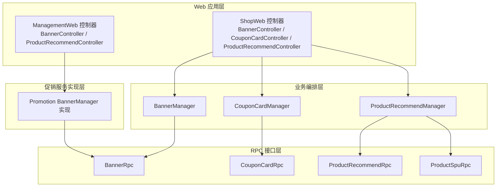
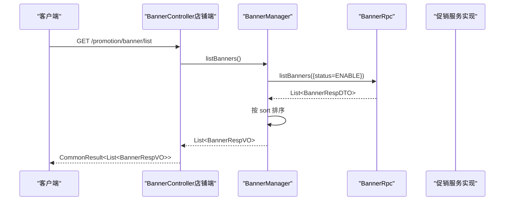
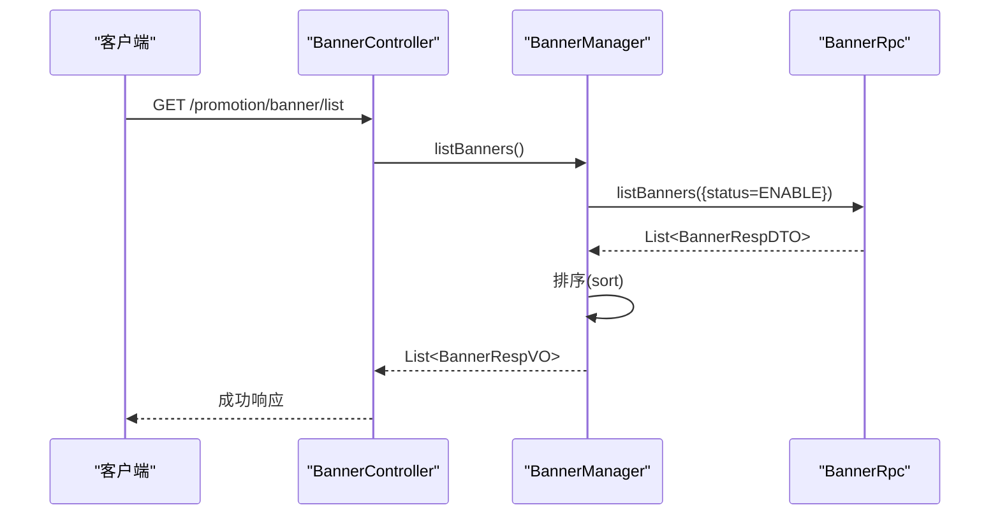
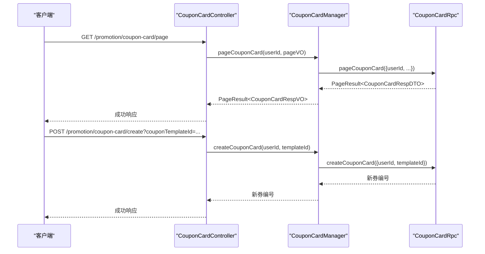
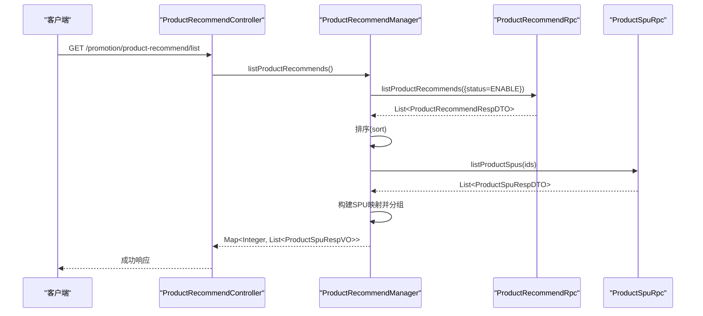
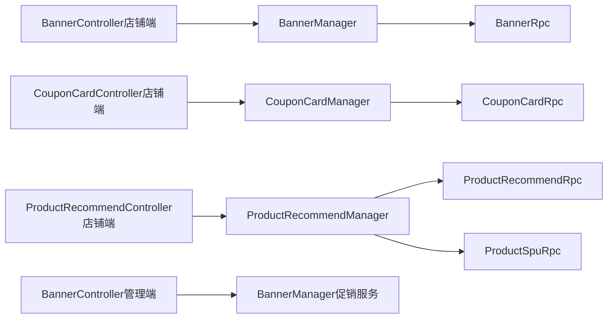

# 营销活动模块

<cite>
**本文引用的文件**
- [BannerController（店铺端）](file://shop-web-app/src/main/java/cn/iocoder/mall/shopweb/controller/promotion/BannerController.java)
- [CouponCardController（店铺端）](file://shop-web-app/src/main/java/cn/iocoder/mall/shopweb/controller/promotion/CouponCardController.java)
- [ProductRecommendController（店铺端）](file://shop-web-app/src/main/java/cn/iocoder/mall/shopweb/controller/promotion/ProductRecommendController.java)
- [BannerController（管理端）](file://management-web-app/src/main/java/cn/iocoder/mall/managementweb/controller/promotion/brand/BannerController.java)
- [ProductRecommendController（管理端）](file://management-web-app/src/main/java/cn/iocoder/mall/managementweb/controller/promotion/recommend/ProductRecommendController.java)
- [BannerManager（店铺端）](file://shop-web-app/src/main/java/cn/iocoder/mall/shopweb/service/promotion/BannerManager.java)
- [CouponCardManager（店铺端）](file://shop-web-app/src/main/java/cn/iocoder/mall/shopweb/service/promotion/CouponCardManager.java)
- [ProductRecommendManager（店铺端）](file://shop-web-app/src/main/java/cn/iocoder/mall/shopweb/service/promotion/ProductRecommendManager.java)
- [BannerManager（促销服务）](file://promotion-service-project/promotion-service-app/src/main/java/cn/iocoder/mall/promotionservice/manager/banner/BannerManager.java)
- [ProductRecommendManager（促销服务）](file://promotion-service-project/promotion-service-app/src/main/java/cn/iocoder/mall/promotionservice/manager/recommend/ProductRecommendManager.java)
- [BannerRpc 接口定义](file://promotion-service-project/promotion-service-api/src/main/java/cn/iocoder/mall/promotion/api/rpc/banner/BannerRpc.java)
- [CouponCardRpc 接口定义](file://promotion-service-project/promotion-service-api/src/main/java/cn/iocoder/mall/promotion/api/rpc/coupon/CouponCardRpc.java)
- [ProductRecommendRpc 接口定义](file://promotion-service-project/promotion-service-api/src/main/java/cn/iocoder/mall/promotion/api/rpc/recommend/ProductRecommendRpc.java)
- [ProductSpuRpc 接口定义](file://product-service-project/product-service-api/src/main/java/cn/iocoder/mall/productservice/api/rpc/spu/ProductSpuRpc.java)
- [CommonResult 响应封装](file://common/common-framework/src/main/java/cn/iocoder/common/framework/vo/CommonResult.java)
- [PageResult 分页封装](file://common/common-framework/src/main/java/cn/iocoder/common/framework/vo/PageResult.java)
- [CommonStatusEnum 状态枚举](file://common/common-framework/src/main/java/cn/iocoder/common/framework/enums/CommonStatusEnum.java)
- [UserSecurityContextHolder 用户上下文](file://shop-web-app/src/main/java/cn/iocoder/mall/shopweb/controller/promotion/CouponCardController.java)
</cite>

## 目录
1. [简介](#简介)
2. [项目结构](#项目结构)
3. [核心组件](#核心组件)
4. [架构总览](#架构总览)
5. [详细组件分析](#详细组件分析)
6. [依赖分析](#依赖分析)
7. [性能考虑](#性能考虑)
8. [故障排查指南](#故障排查指南)
9. [结论](#结论)
10. [附录](#附录)

## 简介
本技术文档聚焦于商城营销活动模块，系统性阐述首页轮播图、优惠券管理、商品推荐等营销能力在前端应用层的实现与集成方式。文档覆盖以下内容：
- 控制器职责：BannerController、CouponCardController、ProductRecommendController 的功能边界与对外接口
- 业务编排：各模块在 Web 层的 Manager 类如何通过 RPC 调用促销服务，完成营销数据获取与状态管理
- 数据模型：Banner、CouponCard、ProductRecommend 等营销资源的数据结构与转换关系
- 用户体验：轮播展示、优惠券领取、智能推荐的交互流程与实现要点
- 集成方式：基于 Dubbo 的 RPC 调用、分页与状态过滤、多 RPC 并行拉取与聚合
- 使用指南与调试方法：接口测试、权限控制、常见问题定位

## 项目结构
营销活动模块主要由三层构成：
- Web 应用层（shop-web-app、management-web-app）：暴露 HTTP 接口，负责鉴权、参数校验、分页与响应封装
- 业务编排层（shop-web-app/service/promotion）：封装 RPC 调用、参数转换、排序与聚合逻辑
- 服务实现层（promotion-service-app）：促销服务的具体实现，提供 Banner、优惠券、推荐等 RPC 能力

图表来源
- [BannerController（店铺端）:1-34](file://shop-web-app/src/main/java/cn/iocoder/mall/shopweb/controller/promotion/BannerController.java#L1-L34)
- [CouponCardController（店铺端）:1-44](file://shop-web-app/src/main/java/cn/iocoder/mall/shopweb/controller/promotion/CouponCardController.java#L1-L44)
- [ProductRecommendController（店铺端）:1-35](file://shop-web-app/src/main/java/cn/iocoder/mall/shopweb/controller/promotion/ProductRecommendController.java#L1-L35)
- [BannerController（管理端）:1-66](file://management-web-app/src/main/java/cn/iocoder/mall/managementweb/controller/promotion/brand/BannerController.java#L1-L66)
- [ProductRecommendController（管理端）](file://management-web-app/src/main/java/cn/iocoder/mall/managementweb/controller/promotion/recommend/ProductRecommendController.java)
- [BannerManager（店铺端）:1-38](file://shop-web-app/src/main/java/cn/iocoder/mall/shopweb/service/promotion/BannerManager.java#L1-L38)
- [CouponCardManager（店铺端）:1-52](file://shop-web-app/src/main/java/cn/iocoder/mall/shopweb/service/promotion/CouponCardManager.java#L1-L52)
- [ProductRecommendManager（店铺端）:1-59](file://shop-web-app/src/main/java/cn/iocoder/mall/shopweb/service/promotion/ProductRecommendManager.java#L1-L59)
- [BannerManager（促销服务）:1-43](file://promotion-service-project/promotion-service-app/src/main/java/cn/iocoder/mall/promotionservice/manager/banner/BannerManager.java#L1-L43)
- [BannerRpc 接口定义](file://promotion-service-project/promotion-service-api/src/main/java/cn/iocoder/mall/promotion/api/rpc/banner/BannerRpc.java)
- [CouponCardRpc 接口定义](file://promotion-service-project/promotion-service-api/src/main/java/cn/iocoder/mall/promotion/api/rpc/coupon/CouponCardRpc.java)
- [ProductRecommendRpc 接口定义](file://promotion-service-project/promotion-service-api/src/main/java/cn/iocoder/mall/promotion/api/rpc/recommend/ProductRecommendRpc.java)
- [ProductSpuRpc 接口定义](file://product-service-project/product-service-api/src/main/java/cn/iocoder/mall/productservice/api/rpc/spu/ProductSpuRpc.java)

章节来源
- [BannerController（店铺端）:1-34](file://shop-web-app/src/main/java/cn/iocoder/mall/shopweb/controller/promotion/BannerController.java#L1-L34)
- [CouponCardController（店铺端）:1-44](file://shop-web-app/src/main/java/cn/iocoder/mall/shopweb/controller/promotion/CouponCardController.java#L1-L44)
- [ProductRecommendController（店铺端）:1-35](file://shop-web-app/src/main/java/cn/iocoder/mall/shopweb/controller/promotion/ProductRecommendController.java#L1-L35)
- [BannerController（管理端）:1-66](file://management-web-app/src/main/java/cn/iocoder/mall/managementweb/controller/promotion/brand/BannerController.java#L1-L66)
- [ProductRecommendController（管理端）](file://management-web-app/src/main/java/cn/iocoder/mall/managementweb/controller/promotion/recommend/ProductRecommendController.java)
- [BannerManager（店铺端）:1-38](file://shop-web-app/src/main/java/cn/iocoder/mall/shopweb/service/promotion/BannerManager.java#L1-L38)
- [CouponCardManager（店铺端）:1-52](file://shop-web-app/src/main/java/cn/iocoder/mall/shopweb/service/promotion/CouponCardManager.java#L1-L52)
- [ProductRecommendManager（店铺端）:1-59](file://shop-web-app/src/main/java/cn/iocoder/mall/shopweb/service/promotion/ProductRecommendManager.java#L1-L59)
- [BannerManager（促销服务）:1-43](file://promotion-service-project/promotion-service-app/src/main/java/cn/iocoder/mall/promotionservice/manager/banner/BannerManager.java#L1-L43)

## 核心组件
- BannerController（店铺端）
  - 提供轮播图列表查询接口，内部通过 BannerManager 拉取启用状态的轮播并按 sort 排序返回
- CouponCardController（店铺端）
  - 提供优惠券分页查询与领取接口；领取需登录态，通过 CouponCardManager 调用 RPC 完成
- ProductRecommendController（店铺端）
  - 提供商品推荐列表查询接口，内部通过 ProductRecommendManager 拉取推荐配置并聚合商品详情
- BannerController（管理端）
  - 提供轮播图的增删改查与分页接口，基于 BannerManager 实现
- ProductRecommendController（管理端）
  - 提供推荐位的增删改查与分页接口，用于配置推荐类型与商品映射

章节来源
- [BannerController（店铺端）:27-31](file://shop-web-app/src/main/java/cn/iocoder/mall/shopweb/controller/promotion/BannerController.java#L27-L31)
- [CouponCardController（店铺端）:28-41](file://shop-web-app/src/main/java/cn/iocoder/mall/shopweb/controller/promotion/CouponCardController.java#L28-L41)
- [ProductRecommendController（店铺端）:28-32](file://shop-web-app/src/main/java/cn/iocoder/mall/shopweb/controller/promotion/ProductRecommendController.java#L28-L32)
- [BannerController（管理端）:34-63](file://management-web-app/src/main/java/cn/iocoder/mall/managementweb/controller/promotion/brand/BannerController.java#L34-L63)
- [ProductRecommendController（管理端）](file://management-web-app/src/main/java/cn/iocoder/mall/managementweb/controller/promotion/recommend/ProductRecommendController.java)

## 架构总览
营销模块采用“Web 控制器 → 业务编排 Manager → RPC 服务”的分层架构。Web 层负责鉴权与参数校验，Manager 层负责 RPC 调用、数据转换与聚合，服务层提供具体营销能力。

图表来源
- [BannerController（店铺端）:27-31](file://shop-web-app/src/main/java/cn/iocoder/mall/shopweb/controller/promotion/BannerController.java#L27-L31)
- [BannerManager（店铺端）:27-35](file://shop-web-app/src/main/java/cn/iocoder/mall/shopweb/service/promotion/BannerManager.java#L27-L35)
- [BannerRpc 接口定义](file://promotion-service-project/promotion-service-api/src/main/java/cn/iocoder/mall/promotion/api/rpc/banner/BannerRpc.java)
- [BannerManager（促销服务）:34-36](file://promotion-service-project/promotion-service-app/src/main/java/cn/iocoder/mall/promotionservice/manager/banner/BannerManager.java#L34-L36)

## 详细组件分析

### BannerController（店铺端）
- 职责
  - 对外提供轮播图列表查询接口，内部委托 BannerManager 完成数据拉取与排序
- 关键流程
  - 参数：无
  - 处理：调用 BannerManager.listBanners，传入启用状态过滤
  - 返回：CommonResult 包裹的 BannerRespVO 列表
- 错误处理
  - 通过 CommonResult.checkError() 统一错误检查
- 性能与优化
  - 仅按 sort 字段排序，避免复杂计算
  - 过滤启用状态减少无效数据传输

图表来源
- [BannerController（店铺端）:27-31](file://shop-web-app/src/main/java/cn/iocoder/mall/shopweb/controller/promotion/BannerController.java#L27-L31)
- [BannerManager（店铺端）:27-35](file://shop-web-app/src/main/java/cn/iocoder/mall/shopweb/service/promotion/BannerManager.java#L27-L35)

章节来源
- [BannerController（店铺端）:1-34](file://shop-web-app/src/main/java/cn/iocoder/mall/shopweb/controller/promotion/BannerController.java#L1-L34)
- [BannerManager（店铺端）:1-38](file://shop-web-app/src/main/java/cn/iocoder/mall/shopweb/service/promotion/BannerManager.java#L1-L38)
- [CommonResult 响应封装](file://common/common-framework/src/main/java/cn/iocoder/common/framework/vo/CommonResult.java)
- [CommonStatusEnum 状态枚举](file://common/common-framework/src/main/java/cn/iocoder/common/framework/enums/CommonStatusEnum.java)

### CouponCardController（店铺端）
- 职责
  - 提供优惠券分页查询与领取接口，依赖登录态
- 关键流程
  - 分页查询：获取当前用户 ID，调用 CouponCardManager.pageCouponCard
  - 领取优惠券：校验模板 ID，调用 CouponCardManager.createCouponCard
- 权限与安全
  - 使用 @RequiresAuthenticate 注解确保登录态
  - 用户 ID 来自 UserSecurityContextHolder
- 错误处理
  - 通过 CommonResult.checkError() 统一错误检查

图表来源
- [CouponCardController（店铺端）:28-41](file://shop-web-app/src/main/java/cn/iocoder/mall/shopweb/controller/promotion/CouponCardController.java#L28-L41)
- [CouponCardManager（店铺端）:30-49](file://shop-web-app/src/main/java/cn/iocoder/mall/shopweb/service/promotion/CouponCardManager.java#L30-L49)
- [CouponCardRpc 接口定义](file://promotion-service-project/promotion-service-api/src/main/java/cn/iocoder/mall/promotion/api/rpc/coupon/CouponCardRpc.java)
- [UserSecurityContextHolder 用户上下文](file://shop-web-app/src/main/java/cn/iocoder/mall/shopweb/controller/promotion/CouponCardController.java)

章节来源
- [CouponCardController（店铺端）:1-44](file://shop-web-app/src/main/java/cn/iocoder/mall/shopweb/controller/promotion/CouponCardController.java#L1-L44)
- [CouponCardManager（店铺端）:1-52](file://shop-web-app/src/main/java/cn/iocoder/mall/shopweb/service/promotion/CouponCardManager.java#L1-L52)
- [UserSecurityContextHolder 用户上下文](file://shop-web-app/src/main/java/cn/iocoder/mall/shopweb/controller/promotion/CouponCardController.java)

### ProductRecommendController（店铺端）
- 职责
  - 提供商品推荐列表查询接口，内部聚合推荐配置与商品详情
- 关键流程
  - 获取推荐配置列表（启用状态，按 sort 排序）
  - 批量拉取商品详情（SPU），构建映射
  - 将商品详情按推荐类型进行分组返回
- 性能与优化
  - 使用批量 RPC 拉取商品详情，减少多次往返
  - 使用 Multimap 进行分组，避免重复遍历

图表来源
- [ProductRecommendController（店铺端）:28-32](file://shop-web-app/src/main/java/cn/iocoder/mall/shopweb/controller/promotion/ProductRecommendController.java#L28-L32)
- [ProductRecommendManager（店铺端）:36-49](file://shop-web-app/src/main/java/cn/iocoder/mall/shopweb/service/promotion/ProductRecommendManager.java#L36-L49)
- [ProductRecommendRpc 接口定义](file://promotion-service-project/promotion-service-api/src/main/java/cn/iocoder/mall/promotion/api/rpc/recommend/ProductRecommendRpc.java)
- [ProductSpuRpc 接口定义](file://product-service-project/product-service-api/src/main/java/cn/iocoder/mall/productservice/api/rpc/spu/ProductSpuRpc.java)

章节来源
- [ProductRecommendController（店铺端）:1-35](file://shop-web-app/src/main/java/cn/iocoder/mall/shopweb/controller/promotion/ProductRecommendController.java#L1-L35)
- [ProductRecommendManager（店铺端）:1-59](file://shop-web-app/src/main/java/cn/iocoder/mall/shopweb/service/promotion/ProductRecommendManager.java#L1-L59)

### BannerController（管理端）
- 职责
  - 提供轮播图的创建、更新、删除、分页查询接口，基于 BannerManager 实现
- 权限控制
  - 使用 @RequiresPermissions 注解控制操作权限
- 流程概览
  - 创建：BannerManager.createBanner
  - 更新：BannerManager.updateBanner
  - 删除：BannerManager.deleteBanner
  - 分页：BannerManager.pageBanner

章节来源
- [BannerController（管理端）:1-66](file://management-web-app/src/main/java/cn/iocoder/mall/managementweb/controller/promotion/brand/BannerController.java#L1-L66)
- [BannerManager（促销服务）:22-40](file://promotion-service-project/promotion-service-app/src/main/java/cn/iocoder/mall/promotionservice/manager/banner/BannerManager.java#L22-L40)

### ProductRecommendController（管理端）
- 职责
  - 提供推荐位的创建、更新、删除、分页查询接口，用于配置推荐类型与商品映射
- 流程概览
  - 创建、更新、删除、分页：委托对应 Manager 实现

章节来源
- [ProductRecommendController（管理端）](file://management-web-app/src/main/java/cn/iocoder/mall/managementweb/controller/promotion/recommend/ProductRecommendController.java)

## 依赖分析
- 控制器到 Manager
  - BannerController → BannerManager
  - CouponCardController → CouponCardManager
  - ProductRecommendController → ProductRecommendManager
- Manager 到 RPC
  - BannerManager → BannerRpc
  - CouponCardManager → CouponCardRpc
  - ProductRecommendManager → ProductRecommendRpc、ProductSpuRpc
- 管理端控制器到服务实现
  - BannerController（管理端） → BannerManager（促销服务）实现
- 公共依赖
  - CommonResult、PageResult、CommonStatusEnum 提供统一响应与状态

图表来源
- [BannerController（店铺端）:1-34](file://shop-web-app/src/main/java/cn/iocoder/mall/shopweb/controller/promotion/BannerController.java#L1-L34)
- [CouponCardController（店铺端）:1-44](file://shop-web-app/src/main/java/cn/iocoder/mall/shopweb/controller/promotion/CouponCardController.java#L1-L44)
- [ProductRecommendController（店铺端）:1-35](file://shop-web-app/src/main/java/cn/iocoder/mall/shopweb/controller/promotion/ProductRecommendController.java#L1-L35)
- [BannerController（管理端）:1-66](file://management-web-app/src/main/java/cn/iocoder/mall/managementweb/controller/promotion/brand/BannerController.java#L1-L66)
- [BannerManager（店铺端）:1-38](file://shop-web-app/src/main/java/cn/iocoder/mall/shopweb/service/promotion/BannerManager.java#L1-L38)
- [CouponCardManager（店铺端）:1-52](file://shop-web-app/src/main/java/cn/iocoder/mall/shopweb/service/promotion/CouponCardManager.java#L1-L52)
- [ProductRecommendManager（店铺端）:1-59](file://shop-web-app/src/main/java/cn/iocoder/mall/shopweb/service/promotion/ProductRecommendManager.java#L1-L59)
- [BannerManager（促销服务）:1-43](file://promotion-service-project/promotion-service-app/src/main/java/cn/iocoder/mall/promotionservice/manager/banner/BannerManager.java#L1-L43)
- [BannerRpc 接口定义](file://promotion-service-project/promotion-service-api/src/main/java/cn/iocoder/mall/promotion/api/rpc/banner/BannerRpc.java)
- [CouponCardRpc 接口定义](file://promotion-service-project/promotion-service-api/src/main/java/cn/iocoder/mall/promotion/api/rpc/coupon/CouponCardRpc.java)
- [ProductRecommendRpc 接口定义](file://promotion-service-project/promotion-service-api/src/main/java/cn/iocoder/mall/promotion/api/rpc/recommend/ProductRecommendRpc.java)
- [ProductSpuRpc 接口定义](file://product-service-project/product-service-api/src/main/java/cn/iocoder/mall/productservice/api/rpc/spu/ProductSpuRpc.java)

## 性能考虑
- 减少网络往返
  - 商品推荐场景中，先拉取推荐配置，再批量查询商品详情，避免逐条查询
- 合理排序
  - Banner 与推荐均按 sort 字段排序，保证展示顺序稳定且开销低
- 状态过滤
  - 仅请求启用状态的资源，降低无效数据传输
- 分页与缓存
  - 优惠券分页接口支持分页参数，结合前端缓存策略可进一步提升体验

## 故障排查指南
- 常见错误
  - RPC 调用失败：检查 CommonResult.checkError() 是否抛出异常
  - 登录态缺失：确认 @RequiresAuthenticate 注解是否生效，UserSecurityContextHolder 是否正确注入
  - 权限不足：确认管理端接口的 @RequiresPermissions 是否满足
- 排查步骤
  - 查看控制器返回的 CommonResult 状态码与错误信息
  - 检查 BannerManager、CouponCardManager、ProductRecommendManager 的 RPC 调用链路
  - 核对 Banner、优惠券、推荐配置的状态与排序字段
- 建议
  - 在本地或开发环境开启日志，定位 RPC 调用耗时与失败原因
  - 对批量查询场景增加超时与重试策略（如适用）

章节来源
- [CommonResult 响应封装](file://common/common-framework/src/main/java/cn/iocoder/common/framework/vo/CommonResult.java)
- [CouponCardController（店铺端）](file://shop-web-app/src/main/java/cn/iocoder/mall/shopweb/controller/promotion/CouponCardController.java)
- [BannerController（管理端）:34-63](file://management-web-app/src/main/java/cn/iocoder/mall/managementweb/controller/promotion/brand/BannerController.java#L34-L63)

## 结论
营销活动模块通过清晰的分层设计与 RPC 集成，实现了轮播图、优惠券与商品推荐三大核心能力。Web 层负责鉴权与参数校验，Manager 层完成 RPC 调用与数据聚合，服务层提供稳定的营销能力支撑。该架构具备良好的扩展性与可维护性，便于后续新增营销活动类型与优化性能。

## 附录
- 使用指南
  - 轮播图：调用 GET /promotion/banner/list 获取启用状态的轮播列表
  - 优惠券：登录后调用 GET /promotion/coupon-card/page 获取分页，POST /promotion/coupon-card/create 领取指定模板
  - 商品推荐：调用 GET /promotion/product-recommend/list 获取按类型分组的商品推荐
- 开发调试
  - 使用 http-client.env.json 或 Postman 调试接口
  - 管理端接口需具备相应权限，参考 @RequiresPermissions 注解
  - 关注 CommonResult.checkError() 的错误提示，结合日志定位问题