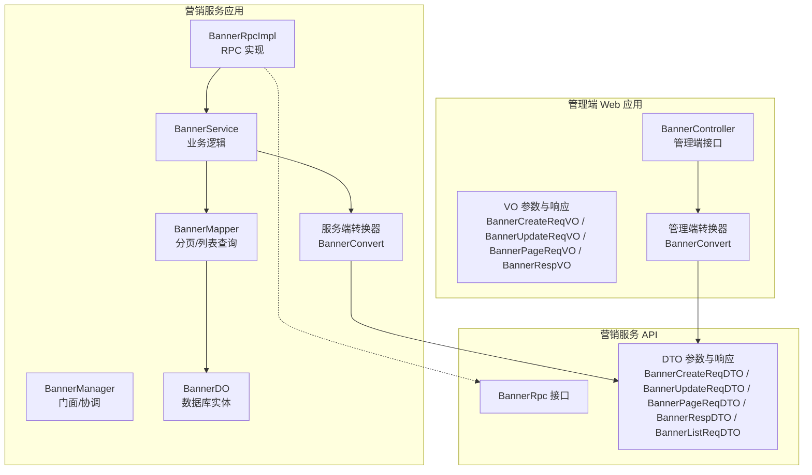
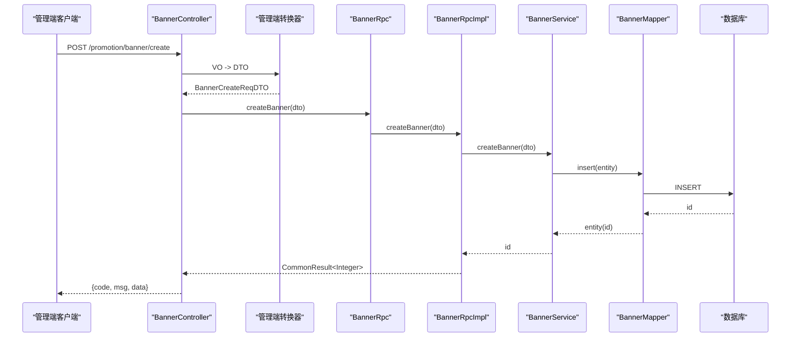
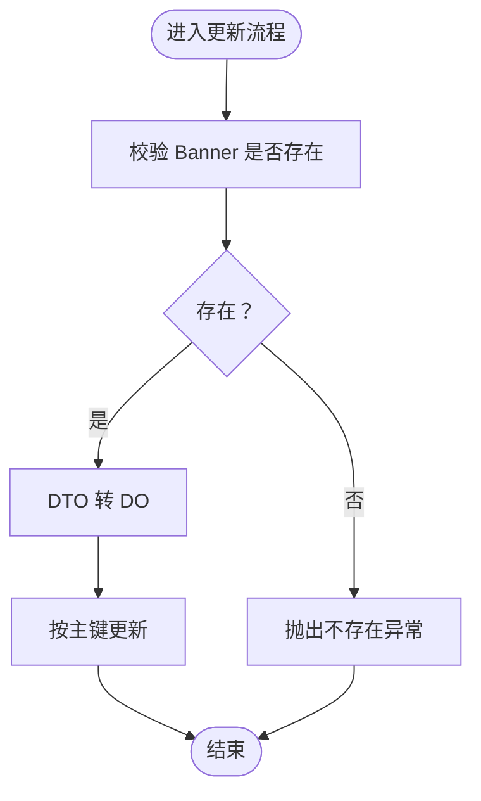
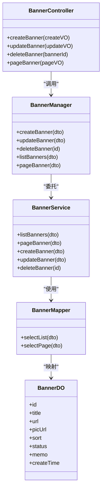
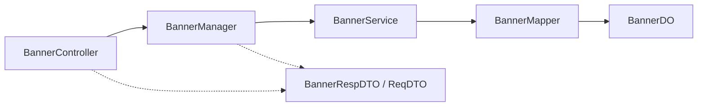

# 轮播图管理

<cite>
**本文引用的文件**
- [BannerController.java](file://management-web-app/src/main/java/cn/iocoder/mall/managementweb/controller/promotion/brand/BannerController.java)
- [BannerCreateReqVO.java](file://management-web-app/src/main/java/cn/iocoder/mall/managementweb/controller/promotion/brand/vo/BannerCreateReqVO.java)
- [BannerUpdateReqVO.java](file://management-web-app/src/main/java/cn/iocoder/mall/managementweb/controller/promotion/brand/vo/BannerUpdateReqVO.java)
- [BannerPageReqVO.java](file://management-web-app/src/main/java/cn/iocoder/mall/managementweb/controller/promotion/brand/vo/BannerPageReqVO.java)
- [BannerRespVO.java](file://management-web-app/src/main/java/cn/iocoder/mall/managementweb/controller/promotion/brand/vo/BannerRespVO.java)
- [BannerConvert.java（管理端）](file://management-web-app/src/main/java/cn/iocoder/mall/managementweb/convert/promotion/BannerConvert.java)
- [BannerRpc.java](file://promotion-service-project/promotion-service-api/src/main/java/cn/iocoder/mall/promotion/api/rpc/banner/BannerRpc.java)
- [BannerCreateReqDTO.java](file://promotion-service-project/promotion-service-api/src/main/java/cn/iocoder/mall/promotion/api/rpc/banner/dto/BannerCreateReqDTO.java)
- [BannerUpdateReqDTO.java](file://promotion-service-project/promotion-service-api/src/main/java/cn/iocoder/mall/promotion/api/rpc/banner/dto/BannerUpdateReqDTO.java)
- [BannerListReqDTO.java](file://promotion-service-project/promotion-service-api/src/main/java/cn/iocoder/mall/promotion/api/rpc/banner/dto/BannerListReqDTO.java)
- [BannerPageReqDTO.java](file://promotion-service-project/promotion-service-api/src/main/java/cn/iocoder/mall/promotion/api/rpc/banner/dto/BannerPageReqDTO.java)
- [BannerRespDTO.java](file://promotion-service-project/promotion-service-api/src/main/java/cn/iocoder/mall/promotion/api/rpc/banner/dto/BannerRespDTO.java)
- [BannerManager.java](file://promotion-service-project/promotion-service-app/src/main/java/cn/iocoder/mall/promotionservice/manager/banner/BannerManager.java)
- [BannerService.java](file://promotion-service-project/promotion-service-app/src/main/java/cn/iocoder/mall/promotionservice/service/banner/BannerService.java)
- [BannerDO.java](file://promotion-service-project/promotion-service-app/src/main/java/cn/iocoder/mall/promotionservice/dal/mysql/dataobject/banner/BannerDO.java)
- [BannerMapper.java](file://promotion-service-project/promotion-service-app/src/main/java/cn/iocoder/mall/promotionservice/dal/mysql/mapper/banner/BannerMapper.java)
- [BannerConvert.java（服务端）](file://promotion-service-project/promotion-service-app/src/main/java/cn/iocoder/mall/promotionservice/convert/banner/BannerConvert.java)
- [BannerRpcImpl.java](file://promotion-service-project/promotion-service-app/src/main/java/cn/iocoder/mall/promotionservice/rpc/banner/BannerRpcImpl.java)
- [CommonStatusEnum.java](file://common/common-framework/src/main/java/cn/iocoder/common/framework/enums/CommonStatusEnum.java)
- [CommonResult.java](file://common/common-framework/src/main/java/cn/iocoder/common/framework/vo/CommonResult.java)
- [PageResult.java](file://common/common-framework/src/main/java/cn/iocoder/common/framework/vo/PageResult.java)
- [PageParam.java](file://common/common-framework/src/main/java/cn/iocoder/common/framework/vo/PageParam.java)
- [InEnum.java](file://common/common-framework/src/main/java/cn/iocoder/common/framework/validator/InEnum.java)
- [ShopWeb BannerController.java](file://shop-web-app/src/main/java/cn/iocoder/mall/shopweb/controller/promotion/BannerController.java)
</cite>

## 目录
1. [简介](#简介)
2. [项目结构](#项目结构)
3. [核心组件](#核心组件)
4. [架构总览](#架构总览)
5. [详细组件分析](#详细组件分析)
6. [依赖分析](#依赖分析)
7. [性能考虑](#性能考虑)
8. [故障排查指南](#故障排查指南)
9. [结论](#结论)
10. [附录：API 接口文档](#附录api-接口文档)

## 简介
本技术文档围绕“轮播图管理”功能展开，系统性梳理管理端与服务端的实现，覆盖以下主题：
- 管理端控制器 BannerController 的接口设计与权限控制
- 轮播图数据模型与字段语义（BannerDO、BannerRespDTO 等）
- 展示逻辑与输入校验（图片 URL、跳转链接、排序、状态）
- 与营销服务的 RPC 集成（BannerRpc 接口与 BannerRpcImpl 实现）
- 完整的 API 接口文档与使用示例（请求参数、响应格式、错误处理）

## 项目结构
轮播图管理涉及三层：
- 管理端 Web 控制器层：负责接收管理端请求、鉴权与分页参数封装
- 服务端 RPC 层：对外暴露 BannerRpc 接口，供其他模块调用
- 服务端应用层：包含 BannerService、BannerManager、BannerMapper、BannerDO 等持久化与业务逻辑

图表来源
- [BannerController.java:25-66](file://management-web-app/src/main/java/cn/iocoder/mall/managementweb/controller/promotion/brand/BannerController.java#L25-L66)
- [BannerCreateReqVO.java:14-44](file://management-web-app/src/main/java/cn/iocoder/mall/managementweb/controller/promotion/brand/vo/BannerCreateReqVO.java#L14-L44)
- [BannerUpdateReqVO.java:12-44](file://management-web-app/src/main/java/cn/iocoder/mall/managementweb/controller/promotion/brand/vo/BannerUpdateReqVO.java#L12-L44)
- [BannerPageReqVO.java:9-18](file://management-web-app/src/main/java/cn/iocoder/mall/managementweb/controller/promotion/brand/vo/BannerPageReqVO.java#L9-L18)
- [BannerRespVO.java:10-33](file://management-web-app/src/main/java/cn/iocoder/mall/managementweb/controller/promotion/brand/vo/BannerRespVO.java#L10-L33)
- [BannerConvert.java（管理端）:15-29](file://management-web-app/src/main/java/cn/iocoder/mall/managementweb/convert/promotion/BannerConvert.java#L15-L29)
- [BannerRpc.java:12-53](file://promotion-service-project/promotion-service-api/src/main/java/cn/iocoder/mall/promotion/api/rpc/banner/BannerRpc.java#L12-L53)
- [BannerCreateReqDTO.java](file://promotion-service-project/promotion-service-api/src/main/java/cn/iocoder/mall/promotion/api/rpc/banner/dto/BannerCreateReqDTO.java)
- [BannerUpdateReqDTO.java](file://promotion-service-project/promotion-service-api/src/main/java/cn/iocoder/mall/promotion/api/rpc/banner/dto/BannerUpdateReqDTO.java)
- [BannerListReqDTO.java](file://promotion-service-project/promotion-service-api/src/main/java/cn/iocoder/mall/promotion/api/rpc/banner/dto/BannerListReqDTO.java)
- [BannerPageReqDTO.java](file://promotion-service-project/promotion-service-api/src/main/java/cn/iocoder/mall/promotion/api/rpc/banner/dto/BannerPageReqDTO.java)
- [BannerRespDTO.java:14-50](file://promotion-service-project/promotion-service-api/src/main/java/cn/iocoder/mall/promotion/api/rpc/banner/dto/BannerRespDTO.java#L14-L50)
- [BannerManager.java:17-43](file://promotion-service-project/promotion-service-app/src/main/java/cn/iocoder/mall/promotionservice/manager/banner/BannerManager.java#L17-L43)
- [BannerService.java:22-93](file://promotion-service-project/promotion-service-app/src/main/java/cn/iocoder/mall/promotionservice/service/banner/BannerService.java#L22-L93)
- [BannerDO.java:16-52](file://promotion-service-project/promotion-service-app/src/main/java/cn/iocoder/mall/promotionservice/dal/mysql/dataobject/banner/BannerDO.java#L16-L52)
- [BannerMapper.java:14-27](file://promotion-service-project/promotion-service-app/src/main/java/cn/iocoder/mall/promotionservice/dal/mysql/mapper/banner/BannerMapper.java#L14-L27)
- [BannerConvert.java（服务端）:15-30](file://promotion-service-project/promotion-service-app/src/main/java/cn/iocoder/mall/promotionservice/convert/banner/BannerConvert.java#L15-L30)
- [BannerRpcImpl.java](file://promotion-service-project/promotion-service-app/src/main/java/cn/iocoder/mall/promotionservice/rpc/banner/BannerRpcImpl.java)

章节来源
- [BannerController.java:25-66](file://management-web-app/src/main/java/cn/iocoder/mall/managementweb/controller/promotion/brand/BannerController.java#L25-L66)
- [BannerRpc.java:12-53](file://promotion-service-project/promotion-service-api/src/main/java/cn/iocoder/mall/promotion/api/rpc/banner/BannerRpc.java#L12-L53)

## 核心组件
- 管理端控制器：提供创建、更新、删除、分页查询等接口，并进行权限校验
- 数据模型：
  - 管理端 VO：BannerCreateReqVO、BannerUpdateReqVO、BannerPageReqVO、BannerRespVO
  - 服务端 DTO：BannerCreateReqDTO、BannerUpdateReqDTO、BannerPageReqDTO、BannerListReqDTO、BannerRespDTO
  - 持久化实体：BannerDO
- 服务层：BannerService 实现 CRUD 与分页；BannerManager 提供门面方法；BannerMapper 提供分页与列表查询
- RPC 层：BannerRpc 定义对外接口；BannerRpcImpl 实现 RPC 方法并委托给 BannerService

章节来源
- [BannerCreateReqVO.java:14-44](file://management-web-app/src/main/java/cn/iocoder/mall/managementweb/controller/promotion/brand/vo/BannerCreateReqVO.java#L14-L44)
- [BannerUpdateReqVO.java:12-44](file://management-web-app/src/main/java/cn/iocoder/mall/managementweb/controller/promotion/brand/vo/BannerUpdateReqVO.java#L12-L44)
- [BannerPageReqVO.java:9-18](file://management-web-app/src/main/java/cn/iocoder/mall/managementweb/controller/promotion/brand/vo/BannerPageReqVO.java#L9-L18)
- [BannerRespVO.java:10-33](file://management-web-app/src/main/java/cn/iocoder/mall/managementweb/controller/promotion/brand/vo/BannerRespVO.java#L10-L33)
- [BannerCreateReqDTO.java](file://promotion-service-project/promotion-service-api/src/main/java/cn/iocoder/mall/promotion/api/rpc/banner/dto/BannerCreateReqDTO.java)
- [BannerUpdateReqDTO.java](file://promotion-service-project/promotion-service-api/src/main/java/cn/iocoder/mall/promotion/api/rpc/banner/dto/BannerUpdateReqDTO.java)
- [BannerListReqDTO.java](file://promotion-service-project/promotion-service-api/src/main/java/cn/iocoder/mall/promotion/api/rpc/banner/dto/BannerListReqDTO.java)
- [BannerPageReqDTO.java](file://promotion-service-project/promotion-service-api/src/main/java/cn/iocoder/mall/promotion/api/rpc/banner/dto/BannerPageReqDTO.java)
- [BannerRespDTO.java:14-50](file://promotion-service-project/promotion-service-api/src/main/java/cn/iocoder/mall/promotion/api/rpc/banner/dto/BannerRespDTO.java#L14-L50)
- [BannerDO.java:16-52](file://promotion-service-project/promotion-service-app/src/main/java/cn/iocoder/mall/promotionservice/dal/mysql/dataobject/banner/BannerDO.java#L16-L52)
- [BannerService.java:22-93](file://promotion-service-project/promotion-service-app/src/main/java/cn/iocoder/mall/promotionservice/service/banner/BannerService.java#L22-L93)
- [BannerManager.java:17-43](file://promotion-service-project/promotion-service-app/src/main/java/cn/iocoder/mall/promotionservice/manager/banner/BannerManager.java#L17-L43)
- [BannerMapper.java:14-27](file://promotion-service-project/promotion-service-app/src/main/java/cn/iocoder/mall/promotionservice/dal/mysql/mapper/banner/BannerMapper.java#L14-L27)
- [BannerRpc.java:12-53](file://promotion-service-project/promotion-service-api/src/main/java/cn/iocoder/mall/promotion/api/rpc/banner/BannerRpc.java#L12-L53)

## 架构总览
管理端通过 BannerController 接收请求，经由 BannerConvert 将 VO 转换为 DTO，再调用 BannerManager，最终由 BannerService 委托 BannerMapper 访问数据库。服务端 RPC 层通过 BannerRpc 暴露能力，BannerRpcImpl 实现具体逻辑。

图表来源
- [BannerController.java:34-39](file://management-web-app/src/main/java/cn/iocoder/mall/managementweb/controller/promotion/brand/BannerController.java#L34-L39)
- [BannerConvert.java（管理端）:20-26](file://management-web-app/src/main/java/cn/iocoder/mall/managementweb/convert/promotion/BannerConvert.java#L20-L26)
- [BannerRpc.java:20-20](file://promotion-service-project/promotion-service-api/src/main/java/cn/iocoder/mall/promotion/api/rpc/banner/BannerRpc.java#L20-L20)
- [BannerRpcImpl.java](file://promotion-service-project/promotion-service-app/src/main/java/cn/iocoder/mall/promotionservice/rpc/banner/BannerRpcImpl.java)
- [BannerService.java:55-61](file://promotion-service-project/promotion-service-app/src/main/java/cn/iocoder/mall/promotionservice/service/banner/BannerService.java#L55-L61)
- [BannerMapper.java:14-27](file://promotion-service-project/promotion-service-app/src/main/java/cn/iocoder/mall/promotionservice/dal/mysql/mapper/banner/BannerMapper.java#L14-L27)

## 详细组件分析

### 管理端控制器：BannerController
- 职责
  - 提供创建、更新、删除、分页查询接口
  - 使用权限注解进行访问控制
  - 统一返回 CommonResult 包裹的数据或分页结果
- 关键点
  - 创建：接收 BannerCreateReqVO，调用 BannerManager 后返回新增的主键
  - 更新：接收 BannerUpdateReqVO，调用 BannerManager 执行更新
  - 删除：接收 bannerId，调用 BannerManager 执行删除
  - 分页：接收 BannerPageReqVO（继承 PageParam），调用 BannerManager 获取 PageResult<BannerRespVO>

章节来源
- [BannerController.java:34-66](file://management-web-app/src/main/java/cn/iocoder/mall/managementweb/controller/promotion/brand/BannerController.java#L34-L66)
- [BannerPageReqVO.java:12-18](file://management-web-app/src/main/java/cn/iocoder/mall/managementweb/controller/promotion/brand/vo/BannerPageReqVO.java#L12-L18)
- [CommonResult.java](file://common/common-framework/src/main/java/cn/iocoder/common/framework/vo/CommonResult.java)
- [PageResult.java](file://common/common-framework/src/main/java/cn/iocoder/common/framework/vo/PageResult.java)
- [PageParam.java](file://common/common-framework/src/main/java/cn/iocoder/common/framework/vo/PageParam.java)

### 数据模型与字段语义
- BannerDO（数据库实体）
  - 字段：id、title、url、picUrl、sort、status、memo、create_time 等
  - 业务含义：轮播图记录的持久化载体，支持软删除基类
- BannerRespDTO（服务端响应 DTO）
  - 字段：id、title、url、picUrl、sort、status、memo、createTime
  - 业务含义：对外输出的轮播图信息
- BannerRespVO（管理端响应 VO）
  - 字段：id、title、url、picUrl、sort、status、memo、createTime
  - 业务含义：管理端页面展示的轮播图信息
- BannerCreateReqVO / BannerUpdateReqVO（管理端请求 VO）
  - 字段：title、url、picUrl、sort、status、memo
  - 校验规则：非空、长度限制、URL 格式、状态枚举范围
- BannerCreateReqDTO / BannerUpdateReqDTO（服务端请求 DTO）
  - 字段：与 VO 对应，用于 RPC 传输
- BannerListReqDTO / BannerPageReqDTO（查询 DTO）
  - 字段：分页参数、筛选条件（如 status、title）

章节来源
- [BannerDO.java:16-52](file://promotion-service-project/promotion-service-app/src/main/java/cn/iocoder/mall/promotionservice/dal/mysql/dataobject/banner/BannerDO.java#L16-L52)
- [BannerRespDTO.java:14-50](file://promotion-service-project/promotion-service-api/src/main/java/cn/iocoder/mall/promotion/api/rpc/banner/dto/BannerRespDTO.java#L14-L50)
- [BannerRespVO.java:13-33](file://management-web-app/src/main/java/cn/iocoder/mall/managementweb/controller/promotion/brand/vo/BannerRespVO.java#L13-L33)
- [BannerCreateReqVO.java:16-43](file://management-web-app/src/main/java/cn/iocoder/mall/managementweb/controller/promotion/brand/vo/BannerCreateReqVO.java#L16-L43)
- [BannerUpdateReqVO.java:14-43](file://management-web-app/src/main/java/cn/iocoder/mall/managementweb/controller/promotion/brand/vo/BannerUpdateReqVO.java#L14-L43)
- [BannerCreateReqDTO.java](file://promotion-service-project/promotion-service-api/src/main/java/cn/iocoder/mall/promotion/api/rpc/banner/dto/BannerCreateReqDTO.java)
- [BannerUpdateReqDTO.java](file://promotion-service-project/promotion-service-api/src/main/java/cn/iocoder/mall/promotion/api/rpc/banner/dto/BannerUpdateReqDTO.java)
- [BannerListReqDTO.java](file://promotion-service-project/promotion-service-api/src/main/java/cn/iocoder/mall/promotion/api/rpc/banner/dto/BannerListReqDTO.java)
- [BannerPageReqDTO.java](file://promotion-service-project/promotion-service-api/src/main/java/cn/iocoder/mall/promotion/api/rpc/banner/dto/BannerPageReqDTO.java)

### 展示逻辑与输入校验
- 图片上传与 URL 配置
  - picUrl 字段用于存储轮播图图片地址，采用 URL 校验与长度限制
- 跳转链接设置
  - url 字段用于点击跳转的目标地址，同样进行 URL 校验与长度限制
- 排序设置
  - sort 字段用于前端展示顺序，数值越大越靠后（或相反，视业务约定）
- 状态管理
  - status 字段使用通用状态枚举，支持启用/禁用
- 备注
  - memo 字段用于管理端备注说明

章节来源
- [BannerCreateReqVO.java:22-41](file://management-web-app/src/main/java/cn/iocoder/mall/managementweb/controller/promotion/brand/vo/BannerCreateReqVO.java#L22-L41)
- [BannerUpdateReqVO.java:23-41](file://management-web-app/src/main/java/cn/iocoder/mall/managementweb/controller/promotion/brand/vo/BannerUpdateReqVO.java#L23-L41)
- [CommonStatusEnum.java](file://common/common-framework/src/main/java/cn/iocoder/common/framework/enums/CommonStatusEnum.java)
- [InEnum.java](file://common/common-framework/src/main/java/cn/iocoder/common/framework/validator/InEnum.java)

### 服务端业务流程
- 列表与分页
  - BannerMapper 提供默认实现：按 status 过滤列表；按 title 模糊分页
- 创建
  - BannerService 将 DTO 转换为 BannerDO，插入数据库并返回主键
- 更新
  - 先校验是否存在，再转换并更新
- 删除
  - 先校验是否存在，再执行删除

图表来源
- [BannerService.java:68-76](file://promotion-service-project/promotion-service-app/src/main/java/cn/iocoder/mall/promotionservice/service/banner/BannerService.java#L68-L76)
- [BannerMapper.java:14-27](file://promotion-service-project/promotion-service-app/src/main/java/cn/iocoder/mall/promotionservice/dal/mysql/mapper/banner/BannerMapper.java#L14-L27)

章节来源
- [BannerService.java:33-90](file://promotion-service-project/promotion-service-app/src/main/java/cn/iocoder/mall/promotionservice/service/banner/BannerService.java#L33-L90)
- [BannerMapper.java:17-24](file://promotion-service-project/promotion-service-app/src/main/java/cn/iocoder/mall/promotionservice/dal/mysql/mapper/banner/BannerMapper.java#L17-L24)

### RPC 集成与数据同步
- BannerRpc 接口定义了对外能力：创建、更新、删除、列表、分页
- BannerRpcImpl 实现 RPC 方法，内部委托 BannerManager 或直接调用 BannerService
- 管理端通过 BannerRpc 调用服务端，实现跨模块的数据同步

章节来源
- [BannerRpc.java:12-53](file://promotion-service-project/promotion-service-api/src/main/java/cn/iocoder/mall/promotion/api/rpc/banner/BannerRpc.java#L12-L53)
- [BannerRpcImpl.java](file://promotion-service-project/promotion-service-app/src/main/java/cn/iocoder/mall/promotionservice/rpc/banner/BannerRpcImpl.java)
- [BannerManager.java:22-40](file://promotion-service-project/promotion-service-app/src/main/java/cn/iocoder/mall/promotionservice/manager/banner/BannerManager.java#L22-L40)

### 类关系图

图表来源
- [BannerController.java:29-66](file://management-web-app/src/main/java/cn/iocoder/mall/managementweb/controller/promotion/brand/BannerController.java#L29-L66)
- [BannerManager.java:17-43](file://promotion-service-project/promotion-service-app/src/main/java/cn/iocoder/mall/promotionservice/manager/banner/BannerManager.java#L17-L43)
- [BannerService.java:22-93](file://promotion-service-project/promotion-service-app/src/main/java/cn/iocoder/mall/promotionservice/service/banner/BannerService.java#L22-L93)
- [BannerMapper.java:14-27](file://promotion-service-project/promotion-service-app/src/main/java/cn/iocoder/mall/promotionservice/dal/mysql/mapper/banner/BannerMapper.java#L14-L27)
- [BannerDO.java:16-52](file://promotion-service-project/promotion-service-app/src/main/java/cn/iocoder/mall/promotionservice/dal/mysql/dataobject/banner/BannerDO.java#L16-L52)

## 依赖分析
- 控制器依赖管理器（BannerManager）
- 管理器依赖服务（BannerService）
- 服务依赖映射器（BannerMapper）
- 映射器依赖实体（BannerDO）
- 管理端 VO 与服务端 DTO 通过转换器相互映射
- RPC 接口与实现分离，便于跨模块调用

图表来源
- [BannerController.java:31-32](file://management-web-app/src/main/java/cn/iocoder/mall/managementweb/controller/promotion/brand/BannerController.java#L31-L32)
- [BannerManager.java:19-20](file://promotion-service-project/promotion-service-app/src/main/java/cn/iocoder/mall/promotionservice/manager/banner/BannerManager.java#L19-L20)
- [BannerService.java:24-25](file://promotion-service-project/promotion-service-app/src/main/java/cn/iocoder/mall/promotionservice/service/banner/BannerService.java#L24-L25)
- [BannerMapper.java:14-15](file://promotion-service-project/promotion-service-app/src/main/java/cn/iocoder/mall/promotionservice/dal/mysql/mapper/banner/BannerMapper.java#L14-L15)
- [BannerDO.java:16-16](file://promotion-service-project/promotion-service-app/src/main/java/cn/iocoder/mall/promotionservice/dal/mysql/dataobject/banner/BannerDO.java#L16-L16)

章节来源
- [BannerConvert.java（管理端）:15-29](file://management-web-app/src/main/java/cn/iocoder/mall/managementweb/convert/promotion/BannerConvert.java#L15-L29)
- [BannerConvert.java（服务端）:15-30](file://promotion-service-project/promotion-service-app/src/main/java/cn/iocoder/mall/promotionservice/convert/banner/BannerConvert.java#L15-L30)

## 性能考虑
- 分页查询
  - 使用 MyBatis-Plus 分页插件，避免一次性加载大量数据
  - 建议对 title 建立索引以优化模糊匹配
- 列表查询
  - 按 status 过滤时建议建立索引
- 写操作
  - 批量更新/删除可结合业务场景评估批量提交策略
- 缓存
  - 可在服务端对热点轮播图列表增加缓存，降低数据库压力（需注意数据一致性）

## 故障排查指南
- 常见错误码
  - 轮播图不存在：在更新/删除时若 ID 不存在会抛出对应异常
- 校验失败
  - URL 格式不正确、长度超限、状态值不在允许枚举内
- 权限不足
  - 接口使用权限注解保护，需确保登录用户具备相应权限

章节来源
- [BannerService.java:68-90](file://promotion-service-project/promotion-service-app/src/main/java/cn/iocoder/mall/promotionservice/service/banner/BannerService.java#L68-L90)
- [BannerCreateReqVO.java:22-41](file://management-web-app/src/main/java/cn/iocoder/mall/managementweb/controller/promotion/brand/vo/BannerCreateReqVO.java#L22-L41)
- [BannerUpdateReqVO.java:23-41](file://management-web-app/src/main/java/cn/iocoder/mall/managementweb/controller/promotion/brand/vo/BannerUpdateReqVO.java#L23-L41)
- [CommonStatusEnum.java](file://common/common-framework/src/main/java/cn/iocoder/common/framework/enums/CommonStatusEnum.java)

## 结论
轮播图管理功能采用清晰的分层架构：管理端负责请求接入与权限控制，服务端提供稳定的 RPC 能力，底层通过 MyBatis-Plus 实现高效的数据访问。通过 VO/DTO 的双向转换与严格的输入校验，保证了系统的可维护性与稳定性。后续可在缓存与索引方面进一步优化性能。

## 附录：API 接口文档

- 创建轮播图
  - 请求路径：POST /promotion/banner/create
  - 权限：promotion:banner:create
  - 请求体：BannerCreateReqVO
    - 字段：title、url、picUrl、sort、status、memo
    - 校验：非空、URL 格式、长度限制、状态枚举
  - 响应：CommonResult<Integer>（返回新增主键）
  - 示例：请求成功返回 { code: 0, msg: "成功", data: 1 }

- 更新轮播图
  - 请求路径：POST /promotion/banner/update
  - 权限：promotion:banner:update
  - 请求体：BannerUpdateReqVO
    - 字段：id、title、url、picUrl、sort、status、memo
    - 校验：id 非空、其余同创建
  - 响应：CommonResult<Boolean>（true 表示成功）

- 删除轮播图
  - 请求路径：POST /promotion/banner/delete
  - 权限：promotion:banner:delete
  - 查询参数：bannerId（整型）
  - 响应：CommonResult<Boolean>（true 表示成功）

- 分页查询
  - 请求路径：GET /promotion/banner/page
  - 权限：promotion:banner:page
  - 查询参数：BannerPageReqVO（继承 PageParam）
    - 字段：title（可选）、pageNo、pageSize
  - 响应：CommonResult<PageResult<BannerRespVO>>

- 列表查询（RPC）
  - 接口：BannerRpc.listBanners(BannerListReqDTO)
  - 用途：按状态获取轮播图列表
  - 响应：CommonResult<List<BannerRespDTO>>

- 分页查询（RPC）
  - 接口：BannerRpc.pageBanner(BannerPageReqDTO)
  - 用途：分页获取轮播图列表
  - 响应：CommonResult<PageResult<BannerRespDTO>>

章节来源
- [BannerController.java:34-66](file://management-web-app/src/main/java/cn/iocoder/mall/managementweb/controller/promotion/brand/BannerController.java#L34-L66)
- [BannerCreateReqVO.java:16-43](file://management-web-app/src/main/java/cn/iocoder/mall/managementweb/controller/promotion/brand/vo/BannerCreateReqVO.java#L16-L43)
- [BannerUpdateReqVO.java:14-43](file://management-web-app/src/main/java/cn/iocoder/mall/managementweb/controller/promotion/brand/vo/BannerUpdateReqVO.java#L14-L43)
- [BannerPageReqVO.java:12-18](file://management-web-app/src/main/java/cn/iocoder/mall/managementweb/controller/promotion/brand/vo/BannerPageReqVO.java#L12-L18)
- [BannerRpc.java:12-53](file://promotion-service-project/promotion-service-api/src/main/java/cn/iocoder/mall/promotion/api/rpc/banner/BannerRpc.java#L12-L53)
- [BannerListReqDTO.java](file://promotion-service-project/promotion-service-api/src/main/java/cn/iocoder/mall/promotion/api/rpc/banner/dto/BannerListReqDTO.java)
- [BannerPageReqDTO.java](file://promotion-service-project/promotion-service-api/src/main/java/cn/iocoder/mall/promotion/api/rpc/banner/dto/BannerPageReqDTO.java)