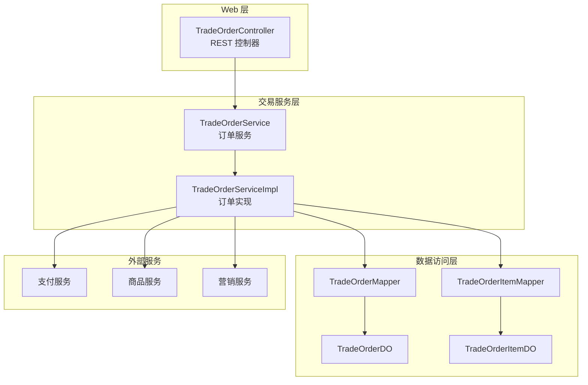
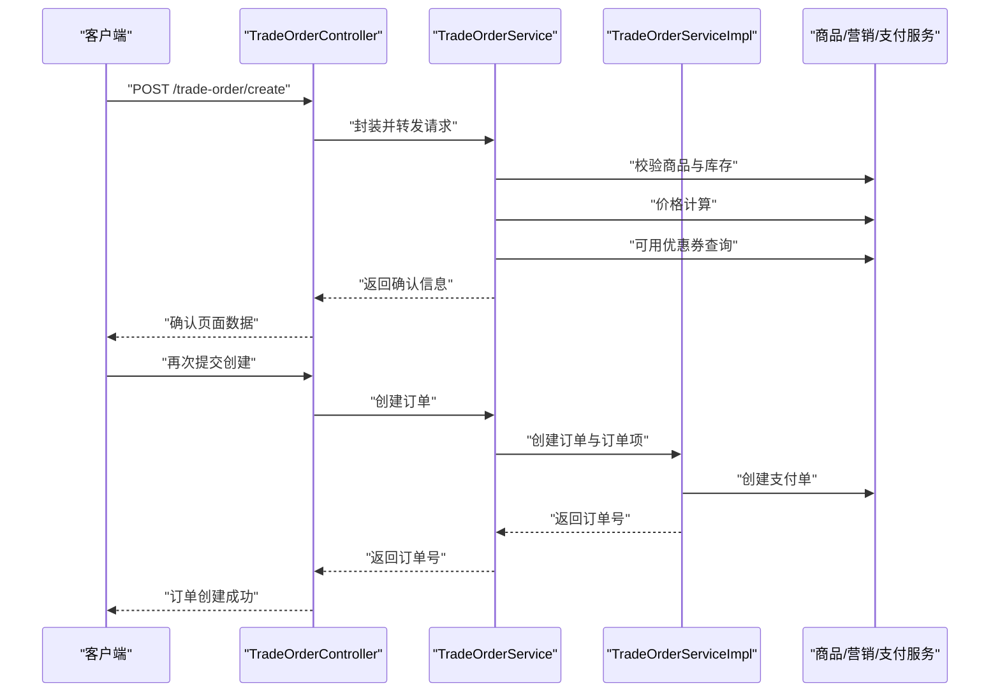
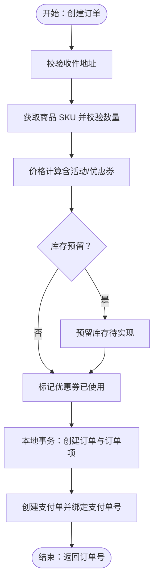
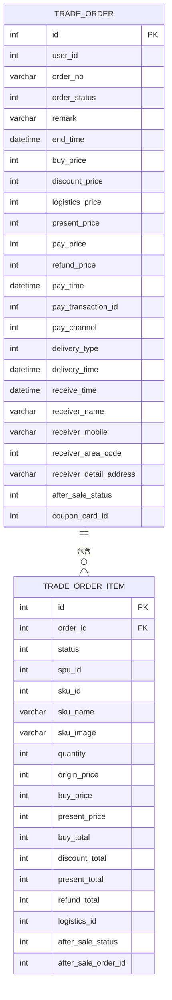
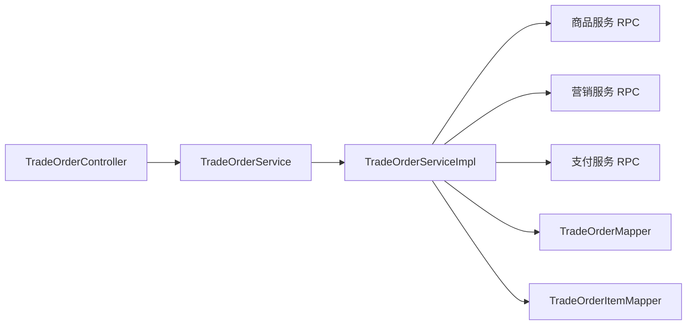

# 订单处理

<cite>
**本文引用的文件**
- [TradeOrderController.java](file://shop-web-app/src/main/java/cn/iocoder/mall/shopweb/controller/trade/TradeOrderController.java)
- [TradeOrderService.java](file://shop-web-app/src/main/java/cn/iocoder/mall/shopweb/service/trade/TradeOrderService.java)
- [TradeOrderServiceImpl.java](file://trade-service-project/trade-service-app/src/main/java/cn/iocoder/mall/tradeservice/service/order/impl/TradeOrderServiceImpl.java)
- [TradeOrderDO.java](file://trade-service-project/trade-service-app/src/main/java/cn/iocoder/mall/tradeservice/dal/mysql/dataobject/order/TradeOrderDO.java)
- [TradeOrderItemDO.java](file://trade-service-project/trade-service-app/src/main/java/cn/iocoder/mall/tradeservice/dal/mysql/dataobject/order/TradeOrderItemDO.java)
- [TradeOrderCreateReqDTO.java](file://trade-service-project/trade-service-api/src/main/java/cn/iocoder/mall/tradeservice/rpc/order/dto/TradeOrderCreateReqDTO.java)
- [TradeOrderRespDTO.java](file://trade-service-project/trade-service-api/src/main/java/cn/iocoder/mall/tradeservice/rpc/order/dto/TradeOrderRespDTO.java)
- [TradeOrderStatusEnum.java](file://trade-service-project/trade-service-api/src/main/java/cn/iocoder/mall/tradeservice/enums/order/TradeOrderStatusEnum.java)
</cite>

## 目录
1. [简介](#简介)
2. [项目结构](#项目结构)
3. [核心组件](#核心组件)
4. [架构总览](#架构总览)
5. [详细组件分析](#详细组件分析)
6. [依赖分析](#依赖分析)
7. [性能考量](#性能考量)
8. [故障排查指南](#故障排查指南)
9. [结论](#结论)
10. [附录](#附录)

## 简介
本技术文档围绕“订单处理”功能，系统性梳理从 Web 层到服务层、再到数据持久层的完整链路，覆盖订单创建、订单查询、订单状态管理、订单取消（概念性说明）、以及与支付、商品、营销等服务的集成方式。重点包括：
- TradeOrderController 的 API 设计与参数校验
- TradeOrderService 的订单生成算法与业务逻辑
- 订单数据模型 TradeOrder、OrderItem 的字段与关系
- 与支付服务、商品服务、营销服务的交互与异步处理
- 完整的业务流程图与开发实践建议

## 项目结构
订单处理涉及三层：
- Web 层（Shop Web App）：对外暴露 REST 接口，负责参数接收、鉴权、调用服务层
- 交易服务（Trade Service App）：实现订单核心业务，包含订单创建、查询、状态变更等
- 数据访问（MyBatis）：持久化订单与订单项，提供分页与明细查询

图表来源
- [TradeOrderController.java:26-84](file://shop-web-app/src/main/java/cn/iocoder/mall/shopweb/controller/trade/TradeOrderController.java#L26-L84)
- [TradeOrderService.java:50-203](file://shop-web-app/src/main/java/cn/iocoder/mall/shopweb/service/trade/TradeOrderService.java#L50-L203)
- [TradeOrderServiceImpl.java:49-279](file://trade-service-project/trade-service-app/src/main/java/cn/iocoder/mall/tradeservice/service/order/impl/TradeOrderServiceImpl.java#L49-L279)
- [TradeOrderDO.java:26-154](file://trade-service-project/trade-service-app/src/main/java/cn/iocoder/mall/tradeservice/dal/mysql/dataobject/order/TradeOrderDO.java#L26-L154)
- [TradeOrderItemDO.java:24-133](file://trade-service-project/trade-service-app/src/main/java/cn/iocoder/mall/tradeservice/dal/mysql/dataobject/order/TradeOrderItemDO.java#L24-L133)

章节来源
- [TradeOrderController.java:26-84](file://shop-web-app/src/main/java/cn/iocoder/mall/shopweb/controller/trade/TradeOrderController.java#L26-L84)
- [TradeOrderService.java:50-203](file://shop-web-app/src/main/java/cn/iocoder/mall/shopweb/service/trade/TradeOrderService.java#L50-L203)
- [TradeOrderServiceImpl.java:49-279](file://trade-service-project/trade-service-app/src/main/java/cn/iocoder/mall/tradeservice/service/order/impl/TradeOrderServiceImpl.java#L49-L279)

## 核心组件
- Web 控制器 TradeOrderController：提供“确认创建订单信息”“创建订单”“获取订单”“分页查询”等接口，统一鉴权与参数封装
- 订单服务 TradeOrderService：面向 Web 层的门面，负责参数校验、调用 RPC、聚合价格与促销信息、封装返回
- 订单实现 TradeOrderServiceImpl：核心业务落地，包含订单创建、价格计算、库存预留、优惠券使用、支付单创建、状态流转
- 数据对象 TradeOrderDO/TradeOrderItemDO：订单与订单项的持久化载体，包含价格、支付、物流、售后、营销等字段

章节来源
- [TradeOrderController.java:26-84](file://shop-web-app/src/main/java/cn/iocoder/mall/shopweb/controller/trade/TradeOrderController.java#L26-L84)
- [TradeOrderService.java:50-203](file://shop-web-app/src/main/java/cn/iocoder/mall/shopweb/service/trade/TradeOrderService.java#L50-L203)
- [TradeOrderServiceImpl.java:49-279](file://trade-service-project/trade-service-app/src/main/java/cn/iocoder/mall/tradeservice/service/order/impl/TradeOrderServiceImpl.java#L49-L279)
- [TradeOrderDO.java:26-154](file://trade-service-project/trade-service-app/src/main/java/cn/iocoder/mall/tradeservice/dal/mysql/dataobject/order/TradeOrderDO.java#L26-L154)
- [TradeOrderItemDO.java:24-133](file://trade-service-project/trade-service-app/src/main/java/cn/iocoder/mall/tradeservice/dal/mysql/dataobject/order/TradeOrderItemDO.java#L24-L133)

## 架构总览
订单处理采用“Web 层 → 服务层 → 外部服务 → 数据库”的分层架构。Web 层负责请求接入与鉴权；服务层负责业务编排与幂等控制；外部服务通过 RPC 调用完成价格计算、库存预留、优惠券核销、支付创建；数据库持久化订单与订单项。

图表来源
- [TradeOrderController.java:55-62](file://shop-web-app/src/main/java/cn/iocoder/mall/shopweb/controller/trade/TradeOrderController.java#L55-L62)
- [TradeOrderService.java:66-88](file://shop-web-app/src/main/java/cn/iocoder/mall/shopweb/service/trade/TradeOrderService.java#L66-L88)
- [TradeOrderService.java:172-175](file://shop-web-app/src/main/java/cn/iocoder/mall/shopweb/service/trade/TradeOrderService.java#L172-L175)
- [TradeOrderServiceImpl.java:75-108](file://trade-service-project/trade-service-app/src/main/java/cn/iocoder/mall/tradeservice/service/order/impl/TradeOrderServiceImpl.java#L75-L108)

## 详细组件分析

### API 设计与参数校验（TradeOrderController）
- 接口清单
  - “确认创建订单信息（商品）”：基于单个 SKU 与数量，返回价格、活动、优惠券等确认信息
  - “确认创建订单信息（购物车）”：基于购物车选中项，返回确认信息
  - “创建订单（商品）”：提交订单创建请求，返回订单号
  - “创建订单（购物车）”：基于购物车创建订单（当前返回占位）
  - “获取订单”：按订单号查询订单详情
  - “分页查询”：按用户分页查询订单列表
- 参数校验
  - 用户鉴权：所有交易接口均需登录态
  - 请求体与路径参数：使用 VO/DTO 进行参数封装与校验
  - 订单创建 DTO：包含用户 ID、IP、收件地址、优惠券、备注、订单项（SKU、数量）

章节来源
- [TradeOrderController.java:31-82](file://shop-web-app/src/main/java/cn/iocoder/mall/shopweb/controller/trade/TradeOrderController.java#L31-L82)
- [TradeOrderCreateReqDTO.java:19-69](file://trade-service-project/trade-service-api/src/main/java/cn/iocoder/mall/tradeservice/rpc/order/dto/TradeOrderCreateReqDTO.java#L19-L69)

### 订单生成算法与业务逻辑（TradeOrderService/Impl）
- 订单创建流程
  - 校验收件地址归属
  - 获取商品 SKU 并校验数量
  - 价格计算（含活动、优惠券）
  - 可选：库存预留（代码中标注待实现）
  - 优惠券使用标记
  - 本地事务内创建订单与订单项
  - 创建支付单并绑定支付单号
- 订单状态管理
  - 待支付 → 已支付（支付回调触发）
  - 支付成功后，订单与订单项状态同步更新
- 关键点
  - 价格字段：原价、购买价、最终价、购买总金额、优惠总金额、最终总金额
  - 订单号生成：时间戳 + 随机数
  - 支付单号绑定：创建支付单后写回订单

图表来源
- [TradeOrderServiceImpl.java:75-108](file://trade-service-project/trade-service-app/src/main/java/cn/iocoder/mall/tradeservice/service/order/impl/TradeOrderServiceImpl.java#L75-L108)
- [TradeOrderServiceImpl.java:110-166](file://trade-service-project/trade-service-app/src/main/java/cn/iocoder/mall/tradeservice/service/order/impl/TradeOrderServiceImpl.java#L110-L166)
- [TradeOrderServiceImpl.java:168-184](file://trade-service-project/trade-service-app/src/main/java/cn/iocoder/mall/tradeservice/service/order/impl/TradeOrderServiceImpl.java#L168-L184)

章节来源
- [TradeOrderServiceImpl.java:75-108](file://trade-service-project/trade-service-app/src/main/java/cn/iocoder/mall/tradeservice/service/order/impl/TradeOrderServiceImpl.java#L75-L108)
- [TradeOrderServiceImpl.java:110-166](file://trade-service-project/trade-service-app/src/main/java/cn/iocoder/mall/tradeservice/service/order/impl/TradeOrderServiceImpl.java#L110-L166)
- [TradeOrderServiceImpl.java:168-184](file://trade-service-project/trade-service-app/src/main/java/cn/iocoder/mall/tradeservice/service/order/impl/TradeOrderServiceImpl.java#L168-L184)

### 订单数据模型设计
- TradeOrderDO（订单主表）
  - 基本信息：用户编号、订单号、状态、备注、结束时间
  - 价格与支付：购买价、优惠价、物流价、最终价、实付、退款、支付时间、支付单号、支付渠道
  - 收件与物流：配送类型、发货/收货时间、收件人信息
  - 售后：售后状态
  - 营销：优惠券编号
- TradeOrderItemDO（订单项明细）
  - 基本信息：订单编号、状态
  - 商品信息：SPU/SKU 编号、名称、图片、数量
  - 价格与支付：原单价、购买单价、最终单价、购买总金额、优惠总金额、最终总金额、退款总金额
  - 物流与售后：物流编号、售后状态、售后订单编号

图表来源
- [TradeOrderDO.java:26-154](file://trade-service-project/trade-service-app/src/main/java/cn/iocoder/mall/tradeservice/dal/mysql/dataobject/order/TradeOrderDO.java#L26-L154)
- [TradeOrderItemDO.java:24-133](file://trade-service-project/trade-service-app/src/main/java/cn/iocoder/mall/tradeservice/dal/mysql/dataobject/order/TradeOrderItemDO.java#L24-L133)

章节来源
- [TradeOrderDO.java:26-154](file://trade-service-project/trade-service-app/src/main/java/cn/iocoder/mall/tradeservice/dal/mysql/dataobject/order/TradeOrderDO.java#L26-L154)
- [TradeOrderItemDO.java:24-133](file://trade-service-project/trade-service-app/src/main/java/cn/iocoder/mall/tradeservice/dal/mysql/dataobject/order/TradeOrderItemDO.java#L24-L133)

### 订单状态与枚举
- 订单状态枚举：等待付款、等待发货、已发货、已完成、已关闭
- 状态流转：创建订单默认“等待付款”，支付成功后变更为“等待发货”

章节来源
- [TradeOrderStatusEnum.java:12-34](file://trade-service-project/trade-service-api/src/main/java/cn/iocoder/mall/tradeservice/enums/order/TradeOrderStatusEnum.java#L12-L34)
- [TradeOrderServiceImpl.java:244-277](file://trade-service-project/trade-service-app/src/main/java/cn/iocoder/mall/tradeservice/service/order/impl/TradeOrderServiceImpl.java#L244-L277)

### 与外部服务的集成
- 商品服务：校验 SKU 存在与库存充足、获取 SKU 明细
- 营销服务：价格计算（活动/满减/折扣）、可用优惠券查询
- 支付服务：创建支付单并绑定支付单号，支付成功后由支付服务回调驱动订单状态更新

章节来源
- [TradeOrderService.java:90-127](file://shop-web-app/src/main/java/cn/iocoder/mall/shopweb/service/trade/TradeOrderService.java#L90-L127)
- [TradeOrderServiceImpl.java:77-106](file://trade-service-project/trade-service-app/src/main/java/cn/iocoder/mall/tradeservice/service/order/impl/TradeOrderServiceImpl.java#L77-L106)

## 依赖分析
- 组件耦合
  - Web 层仅依赖服务层接口，低耦合
  - 服务实现依赖外部 RPC 与 DAO，职责清晰
- 外部依赖
  - Dubbo RPC：价格、商品、优惠券、购物车等
  - MyBatis Mapper：订单与订单项的持久化
- 潜在风险
  - 库存预留尚未实现，存在超卖风险
  - 分布式事务未启用，需通过补偿机制保证一致性

图表来源
- [TradeOrderController.java:28-29](file://shop-web-app/src/main/java/cn/iocoder/mall/shopweb/controller/trade/TradeOrderController.java#L28-L29)
- [TradeOrderService.java:52-64](file://shop-web-app/src/main/java/cn/iocoder/mall/shopweb/service/trade/TradeOrderService.java#L52-L64)
- [TradeOrderServiceImpl.java:61-68](file://trade-service-project/trade-service-app/src/main/java/cn/iocoder/mall/tradeservice/service/order/impl/TradeOrderServiceImpl.java#L61-L68)

章节来源
- [TradeOrderController.java:28-29](file://shop-web-app/src/main/java/cn/iocoder/mall/shopweb/controller/trade/TradeOrderController.java#L28-L29)
- [TradeOrderService.java:52-64](file://shop-web-app/src/main/java/cn/iocoder/mall/shopweb/service/trade/TradeOrderService.java#L52-L64)
- [TradeOrderServiceImpl.java:61-68](file://trade-service-project/trade-service-app/src/main/java/cn/iocoder/mall/tradeservice/service/order/impl/TradeOrderServiceImpl.java#L61-L68)

## 性能考量
- 价格计算与促销活动查询：批量聚合活动 ID，减少多次 RPC 调用
- 分页查询：按用户维度分页，避免全表扫描
- 事务边界：订单与订单项在单事务内落库，降低一致性成本
- 缓存策略：可对 SKU 明细与价格计算结果进行缓存（需配合失效策略）

## 故障排查指南
- 订单创建失败
  - 地址不存在：检查用户地址归属
  - 商品不存在或库存不足：核对 SKU 与库存
  - 价格计算异常：检查活动与优惠券参数
- 支付回调后状态未更新
  - 校验回调参数与金额一致性
  - 检查订单状态是否仍为“等待支付”
- 订单查询为空
  - 确认查询条件（用户 ID、字段包含项）

章节来源
- [TradeOrderServiceImpl.java:244-277](file://trade-service-project/trade-service-app/src/main/java/cn/iocoder/mall/tradeservice/service/order/impl/TradeOrderServiceImpl.java#L244-L277)

## 结论
订单处理模块通过清晰的分层设计与 RPC 集成，实现了从下单到支付的关键闭环。当前实现具备完整的创建与查询能力，支付回调驱动的状态更新与库存预留待完善。建议尽快补齐库存预留与分布式事务方案，确保高并发下的数据一致性。

## 附录
- 开发实践建议
  - 在创建订单前完成库存预留与锁定
  - 引入分布式事务或可靠消息，保证跨服务一致性
  - 对价格计算与活动查询结果做缓存与失效策略
  - 补充订单取消流程与退款对账机制