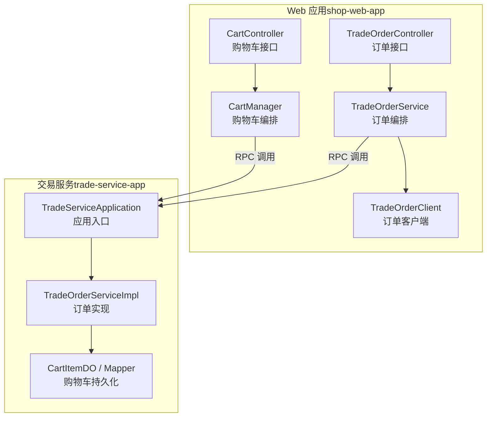
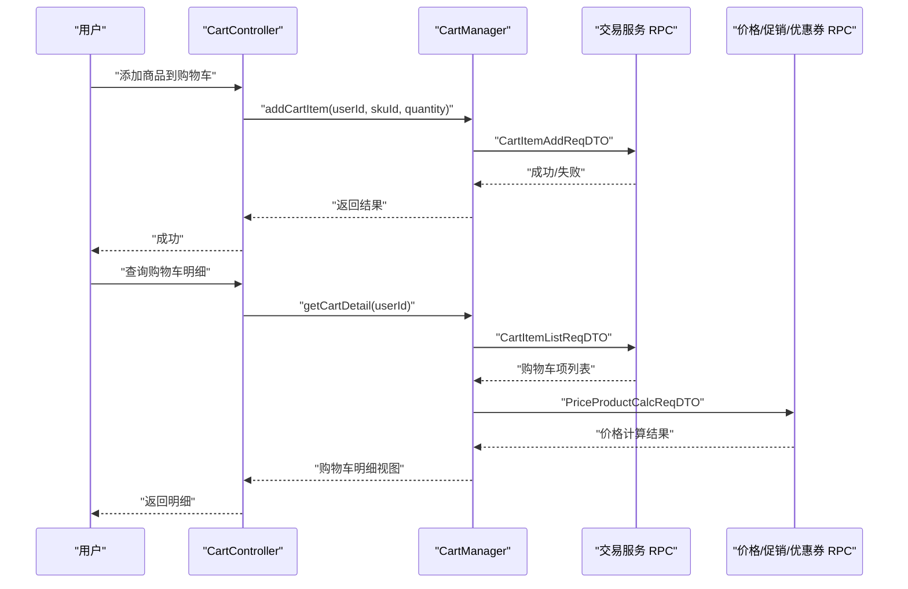
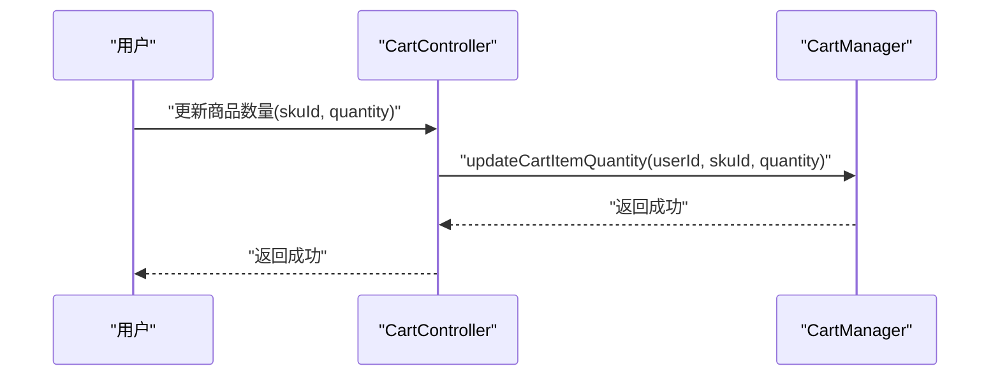
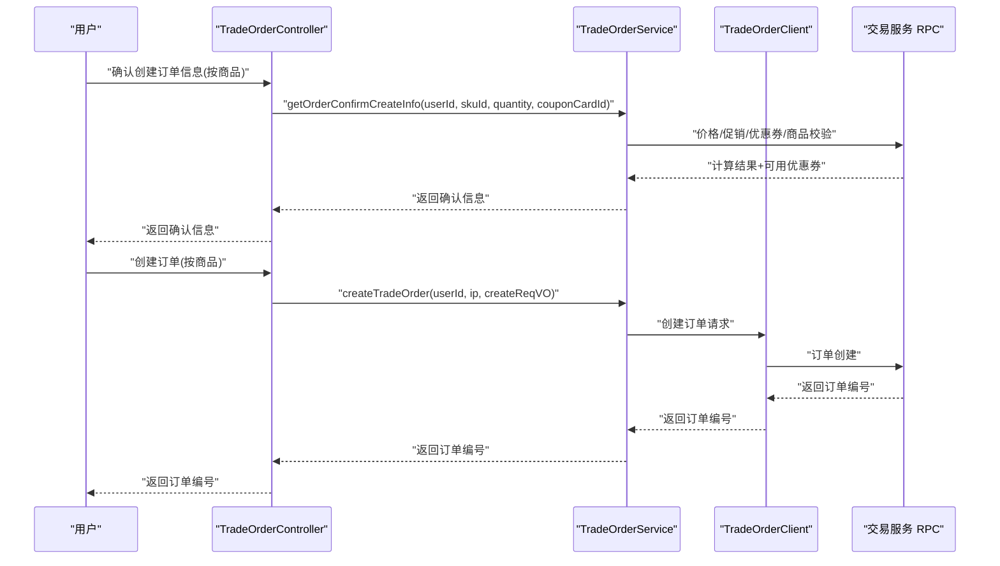
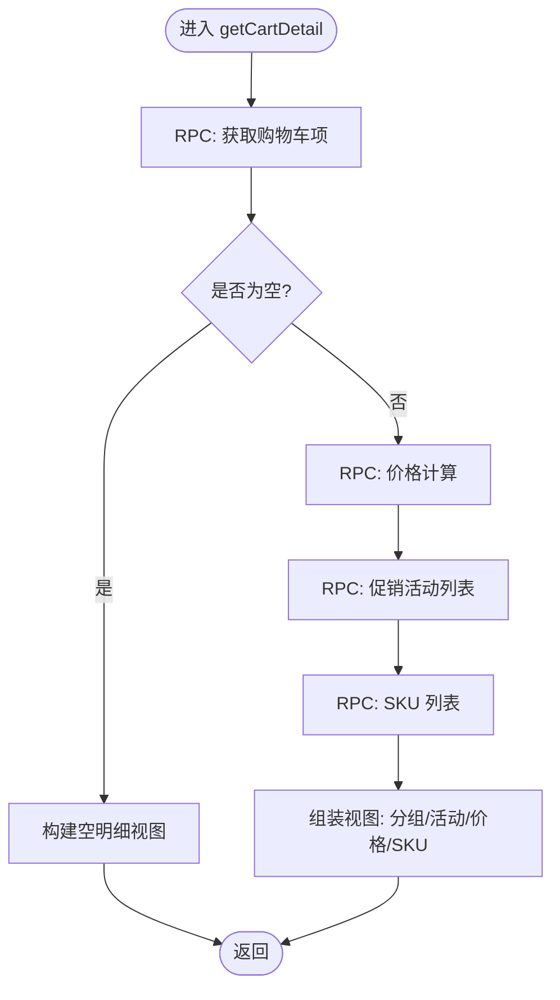
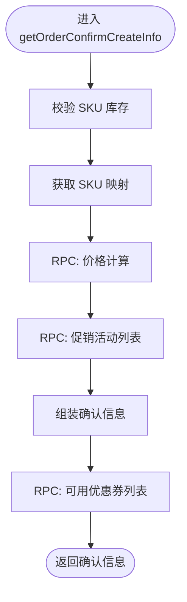
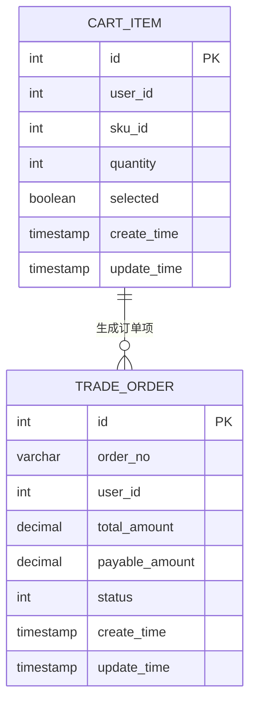
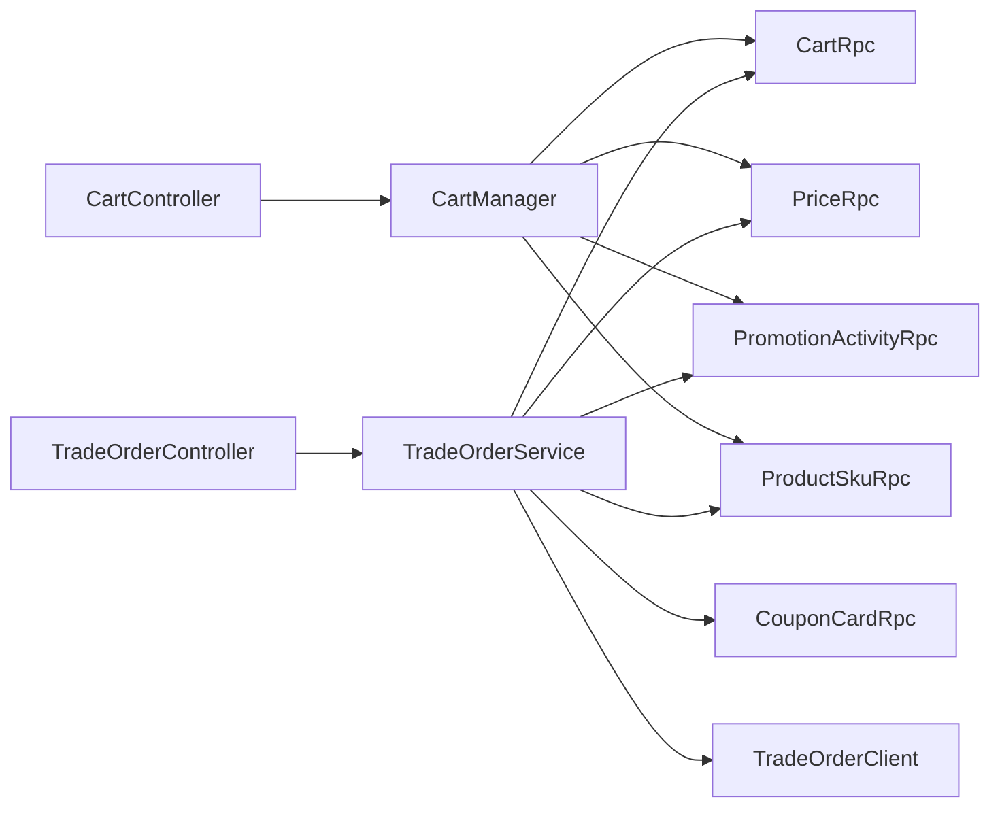

# 购物车与订单模块

<cite>
**本文引用的文件**
- [CartController.java](file://shop-web-app/src/main/java/cn/iocoder/mall/shopweb/controller/trade/CartController.java)
- [TradeOrderController.java](file://shop-web-app/src/main/java/cn/iocoder/mall/shopweb/controller/trade/TradeOrderController.java)
- [CartManager.java](file://shop-web-app/src/main/java/cn/iocoder/mall/shopweb/service/trade/CartManager.java)
- [TradeOrderService.java](file://shop-web-app/src/main/java/cn/iocoder/mall/shopweb/service/trade/TradeOrderService.java)
- [CartItemAddReqDTO.java](file://trade-service-project/trade-service-api/src/main/java/cn/iocoder/mall/tradeservice/rpc/cart/dto/CartItemAddReqDTO.java)
- [CartItemRespDTO.java](file://trade-service-project/trade-service-api/src/main/java/cn/iocoder/mall/tradeservice/rpc/cart/dto/CartItemRespDTO.java)
- [CartItemUpdateQuantityReqDTO.java](file://trade-service-project/trade-service-api/src/main/java/cn/iocoder/mall/tradeservice/rpc/cart/dto/CartItemUpdateQuantityReqDTO.java)
- [CartItemUpdateSelectedReqDTO.java](file://trade-service-project/trade-service-api/src/main/java/cn/iocoder/mall/tradeservice/rpc/cart/dto/CartItemUpdateSelectedReqDTO.java)
- [CartItemListReqDTO.java](file://trade-service-project/trade-service-api/src/main/java/cn/iocoder/mall/tradeservice/rpc/cart/dto/CartItemListReqDTO.java)
- [CartItemDO.java](file://trade-service-project/trade-service-app/src/main/java/cn/iocoder/mall/tradeservice/dal/mysql/dataobject/cart/CartItemDO.java)
- [CartItemMapper.java](file://trade-service-project/trade-service-app/src/main/java/cn/iocoder/mall/tradeservice/dal/mysql/mapper/cart/CartItemMapper.java)
- [TradeOrderClient.java](file://shop-web-app/src/main/java/cn/iocoder/mall/shopweb/client/trade/TradeOrderClient.java)
- [TradeOrderConfirmCreateInfoRespVO.java](file://shop-web-app/src/main/java/cn/iocoder/mall/shopweb/controller/trade/vo/order/TradeOrderConfirmCreateInfoRespVO.java)
- [TradeOrderCreateReqVO.java](file://shop-web-app/src/main/java/cn/iocoder/mall/shopweb/controller/trade/vo/order/TradeOrderCreateReqVO.java)
- [TradeOrderRespVO.java](file://shop-web-app/src/main/java/cn/iocoder/mall/shopweb/controller/trade/vo/order/TradeOrderRespVO.java)
- [TradeOrderPageReqVO.java](file://shop-web-app/src/main/java/cn/iocoder/mall/shopweb/controller/trade/vo/order/TradeOrderPageReqVO.java)
- [TradeOrderServiceImpl.java](file://trade-service-project/trade-service-app/src/main/java/cn/iocoder/mall/tradeservice/service/order/impl/TradeOrderServiceImpl.java)
- [TradeOrderServiceImplTest.java](file://trade-service-project/trade-service-integration-test/src/test/java/cn/iocoder/mall/tradeservice/service/order/impl/TradeOrderServiceImplTest.java)
- [TradeServiceApplication.java](file://trade-service-project/trade-service-app/src/main/java/cn/iocoder/mall/tradeservice/TradeServiceApplication.java)
- [ShopWebApplication.java](file://shop-web-app/src/main/java/cn/iocoder/mall/shopweb/ShopWebApplication.java)
</cite>

## 目录
1. [引言](#引言)
2. [项目结构](#项目结构)
3. [核心组件](#核心组件)
4. [架构总览](#架构总览)
5. [详细组件分析](#详细组件分析)
6. [依赖分析](#依赖分析)
7. [性能考虑](#性能考虑)
8. [故障排查指南](#故障排查指南)
9. [结论](#结论)
10. [附录](#附录)

## 引言
本技术文档围绕购物车与订单模块展开，系统性介绍购物车管理与订单处理的核心功能，包括商品添加、数量修改、购物车结算、订单创建等流程；深入解析 CartController 与 TradeOrderController 的实现细节；阐述购物车与订单的数据模型设计（CartItem、TradeOrder 等）及其关系与约束；并说明与交易服务、支付服务的集成方式（RPC 调用、异步处理、状态同步）。最后提供完整的使用指南与开发调试方法，帮助开发者快速理解与扩展该模块。

## 项目结构
购物车与订单模块由“前端 Web 控制器层”和“后端交易服务层”组成：
- Web 层：提供 HTTP 接口，负责用户交互与参数校验，调用服务层完成业务编排。
- 交易服务层：提供 RPC 接口，负责购物车与订单的持久化、计算与状态流转。

图表来源
- [CartController.java:24-84](file://shop-web-app/src/main/java/cn/iocoder/mall/shopweb/controller/trade/CartController.java#L24-L84)
- [TradeOrderController.java:26-85](file://shop-web-app/src/main/java/cn/iocoder/mall/shopweb/controller/trade/TradeOrderController.java#L26-L85)
- [CartManager.java:29-169](file://shop-web-app/src/main/java/cn/iocoder/mall/shopweb/service/trade/CartManager.java#L29-L169)
- [TradeOrderService.java:50-204](file://shop-web-app/src/main/java/cn/iocoder/mall/shopweb/service/trade/TradeOrderService.java#L50-L204)
- [TradeOrderClient.java](file://shop-web-app/src/main/java/cn/iocoder/mall/shopweb/client/trade/TradeOrderClient.java)
- [TradeServiceApplication.java](file://trade-service-project/trade-service-app/src/main/java/cn/iocoder/mall/tradeservice/TradeServiceApplication.java)
- [TradeOrderServiceImpl.java](file://trade-service-project/trade-service-app/src/main/java/cn/iocoder/mall/tradeservice/service/order/impl/TradeOrderServiceImpl.java)
- [CartItemDO.java](file://trade-service-project/trade-service-app/src/main/java/cn/iocoder/mall/tradeservice/dal/mysql/dataobject/cart/CartItemDO.java)
- [CartItemMapper.java](file://trade-service-project/trade-service-app/src/main/java/cn/iocoder/mall/tradeservice/dal/mysql/mapper/cart/CartItemMapper.java)

章节来源
- [CartController.java:24-84](file://shop-web-app/src/main/java/cn/iocoder/mall/shopweb/controller/trade/CartController.java#L24-L84)
- [TradeOrderController.java:26-85](file://shop-web-app/src/main/java/cn/iocoder/mall/shopweb/controller/trade/TradeOrderController.java#L26-L85)
- [CartManager.java:29-169](file://shop-web-app/src/main/java/cn/iocoder/mall/shopweb/service/trade/CartManager.java#L29-L169)
- [TradeOrderService.java:50-204](file://shop-web-app/src/main/java/cn/iocoder/mall/shopweb/service/trade/TradeOrderService.java#L50-L204)
- [TradeServiceApplication.java](file://trade-service-project/trade-service-app/src/main/java/cn/iocoder/mall/tradeservice/TradeServiceApplication.java)

## 核心组件
- 购物车控制器（CartController）
  - 提供添加商品、查询购物车明细、更新数量、更新选中状态等接口。
  - 所有接口均需认证，通过用户上下文获取当前用户 ID。
- 订单控制器（TradeOrderController）
  - 提供“按商品确认创建订单信息”、“按购物车确认创建订单信息”、“创建订单”、“查询订单”、“分页查询订单”等接口。
  - 支持优惠券选择与价格计算联动。
- 购物车编排（CartManager）
  - 封装购物车 RPC 调用，聚合价格计算、促销活动、SKU 信息，输出购物车明细视图对象。
- 订单编排（TradeOrderService）
  - 封装订单相关 RPC 调用，校验 SKU 库存、计算价格、拼装订单确认信息、调用客户端创建订单、分页查询等。

章节来源
- [CartController.java:29-84](file://shop-web-app/src/main/java/cn/iocoder/mall/shopweb/controller/trade/CartController.java#L29-L84)
- [TradeOrderController.java:31-85](file://shop-web-app/src/main/java/cn/iocoder/mall/shopweb/controller/trade/TradeOrderController.java#L31-L85)
- [CartManager.java:47-135](file://shop-web-app/src/main/java/cn/iocoder/mall/shopweb/service/trade/CartManager.java#L47-L135)
- [TradeOrderService.java:66-127](file://shop-web-app/src/main/java/cn/iocoder/mall/shopweb/service/trade/TradeOrderService.java#L66-L127)

## 架构总览
购物车与订单模块采用“Web 控制器 + 服务编排 + RPC 调用”的分层架构。Web 层负责鉴权与参数校验，服务层负责跨域能力（价格计算、促销活动、优惠券、SKU 校验），交易服务层负责持久化与订单状态机。

图表来源
- [CartController.java:29-54](file://shop-web-app/src/main/java/cn/iocoder/mall/shopweb/controller/trade/CartController.java#L29-L54)
- [CartManager.java:47-135](file://shop-web-app/src/main/java/cn/iocoder/mall/shopweb/service/trade/CartManager.java#L47-L135)
- [CartItemAddReqDTO.java](file://trade-service-project/trade-service-api/src/main/java/cn/iocoder/mall/tradeservice/rpc/cart/dto/CartItemAddReqDTO.java)
- [CartItemListReqDTO.java](file://trade-service-project/trade-service-api/src/main/java/cn/iocoder/mall/tradeservice/rpc/cart/dto/CartItemListReqDTO.java)

## 详细组件分析

### 购物车控制器（CartController）
- 接口职责
  - 添加商品到购物车：接收 skuId 与 quantity，调用 CartManager 完成添加。
  - 查询购物车商品数量：返回当前用户购物车中商品总件数。
  - 获取购物车明细：返回包含价格分组、活动折扣、SKU 详情的购物车视图。
  - 更新商品数量：支持单个 SKU 数量调整。
  - 更新商品选中状态：支持批量选中/取消。
- 鉴权机制
  - 使用注解要求认证，从用户上下文中获取 userId。
- 数据流
  - 调用 CartManager 后，由其通过 RPC 调用交易服务完成实际写入或查询。

图表来源
- [CartController.java:56-67](file://shop-web-app/src/main/java/cn/iocoder/mall/shopweb/controller/trade/CartController.java#L56-L67)
- [CartManager.java:72-76](file://shop-web-app/src/main/java/cn/iocoder/mall/shopweb/service/trade/CartManager.java#L72-L76)

章节来源
- [CartController.java:29-84](file://shop-web-app/src/main/java/cn/iocoder/mall/shopweb/controller/trade/CartController.java#L29-L84)

### 订单控制器（TradeOrderController）
- 接口职责
  - 基于商品确认创建订单信息：传入 skuId、quantity、可选 couponCardId，返回订单确认信息（含价格分组、活动折扣、可用优惠券）。
  - 基于购物车确认创建订单信息：仅传入 couponCardId，自动取已选中的购物车项进行确认。
  - 创建订单：提交 TradeOrderCreateReqVO，返回订单编号。
  - 查询订单：根据订单编号返回订单详情。
  - 分页查询订单：支持分页与排序。
- 参数与返回
  - 所有接口均进行参数校验与认证。
  - 返回统一的 CommonResult 包裹 VO 对象。

图表来源
- [TradeOrderController.java:31-62](file://shop-web-app/src/main/java/cn/iocoder/mall/shopweb/controller/trade/TradeOrderController.java#L31-L62)
- [TradeOrderService.java:66-127](file://shop-web-app/src/main/java/cn/iocoder/mall/shopweb/service/trade/TradeOrderService.java#L66-L127)
- [TradeOrderClient.java](file://shop-web-app/src/main/java/cn/iocoder/mall/shopweb/client/trade/TradeOrderClient.java)

章节来源
- [TradeOrderController.java:31-85](file://shop-web-app/src/main/java/cn/iocoder/mall/shopweb/controller/trade/TradeOrderController.java#L31-L85)
- [TradeOrderService.java:66-127](file://shop-web-app/src/main/java/cn/iocoder/mall/shopweb/service/trade/TradeOrderService.java#L66-L127)

### 购物车编排（CartManager）
- 职责
  - 购物车增删改查：封装 CartRpc 的 add/update/list/delete 等 RPC 调用。
  - 明细聚合：结合价格计算、促销活动、SKU 信息，输出 CartDetailVO。
- 关键流程
  - 获取购物车项 → 价格计算 → 促销活动映射 → SKU 信息映射 → 组装视图。
- 错误处理
  - 所有 RPC 调用均检查错误码并抛出异常。

图表来源
- [CartManager.java:96-135](file://shop-web-app/src/main/java/cn/iocoder/mall/shopweb/service/trade/CartManager.java#L96-L135)

章节来源
- [CartManager.java:47-135](file://shop-web-app/src/main/java/cn/iocoder/mall/shopweb/service/trade/CartManager.java#L47-L135)

### 订单编排（TradeOrderService）
- 职责
  - 订单确认信息：校验 SKU 库存、价格计算、促销活动映射、可用优惠券查询、组装确认信息。
  - 订单创建：调用 TradeOrderClient 创建订单并返回订单编号。
  - 订单查询与分页：封装 RPC 查询与分页逻辑。
- 关键流程
  - 按商品确认：直接传入 skuMap 进行校验与计算。
  - 按购物车确认：先取已选中购物车项，再进行校验与计算。
- 错误处理
  - SKU 不存在或库存不足时抛出业务异常。

图表来源
- [TradeOrderService.java:90-127](file://shop-web-app/src/main/java/cn/iocoder/mall/shopweb/service/trade/TradeOrderService.java#L90-L127)

章节来源
- [TradeOrderService.java:66-127](file://shop-web-app/src/main/java/cn/iocoder/mall/shopweb/service/trade/TradeOrderService.java#L66-L127)

### 数据模型与关系
- 购物车项（CartItem）
  - 字段：用户标识、SKU 标识、数量、选中状态、创建/更新时间等。
  - 存储：CartItemDO + CartItemMapper。
  - RPC DTO：CartItemRespDTO、CartItemAddReqDTO、CartItemUpdateQuantityReqDTO、CartItemUpdateSelectedReqDTO、CartItemListReqDTO。
- 订单（TradeOrder）
  - 字段：用户标识、订单号、应付金额、实付金额、收货人信息、物流信息、支付信息、订单状态、创建/更新时间等。
  - 与购物车的关系：订单由购物车项或直接下单生成，包含订单项明细。
  - 与价格/促销/优惠券的关系：确认订单时进行价格计算与优惠匹配，最终落库。

图表来源
- [CartItemDO.java](file://trade-service-project/trade-service-app/src/main/java/cn/iocoder/mall/tradeservice/dal/mysql/dataobject/cart/CartItemDO.java)
- [CartItemMapper.java](file://trade-service-project/trade-service-app/src/main/java/cn/iocoder/mall/tradeservice/dal/mysql/mapper/cart/CartItemMapper.java)

章节来源
- [CartItemDO.java](file://trade-service-project/trade-service-app/src/main/java/cn/iocoder/mall/tradeservice/dal/mysql/dataobject/cart/CartItemDO.java)
- [CartItemMapper.java](file://trade-service-project/trade-service-app/src/main/java/cn/iocoder/mall/tradeservice/dal/mysql/mapper/cart/CartItemMapper.java)
- [CartItemRespDTO.java](file://trade-service-project/trade-service-api/src/main/java/cn/iocoder/mall/tradeservice/rpc/cart/dto/CartItemRespDTO.java)
- [CartItemAddReqDTO.java](file://trade-service-project/trade-service-api/src/main/java/cn/iocoder/mall/tradeservice/rpc/cart/dto/CartItemAddReqDTO.java)
- [CartItemUpdateQuantityReqDTO.java](file://trade-service-project/trade-service-api/src/main/java/cn/iocoder/mall/tradeservice/rpc/cart/dto/CartItemUpdateQuantityReqDTO.java)
- [CartItemUpdateSelectedReqDTO.java](file://trade-service-project/trade-service-api/src/main/java/cn/iocoder/mall/tradeservice/rpc/cart/dto/CartItemUpdateSelectedReqDTO.java)
- [CartItemListReqDTO.java](file://trade-service-project/trade-service-api/src/main/java/cn/iocoder/mall/tradeservice/rpc/cart/dto/CartItemListReqDTO.java)

### 用户交互体验设计
- 购物车操作
  - 添加商品：输入数量，点击加入购物车，提示成功。
  - 修改数量：在购物车页面直接修改数量，实时刷新小计与总计。
  - 选中/取消：勾选参与结算的商品，未选中不计入结算。
  - 清空购物车：支持一键清空。
- 订单确认
  - 价格分组展示：按活动分组显示商品与折扣。
  - 优惠券选择：展示可用优惠券，支持切换。
  - 地址与物流：确认收货地址与运费。
- 支付流程
  - 提交订单后跳转支付页，支付完成后回调更新订单状态。
- 状态跟踪
  - 订单列表按状态筛选与排序，支持查看物流与售后进度。

（本节为概念性说明，不直接分析具体文件）

## 依赖分析
- Web 层对服务层的依赖
  - CartController 依赖 CartManager。
  - TradeOrderController 依赖 TradeOrderService。
- 服务层对 RPC 的依赖
  - CartManager 依赖 CartRpc、PriceRpc、PromotionActivityRpc、ProductSkuRpc。
  - TradeOrderService 依赖 PriceRpc、PromotionActivityRpc、CartRpc、ProductSkuRpc、CouponCardRpc、TradeOrderClient。
- 服务层对持久化的依赖
  - 订单实现 TradeOrderServiceImpl 依赖订单相关 DAO 与 Mapper（在交易服务应用内）。

图表来源
- [CartController.java:26-27](file://shop-web-app/src/main/java/cn/iocoder/mall/shopweb/controller/trade/CartController.java#L26-L27)
- [TradeOrderController.java:29-29](file://shop-web-app/src/main/java/cn/iocoder/mall/shopweb/controller/trade/TradeOrderController.java#L29-L29)
- [CartManager.java:31-38](file://shop-web-app/src/main/java/cn/iocoder/mall/shopweb/service/trade/CartManager.java#L31-L38)
- [TradeOrderService.java:52-61](file://shop-web-app/src/main/java/cn/iocoder/mall/shopweb/service/trade/TradeOrderService.java#L52-L61)

章节来源
- [CartManager.java:31-38](file://shop-web-app/src/main/java/cn/iocoder/mall/shopweb/service/trade/CartManager.java#L31-L38)
- [TradeOrderService.java:52-61](file://shop-web-app/src/main/java/cn/iocoder/mall/shopweb/service/trade/TradeOrderService.java#L52-L61)

## 性能考虑
- RPC 调用合并
  - 在聚合购物车明细时，尽量合并 RPC 请求（如一次获取价格计算结果、促销活动列表、SKU 列表），减少网络往返。
- 批量查询
  - 使用 setProductSkuIds 与 setSkuIds 批量查询，避免 N+1 查询。
- 结果缓存
  - 对价格计算与促销活动结果进行短期缓存，降低重复计算成本。
- 分页与排序
  - 订单分页默认按 ID 倒序，保证最新订单优先展示。
- 并发控制
  - 购物车数量更新与订单创建应进行幂等与锁控制，避免超卖与重复下单。

（本节提供通用建议，不直接分析具体文件）

## 故障排查指南
- 常见错误
  - SKU 不存在或状态异常：抛出“商品 SKU 不存在”业务异常。
  - SKU 库存不足：抛出“商品 SKU 数量不足”业务异常。
  - RPC 调用失败：检查服务注册中心与网络连通性。
- 调试步骤
  - 启用交易服务日志，定位 RPC 调用链路。
  - 使用集成测试验证订单创建流程（参考 TradeOrderServiceImplTest）。
  - 校验购物车项与订单项字段映射是否一致。
- 排查要点
  - 确认用户上下文是否正确注入。
  - 确认优惠券适用范围与价格计算顺序。
  - 确认订单状态机与回调处理是否正常。

章节来源
- [TradeOrderService.java:129-147](file://shop-web-app/src/main/java/cn/iocoder/mall/shopweb/service/trade/TradeOrderService.java#L129-L147)
- [TradeOrderServiceImplTest.java](file://trade-service-project/trade-service-integration-test/src/test/java/cn/iocoder/mall/tradeservice/service/order/impl/TradeOrderServiceImplTest.java)

## 结论
购物车与订单模块通过清晰的分层设计与 RPC 调用，实现了从用户交互到服务编排再到持久化的完整闭环。CartController 与 TradeOrderController 提供了完备的接口能力，CartManager 与 TradeOrderService 实现了跨域能力的聚合与编排。建议在后续迭代中进一步完善缓存策略、并发控制与状态同步，以提升整体性能与稳定性。

## 附录
- 使用指南
  - 添加商品到购物车：POST /cart/add（需要认证）
  - 查询购物车明细：GET /cart/get-detail（需要认证）
  - 更新商品数量：POST /cart/update-quantity（需要认证）
  - 更新商品选中状态：POST /cart/update-selected（需要认证）
  - 基于商品确认创建订单信息：GET /trade-order/confirm-create-order-info（需要认证）
  - 基于购物车确认创建订单信息：GET /trade-order/confirm-create-order-info-from-cart（需要认证）
  - 创建订单：POST /trade-order/create（需要认证）
  - 查询订单：GET /trade-order/get（需要认证）
  - 分页查询订单：GET /trade-order/page（需要认证）
- 开发调试
  - 启动顺序：先启动交易服务应用，再启动 Web 应用。
  - 断点调试：在 CartManager 与 TradeOrderService 的关键 RPC 调用处设置断点。
  - 单元测试：参考 TradeOrderServiceImplTest 验证订单创建流程。

章节来源
- [CartController.java:29-84](file://shop-web-app/src/main/java/cn/iocoder/mall/shopweb/controller/trade/CartController.java#L29-L84)
- [TradeOrderController.java:31-85](file://shop-web-app/src/main/java/cn/iocoder/mall/shopweb/controller/trade/TradeOrderController.java#L31-L85)
- [TradeServiceApplication.java](file://trade-service-project/trade-service-app/src/main/java/cn/iocoder/mall/tradeservice/TradeServiceApplication.java)
- [ShopWebApplication.java](file://shop-web-app/src/main/java/cn/iocoder/mall/shopweb/ShopWebApplication.java)