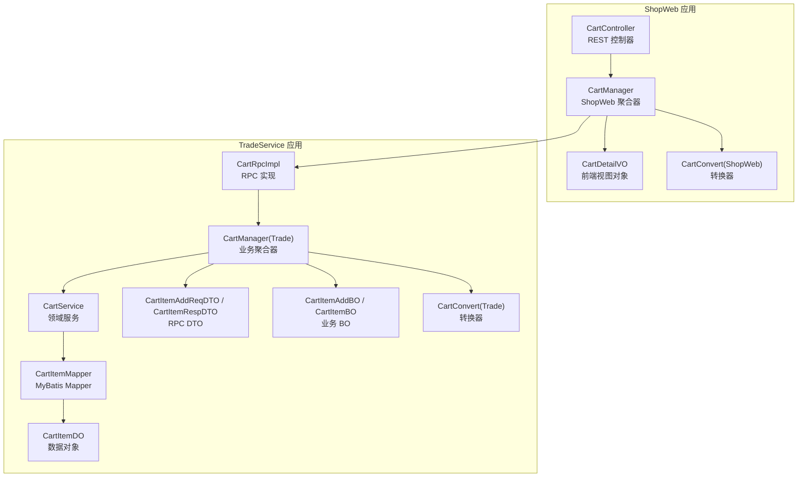
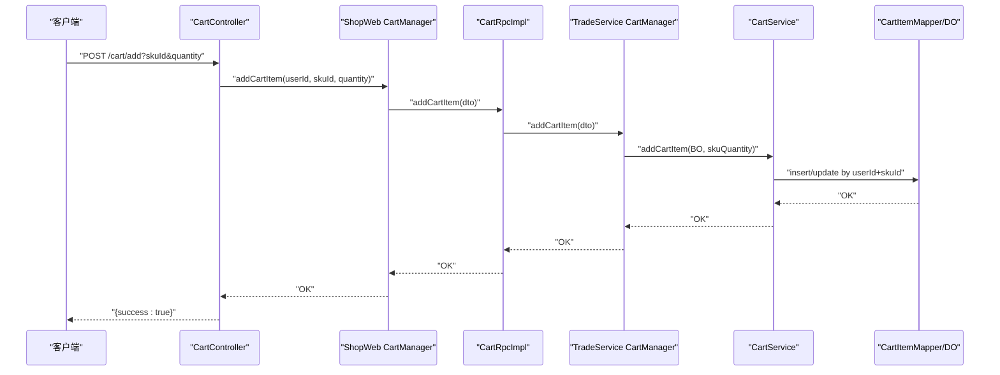
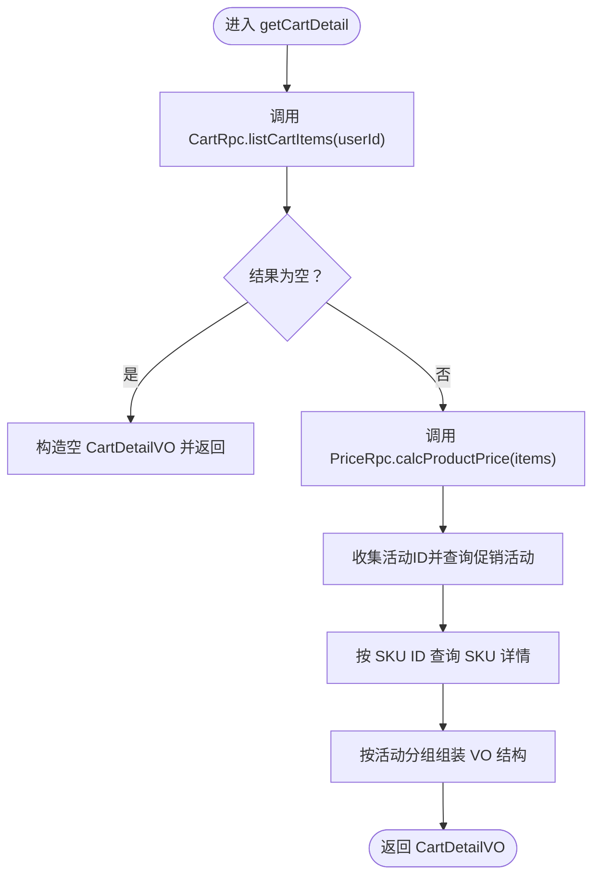
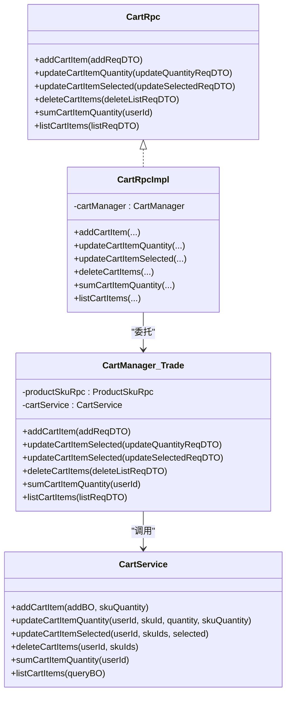
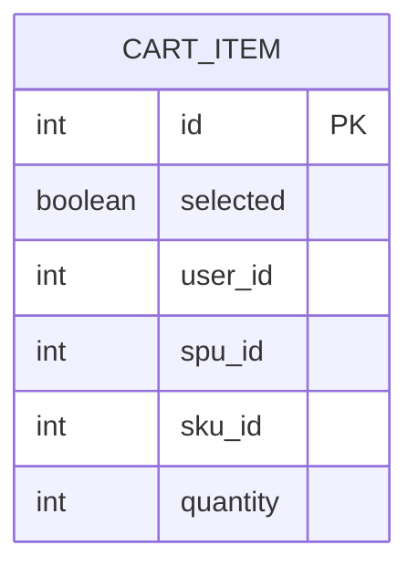
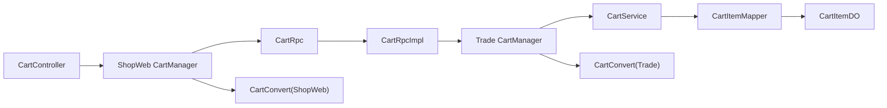

# 购物车管理

<cite>
**本文引用的文件**
- [CartController.java](file://shop-web-app/src/main/java/cn/iocoder/mall/shopweb/controller/trade/CartController.java)
- [CartManager.java（ShopWeb 层）](file://shop-web-app/src/main/java/cn/iocoder/mall/shopweb/service/trade/CartManager.java)
- [CartDetailVO.java](file://shop-web-app/src/main/java/cn/iocoder/mall/shopweb/controller/trade/vo/cart/CartDetailVO.java)
- [CartConvert.java（ShopWeb 层）](file://shop-web-app/src/main/java/cn/iocoder/mall/shopweb/convert/trade/CartConvert.java)
- [CartRpc.java](file://trade-service-project/trade-service-api/src/main/java/cn/iocoder/mall/tradeservice/rpc/cart/CartRpc.java)
- [CartRpcImpl.java](file://trade-service-project/trade-service-app/src/main/java/cn/iocoder/mall/tradeservice/rpc/cart/CartRpcImpl.java)
- [CartManager.java（TradeService 层）](file://trade-service-project/trade-service-app/src/main/java/cn/iocoder/mall/tradeservice/service/cart/CartManager.java)
- [CartService.java](file://trade-service-project/trade-service-app/src/main/java/cn/iocoder/mall/tradeservice/service/cart/CartService.java)
- [CartItemMapper.java](file://trade-service-project/trade-service-app/src/main/java/cn/iocoder/mall/tradeservice/dal/mysql/mapper/cart/CartItemMapper.java)
- [CartItemDO.java](file://trade-service-project/trade-service-app/src/main/java/cn/iocoder/mall/tradeservice/dal/mysql/dataobject/cart/CartItemDO.java)
- [CartItemAddBO.java](file://trade-service-project/trade-service-app/src/main/java/cn/iocoder/mall/tradeservice/service/cart/bo/CartItemAddBO.java)
- [CartItemBO.java](file://trade-service-project/trade-service-app/src/main/java/cn/iocoder/mall/tradeservice/service/cart/bo/CartItemBO.java)
- [CartItemAddReqDTO.java](file://trade-service-project/trade-service-api/src/main/java/cn/iocoder/mall/tradeservice/rpc/cart/dto/CartItemAddReqDTO.java)
- [CartItemRespDTO.java](file://trade-service-project/trade-service-api/src/main/java/cn/iocoder/mall/tradeservice/rpc/cart/dto/CartItemRespDTO.java)
- [CartConvert.java（TradeService 层）](file://trade-service-project/trade-service-app/src/main/java/cn/iocoder/mall/tradeservice/convert/cart/CartConvert.java)
</cite>

## 目录
1. [简介](#简介)
2. [项目结构](#项目结构)
3. [核心组件](#核心组件)
4. [架构总览](#架构总览)
5. [详细组件分析](#详细组件分析)
6. [依赖分析](#依赖分析)
7. [性能考虑](#性能考虑)
8. [故障排查指南](#故障排查指南)
9. [结论](#结论)
10. [附录](#附录)

## 简介
本技术文档围绕购物车管理功能展开，系统性梳理了前端 Web 层控制器 CartController、ShopWeb 层聚合器 CartManager、TradeService 层 RPC 接口与实现、以及数据库层的数据模型与 Mapper。重点覆盖以下能力：
- 商品添加：addCartItem
- 数量更新：updateCartItemQuantity
- 选中状态管理：updateCartItemSelected
- 购物车详情查询：getCartDetail
- 总数量统计：sumCartItemQuantity

同时，文档详细说明了 RESTful API 设计、参数校验、响应格式、业务逻辑实现、数据传输对象（DTO/VO/BO）设计、与商品服务、价格计算、促销活动的集成方式，并提供完整的使用示例与调试建议。

## 项目结构
购物车模块横跨两个子工程：
- shop-web-app：对外暴露 REST API，负责鉴权、参数校验与调用 TradeService 的 CartRpc。
- trade-service-project：内部实现购物车业务，包含 RPC 接口、服务层、DAO 层与数据模型。

图表来源
- [CartController.java:20-84](file://shop-web-app/src/main/java/cn/iocoder/mall/shopweb/controller/trade/CartController.java#L20-L84)
- [CartManager.java（ShopWeb 层）:28-169](file://shop-web-app/src/main/java/cn/iocoder/mall/shopweb/service/trade/CartManager.java#L28-L169)
- [CartDetailVO.java:14-214](file://shop-web-app/src/main/java/cn/iocoder/mall/shopweb/controller/trade/vo/cart/CartDetailVO.java#L14-L214)
- [CartConvert.java（ShopWeb 层）:11-22](file://shop-web-app/src/main/java/cn/iocoder/mall/shopweb/convert/trade/CartConvert.java#L11-L22)
- [CartRpc.java:11-62](file://trade-service-project/trade-service-api/src/main/java/cn/iocoder/mall/tradeservice/rpc/cart/CartRpc.java#L11-L62)
- [CartRpcImpl.java:16-57](file://trade-service-project/trade-service-app/src/main/java/cn/iocoder/mall/tradeservice/rpc/cart/CartRpcImpl.java#L16-L57)
- [CartManager.java（TradeService 层）:23-117](file://trade-service-project/trade-service-app/src/main/java/cn/iocoder/mall/tradeservice/service/cart/CartManager.java#L23-L117)
- [CartService.java:25-137](file://trade-service-project/trade-service-app/src/main/java/cn/iocoder/mall/tradeservice/service/cart/CartService.java#L25-L137)
- [CartItemMapper.java:17-50](file://trade-service-project/trade-service-app/src/main/java/cn/iocoder/mall/tradeservice/dal/mysql/mapper/cart/CartItemMapper.java#L17-L50)
- [CartItemDO.java:16-74](file://trade-service-project/trade-service-app/src/main/java/cn/iocoder/mall/tradeservice/dal/mysql/dataobject/cart/CartItemDO.java#L16-L74)
- [CartItemAddReqDTO.java:15-35](file://trade-service-project/trade-service-api/src/main/java/cn/iocoder/mall/tradeservice/rpc/cart/dto/CartItemAddReqDTO.java#L15-L35)
- [CartItemRespDTO.java:13-68](file://trade-service-project/trade-service-api/src/main/java/cn/iocoder/mall/tradeservice/rpc/cart/dto/CartItemRespDTO.java#L13-L68)
- [CartConvert.java（TradeService 层）:15-31](file://trade-service-project/trade-service-app/src/main/java/cn/iocoder/mall/tradeservice/convert/cart/CartConvert.java#L15-L31)

章节来源
- [CartController.java:20-84](file://shop-web-app/src/main/java/cn/iocoder/mall/shopweb/controller/trade/CartController.java#L20-L84)
- [CartManager.java（ShopWeb 层）:28-169](file://shop-web-app/src/main/java/cn/iocoder/mall/shopweb/service/trade/CartManager.java#L28-L169)
- [CartRpc.java:11-62](file://trade-service-project/trade-service-api/src/main/java/cn/iocoder/mall/tradeservice/rpc/cart/CartRpc.java#L11-L62)
- [CartRpcImpl.java:16-57](file://trade-service-project/trade-service-app/src/main/java/cn/iocoder/mall/tradeservice/rpc/cart/CartRpcImpl.java#L16-L57)
- [CartManager.java（TradeService 层）:23-117](file://trade-service-project/trade-service-app/src/main/java/cn/iocoder/mall/tradeservice/service/cart/CartManager.java#L23-L117)
- [CartService.java:25-137](file://trade-service-project/trade-service-app/src/main/java/cn/iocoder/mall/tradeservice/service/cart/CartService.java#L25-L137)
- [CartItemMapper.java:17-50](file://trade-service-project/trade-service-app/src/main/java/cn/iocoder/mall/tradeservice/dal/mysql/mapper/cart/CartItemMapper.java#L17-L50)
- [CartItemDO.java:16-74](file://trade-service-project/trade-service-app/src/main/java/cn/iocoder/mall/tradeservice/dal/mysql/dataobject/cart/CartItemDO.java#L16-L74)

## 核心组件
- CartController：提供 REST API，负责鉴权注解、参数收集与调用 ShopWeb 层 CartManager。
- ShopWeb CartManager：聚合 RPC 调用与下游服务（价格计算、促销活动、SKU），组装 CartDetailVO 返回。
- TradeService CartRpc/CartRpcImpl：定义并实现购物车 RPC 接口，转发到业务层 CartManager。
- TradeService CartManager：校验 SKU 合法性，调用 CartService 完成增删改查。
- TradeService CartService：仓储层操作，执行库存校验、新增/更新/批量更新、删除、统计与查询。
- 数据模型与 Mapper：CartItemDO 与 CartItemMapper 提供持久化与查询能力。
- DTO/VO/BO：CartItemAddReqDTO、CartItemRespDTO、CartItemAddBO、CartItemBO、CartDetailVO 构成数据流转桥梁。

章节来源
- [CartController.java:20-84](file://shop-web-app/src/main/java/cn/iocoder/mall/shopweb/controller/trade/CartController.java#L20-L84)
- [CartManager.java（ShopWeb 层）:28-169](file://shop-web-app/src/main/java/cn/iocoder/mall/shopweb/service/trade/CartManager.java#L28-L169)
- [CartRpc.java:11-62](file://trade-service-project/trade-service-api/src/main/java/cn/iocoder/mall/tradeservice/rpc/cart/CartRpc.java#L11-L62)
- [CartRpcImpl.java:16-57](file://trade-service-project/trade-service-app/src/main/java/cn/iocoder/mall/tradeservice/rpc/cart/CartRpcImpl.java#L16-L57)
- [CartManager.java（TradeService 层）:23-117](file://trade-service-project/trade-service-app/src/main/java/cn/iocoder/mall/tradeservice/service/cart/CartManager.java#L23-L117)
- [CartService.java:25-137](file://trade-service-project/trade-service-app/src/main/java/cn/iocoder/mall/tradeservice/service/cart/CartService.java#L25-L137)
- [CartItemDO.java:16-74](file://trade-service-project/trade-service-app/src/main/java/cn/iocoder/mall/tradeservice/dal/mysql/dataobject/cart/CartItemDO.java#L16-L74)
- [CartItemMapper.java:17-50](file://trade-service-project/trade-service-app/src/main/java/cn/iocoder/mall/tradeservice/dal/mysql/mapper/cart/CartItemMapper.java#L17-L50)
- [CartItemAddReqDTO.java:15-35](file://trade-service-project/trade-service-api/src/main/java/cn/iocoder/mall/tradeservice/rpc/cart/dto/CartItemAddReqDTO.java#L15-L35)
- [CartItemRespDTO.java:13-68](file://trade-service-project/trade-service-api/src/main/java/cn/iocoder/mall/tradeservice/rpc/cart/dto/CartItemRespDTO.java#L13-L68)
- [CartItemAddBO.java:14-39](file://trade-service-project/trade-service-app/src/main/java/cn/iocoder/mall/tradeservice/service/cart/bo/CartItemAddBO.java#L14-L39)
- [CartItemBO.java:11-66](file://trade-service-project/trade-service-app/src/main/java/cn/iocoder/mall/tradeservice/service/cart/bo/CartItemBO.java#L11-L66)
- [CartDetailVO.java:14-214](file://shop-web-app/src/main/java/cn/iocoder/mall/shopweb/controller/trade/vo/cart/CartDetailVO.java#L14-L214)

## 架构总览
购物车采用“Web 层聚合 + RPC 分层 + 领域服务 + 数据访问”的分层架构。ShopWeb 层仅负责对外暴露 API 与调用，TradeService 层承担业务规则与数据一致性保障。

图表来源
- [CartController.java:29-40](file://shop-web-app/src/main/java/cn/iocoder/mall/shopweb/controller/trade/CartController.java#L29-L40)
- [CartManager.java（ShopWeb 层）:47-51](file://shop-web-app/src/main/java/cn/iocoder/mall/shopweb/service/trade/CartManager.java#L47-L51)
- [CartRpcImpl.java:22-26](file://trade-service-project/trade-service-app/src/main/java/cn/iocoder/mall/tradeservice/rpc/cart/CartRpcImpl.java#L22-L26)
- [CartManager.java（TradeService 层）:37-42](file://trade-service-project/trade-service-app/src/main/java/cn/iocoder/mall/tradeservice/service/cart/CartManager.java#L37-L42)
- [CartService.java:38-57](file://trade-service-project/trade-service-app/src/main/java/cn/iocoder/mall/tradeservice/service/cart/CartService.java#L38-L57)
- [CartItemMapper.java:20-23](file://trade-service-project/trade-service-app/src/main/java/cn/iocoder/mall/tradeservice/dal/mysql/mapper/cart/CartItemMapper.java#L20-L23)

## 详细组件分析

### RESTful API 设计（CartController）
- 路径与方法
  - 添加商品到购物车：POST /cart/add
  - 查询购物车总数量：GET /cart/sum-quantity
  - 查询购物车详情：GET /cart/get-detail
  - 更新购物车商品数量：POST /cart/update-quantity
  - 更新购物车商品选中状态：POST /cart/update-selected
- 鉴权
  - 全部接口标注鉴权注解，需登录态才可访问。
- 参数与校验
  - 使用 Swagger 注解描述参数含义、必填与示例。
  - ShopWeb 层通过 CartManager 继续调用 RPC，参数由 DTO 承载并在 TradeService 层再次校验。
- 响应格式
  - 统一返回 CommonResult<T> 包裹的结果，成功时返回数据，失败抛出异常或返回错误码。

章节来源
- [CartController.java:20-84](file://shop-web-app/src/main/java/cn/iocoder/mall/shopweb/controller/trade/CartController.java#L20-L84)

### ShopWeb 层聚合器（CartManager）
- 职责
  - 作为 ShopWeb 与 TradeService 的桥梁，负责调用 CartRpc 并整合下游服务（价格计算、促销活动、SKU）。
  - 在 getCartDetail 中，组合价格计算结果、促销活动信息与 SKU 详情，最终输出 CartDetailVO。
- 关键流程
  - addCartItem：调用 CartRpc.addCartItem。
  - updateCartItemQuantity：调用 CartRpc.updateCartItemQuantity。
  - updateCartItemSelected：调用 CartRpc.updateCartItemSelected。
  - sumCartItemQuantity：调用 CartRpc.sumCartItemQuantity。
  - getCartDetail：拉取购物车项 → 价格计算 → 促销活动 → SKU 详情 → 组装 VO。

图表来源
- [CartManager.java（ShopWeb 层）:96-135](file://shop-web-app/src/main/java/cn/iocoder/mall/shopweb/service/trade/CartManager.java#L96-L135)

章节来源
- [CartManager.java（ShopWeb 层）:28-169](file://shop-web-app/src/main/java/cn/iocoder/mall/shopweb/service/trade/CartManager.java#L28-L169)

### TradeService 层 RPC 接口与实现
- CartRpc：定义 addCartItem、updateCartItemQuantity、updateCartItemSelected、deleteCartItems、sumCartItemQuantity、listCartItems。
- CartRpcImpl：将 RPC 请求转发至 CartManager，并返回统一结果包装。
- CartManager（Trade）：校验 SKU 合法性（存在且启用），随后调用 CartService 执行业务操作；对 listCartItems 进行 BO/DTO 转换。
- CartService：核心业务逻辑
  - addCartItem：若已存在则累加数量并校验库存，否则新增；均校验库存上限。
  - updateCartItemQuantity：校验库存上限并更新数量。
  - updateCartItemSelected：按用户与 SKU 集合批量更新选中状态。
  - deleteCartItems：按用户与 SKU 集合批量删除。
  - sumCartItemQuantity：按用户统计总数量。
  - listCartItems：按用户与选中状态查询购物车项。

图表来源
- [CartRpc.java:11-62](file://trade-service-project/trade-service-api/src/main/java/cn/iocoder/mall/tradeservice/rpc/cart/CartRpc.java#L11-L62)
- [CartRpcImpl.java:16-57](file://trade-service-project/trade-service-app/src/main/java/cn/iocoder/mall/tradeservice/rpc/cart/CartRpcImpl.java#L16-L57)
- [CartManager.java（TradeService 层）:23-117](file://trade-service-project/trade-service-app/src/main/java/cn/iocoder/mall/tradeservice/service/cart/CartManager.java#L23-L117)
- [CartService.java:25-137](file://trade-service-project/trade-service-app/src/main/java/cn/iocoder/mall/tradeservice/service/cart/CartService.java#L25-L137)

章节来源
- [CartRpc.java:11-62](file://trade-service-project/trade-service-api/src/main/java/cn/iocoder/mall/tradeservice/rpc/cart/CartRpc.java#L11-L62)
- [CartRpcImpl.java:16-57](file://trade-service-project/trade-service-app/src/main/java/cn/iocoder/mall/tradeservice/rpc/cart/CartRpcImpl.java#L16-L57)
- [CartManager.java（TradeService 层）:23-117](file://trade-service-project/trade-service-app/src/main/java/cn/iocoder/mall/tradeservice/service/cart/CartManager.java#L23-L117)
- [CartService.java:25-137](file://trade-service-project/trade-service-app/src/main/java/cn/iocoder/mall/tradeservice/service/cart/CartService.java#L25-L137)

### 数据模型与持久化策略
- 数据模型
  - CartItemDO：包含用户标识、SPU/SKU、数量、选中状态等基础字段。
- Mapper 能力
  - 按 userId+skuId 查询唯一项、按 userId+skuIds 批量查询、按用户统计数量、按用户与选中状态查询列表。
- 持久化策略
  - 新增/更新：基于 userId+skuId 唯一键，避免重复项；更新时仅修改数量与选中状态。
  - 批量更新：通过循环更新（待优化为批量更新）。
  - 删除：按用户与 SKU 集合批量删除。

图表来源
- [CartItemDO.java:16-74](file://trade-service-project/trade-service-app/src/main/java/cn/iocoder/mall/tradeservice/dal/mysql/dataobject/cart/CartItemDO.java#L16-L74)
- [CartItemMapper.java:17-50](file://trade-service-project/trade-service-app/src/main/java/cn/iocoder/mall/tradeservice/dal/mysql/mapper/cart/CartItemMapper.java#L17-L50)

章节来源
- [CartItemDO.java:16-74](file://trade-service-project/trade-service-app/src/main/java/cn/iocoder/mall/tradeservice/dal/mysql/dataobject/cart/CartItemDO.java#L16-L74)
- [CartItemMapper.java:17-50](file://trade-service-project/trade-service-app/src/main/java/cn/iocoder/mall/tradeservice/dal/mysql/mapper/cart/CartItemMapper.java#L17-L50)

### 数据传输对象（DTO/VO/BO）
- RPC DTO
  - CartItemAddReqDTO：用于添加购物车请求参数（用户、SKU、数量）。
  - CartItemRespDTO：用于返回购物车条目信息。
- 业务 BO
  - CartItemAddBO：服务层新增购物车的入参 BO，含校验注解。
  - CartItemBO：服务层查询返回的购物车条目 BO。
- 视图 VO
  - CartDetailVO：前端展示的购物车明细，包含分组、费用、SKU 明细与促销信息。

章节来源
- [CartItemAddReqDTO.java:15-35](file://trade-service-project/trade-service-api/src/main/java/cn/iocoder/mall/tradeservice/rpc/cart/dto/CartItemAddReqDTO.java#L15-L35)
- [CartItemRespDTO.java:13-68](file://trade-service-project/trade-service-api/src/main/java/cn/iocoder/mall/tradeservice/rpc/cart/dto/CartItemRespDTO.java#L13-L68)
- [CartItemAddBO.java:14-39](file://trade-service-project/trade-service-app/src/main/java/cn/iocoder/mall/tradeservice/service/cart/bo/CartItemAddBO.java#L14-L39)
- [CartItemBO.java:11-66](file://trade-service-project/trade-service-app/src/main/java/cn/iocoder/mall/tradeservice/service/cart/bo/CartItemBO.java#L11-L66)
- [CartDetailVO.java:14-214](file://shop-web-app/src/main/java/cn/iocoder/mall/shopweb/controller/trade/vo/cart/CartDetailVO.java#L14-L214)

### 与商品服务、价格与促销的集成
- 商品 SKU 校验：在 TradeService 层通过 ProductSkuRpc 校验 SKU 存在与启用状态，若无效则抛出业务异常。
- 价格计算：ShopWeb 层通过 PriceRpc.calcProductPrice 计算购买价格、优惠与总计，并与促销活动、SKU 信息拼装到 CartDetailVO。
- 促销活动：根据价格计算结果中的活动 ID，批量查询促销活动详情并映射到分组与 SKU。

章节来源
- [CartManager.java（TradeService 层）:106-114](file://trade-service-project/trade-service-app/src/main/java/cn/iocoder/mall/tradeservice/service/cart/CartManager.java#L106-L114)
- [CartManager.java（ShopWeb 层）:107-166](file://shop-web-app/src/main/java/cn/iocoder/mall/shopweb/service/trade/CartManager.java#L107-L166)

## 依赖分析
- 组件耦合
  - ShopWeb CartController 仅依赖 ShopWeb CartManager；ShopWeb CartManager 依赖 CartRpc 与下游服务。
  - TradeService CartRpcImpl 依赖 CartManager；CartManager 依赖 CartService 与 ProductSkuRpc。
  - CartService 依赖 CartItemMapper 与 CartConvert。
- 外部依赖
  - Dubbo 注解驱动的 RPC 调用。
  - MyBatis Plus Mapper 查询与聚合。
  - MapStruct 转换器在多层之间传递数据。

图表来源
- [CartController.java:20-84](file://shop-web-app/src/main/java/cn/iocoder/mall/shopweb/controller/trade/CartController.java#L20-L84)
- [CartManager.java（ShopWeb 层）:28-169](file://shop-web-app/src/main/java/cn/iocoder/mall/shopweb/service/trade/CartManager.java#L28-L169)
- [CartRpc.java:11-62](file://trade-service-project/trade-service-api/src/main/java/cn/iocoder/mall/tradeservice/rpc/cart/CartRpc.java#L11-L62)
- [CartRpcImpl.java:16-57](file://trade-service-project/trade-service-app/src/main/java/cn/iocoder/mall/tradeservice/rpc/cart/CartRpcImpl.java#L16-L57)
- [CartManager.java（TradeService 层）:23-117](file://trade-service-project/trade-service-app/src/main/java/cn/iocoder/mall/tradeservice/service/cart/CartManager.java#L23-L117)
- [CartService.java:25-137](file://trade-service-project/trade-service-app/src/main/java/cn/iocoder/mall/tradeservice/service/cart/CartService.java#L25-L137)
- [CartItemMapper.java:17-50](file://trade-service-project/trade-service-app/src/main/java/cn/iocoder/mall/tradeservice/dal/mysql/mapper/cart/CartItemMapper.java#L17-L50)
- [CartItemDO.java:16-74](file://trade-service-project/trade-service-app/src/main/java/cn/iocoder/mall/tradeservice/dal/mysql/dataobject/cart/CartItemDO.java#L16-L74)
- [CartConvert.java（ShopWeb 层）:11-22](file://shop-web-app/src/main/java/cn/iocoder/mall/shopweb/convert/trade/CartConvert.java#L11-L22)
- [CartConvert.java（TradeService 层）:15-31](file://trade-service-project/trade-service-app/src/main/java/cn/iocoder/mall/tradeservice/convert/cart/CartConvert.java#L15-L31)

## 性能考虑
- 批量查询与更新
  - 当前批量更新通过循环逐条更新，建议在 CartItemMapper 中扩展批量更新能力，降低网络与事务开销。
- 聚合查询
  - getCartDetail 中对促销活动与 SKU 的查询采用一次性批量请求，避免 N+1 查询。
- 缓存策略
  - 可对 SKU 详情与促销活动进行缓存，结合失效策略提升读性能。
- 分页与过滤
  - listCartItems 支持按用户与选中状态过滤，建议在前端分页场景下配合后端分页参数（如后续扩展）。

## 故障排查指南
- 常见错误与定位
  - SKU 不存在或已下架：TradeService 层在 checkProductSku 中抛出业务异常，检查 ProductSkuRpc 返回与状态。
  - 库存不足：addCartItem 与 updateCartItemQuantity 在数量超过库存时抛出业务异常，核对 SKU 实际库存与购物车数量。
  - 购物车项不存在：updateCartItemSelected 与 deleteCartItems 在集合大小不一致时抛出异常，确认传入的 SKU 集合是否全部存在。
- 日志与监控
  - 开启 Dubbo 调用日志，定位 RPC 调用耗时与失败原因。
  - 对 CartService 的关键方法增加埋点，观察数据库层慢查询。
- 调试步骤
  - 先验证 ShopWeb 层 CartController 的鉴权与参数收集是否正确。
  - 再验证 ShopWeb CartManager 的 RPC 调用链路与下游服务返回。
  - 最后检查 TradeService 层 CartManager 的 SKU 校验与 CartService 的库存校验逻辑。

章节来源
- [CartManager.java（TradeService 层）:106-114](file://trade-service-project/trade-service-app/src/main/java/cn/iocoder/mall/tradeservice/service/cart/CartManager.java#L106-L114)
- [CartService.java:43-78](file://trade-service-project/trade-service-app/src/main/java/cn/iocoder/mall/tradeservice/service/cart/CartService.java#L43-L78)

## 结论
购物车模块通过清晰的分层设计与 RPC 调用，实现了从 Web 层到 TradeService 层的职责分离。ShopWeb 层专注于聚合与展示，TradeService 层专注业务规则与数据一致性。当前实现具备良好的扩展性，后续可在批量更新、缓存与分页方面进一步优化。

## 附录

### API 使用示例（基于现有接口）
- 添加商品到购物车
  - 方法：POST
  - 路径：/cart/add
  - 参数：skuId（必填）、quantity（必填）
  - 示例：POST /cart/add?skuId=1&quantity=2
- 查询购物车总数量
  - 方法：GET
  - 路径：/cart/sum-quantity
  - 示例：GET /cart/sum-quantity
- 查询购物车详情
  - 方法：GET
  - 路径：/cart/get-detail
  - 示例：GET /cart/get-detail
- 更新购物车商品数量
  - 方法：POST
  - 路径：/cart/update-quantity
  - 参数：skuId（必填）、quantity（必填）
  - 示例：POST /cart/update-quantity?skuId=1&quantity=5
- 更新购物车商品选中状态
  - 方法：POST
  - 路径：/cart/update-selected
  - 参数：skuIds（必填，逗号分隔）、selected（必填）
  - 示例：POST /cart/update-selected?skuIds=1,3&selected=true

章节来源
- [CartController.java:29-81](file://shop-web-app/src/main/java/cn/iocoder/mall/shopweb/controller/trade/CartController.java#L29-L81)