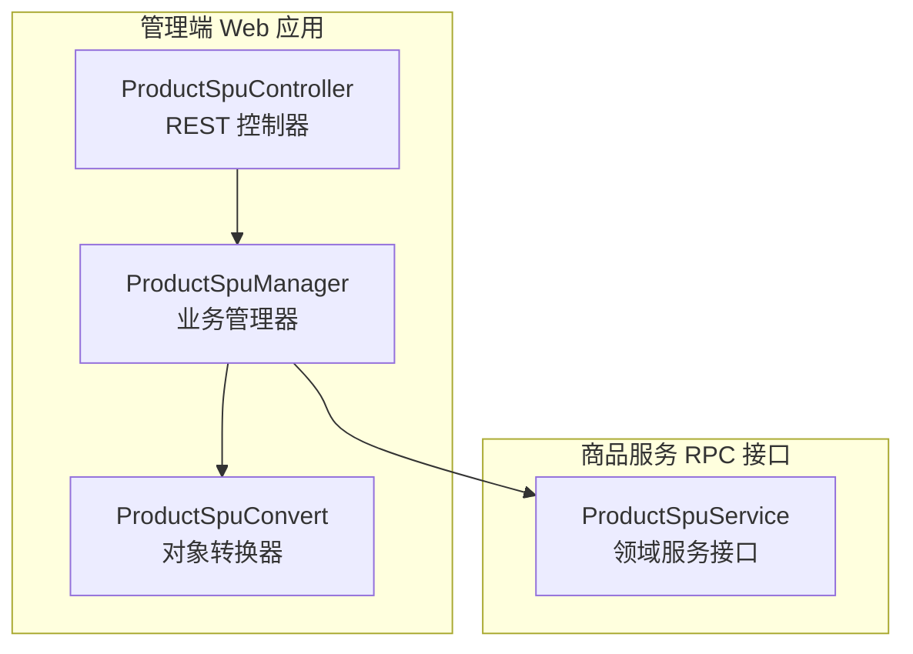
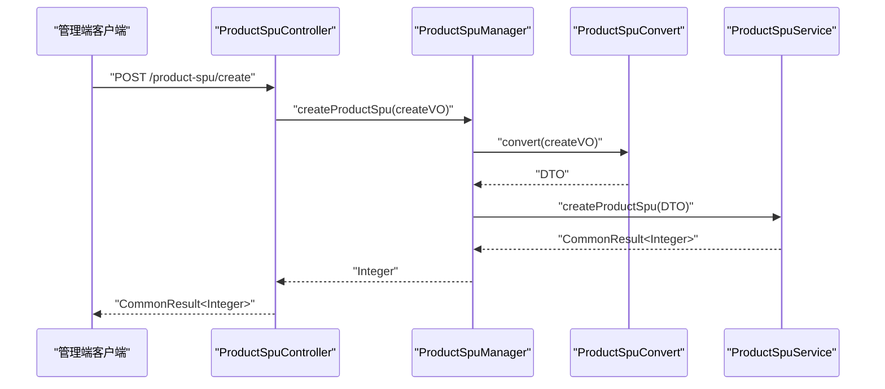
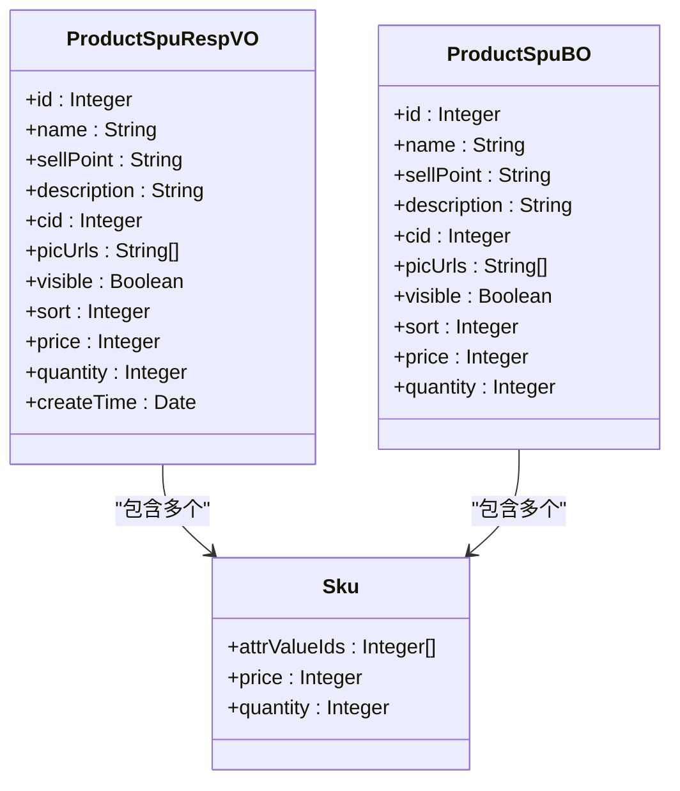
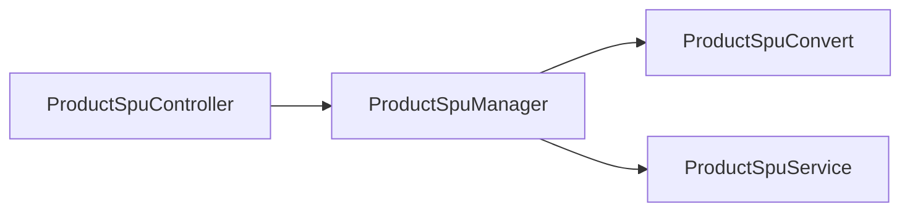

# SPU商品管理

<cite>
**本文引用的文件**
- [ProductSpuController.java](file://management-web-app/src/main/java/cn/iocoder/mall/managementweb/controller/product/ProductSpuController.java)
- [ProductSpuCreateReqVO.java](file://management-web-app/src/main/java/cn/iocoder/mall/managementweb/controller/product/vo/spu/ProductSpuCreateReqVO.java)
- [ProductSpuUpdateReqVO.java](file://management-web-app/src/main/java/cn/iocoder/mall/managementweb/controller/product/vo/spu/ProductSpuUpdateReqVO.java)
- [ProductSpuPageReqVO.java](file://management-web-app/src/main/java/cn/iocoder/mall/managementweb/controller/product/vo/spu/ProductSpuPageReqVO.java)
- [ProductSpuRespVO.java](file://management-web-app/src/main/java/cn/iocoder/mall/managementweb/controller/product/vo/spu/ProductSpuRespVO.java)
- [ProductSpuManager.java](file://management-web-app/src/main/java/cn/iocoder/mall/managementweb/manager/product/ProductSpuManager.java)
- [ProductSpuConvert.java](file://management-web-app/src/main/java/cn/iocoder/mall/managementweb/convert/product/ProductSpuConvert.java)
- [ProductSpuService.java](file://moved/product/product-service-api/src/main/java/cn/iocoder/mall/product/api/ProductSpuService.java)
- [ProductSpuBO.java](file://moved/product/product-biz/src/main/java/cn/iocoder/mall/product/biz/bo/product/ProductSpuBO.java)
</cite>

## 目录
1. [简介](#简介)
2. [项目结构](#项目结构)
3. [核心组件](#核心组件)
4. [架构总览](#架构总览)
5. [详细组件分析](#详细组件分析)
6. [依赖分析](#依赖分析)
7. [性能考虑](#性能考虑)
8. [故障排查指南](#故障排查指南)
9. [结论](#结论)
10. [附录](#附录)

## 简介
本技术文档围绕SPU（标准产品单元）商品管理功能展开，系统性介绍SPU在管理后台侧的创建、更新、查询、分页等能力。文档重点覆盖：
- REST接口设计与调用规范（/create、/update、/get、/list、/page）
- SPU数据模型与字段约束
- 业务流程（商品审核、上下架、库存管理等）
- SPU与SKU、属性、分类的关联关系
- 完整的API接口文档与使用示例

## 项目结构
SPU相关代码采用“控制层-管理器-转换器-远程RPC”分层组织，管理端通过Controller接收请求，经由Manager调用RPC服务，最终落地到商品服务应用层。

图表来源
- [ProductSpuController.java:1-75](file://management-web-app/src/main/java/cn/iocoder/mall/managementweb/controller/product/ProductSpuController.java#L1-L75)
- [ProductSpuManager.java:1-85](file://management-web-app/src/main/java/cn/iocoder/mall/managementweb/manager/product/ProductSpuManager.java#L1-L85)
- [ProductSpuConvert.java:1-35](file://management-web-app/src/main/java/cn/iocoder/mall/managementweb/convert/product/ProductSpuConvert.java#L1-L35)
- [ProductSpuService.java:1-27](file://moved/product/product-service-api/src/main/java/cn/iocoder/mall/product/api/ProductSpuService.java#L1-L27)

章节来源
- [ProductSpuController.java:1-75](file://management-web-app/src/main/java/cn/iocoder/mall/managementweb/controller/product/ProductSpuController.java#L1-L75)
- [ProductSpuManager.java:1-85](file://management-web-app/src/main/java/cn/iocoder/mall/managementweb/manager/product/ProductSpuManager.java#L1-L85)
- [ProductSpuConvert.java:1-35](file://management-web-app/src/main/java/cn/iocoder/mall/managementweb/convert/product/ProductSpuConvert.java#L1-L35)
- [ProductSpuService.java:1-27](file://moved/product/product-service-api/src/main/java/cn/iocoder/mall/product/api/ProductSpuService.java#L1-L27)

## 核心组件
- REST控制器：提供SPU的创建、更新、查询、分页等HTTP接口，负责参数校验与响应封装。
- 管理器：作为业务编排层，负责调用RPC服务并进行错误处理。
- 转换器：负责VO与DTO之间的映射，确保接口层与RPC层的数据一致性。
- 领域服务接口：定义SPU领域能力边界，如详情查询、分页、列表等。

章节来源
- [ProductSpuController.java:25-75](file://management-web-app/src/main/java/cn/iocoder/mall/managementweb/controller/product/ProductSpuController.java#L25-L75)
- [ProductSpuManager.java:20-85](file://management-web-app/src/main/java/cn/iocoder/mall/managementweb/manager/product/ProductSpuManager.java#L20-L85)
- [ProductSpuConvert.java:17-35](file://management-web-app/src/main/java/cn/iocoder/mall/managementweb/convert/product/ProductSpuConvert.java#L17-L35)
- [ProductSpuService.java:12-27](file://moved/product/product-service-api/src/main/java/cn/iocoder/mall/product/api/ProductSpuService.java#L12-L27)

## 架构总览
SPU管理采用前后端分离与微服务架构结合的方式：管理端Web应用通过REST接口暴露能力，内部通过Dubbo RPC调用商品服务接口；商品服务实现具体业务逻辑。

图表来源
- [ProductSpuController.java:34-38](file://management-web-app/src/main/java/cn/iocoder/mall/managementweb/controller/product/ProductSpuController.java#L34-L38)
- [ProductSpuManager.java:32-36](file://management-web-app/src/main/java/cn/iocoder/mall/managementweb/manager/product/ProductSpuManager.java#L32-L36)
- [ProductSpuConvert.java:22](file://management-web-app/src/main/java/cn/iocoder/mall/managementweb/convert/product/ProductSpuConvert.java#L22)
- [ProductSpuService.java:14](file://moved/product/product-service-api/src/main/java/cn/iocoder/mall/product/api/ProductSpuService.java#L14)

## 详细组件分析

### REST接口设计与业务逻辑
- 接口路径与方法
  - POST /product-spu/create：创建SPU及SKU
  - POST /product-spu/update：更新SPU及SKU
  - GET /product-spu/get：按ID获取SPU详情
  - GET /product-spu/list：按ID列表批量获取SPU
  - GET /product-spu/page：分页查询SPU（支持名称、分类、上下架状态、是否有库存筛选）

- 参数与返回值
  - 创建/更新：请求体为对应VO（含SPU基础信息与SKU数组），返回为通用结果包装
  - 查询/列表/分页：返回VO或分页结果VO
  - 删除：暂不提供，避免复杂关联删除引发的问题

- 业务逻辑要点
  - 上架状态与库存状态组合：在售中（已上架且有库存）、已售罄（已上架但无库存）、仓库中（未上架）
  - SKU校验：价格与库存均需大于等于1，规格值数组必填
  - 图片URL：支持多图，逗号分隔

章节来源
- [ProductSpuController.java:34-69](file://management-web-app/src/main/java/cn/iocoder/mall/managementweb/controller/product/ProductSpuController.java#L34-L69)
- [ProductSpuCreateReqVO.java:14-74](file://management-web-app/src/main/java/cn/iocoder/mall/managementweb/controller/product/vo/spu/ProductSpuCreateReqVO.java#L14-L74)
- [ProductSpuUpdateReqVO.java:14-78](file://management-web-app/src/main/java/cn/iocoder/mall/managementweb/controller/product/vo/spu/ProductSpuUpdateReqVO.java#L14-L78)
- [ProductSpuPageReqVO.java:9-24](file://management-web-app/src/main/java/cn/iocoder/mall/managementweb/controller/product/vo/spu/ProductSpuPageReqVO.java#L9-L24)
- [ProductSpuRespVO.java:7-35](file://management-web-app/src/main/java/cn/iocoder/mall/managementweb/controller/product/vo/spu/ProductSpuRespVO.java#L7-L35)

### 数据模型与字段约束
- SPU基础信息
  - 名称、卖点、描述、分类编号、主图URL列表、是否上架、排序字段、创建时间
  - 价格与库存为聚合值（来自SKU的最小价格与库存合计）
- SKU信息
  - 规格值ID数组、价格（分）、库存数量
- 字段约束
  - 所有非空字段均配置了校验注解，如非空、最小值等
  - 主图URL列表支持多值，逗号分隔

章节来源
- [ProductSpuRespVO.java:9-35](file://management-web-app/src/main/java/cn/iocoder/mall/managementweb/controller/product/vo/spu/ProductSpuRespVO.java#L9-L35)
- [ProductSpuCreateReqVO.java:16-74](file://management-web-app/src/main/java/cn/iocoder/mall/managementweb/controller/product/vo/spu/ProductSpuCreateReqVO.java#L16-L74)
- [ProductSpuUpdateReqVO.java:16-78](file://management-web-app/src/main/java/cn/iocoder/mall/managementweb/controller/product/vo/spu/ProductSpuUpdateReqVO.java#L16-L78)
- [ProductSpuBO.java:12-75](file://moved/product/product-biz/src/main/java/cn/iocoder/mall/product/biz/bo/product/ProductSpuBO.java#L12-L75)

### 业务流程与关联关系
- 业务流程
  - 商品创建：提交SPU与SKU信息，系统生成SPU并绑定SKU
  - 商品更新：可修改SPU基本信息与SKU集合
  - 商品查询：支持单个详情、批量查询、分页查询
  - 上下架与库存：通过visible与hasQuantity组合表达不同状态
- 关联关系
  - SPU与SKU：一对多，SPU包含多个SKU，价格与库存为SKU聚合
  - SPU与分类：SPU属于某个分类
  - SPU与属性：SKU通过规格值ID关联属性值

图表来源
- [ProductSpuRespVO.java:9-35](file://management-web-app/src/main/java/cn/iocoder/mall/managementweb/controller/product/vo/spu/ProductSpuRespVO.java#L9-L35)
- [ProductSpuCreateReqVO.java:23-43](file://management-web-app/src/main/java/cn/iocoder/mall/managementweb/controller/product/vo/spu/ProductSpuCreateReqVO.java#L23-L43)
- [ProductSpuUpdateReqVO.java:23-43](file://management-web-app/src/main/java/cn/iocoder/mall/managementweb/controller/product/vo/spu/ProductSpuUpdateReqVO.java#L23-L43)
- [ProductSpuBO.java:14-75](file://moved/product/product-biz/src/main/java/cn/iocoder/mall/product/biz/bo/product/ProductSpuBO.java#L14-L75)

### API接口文档与使用示例
- 创建SPU
  - 方法与路径：POST /product-spu/create
  - 请求体：ProductSpuCreateReqVO（包含SPU基础信息与SKU数组）
  - 返回：CommonResult<Integer>（SPU编号）
- 更新SPU
  - 方法与路径：POST /product-spu/update
  - 请求体：ProductSpuUpdateReqVO（包含SPU编号与更新信息）
  - 返回：CommonResult<Boolean>（true表示成功）
- 获取SPU详情
  - 方法与路径：GET /product-spu/get
  - 查询参数：productSpuId（SPU编号）
  - 返回：CommonResult<ProductSpuRespVO>
- 批量获取SPU
  - 方法与路径：GET /product-spu/list
  - 查询参数：productSpuIds（编号列表）
  - 返回：CommonResult<List<ProductSpuRespVO>>
- 分页查询SPU
  - 方法与路径：GET /product-spu/page
  - 查询参数：name（模糊）、cid（分类）、visible（是否上架）、hasQuantity（是否有库存）
  - 返回：CommonResult<PageResult<ProductSpuRespVO>>

章节来源
- [ProductSpuController.java:34-69](file://management-web-app/src/main/java/cn/iocoder/mall/managementweb/controller/product/ProductSpuController.java#L34-L69)
- [ProductSpuCreateReqVO.java:14-74](file://management-web-app/src/main/java/cn/iocoder/mall/managementweb/controller/product/vo/spu/ProductSpuCreateReqVO.java#L14-L74)
- [ProductSpuUpdateReqVO.java:14-78](file://management-web-app/src/main/java/cn/iocoder/mall/managementweb/controller/product/vo/spu/ProductSpuUpdateReqVO.java#L14-L78)
- [ProductSpuPageReqVO.java:9-24](file://management-web-app/src/main/java/cn/iocoder/mall/managementweb/controller/product/vo/spu/ProductSpuPageReqVO.java#L9-L24)
- [ProductSpuRespVO.java:7-35](file://management-web-app/src/main/java/cn/iocoder/mall/managementweb/controller/product/vo/spu/ProductSpuRespVO.java#L7-L35)

## 依赖分析
- 控制器依赖管理器
- 管理器依赖RPC接口与转换器
- 转换器负责VO与DTO映射
- 领域服务接口定义SPU能力边界

图表来源
- [ProductSpuController.java:25-32](file://management-web-app/src/main/java/cn/iocoder/mall/managementweb/controller/product/ProductSpuController.java#L25-L32)
- [ProductSpuManager.java:20-24](file://management-web-app/src/main/java/cn/iocoder/mall/managementweb/manager/product/ProductSpuManager.java#L20-L24)
- [ProductSpuConvert.java:17-20](file://management-web-app/src/main/java/cn/iocoder/mall/managementweb/convert/product/ProductSpuConvert.java#L17-L20)
- [ProductSpuService.java:12-12](file://moved/product/product-service-api/src/main/java/cn/iocoder/mall/product/api/ProductSpuService.java#L12-L12)

章节来源
- [ProductSpuController.java:25-32](file://management-web-app/src/main/java/cn/iocoder/mall/managementweb/controller/product/ProductSpuController.java#L25-L32)
- [ProductSpuManager.java:20-24](file://management-web-app/src/main/java/cn/iocoder/mall/managementweb/manager/product/ProductSpuManager.java#L20-L24)
- [ProductSpuConvert.java:17-20](file://management-web-app/src/main/java/cn/iocoder/mall/managementweb/convert/product/ProductSpuConvert.java#L17-L20)
- [ProductSpuService.java:12-12](file://moved/product/product-service-api/src/main/java/cn/iocoder/mall/product/api/ProductSpuService.java#L12-L12)

## 性能考虑
- 分页查询建议：合理设置分页大小与筛选条件，避免全量扫描
- 批量查询：使用/list接口一次性获取多个SPU，减少网络往返
- SKU聚合：价格与库存为SKU聚合值，避免重复计算
- 缓存策略：对热点SPU详情可引入缓存，降低RPC调用压力

## 故障排查指南
- 参数校验失败：检查请求体字段是否满足非空与范围约束（如价格与库存最小值）
- RPC调用异常：确认RPC版本配置与服务可用性
- 返回结果为空：核对筛选条件与数据是否存在

章节来源
- [ProductSpuCreateReqVO.java:28-41](file://management-web-app/src/main/java/cn/iocoder/mall/managementweb/controller/product/vo/spu/ProductSpuCreateReqVO.java#L28-L41)
- [ProductSpuUpdateReqVO.java:28-41](file://management-web-app/src/main/java/cn/iocoder/mall/managementweb/controller/product/vo/spu/ProductSpuUpdateReqVO.java#L28-L41)
- [ProductSpuManager.java:32-46](file://management-web-app/src/main/java/cn/iocoder/mall/managementweb/manager/product/ProductSpuManager.java#L32-L46)

## 结论
SPU商品管理通过清晰的分层设计与严格的参数校验，提供了完善的创建、更新、查询与分页能力。结合SKU聚合与上下架/库存状态组合，能够满足管理后台对商品全生命周期的管理需求。后续可在缓存与批量操作方面进一步优化性能。

## 附录
- 删除接口：当前未提供删除功能，避免复杂关联删除带来的风险
- 业务状态说明：在售中（已上架且有库存）、已售罄（已上架但无库存）、仓库中（未上架）