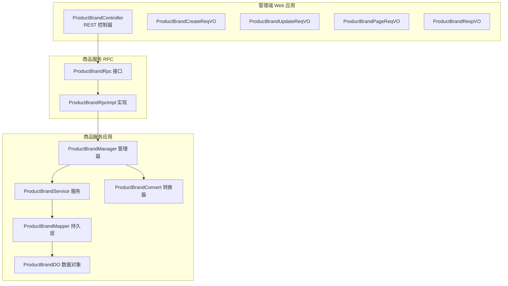
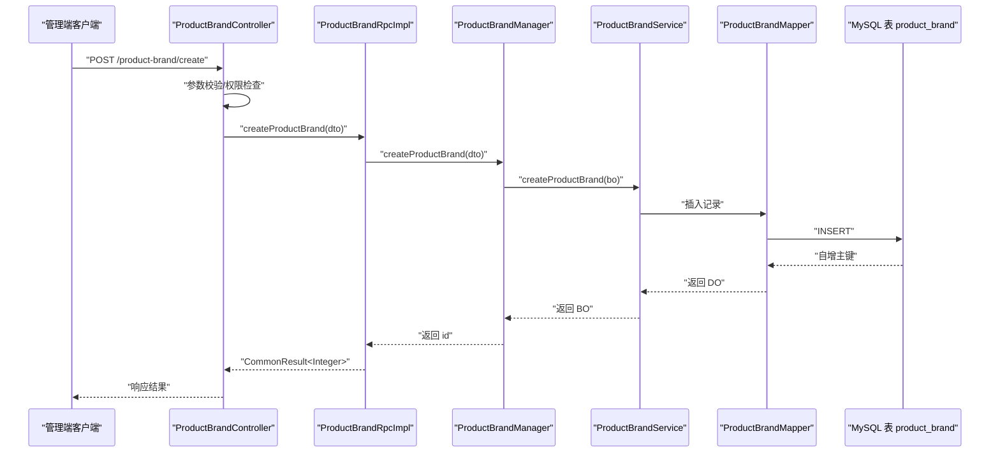
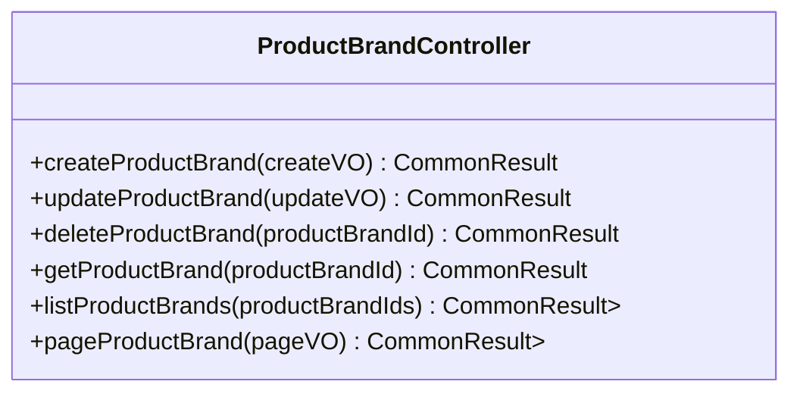
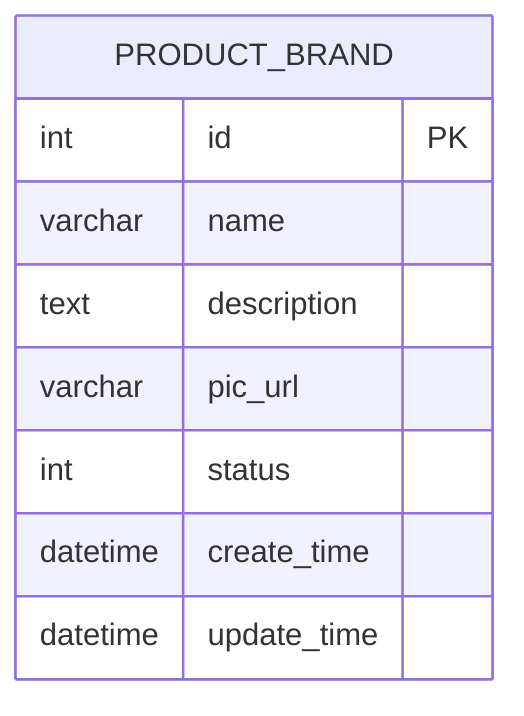
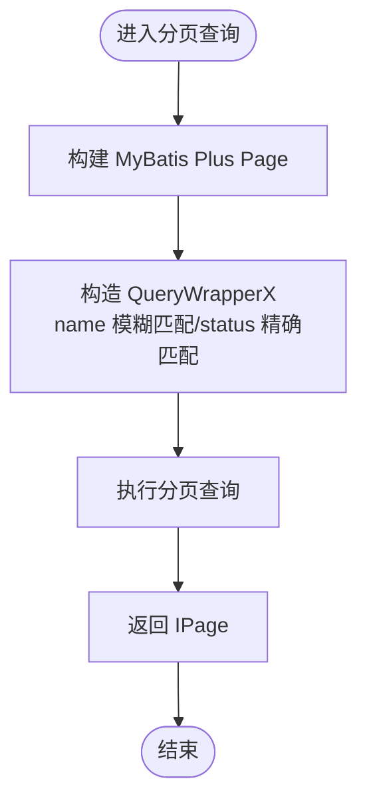
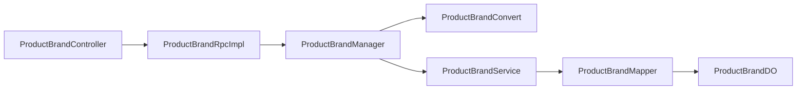

# 品牌管理

<cite>
**本文引用的文件**
- [ProductBrandController.java](file://management-web-app/src/main/java/cn/iocoder/mall/managementweb/controller/product/ProductBrandController.java)
- [ProductBrandCreateReqVO.java](file://management-web-app/src/main/java/cn/iocoder/mall/managementweb/controller/product/vo/brand/ProductBrandCreateReqVO.java)
- [ProductBrandUpdateReqVO.java](file://management-web-app/src/main/java/cn/iocoder/mall/managementweb/controller/product/vo/brand/ProductBrandUpdateReqVO.java)
- [ProductBrandPageReqVO.java](file://management-web-app/src/main/java/cn/iocoder/mall/managementweb/controller/product/vo/brand/ProductBrandPageReqVO.java)
- [ProductBrandRespVO.java](file://management-web-app/src/main/java/cn/iocoder/mall/managementweb/controller/product/vo/brand/ProductBrandRespVO.java)
- [ProductBrandRpc.java](file://product-service-project/product-service-api/src/main/java/cn/iocoder/mall/productservice/rpc/brand/ProductBrandRpc.java)
- [ProductBrandRpcImpl.java](file://product-service-project/product-service-app/src/main/java/cn/iocoder/mall/productservice/rpc/brand/ProductBrandRpcImpl.java)
- [ProductBrandManager.java](file://product-service-project/product-service-app/src/main/java/cn/iocoder/mall/productservice/manager/brand/ProductBrandManager.java)
- [ProductBrandConvert.java](file://product-service-project/product-service-app/src/main/java/cn/iocoder/mall/productservice/convert/brand/ProductBrandConvert.java)
- [ProductBrandDO.java](file://product-service-project/product-service-app/src/main/java/cn/iocoder/mall/productservice/dal/mysql/dataobject/brand/ProductBrandDO.java)
- [ProductBrandMapper.java](file://product-service-project/product-service-app/src/main/java/cn/iocoder/mall/productservice/dal/mysql/mapper/brand/ProductBrandMapper.java)
</cite>

## 目录
1. [简介](#简介)
2. [项目结构](#项目结构)
3. [核心组件](#核心组件)
4. [架构总览](#架构总览)
5. [详细组件分析](#详细组件分析)
6. [依赖分析](#依赖分析)
7. [性能考虑](#性能考虑)
8. [故障排查指南](#故障排查指南)
9. [结论](#结论)
10. [附录](#附录)

## 简介
本技术文档围绕“品牌管理”功能展开，系统性介绍商品品牌的创建、更新、查询与分页等能力；详解管理端控制器 ProductBrandController 的接口设计与权限控制；梳理品牌数据模型与字段语义；阐述品牌与商品 SPU 的关联关系及在商品展示与搜索中的作用；并提供完整的接口清单与交互时序图，帮助开发者快速理解与集成。

## 项目结构
品牌管理功能横跨“管理端 Web 应用”与“商品服务应用”，采用典型的分层架构：Web 控制器负责权限校验与参数封装，RPC 接口对外暴露能力，Manager 层编排业务逻辑，Service/DAO 层完成持久化与分页查询。

图表来源
- [ProductBrandController.java:26-82](file://management-web-app/src/main/java/cn/iocoder/mall/managementweb/controller/product/ProductBrandController.java#L26-L82)
- [ProductBrandRpc.java:15-63](file://product-service-project/product-service-api/src/main/java/cn/iocoder/mall/productservice/rpc/brand/ProductBrandRpc.java#L15-L63)
- [ProductBrandRpcImpl.java:21-58](file://product-service-project/product-service-app/src/main/java/cn/iocoder/mall/productservice/rpc/brand/ProductBrandRpcImpl.java#L21-L58)
- [ProductBrandManager.java:20-86](file://product-service-project/product-service-app/src/main/java/cn/iocoder/mall/productservice/manager/brand/ProductBrandManager.java#L20-L86)
- [ProductBrandConvert.java:21-48](file://product-service-project/product-service-app/src/main/java/cn/iocoder/mall/productservice/convert/brand/ProductBrandConvert.java#L21-L48)
- [ProductBrandMapper.java:13-25](file://product-service-project/product-service-app/src/main/java/cn/iocoder/mall/productservice/dal/mysql/mapper/brand/ProductBrandMapper.java#L13-L25)
- [ProductBrandDO.java:17-41](file://product-service-project/product-service-app/src/main/java/cn/iocoder/mall/productservice/dal/mysql/dataobject/brand/ProductBrandDO.java#L17-L41)

章节来源
- [ProductBrandController.java:26-82](file://management-web-app/src/main/java/cn/iocoder/mall/managementweb/controller/product/ProductBrandController.java#L26-L82)
- [ProductBrandRpc.java:15-63](file://product-service-project/product-service-api/src/main/java/cn/iocoder/mall/productservice/rpc/brand/ProductBrandRpc.java#L15-L63)
- [ProductBrandRpcImpl.java:21-58](file://product-service-project/product-service-app/src/main/java/cn/iocoder/mall/productservice/rpc/brand/ProductBrandRpcImpl.java#L21-L58)
- [ProductBrandManager.java:20-86](file://product-service-project/product-service-app/src/main/java/cn/iocoder/mall/productservice/manager/brand/ProductBrandManager.java#L20-L86)
- [ProductBrandConvert.java:21-48](file://product-service-project/product-service-app/src/main/java/cn/iocoder/mall/productservice/convert/brand/ProductBrandConvert.java#L21-L48)
- [ProductBrandMapper.java:13-25](file://product-service-project/product-service-app/src/main/java/cn/iocoder/mall/productservice/dal/mysql/mapper/brand/ProductBrandMapper.java#L13-L25)
- [ProductBrandDO.java:17-41](file://product-service-project/product-service-app/src/main/java/cn/iocoder/mall/productservice/dal/mysql/dataobject/brand/ProductBrandDO.java#L17-L41)

## 核心组件
- 管理端控制器：提供品牌创建、更新、删除、单个查询、批量查询、分页查询等接口，并通过注解进行权限控制。
- RPC 接口与实现：统一对外暴露品牌能力，使用 Dubbo 注解发布服务。
- 管理器：编排转换与调用服务层，返回 VO/DTO 结果。
- 转换器：MapStruct 将 VO/DTO 与 BO/DO 进行双向转换。
- 数据模型与持久层：定义品牌表结构、分页查询与按名称唯一性约束。

章节来源
- [ProductBrandController.java:35-80](file://management-web-app/src/main/java/cn/iocoder/mall/managementweb/controller/product/ProductBrandController.java#L35-L80)
- [ProductBrandRpc.java:15-63](file://product-service-project/product-service-api/src/main/java/cn/iocoder/mall/productservice/rpc/brand/ProductBrandRpc.java#L15-L63)
- [ProductBrandRpcImpl.java:21-58](file://product-service-project/product-service-app/src/main/java/cn/iocoder/mall/productservice/rpc/brand/ProductBrandRpcImpl.java#L21-L58)
- [ProductBrandManager.java:20-86](file://product-service-project/product-service-app/src/main/java/cn/iocoder/mall/productservice/manager/brand/ProductBrandManager.java#L20-L86)
- [ProductBrandConvert.java:21-48](file://product-service-project/product-service-app/src/main/java/cn/iocoder/mall/productservice/convert/brand/ProductBrandConvert.java#L21-L48)
- [ProductBrandDO.java:17-41](file://product-service-project/product-service-app/src/main/java/cn/iocoder/mall/productservice/dal/mysql/dataobject/brand/ProductBrandDO.java#L17-L41)
- [ProductBrandMapper.java:13-25](file://product-service-project/product-service-app/src/main/java/cn/iocoder/mall/productservice/dal/mysql/mapper/brand/ProductBrandMapper.java#L13-L25)

## 架构总览
品牌管理采用“Web 控制器 → RPC 接口 → 管理器 → 服务/DAO”的分层设计，遵循请求参数 VO → DTO/BO → DO 的转换链路，分页查询通过 MyBatis Plus 的 Page 与 QueryWrapperX 组合实现。

图表来源
- [ProductBrandController.java:35-40](file://management-web-app/src/main/java/cn/iocoder/mall/managementweb/controller/product/ProductBrandController.java#L35-L40)
- [ProductBrandRpcImpl.java:27-28](file://product-service-project/product-service-app/src/main/java/cn/iocoder/mall/productservice/rpc/brand/ProductBrandRpcImpl.java#L27-L28)
- [ProductBrandManager.java:31-33](file://product-service-project/product-service-app/src/main/java/cn/iocoder/mall/productservice/manager/brand/ProductBrandManager.java#L31-L33)
- [ProductBrandMapper.java:13-19](file://product-service-project/product-service-app/src/main/java/cn/iocoder/mall/productservice/dal/mysql/mapper/brand/ProductBrandMapper.java#L13-L19)
- [ProductBrandDO.java:17-41](file://product-service-project/product-service-app/src/main/java/cn/iocoder/mall/productservice/dal/mysql/dataobject/brand/ProductBrandDO.java#L17-L41)

## 详细组件分析

### 控制器：ProductBrandController
- 路由前缀：/product-brand
- 权限注解：基于 product:brand:* 的细粒度权限控制
- 主要接口：
  - POST /create：创建品牌
  - POST /update：更新品牌
  - POST /delete：删除品牌
  - GET /get：按编号获取品牌
  - GET /list：按编号列表批量获取
  - GET /page：分页查询

图表来源
- [ProductBrandController.java:35-80](file://management-web-app/src/main/java/cn/iocoder/mall/managementweb/controller/product/ProductBrandController.java#L35-L80)

章节来源
- [ProductBrandController.java:26-82](file://management-web-app/src/main/java/cn/iocoder/mall/managementweb/controller/product/ProductBrandController.java#L26-L82)

### 数据模型：ProductBrandDO
- 表名：product_brand
- 字段要点：
  - id：主键
  - name：品牌名称
  - description：品牌描述
  - picUrl：品牌图片地址
  - status：状态（配合通用状态枚举）
  - 公共字段：创建/更新时间等（继承自可删除基类）

图表来源
- [ProductBrandDO.java:17-41](file://product-service-project/product-service-app/src/main/java/cn/iocoder/mall/productservice/dal/mysql/dataobject/brand/ProductBrandDO.java#L17-L41)

章节来源
- [ProductBrandDO.java:17-41](file://product-service-project/product-service-app/src/main/java/cn/iocoder/mall/productservice/dal/mysql/dataobject/brand/ProductBrandDO.java#L17-L41)

### 分页与查询：ProductBrandMapper
- 分页：基于 Page 与 QueryWrapperX，支持按名称模糊与状态精确过滤
- 唯一性：按名称查询唯一品牌记录

图表来源
- [ProductBrandMapper.java:15-19](file://product-service-project/product-service-app/src/main/java/cn/iocoder/mall/productservice/dal/mysql/mapper/brand/ProductBrandMapper.java#L15-L19)

章节来源
- [ProductBrandMapper.java:13-25](file://product-service-project/product-service-app/src/main/java/cn/iocoder/mall/productservice/dal/mysql/mapper/brand/ProductBrandMapper.java#L13-L25)

### 参数与响应 VO/DTO
- 创建请求 VO：包含名称、描述、图片、状态
- 更新请求 VO：包含 id、名称、描述、图片、状态
- 分页请求 VO：继承分页参数，携带名称与状态过滤条件
- 响应 VO：包含 id、名称、描述、图片、状态、创建时间

章节来源
- [ProductBrandCreateReqVO.java:11-18](file://management-web-app/src/main/java/cn/iocoder/mall/managementweb/controller/product/vo/brand/ProductBrandCreateReqVO.java#L11-L18)
- [ProductBrandUpdateReqVO.java:11-20](file://management-web-app/src/main/java/cn/iocoder/mall/managementweb/controller/product/vo/brand/ProductBrandUpdateReqVO.java#L11-L20)
- [ProductBrandPageReqVO.java:14-17](file://management-web-app/src/main/java/cn/iocoder/mall/managementweb/controller/product/vo/brand/ProductBrandPageReqVO.java#L14-L17)
- [ProductBrandRespVO.java:11-22](file://management-web-app/src/main/java/cn/iocoder/mall/managementweb/controller/product/vo/brand/ProductBrandRespVO.java#L11-L22)

### RPC 接口与实现
- 接口方法覆盖创建、更新、删除、单查、批量查、分页查
- 实现类通过 @DubboService 发布服务，内部委托给 Manager

章节来源
- [ProductBrandRpc.java:15-63](file://product-service-project/product-service-api/src/main/java/cn/iocoder/mall/productservice/rpc/brand/ProductBrandRpc.java#L15-L63)
- [ProductBrandRpcImpl.java:21-58](file://product-service-project/product-service-app/src/main/java/cn/iocoder/mall/productservice/rpc/brand/ProductBrandRpcImpl.java#L21-L58)

### 管理器与转换器
- 管理器：编排 DTO/VO 到 BO/DO 的转换，调用服务层并返回 VO/DTO
- 转换器：MapStruct 定义多组映射，含分页转换

章节来源
- [ProductBrandManager.java:20-86](file://product-service-project/product-service-app/src/main/java/cn/iocoder/mall/productservice/manager/brand/ProductBrandManager.java#L20-L86)
- [ProductBrandConvert.java:21-48](file://product-service-project/product-service-app/src/main/java/cn/iocoder/mall/productservice/convert/brand/ProductBrandConvert.java#L21-L48)

## 依赖分析
- 控制器依赖 RPC 接口，实现对内聚合
- RPC 实现依赖管理器
- 管理器依赖服务层与转换器
- 服务层依赖持久层与数据对象
- VO/DTO/BO/DO 之间通过转换器解耦

图表来源
- [ProductBrandController.java:32-33](file://management-web-app/src/main/java/cn/iocoder/mall/managementweb/controller/product/ProductBrandController.java#L32-L33)
- [ProductBrandRpcImpl.java:23-24](file://product-service-project/product-service-app/src/main/java/cn/iocoder/mall/productservice/rpc/brand/ProductBrandRpcImpl.java#L23-L24)
- [ProductBrandManager.java:22-23](file://product-service-project/product-service-app/src/main/java/cn/iocoder/mall/productservice/manager/brand/ProductBrandManager.java#L22-L23)
- [ProductBrandConvert.java:23-23](file://product-service-project/product-service-app/src/main/java/cn/iocoder/mall/productservice/convert/brand/ProductBrandConvert.java#L23-L23)
- [ProductBrandMapper.java:13-13](file://product-service-project/product-service-app/src/main/java/cn/iocoder/mall/productservice/dal/mysql/mapper/brand/ProductBrandMapper.java#L13-L13)
- [ProductBrandDO.java:17-17](file://product-service-project/product-service-app/src/main/java/cn/iocoder/mall/productservice/dal/mysql/dataobject/brand/ProductBrandDO.java#L17-L17)

章节来源
- [ProductBrandController.java:32-33](file://management-web-app/src/main/java/cn/iocoder/mall/managementweb/controller/product/ProductBrandController.java#L32-L33)
- [ProductBrandRpcImpl.java:23-24](file://product-service-project/product-service-app/src/main/java/cn/iocoder/mall/productservice/rpc/brand/ProductBrandRpcImpl.java#L23-L24)
- [ProductBrandManager.java:22-23](file://product-service-project/product-service-app/src/main/java/cn/iocoder/mall/productservice/manager/brand/ProductBrandManager.java#L22-L23)
- [ProductBrandConvert.java:23-23](file://product-service-project/product-service-app/src/main/java/cn/iocoder/mall/productservice/convert/brand/ProductBrandConvert.java#L23-L23)
- [ProductBrandMapper.java:13-13](file://product-service-project/product-service-app/src/main/java/cn/iocoder/mall/productservice/dal/mysql/mapper/brand/ProductBrandMapper.java#L13-L13)
- [ProductBrandDO.java:17-17](file://product-service-project/product-service-app/src/main/java/cn/iocoder/mall/productservice/dal/mysql/dataobject/brand/ProductBrandDO.java#L17-L17)

## 性能考虑
- 分页查询：使用 MyBatis Plus Page 与 QueryWrapperX，避免一次性加载全量数据
- 唯一性约束：按名称查询唯一记录，减少重复品牌
- 转换开销：MapStruct 自动生成映射代码，降低手动转换成本
- 缓存建议：可在 Manager 或 Service 层引入缓存（如 Redis）以加速热点品牌查询

## 故障排查指南
- 权限不足：确认是否具备 product:brand:* 权限
- 参数校验失败：检查 VO 字段是否符合要求（必填、示例值、范围）
- 唯一性冲突：若按名称创建重复品牌，需调整名称或处理异常
- 分页无结果：确认过滤条件（名称、状态）是否正确

## 结论
品牌管理模块以清晰的分层与职责划分实现了从管理端到服务层的完整链路，具备良好的扩展性与可维护性。通过统一的 RPC 接口与转换器，降低了各层之间的耦合度，便于后续引入缓存、审计与监控等能力。

## 附录

### API 接口清单
- 创建品牌
  - 方法：POST
  - 路径：/product-brand/create
  - 权限：product:brand:create
  - 请求体：ProductBrandCreateReqVO
  - 返回：CommonResult<Integer>（品牌编号）

- 更新品牌
  - 方法：POST
  - 路径：/product-brand/update
  - 权限：product:brand:update
  - 请求体：ProductBrandUpdateReqVO
  - 返回：CommonResult<Boolean>

- 删除品牌
  - 方法：POST
  - 路径：/product-brand/delete
  - 权限：product:brand:delete
  - 查询参数：productBrandId
  - 返回：CommonResult<Boolean>

- 获取单个品牌
  - 方法：GET
  - 路径：/product-brand/get
  - 权限：product:brand:page
  - 查询参数：productBrandId
  - 返回：CommonResult<ProductBrandRespVO>

- 批量获取品牌
  - 方法：GET
  - 路径：/product-brand/list
  - 权限：product:brand:page
  - 查询参数：productBrandIds（列表）
  - 返回：CommonResult<List<ProductBrandRespVO>>

- 品牌分页查询
  - 方法：GET
  - 路径：/product-brand/page
  - 权限：product:brand:page
  - 查询参数：ProductBrandPageReqVO（继承分页参数）
  - 返回：CommonResult<PageResult<ProductBrandRespVO>>

章节来源
- [ProductBrandController.java:35-80](file://management-web-app/src/main/java/cn/iocoder/mall/managementweb/controller/product/ProductBrandController.java#L35-L80)
- [ProductBrandCreateReqVO.java:11-18](file://management-web-app/src/main/java/cn/iocoder/mall/managementweb/controller/product/vo/brand/ProductBrandCreateReqVO.java#L11-L18)
- [ProductBrandUpdateReqVO.java:11-20](file://management-web-app/src/main/java/cn/iocoder/mall/managementweb/controller/product/vo/brand/ProductBrandUpdateReqVO.java#L11-L20)
- [ProductBrandPageReqVO.java:14-17](file://management-web-app/src/main/java/cn/iocoder/mall/managementweb/controller/product/vo/brand/ProductBrandPageReqVO.java#L14-L17)
- [ProductBrandRespVO.java:11-22](file://management-web-app/src/main/java/cn/iocoder/mall/managementweb/controller/product/vo/brand/ProductBrandRespVO.java#L11-L22)