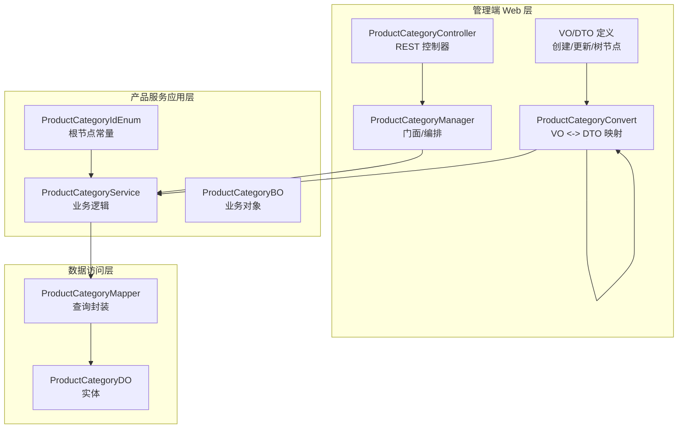
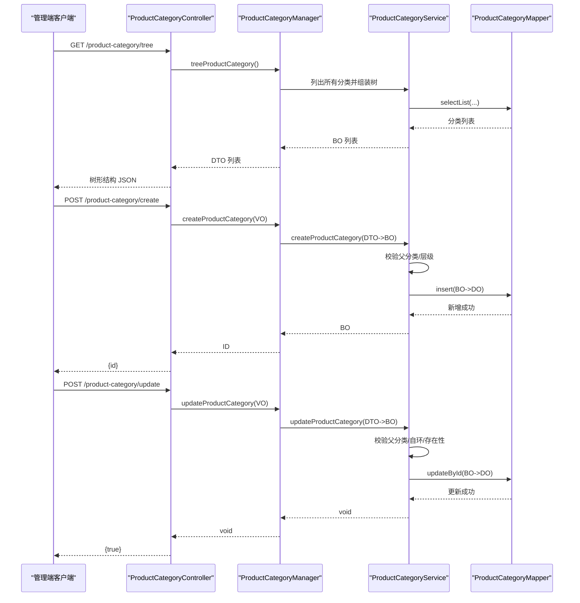
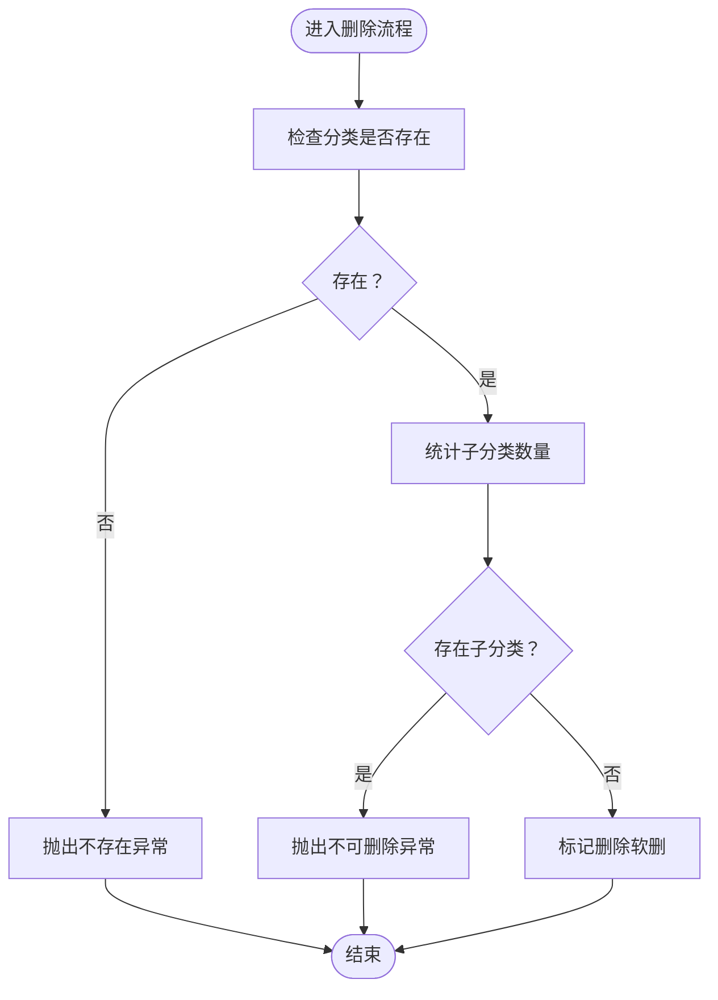

# 商品分类管理

<cite>
**本文引用的文件**
- [ProductCategoryController.java](file://management-web-app/src/main/java/cn/iocoder/mall/managementweb/controller/product/ProductCategoryController.java)
- [ProductCategoryCreateReqVO.java](file://management-web-app/src/main/java/cn/iocoder/mall/managementweb/controller/product/vo/category/ProductCategoryCreateReqVO.java)
- [ProductCategoryUpdateReqVO.java](file://management-web-app/src/main/java/cn/iocoder/mall/managementweb/controller/product/vo/category/ProductCategoryUpdateReqVO.java)
- [ProductCategoryTreeNodeRespVO.java](file://management-web-app/src/main/java/cn/iocoder/mall/managementweb/controller/product/vo/category/ProductCategoryTreeNodeRespVO.java)
- [ProductCategoryConvert.java](file://management-web-app/src/main/java/cn/iocoder/mall/managementweb/convert/product/ProductCategoryConvert.java)
- [ProductCategoryManager.java](file://management-web-app/src/main/java/cn/iocoder/mall/managementweb/manager/product/ProductCategoryManager.java)
- [ProductCategoryCreateReqDTO.java](file://product-service-project/product-service-api/src/main/java/cn/iocoder/mall/productservice/rpc/category/dto/ProductCategoryCreateReqDTO.java)
- [ProductCategoryUpdateReqDTO.java](file://product-service-project/product-service-api/src/main/java/cn/iocoder/mall/productservice/rpc/category/dto/ProductCategoryUpdateReqDTO.java)
- [ProductCategoryDO.java](file://product-service-project/product-service-app/src/main/java/cn/iocoder/mall/productservice/dal/mysql/dataobject/category/ProductCategoryDO.java)
- [ProductCategoryMapper.java](file://product-service-project/product-service-app/src/main/java/cn/iocoder/mall/productservice/dal/mysql/mapper/category/ProductCategoryMapper.java)
- [ProductCategoryService.java](file://product-service-project/product-service-app/src/main/java/cn/iocoder/mall/productservice/service/category/ProductCategoryService.java)
- [ProductCategoryBO.java](file://product-service-project/product-service-app/src/main/java/cn/iocoder/mall/productservice/service/category/bo/ProductCategoryBO.java)
- [ProductCategoryIdEnum.java](file://product-service-project/product-service-api/src/main/java/cn/iocoder/mall/productservice/enums/category/ProductCategoryIdEnum.java)
</cite>

## 目录
1. [简介](#简介)
2. [项目结构](#项目结构)
3. [核心组件](#核心组件)
4. [架构总览](#架构总览)
5. [详细组件分析](#详细组件分析)
6. [依赖分析](#依赖分析)
7. [性能考虑](#性能考虑)
8. [故障排查指南](#故障排查指南)
9. [结论](#结论)
10. [附录：接口与数据模型](#附录接口与数据模型)

## 简介
本技术文档围绕商品分类管理功能展开，系统性介绍分类的创建、更新、删除、查询树形结构等能力；深入解析 ProductCategoryController 的接口设计、分类层级管理与父子关系维护策略、分类排序机制；阐明商品分类的数据模型（名称、父级ID、层级、排序等）及业务规则（层级限制、重名检查、状态管理等）；并说明分类与商品SPU之间的关联关系及其在商品搜索与展示中的作用。最后提供完整的分类管理界面设计建议与API接口文档。

## 项目结构
商品分类管理涉及三层：管理端 Web 控制层、产品服务应用层、MyBatis 数据访问层。控制层负责对外暴露 REST 接口与参数校验；应用层负责业务逻辑与领域对象转换；数据层负责持久化与查询封装。

图表来源
- [ProductCategoryController.java:1-65](file://management-web-app/src/main/java/cn/iocoder/mall/managementweb/controller/product/ProductCategoryController.java#L1-L65)
- [ProductCategoryManager.java:1-88](file://management-web-app/src/main/java/cn/iocoder/mall/managementweb/manager/product/ProductCategoryManager.java#L1-L88)
- [ProductCategoryService.java:1-136](file://product-service-project/product-service-app/src/main/java/cn/iocoder/mall/productservice/service/category/ProductCategoryService.java#L1-L136)
- [ProductCategoryMapper.java:1-25](file://product-service-project/product-service-app/src/main/java/cn/iocoder/mall/productservice/dal/mysql/mapper/category/ProductCategoryMapper.java#L1-L25)
- [ProductCategoryDO.java:1-53](file://product-service-project/product-service-app/src/main/java/cn/iocoder/mall/productservice/dal/mysql/dataobject/category/ProductCategoryDO.java#L1-L53)
- [ProductCategoryBO.java:1-49](file://product-service-project/product-service-app/src/main/java/cn/iocoder/mall/productservice/service/category/bo/ProductCategoryBO.java#L1-L49)
- [ProductCategoryIdEnum.java:1-24](file://product-service-project/product-service-api/src/main/java/cn/iocoder/mall/productservice/enums/category/ProductCategoryIdEnum.java#L1-L24)

章节来源
- [ProductCategoryController.java:1-65](file://management-web-app/src/main/java/cn/iocoder/mall/managementweb/controller/product/ProductCategoryController.java#L1-L65)
- [ProductCategoryManager.java:1-88](file://management-web-app/src/main/java/cn/iocoder/mall/managementweb/manager/product/ProductCategoryManager.java#L1-L88)
- [ProductCategoryService.java:1-136](file://product-service-project/product-service-app/src/main/java/cn/iocoder/mall/productservice/service/category/ProductCategoryService.java#L1-L136)
- [ProductCategoryMapper.java:1-25](file://product-service-project/product-service-app/src/main/java/cn/iocoder/mall/productservice/dal/mysql/mapper/category/ProductCategoryMapper.java#L1-L25)
- [ProductCategoryDO.java:1-53](file://product-service-project/product-service-app/src/main/java/cn/iocoder/mall/productservice/dal/mysql/dataobject/category/ProductCategoryDO.java#L1-L53)
- [ProductCategoryBO.java:1-49](file://product-service-project/product-service-app/src/main/java/cn/iocoder/mall/productservice/service/category/bo/ProductCategoryBO.java#L1-L49)
- [ProductCategoryIdEnum.java:1-24](file://product-service-project/product-service-api/src/main/java/cn/iocoder/mall/productservice/enums/category/ProductCategoryIdEnum.java#L1-L24)

## 核心组件
- 控制层：ProductCategoryController 提供创建、更新、删除、树形查询四个接口，使用权限注解进行安全控制，并通过 VO 对外暴露请求/响应结构。
- 门面层：ProductCategoryManager 将 VO/DTO 转换为 BO，调用服务层执行业务逻辑，再做结果转换返回。
- 服务层：ProductCategoryService 实现业务规则校验（父分类存在性、父分类层级限制、自环校验、删除前置条件等），并完成数据库写入/更新/删除。
- 数据层：ProductCategoryMapper 提供按 pid 查询子节点数量、按条件查询列表等便捷方法；ProductCategoryDO 定义表结构字段。
- 枚举：ProductCategoryIdEnum 提供根节点标识，用于判断是否允许作为父节点。

章节来源
- [ProductCategoryController.java:24-64](file://management-web-app/src/main/java/cn/iocoder/mall/managementweb/controller/product/ProductCategoryController.java#L24-L64)
- [ProductCategoryManager.java:20-87](file://management-web-app/src/main/java/cn/iocoder/mall/managementweb/manager/product/ProductCategoryManager.java#L20-L87)
- [ProductCategoryService.java:27-135](file://product-service-project/product-service-app/src/main/java/cn/iocoder/mall/productservice/service/category/ProductCategoryService.java#L27-L135)
- [ProductCategoryMapper.java:12-24](file://product-service-project/product-service-app/src/main/java/cn/iocoder/mall/productservice/dal/mysql/mapper/category/ProductCategoryMapper.java#L12-L24)
- [ProductCategoryDO.java:14-52](file://product-service-project/product-service-app/src/main/java/cn/iocoder/mall/productservice/dal/mysql/dataobject/category/ProductCategoryDO.java#L14-L52)
- [ProductCategoryIdEnum.java:6-23](file://product-service-project/product-service-api/src/main/java/cn/iocoder/mall/productservice/enums/category/ProductCategoryIdEnum.java#L6-L23)

## 架构总览
下图展示了从管理端控制器到服务层再到数据层的完整调用链路，以及树形查询的典型流程。

图表来源
- [ProductCategoryController.java:33-62](file://management-web-app/src/main/java/cn/iocoder/mall/managementweb/controller/product/ProductCategoryController.java#L33-L62)
- [ProductCategoryManager.java:31-85](file://management-web-app/src/main/java/cn/iocoder/mall/managementweb/manager/product/ProductCategoryManager.java#L31-L85)
- [ProductCategoryService.java:38-87](file://product-service-project/product-service-app/src/main/java/cn/iocoder/mall/productservice/service/category/ProductCategoryService.java#L38-L87)
- [ProductCategoryMapper.java:19-22](file://product-service-project/product-service-app/src/main/java/cn/iocoder/mall/productservice/dal/mysql/mapper/category/ProductCategoryMapper.java#L19-L22)

## 详细组件分析

### 控制器：ProductCategoryController
- 接口职责
  - 创建分类：POST /product-category/create
  - 更新分类：POST /product-category/update
  - 删除分类：POST /product-category/delete
  - 树形查询：GET /product-category/tree
- 权限控制：每个接口均标注所需权限，确保后台管理的安全性。
- 参数校验：使用 VO 对请求参数进行非空、枚举值等校验，保证输入质量。
- 响应统一：返回统一的 CommonResult 包装结果。

章节来源
- [ProductCategoryController.java:24-64](file://management-web-app/src/main/java/cn/iocoder/mall/managementweb/controller/product/ProductCategoryController.java#L24-L64)

### VO/DTO/BO/DO 映射：ProductCategoryConvert
- 职责：实现 VO 与 DTO、DTO 与 BO、BO 与 DO 之间的双向转换，保证各层间数据结构一致。
- 关键映射
  - VO -> DTO（创建/更新）
  - DTO -> BO（服务层入参）
  - BO -> DTO/VO（服务层出参）

章节来源
- [ProductCategoryConvert.java:13-26](file://management-web-app/src/main/java/cn/iocoder/mall/managementweb/convert/product/ProductCategoryConvert.java#L13-L26)

### 门面层：ProductCategoryManager
- 职责：编排业务流程，负责 VO/DTO 与 BO 的转换，调用服务层执行具体操作。
- 方法
  - createProductCategory
  - updateProductCategory
  - deleteProductCategory
  - getProductCategory/listProductCategories
  - treeProductCategory（由服务层生成树形结构）

章节来源
- [ProductCategoryManager.java:20-87](file://management-web-app/src/main/java/cn/iocoder/mall/managementweb/manager/product/ProductCategoryManager.java#L20-L87)

### 服务层：ProductCategoryService
- 业务规则
  - 父分类校验：仅允许 ROOT 为根或一级分类作为父节点；若指定父节点，需存在且 pid 必须为 ROOT。
  - 自环校验：禁止将自身设为父节点。
  - 删除前置条件：仅当无子分类时可删除；保留“无商品绑定”的约束提示。
  - 查询能力：支持按 id、ids、条件列表查询；提供树形组装能力（由上层调用）。
- 关键方法
  - createProductCategory
  - updateProductCategory
  - deleteProductCategory
  - getProductCategory
  - listProductCategories

图表来源
- [ProductCategoryService.java:74-87](file://product-service-project/product-service-app/src/main/java/cn/iocoder/mall/productservice/service/category/ProductCategoryService.java#L74-L87)

章节来源
- [ProductCategoryService.java:27-135](file://product-service-project/product-service-app/src/main/java/cn/iocoder/mall/productservice/service/category/ProductCategoryService.java#L27-L135)

### 数据访问层：ProductCategoryMapper/DO
- Mapper 扩展
  - selectCountByPid：按父节点统计子节点数量
  - selectList：按 pid/status 等条件查询列表
- DO 字段
  - id、pid、name、description、picUrl、sort、status、createTime 等
- 与通用基类集成：继承可删除基类，支持软删除策略

章节来源
- [ProductCategoryMapper.java:12-24](file://product-service-project/product-service-app/src/main/java/cn/iocoder/mall/productservice/dal/mysql/mapper/category/ProductCategoryMapper.java#L12-L24)
- [ProductCategoryDO.java:14-52](file://product-service-project/product-service-app/src/main/java/cn/iocoder/mall/productservice/dal/mysql/dataobject/category/ProductCategoryDO.java#L14-L52)

### 数据模型与业务规则

#### 数据模型（ProductCategoryDO/BO）
- 字段说明
  - id：分类编号（主键）
  - pid：父分类编号（pid=ROOT 时表示根节点）
  - name：分类名称
  - description：分类描述
  - picUrl：分类图片（通常根分类配置）
  - sort：排序权重（数值越小越靠前）
  - status：状态（启用/禁用）
  - createTime：创建时间
- 层级与父子关系
  - 通过 pid 指向父节点；ROOT 为根节点标识（来源于枚举）。
- 状态管理
  - 使用通用状态枚举进行约束，确保状态值合法。

章节来源
- [ProductCategoryDO.java:14-52](file://product-service-project/product-service-app/src/main/java/cn/iocoder/mall/productservice/dal/mysql/dataobject/category/ProductCategoryDO.java#L14-L52)
- [ProductCategoryBO.java:11-48](file://product-service-project/product-service-app/src/main/java/cn/iocoder/mall/productservice/service/category/bo/ProductCategoryBO.java#L11-L48)
- [ProductCategoryIdEnum.java:6-23](file://product-service-project/product-service-api/src/main/java/cn/iocoder/mall/productservice/enums/category/ProductCategoryIdEnum.java#L6-L23)

#### 业务规则
- 父节点层级限制
  - 仅允许 ROOT 或一级分类作为父节点；二级及以上分类不可作为父节点。
- 自环校验
  - 禁止将分类自身设为父节点。
- 删除规则
  - 仅当无子分类时可删除；保留“无商品绑定”约束提示。
- 排序与展示
  - 通过 sort 字段控制展示顺序；数值越小优先级越高。
- 状态控制
  - 启用/禁用影响前端展示与搜索可见性。

章节来源
- [ProductCategoryService.java:121-133](file://product-service-project/product-service-app/src/main/java/cn/iocoder/mall/productservice/service/category/ProductCategoryService.java#L121-L133)
- [ProductCategoryService.java:53-67](file://product-service-project/product-service-app/src/main/java/cn/iocoder/mall/productservice/service/category/ProductCategoryService.java#L53-L67)
- [ProductCategoryService.java:74-87](file://product-service-project/product-service-app/src/main/java/cn/iocoder/mall/productservice/service/category/ProductCategoryService.java#L74-L87)

### 分类与商品SPU的关联关系
- 关联方式
  - 商品SPU包含分类字段（如 categoryId），通过该字段与分类建立多对一关系。
- 作用
  - 搜索过滤：根据分类筛选商品集合。
  - 展示导航：树形结构用于前台侧边栏/面包屑导航。
  - 统计分析：按分类维度统计销量、库存等指标。
- 注意事项
  - 删除分类前需确保无商品绑定，避免数据不一致。
  - 更新分类父节点时需同步调整商品SPU的分类路径（如需要）。

[本节为概念性说明，不直接分析具体源码文件]

## 依赖分析
- 控制层依赖门面层；门面层依赖服务层；服务层依赖 Mapper 与 DO；Mapper 依赖 MyBatis 基类与查询封装工具。
- VO/DTO 通过转换器在各层之间传递，降低耦合度。
- 业务规则集中在服务层，保证跨模块复用与一致性。

图表来源
- [ProductCategoryConvert.java:13-26](file://management-web-app/src/main/java/cn/iocoder/mall/managementweb/convert/product/ProductCategoryConvert.java#L13-L26)
- [ProductCategoryManager.java:20-87](file://management-web-app/src/main/java/cn/iocoder/mall/managementweb/manager/product/ProductCategoryManager.java#L20-L87)
- [ProductCategoryService.java:27-135](file://product-service-project/product-service-app/src/main/java/cn/iocoder/mall/productservice/service/category/ProductCategoryService.java#L27-L135)
- [ProductCategoryMapper.java:12-24](file://product-service-project/product-service-app/src/main/java/cn/iocoder/mall/productservice/dal/mysql/mapper/category/ProductCategoryMapper.java#L12-L24)
- [ProductCategoryDO.java:14-52](file://product-service-project/product-service-app/src/main/java/cn/iocoder/mall/productservice/dal/mysql/dataobject/category/ProductCategoryDO.java#L14-L52)

章节来源
- [ProductCategoryConvert.java:13-26](file://management-web-app/src/main/java/cn/iocoder/mall/managementweb/convert/product/ProductCategoryConvert.java#L13-L26)
- [ProductCategoryManager.java:20-87](file://management-web-app/src/main/java/cn/iocoder/mall/managementweb/manager/product/ProductCategoryManager.java#L20-L87)
- [ProductCategoryService.java:27-135](file://product-service-project/product-service-app/src/main/java/cn/iocoder/mall/productservice/service/category/ProductCategoryService.java#L27-L135)
- [ProductCategoryMapper.java:12-24](file://product-service-project/product-service-app/src/main/java/cn/iocoder/mall/productservice/dal/mysql/mapper/category/ProductCategoryMapper.java#L12-L24)
- [ProductCategoryDO.java:14-52](file://product-service-project/product-service-app/src/main/java/cn/iocoder/mall/productservice/dal/mysql/dataobject/category/ProductCategoryDO.java#L14-L52)

## 性能考虑
- 查询优化
  - 树形查询建议一次性拉取全量分类后在内存中组装，避免 N+1 查询；若数据量大，可分页或延迟加载子节点。
  - 列表查询使用条件过滤（pid/status）减少扫描范围。
- 写入优化
  - 批量插入/更新时注意事务边界与幂等性。
- 缓存策略
  - 树形结构可缓存热点数据，结合变更事件失效，降低重复计算成本。
- 排序与索引
  - 在 sort 字段上建立合适索引，提升排序查询效率。

[本节为通用性能建议，不直接分析具体源码文件]

## 故障排查指南
- 常见错误与定位
  - 父分类不存在：检查父节点 pid 是否正确，确认父节点存在且为一级分类。
  - 设置自身为父节点：检查更新请求 pid 与 id 是否相同。
  - 删除失败（仍有子分类）：先清理子分类或迁移子分类至其他父节点。
  - 分类不存在：确认传入的分类编号是否正确。
- 日志与监控
  - 记录关键业务操作（创建/更新/删除）与异常堆栈，便于回溯。
  - 对树形组装与批量查询进行耗时监控，及时发现性能瓶颈。

章节来源
- [ProductCategoryService.java:53-67](file://product-service-project/product-service-app/src/main/java/cn/iocoder/mall/productservice/service/category/ProductCategoryService.java#L53-L67)
- [ProductCategoryService.java:74-87](file://product-service-project/product-service-app/src/main/java/cn/iocoder/mall/productservice/service/category/ProductCategoryService.java#L74-L87)
- [ProductCategoryService.java:121-133](file://product-service-project/product-service-app/src/main/java/cn/iocoder/mall/productservice/service/category/ProductCategoryService.java#L121-L133)

## 结论
商品分类管理通过清晰的分层设计与严格的业务规则保障了系统的稳定性与可扩展性。控制层提供简洁的 REST 接口，服务层集中处理父子关系、层级限制与删除前置条件，数据层提供高效的查询封装。配合树形结构与排序字段，能够满足前台导航与搜索场景的需求。后续可在缓存、批量操作与商品绑定校验方面进一步增强。

## 附录：接口与数据模型

### 接口定义
- 创建分类
  - 方法：POST
  - 路径：/product-category/create
  - 权限：product:category:create
  - 请求体：ProductCategoryCreateReqVO
  - 响应：CommonResult<Integer>（返回新增分类编号）
- 更新分类
  - 方法：POST
  - 路径：/product-category/update
  - 权限：product:category:update
  - 请求体：ProductCategoryUpdateReqVO
  - 响应：CommonResult<Boolean>（true 表示成功）
- 删除分类
  - 方法：POST
  - 路径：/product-category/delete
  - 权限：product:category:delete
  - 参数：productCategoryId（整型）
  - 响应：CommonResult<Boolean>（true 表示成功）
- 树形查询
  - 方法：GET
  - 路径：/product-category/tree
  - 权限：product:category:tree
  - 响应：CommonResult<List<ProductCategoryTreeNodeRespVO>>

章节来源
- [ProductCategoryController.java:33-62](file://management-web-app/src/main/java/cn/iocoder/mall/managementweb/controller/product/ProductCategoryController.java#L33-L62)
- [ProductCategoryCreateReqVO.java:12-34](file://management-web-app/src/main/java/cn/iocoder/mall/managementweb/controller/product/vo/category/ProductCategoryCreateReqVO.java#L12-L34)
- [ProductCategoryUpdateReqVO.java:12-37](file://management-web-app/src/main/java/cn/iocoder/mall/managementweb/controller/product/vo/category/ProductCategoryUpdateReqVO.java#L12-L37)
- [ProductCategoryTreeNodeRespVO.java:10-36](file://management-web-app/src/main/java/cn/iocoder/mall/managementweb/controller/product/vo/category/ProductCategoryTreeNodeRespVO.java#L10-L36)

### 数据模型与字段
- ProductCategoryDO/BO 字段
  - id：分类编号
  - pid：父分类编号
  - name：分类名称
  - description：分类描述
  - picUrl：分类图片
  - sort：排序权重
  - status：状态
  - createTime：创建时间

章节来源
- [ProductCategoryDO.java:14-52](file://product-service-project/product-service-app/src/main/java/cn/iocoder/mall/productservice/dal/mysql/dataobject/category/ProductCategoryDO.java#L14-L52)
- [ProductCategoryBO.java:11-48](file://product-service-project/product-service-app/src/main/java/cn/iocoder/mall/productservice/service/category/bo/ProductCategoryBO.java#L11-L48)

### 业务规则清单
- 父节点层级限制：仅 ROOT 或一级分类可作为父节点
- 自环校验：pid 不可等于 id
- 删除前置条件：无子分类方可删除
- 排序字段：sort 数值越小越靠前
- 状态字段：启用/禁用影响展示与搜索

章节来源
- [ProductCategoryService.java:121-133](file://product-service-project/product-service-app/src/main/java/cn/iocoder/mall/productservice/service/category/ProductCategoryService.java#L121-L133)
- [ProductCategoryService.java:53-67](file://product-service-project/product-service-app/src/main/java/cn/iocoder/mall/productservice/service/category/ProductCategoryService.java#L53-L67)
- [ProductCategoryService.java:74-87](file://product-service-project/product-service-app/src/main/java/cn/iocoder/mall/productservice/service/category/ProductCategoryService.java#L74-L87)

### 分类管理界面设计建议
- 树形视图
  - 支持展开/折叠、拖拽排序、批量操作
  - 提供搜索与筛选（状态、父节点）
- 表单设计
  - 必填项高亮、输入校验即时反馈
  - 父节点选择器支持层级限制提示
- 操作日志
  - 记录每次创建/更新/删除的操作人与时间
- 性能优化
  - 大树懒加载子节点，减少首屏压力

[本节为界面设计建议，不直接分析具体源码文件]