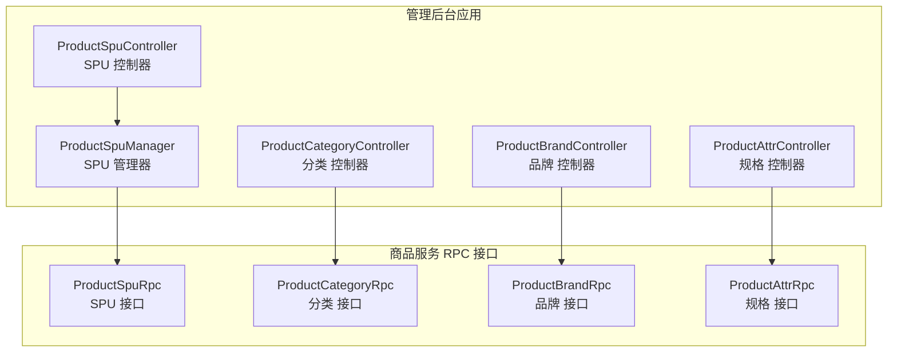
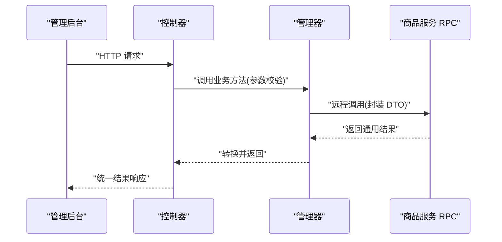
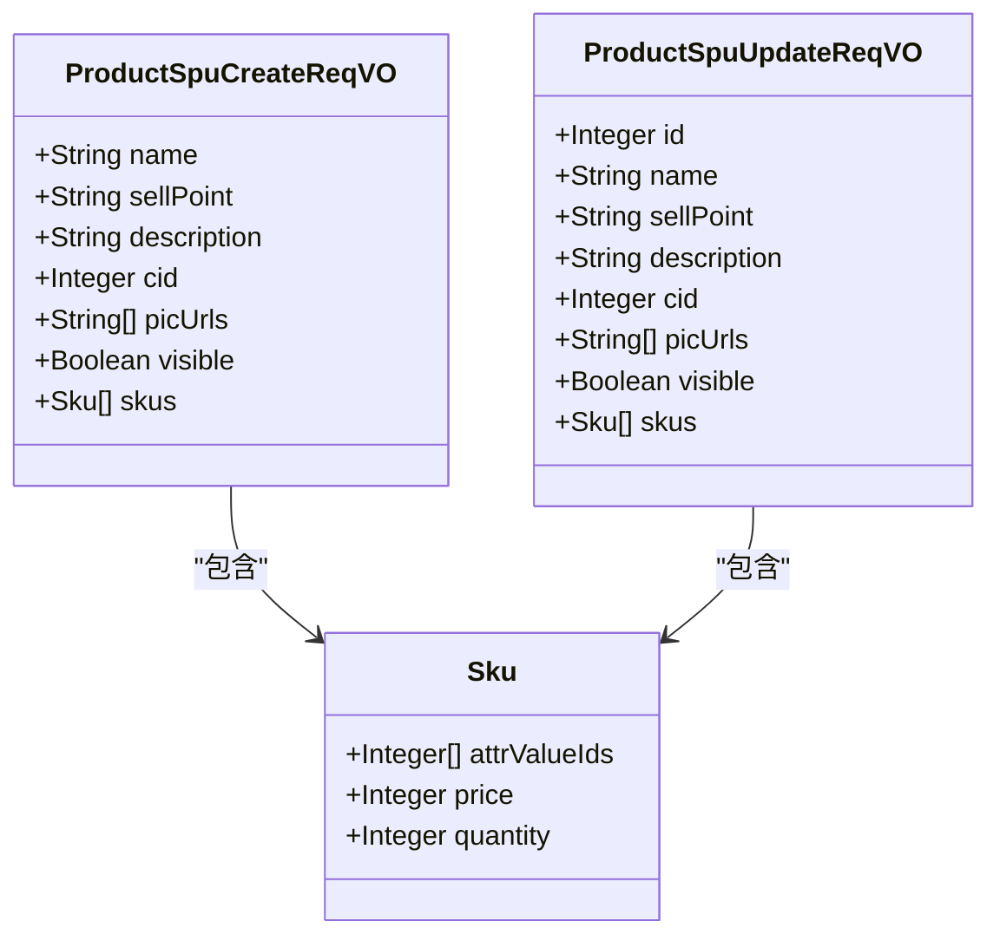
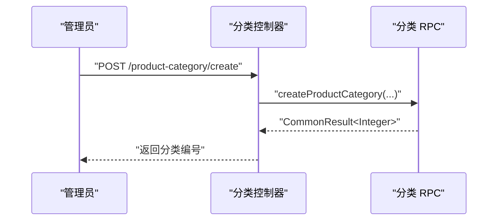
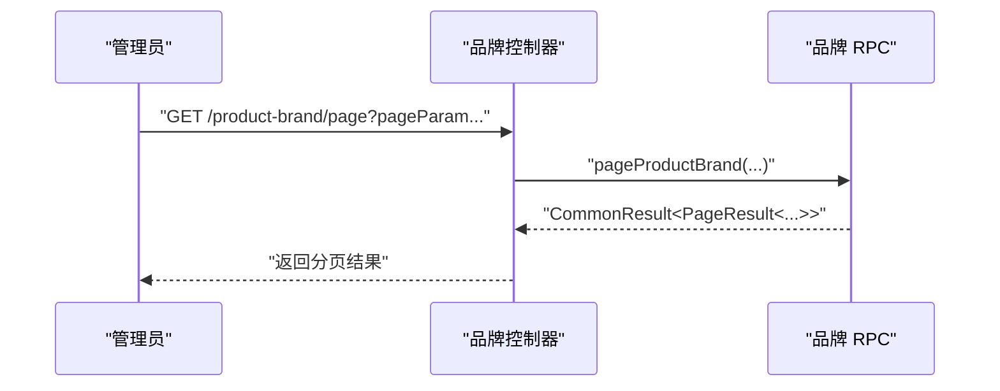
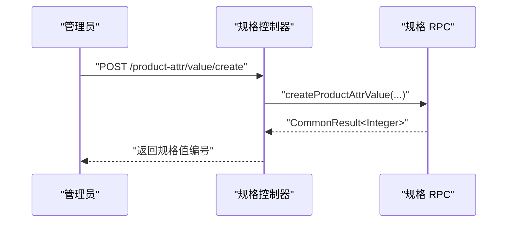
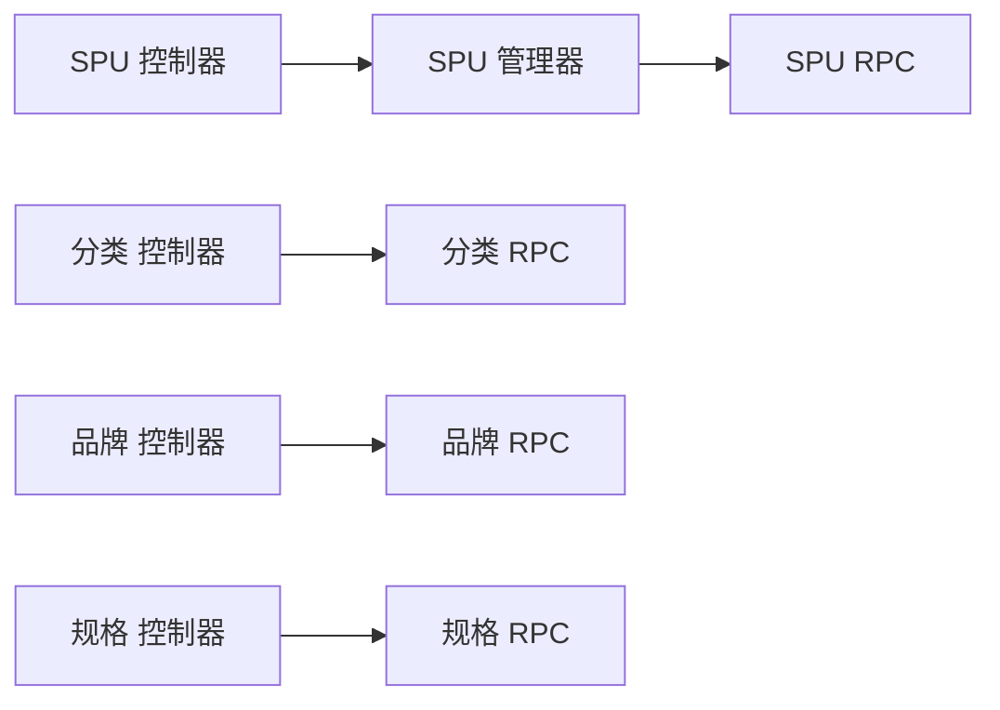

# 商品管理

<cite>
**本文引用的文件**
- [ProductSpuController.java](file://management-web-app/src/main/java/cn/iocoder/mall/managementweb/controller/product/ProductSpuController.java)
- [ProductCategoryController.java](file://management-web-app/src/main/java/cn/iocoder/mall/managementweb/controller/product/ProductCategoryController.java)
- [ProductBrandController.java](file://management-web-app/src/main/java/cn/iocoder/mall/managementweb/controller/product/ProductBrandController.java)
- [ProductAttrController.java](file://management-web-app/src/main/java/cn/iocoder/mall/managementweb/controller/product/ProductAttrController.java)
- [ProductSpuCreateReqVO.java](file://management-web-app/src/main/java/cn/iocoder/mall/managementweb/controller/product/vo/spu/ProductSpuCreateReqVO.java)
- [ProductSpuUpdateReqVO.java](file://management-web-app/src/main/java/cn/iocoder/mall/managementweb/controller/product/vo/spu/ProductSpuUpdateReqVO.java)
- [ProductSpuPageReqVO.java](file://management-web-app/src/main/java/cn/iocoder/mall/managementweb/controller/product/vo/spu/ProductSpuPageReqVO.java)
- [ProductSpuManager.java](file://management-web-app/src/main/java/cn/iocoder/mall/managementweb/manager/product/ProductSpuManager.java)
- [ProductSpuRpc.java](file://product-service-project/product-service-api/src/main/java/cn/iocoder/mall/productservice/rpc/spu/ProductSpuRpc.java)
- [ProductCategoryRpc.java](file://product-service-project/product-service-api/src/main/java/cn/iocoder/mall/productservice/rpc/category/ProductCategoryRpc.java)
- [ProductBrandRpc.java](file://product-service-project/product-service-api/src/main/java/cn/iocoder/mall/productservice/rpc/brand/ProductBrandRpc.java)
- [ProductAttrRpc.java](file://product-service-project/product-service-api/src/main/java/cn/iocoder/mall/productservice/rpc/attr/ProductAttrRpc.java)
</cite>

## 目录
1. [简介](#简介)
2. [项目结构](#项目结构)
3. [核心组件](#核心组件)
4. [架构总览](#架构总览)
5. [详细组件分析](#详细组件分析)
6. [依赖分析](#依赖分析)
7. [性能考虑](#性能考虑)
8. [故障排查指南](#故障排查指南)
9. [结论](#结论)
10. [附录](#附录)

## 简介
本技术文档围绕管理后台的商品管理体系展开，覆盖 SPU 管理、SKU 规格管理、商品分类管理、品牌管理、属性（规格键/值）管理等核心功能。文档从控制器职责、数据模型关系、操作流程、图片上传与规格设置、价格管理到界面与 API 设计进行系统化说明，并提供可视化图示帮助理解。

## 项目结构
管理后台商品模块由“控制层（Controller）—管理器（Manager）—RPC 接口（ProductService）”三层构成，采用 Dubbo 进行远程调用，统一返回封装在通用结果对象中，便于前端统一处理。

图表来源
- [ProductSpuController.java:25-28](file://management-web-app/src/main/java/cn/iocoder/mall/managementweb/controller/product/ProductSpuController.java#L25-L28)
- [ProductCategoryController.java:24-27](file://management-web-app/src/main/java/cn/iocoder/mall/managementweb/controller/product/ProductCategoryController.java#L24-L27)
- [ProductBrandController.java:26-29](file://management-web-app/src/main/java/cn/iocoder/mall/managementweb/controller/product/ProductBrandController.java#L26-L29)
- [ProductAttrController.java:23-26](file://management-web-app/src/main/java/cn/iocoder/mall/managementweb/controller/product/ProductAttrController.java#L23-L26)
- [ProductSpuManager.java:20-21](file://management-web-app/src/main/java/cn/iocoder/mall/managementweb/manager/product/ProductSpuManager.java#L20-L21)

章节来源
- [ProductSpuController.java:1-75](file://management-web-app/src/main/java/cn/iocoder/mall/managementweb/controller/product/ProductSpuController.java#L1-L75)
- [ProductCategoryController.java:1-65](file://management-web-app/src/main/java/cn/iocoder/mall/managementweb/controller/product/ProductCategoryController.java#L1-L65)
- [ProductBrandController.java:1-83](file://management-web-app/src/main/java/cn/iocoder/mall/managementweb/controller/product/ProductBrandController.java#L1-L83)
- [ProductAttrController.java:1-101](file://management-web-app/src/main/java/cn/iocoder/mall/managementweb/controller/product/ProductAttrController.java#L1-L101)

## 核心组件
- 控制器层：负责接收请求、参数校验、调用管理器并返回统一结果。
- 管理器层：负责参数转换、调用 RPC 接口、错误检查与结果转换。
- RPC 接口层：定义商品领域服务的远程接口，屏蔽具体实现。

章节来源
- [ProductSpuController.java:25-28](file://management-web-app/src/main/java/cn/iocoder/mall/managementweb/controller/product/ProductSpuController.java#L25-L28)
- [ProductSpuManager.java:20-21](file://management-web-app/src/main/java/cn/iocoder/mall/managementweb/manager/product/ProductSpuManager.java#L20-L21)
- [ProductSpuRpc.java:13-13](file://product-service-project/product-service-api/src/main/java/cn/iocoder/mall/productservice/rpc/spu/ProductSpuRpc.java#L13-L13)

## 架构总览
管理后台通过控制器暴露 REST 接口，内部以 Dubbo 调用商品服务 RPC 接口，实现商品数据的增删改查与分页检索。所有接口返回统一的结果包装对象，便于前端处理。

图表来源
- [ProductSpuController.java:34-38](file://management-web-app/src/main/java/cn/iocoder/mall/managementweb/controller/product/ProductSpuController.java#L34-L38)
- [ProductSpuManager.java:32-36](file://management-web-app/src/main/java/cn/iocoder/mall/managementweb/manager/product/ProductSpuManager.java#L32-L36)
- [ProductSpuRpc.java:21-21](file://product-service-project/product-service-api/src/main/java/cn/iocoder/mall/productservice/rpc/spu/ProductSpuRpc.java#L21-L21)

## 详细组件分析

### SPU 管理
- 控制器职责
  - 提供创建、更新、单个/批量查询、分页查询等接口。
  - 对可见性与库存状态进行语义化分页过滤。
- 数据模型
  - SPU 包含基础信息（名称、卖点、描述、分类、主图）、可见性标记以及 SKU 列表。
  - SKU 包含规格值 ID 数组、价格（分）、库存数量。
- 操作流程
  - 创建：提交 SPU+SKU 信息，服务端生成 SPU 并批量创建 SKU。
  - 更新：支持修改 SPU 基础信息与 SKU 价格/库存。
  - 查询：支持按 ID、ID 列表、分页查询；分页支持名称/分类/可见性/库存筛选。
- 图片上传与规格设置
  - 主图地址为字符串列表，支持多图；规格值通过 attrValueIds 指定。
- 价格管理
  - 价格以“分”为最小单位，存在最小值约束。
- API 设计要点
  - 统一使用 CommonResult 包装返回。
  - 分页基于 PageParam 扩展，支持多字段筛选。

图表来源
- [ProductSpuCreateReqVO.java:14-74](file://management-web-app/src/main/java/cn/iocoder/mall/managementweb/controller/product/vo/spu/ProductSpuCreateReqVO.java#L14-L74)
- [ProductSpuUpdateReqVO.java:14-78](file://management-web-app/src/main/java/cn/iocoder/mall/managementweb/controller/product/vo/spu/ProductSpuUpdateReqVO.java#L14-L78)

章节来源
- [ProductSpuController.java:25-74](file://management-web-app/src/main/java/cn/iocoder/mall/managementweb/controller/product/ProductSpuController.java#L25-L74)
- [ProductSpuCreateReqVO.java:14-74](file://management-web-app/src/main/java/cn/iocoder/mall/managementweb/controller/product/vo/spu/ProductSpuCreateReqVO.java#L14-L74)
- [ProductSpuUpdateReqVO.java:14-78](file://management-web-app/src/main/java/cn/iocoder/mall/managementweb/controller/product/vo/spu/ProductSpuUpdateReqVO.java#L14-L78)
- [ProductSpuPageReqVO.java:12-23](file://management-web-app/src/main/java/cn/iocoder/mall/managementweb/controller/product/vo/spu/ProductSpuPageReqVO.java#L12-L23)
- [ProductSpuManager.java:20-85](file://management-web-app/src/main/java/cn/iocoder/mall/managementweb/manager/product/ProductSpuManager.java#L20-L85)
- [ProductSpuRpc.java:13-65](file://product-service-project/product-service-api/src/main/java/cn/iocoder/mall/productservice/rpc/spu/ProductSpuRpc.java#L13-L65)

### 商品分类管理
- 控制器职责
  - 提供创建、更新、删除、树形查询等接口。
  - 使用权限注解保护敏感操作。
- API 设计
  - 树形查询返回层级结构，便于前端渲染。
- 关系说明
  - 分类与 SPU 存在一对多关系（一个分类下可有多个 SPU）。

图表来源
- [ProductCategoryController.java:33-38](file://management-web-app/src/main/java/cn/iocoder/mall/managementweb/controller/product/ProductCategoryController.java#L33-L38)
- [ProductCategoryRpc.java:23-23](file://product-service-project/product-service-api/src/main/java/cn/iocoder/mall/productservice/rpc/category/ProductCategoryRpc.java#L23-L23)

章节来源
- [ProductCategoryController.java:24-65](file://management-web-app/src/main/java/cn/iocoder/mall/managementweb/controller/product/ProductCategoryController.java#L24-L65)
- [ProductCategoryRpc.java:15-62](file://product-service-project/product-service-api/src/main/java/cn/iocoder/mall/productservice/rpc/category/ProductCategoryRpc.java#L15-L62)

### 品牌管理
- 控制器职责
  - 提供创建、更新、删除、单个/批量/分页查询等接口。
- API 设计
  - 支持按品牌 ID 列表批量获取详情。
  - 分页查询支持品牌维度筛选。

图表来源
- [ProductBrandController.java:75-80](file://management-web-app/src/main/java/cn/iocoder/mall/managementweb/controller/product/ProductBrandController.java#L75-L80)
- [ProductBrandRpc.java:55-61](file://product-service-project/product-service-api/src/main/java/cn/iocoder/mall/productservice/rpc/brand/ProductBrandRpc.java#L55-L61)

章节来源
- [ProductBrandController.java:26-83](file://management-web-app/src/main/java/cn/iocoder/mall/managementweb/controller/product/ProductBrandController.java#L26-L83)
- [ProductBrandRpc.java:15-63](file://product-service-project/product-service-api/src/main/java/cn/iocoder/mall/productservice/rpc/brand/ProductBrandRpc.java#L15-L63)

### 属性（规格键/值）管理
- 控制器职责
  - 规格键：创建、更新、查询（单个/列表/分页）。
  - 规格值：创建、更新、查询（单个/列表），列表支持条件查询。
- 权限控制
  - 各接口均配置相应权限点，确保安全操作。
- 关系说明
  - 规格键与规格值为一对多关系；SKU 的 attrValueIds 即指向规格值。

图表来源
- [ProductAttrController.java:70-75](file://management-web-app/src/main/java/cn/iocoder/mall/managementweb/controller/product/ProductAttrController.java#L70-L75)
- [ProductAttrRpc.java:54-58](file://product-service-project/product-service-api/src/main/java/cn/iocoder/mall/productservice/rpc/attr/ProductAttrRpc.java#L54-L58)

章节来源
- [ProductAttrController.java:23-101](file://management-web-app/src/main/java/cn/iocoder/mall/managementweb/controller/product/ProductAttrController.java#L23-L101)
- [ProductAttrRpc.java:12-85](file://product-service-project/product-service-api/src/main/java/cn/iocoder/mall/productservice/rpc/attr/ProductAttrRpc.java#L12-L85)

## 依赖分析
- 控制器依赖管理器；管理器依赖对应 RPC 接口；RPC 接口定义服务契约。
- 统一返回封装：所有 RPC 返回均被包装为通用结果对象，便于上层处理。
- 参数转换：管理器负责将 VO 转换为 DTO 再调用 RPC。

图表来源
- [ProductSpuController.java:25-28](file://management-web-app/src/main/java/cn/iocoder/mall/managementweb/controller/product/ProductSpuController.java#L25-L28)
- [ProductSpuManager.java:20-21](file://management-web-app/src/main/java/cn/iocoder/mall/managementweb/manager/product/ProductSpuManager.java#L20-L21)
- [ProductSpuRpc.java:13-13](file://product-service-project/product-service-api/src/main/java/cn/iocoder/mall/productservice/rpc/spu/ProductSpuRpc.java#L13-L13)

章节来源
- [ProductSpuManager.java:20-85](file://management-web-app/src/main/java/cn/iocoder/mall/managementweb/manager/product/ProductSpuManager.java#L20-L85)

## 性能考虑
- 分页查询：建议结合索引字段（如分类、可见性、库存）进行筛选，避免全表扫描。
- 批量查询：优先使用 ID 列表批量获取，减少多次 RPC 调用。
- 图片存储：主图地址为 URL 列表，建议配合 CDN 与懒加载优化首屏性能。
- 规格值缓存：规格键/值查询频繁时，可在管理器层增加轻量缓存以降低 RPC 压力。

## 故障排查指南
- 统一异常处理：管理器在调用 RPC 后执行错误检查，若出现异常将抛出统一错误结果。
- 常见问题定位
  - 参数校验失败：检查 VO 中注解约束（非空、最小值等）。
  - 权限不足：确认控制器上的权限注解与系统权限配置一致。
  - RPC 调用失败：检查服务注册与发现、网络连通性及版本配置。

章节来源
- [ProductSpuManager.java:32-36](file://management-web-app/src/main/java/cn/iocoder/mall/managementweb/manager/product/ProductSpuManager.java#L32-L36)
- [ProductSpuManager.java:43-46](file://management-web-app/src/main/java/cn/iocoder/mall/managementweb/manager/product/ProductSpuManager.java#L43-L46)
- [ProductSpuManager.java:54-58](file://management-web-app/src/main/java/cn/iocoder/mall/managementweb/manager/product/ProductSpuManager.java#L54-L58)

## 结论
本商品管理模块以清晰的分层架构实现了 SPU、SKU、分类、品牌与属性的全链路管理能力。通过统一的控制器与管理器抽象，结合 Dubbo RPC 接口，既保证了扩展性，也提升了维护效率。后续可在缓存、分页索引与图片处理等方面进一步优化。

## 附录

### API 接口清单（节选）
- SPU
  - POST /product-spu/create：创建 SPU（携带 SKU 列表）
  - POST /product-spu/update：更新 SPU
  - GET /product-spu/get?productSpuId=...：获取单个 SPU
  - GET /product-spu/list?productSpuIds=...：批量获取 SPU
  - GET /product-spu/page：分页查询 SPU（支持名称/分类/可见性/库存筛选）
- 分类
  - POST /product-category/create：创建分类
  - POST /product-category/update：更新分类
  - POST /product-category/delete?productCategoryId=...：删除分类
  - GET /product-category/tree：获取树形分类
- 品牌
  - POST /product-brand/create：创建品牌
  - POST /product-brand/update：更新品牌
  - POST /product-brand/delete?productBrandId=...：删除品牌
  - GET /product-brand/get?productBrandId=...：获取单个品牌
  - GET /product-brand/list?productBrandIds=...：批量获取品牌
  - GET /product-brand/page：分页查询品牌
- 规格
  - POST /product-attr/key/create：创建规格键
  - POST /product-attr/key/update：更新规格键
  - GET /product-attr/key/get?productAttrKeyId=...：获取规格键
  - GET /product-attr/key/list?productAttrKeyIds=...：批量获取规格键
  - GET /product-attr/key/page：分页查询规格键
  - POST /product-attr/value/create：创建规格值
  - POST /product-attr/value/update：更新规格值
  - GET /product-attr/value/get?productAttrValueId=...：获取规格值
  - GET /product-attr/value/list：按条件查询规格值列表

章节来源
- [ProductSpuController.java:34-74](file://management-web-app/src/main/java/cn/iocoder/mall/managementweb/controller/product/ProductSpuController.java#L34-L74)
- [ProductCategoryController.java:33-62](file://management-web-app/src/main/java/cn/iocoder/mall/managementweb/controller/product/ProductCategoryController.java#L33-L62)
- [ProductBrandController.java:35-81](file://management-web-app/src/main/java/cn/iocoder/mall/managementweb/controller/product/ProductBrandController.java#L35-L81)
- [ProductAttrController.java:32-100](file://management-web-app/src/main/java/cn/iocoder/mall/managementweb/controller/product/ProductAttrController.java#L32-L100)